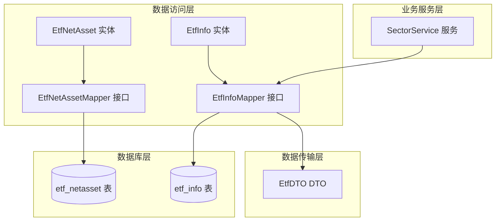
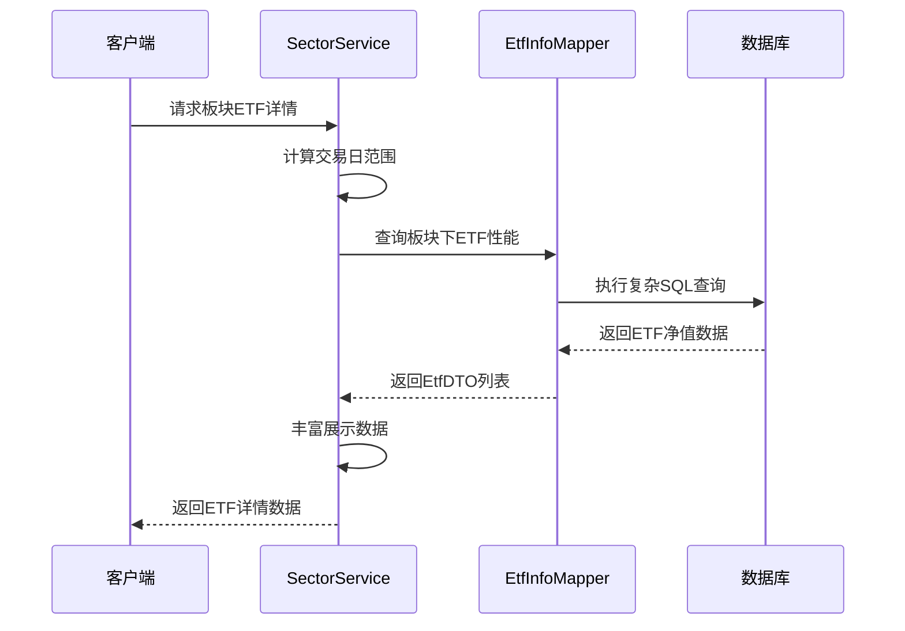
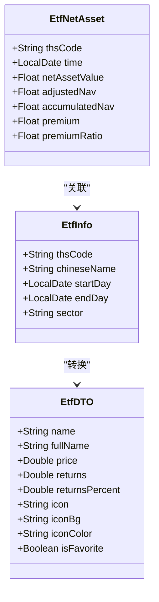

# ETF净值实体模型

<cite>
**本文档引用的文件**
- [EtfNetAsset.java](file://backend/src/main/java/com/freetrader/entity/EtfNetAsset.java)
- [EtfInfo.java](file://backend/src/main/java/com/freetrader/entity/EtfInfo.java)
- [EtfNetAssetMapper.java](file://backend/src/main/java/com/freetrader/mapper/EtfNetAssetMapper.java)
- [EtfInfoMapper.java](file://backend/src/main/java/com/freetrader/mapper/EtfInfoMapper.java)
- [SectorService.java](file://backend/src/main/java/com/freetrader/service/SectorService.java)
- [EtfDTO.java](file://backend/src/main/java/com/freetrader/dto/EtfDTO.java)
- [etf_netasset.sql](file://sql/etf_netasset.sql)
- [etf_info.sql](file://sql/etf_info.sql)
</cite>

## 目录
1. [简介](#简介)
2. [项目结构](#项目结构)
3. [核心组件](#核心组件)
4. [架构概览](#架构概览)
5. [详细组件分析](#详细组件分析)
6. [依赖关系分析](#依赖关系分析)
7. [性能考虑](#性能考虑)
8. [故障排除指南](#故障排除指南)
9. [结论](#结论)

## 简介

ETF净值实体(EtfNetAsset)是FreeTrader项目中用于存储和管理ETF净值数据的核心数据模型。该实体负责记录ETF在特定日期的净值信息，包括单位净值、累计净值、复权净值以及贴水等相关指标。本文档将深入分析ETF净值实体的金融数据含义、业务用途、数据结构设计以及与其他组件的交互关系。

## 项目结构

FreeTrader项目采用标准的Spring Boot分层架构，ETF净值实体位于数据访问层，与MyBatis Plus框架集成，通过Mapper接口进行数据库操作。



**图表来源**
- [EtfNetAsset.java](file://backend/src/main/java/com/freetrader/entity/EtfNetAsset.java#L1-L26)
- [EtfInfo.java](file://backend/src/main/java/com/freetrader/entity/EtfInfo.java#L1-L24)
- [EtfNetAssetMapper.java](file://backend/src/main/java/com/freetrader/mapper/EtfNetAssetMapper.java#L1-L10)
- [EtfInfoMapper.java](file://backend/src/main/java/com/freetrader/mapper/EtfInfoMapper.java#L1-L53)

**章节来源**
- [EtfNetAsset.java](file://backend/src/main/java/com/freetrader/entity/EtfNetAsset.java#L1-L26)
- [EtfInfo.java](file://backend/src/main/java/com/freetrader/entity/EtfInfo.java#L1-L24)
- [EtfNetAssetMapper.java](file://backend/src/main/java/com/freetrader/mapper/EtfNetAssetMapper.java#L1-L10)
- [EtfInfoMapper.java](file://backend/src/main/java/com/freetrader/mapper/EtfInfoMapper.java#L1-L53)

## 核心组件

ETF净值实体模型由以下核心组件构成：

### 数据实体层
- **EtfNetAsset**: ETF净值数据实体，包含完整的净值信息字段
- **EtfInfo**: ETF基本信息实体，包含ETF的基本属性和分类信息
- **EtfDTO**: 数据传输对象，用于API响应和前端展示

### 数据访问层
- **EtfNetAssetMapper**: ETF净值数据访问接口，继承MyBatis Plus基础功能
- **EtfInfoMapper**: ETF信息数据访问接口，包含复杂的性能查询逻辑

### 业务服务层
- **SectorService**: 板块服务，负责ETF净值数据的业务处理和性能计算

**章节来源**
- [EtfNetAsset.java](file://backend/src/main/java/com/freetrader/entity/EtfNetAsset.java#L1-L26)
- [EtfInfo.java](file://backend/src/main/java/com/freetrader/entity/EtfInfo.java#L1-L24)
- [EtfDTO.java](file://backend/src/main/java/com/freetrader/dto/EtfDTO.java#L1-L23)

## 架构概览

ETF净值实体在整个系统中的架构位置如下：



**图表来源**
- [SectorService.java](file://backend/src/main/java/com/freetrader/service/SectorService.java#L170-L212)
- [EtfInfoMapper.java](file://backend/src/main/java/com/freetrader/mapper/EtfInfoMapper.java#L18-L51)

**章节来源**
- [SectorService.java](file://backend/src/main/java/com/freetrader/service/SectorService.java#L170-L212)
- [EtfInfoMapper.java](file://backend/src/main/java/com/freetrader/mapper/EtfInfoMapper.java#L1-L53)

## 详细组件分析

### ETF净值实体(EtfNetAsset)

ETF净值实体是整个ETF数据模型的核心，负责存储每日的净值信息。

#### 核心字段定义

| 字段名 | 类型 | 描述 | 业务含义 |
|--------|------|------|----------|
| thsCode | String | 32字符 | ETF代码标识符，主键之一 |
| time | LocalDate | 日期 | 净值日期，主键之一 |
| netAssetValue | Float | 浮点数 | 单位净值，当日净值 |
| adjustedNav | Float | 浮点数 | 复权单位净值，考虑分红再投资 |
| accumulatedNav | Float | 浮点数 | 累计单位净值，历史累计值 |
| premium | Float | 浮点数 | 贴水，ETF价格与净值的差额 |
| premiumRatio | Float | 浮点数 | 贴水率，贴水占净值的百分比 |

#### 数据结构设计



**图表来源**
- [EtfNetAsset.java](file://backend/src/main/java/com/freetrader/entity/EtfNetAsset.java#L10-L25)
- [EtfInfo.java](file://backend/src/main/java/com/freetrader/entity/EtfInfo.java#L11-L23)
- [EtfDTO.java](file://backend/src/main/java/com/freetrader/dto/EtfDTO.java#L10-L22)

#### 金融数据含义

**单位净值(netAssetValue)**: ETF当日的净值价格，反映ETF份额的内在价值。这是投资者买卖ETF时的参考价格。

**复权单位净值(adjustedNav)**: 考虑了分红再投资后的净值，消除了分红对净值的影响，更准确地反映ETF的真实增值情况。

**累计单位净值(accumulatedNav)**: 自ETF成立以来的历史累计净值，用于长期趋势分析。

**贴水(premium)**: ETF市场价格与净值之间的差额，正值表示溢价，负值表示贴水。

**贴水率(premiumRatio)**: 贴水占净值的百分比，衡量ETF折溢价程度的重要指标。

**章节来源**
- [EtfNetAsset.java](file://backend/src/main/java/com/freetrader/entity/EtfNetAsset.java#L1-L26)
- [etf_netasset.sql](file://sql/etf_netasset.sql#L27-L31)

### ETF信息实体(EtfInfo)

ETF信息实体提供ETF的基本属性和分类信息。

#### 字段定义

| 字段名 | 类型 | 描述 | 业务含义 |
|--------|------|------|----------|
| thsCode | String | 32字符 | ETF代码，主键 |
| chineseName | String | 64字符 | 中文名称 |
| startDay | LocalDate | 日期 | ETF成立日期 |
| endDay | LocalDate | 日期 | ETF终止日期 |
| sector | String | 32字符 | 所属行业板块 |

**章节来源**
- [EtfInfo.java](file://backend/src/main/java/com/freetrader/entity/EtfInfo.java#L1-L24)
- [etf_info.sql](file://sql/etf_info.sql#L25-L29)

### 数据访问层

#### EtfNetAssetMapper

继承MyBatis Plus的BaseMapper，提供标准的CRUD操作。

#### EtfInfoMapper

提供复杂的性能查询功能，包括：

```sql
SELECT 
    e.ths_code as name,
    e.chinese_name as fullName,
    COALESCE(latest.net_asset_value, 0) as price,
    COALESCE(
        CASE 
            WHEN earliest.adjusted_nav > 0 
            THEN latest.adjusted_nav - earliest.adjusted_nav 
            ELSE 0 
        END, 
        0
    ) as returns,
    COALESCE(
        CASE 
            WHEN earliest.adjusted_nav > 0 
            THEN (latest.adjusted_nav - earliest.adjusted_nav) / earliest.adjusted_nav * 100 
            ELSE 0 
        END, 
        0
    ) as returnsPercent
FROM etf_info e
LEFT JOIN etf_netasset latest ON latest.ths_code = e.ths_code AND latest.time = #{latestDay}
LEFT JOIN etf_netasset earliest ON earliest.ths_code = e.ths_code AND earliest.time = #{earliestDay}
WHERE e.sector = #{sectorName}
ORDER BY returnsPercent DESC
LIMIT #{topN}
```

**章节来源**
- [EtfNetAssetMapper.java](file://backend/src/main/java/com/freetrader/mapper/EtfNetAssetMapper.java#L1-L10)
- [EtfInfoMapper.java](file://backend/src/main/java/com/freetrader/mapper/EtfInfoMapper.java#L18-L51)

### 业务服务层

#### SectorService

负责ETF净值数据的业务处理，包括：

1. **交易日范围计算**: 根据配置参数计算最近的交易日范围
2. **性能数据计算**: 通过SQL查询计算ETF的收益和收益率
3. **数据丰富化**: 为ETF数据添加图标、颜色等展示属性
4. **缓存机制**: 使用@Cacheable注解缓存板块详情

**章节来源**
- [SectorService.java](file://backend/src/main/java/com/freetrader/service/SectorService.java#L170-L212)

## 依赖关系分析

ETF净值实体的依赖关系图：

```mermaid
graph TD
EtfNetAsset[EtfNetAsset 实体] --> EtfNetAssetMapper[EtfNetAssetMapper]
EtfInfo[EtfInfo 实体] --> EtfInfoMapper[EtfInfoMapper]
EtfInfoMapper --> EtfDTO[EtfDTO]
SectorService[SectorService] --> EtfInfoMapper
EtfNetAssetMapper --> NetAssetTable[etf_netasset 表]
EtfInfoMapper --> InfoTable[etf_info 表]
EtfNetAsset -.-> EtfInfo : "通过thsCode关联"
EtfInfo -.-> EtfDTO : "数据转换"
SectorService -.-> EtfDTO : "业务处理"
```

**图表来源**
- [EtfNetAsset.java](file://backend/src/main/java/com/freetrader/entity/EtfNetAsset.java#L12-L14)
- [EtfInfo.java](file://backend/src/main/java/com/freetrader/entity/EtfInfo.java#L13-L14)
- [EtfInfoMapper.java](file://backend/src/main/java/com/freetrader/mapper/EtfInfoMapper.java#L39-L41)

**章节来源**
- [EtfNetAsset.java](file://backend/src/main/java/com/freetrader/entity/EtfNetAsset.java#L1-L26)
- [EtfInfo.java](file://backend/src/main/java/com/freetrader/entity/EtfInfo.java#L1-L24)
- [EtfInfoMapper.java](file://backend/src/main/java/com/freetrader/mapper/EtfInfoMapper.java#L1-L53)

## 性能考虑

### 数据库优化

1. **复合主键设计**: `(ths_code, time)`确保每个ETF每天只有一条净值记录
2. **索引优化**: 
   - 主键索引支持快速查找
   - `idx_etf_time`索引支持按时间范围查询
   - `idx_etf_id`和`idx_etf_category`索引支持ETF信息查询

### 缓存策略

1. **服务层缓存**: `@Cacheable`注解缓存板块详情，减少数据库查询
2. **配置参数**: 
   - `app.trading-days`: 默认交易日天数(默认7天)
   - `app.top-funds`: 默认显示ETF数量(默认10只)

### 查询优化

1. **左连接查询**: 使用LEFT JOIN确保即使没有净值数据也能返回ETF基本信息
2. **COALESCE函数**: 处理NULL值，确保计算结果的稳定性
3. **条件计算**: 只有当earliest.adjusted_nav > 0时才进行收益计算

**章节来源**
- [etf_netasset.sql](file://sql/etf_netasset.sql#L32-L33)
- [SectorService.java](file://backend/src/main/java/com/freetrader/service/SectorService.java#L38-L42)

## 故障排除指南

### 常见问题及解决方案

#### 1. 净值数据缺失
**症状**: ETF净值查询返回NULL或0值
**原因**: 
- 数据库中缺少对应日期的净值记录
- ETF刚上市，尚未产生净值数据
**解决方案**:
- 检查数据库中是否存在对应的ETF代码和日期记录
- 确认数据导入流程是否完整

#### 2. 性能计算异常
**症状**: ETF收益计算结果为0或异常值
**原因**:
- earliest.adjusted_nav为NULL或0
- ETF净值数据不完整
**解决方案**:
- 检查ETF的起始日期是否有有效的净值数据
- 确认交易日范围计算是否正确

#### 3. 关联查询失败
**症状**: ETF信息无法正确关联到净值数据
**原因**:
- ths_code字段不匹配
- 数据类型不一致
**解决方案**:
- 检查两个表中ths_code字段的格式和长度
- 确认数据导入时的字段映射

**章节来源**
- [EtfInfoMapper.java](file://backend/src/main/java/com/freetrader/mapper/EtfInfoMapper.java#L23-L38)
- [SectorService.java](file://backend/src/main/java/com/freetrader/service/SectorService.java#L180-L184)

## 结论

ETF净值实体(EtfNetAsset)作为FreeTrader项目的核心数据模型，通过精心设计的字段结构和关联关系，为ETF净值数据的存储、查询和分析提供了坚实的基础。该模型不仅满足了基本的净值数据存储需求，还通过复权净值、贴水等高级指标，为用户提供了更丰富的投资分析工具。

### 主要优势

1. **完整的金融指标**: 包含单位净值、复权净值、累计净值等关键指标
2. **高效的查询性能**: 通过合理的索引设计和缓存策略提升查询效率
3. **灵活的业务扩展**: 支持多种ETF分析场景和性能计算需求
4. **稳定的关联关系**: 通过外键约束确保数据的一致性和完整性

### 应用场景

- ETF净值数据展示和图表可视化
- 板块内ETF排名和性能比较
- 投资者决策支持和趋势分析
- 实时行情监控和预警机制

该ETF净值实体模型为构建专业的ETF投资分析平台奠定了坚实的数据基础，为用户提供准确、及时、全面的ETF净值信息服务。