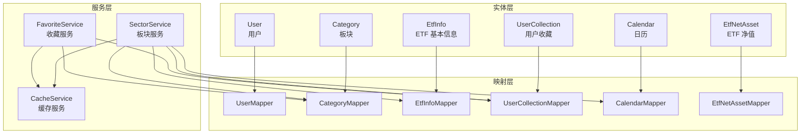
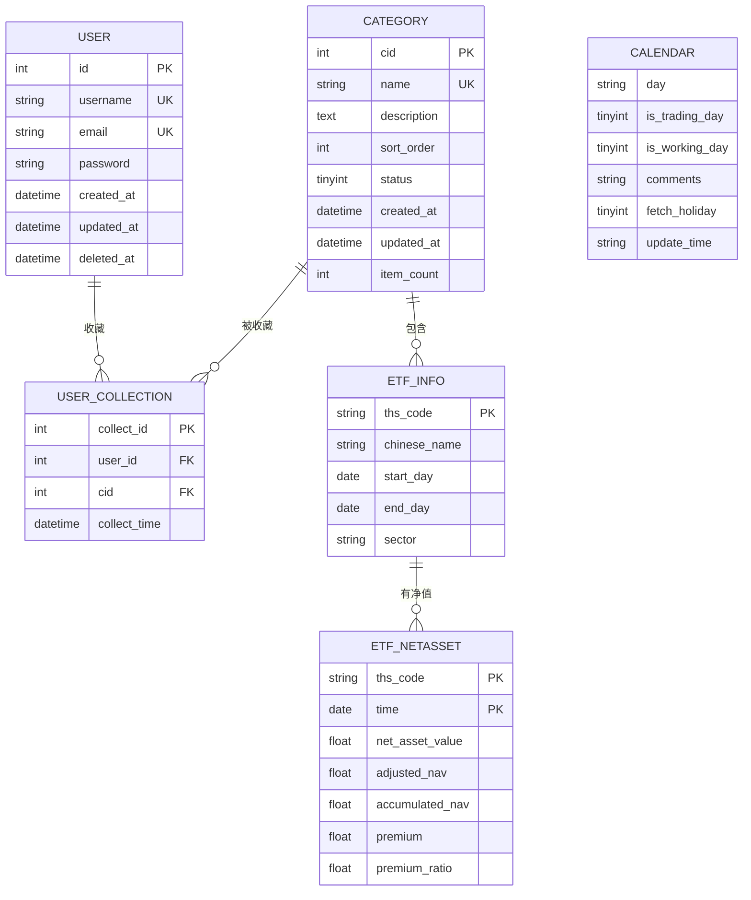
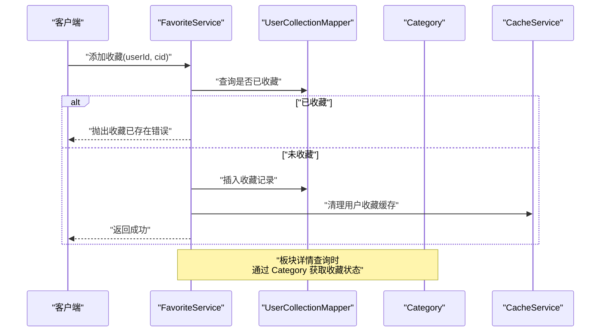
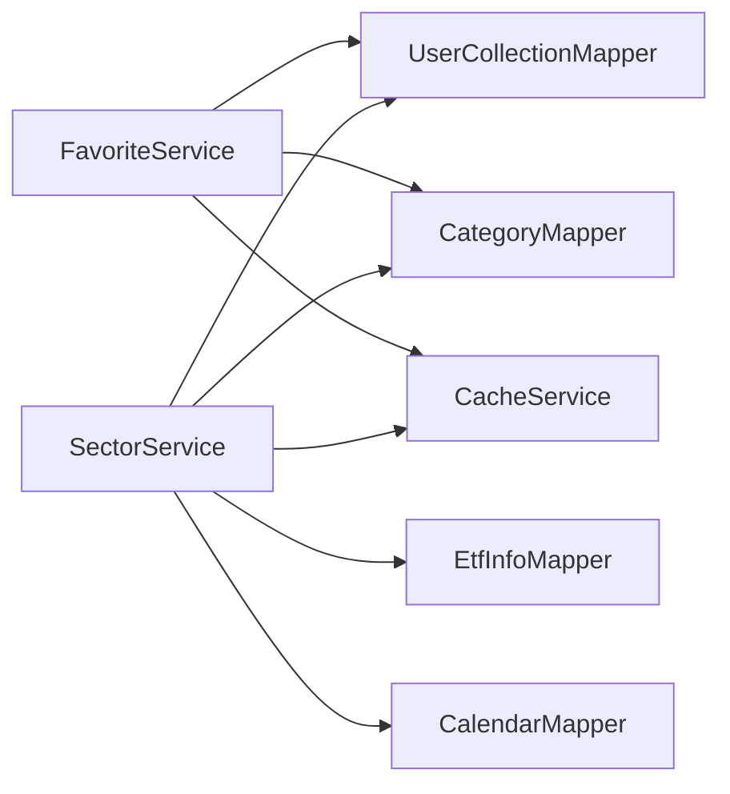

# 数据模型设计

<cite>
**本文引用的文件**
- [User.java](file://backend/src/main/java/com/freetrader/entity/User.java)
- [Category.java](file://backend/src/main/java/com/freetrader/entity/Category.java)
- [EtfInfo.java](file://backend/src/main/java/com/freetrader/entity/EtfInfo.java)
- [UserCollection.java](file://backend/src/main/java/com/freetrader/entity/UserCollection.java)
- [Calendar.java](file://backend/src/main/java/com/freetrader/entity/Calendar.java)
- [EtfNetAsset.java](file://backend/src/main/java/com/freetrader/entity/EtfNetAsset.java)
- [user_info.sql](file://sql/user_info.sql)
- [category.sql](file://sql/category.sql)
- [etf_info.sql](file://sql/etf_info.sql)
- [user_collection.sql](file://sql/user_collection.sql)
- [calendar.sql](file://sql/calendar.sql)
- [etf_netasset.sql](file://sql/etf_netasset.sql)
- [FavoriteService.java](file://backend/src/main/java/com/freetrader/service/FavoriteService.java)
- [SectorService.java](file://backend/src/main/java/com/freetrader/service/SectorService.java)
- [UserCollectionMapper.java](file://backend/src/main/java/com/freetrader/mapper/UserCollectionMapper.java)
</cite>

## 目录
1. [简介](#简介)
2. [项目结构](#项目结构)
3. [核心组件](#核心组件)
4. [架构总览](#架构总览)
5. [详细组件分析](#详细组件分析)
6. [依赖关系分析](#依赖关系分析)
7. [性能考量](#性能考量)
8. [故障排查指南](#故障排查指南)
9. [结论](#结论)

## 简介
本文件系统性梳理 FreeTrader 的数据模型设计，覆盖用户、板块、ETF、收藏、日历与 ETF 净值六大实体，明确各实体的字段定义、业务含义、约束条件与相互关系；并结合服务层与映射层的调用流程，给出数据流转说明与验证规则，帮助开发者与产品人员快速理解与使用。

## 项目结构
后端采用分层架构：实体层（Entity）、映射层（Mapper）、服务层（Service）、控制层（Controller）。数据模型由实体类与数据库表一一对应，MyBatis-Plus 注解负责表名与主键策略映射；服务层封装业务逻辑，处理缓存、校验与事务；映射层提供基础 CRUD 与定制查询。

图表来源
- [User.java](file://backend/src/main/java/com/freetrader/entity/User.java#L10-L28)
- [Category.java](file://backend/src/main/java/com/freetrader/entity/Category.java#L11-L44)
- [EtfInfo.java](file://backend/src/main/java/com/freetrader/entity/EtfInfo.java#L9-L23)
- [UserCollection.java](file://backend/src/main/java/com/freetrader/entity/UserCollection.java#L10-L22)
- [Calendar.java](file://backend/src/main/java/com/freetrader/entity/Calendar.java#L6-L21)
- [EtfNetAsset.java](file://backend/src/main/java/com/freetrader/entity/EtfNetAsset.java#L8-L25)
- [UserCollectionMapper.java](file://backend/src/main/java/com/freetrader/mapper/UserCollectionMapper.java#L11-L18)
- [FavoriteService.java](file://backend/src/main/java/com/freetrader/service/FavoriteService.java#L23-L118)
- [SectorService.java](file://backend/src/main/java/com/freetrader/service/SectorService.java#L27-L252)

章节来源
- [User.java](file://backend/src/main/java/com/freetrader/entity/User.java#L1-L29)
- [Category.java](file://backend/src/main/java/com/freetrader/entity/Category.java#L1-L45)
- [EtfInfo.java](file://backend/src/main/java/com/freetrader/entity/EtfInfo.java#L1-L24)
- [UserCollection.java](file://backend/src/main/java/com/freetrader/entity/UserCollection.java#L1-L23)
- [Calendar.java](file://backend/src/main/java/com/freetrader/entity/Calendar.java#L1-L22)
- [EtfNetAsset.java](file://backend/src/main/java/com/freetrader/entity/EtfNetAsset.java#L1-L26)

## 核心组件
- 用户实体（User）
  - 字段：id、username、email、password、createdAt、updatedAt、deletedAt
  - 约束：用户名与邮箱唯一；软删除字段 deletedAt 支持逻辑删除
  - 业务含义：承载用户身份与认证凭据，支持注册、登录与权限体系
- 板块实体（Category）
  - 字段：cid、name、description、sortOrder、status、createdAt、updatedAt、itemCount
  - 约束：名称唯一；status 用于逻辑启停；itemCount 记录该板块下的 ETF 数量
  - 业务含义：对 ETF 进行分类管理，支持排序与状态控制
- ETF 基本信息实体（EtfInfo）
  - 字段：thsCode、chineseName、startDay、endDay、sector
  - 约束：thsCode 主键；sector 与板块联动
  - 业务含义：描述 ETF 的基本信息与所属板块
- 用户收藏实体（UserCollection）
  - 字段：collectId、userId、cid、collectTime
  - 约束：用户与板块的唯一组合；级联删除保证数据一致性
  - 业务含义：记录用户对板块的收藏关系
- 日历实体（Calendar）
  - 字段：day、isTradingDay、isWorkingDay、comments、fetchHoliday、updateTime
  - 业务含义：提供交易日与工作日判断，支撑板块收益统计的时间窗口
- ETF 净值实体（EtfNetAsset）
  - 字段：thsCode、time、netAssetValue、adjustedNav、accumulatedNav、premium、premiumRatio
  - 约束：复合主键（thsCode、time）
  - 业务含义：记录 ETF 在特定日期的净值与折溢价指标

章节来源
- [User.java](file://backend/src/main/java/com/freetrader/entity/User.java#L10-L28)
- [Category.java](file://backend/src/main/java/com/freetrader/entity/Category.java#L11-L44)
- [EtfInfo.java](file://backend/src/main/java/com/freetrader/entity/EtfInfo.java#L9-L23)
- [UserCollection.java](file://backend/src/main/java/com/freetrader/entity/UserCollection.java#L10-L22)
- [Calendar.java](file://backend/src/main/java/com/freetrader/entity/Calendar.java#L6-L21)
- [EtfNetAsset.java](file://backend/src/main/java/com/freetrader/entity/EtfNetAsset.java#L8-L25)

## 架构总览
数据模型围绕“用户—板块—ETF—收藏—日历—净值”的链路展开，板块与 ETF 通过 sector 关联，用户通过收藏关联板块；服务层在查询板块详情与收藏状态时，会结合日历与净值数据进行聚合与展示增强。

图表来源
- [user_info.sql](file://sql/user_info.sql#L24-L35)
- [category.sql](file://sql/category.sql#L24-L36)
- [etf_info.sql](file://sql/etf_info.sql#L24-L33)
- [user_collection.sql](file://sql/user_collection.sql#L24-L34)
- [calendar.sql](file://sql/calendar.sql#L24-L31)
- [etf_netasset.sql](file://sql/etf_netasset.sql#L24-L34)

## 详细组件分析

### 用户实体（User）
- 设计要点
  - 主键自增 id，配合 MyBatis-Plus 注解映射 user_info 表
  - username 与 email 唯一索引，防止重复注册
  - 软删除字段 deletedAt 支持逻辑删除，便于审计与恢复
- 业务约束
  - 必填字段：username、email、password
  - 时间字段：created_at 默认当前时间；updated_at 自动更新
- 数据流转
  - 登录/注册流程中读取与写入；安全上下文构建时使用
- 验证规则
  - 唯一性：用户名与邮箱唯一
  - 非空性：核心字段必填
  - 密码：应加密存储，不在传输层明文暴露

章节来源
- [User.java](file://backend/src/main/java/com/freetrader/entity/User.java#L10-L28)
- [user_info.sql](file://sql/user_info.sql#L24-L35)

### 板块实体（Category）
- 设计要点
  - 主键 cid，名称唯一，支持排序与状态控制
  - 非持久化字段 avgChange、price、marketCap、isFavorite 用于聚合展示
  - itemCount 记录该板块 ETF 数量，触发器维护
- 业务约束
  - 名称唯一；status 1 启用，0 禁用
  - 排序权重 sort_order 控制前端展示顺序
- 数据流转
  - 板块列表查询时计算 avgChange；详情页返回 fundsCount（来自 itemCount）
- 验证规则
  - 唯一性：名称唯一
  - 索引优化：status 与 name 唯一索引

章节来源
- [Category.java](file://backend/src/main/java/com/freetrader/entity/Category.java#L11-L44)
- [category.sql](file://sql/category.sql#L24-L36)

### ETF 基本信息实体（EtfInfo）
- 设计要点
  - 主键 thsCode，chineseName 可选，startDay/endDay 描述 ETF 生命周期
  - sector 与板块名称关联，触发器自动维护板块 item_count
- 业务约束
  - 主键唯一；sector 变更时触发器同步更新板块计数
- 数据流转
  - 板块详情查询时按 sector 查询表现最佳 ETF
- 验证规则
  - 主键唯一；sector 非空时需确保板块存在或自动创建

章节来源
- [EtfInfo.java](file://backend/src/main/java/com/freetrader/entity/EtfInfo.java#L9-L23)
- [etf_info.sql](file://sql/etf_info.sql#L24-L33)

### 用户收藏实体（UserCollection）
- 设计要点
  - 主键 collectId，唯一索引 (user_id, cid) 防止重复收藏
  - 外键 user_id 引用 user_info(id)，外键 cid 引用 category(cid)，级联删除
- 业务约束
  - 用户与板块的多对多关系通过中间表实现
  - 收藏时间默认当前时间
- 数据流转
  - 收藏/取消收藏/切换收藏均通过服务层事务处理，并清理缓存
- 验证规则
  - 唯一性：同一用户不可重复收藏同一板块
  - 级联删除：用户或板块删除时自动清理相关收藏

章节来源
- [UserCollection.java](file://backend/src/main/java/com/freetrader/entity/UserCollection.java#L10-L22)
- [user_collection.sql](file://sql/user_collection.sql#L24-L34)
- [FavoriteService.java](file://backend/src/main/java/com/freetrader/service/FavoriteService.java#L46-L117)
- [UserCollectionMapper.java](file://backend/src/main/java/com/freetrader/mapper/UserCollectionMapper.java#L11-L18)

### 日历实体（Calendar）
- 设计要点
  - 字段命名与表结构一致，提供交易日与工作日标识
- 业务约束
  - 用于计算最近 N 个交易日区间，支撑板块收益统计
- 数据流转
  - SectorService 依据配置参数与日历表获取交易日范围

章节来源
- [Calendar.java](file://backend/src/main/java/com/freetrader/entity/Calendar.java#L6-L21)
- [calendar.sql](file://sql/calendar.sql#L24-L31)
- [SectorService.java](file://backend/src/main/java/com/freetrader/service/SectorService.java#L64-L76)

### ETF 净值实体（EtfNetAsset）
- 设计要点
  - 复合主键 (thsCode, time)，记录每日净值与折溢价指标
- 业务约束
  - 按日期维度聚合，支持复权与累计净值计算
- 数据流转
  - 板块详情与趋势计算依赖净值数据

章节来源
- [EtfNetAsset.java](file://backend/src/main/java/com/freetrader/entity/EtfNetAsset.java#L8-L25)
- [etf_netasset.sql](file://sql/etf_netasset.sql#L24-L34)

### 实体关系与数据流（序列图）
以下序列图展示“用户收藏板块”的典型流程，体现实体间的关系与服务层的协调：

图表来源
- [FavoriteService.java](file://backend/src/main/java/com/freetrader/service/FavoriteService.java#L46-L117)
- [UserCollectionMapper.java](file://backend/src/main/java/com/freetrader/mapper/UserCollectionMapper.java#L11-L18)
- [Category.java](file://backend/src/main/java/com/freetrader/entity/Category.java#L11-L44)

## 依赖关系分析
- 实体依赖
  - UserCollection 依赖 User 与 Category，形成用户—板块的多对多中间表
  - EtfInfo 依赖 Category（sector），通过触发器维护 item_count
  - EtfNetAsset 依赖 EtfInfo（thsCode），形成 ETF—净值的主外键关系
- 服务依赖
  - FavoriteService 依赖 UserCollectionMapper、CategoryMapper、CacheService
  - SectorService 依赖 CategoryMapper、EtfInfoMapper、CalendarMapper、UserCollectionMapper、CacheService
- 映射依赖
  - UserCollectionMapper 提供收藏 ID 查询能力，支撑收藏状态判断

图表来源
- [FavoriteService.java](file://backend/src/main/java/com/freetrader/service/FavoriteService.java#L23-L118)
- [SectorService.java](file://backend/src/main/java/com/freetrader/service/SectorService.java#L27-L252)

章节来源
- [FavoriteService.java](file://backend/src/main/java/com/freetrader/service/FavoriteService.java#L23-L118)
- [SectorService.java](file://backend/src/main/java/com/freetrader/service/SectorService.java#L27-L252)
- [UserCollectionMapper.java](file://backend/src/main/java/com/freetrader/mapper/UserCollectionMapper.java#L11-L18)

## 性能考量
- 索引与查询
  - 板块表：name 唯一索引、status 索引，加速筛选与去重
  - 收藏表：(user_id, cid) 唯一索引，避免重复收藏；cid 索引加速按板块查询
  - ETF 基本信息：sector 索引，加速板块内 ETF 查询
  - ETF 净值：复合主键 (ths_code, time)，高效按日期范围检索
- 缓存策略
  - 板块基础数据与板块详情使用缓存注解，减少数据库压力
  - 用户收藏集合短期缓存，降低频繁查询成本
- 触发器维护
  - EtfInfo 的插入/更新/删除触发器自动维护 Category.item_count，避免应用层冗余计算

章节来源
- [category.sql](file://sql/category.sql#L34-L36)
- [user_collection.sql](file://sql/user_collection.sql#L30-L33)
- [etf_info.sql](file://sql/etf_info.sql#L31-L33)
- [etf_netasset.sql](file://sql/etf_netasset.sql#L32-L34)
- [SectorService.java](file://backend/src/main/java/com/freetrader/service/SectorService.java#L124-L141)
- [FavoriteService.java](file://backend/src/main/java/com/freetrader/service/FavoriteService.java#L63-L65)

## 故障排查指南
- 收藏相关
  - 重复收藏：检查唯一索引 (user_id, cid)，避免重复插入
  - 取消收藏失败：确认是否存在该条记录，不存在时抛出“未找到”错误
  - 收藏状态不同步：清理用户收藏缓存后重试
- 板块与 ETF
  - 板块不存在：板块详情查询时若找不到板块，抛出“板块不存在”错误
  - sector 变更未生效：检查触发器逻辑是否正确更新 item_count
- 日历与时间
  - 交易日范围为空：回退到自然日范围，确保查询可用性
- 数据一致性
  - 外键约束：用户或板块删除时，相关收藏记录应级联删除
  - 软删除：用户删除不影响历史收藏，但收藏记录仍可按需清理

章节来源
- [FavoriteService.java](file://backend/src/main/java/com/freetrader/service/FavoriteService.java#L46-L117)
- [SectorService.java](file://backend/src/main/java/com/freetrader/service/SectorService.java#L170-L212)
- [user_collection.sql](file://sql/user_collection.sql#L32-L33)
- [etf_info.sql](file://sql/etf_info.sql#L38-L105)

## 结论
本数据模型以简洁清晰的实体设计支撑了用户收藏、板块分类与 ETF 信息管理的核心业务。通过唯一索引、外键约束与触发器机制保障数据一致性；借助服务层的缓存与事务处理提升性能与可靠性。建议在后续迭代中持续关注索引命中率与缓存命中策略，确保高并发场景下的稳定表现。