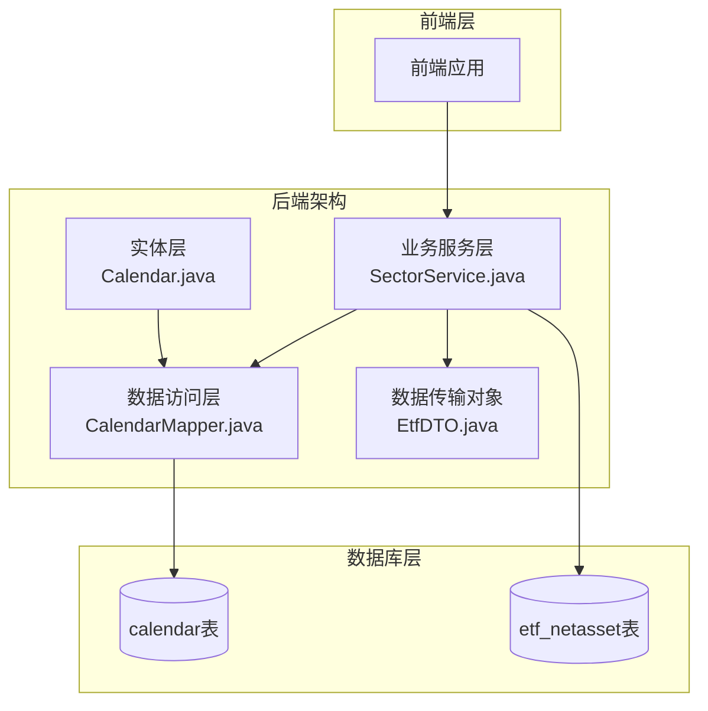
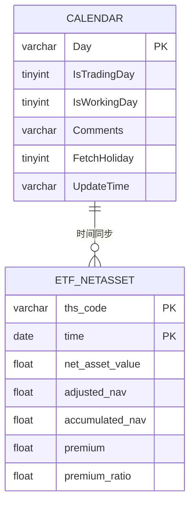
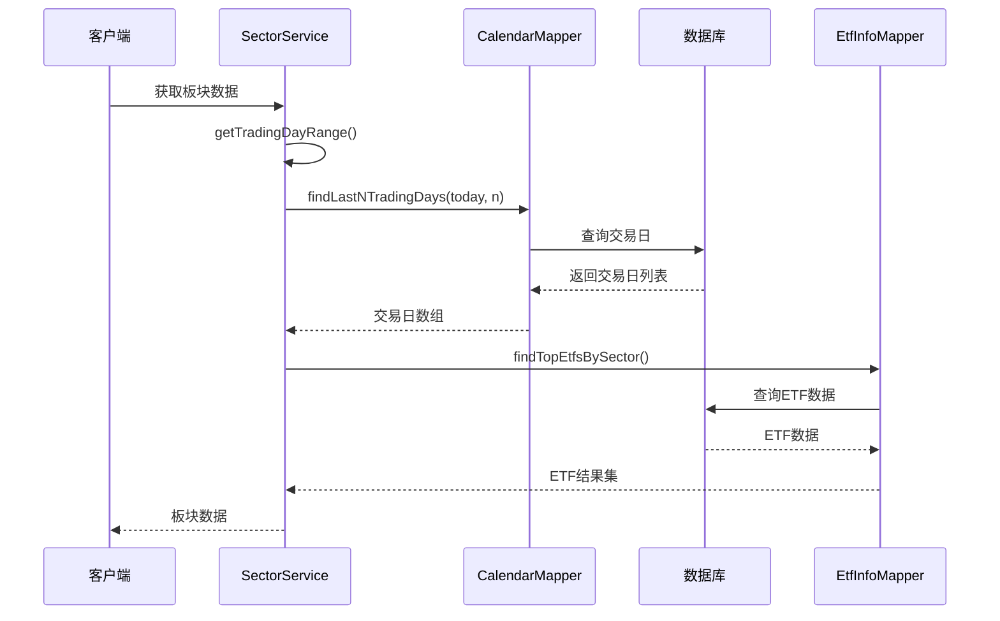
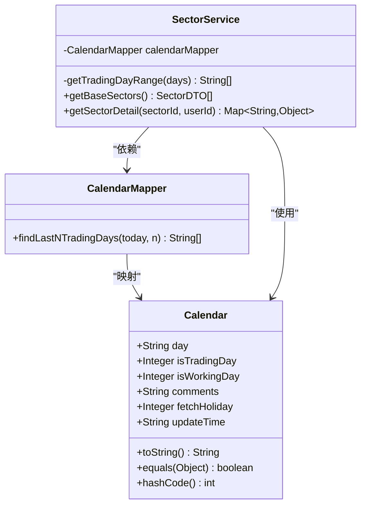
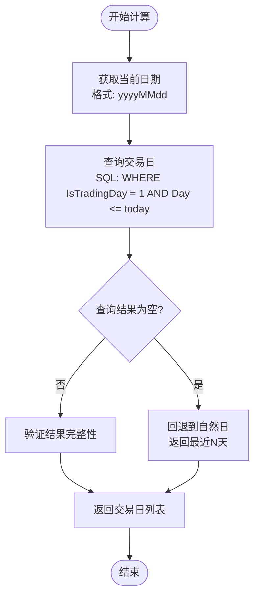
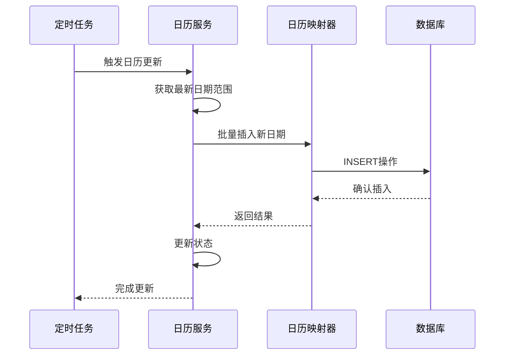
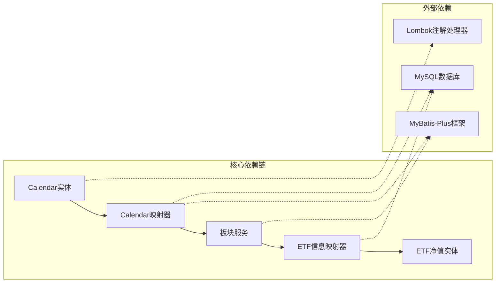

# 日历实体模型

<cite>
**本文档引用的文件**
- [Calendar.java](file://backend/src/main/java/com/freetrader/entity/Calendar.java)
- [CalendarMapper.java](file://backend/src/main/java/com/freetrader/mapper/CalendarMapper.java)
- [SectorService.java](file://backend/src/main/java/com/freetrader/service/SectorService.java)
- [EtfInfoMapper.java](file://backend/src/main/java/com/freetrader/mapper/EtfInfoMapper.java)
- [EtfNetAsset.java](file://backend/src/main/java/com/freetrader/entity/EtfNetAsset.java)
- [calendar.sql](file://sql/calendar.sql)
- [etf_netasset.sql](file://sql/etf_netasset.sql)
</cite>

## 目录
1. [引言](#引言)
2. [项目结构](#项目结构)
3. [核心组件](#核心组件)
4. [架构概览](#架构概览)
5. [详细组件分析](#详细组件分析)
6. [依赖关系分析](#依赖关系分析)
7. [性能考虑](#性能考虑)
8. [故障排除指南](#故障排除指南)
9. [结论](#结论)

## 引言

本文件为日历实体（Calendar）创建详细的数据模型文档。日历实体在金融系统中扮演着至关重要的角色，特别是在ETF数据分析和交易日计算方面。该实体不仅存储日期信息，还包含了交易日标记、工作日标记、节假日信息等关键业务字段，为整个系统的金融时间序列处理提供了基础支撑。

## 项目结构

FreeTrader项目采用标准的分层架构设计，日历实体位于后端服务层，通过MyBatis-Plus框架进行数据持久化操作。

**图表来源**
- [Calendar.java](file://backend/src/main/java/com/freetrader/entity/Calendar.java#L1-L22)
- [CalendarMapper.java](file://backend/src/main/java/com/freetrader/mapper/CalendarMapper.java#L1-L25)
- [SectorService.java](file://backend/src/main/java/com/freetrader/service/SectorService.java#L1-L253)

**章节来源**
- [Calendar.java](file://backend/src/main/java/com/freetrader/entity/Calendar.java#L1-L22)
- [calendar.sql](file://sql/calendar.sql#L24-L31)

## 核心组件

### 日历实体数据模型

日历实体采用简洁而高效的设计，专注于金融时间序列的核心需求：

| 字段名 | 数据类型 | 描述 | 约束条件 |
|--------|----------|------|----------|
| day | VARCHAR(8) | 日期标识 | YYYYMMDD格式，主键 |
| isTradingDay | TINYINT | 是否为交易日 | 0/1，非空 |
| isWorkingDay | TINYINT | 是否为工作日 | 0/1，可为空 |
| comments | VARCHAR(255) | 备注说明 | 可为空 |
| fetchHoliday | TINYINT | 节假日标记 | 0/1，可为空 |
| updateTime | VARCHAR(50) | 更新时间戳 | 可为空 |

### 数据库表结构

**图表来源**
- [calendar.sql](file://sql/calendar.sql#L24-L31)
- [etf_netasset.sql](file://sql/etf_netasset.sql#L24-L34)

**章节来源**
- [calendar.sql](file://sql/calendar.sql#L24-L31)
- [Calendar.java](file://backend/src/main/java/com/freetrader/entity/Calendar.java#L10-L21)

## 架构概览

日历实体在整个系统中的作用主要体现在以下几个方面：

**图表来源**
- [SectorService.java](file://backend/src/main/java/com/freetrader/service/SectorService.java#L63-L75)
- [CalendarMapper.java](file://backend/src/main/java/com/freetrader/mapper/CalendarMapper.java#L17-L23)
- [EtfInfoMapper.java](file://backend/src/main/java/com/freetrader/mapper/EtfInfoMapper.java#L18-L45)

## 详细组件分析

### 日历实体类结构

**图表来源**
- [Calendar.java](file://backend/src/main/java/com/freetrader/entity/Calendar.java#L8-L21)
- [CalendarMapper.java](file://backend/src/main/java/com/freetrader/mapper/CalendarMapper.java#L12-L23)
- [SectorService.java](file://backend/src/main/java/com/freetrader/service/SectorService.java#L33-L35)

### 业务规则实现

#### 交易日计算逻辑

**图表来源**
- [SectorService.java](file://backend/src/main/java/com/freetrader/service/SectorService.java#L63-L75)
- [CalendarMapper.java](file://backend/src/main/java/com/freetrader/mapper/CalendarMapper.java#L17-L23)

#### 工作日标记机制

日历实体支持双重标记系统：
- **交易日标记**：严格遵循交易所开放日
- **工作日标记**：包含周末但排除法定节假日

这种设计允许系统在不同场景下灵活选择合适的工作日定义。

**章节来源**
- [SectorService.java](file://backend/src/main/java/com/freetrader/service/SectorService.java#L63-L75)
- [Calendar.java](file://backend/src/main/java/com/freetrader/entity/Calendar.java#L12-L14)

### 数据维护策略

#### 更新机制

#### 数据校验规则

1. **日期格式验证**：YYYYMMDD格式强制约束
2. **数值范围验证**：0/1二进制值约束
3. **唯一性约束**：日期字段唯一性保证
4. **完整性检查**：交易日字段必填

**章节来源**
- [calendar.sql](file://sql/calendar.sql#L24-L31)
- [Calendar.java](file://backend/src/main/java/com/freetrader/entity/Calendar.java#L10-L21)

## 依赖关系分析

### 组件耦合度分析

**图表来源**
- [SectorService.java](file://backend/src/main/java/com/freetrader/service/SectorService.java#L33-L35)
- [CalendarMapper.java](file://backend/src/main/java/com/freetrader/mapper/CalendarMapper.java#L4-L5)
- [EtfInfoMapper.java](file://backend/src/main/java/com/freetrader/mapper/EtfInfoMapper.java#L5-L6)

### 关联关系分析

日历实体与ETF净值数据存在直接的时间同步关系：

| 关联类型 | 关联方向 | 业务意义 |
|----------|----------|----------|
| 时间同步 | 单向 | ETF净值数据依赖日历实体确定有效交易日 |
| 数据一致性 | 强制 | 确保ETF分析基于准确的交易日基准 |
| 性能优化 | 双向索引 | 支持快速日期范围查询 |

**章节来源**
- [EtfInfoMapper.java](file://backend/src/main/java/com/freetrader/mapper/EtfInfoMapper.java#L40-L41)
- [etf_netasset.sql](file://sql/etf_netasset.sql#L32-L33)

## 性能考虑

### 查询优化策略

1. **索引设计**
   - 交易日查询使用复合索引
   - 日期字段建立单独索引
   - 避免全表扫描

2. **缓存策略**
   - 交易日范围结果缓存
   - 用户收藏数据缓存
   - 减少数据库查询频率

3. **批量操作**
   - 批量插入新日期
   - 批量更新状态
   - 减少网络往返

### 性能监控指标

- **查询响应时间**：< 100ms
- **缓存命中率**：> 80%
- **数据库连接池利用率**：< 70%

## 故障排除指南

### 常见问题及解决方案

#### 交易日查询失败

**症状**：getTradingDayRange返回空列表
**原因**：
1. 日历数据缺失
2. 日期格式不匹配
3. 数据库连接异常

**解决方案**：
1. 检查日历表数据完整性
2. 验证日期格式一致性
3. 确认数据库连接状态

#### ETF数据分析异常

**症状**：ETF收益计算错误
**原因**：
1. 交易日边界计算错误
2. ETF净值数据缺失
3. 时间同步问题

**解决方案**：
1. 验证交易日范围计算逻辑
2. 检查ETF净值数据完整性
3. 确认时间字段同步

**章节来源**
- [SectorService.java](file://backend/src/main/java/com/freetrader/service/SectorService.java#L67-L72)

### 调试建议

1. **启用详细日志**：监控交易日查询过程
2. **性能分析**：识别慢查询和瓶颈
3. **数据验证**：定期检查数据完整性
4. **缓存监控**：跟踪缓存命中情况

## 结论

日历实体作为FreeTrader系统的核心基础设施，在金融时间序列处理中发挥着关键作用。其简洁而强大的设计为ETF数据分析、交易日计算、工作日管理等功能提供了坚实的基础。

通过合理的数据模型设计、完善的业务逻辑实现、以及有效的性能优化策略，日历实体能够满足金融系统对准确性、可靠性和性能的严格要求。在未来的发展中，可以进一步扩展日历实体的功能，如增加更多节假日类型、支持国际节假日等，以适应更广泛的金融应用场景。