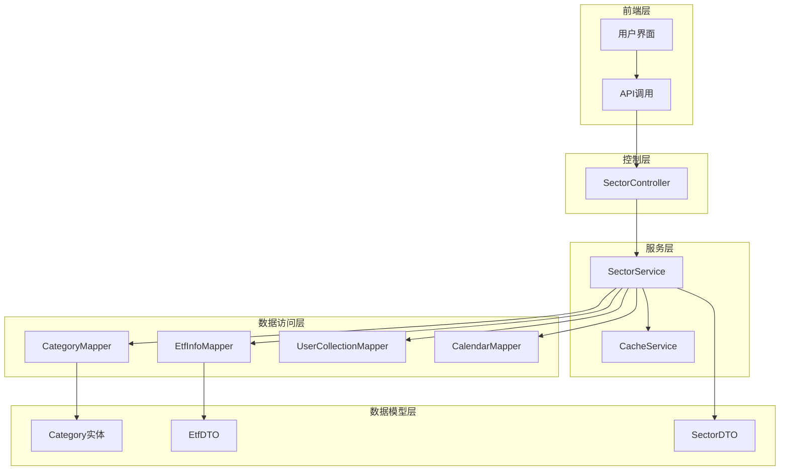
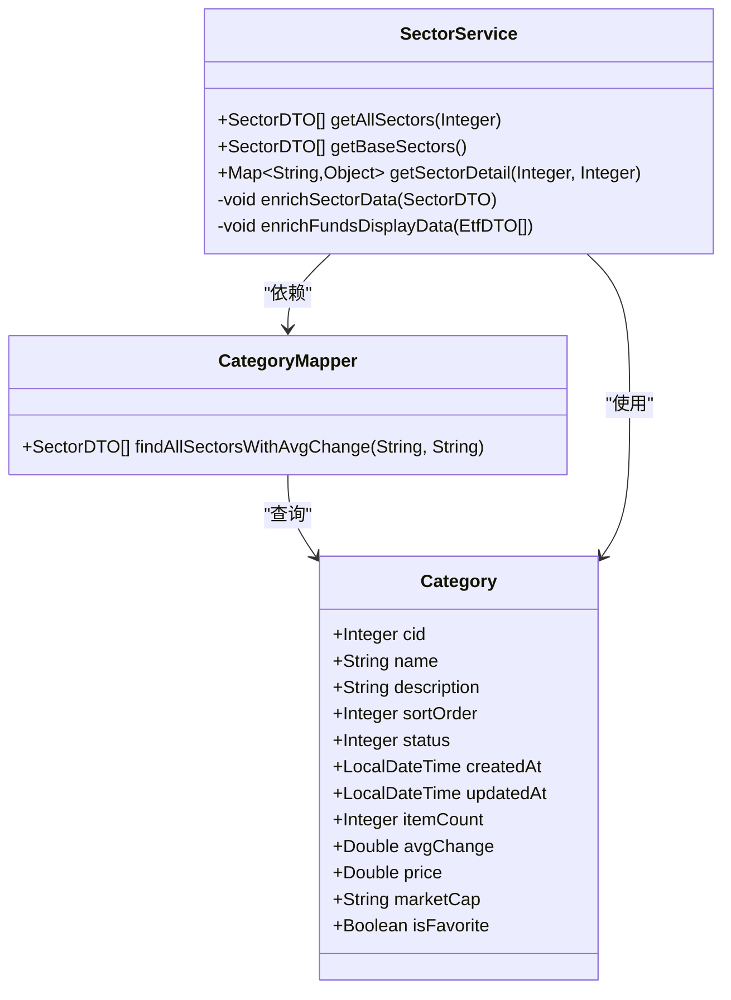
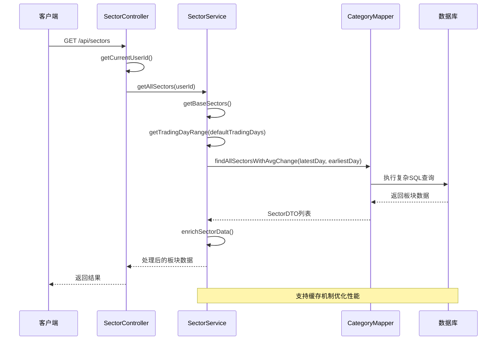
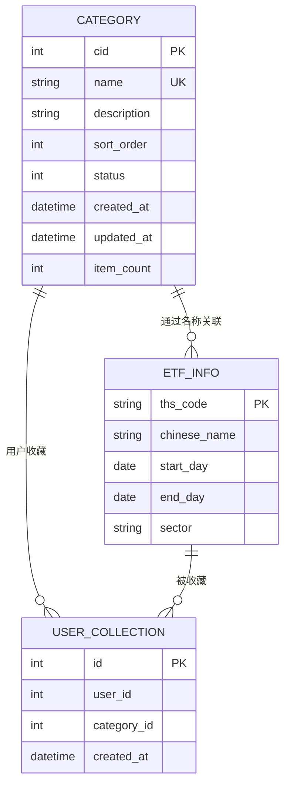
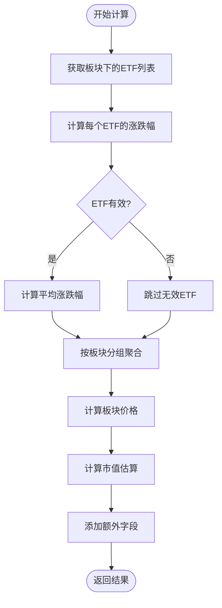
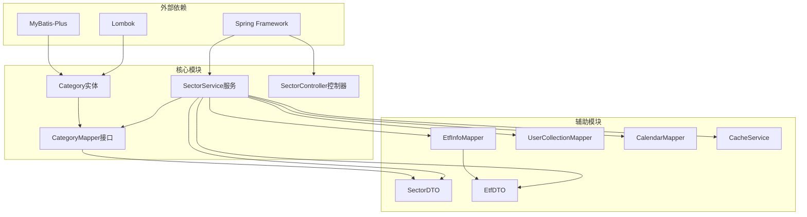

# 板块实体模型

<cite>
**本文档引用的文件**
- [Category.java](file://backend/src/main/java/com/freetrader/entity/Category.java)
- [CategoryMapper.java](file://backend/src/main/java/com/freetrader/mapper/CategoryMapper.java)
- [SectorService.java](file://backend/src/main/java/com/freetrader/service/SectorService.java)
- [SectorController.java](file://backend/src/main/java/com/freetrader/controller/SectorController.java)
- [SectorDTO.java](file://backend/src/main/java/com/freetrader/dto/SectorDTO.java)
- [EtfInfo.java](file://backend/src/main/java/com/freetrader/entity/EtfInfo.java)
- [EtfInfoMapper.java](file://backend/src/main/java/com/freetrader/mapper/EtfInfoMapper.java)
- [EtfDTO.java](file://backend/src/main/java/com/freetrader/dto/EtfDTO.java)
- [category.sql](file://sql/category.sql)
</cite>

## 目录
1. [简介](#简介)
2. [项目结构](#项目结构)
3. [核心组件](#核心组件)
4. [架构概览](#架构概览)
5. [详细组件分析](#详细组件分析)
6. [依赖关系分析](#依赖关系分析)
7. [性能考虑](#性能考虑)
8. [故障排除指南](#故障排除指南)
9. [结论](#结论)

## 简介

板块实体(Category)是ETF板块管理系统的核心数据模型，负责存储和管理各个ETF板块的基本信息。该实体采用MyBatis-Plus框架实现，支持完整的CRUD操作，并通过复杂的SQL查询实现了板块与ETF基金之间的关联关系。板块实体不仅包含基本的元数据信息，还提供了丰富的计算字段，用于支持前端展示和数据分析需求。

## 项目结构

FreeTrader项目采用标准的Spring Boot三层架构设计，板块实体位于后端服务层，通过控制器提供RESTful API接口。整个系统围绕ETF板块管理构建，支持板块数据的查询、计算和缓存功能。

**图表来源**
- [SectorController.java](file://backend/src/main/java/com/freetrader/controller/SectorController.java#L22-L63)
- [SectorService.java](file://backend/src/main/java/com/freetrader/service/SectorService.java#L23-L253)
- [Category.java](file://backend/src/main/java/com/freetrader/entity/Category.java#L11-L45)

**章节来源**
- [SectorController.java](file://backend/src/main/java/com/freetrader/controller/SectorController.java#L1-L63)
- [SectorService.java](file://backend/src/main/java/com/freetrader/service/SectorService.java#L1-L253)

## 核心组件

### 板块实体(Category)

板块实体是系统的核心数据模型，采用注解驱动的方式映射到数据库表。实体类使用Lombok简化代码，MyBatis-Plus提供强大的ORM功能。

**图表来源**
- [Category.java](file://backend/src/main/java/com/freetrader/entity/Category.java#L11-L45)
- [CategoryMapper.java](file://backend/src/main/java/com/freetrader/mapper/CategoryMapper.java#L12-L48)
- [SectorService.java](file://backend/src/main/java/com/freetrader/service/SectorService.java#L30-L253)

### 数据库表结构

板块实体对应数据库中的`category`表，具有完整的约束和索引设计：

| 字段名 | 类型 | 约束 | 描述 |
|--------|------|------|------|
| cid | int | PRIMARY KEY, AUTO_INCREMENT | 板块唯一标识符 |
| name | varchar(100) | NOT NULL, UNIQUE | 板块名称，唯一约束 |
| description | text | NULL | 板块描述信息 |
| sort_order | int | NOT NULL, DEFAULT 0 | 排序权重，数值越大越靠前 |
| status | tinyint | NOT NULL, DEFAULT 1 | 状态：1-启用，0-禁用 |
| created_at | datetime | NOT NULL, DEFAULT CURRENT_TIMESTAMP | 创建时间 |
| updated_at | datetime | NOT NULL, DEFAULT CURRENT_TIMESTAMP ON UPDATE CURRENT_TIMESTAMP | 更新时间 |
| item_count | int | NOT NULL, DEFAULT 0 | 包含的ETF数量 |

**章节来源**
- [Category.java](file://backend/src/main/java/com/freetrader/entity/Category.java#L13-L45)
- [category.sql](file://sql/category.sql#L24-L36)

## 架构概览

板块管理系统采用分层架构设计，实现了清晰的关注点分离。系统通过RESTful API对外提供服务，内部通过服务层协调各种业务逻辑。

**图表来源**
- [SectorController.java](file://backend/src/main/java/com/freetrader/controller/SectorController.java#L41-L48)
- [SectorService.java](file://backend/src/main/java/com/freetrader/service/SectorService.java#L109-L141)
- [CategoryMapper.java](file://backend/src/main/java/com/freetrader/mapper/CategoryMapper.java#L15-L46)

**章节来源**
- [SectorController.java](file://backend/src/main/java/com/freetrader/controller/SectorController.java#L22-L63)
- [SectorService.java](file://backend/src/main/java/com/freetrader/service/SectorService.java#L23-L253)

## 详细组件分析

### 板块实体字段详解

#### 基础字段

| 字段 | 类型 | 约束 | 业务含义 | 约束条件 |
|------|------|------|----------|----------|
| cid | Integer | 主键, 自增 | 板块唯一标识符 | > 0 |
| name | String | NOT NULL, UNIQUE | 板块名称 | 1-100字符, 唯一性 |
| description | String | NULL | 板块描述 | 可为空 |
| sort_order | Integer | NOT NULL, DEFAULT 0 | 排序权重 | 整数, 数值越大越靠前 |
| status | Integer | NOT NULL, DEFAULT 1 | 状态标识 | 1=启用, 0=禁用 |
| created_at | LocalDateTime | NOT NULL, DEFAULT CURRENT_TIMESTAMP | 创建时间 | 自动设置 |
| updated_at | LocalDateTime | NOT NULL, DEFAULT CURRENT_TIMESTAMP ON UPDATE CURRENT_TIMESTAMP | 更新时间 | 自动更新 |
| item_count | Integer | NOT NULL, DEFAULT 0 | ETF数量统计 | 非负整数 |

#### 计算字段

| 字段 | 类型 | 业务含义 | 计算方式 |
|------|------|----------|----------|
| avg_change | Double | 平均涨跌幅 | 基于ETF净值计算的平均百分比变化 |
| price | Double | 板块价格 | 基于基准价格和涨跌幅计算 |
| market_cap | String | 市值估算 | 基于ETF数量和乘数因子估算 |
| is_favorite | Boolean | 收藏状态 | 用户收藏状态标记 |

### 板块与ETF的关联关系

板块实体通过名称字段与ETF信息建立关联关系，实现了多对多的业务关联：

**图表来源**
- [Category.java](file://backend/src/main/java/com/freetrader/entity/Category.java#L18-L30)
- [EtfInfo.java](file://backend/src/main/java/com/freetrader/entity/EtfInfo.java#L12-L23)

### 板块数据计算流程

系统通过复杂的SQL查询实现板块数据的实时计算：

**图表来源**
- [CategoryMapper.java](file://backend/src/main/java/com/freetrader/mapper/CategoryMapper.java#L19-L46)
- [SectorService.java](file://backend/src/main/java/com/freetrader/service/SectorService.java#L146-L165)

**章节来源**
- [Category.java](file://backend/src/main/java/com/freetrader/entity/Category.java#L32-L44)
- [CategoryMapper.java](file://backend/src/main/java/com/freetrader/mapper/CategoryMapper.java#L15-L46)
- [SectorService.java](file://backend/src/main/java/com/freetrader/service/SectorService.java#L143-L165)

## 依赖关系分析

### 组件依赖图

**图表来源**
- [SectorService.java](file://backend/src/main/java/com/freetrader/service/SectorService.java#L32-L36)
- [CategoryMapper.java](file://backend/src/main/java/com/freetrader/mapper/CategoryMapper.java#L12-L13)
- [SectorController.java](file://backend/src/main/java/com/freetrader/controller/SectorController.java#L26-L29)

### 数据流分析

板块实体在整个数据流中扮演着核心角色，连接了多个业务模块：

1. **数据输入**: 通过ETL流程从外部数据源导入ETF净值数据
2. **数据处理**: SectorService进行复杂的计算和聚合操作
3. **数据输出**: 通过REST API向客户端提供板块信息

**章节来源**
- [SectorService.java](file://backend/src/main/java/com/freetrader/service/SectorService.java#L1-L253)
- [CategoryMapper.java](file://backend/src/main/java/com/freetrader/mapper/CategoryMapper.java#L1-L48)

## 性能考虑

### 缓存策略

系统实现了多层次的缓存机制来优化性能：

- **板块基础数据缓存**: 使用`@Cacheable`注解缓存板块基础信息
- **用户收藏缓存**: 缓存用户的收藏状态，减少数据库查询
- **交易日历缓存**: 缓存交易日历数据，避免重复计算

### 查询优化

1. **索引设计**: 在`status`字段上建立索引，支持快速筛选
2. **唯一约束**: `name`字段的唯一索引确保数据完整性
3. **批量查询**: 使用JOIN操作减少查询次数

### 性能监控

系统提供了详细的日志记录，包括：
- 缓存命中率统计
- SQL执行时间监控
- 错误处理和异常记录

## 故障排除指南

### 常见问题及解决方案

#### 板块数据不更新

**症状**: 板块显示的涨跌幅数据不正确
**原因**: 交易日计算错误或数据源问题
**解决**: 检查`getTradingDayRange`方法的实现，确认交易日历数据

#### 性能问题

**症状**: API响应时间过长
**原因**: 缺少必要的索引或缓存未生效
**解决**: 
1. 确认`idx_status`索引存在
2. 检查Redis缓存配置
3. 分析慢查询日志

#### 数据一致性问题

**症状**: 板块名称重复或状态异常
**原因**: 业务逻辑错误或并发访问问题
**解决**: 
1. 检查唯一约束是否生效
2. 实现适当的锁机制
3. 添加数据验证逻辑

**章节来源**
- [SectorService.java](file://backend/src/main/java/com/freetrader/service/SectorService.java#L64-L76)
- [category.sql](file://sql/category.sql#L34-L35)

## 结论

板块实体(Category)作为ETF板块管理系统的核心数据模型，展现了现代Java企业应用的最佳实践。通过合理的数据设计、完善的业务逻辑和高效的性能优化，系统能够稳定地支持复杂的金融数据处理需求。

该实体模型的主要优势包括：
- **清晰的数据结构**: 明确的字段定义和约束条件
- **灵活的扩展性**: 支持计算字段和动态数据处理
- **高性能设计**: 多层次缓存和索引优化
- **完整的生命周期**: 支持数据的创建、更新、查询和状态管理

未来可以考虑的改进方向：
- 增加板块层级结构支持
- 实现更精细的权限控制
- 添加数据审计功能
- 优化大数据量场景下的性能表现