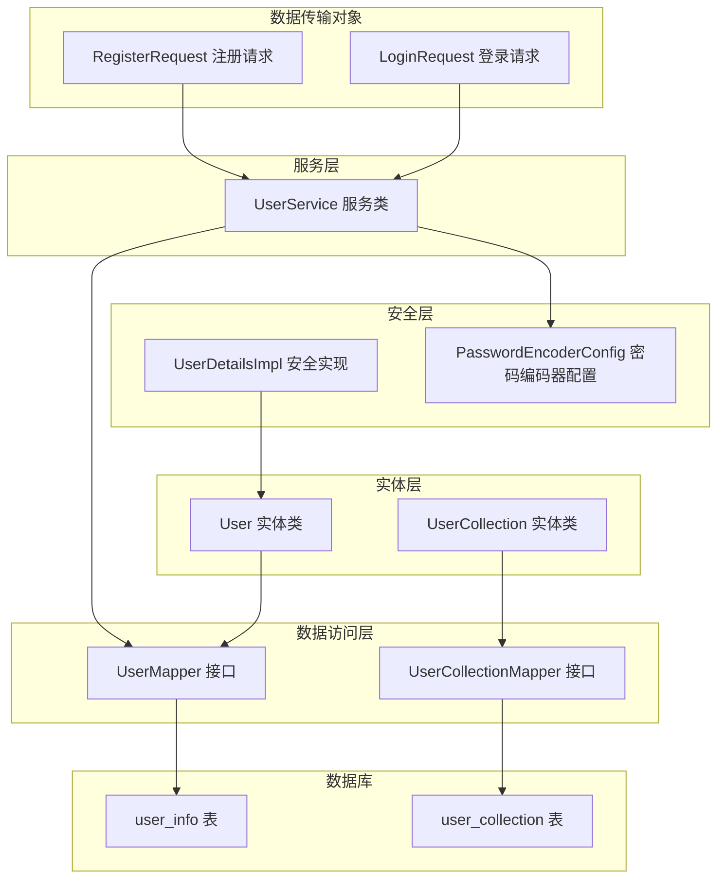
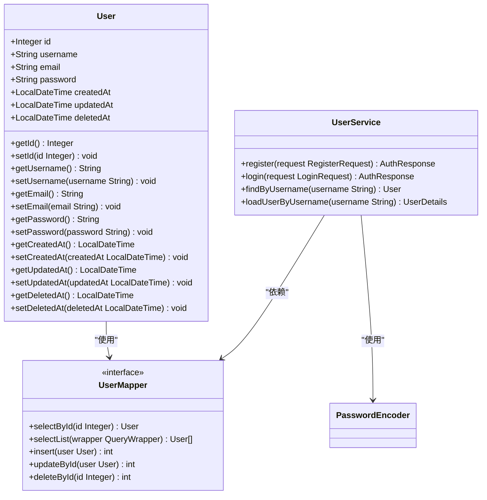
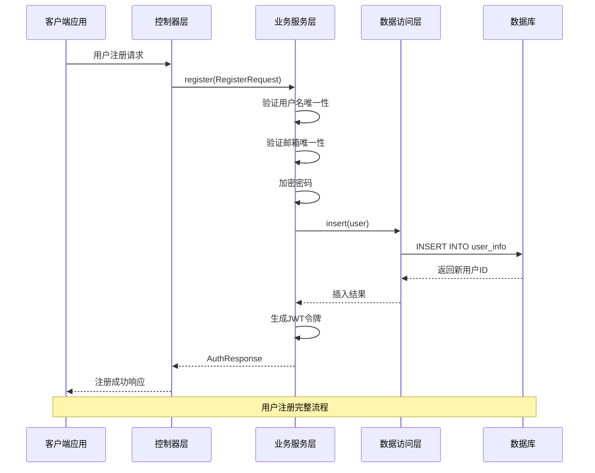
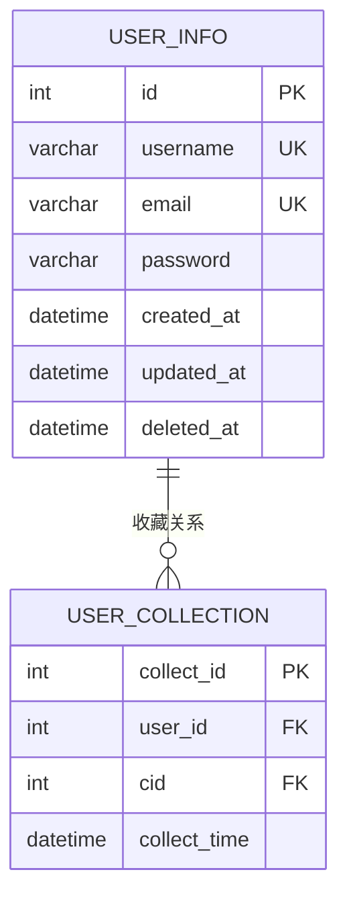
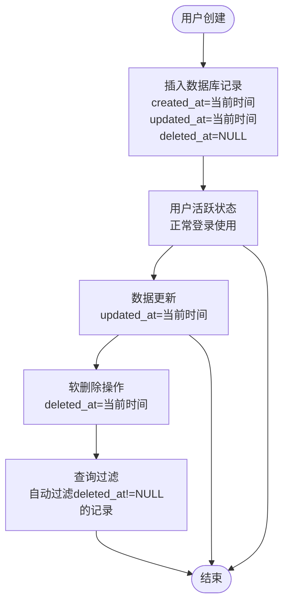
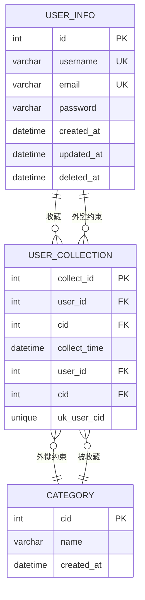
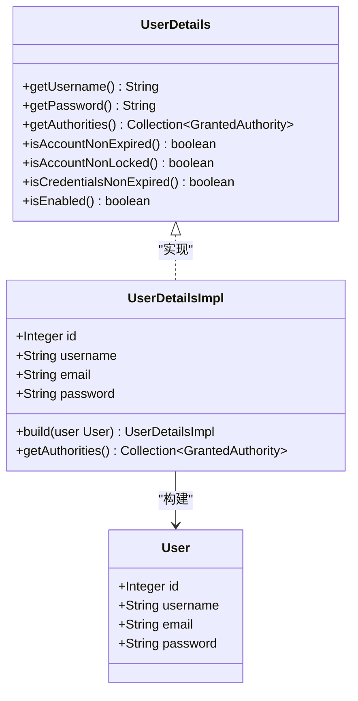
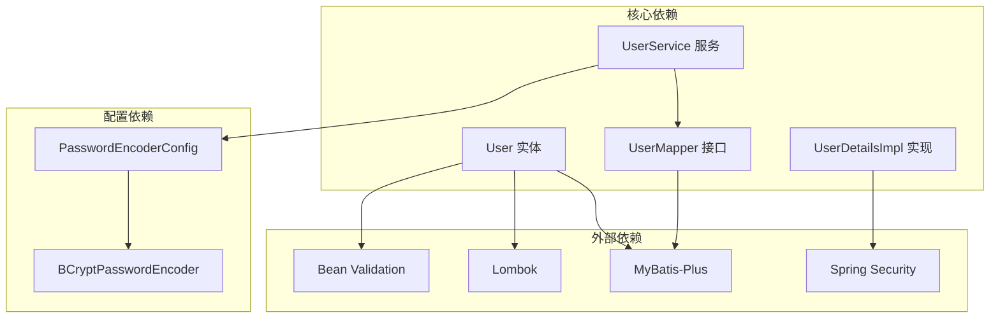

# 用户实体模型

<cite>
**本文档引用的文件**
- [User.java](file://backend/src/main/java/com/freetrader/entity/User.java)
- [user_info.sql](file://sql/user_info.sql)
- [UserMapper.java](file://backend/src/main/java/com/freetrader/mapper/UserMapper.java)
- [UserService.java](file://backend/src/main/java/com/freetrader/service/UserService.java)
- [UserDetailsImpl.java](file://backend/src/main/java/com/freetrader/security/UserDetailsImpl.java)
- [RegisterRequest.java](file://backend/src/main/java/com/freetrader/dto/RegisterRequest.java)
- [LoginRequest.java](file://backend/src/main/java/com/freetrader/dto/LoginRequest.java)
- [PasswordEncoderConfig.java](file://backend/src/main/java/com/freetrader/config/PasswordEncoderConfig.java)
- [UserCollection.java](file://backend/src/main/java/com/freetrader/entity/UserCollection.java)
- [user_collection.sql](file://sql/user_collection.sql)
</cite>

## 目录
1. [简介](#简介)
2. [项目结构](#项目结构)
3. [核心组件](#核心组件)
4. [架构概览](#架构概览)
5. [详细组件分析](#详细组件分析)
6. [依赖关系分析](#依赖关系分析)
7. [性能考虑](#性能考虑)
8. [故障排除指南](#故障排除指南)
9. [结论](#结论)

## 简介

本文档详细阐述了FreeTrader项目中用户实体(User)的数据模型设计。用户实体是系统的核心数据结构，负责存储用户的基本信息、认证凭据和生命周期管理。该文档深入分析了用户实体的字段定义、数据类型、业务含义以及与数据库表结构的映射关系。

## 项目结构

用户实体模型涉及以下关键组件：

**图表来源**
- [User.java](file://backend/src/main/java/com/freetrader/entity/User.java#L1-L29)
- [UserMapper.java](file://backend/src/main/java/com/freetrader/mapper/UserMapper.java#L1-L10)
- [UserService.java](file://backend/src/main/java/com/freetrader/service/UserService.java#L1-L103)

**章节来源**
- [User.java](file://backend/src/main/java/com/freetrader/entity/User.java#L1-L29)
- [UserMapper.java](file://backend/src/main/java/com/freetrader/mapper/UserMapper.java#L1-L10)
- [UserService.java](file://backend/src/main/java/com/freetrader/service/UserService.java#L1-L103)

## 核心组件

### 用户实体类结构

用户实体类采用MyBatis-Plus注解进行数据库映射，实现了标准的JPA风格的实体设计模式。

**图表来源**
- [User.java](file://backend/src/main/java/com/freetrader/entity/User.java#L10-L28)
- [UserMapper.java](file://backend/src/main/java/com/freetrader/mapper/UserMapper.java#L7-L9)
- [UserService.java](file://backend/src/main/java/com/freetrader/service/UserService.java#L25-L102)

**章节来源**
- [User.java](file://backend/src/main/java/com/freetrader/entity/User.java#L1-L29)
- [UserMapper.java](file://backend/src/main/java/com/freetrader/mapper/UserMapper.java#L1-L10)
- [UserService.java](file://backend/src/main/java/com/freetrader/service/UserService.java#L1-L103)

## 架构概览

用户实体在整个系统架构中扮演着核心角色，连接着表现层、业务逻辑层、数据访问层和持久化层。

**图表来源**
- [UserService.java](file://backend/src/main/java/com/freetrader/service/UserService.java#L41-L71)
- [UserMapper.java](file://backend/src/main/java/com/freetrader/mapper/UserMapper.java#L7-L9)

**章节来源**
- [UserService.java](file://backend/src/main/java/com/freetrader/service/UserService.java#L41-L71)

## 详细组件分析

### 数据库表结构设计

用户信息表(user_info)采用了完整的生命周期管理设计，支持软删除机制。

**图表来源**
- [user_info.sql](file://sql/user_info.sql#L24-L35)
- [user_collection.sql](file://sql/user_collection.sql#L24-L34)

#### 主键设计分析

用户实体采用自增主键策略，具有以下特点：

- **数据类型**: `int UNSIGNED` (无符号整数)
- **自增策略**: `AUTO_INCREMENT`
- **主键约束**: `PRIMARY KEY (id)`
- **索引类型**: `USING BTREE`
- **业务意义**: 提供全局唯一的用户标识符

#### 字段定义与约束

| 字段名 | 数据类型 | 长度限制 | 唯一性 | 非空 | 默认值 | 业务含义 |
|--------|----------|----------|--------|------|--------|----------|
| `id` | `int UNSIGNED` | - | 是 | 是 | 自增 | 用户唯一标识符 |
| `username` | `varchar(50)` | 50字符 | 是 | 是 | - | 用户登录名 |
| `email` | `varchar(100)` | 100字符 | 是 | 是 | - | 用户邮箱地址 |
| `password` | `varchar(255)` | 255字符 | 否 | 是 | - | 用户密码（加密存储） |
| `created_at` | `datetime` | - | 否 | 是 | `CURRENT_TIMESTAMP` | 账号创建时间 |
| `updated_at` | `datetime` | - | 否 | 是 | `CURRENT_TIMESTAMP` | 信息更新时间 |
| `deleted_at` | `datetime` | - | 否 | 否 | `NULL` | 软删除标记 |

**章节来源**
- [user_info.sql](file://sql/user_info.sql#L25-L31)
- [User.java](file://backend/src/main/java/com/freetrader/entity/User.java#L14-L27)

### 字段约束与验证规则

#### 用户名(username)约束

用户名字段遵循严格的验证规则：

- **非空验证**: 使用`@NotBlank`确保用户名不能为空
- **长度限制**: 最小3个字符，最大50个字符
- **唯一性保证**: 数据库层面的唯一索引防止重复注册
- **字符集**: 支持UTF-8字符集，满足国际化需求

#### 邮箱(email)约束

邮箱字段采用多层次验证机制：

- **非空验证**: `@NotBlank`确保邮箱地址必填
- **格式验证**: `@Email`使用正则表达式验证邮箱格式
- **唯一性保证**: 唯一索引防止重复邮箱注册
- **长度限制**: 最大100字符，支持各种邮箱域名

#### 密码(password)约束

密码安全采用多层保护机制：

- **非空验证**: `@NotBlank`确保密码必填
- **长度限制**: 最小6字符，最大100字符
- **加密存储**: 使用BCrypt算法进行哈希加密
- **传输安全**: 仅在内存中保持明文状态，数据库存储加密值

**章节来源**
- [RegisterRequest.java](file://backend/src/main/java/com/freetrader/dto/RegisterRequest.java#L11-L21)
- [UserService.java](file://backend/src/main/java/com/freetrader/service/UserService.java#L53-L58)
- [PasswordEncoderConfig.java](file://backend/src/main/java/com/freetrader/config/PasswordEncoderConfig.java#L15-L18)

### 时间戳字段生命周期管理

用户实体的时间戳字段实现了完整的生命周期跟踪：

**图表来源**
- [user_info.sql](file://sql/user_info.sql#L29-L31)
- [UserService.java](file://backend/src/main/java/com/freetrader/service/UserService.java#L34-L38)

#### createdAt字段
- **作用**: 记录用户账户的创建时间
- **默认值**: `CURRENT_TIMESTAMP`
- **业务价值**: 支持用户活跃度统计、数据迁移追踪

#### updatedAt字段  
- **作用**: 记录用户信息的最后更新时间
- **默认值**: `CURRENT_TIMESTAMP`
- **更新机制**: `ON UPDATE CURRENT_TIMESTAMP`
- **业务价值**: 支持审计日志、数据同步

#### deletedAt字段
- **作用**: 实现软删除功能
- **默认值**: `NULL`
- **查询过滤**: 所有查询自动排除已删除用户
- **业务价值**: 支持数据恢复、合规要求

**章节来源**
- [user_info.sql](file://sql/user_info.sql#L29-L31)
- [UserService.java](file://backend/src/main/java/com/freetrader/service/UserService.java#L34-L38)

### 关系设计与外键约束

用户实体与其他实体建立了清晰的关联关系：

**图表来源**
- [user_collection.sql](file://sql/user_collection.sql#L24-L34)
- [UserCollection.java](file://backend/src/main/java/com/freetrader/entity/UserCollection.java#L17-L19)

#### 用户收藏关系
- **实体**: UserCollection
- **外键**: `user_id` → `user_info.id`
- **级联删除**: 用户删除时自动删除其所有收藏记录
- **唯一约束**: `(user_id, cid)` 防止重复收藏
- **索引优化**: `idx_cid` 支持按兴趣类别查询收藏用户

#### 外键约束设计
- **参照完整性**: 确保收藏关系的有效性
- **级联操作**: 删除用户或兴趣类别时自动清理关联数据
- **数据一致性**: 防止孤儿记录产生

**章节来源**
- [UserCollection.java](file://backend/src/main/java/com/freetrader/entity/UserCollection.java#L1-L23)
- [user_collection.sql](file://sql/user_collection.sql#L32-L33)

### 安全集成设计

用户实体与Spring Security深度集成，提供了完整的认证授权支持：

**图表来源**
- [UserDetailsImpl.java](file://backend/src/main/java/com/freetrader/security/UserDetailsImpl.java#L15-L29)
- [User.java](file://backend/src/main/java/com/freetrader/entity/User.java#L12-L27)

#### 权限体系
- **角色权限**: 默认授予`ROLE_USER`权限
- **账户状态**: 永远有效、未锁定、凭证未过期
- **启用状态**: 默认启用用户账户

#### 密码安全
- **加密算法**: BCrypt哈希算法
- **盐值生成**: 自动生成随机盐值
- **性能平衡**: 适中的计算成本
- **安全性**: 抵抗彩虹表攻击

**章节来源**
- [UserDetailsImpl.java](file://backend/src/main/java/com/freetrader/security/UserDetailsImpl.java#L1-L56)
- [PasswordEncoderConfig.java](file://backend/src/main/java/com/freetrader/config/PasswordEncoderConfig.java#L1-L20)

## 依赖关系分析

用户实体的依赖关系体现了分层架构的最佳实践：

**图表来源**
- [User.java](file://backend/src/main/java/com/freetrader/entity/User.java#L3-L6)
- [UserService.java](file://backend/src/main/java/com/freetrader/service/UserService.java#L11-L18)
- [PasswordEncoderConfig.java](file://backend/src/main/java/com/freetrader/config/PasswordEncoderConfig.java#L5-L18)

### 内聚性分析

用户实体具有良好的内聚性特征：
- **单一职责**: 专注于用户数据模型定义
- **数据封装**: 私有字段配合公共访问器方法
- **注解驱动**: 清晰的ORM映射元数据
- **领域驱动**: 符合用户领域的业务概念

### 耦合度分析

用户实体的耦合度控制在合理范围内：
- **框架耦合**: 适度使用MyBatis-Plus注解
- **配置耦合**: 通过独立配置类降低耦合
- **接口耦合**: 通过Mapper接口实现数据访问抽象
- **安全耦合**: 与Spring Security的松散集成

**章节来源**
- [User.java](file://backend/src/main/java/com/freetrader/entity/User.java#L1-L29)
- [UserService.java](file://backend/src/main/java/com/freetrader/service/UserService.java#L1-L103)

## 性能考虑

### 查询性能优化

用户实体的查询性能通过以下机制保障：

- **主键索引**: `id`字段的主键索引提供O(log n)查询性能
- **唯一索引**: `username`和`email`的唯一索引确保快速查找
- **复合索引**: `user_collection`表的`(user_id, cid)`复合索引支持高效去重
- **覆盖索引**: 关键查询路径可利用现有索引避免回表

### 缓存策略

建议实施的缓存策略：
- **用户信息缓存**: 缓存活跃用户的基础信息
- **权限缓存**: 缓存用户权限信息减少数据库查询
- **会话缓存**: 缓存JWT令牌与用户映射关系

### 批量操作优化

对于批量用户操作：
- **批量插入**: 使用MyBatis-Plus的批量插入功能
- **批量更新**: 合理使用条件更新避免全表扫描
- **事务管理**: 使用`@Transactional`确保数据一致性

## 故障排除指南

### 常见问题诊断

#### 用户名重复错误
**症状**: 注册时抛出用户名已存在异常
**原因**: `uk_username`唯一索引冲突
**解决方案**: 
1. 检查用户名是否已被其他用户使用
2. 验证用户名格式和长度
3. 确认数据库唯一约束

#### 邮箱重复错误  
**症状**: 注册时抛出邮箱已存在异常
**原因**: `uk_email`唯一索引冲突
**解决方案**:
1. 验证邮箱格式的正确性
2. 检查邮箱是否已被注册
3. 确认邮箱唯一性约束

#### 登录验证失败
**症状**: 登录时用户名或密码错误
**原因**: 密码验证失败或用户被软删除
**解决方案**:
1. 检查用户名是否存在且未被删除
2. 验证密码加密匹配
3. 确认用户账户状态

### 调试技巧

#### 日志分析
- **注册流程**: 查看注册日志确认用户名、邮箱唯一性检查
- **登录流程**: 分析登录失败原因和用户状态
- **异常处理**: 捕获业务异常并记录详细信息

#### 数据库监控
- **索引使用**: 监控唯一索引的使用情况
- **查询性能**: 分析慢查询和索引失效情况
- **连接池**: 监控数据库连接使用情况

**章节来源**
- [UserService.java](file://backend/src/main/java/com/freetrader/service/UserService.java#L45-L51)
- [UserService.java](file://backend/src/main/java/com/freetrader/service/UserService.java#L79-L82)

## 结论

用户实体模型设计充分体现了现代Web应用的数据建模最佳实践。通过合理的字段设计、严格的约束验证、完善的生命周期管理和安全集成，用户实体为整个FreeTrader系统提供了坚实的数据基础。

### 设计亮点

1. **软删除机制**: 通过`deleted_at`字段实现数据保护和合规要求
2. **密码安全**: 采用BCrypt加密算法确保密码存储安全
3. **索引优化**: 合理的索引设计保证查询性能
4. **关系清晰**: 明确的外键关系支持数据完整性
5. **安全集成**: 与Spring Security无缝集成提供完整的认证授权

### 改进建议

1. **字段扩展**: 可考虑添加用户状态字段支持账户激活
2. **审计日志**: 增加更详细的审计日志记录
3. **数据迁移**: 提供用户数据迁移和备份策略
4. **监控告警**: 建立用户相关指标的监控告警机制

该用户实体模型为FreeTrader项目的用户管理功能提供了可靠的技术支撑，为后续的功能扩展奠定了良好的基础。