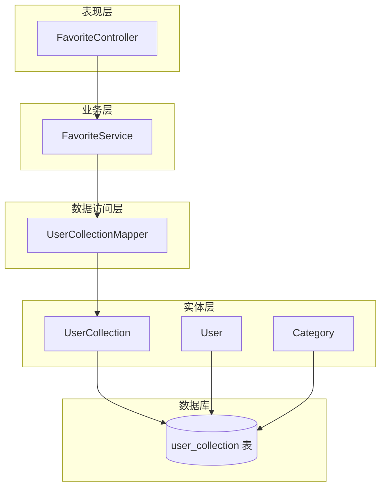
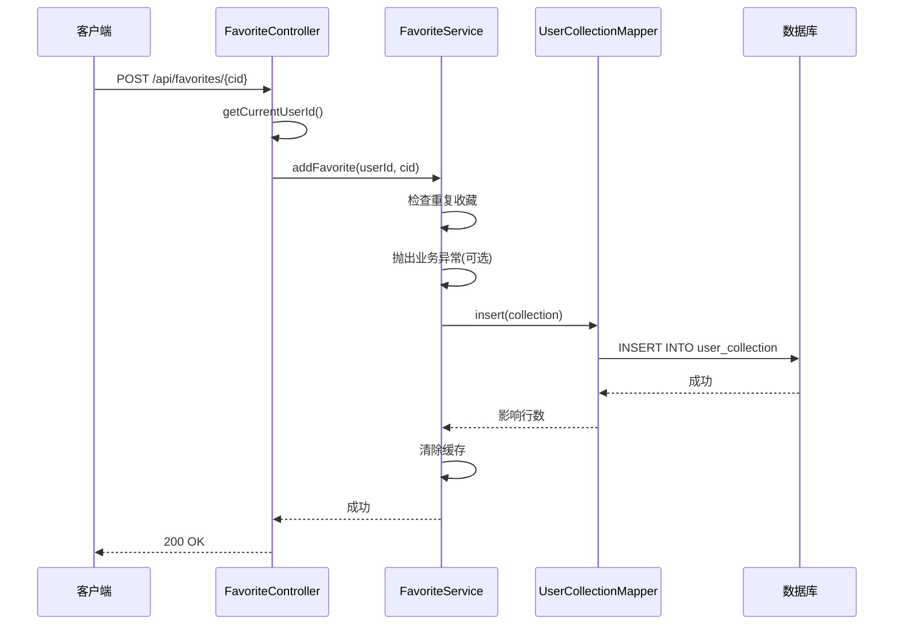
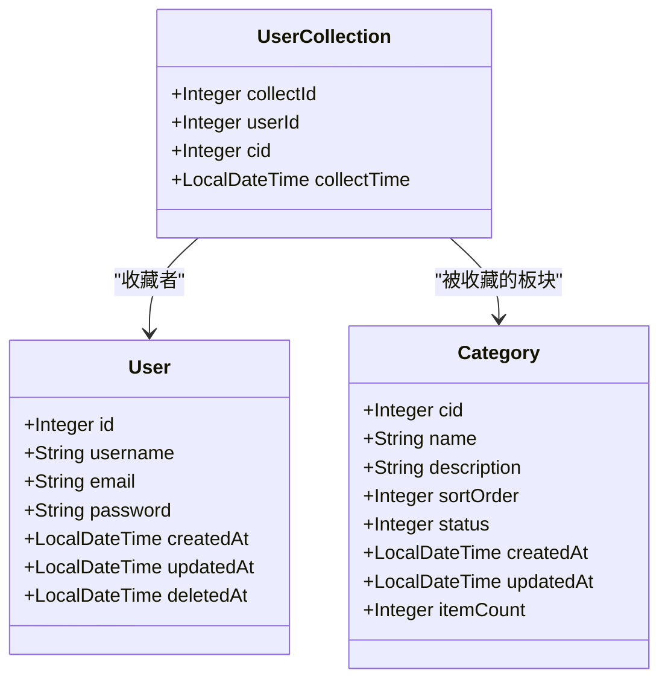
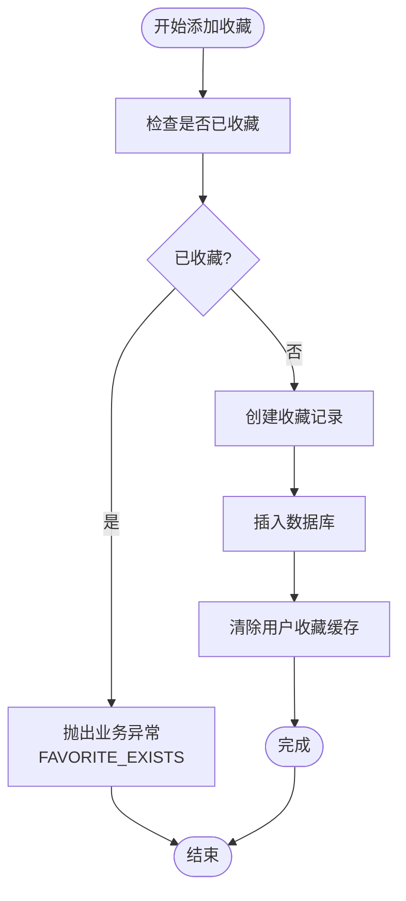
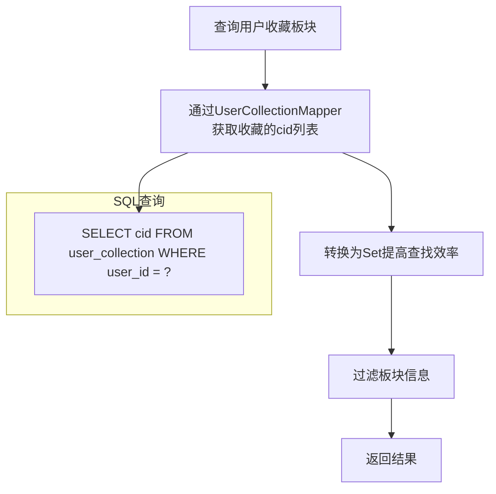
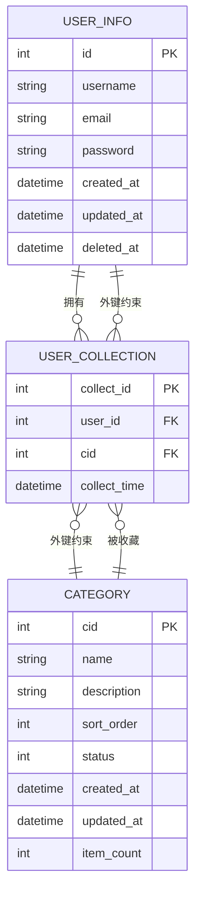
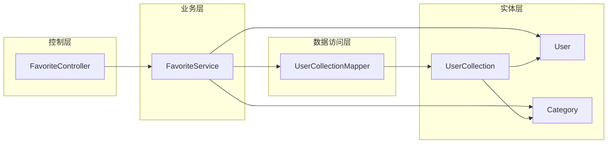

# 用户收藏实体模型

<cite>
**本文档引用的文件**
- [UserCollection.java](file://backend/src/main/java/com/freetrader/entity/UserCollection.java)
- [UserCollectionMapper.java](file://backend/src/main/java/com/freetrader/mapper/UserCollectionMapper.java)
- [FavoriteService.java](file://backend/src/main/java/com/freetrader/service/FavoriteService.java)
- [FavoriteController.java](file://backend/src/main/java/com/freetrader/controller/FavoriteController.java)
- [user_collection.sql](file://sql/user_collection.sql)
- [User.java](file://backend/src/main/java/com/freetrader/entity/User.java)
- [Category.java](file://backend/src/main/java/com/freetrader/entity/Category.java)
- [ErrorCode.java](file://backend/src/main/java/com/freetrader/exception/ErrorCode.java)
- [application.yml](file://backend/src/main/resources/application.yml)
</cite>

## 目录
1. [简介](#简介)
2. [项目结构](#项目结构)
3. [核心组件](#核心组件)
4. [架构概览](#架构概览)
5. [详细组件分析](#详细组件分析)
6. [依赖关系分析](#依赖关系分析)
7. [性能考虑](#性能考虑)
8. [故障排除指南](#故障排除指南)
9. [结论](#结论)

## 简介

用户收藏实体（UserCollection）是FreeTrader项目中用于管理用户兴趣板块收藏的核心数据模型。该实体实现了用户与板块之间的多对多关系映射，支持用户收藏、取消收藏和批量查询等功能。本文档将深入分析用户收藏实体的设计目的、业务用途、数据结构设计以及相关的业务规则和性能优化策略。

## 项目结构

FreeTrader项目采用标准的Spring Boot分层架构，用户收藏功能涉及以下关键组件：

**图表来源**
- [FavoriteController.java](file://backend/src/main/java/com/freetrader/controller/FavoriteController.java#L30-L90)
- [FavoriteService.java](file://backend/src/main/java/com/freetrader/service/FavoriteService.java#L25-L119)
- [UserCollectionMapper.java](file://backend/src/main/java/com/freetrader/mapper/UserCollectionMapper.java#L12-L20)
- [UserCollection.java](file://backend/src/main/java/com/freetrader/entity/UserCollection.java#L12-L23)

**章节来源**
- [FavoriteController.java](file://backend/src/main/java/com/freetrader/controller/FavoriteController.java#L25-L90)
- [FavoriteService.java](file://backend/src/main/java/com/freetrader/service/FavoriteService.java#L18-L119)
- [UserCollectionMapper.java](file://backend/src/main/java/com/freetrader/mapper/UserCollectionMapper.java#L11-L20)

## 核心组件

### 用户收藏实体设计

用户收藏实体采用简洁而高效的设计，主要包含以下核心字段：

| 字段名 | 类型 | 描述 | 约束 |
|--------|------|------|------|
| collect_id | Integer | 收藏记录唯一标识 | 主键，自增 |
| user_id | Integer | 关联的用户ID | 外键，非空 |
| cid | Integer | 兴趣类别标识 | 非空 |
| collect_time | LocalDateTime | 收藏时间 | 非空，默认当前时间 |

### 复合主键策略

虽然实体类定义了独立的主键字段，但数据库层面采用了复合主键策略：
- **主键**: collect_id（自增）
- **复合唯一索引**: (user_id, cid)
- **业务意义**: 同一用户不能重复收藏同一板块

**章节来源**
- [UserCollection.java](file://backend/src/main/java/com/freetrader/entity/UserCollection.java#L14-L22)
- [user_collection.sql](file://sql/user_collection.sql#L24-L34)

## 架构概览

用户收藏功能的整体架构体现了清晰的分层设计和职责分离：

**图表来源**
- [FavoriteController.java](file://backend/src/main/java/com/freetrader/controller/FavoriteController.java#L59-L65)
- [FavoriteService.java](file://backend/src/main/java/com/freetrader/service/FavoriteService.java#L46-L66)
- [UserCollectionMapper.java](file://backend/src/main/java/com/freetrader/mapper/UserCollectionMapper.java#L12-L20)

## 详细组件分析

### 实体类设计分析

用户收藏实体采用Lombok注解简化代码，体现了现代Java开发的最佳实践：

**图表来源**
- [UserCollection.java](file://backend/src/main/java/com/freetrader/entity/UserCollection.java#L12-L23)
- [User.java](file://backend/src/main/java/com/freetrader/entity/User.java#L12-L29)
- [Category.java](file://backend/src/main/java/com/freetrader/entity/Category.java#L12-L45)

### 业务规则实现

#### 重复收藏处理
服务层实现了严格的重复收藏检查机制：

**图表来源**
- [FavoriteService.java](file://backend/src/main/java/com/freetrader/service/FavoriteService.java#L48-L66)
- [ErrorCode.java](file://backend/src/main/java/com/freetrader/exception/ErrorCode.java#L29-L30)

#### 收藏状态切换机制
提供了灵活的收藏状态切换功能，支持一键收藏/取消收藏：

| 方法 | 功能 | 返回值 | 异常处理 |
|------|------|--------|----------|
| addFavorite | 添加收藏 | void | 重复收藏抛异常 |
| removeFavorite | 取消收藏 | void | 未收藏抛异常 |
| toggleFavorite | 切换状态 | boolean | 无异常，返回当前状态 |

**章节来源**
- [FavoriteService.java](file://backend/src/main/java/com/freetrader/service/FavoriteService.java#L46-L117)

### 查询优化策略

#### 索引设计
数据库层面采用了多层次的索引优化策略：

| 索引类型 | 字段组合 | 用途 | 性能影响 |
|----------|----------|------|----------|
| 主键索引 | collect_id | 唯一标识 | O(log n) |
| 复合唯一索引 | (user_id, cid) | 防止重复收藏 | O(log n) |
| 普通索引 | cid | 按板块查询收藏用户 | O(log n) |

#### 查询优化实现

**图表来源**
- [FavoriteService.java](file://backend/src/main/java/com/freetrader/service/FavoriteService.java#L34-L41)
- [UserCollectionMapper.java](file://backend/src/main/java/com/freetrader/mapper/UserCollectionMapper.java#L17-L18)

**章节来源**
- [UserCollectionMapper.java](file://backend/src/main/java/com/freetrader/mapper/UserCollectionMapper.java#L14-L18)
- [user_collection.sql](file://sql/user_collection.sql#L30-L31)

### 外键约束设计

用户收藏实体建立了完善的外键约束体系：

**图表来源**
- [user_collection.sql](file://sql/user_collection.sql#L32-L33)
- [User.java](file://backend/src/main/java/com/freetrader/entity/User.java#L14-L15)
- [Category.java](file://backend/src/main/java/com/freetrader/entity/Category.java#L15-L16)

**章节来源**
- [user_collection.sql](file://sql/user_collection.sql#L26-L33)

## 依赖关系分析

### 组件耦合度分析

用户收藏功能展现了良好的内聚性和低耦合性：

**图表来源**
- [FavoriteController.java](file://backend/src/main/java/com/freetrader/controller/FavoriteController.java#L32-L33)
- [FavoriteService.java](file://backend/src/main/java/com/freetrader/service/FavoriteService.java#L27-L29)

### 错误处理机制

系统实现了完善的错误处理和业务异常管理：

| 异常类型 | 错误码 | 触发条件 | 处理方式 |
|----------|--------|----------|----------|
| FAVORITE_EXISTS | 4002 | 重复收藏 | 抛出业务异常 |
| FAVORITE_NOT_FOUND | 4003 | 取消未收藏 | 抛出业务异常 |
| USER_NOT_LOGIN | 2005 | 未登录用户 | 抛出认证异常 |

**章节来源**
- [ErrorCode.java](file://backend/src/main/java/com/freetrader/exception/ErrorCode.java#L28-L30)
- [FavoriteService.java](file://backend/src/main/java/com/freetrader/service/FavoriteService.java#L54-L80)

## 性能考虑

### 缓存策略
系统集成了Redis缓存机制，通过`CacheService`管理用户收藏缓存：

- **缓存键**: `user:favorites:{userId}`
- **TTL**: 5分钟（默认配置）
- **失效策略**: 收藏变更后自动清除缓存
- **性能收益**: 减少数据库查询压力，提升响应速度

### 数据库优化
- **索引优化**: 复合唯一索引防止重复数据，普通索引加速查询
- **外键级联**: 删除用户或板块时自动清理相关收藏记录
- **事务管理**: 使用`@Transactional`确保数据一致性

**章节来源**
- [application.yml](file://backend/src/main/resources/application.yml#L43-L44)
- [FavoriteService.java](file://backend/src/main/java/com/freetrader/service/FavoriteService.java#L63-L84)

## 故障排除指南

### 常见问题及解决方案

#### 1. 重复收藏异常
**现象**: 添加已收藏的板块时报错
**原因**: 复合唯一索引阻止重复数据
**解决**: 使用`toggleFavorite`方法切换状态

#### 2. 收藏查询性能问题
**现象**: 收藏列表加载缓慢
**原因**: 缺少必要的索引或缓存未生效
**解决**: 检查`idx_cid`索引和Redis缓存配置

#### 3. 外键约束冲突
**现象**: 删除用户或板块时报外键约束错误
**原因**: 存在相关联的收藏记录
**解决**: 系统会自动级联删除相关记录

**章节来源**
- [user_collection.sql](file://sql/user_collection.sql#L32-L33)
- [FavoriteService.java](file://backend/src/main/java/com/freetrader/service/FavoriteService.java#L104-L116)

## 结论

用户收藏实体模型展现了现代Web应用数据建模的最佳实践：

### 设计优势
1. **简洁高效**: 实体设计精简，字段明确
2. **业务完整**: 覆盖收藏全生命周期管理
3. **性能优化**: 多层次索引和缓存策略
4. **数据安全**: 完善的外键约束和事务管理
5. **扩展性强**: 清晰的分层架构便于功能扩展

### 业务价值
- 提升用户体验：便捷的收藏管理功能
- 数据一致性：严格的业务规则保证数据质量
- 系统稳定性：完善的错误处理和异常管理
- 性能保障：优化的查询策略和缓存机制

该模型为用户兴趣板块的个性化推荐和用户行为分析奠定了坚实的数据基础，是FreeTrader项目中重要的核心数据模型之一。