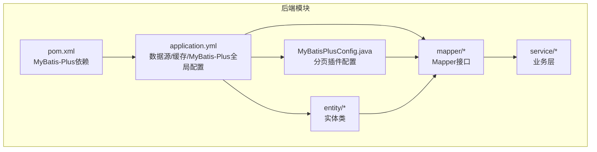
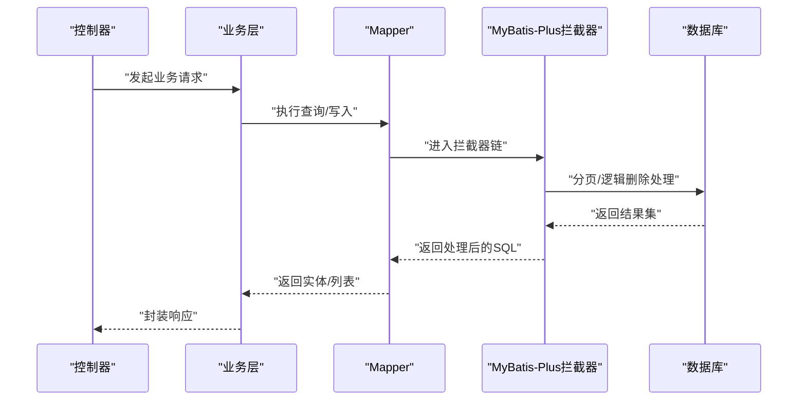
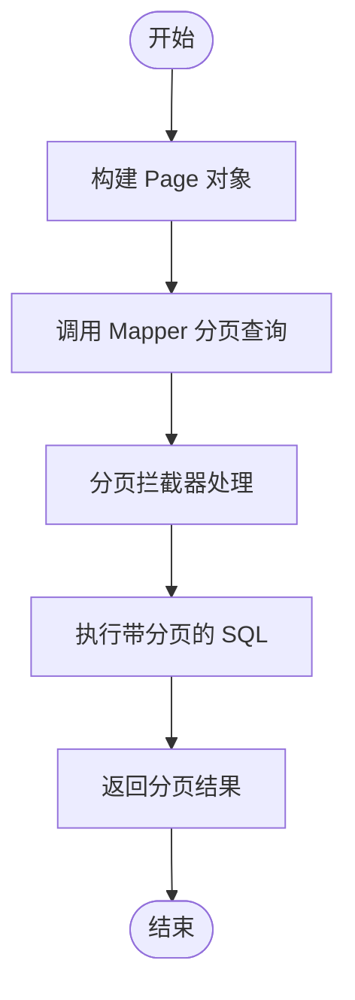
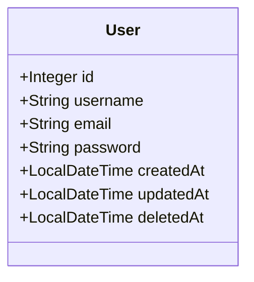
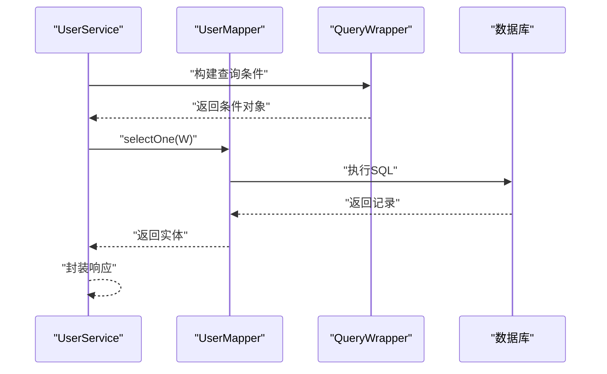
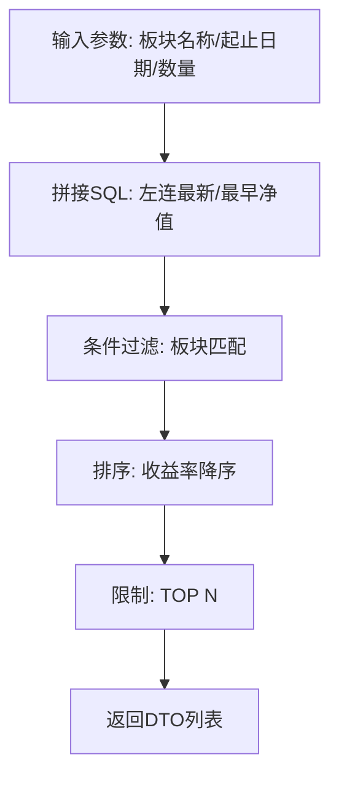
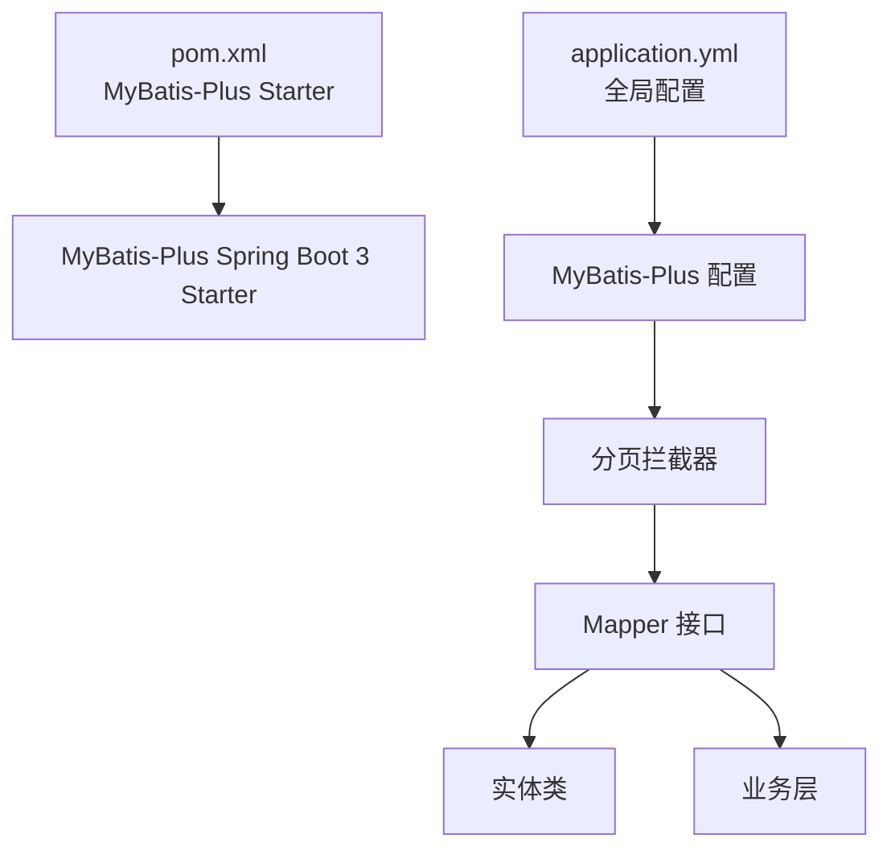

# MyBatis-Plus 配置

<cite>
**本文引用的文件**
- [MyBatisPlusConfig.java](file://backend/src/main/java/com/freetrader/config/MyBatisPlusConfig.java)
- [application.yml](file://backend/src/main/resources/application.yml)
- [pom.xml](file://backend/pom.xml)
- [UserMapper.java](file://backend/src/main/java/com/freetrader/mapper/UserMapper.java)
- [EtfInfoMapper.java](file://backend/src/main/java/com/freetrader/mapper/EtfInfoMapper.java)
- [User.java](file://backend/src/main/java/com/freetrader/entity/User.java)
- [EtfInfo.java](file://backend/src/main/java/com/freetrader/entity/EtfInfo.java)
- [UserService.java](file://backend/src/main/java/com/freetrader/service/UserService.java)
- [UserCollectionMapper.java](file://backend/src/main/java/com/freetrader/mapper/UserCollectionMapper.java)
- [UserCollection.java](file://backend/src/main/java/com/freetrader/entity/UserCollection.java)
- [user_info.sql](file://sql/user_info.sql)
- [etf_info.sql](file://sql/etf_info.sql)
- [UserServiceTest.java](file://backend/src/test/java/com/freetrader/service/UserServiceTest.java)
</cite>

## 目录
1. [简介](#简介)
2. [项目结构](#项目结构)
3. [核心组件](#核心组件)
4. [架构总览](#架构总览)
5. [详细组件分析](#详细组件分析)
6. [依赖关系分析](#依赖关系分析)
7. [性能考虑](#性能考虑)
8. [故障排查指南](#故障排查指南)
9. [结论](#结论)
10. [附录](#附录)

## 简介
本文件系统性梳理 FreeTrader 后端中 MyBatis-Plus 的配置与使用方式，覆盖数据库连接、分页插件、逻辑删除、驼峰映射、SQL 日志、以及通用 CRUD、条件构造器、分页查询等核心特性的配置与实践。同时结合项目实际 Mapper、Entity 与 Service 层用法，给出可操作的最佳实践与性能优化建议。

## 项目结构
MyBatis-Plus 在 FreeTrader 中采用 Spring Boot 自动装配与手动配置相结合的方式：
- 数据源与连接池在应用配置中集中管理
- MyBatis-Plus 插件（主要是分页插件）通过 Java 配置类注入
- 实体类与 Mapper 位于独立包中，遵循 MyBatis-Plus 约定
- 全局配置（类型别名、下划线转驼峰、日志实现）在 YAML 中统一声明

图表来源
- [application.yml](file://backend/src/main/resources/application.yml#L8-L18)
- [application.yml](file://backend/src/main/resources/application.yml#L46-L58)
- [MyBatisPlusConfig.java](file://backend/src/main/java/com/freetrader/config/MyBatisPlusConfig.java#L10-L18)
- [pom.xml](file://backend/pom.xml#L66-L71)

章节来源
- [application.yml](file://backend/src/main/resources/application.yml#L8-L18)
- [application.yml](file://backend/src/main/resources/application.yml#L46-L58)
- [MyBatisPlusConfig.java](file://backend/src/main/java/com/freetrader/config/MyBatisPlusConfig.java#L10-L18)
- [pom.xml](file://backend/pom.xml#L66-L71)

## 核心组件
- 数据库连接与连接池
  - 数据源 URL、用户名、密码、驱动由环境变量控制，连接池参数在 YAML 中配置
- MyBatis-Plus 插件
  - 分页插件通过 Java 配置类注入，指定数据库类型为 MySQL
- 全局配置
  - Mapper XML 路径、实体包扫描、下划线转驼峰、SQL 日志实现
  - 全局逻辑删除字段与值
- 实体与 Mapper
  - 实体类标注表名与主键策略；Mapper 继承 BaseMapper 获取通用 CRUD
- 条件构造器与分页查询
  - Service 层广泛使用 QueryWrapper 构造查询条件；分页查询通过 Page 对象与分页插件配合

章节来源
- [application.yml](file://backend/src/main/resources/application.yml#L8-L18)
- [application.yml](file://backend/src/main/resources/application.yml#L46-L58)
- [MyBatisPlusConfig.java](file://backend/src/main/java/com/freetrader/config/MyBatisPlusConfig.java#L10-L18)
- [UserMapper.java](file://backend/src/main/java/com/freetrader/mapper/UserMapper.java#L1-L10)
- [UserService.java](file://backend/src/main/java/com/freetrader/service/UserService.java#L31-L39)

## 架构总览
MyBatis-Plus 在 FreeTrader 中的运行链路如下：
- 控制器接收请求 → 业务层调用 Mapper 执行查询/写入 → MyBatis-Plus 拦截器处理分页与逻辑删除 → JDBC 执行 SQL → 返回结果

图表来源
- [MyBatisPlusConfig.java](file://backend/src/main/java/com/freetrader/config/MyBatisPlusConfig.java#L12-L17)
- [UserService.java](file://backend/src/main/java/com/freetrader/service/UserService.java#L31-L39)
- [UserMapper.java](file://backend/src/main/java/com/freetrader/mapper/UserMapper.java#L1-L10)

## 详细组件分析

### 数据库连接与连接池配置
- 数据源参数
  - URL、用户名、密码、驱动类名均支持环境变量注入，便于多环境部署
  - 连接池参数包含最大池大小、最小空闲、连接超时、空闲超时、最大生存时间
- 生产建议
  - 根据并发与 QPS 调整最大池大小与超时参数
  - 开启连接池健康检查与异常重试策略（如需）

章节来源
- [application.yml](file://backend/src/main/resources/application.yml#L8-L18)

### MyBatis-Plus 分页插件配置
- 配置要点
  - 通过 Java 配置类注册 MybatisPlusInterceptor，并添加 PaginationInnerInterceptor
  - 指定数据库类型为 MySQL，确保分页 SQL 适配正确
- 使用方式
  - Service 层构建 Page 对象并传入 Mapper 方法，即可获得分页结果
  - 分页插件自动改写 SQL，注入分页参数

图表来源
- [MyBatisPlusConfig.java](file://backend/src/main/java/com/freetrader/config/MyBatisPlusConfig.java#L12-L17)
- [UserService.java](file://backend/src/main/java/com/freetrader/service/UserService.java#L98-L101)

章节来源
- [MyBatisPlusConfig.java](file://backend/src/main/java/com/freetrader/config/MyBatisPlusConfig.java#L10-L18)

### 全局配置与逻辑删除
- 全局配置
  - Mapper XML 位置、实体包扫描、下划线转驼峰、SQL 日志实现
- 逻辑删除
  - 全局逻辑删除字段为 deletedAt，删除值为 NOW()，未删除值为 null
  - 实体类中定义 deletedAt 字段，配合注解使用

图表来源
- [application.yml](file://backend/src/main/resources/application.yml#L53-L58)
- [User.java](file://backend/src/main/java/com/freetrader/entity/User.java#L10-L28)

章节来源
- [application.yml](file://backend/src/main/resources/application.yml#L46-L58)
- [User.java](file://backend/src/main/java/com/freetrader/entity/User.java#L10-L28)

### 通用 CRUD 与条件构造器
- 通用 CRUD
  - Mapper 接口继承 BaseMapper，即可获得 insert、deleteById、updateById、selectById、selectList、selectPage 等能力
- 条件构造器
  - Service 层广泛使用 QueryWrapper 构建查询条件，如 eq、isNull、like 等
  - 结合实体类字段与数据库列名映射，确保查询准确性

图表来源
- [UserService.java](file://backend/src/main/java/com/freetrader/service/UserService.java#L31-L39)
- [UserMapper.java](file://backend/src/main/java/com/freetrader/mapper/UserMapper.java#L1-L10)

章节来源
- [UserMapper.java](file://backend/src/main/java/com/freetrader/mapper/UserMapper.java#L1-L10)
- [UserService.java](file://backend/src/main/java/com/freetrader/service/UserService.java#L31-L39)

### 自定义 SQL 与复杂查询
- 自定义 SQL
  - 通过 @Select 注解编写复杂查询，如按区间计算收益的 ETF 查询
  - 参数使用 @Param 标注，便于 MyBatis 映射
- 复杂查询示例
  - EtfInfoMapper 提供按板块筛选、时间窗口计算收益的 Top N 查询

图表来源
- [EtfInfoMapper.java](file://backend/src/main/java/com/freetrader/mapper/EtfInfoMapper.java#L15-L51)
- [EtfInfo.java](file://backend/src/main/java/com/freetrader/entity/EtfInfo.java#L10-L23)

章节来源
- [EtfInfoMapper.java](file://backend/src/main/java/com/freetrader/mapper/EtfInfoMapper.java#L1-L53)
- [EtfInfo.java](file://backend/src/main/java/com/freetrader/entity/EtfInfo.java#L1-L24)

### 逻辑删除与软删除实践
- 表结构
  - user_info 表包含 deleted_at 字段，支持软删除
- 实体映射
  - User 实体定义 deletedAt 字段，配合全局逻辑删除配置
- 使用注意
  - 查询默认排除 deleted_at 非空记录；删除时写入当前时间到 deleted_at

章节来源
- [user_info.sql](file://sql/user_info.sql#L24-L35)
- [User.java](file://backend/src/main/java/com/freetrader/entity/User.java#L23-L27)
- [application.yml](file://backend/src/main/resources/application.yml#L56-L58)

### 关联收藏与用户收藏查询
- 实体与 Mapper
  - UserCollection 实体映射 user_collection 表，提供按用户 ID 查询收藏分类 ID 的方法
- 业务场景
  - 用于获取用户的收藏板块集合，支撑个性化推荐与展示

章节来源
- [UserCollection.java](file://backend/src/main/java/com/freetrader/entity/UserCollection.java#L10-L22)
- [UserCollectionMapper.java](file://backend/src/main/java/com/freetrader/mapper/UserCollectionMapper.java#L11-L18)

### 测试中的 MyBatis-Plus 使用模式
- 单元测试
  - 使用 Mockito 模拟 Mapper，验证条件构造器与通用 CRUD 的组合使用
  - 验证登录、注册、按用户名查询等典型流程

章节来源
- [UserServiceTest.java](file://backend/src/test/java/com/freetrader/service/UserServiceTest.java#L33-L54)
- [UserServiceTest.java](file://backend/src/test/java/com/freetrader/service/UserServiceTest.java#L62-L84)
- [UserServiceTest.java](file://backend/src/test/java/com/freetrader/service/UserServiceTest.java#L130-L159)

## 依赖关系分析
MyBatis-Plus 在项目中的依赖与集成关系如下：

图表来源
- [pom.xml](file://backend/pom.xml#L66-L71)
- [application.yml](file://backend/src/main/resources/application.yml#L46-L58)
- [MyBatisPlusConfig.java](file://backend/src/main/java/com/freetrader/config/MyBatisPlusConfig.java#L12-L17)

章节来源
- [pom.xml](file://backend/pom.xml#L66-L71)
- [application.yml](file://backend/src/main/resources/application.yml#L46-L58)
- [MyBatisPlusConfig.java](file://backend/src/main/java/com/freetrader/config/MyBatisPlusConfig.java#L10-L18)

## 性能考虑
- 连接池参数
  - 根据业务并发调整最大池大小与最小空闲，避免连接争用
  - 合理设置连接超时与空闲超时，降低资源占用
- SQL 日志
  - 开发环境开启 SQL 日志便于调试；生产环境建议关闭或降级，减少 IO 开销
- 分页策略
  - 大数据量分页优先使用索引列作为查询条件，避免全表扫描
  - 合理设置每页大小，避免一次性加载过多数据
- 逻辑删除
  - 避免对 deleted_at 字段建立冗余索引，保持写入性能
  - 查询时尽量使用默认过滤，减少显式条件

章节来源
- [application.yml](file://backend/src/main/resources/application.yml#L13-L18)
- [application.yml](file://backend/src/main/resources/application.yml#L51-L52)
- [application.yml](file://backend/src/main/resources/application.yml#L56-L58)

## 故障排查指南
- SQL 日志定位
  - 通过 application.yml 中的日志实现配置快速定位慢查询与异常 SQL
- 条件构造器问题
  - 确认 QueryWrapper 条件拼装顺序与逻辑，避免遗漏或误加条件
- 分页异常
  - 确认分页插件已正确注册且数据库类型匹配；检查 Page 对象参数是否合理
- 逻辑删除失效
  - 确认实体字段与全局配置一致；查询时避免显式过滤 deleted_at

章节来源
- [application.yml](file://backend/src/main/resources/application.yml#L51-L52)
- [MyBatisPlusConfig.java](file://backend/src/main/java/com/freetrader/config/MyBatisPlusConfig.java#L12-L17)
- [application.yml](file://backend/src/main/resources/application.yml#L56-L58)

## 结论
FreeTrader 中的 MyBatis-Plus 配置简洁而实用：通过 YAML 定义数据源与全局行为，通过 Java 配置注入分页插件，结合实体与 Mapper 的约定实现通用 CRUD 与条件查询。配合逻辑删除与合理的性能参数，能够满足中小规模应用的数据访问需求。建议在生产环境中进一步细化连接池与 SQL 日志策略，并持续监控慢查询与分页性能。

## 附录
- 配置清单
  - 数据源：URL、用户名、密码、驱动、连接池参数
  - MyBatis-Plus：Mapper XML 位置、实体包、驼峰映射、SQL 日志实现
  - 全局配置：ID 策略、逻辑删除字段与值
- 最佳实践
  - 使用 QueryWrapper 构建条件，避免手写复杂 SQL
  - 对高频查询建立必要索引，分页查询使用稳定排序字段
  - 生产环境关闭详细 SQL 日志，使用结构化日志与指标监控