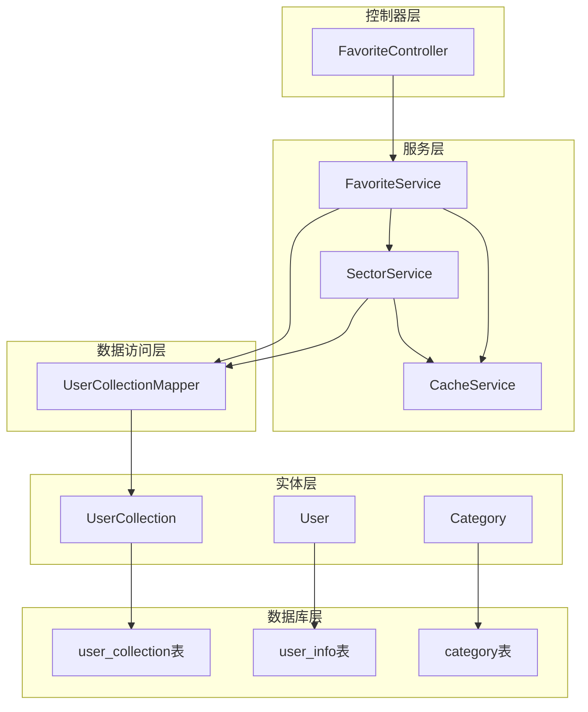
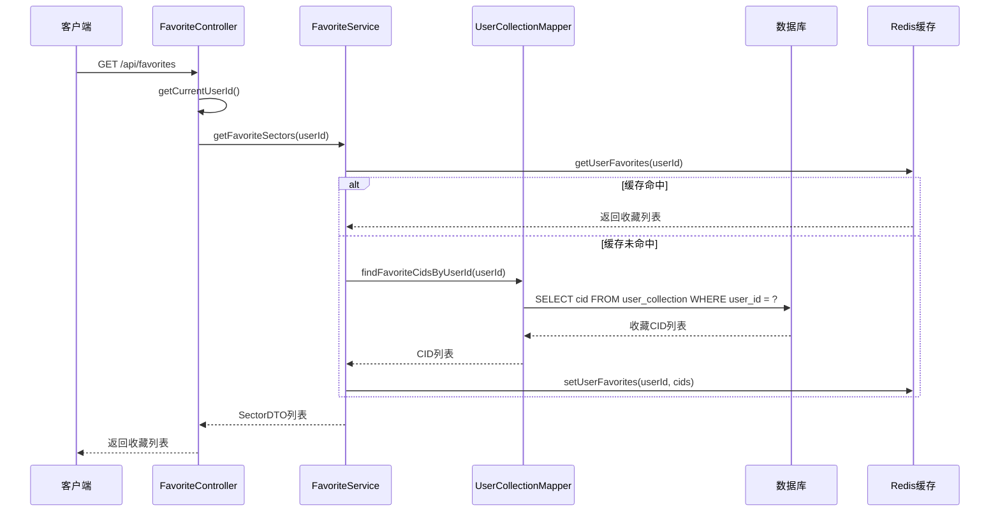
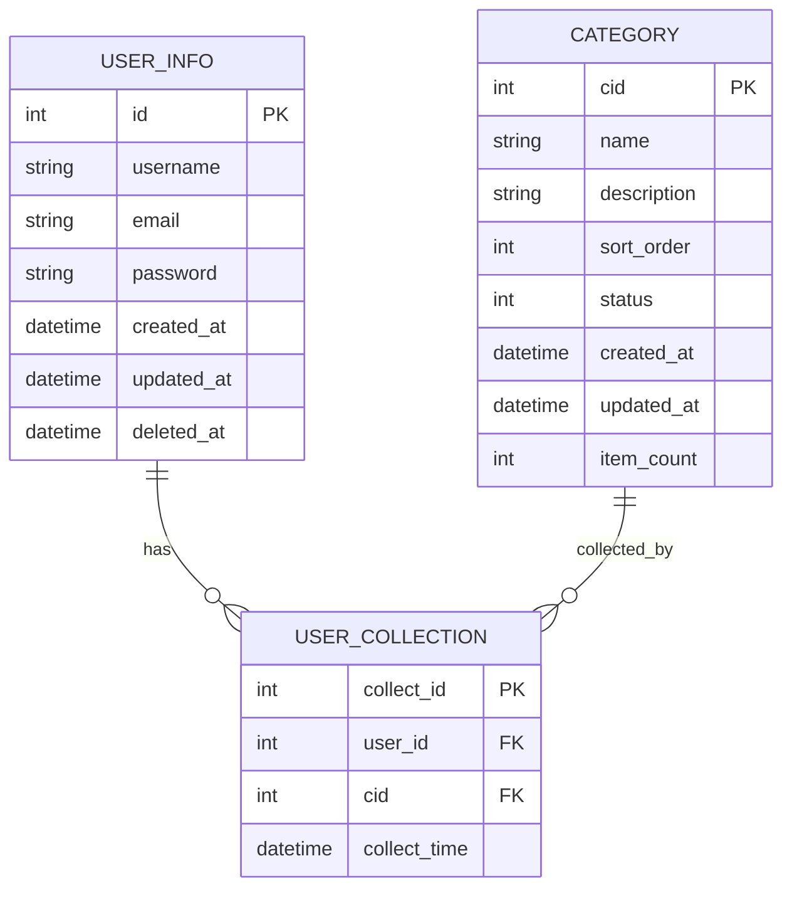
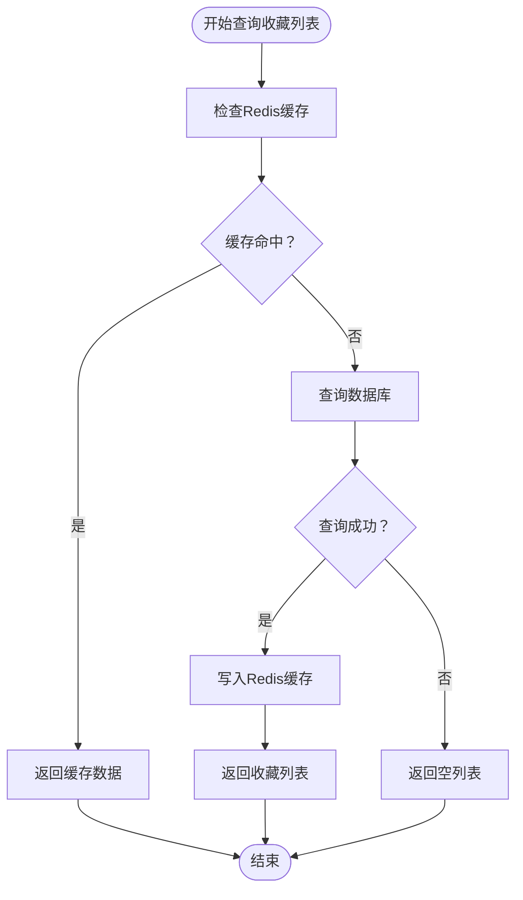
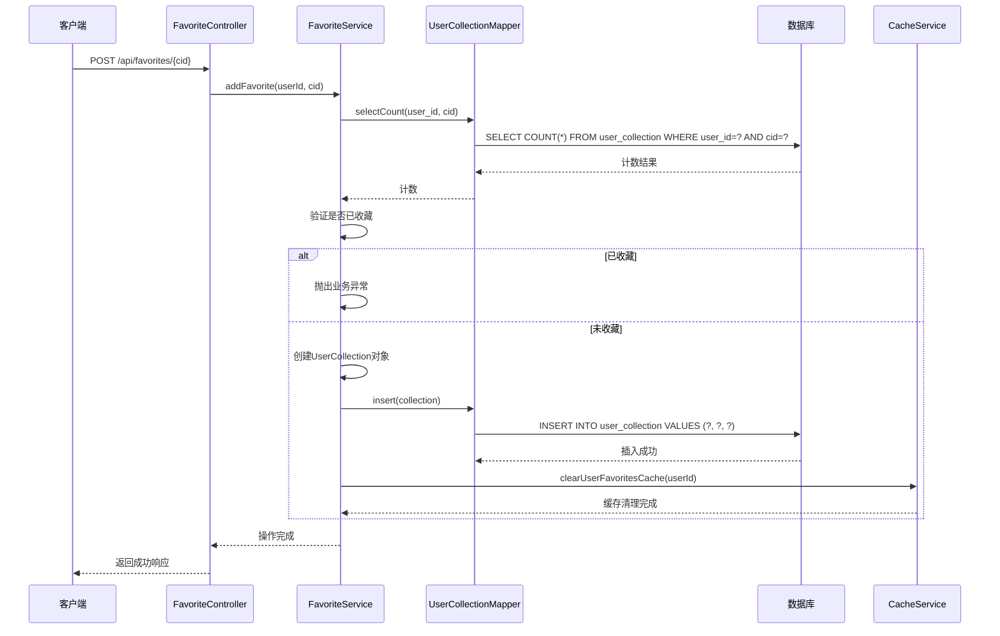
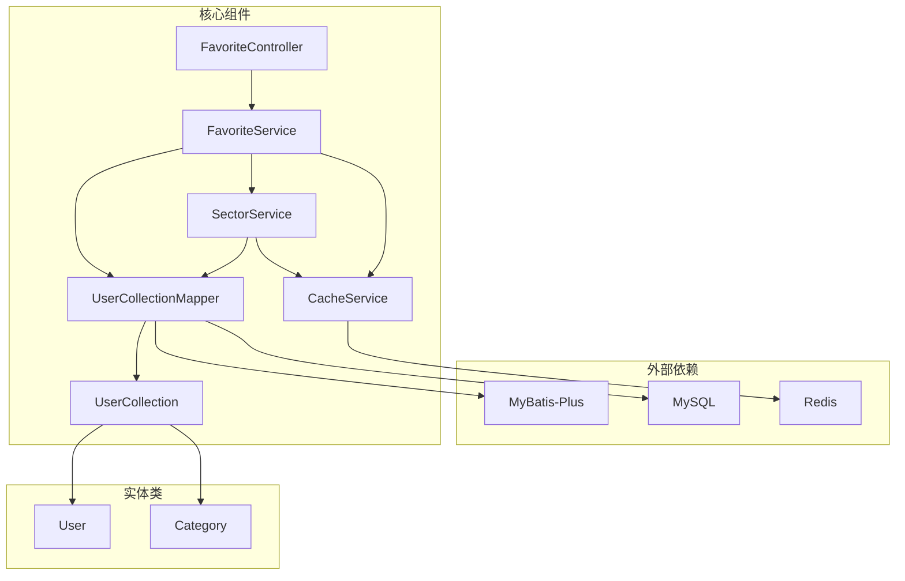

# 收藏数据访问层

<cite>
**本文档引用的文件**
- [UserCollectionMapper.java](file://backend/src/main/java/com/freetrader/mapper/UserCollectionMapper.java)
- [UserCollection.java](file://backend/src/main/java/com/freetrader/entity/UserCollection.java)
- [FavoriteService.java](file://backend/src/main/java/com/freetrader/service/FavoriteService.java)
- [FavoriteController.java](file://backend/src/main/java/com/freetrader/controller/FavoriteController.java)
- [SectorService.java](file://backend/src/main/java/com/freetrader/service/SectorService.java)
- [CacheService.java](file://backend/src/main/java/com/freetrader/service/CacheService.java)
- [user_collection.sql](file://sql/user_collection.sql)
- [ErrorCode.java](file://backend/src/main/java/com/freetrader/exception/ErrorCode.java)
- [application.yml](file://backend/src/main/resources/application.yml)
- [User.java](file://backend/src/main/java/com/freetrader/entity/User.java)
- [Category.java](file://backend/src/main/java/com/freetrader/entity/Category.java)
</cite>

## 目录
1. [简介](#简介)
2. [项目结构](#项目结构)
3. [核心组件](#核心组件)
4. [架构概览](#架构概览)
5. [详细组件分析](#详细组件分析)
6. [依赖关系分析](#依赖关系分析)
7. [性能考虑](#性能考虑)
8. [故障排除指南](#故障排除指南)
9. [结论](#结论)

## 简介

收藏数据访问层是FreeTrader项目中负责用户板块收藏管理的核心模块。该层实现了用户收藏的完整生命周期管理，包括收藏列表查询、添加收藏、取消收藏、收藏状态切换等核心功能。系统采用分层架构设计，通过MyBatis-Plus实现数据持久化，结合Redis缓存提供高性能的数据访问体验。

本技术文档深入分析UserCollectionMapper接口的设计理念和实现细节，详细解释收藏相关的数据访问操作，并提供完整的事务处理和并发控制策略说明。

## 项目结构

收藏数据访问层位于后端项目的分层架构中，采用标准的MVC模式组织代码：

**图表来源**
- [FavoriteController.java](file://backend/src/main/java/com/freetrader/controller/FavoriteController.java#L31-L89)
- [FavoriteService.java](file://backend/src/main/java/com/freetrader/service/FavoriteService.java#L25-L118)
- [UserCollectionMapper.java](file://backend/src/main/java/com/freetrader/mapper/UserCollectionMapper.java#L12-L19)

**章节来源**
- [FavoriteController.java](file://backend/src/main/java/com/freetrader/controller/FavoriteController.java#L1-L90)
- [FavoriteService.java](file://backend/src/main/java/com/freetrader/service/FavoriteService.java#L1-L119)
- [UserCollectionMapper.java](file://backend/src/main/java/com/freetrader/mapper/UserCollectionMapper.java#L1-L20)

## 核心组件

### UserCollectionMapper接口

UserCollectionMapper是收藏数据访问的核心接口，继承自MyBatis-Plus的BaseMapper，提供了针对用户收藏表的专门查询能力。

**主要特性：**
- 继承BaseMapper的所有通用CRUD操作
- 提供按用户ID查询收藏分类ID的专用查询方法
- 使用注解驱动的SQL映射，简化数据库操作

**关键方法：**
- `findFavoriteCidsByUserId(Integer userId)` - 查询用户的所有收藏分类ID

**章节来源**
- [UserCollectionMapper.java](file://backend/src/main/java/com/freetrader/mapper/UserCollectionMapper.java#L12-L19)

### UserCollection实体类

UserCollection实体类映射到数据库的user_collection表，定义了收藏记录的完整结构。

**核心字段：**
- `collectId`: 收藏记录主键，自增ID
- `userId`: 用户ID，关联用户表
- `cid`: 分类ID，关联分类表
- `collectTime`: 收藏时间，默认当前时间戳

**章节来源**
- [UserCollection.java](file://backend/src/main/java/com/freetrader/entity/UserCollection.java#L12-L22)

### FavoriteService服务层

FavoriteService是收藏业务逻辑的核心实现，提供了完整的收藏管理功能。

**核心功能：**
- 收藏列表查询：`getFavoriteSectors(Integer userId)`
- 添加收藏：`addFavorite(Integer userId, Integer cid)`
- 取消收藏：`removeFavorite(Integer userId, Integer cid)`
- 切换收藏状态：`toggleFavorite(Integer userId, Integer cid)`

**事务处理：**
- 所有收藏操作均使用@Transactional注解确保数据一致性
- 支持嵌套事务和回滚机制

**章节来源**
- [FavoriteService.java](file://backend/src/main/java/com/freetrader/service/FavoriteService.java#L34-L117)

## 架构概览

收藏数据访问层采用分层架构设计，各层职责明确，耦合度低：

**图表来源**
- [FavoriteController.java](file://backend/src/main/java/com/freetrader/controller/FavoriteController.java#L48-L52)
- [FavoriteService.java](file://backend/src/main/java/com/freetrader/service/FavoriteService.java#L34-L41)
- [SectorService.java](file://backend/src/main/java/com/freetrader/service/SectorService.java#L81-L104)

**章节来源**
- [FavoriteController.java](file://backend/src/main/java/com/freetrader/controller/FavoriteController.java#L35-L52)
- [FavoriteService.java](file://backend/src/main/java/com/freetrader/service/FavoriteService.java#L34-L41)
- [SectorService.java](file://backend/src/main/java/com/freetrader/service/SectorService.java#L81-L104)

## 详细组件分析

### 数据模型关系

收藏数据与用户数据、板块数据之间存在明确的关联关系：

**图表来源**
- [user_collection.sql](file://sql/user_collection.sql#L24-L34)
- [User.java](file://backend/src/main/java/com/freetrader/entity/User.java#L12-L28)
- [Category.java](file://backend/src/main/java/com/freetrader/entity/Category.java#L13-L44)

### 收藏列表查询流程

收藏列表查询是系统中最频繁的操作之一，采用了多级缓存策略：

**图表来源**
- [SectorService.java](file://backend/src/main/java/com/freetrader/service/SectorService.java#L81-L104)
- [CacheService.java](file://backend/src/main/java/com/freetrader/service/CacheService.java#L108-L139)

**章节来源**
- [SectorService.java](file://backend/src/main/java/com/freetrader/service/SectorService.java#L81-L104)
- [CacheService.java](file://backend/src/main/java/com/freetrader/service/CacheService.java#L108-L139)

### 添加收藏操作

添加收藏操作包含完整的业务验证和事务处理：

**图表来源**
- [FavoriteController.java](file://backend/src/main/java/com/freetrader/controller/FavoriteController.java#L60-L65)
- [FavoriteService.java](file://backend/src/main/java/com/freetrader/service/FavoriteService.java#L46-L66)

**章节来源**
- [FavoriteService.java](file://backend/src/main/java/com/freetrader/service/FavoriteService.java#L46-L66)
- [FavoriteController.java](file://backend/src/main/java/com/freetrader/controller/FavoriteController.java#L60-L65)

### 取消收藏操作

取消收藏操作同样遵循严格的事务控制和错误处理机制：

**章节来源**
- [FavoriteService.java](file://backend/src/main/java/com/freetrader/service/FavoriteService.java#L71-L85)
- [FavoriteController.java](file://backend/src/main/java/com/freetrader/controller/FavoriteController.java#L73-L78)

### 收藏状态切换

收藏状态切换是一个原子性操作，支持一键切换收藏状态：

**章节来源**
- [FavoriteService.java](file://backend/src/main/java/com/freetrader/service/FavoriteService.java#L91-L117)
- [FavoriteController.java](file://backend/src/main/java/com/freetrader/controller/FavoriteController.java#L83-L88)

## 依赖关系分析

收藏数据访问层的依赖关系清晰明确，各组件之间的耦合度适中：

**图表来源**
- [FavoriteController.java](file://backend/src/main/java/com/freetrader/controller/FavoriteController.java#L32-L33)
- [FavoriteService.java](file://backend/src/main/java/com/freetrader/service/FavoriteService.java#L27-L29)
- [SectorService.java](file://backend/src/main/java/com/freetrader/service/SectorService.java#L32-L36)

**章节来源**
- [FavoriteController.java](file://backend/src/main/java/com/freetrader/controller/FavoriteController.java#L32-L33)
- [FavoriteService.java](file://backend/src/main/java/com/freetrader/service/FavoriteService.java#L27-L29)
- [SectorService.java](file://backend/src/main/java/com/freetrader/service/SectorService.java#L32-L36)

### 并发控制策略

系统采用多层并发控制策略确保数据一致性：

1. **数据库层面约束**
   - 唯一索引约束：`(user_id, cid)`确保同一用户不能重复收藏同一板块
   - 外键约束：自动级联删除用户收藏记录

2. **应用层面控制**
   - 事务管理：所有收藏操作都在事务中执行
   - 缓存一致性：操作完成后立即清理相关缓存

3. **缓存层面优化**
   - 用户收藏缓存：默认5分钟过期时间
   - 缓存失效：操作完成后主动清理缓存

**章节来源**
- [user_collection.sql](file://sql/user_collection.sql#L29-L33)
- [application.yml](file://backend/src/main/resources/application.yml#L43-L44)

## 性能考虑

### 缓存策略

系统实现了多层次的缓存策略以提升性能：

1. **用户收藏缓存**
   - 缓存键前缀：`user:favorites:`
   - 默认过期时间：5分钟
   - 缓存容量：根据用户数量动态调整

2. **板块基础数据缓存**
   - 缓存键：`sectors:base_sectors`
   - 过期时间：默认5分钟
   - 支持条件缓存注解

3. **Redis连接池配置**
   - 最大活跃连接：8
   - 最大空闲连接：8
   - 最小空闲连接：0
   - 连接超时：10秒

### 数据库优化

1. **索引设计**
   - 主键索引：`PRIMARY KEY(collect_id)`
   - 唯一索引：`UNIQUE INDEX(uk_user_cid)`
   - 辅助索引：`INDEX(idx_cid)`

2. **查询优化**
   - 使用批量查询减少数据库往返
   - 缓存热点数据避免重复查询
   - 合理使用LIMIT限制结果集大小

**章节来源**
- [CacheService.java](file://backend/src/main/java/com/freetrader/service/CacheService.java#L108-L139)
- [application.yml](file://backend/src/main/resources/application.yml#L32-L37)
- [user_collection.sql](file://sql/user_collection.sql#L29-L33)

## 故障排除指南

### 常见问题及解决方案

1. **收藏重复异常**
   - 现象：添加收藏时报错"已收藏该板块"
   - 原因：数据库唯一约束触发
   - 解决：先检查收藏状态再进行添加操作

2. **取消收藏失败**
   - 现象：取消收藏时报错"未收藏该板块"
   - 原因：目标收藏记录不存在
   - 解决：确认收藏状态后再执行取消操作

3. **缓存不同步**
   - 现象：收藏状态更新但页面显示异常
   - 原因：缓存未及时清理
   - 解决：调用缓存清理方法或等待缓存过期

4. **数据库连接问题**
   - 现象：收藏操作超时或失败
   - 原因：数据库连接池耗尽
   - 解决：检查连接池配置和数据库状态

**章节来源**
- [ErrorCode.java](file://backend/src/main/java/com/freetrader/exception/ErrorCode.java#L29-L30)
- [FavoriteService.java](file://backend/src/main/java/com/freetrader/service/FavoriteService.java#L54-L80)

### 错误码定义

系统定义了完整的错误码体系用于统一错误处理：

| 错误码 | 错误类型 | 描述 |
|--------|----------|------|
| 4002 | FAVORITE_EXISTS | 已收藏该板块 |
| 4003 | FAVORITE_NOT_FOUND | 未收藏该板块 |

**章节来源**
- [ErrorCode.java](file://backend/src/main/java/com/freetrader/exception/ErrorCode.java#L29-L30)

## 结论

收藏数据访问层通过精心设计的架构和完善的缓存策略，为用户提供了高效、可靠的收藏管理功能。系统的主要优势包括：

1. **清晰的架构设计**：分层架构确保了代码的可维护性和可扩展性
2. **完善的缓存策略**：多级缓存显著提升了系统性能
3. **严格的事务控制**：确保数据一致性和业务逻辑正确性
4. **优雅的错误处理**：提供友好的用户体验和完善的错误反馈

未来可以考虑的改进方向：
- 增加更细粒度的缓存控制
- 实现分布式锁解决高并发场景下的竞态条件
- 添加收藏操作的审计日志
- 优化批量操作的性能表现