# 数据访问层设计

<cite>
**本文档引用的文件**
- [MyBatisPlusConfig.java](file://backend/src/main/java/com/freetrader/config/MyBatisPlusConfig.java)
- [application.yml](file://backend/src/main/resources/application.yml)
- [UserMapper.java](file://backend/src/main/java/com/freetrader/mapper/UserMapper.java)
- [CategoryMapper.java](file://backend/src/main/java/com/freetrader/mapper/CategoryMapper.java)
- [EtfInfoMapper.java](file://backend/src/main/java/com/freetrader/mapper/EtfInfoMapper.java)
- [UserCollectionMapper.java](file://backend/src/main/java/com/freetrader/mapper/UserCollectionMapper.java)
- [CalendarMapper.java](file://backend/src/main/java/com/freetrader/mapper/CalendarMapper.java)
- [EtfNetAssetMapper.java](file://backend/src/main/java/com/freetrader/mapper/EtfNetAssetMapper.java)
- [User.java](file://backend/src/main/java/com/freetrader/entity/User.java)
- [Category.java](file://backend/src/main/java/com/freetrader/entity/Category.java)
- [EtfInfo.java](file://backend/src/main/java/com/freetrader/entity/EtfInfo.java)
- [UserCollection.java](file://backend/src/main/java/com/freetrader/entity/UserCollection.java)
- [SectorService.java](file://backend/src/main/java/com/freetrader/service/SectorService.java)
- [FavoriteService.java](file://backend/src/main/java/com/freetrader/service/FavoriteService.java)
- [pom.xml](file://backend/pom.xml)
</cite>

## 目录
1. [简介](#简介)
2. [项目结构](#项目结构)
3. [核心组件](#核心组件)
4. [架构概览](#架构概览)
5. [详细组件分析](#详细组件分析)
6. [依赖关系分析](#依赖关系分析)
7. [性能考虑](#性能考虑)
8. [故障排除指南](#故障排除指南)
9. [结论](#结论)

## 简介

FreeTrader 是一个基于 Spring Boot 和 MyBatis-Plus 的金融数据跟踪应用。数据访问层采用 MyBatis-Plus 框架，提供了强大的 ORM 能力和便捷的 CRUD 操作。本技术文档深入分析了数据访问层的设计，包括各个 Mapper 接口的实现、MyBatis-Plus 的配置和使用、实体类与数据库表的映射关系，以及性能优化的最佳实践。

## 项目结构

数据访问层位于 `backend/src/main/java/com/freetrader/mapper` 目录下，采用标准的分层架构设计：

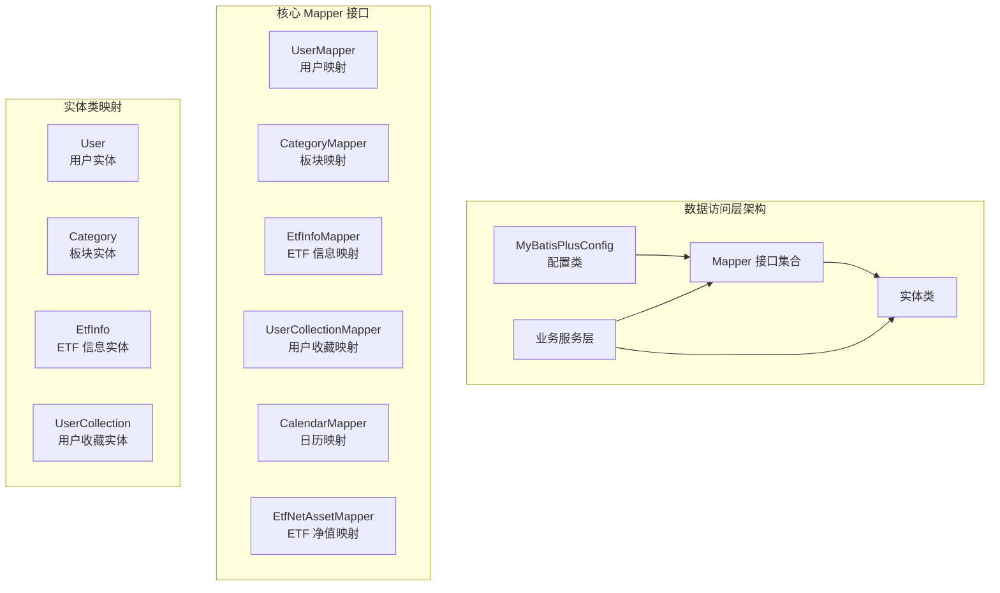

**图表来源**
- [MyBatisPlusConfig.java](file://backend/src/main/java/com/freetrader/config/MyBatisPlusConfig.java#L1-L19)
- [UserMapper.java](file://backend/src/main/java/com/freetrader/mapper/UserMapper.java#L1-L10)
- [CategoryMapper.java](file://backend/src/main/java/com/freetrader/mapper/CategoryMapper.java#L1-L48)

**章节来源**
- [MyBatisPlusConfig.java](file://backend/src/main/java/com/freetrader/config/MyBatisPlusConfig.java#L1-L19)
- [application.yml](file://backend/src/main/resources/application.yml#L46-L59)

## 核心组件

### MyBatis-Plus 配置

系统采用 MyBatis-Plus 3.5.5 版本，通过配置类启用分页插件和全局配置：

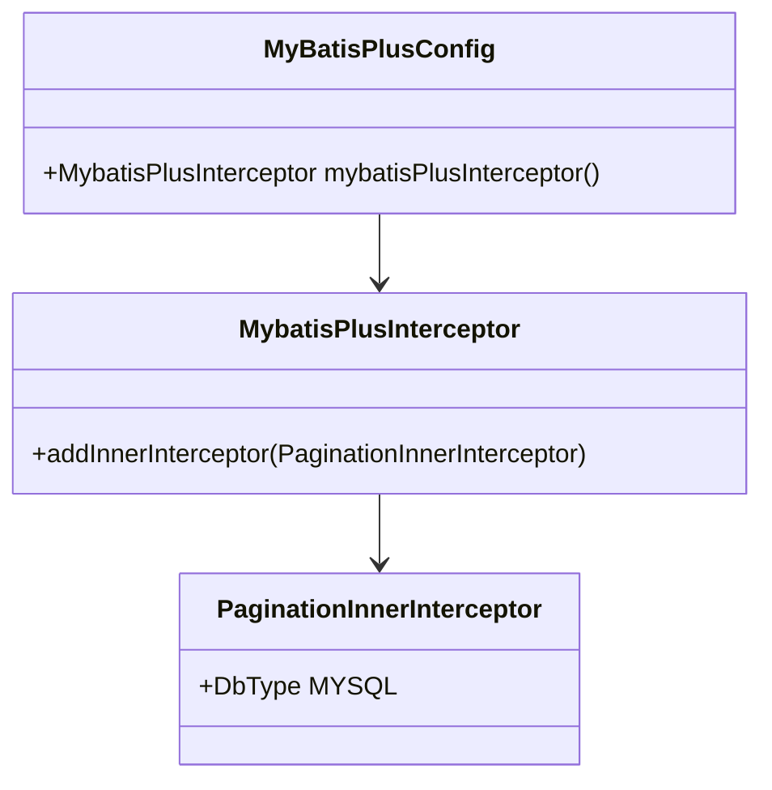

**图表来源**
- [MyBatisPlusConfig.java](file://backend/src/main/java/com/freetrader/config/MyBatisPlusConfig.java#L10-L18)

### 数据源配置

应用配置支持多种数据源参数，包括连接池大小、超时设置等：

- 最大连接池大小：10
- 最小空闲连接：5  
- 连接超时：30000ms
- 空闲超时：600000ms
- 最大生命周期：1800000ms

**章节来源**
- [application.yml](file://backend/src/main/resources/application.yml#L8-L19)

## 架构概览

数据访问层采用分层架构，各层职责清晰分离：

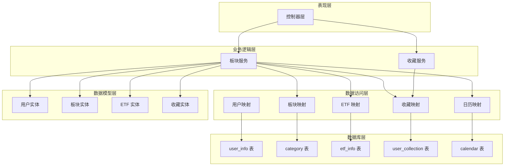

**图表来源**
- [SectorService.java](file://backend/src/main/java/com/freetrader/service/SectorService.java#L32-L36)
- [FavoriteService.java](file://backend/src/main/java/com/freetrader/service/FavoriteService.java#L27-L29)

## 详细组件分析

### 用户映射 (UserMapper)

UserMapper 继承 MyBatis-Plus 的 BaseMapper，提供完整的 CRUD 操作能力：

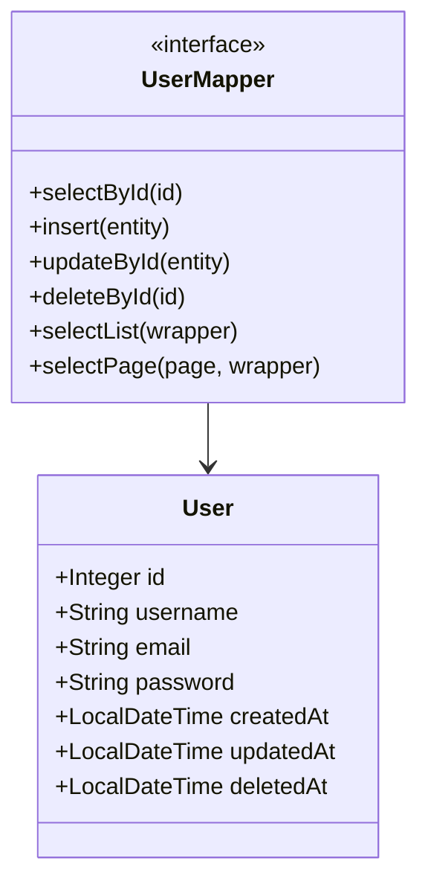

**图表来源**
- [UserMapper.java](file://backend/src/main/java/com/freetrader/mapper/UserMapper.java#L8-L9)
- [User.java](file://backend/src/main/java/com/freetrader/entity/User.java#L14-L27)

用户实体采用逻辑删除策略，通过 `deletedAt` 字段实现软删除：

- 主键策略：AUTO（自增）
- 逻辑删除字段：`deletedAt`
- 删除值：NOW()
- 未删除值：null

**章节来源**
- [UserMapper.java](file://backend/src/main/java/com/freetrader/mapper/UserMapper.java#L1-L10)
- [User.java](file://backend/src/main/java/com/freetrader/entity/User.java#L1-L29)
- [application.yml](file://backend/src/main/resources/application.yml#L56-L58)

### 板块映射 (CategoryMapper)

CategoryMapper 提供板块数据查询和性能计算功能：

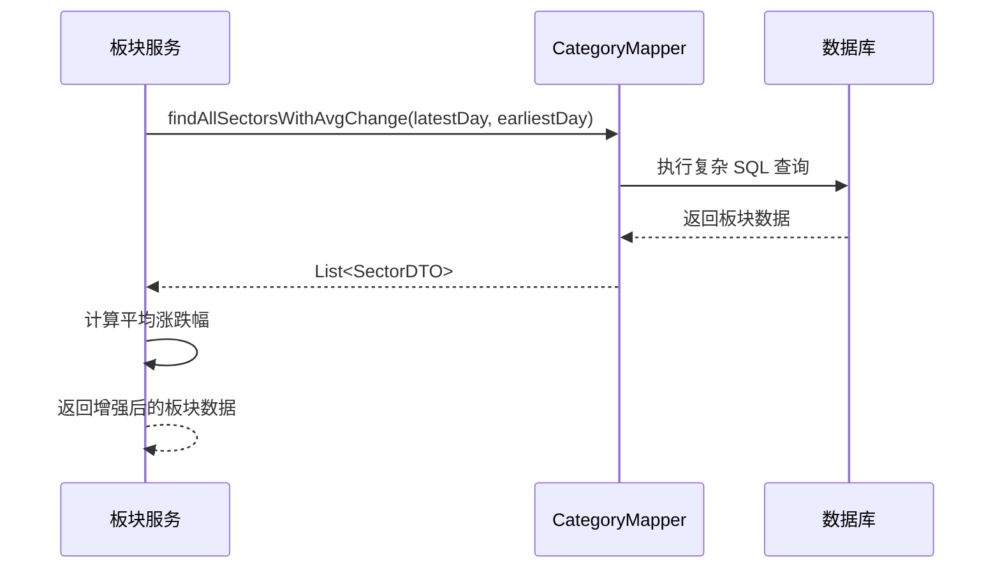

**图表来源**
- [CategoryMapper.java](file://backend/src/main/java/com/freetrader/mapper/CategoryMapper.java#L19-L46)
- [SectorService.java](file://backend/src/main/java/com/freetrader/service/SectorService.java#L124-L141)

该接口包含复杂的 SQL 查询，计算每个板块在指定交易日范围内的平均涨跌幅：

- 使用 LEFT JOIN 连接 ETF 信息表
- 通过两个时间点的净值计算涨跌幅
- 支持按排序字段降序排列

**章节来源**
- [CategoryMapper.java](file://backend/src/main/java/com/freetrader/mapper/CategoryMapper.java#L1-L48)
- [Category.java](file://backend/src/main/java/com/freetrader/entity/Category.java#L1-L45)

### ETF 信息映射 (EtfInfoMapper)

EtfInfoMapper 提供板块内 ETF 排名查询功能：

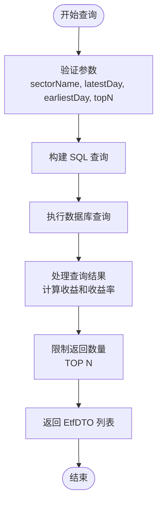

**图表来源**
- [EtfInfoMapper.java](file://backend/src/main/java/com/freetrader/mapper/EtfInfoMapper.java#L18-L51)
- [SectorService.java](file://backend/src/main/java/com/freetrader/service/SectorService.java#L187-L191)

ETF 查询包含以下关键特性：

- 计算净值变化量和百分比
- 支持按收益率降序排列
- 限制返回记录数量
- 使用别名映射到 DTO 对象

**章节来源**
- [EtfInfoMapper.java](file://backend/src/main/java/com/freetrader/mapper/EtfInfoMapper.java#L1-L53)
- [EtfInfo.java](file://backend/src/main/java/com/freetrader/entity/EtfInfo.java#L1-L24)

### 用户收藏映射 (UserCollectionMapper)

UserCollectionMapper 处理用户收藏管理：

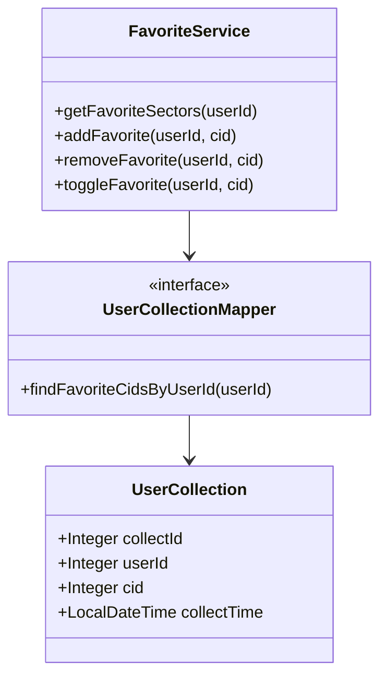

**图表来源**
- [UserCollectionMapper.java](file://backend/src/main/java/com/freetrader/mapper/UserCollectionMapper.java#L17-L18)
- [UserCollection.java](file://backend/src/main/java/com/freetrader/entity/UserCollection.java#L14-L21)
- [FavoriteService.java](file://backend/src/main/java/com/freetrader/service/FavoriteService.java#L34-L41)

收藏功能采用事务性操作，确保数据一致性：

- 添加收藏：检查重复后插入新记录
- 移除收藏：根据用户 ID 和板块 ID 删除
- 切换收藏：自动判断当前状态进行相应操作

**章节来源**
- [UserCollectionMapper.java](file://backend/src/main/java/com/freetrader/mapper/UserCollectionMapper.java#L1-L20)
- [UserCollection.java](file://backend/src/main/java/com/freetrader/entity/UserCollection.java#L1-L23)
- [FavoriteService.java](file://backend/src/main/java/com/freetrader/service/FavoriteService.java#L1-L119)

### 日历映射 (CalendarMapper)

CalendarMapper 提供交易日查询功能：

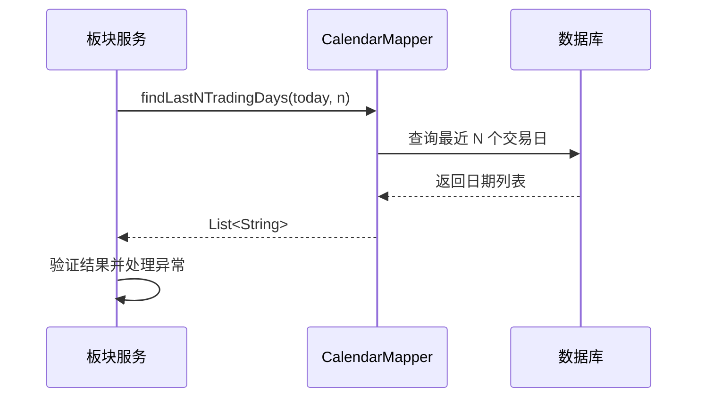

**图表来源**
- [CalendarMapper.java](file://backend/src/main/java/com/freetrader/mapper/CalendarMapper.java#L17-L23)
- [SectorService.java](file://backend/src/main/java/com/freetrader/service/SectorService.java#L64-L76)

**章节来源**
- [CalendarMapper.java](file://backend/src/main/java/com/freetrader/mapper/CalendarMapper.java#L1-L25)

### 实体类与数据库映射

系统采用 MyBatis-Plus 注解实现实体类与数据库表的精确映射：

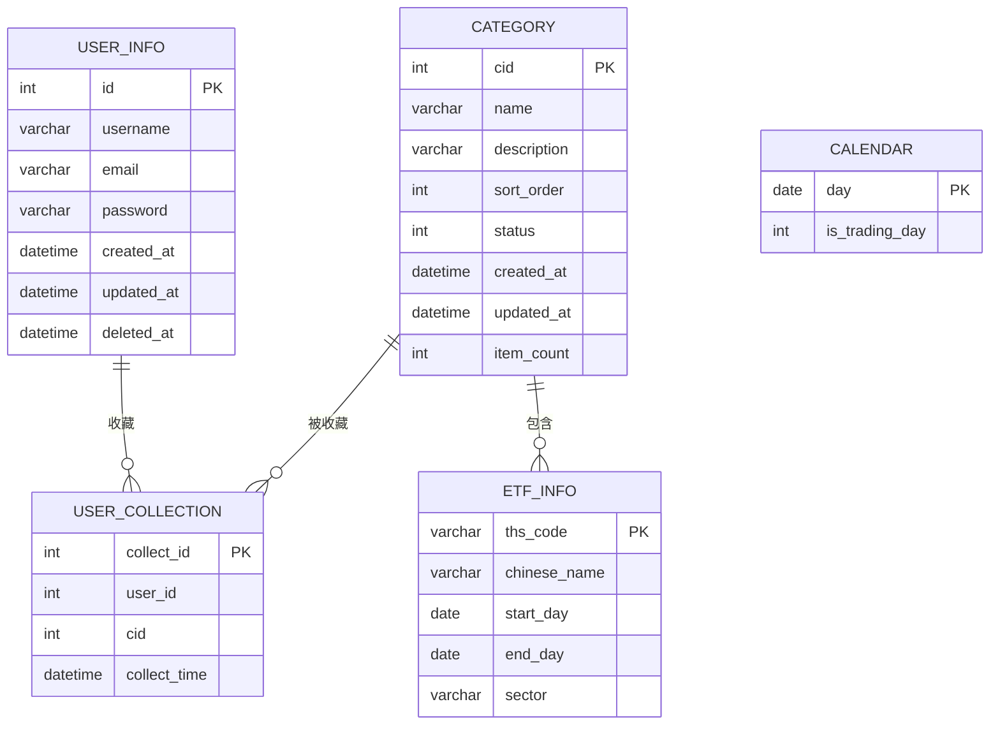

**图表来源**
- [User.java](file://backend/src/main/java/com/freetrader/entity/User.java#L11-L27)
- [Category.java](file://backend/src/main/java/com/freetrader/entity/Category.java#L12-L43)
- [EtfInfo.java](file://backend/src/main/java/com/freetrader/entity/EtfInfo.java#L10-L23)
- [UserCollection.java](file://backend/src/main/java/com/freetrader/entity/UserCollection.java#L11-L22)

## 依赖关系分析

数据访问层的依赖关系体现了清晰的分层架构：

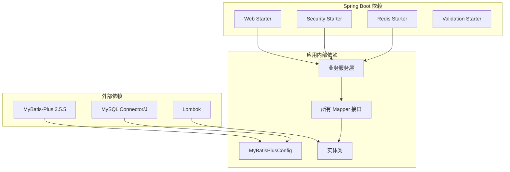

**图表来源**
- [pom.xml](file://backend/pom.xml#L66-L97)
- [MyBatisPlusConfig.java](file://backend/src/main/java/com/freetrader/config/MyBatisPlusConfig.java#L1-L19)

**章节来源**
- [pom.xml](file://backend/pom.xml#L1-L143)

## 性能考虑

### 分页查询优化

系统通过 MyBatis-Plus 分页插件实现高效的数据分页：

- 支持 MySQL 数据库类型
- 自动处理分页参数
- 减少大数据量查询的内存占用

### 缓存策略

应用实现了多层次的缓存机制：

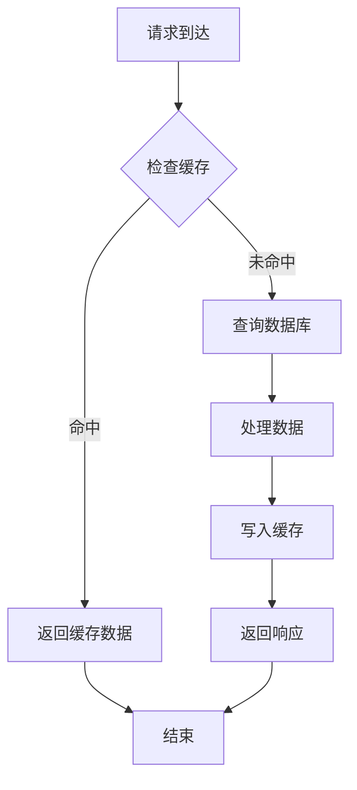

**图表来源**
- [SectorService.java](file://backend/src/main/java/com/freetrader/service/SectorService.java#L81-L104)

### 查询优化技巧

1. **索引优化**：为常用查询字段建立适当索引
2. **批量操作**：使用批量插入和更新减少数据库交互
3. **延迟加载**：对非必要字段采用延迟加载策略
4. **连接池配置**：合理配置连接池参数避免资源浪费

### 事务管理

收藏操作采用声明式事务管理：

- 原子性保证：收藏添加和缓存清除在同一个事务中
- 异常回滚：发生错误时自动回滚所有操作
- 性能优化：减少不必要的事务开销

**章节来源**
- [application.yml](file://backend/src/main/resources/application.yml#L13-L18)
- [FavoriteService.java](file://backend/src/main/java/com/freetrader/service/FavoriteService.java#L46-L85)

## 故障排除指南

### 常见问题及解决方案

1. **数据库连接失败**
   - 检查数据源配置参数
   - 验证网络连接和防火墙设置
   - 确认数据库服务状态

2. **SQL 执行异常**
   - 查看 SQL 日志输出
   - 验证表结构和字段类型
   - 检查参数绑定是否正确

3. **分页查询结果为空**
   - 确认分页参数设置
   - 验证数据是否存在
   - 检查排序字段配置

### 调试工具

- 启用 MyBatis SQL 日志输出
- 使用数据库监控工具
- 实施应用性能监控

**章节来源**
- [application.yml](file://backend/src/main/resources/application.yml#L51-L52)

## 结论

FreeTrader 的数据访问层设计充分体现了现代 Java 应用的最佳实践。通过 MyBatis-Plus 框架，系统实现了：

1. **简洁的代码结构**：基于接口的 CRUD 操作，减少样板代码
2. **强大的查询能力**：支持复杂 SQL 查询和动态条件构造
3. **完善的缓存机制**：多层缓存策略提升系统性能
4. **可靠的事务管理**：确保数据一致性和完整性
5. **良好的扩展性**：模块化设计便于功能扩展

该设计为金融数据应用提供了稳定可靠的数据访问基础，能够有效支撑复杂的查询需求和高并发场景。