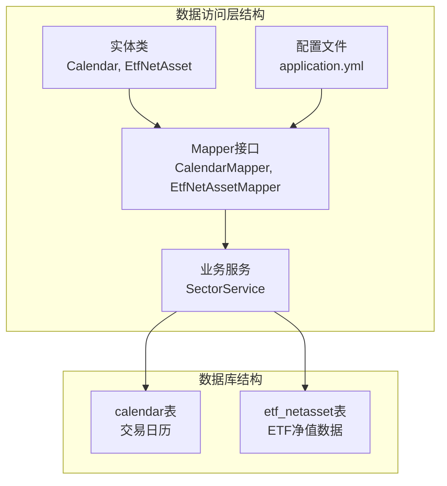
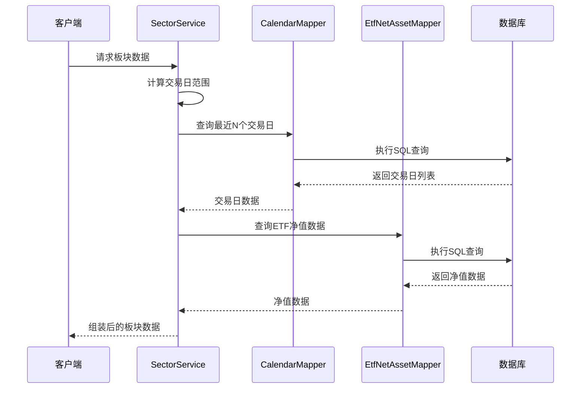
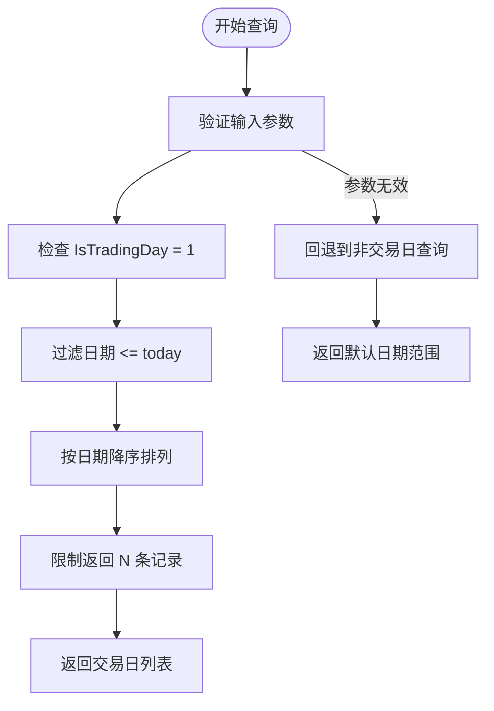
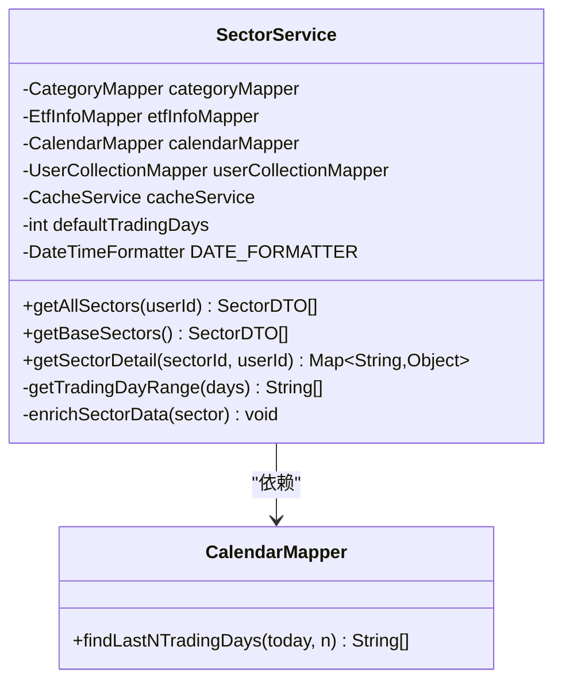
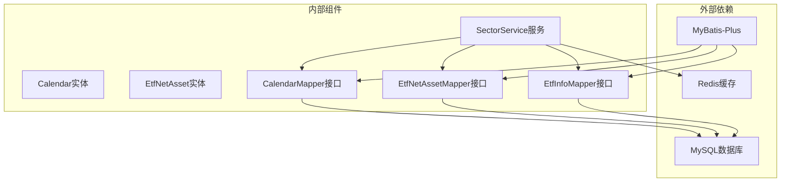

# 日历与净值数据访问层

<cite>
**本文档引用的文件**
- [Calendar.java](file://backend/src/main/java/com/freetrader/entity/Calendar.java)
- [EtfNetAsset.java](file://backend/src/main/java/com/freetrader/entity/EtfNetAsset.java)
- [CalendarMapper.java](file://backend/src/main/java/com/freetrader/mapper/CalendarMapper.java)
- [EtfNetAssetMapper.java](file://backend/src/main/java/com/freetrader/mapper/EtfNetAssetMapper.java)
- [EtfInfoMapper.java](file://backend/src/main/java/com/freetrader/mapper/EtfInfoMapper.java)
- [SectorService.java](file://backend/src/main/java/com/freetrader/service/SectorService.java)
- [calendar.sql](file://sql/calendar.sql)
- [etf_netasset.sql](file://sql/etf_netasset.sql)
- [application.yml](file://backend/src/main/resources/application.yml)
</cite>

## 目录
1. [简介](#简介)
2. [项目结构](#项目结构)
3. [核心组件](#核心组件)
4. [架构概览](#架构概览)
5. [详细组件分析](#详细组件分析)
6. [依赖关系分析](#依赖关系分析)
7. [性能考虑](#性能考虑)
8. [故障排除指南](#故障排除指南)
9. [结论](#结论)

## 简介

本文档深入分析了 FreeTrader 项目中日历与净值数据访问层的设计与实现。该层负责处理交易日历管理和 ETF 净值数据访问，为上层服务提供可靠的数据支撑。系统采用 MyBatis-Plus 框架，通过 Mapper 接口实现数据持久化操作，特别针对金融数据的时间序列特性进行了优化设计。

## 项目结构

数据访问层位于 `backend/src/main/java/com/freetrader/mapper` 包中，包含以下关键组件：

**图表来源**
- [Calendar.java](file://backend/src/main/java/com/freetrader/entity/Calendar.java#L1-L22)
- [EtfNetAsset.java](file://backend/src/main/java/com/freetrader/entity/EtfNetAsset.java#L1-L26)
- [CalendarMapper.java](file://backend/src/main/java/com/freetrader/mapper/CalendarMapper.java#L1-L25)
- [EtfNetAssetMapper.java](file://backend/src/main/java/com/freetrader/mapper/EtfNetAssetMapper.java#L1-L10)

**章节来源**
- [Calendar.java](file://backend/src/main/java/com/freetrader/entity/Calendar.java#L1-L22)
- [EtfNetAsset.java](file://backend/src/main/java/com/freetrader/entity/EtfNetAsset.java#L1-L26)
- [CalendarMapper.java](file://backend/src/main/java/com/freetrader/mapper/CalendarMapper.java#L1-L25)
- [EtfNetAssetMapper.java](file://backend/src/main/java/com/freetrader/mapper/EtfNetAssetMapper.java#L1-L10)

## 核心组件

### 实体模型设计

系统采用简洁高效的实体模型设计，重点关注金融数据的时间序列特性：

**Calendar 实体**：
- `day`: 日期字段，格式为字符串类型
- `isTradingDay`: 交易日标识
- `isWorkingDay`: 工作日标识  
- `comments`: 备注信息
- `fetchHoliday`: 节假日获取标识
- `updateTime`: 更新时间戳

**EtfNetAsset 实体**：
- `thsCode`: ETF 代码
- `time`: 日期时间字段，使用 LocalDate 类型
- `netAssetValue`: 单位净值
- `adjustedNav`: 复权单位净值
- `accumulatedNav`: 累计单位净值
- `premium`: 贴水
- `premiumRatio`: 贴水率

**章节来源**
- [Calendar.java](file://backend/src/main/java/com/freetrader/entity/Calendar.java#L8-L21)
- [EtfNetAsset.java](file://backend/src/main/java/com/freetrader/entity/EtfNetAsset.java#L10-L25)

### Mapper 接口设计

**CalendarMapper**：
- 继承 MyBatis-Plus 基础 Mapper 接口
- 提供交易日查询方法 `findLastNTradingDays`
- 支持按日期范围查询交易日

**EtfNetAssetMapper**：
- 继承 MyBatis-Plus 基础 Mapper 接口
- 提供通用的 ETF 净值数据访问能力
- 支持基于主键的精确查询

**章节来源**
- [CalendarMapper.java](file://backend/src/main/java/com/freetrader/mapper/CalendarMapper.java#L11-L24)
- [EtfNetAssetMapper.java](file://backend/src/main/java/com/freetrader/mapper/EtfNetAssetMapper.java#L7-L9)

## 架构概览

数据访问层采用分层架构设计，确保职责分离和可维护性：

**图表来源**
- [SectorService.java](file://backend/src/main/java/com/freetrader/service/SectorService.java#L64-L76)
- [CalendarMapper.java](file://backend/src/main/java/com/freetrader/mapper/CalendarMapper.java#L17-L23)
- [EtfInfoMapper.java](file://backend/src/main/java/com/freetrader/mapper/EtfInfoMapper.java#L18-L45)

## 详细组件分析

### CalendarMapper 分析

CalendarMapper 是交易日历数据访问的核心组件，专门处理交易日查询逻辑：

#### 核心查询方法

**findLastNTradingDays 方法**：
- 功能：获取指定日期之前的 N 个交易日
- SQL 特点：使用 `IsTradingDay = 1` 过滤条件
- 性能优化：支持 `ORDER BY Day DESC` 和 `LIMIT` 子句
- 参数处理：接受 `today` 和 `n` 两个参数

#### 查询流程图

**图表来源**
- [CalendarMapper.java](file://backend/src/main/java/com/freetrader/mapper/CalendarMapper.java#L14-L23)

#### 错误处理机制

系统实现了完善的错误处理策略：

- **空结果处理**：当查询不到交易日时，自动回退到非交易日查询
- **参数验证**：确保日期格式正确性和数值有效性
- **异常捕获**：通过上层服务统一处理数据库异常

**章节来源**
- [CalendarMapper.java](file://backend/src/main/java/com/freetrader/mapper/CalendarMapper.java#L11-L24)
- [SectorService.java](file://backend/src/main/java/com/freetrader/service/SectorService.java#L64-L76)

### EtfNetAssetMapper 分析

EtfNetAssetMapper 提供 ETF 净值数据的通用访问接口，支持多种查询场景：

#### 数据模型特点

**复合主键设计**：
- 主键由 `(ths_code, time)` 组成
- 确保每个 ETF 在特定日期的唯一性
- 支持高效的时间序列查询

**索引优化**：
- 主键索引：`(ths_code, time)`
- 辅助索引：`(ths_code, time)` 用于快速检索

#### 查询模式

系统支持多种查询模式以满足不同的业务需求：

1. **按 ETF 代码查询**：获取特定 ETF 的完整历史净值
2. **按日期范围查询**：获取特定时间段内的净值数据
3. **按组合查询**：结合多个条件进行复杂筛选

**章节来源**
- [EtfNetAsset.java](file://backend/src/main/java/com/freetrader/entity/EtfNetAsset.java#L10-L25)
- [etf_netasset.sql](file://sql/etf_netasset.sql#L24-L34)

### SectorService 集成分析

SectorService 作为业务服务层，展示了数据访问层的实际应用场景：

#### 交易日范围计算

**图表来源**
- [SectorService.java](file://backend/src/main/java/com/freetrader/service/SectorService.java#L30-L36)
- [CalendarMapper.java](file://backend/src/main/java/com/freetrader/mapper/CalendarMapper.java#L12-L23)

#### 性能优化策略

服务层采用了多项性能优化措施：

- **缓存机制**：使用 Redis 缓存用户收藏数据
- **批量查询**：减少数据库连接开销
- **智能回退**：当交易日查询失败时自动使用日期回退策略

**章节来源**
- [SectorService.java](file://backend/src/main/java/com/freetrader/service/SectorService.java#L64-L76)
- [application.yml](file://backend/src/main/resources/application.yml#L40-L44)

## 依赖关系分析

数据访问层的依赖关系体现了清晰的分层架构：

**图表来源**
- [CalendarMapper.java](file://backend/src/main/java/com/freetrader/mapper/CalendarMapper.java#L3-L5)
- [EtfNetAssetMapper.java](file://backend/src/main/java/com/freetrader/mapper/EtfNetAssetMapper.java#L3-L5)
- [EtfInfoMapper.java](file://backend/src/main/java/com/freetrader/mapper/EtfInfoMapper.java#L3-L8)
- [application.yml](file://backend/src/main/resources/application.yml#L24-L44)

**章节来源**
- [CalendarMapper.java](file://backend/src/main/java/com/freetrader/mapper/CalendarMapper.java#L1-L25)
- [EtfNetAssetMapper.java](file://backend/src/main/java/com/freetrader/mapper/EtfNetAssetMapper.java#L1-L10)
- [EtfInfoMapper.java](file://backend/src/main/java/com/freetrader/mapper/EtfInfoMapper.java#L1-L53)

## 性能考虑

### 数据库性能优化

**索引设计**：
- ETF 净值表使用复合主键 `(ths_code, time)`，确保时间序列查询效率
- 创建辅助索引 `idx_etf_time` 支持快速检索
- 交易日历表使用 `Day` 字段建立索引

**查询优化**：
- 使用 `LIMIT` 子句限制返回记录数量
- 通过 `ORDER BY DESC` 实现倒序查询优化
- 采用参数化查询防止 SQL 注入

### 缓存策略

系统实现了多层次的缓存机制：

**Redis 缓存配置**：
- 默认 TTL 设置为 5 分钟
- 支持缓存空值避免重复查询
- 使用 `@Cacheable` 注解简化缓存管理

**应用级缓存**：
- 用户收藏数据缓存
- 板块基础数据缓存
- 自动失效机制确保数据新鲜度

### 性能监控

**配置选项**：
- 可通过环境变量调整缓存 TTL
- 支持动态调整交易日数量
- 提供详细的日志记录便于性能分析

**章节来源**
- [etf_netasset.sql](file://sql/etf_netasset.sql#L32-L33)
- [application.yml](file://backend/src/main/resources/application.yml#L40-L44)
- [SectorService.java](file://backend/src/main/java/com/freetrader/service/SectorService.java#L52-L59)

## 故障排除指南

### 常见问题及解决方案

**交易日查询失败**：
- 检查 `IsTradingDay` 字段是否正确设置
- 验证日期格式是否符合 `yyyyMMdd` 规范
- 确认数据库连接状态正常

**净值数据缺失**：
- 检查 ETF 代码是否存在于 `etf_info` 表中
- 验证时间字段是否在有效范围内
- 确认数据导入任务是否正常执行

**缓存失效问题**：
- 检查 Redis 服务器连接状态
- 验证缓存键生成规则
- 确认 TTL 配置是否合理

### 调试工具

**日志配置**：
- 开发环境启用详细日志输出
- 生产环境使用结构化日志格式
- 支持按模块级别控制日志详细程度

**监控指标**：
- 数据库查询响应时间
- 缓存命中率统计
- 异常错误计数

**章节来源**
- [application.yml](file://backend/src/main/resources/application.yml#L77-L91)
- [SectorService.java](file://backend/src/main/java/com/freetrader/service/SectorService.java#L68-L76)

## 结论

FreeTrader 项目的数据访问层展现了优秀的架构设计和实现质量。通过精心设计的实体模型、高效的查询接口和完善的性能优化策略，系统能够可靠地处理金融数据的时间序列特性。

**主要优势**：
- 清晰的分层架构，职责明确
- 针对金融数据特性的优化设计
- 完善的缓存和性能优化机制
- 良好的错误处理和故障恢复能力

**未来改进建议**：
- 考虑添加数据一致性检查机制
- 优化大数据量场景下的查询性能
- 增强监控和告警功能
- 完善测试覆盖度

该数据访问层为整个系统的稳定运行提供了坚实的基础，能够满足金融数据处理的高可靠性要求。