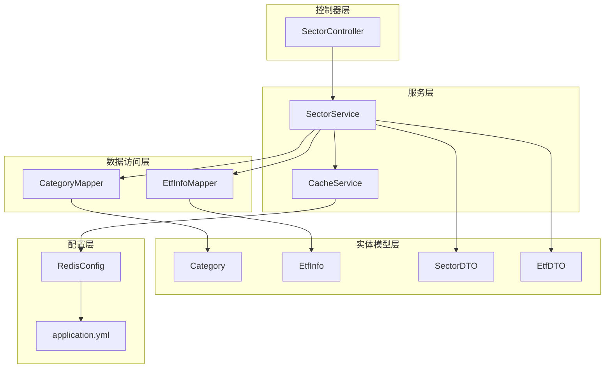
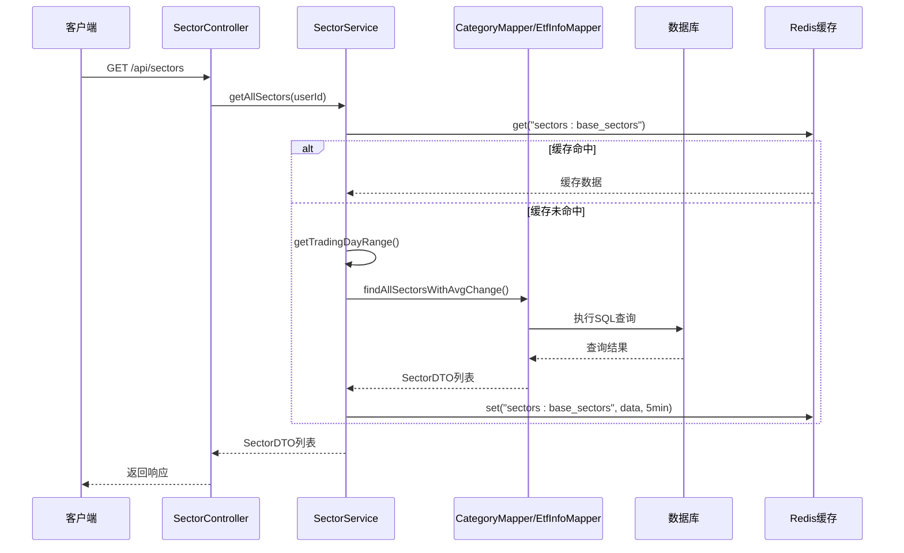
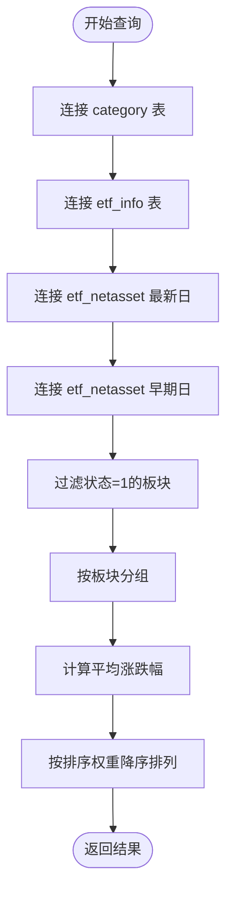
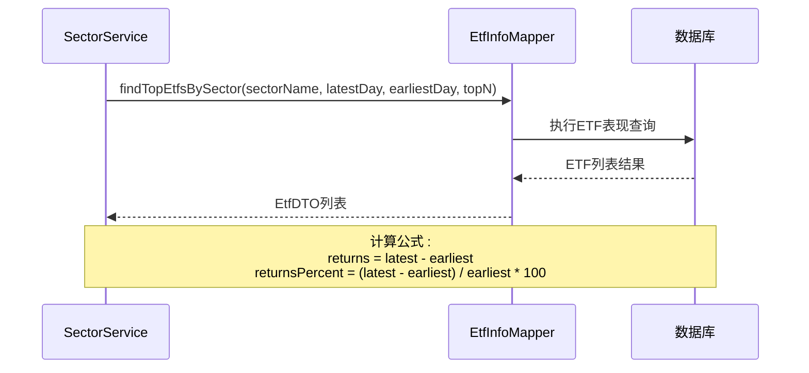
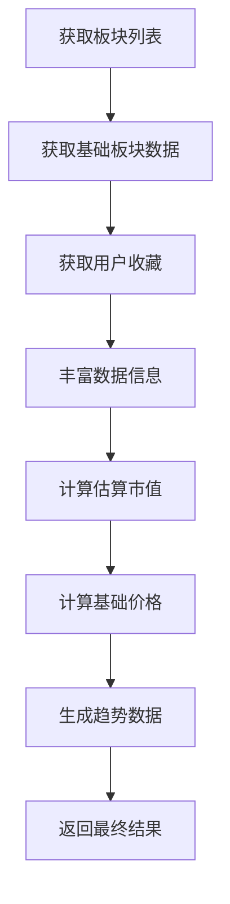
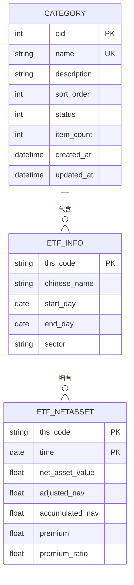
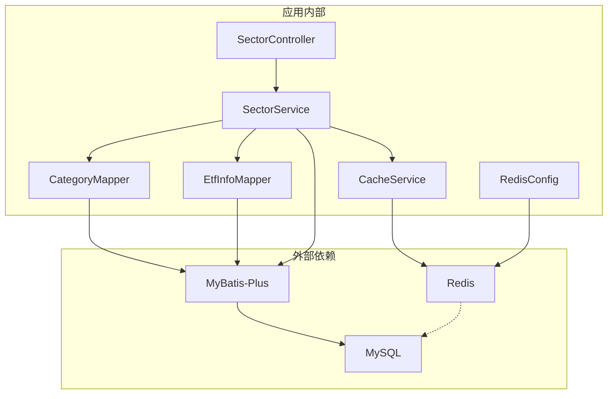
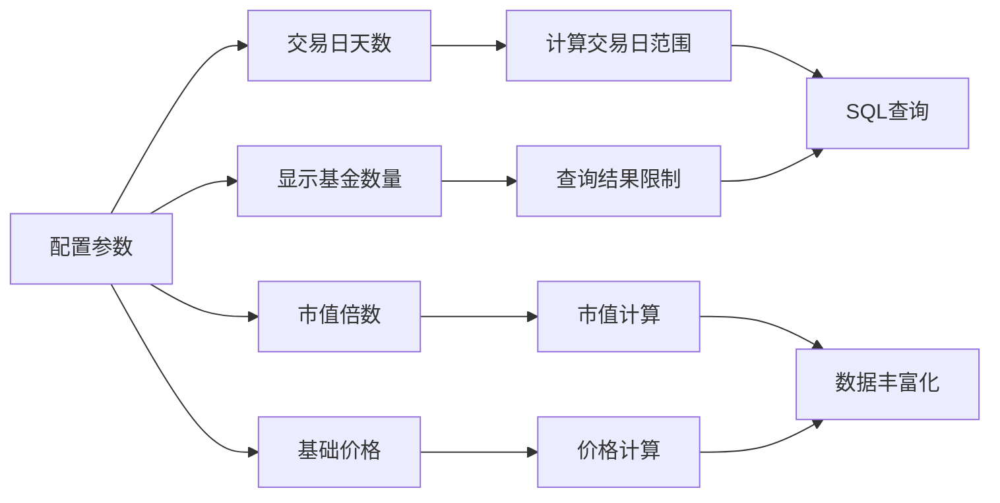

# 板块数据访问层

<cite>
**本文档引用的文件**
- [CategoryMapper.java](file://backend/src/main/java/com/freetrader/mapper/CategoryMapper.java)
- [EtfInfoMapper.java](file://backend/src/main/java/com/freetrader/mapper/EtfInfoMapper.java)
- [Category.java](file://backend/src/main/java/com/freetrader/entity/Category.java)
- [EtfInfo.java](file://backend/src/main/java/com/freetrader/entity/EtfInfo.java)
- [SectorDTO.java](file://backend/src/main/java/com/freetrader/dto/SectorDTO.java)
- [EtfDTO.java](file://backend/src/main/java/com/freetrader/dto/EtfDTO.java)
- [SectorService.java](file://backend/src/main/java/com/freetrader/service/SectorService.java)
- [SectorController.java](file://backend/src/main/java/com/freetrader/controller/SectorController.java)
- [CacheService.java](file://backend/src/main/java/com/freetrader/service/CacheService.java)
- [RedisConfig.java](file://backend/src/main/java/com/freetrader/config/RedisConfig.java)
- [application.yml](file://backend/src/main/resources/application.yml)
- [category.sql](file://sql/category.sql)
- [etf_info.sql](file://sql/etf_info.sql)
- [etf_netasset.sql](file://sql/etf_netasset.sql)
- [calendar.sql](file://sql/calendar.sql)
</cite>

## 目录
1. [简介](#简介)
2. [项目结构](#项目结构)
3. [核心组件](#核心组件)
4. [架构概览](#架构概览)
5. [详细组件分析](#详细组件分析)
6. [依赖关系分析](#依赖关系分析)
7. [性能考虑](#性能考虑)
8. [故障排除指南](#故障排除指南)
9. [结论](#结论)

## 简介

板块数据访问层是 FreeTrader 项目中负责 ETF 板块数据查询和管理的核心模块。该层实现了板块分类和 ETF 信息的实体映射关系，提供了完整的板块数据查询逻辑，包括板块列表查询、板块详情获取、ETF 基金信息查询等功能。

本层采用 MyBatis-Plus 框架，通过 Mapper 接口实现数据库访问，结合 Redis 缓存机制提供高性能的数据访问能力。系统支持复杂的 SQL 查询，包括多表连接、条件计算和聚合统计，能够高效处理板块数据的实时计算需求。

## 项目结构

板块数据访问层位于后端项目的 `backend/src/main/java/com/freetrader` 目录下，主要包含以下层次结构：

**图表来源**
- [SectorController.java](file://backend/src/main/java/com/freetrader/controller/SectorController.java#L22-L63)
- [SectorService.java](file://backend/src/main/java/com/freetrader/service/SectorService.java#L27-L253)
- [CategoryMapper.java](file://backend/src/main/java/com/freetrader/mapper/CategoryMapper.java#L12-L48)
- [EtfInfoMapper.java](file://backend/src/main/java/com/freetrader/mapper/EtfInfoMapper.java#L12-L53)

**章节来源**
- [SectorController.java](file://backend/src/main/java/com/freetrader/controller/SectorController.java#L1-L63)
- [SectorService.java](file://backend/src/main/java/com/freetrader/service/SectorService.java#L1-L253)

## 核心组件

板块数据访问层由多个核心组件构成，每个组件都有明确的职责分工：

### 实体模型组件
- **Category 实体**: 表示板块分类信息，包含板块 ID、名称、描述、排序权重等属性
- **EtfInfo 实体**: 表示 ETF 基金信息，包含代码、名称、起止日期、所属板块等属性
- **SectorDTO**: 板块数据传输对象，用于 API 响应的数据封装
- **EtfDTO**: ETF 基金数据传输对象，用于板块详情中的基金信息展示

### 数据访问组件
- **CategoryMapper**: 负责板块分类数据的查询操作，包括板块列表查询和平均涨跌幅计算
- **EtfInfoMapper**: 负责 ETF 基金信息的查询操作，包括按表现排序的 ETF 列表查询

### 业务服务组件
- **SectorService**: 核心业务服务，协调数据访问层和缓存层，提供完整的板块数据服务
- **CacheService**: Redis 缓存服务，提供用户收藏、板块数据等缓存操作

**章节来源**
- [Category.java](file://backend/src/main/java/com/freetrader/entity/Category.java#L11-L45)
- [EtfInfo.java](file://backend/src/main/java/com/freetrader/entity/EtfInfo.java#L9-L24)
- [SectorDTO.java](file://backend/src/main/java/com/freetrader/dto/SectorDTO.java#L9-L23)
- [EtfDTO.java](file://backend/src/main/java/com/freetrader/dto/EtfDTO.java#L9-L23)

## 架构概览

板块数据访问层采用分层架构设计，实现了清晰的关注点分离：

**图表来源**
- [SectorController.java](file://backend/src/main/java/com/freetrader/controller/SectorController.java#L41-L48)
- [SectorService.java](file://backend/src/main/java/com/freetrader/service/SectorService.java#L109-L141)
- [CategoryMapper.java](file://backend/src/main/java/com/freetrader/mapper/CategoryMapper.java#L15-L47)

该架构实现了以下关键特性：

1. **缓存优先策略**: 首先检查 Redis 缓存，减少数据库查询压力
2. **智能降级**: 当交易日历查询失败时，使用自然日作为回退方案
3. **数据丰富化**: 在服务层对基础数据进行二次加工，提供更丰富的展示信息
4. **用户个性化**: 支持用户收藏状态的个性化展示

## 详细组件分析

### CategoryMapper 组件分析

CategoryMapper 是板块分类数据访问的核心接口，继承自 MyBatis-Plus 的 BaseMapper，提供了专门的板块查询功能。

#### 核心查询方法

**findAllSectorsWithAvgChange 方法**:
该方法实现了复杂的多表关联查询，计算每个板块的平均涨跌幅表现。

**图表来源**
- [CategoryMapper.java](file://backend/src/main/java/com/freetrader/mapper/CategoryMapper.java#L19-L46)

#### SQL 查询逻辑详解

查询语句通过三个关键连接实现：

1. **板块基本信息连接**: `LEFT JOIN etf_info e ON e.sector = c.name`
2. **最新净值连接**: `LEFT JOIN etf_netasset latest ON latest.ths_code = e.ths_code AND latest.time = #{latestDay}`
3. **早期净值连接**: `LEFT JOIN etf_netasset earliest ON earliest.ths_code = e.ths_code AND earliest.time = #{earliestDay}`

涨跌幅计算公式: `(latest.adjusted_nav - earliest.adjusted_nav) / earliest.adjusted_nav * 100`

**章节来源**
- [CategoryMapper.java](file://backend/src/main/java/com/freetrader/mapper/CategoryMapper.java#L15-L47)

### EtfInfoMapper 组件分析

EtfInfoMapper 负责 ETF 基金信息的查询操作，特别针对板块详情中的 ETF 排名查询进行了优化。

#### 核心查询方法

**findTopEtfsBySector 方法**:
该方法查询指定板块下表现最好的 ETF 基金列表。

**图表来源**
- [EtfInfoMapper.java](file://backend/src/main/java/com/freetrader/mapper/EtfInfoMapper.java#L18-L51)

#### 性能优化特性

1. **索引优化**: 使用 `ORDER BY returnsPercent DESC LIMIT #{topN}` 进行排序限制
2. **条件过滤**: 通过 `WHERE e.sector = #{sectorName}` 精确过滤目标板块
3. **连接优化**: 使用 LEFT JOIN 确保即使没有净值数据也能返回 ETF 基本信息

**章节来源**
- [EtfInfoMapper.java](file://backend/src/main/java/com/freetrader/mapper/EtfInfoMapper.java#L15-L52)

### SectorService 业务逻辑分析

SectorService 是板块数据访问层的核心业务服务，实现了完整的数据处理流程。

#### 关键业务流程

**板块列表查询流程**:

**图表来源**
- [SectorService.java](file://backend/src/main/java/com/freetrader/service/SectorService.java#L109-L141)

#### 缓存策略实现

SectorService 实现了两级缓存策略：

1. **基础板块数据缓存**: 使用 `@Cacheable` 注解缓存板块基础信息
2. **用户收藏缓存**: 使用自定义 CacheService 缓存用户收藏状态

缓存配置:
- 基础板块数据缓存: 5 分钟 TTL
- 用户收藏缓存: 5 分钟 TTL  
- 板块详情缓存: 5 分钟 TTL

**章节来源**
- [SectorService.java](file://backend/src/main/java/com/freetrader/service/SectorService.java#L124-L141)
- [CacheService.java](file://backend/src/main/java/com/freetrader/service/CacheService.java#L105-L130)

### 数据模型关系分析

板块数据访问层涉及多个数据模型之间的复杂关系：

**图表来源**
- [category.sql](file://sql/category.sql#L24-L36)
- [etf_info.sql](file://sql/etf_info.sql#L24-L33)
- [etf_netasset.sql](file://sql/etf_netasset.sql#L24-L34)

**章节来源**
- [Category.java](file://backend/src/main/java/com/freetrader/entity/Category.java#L15-L28)
- [EtfInfo.java](file://backend/src/main/java/com/freetrader/entity/EtfInfo.java#L13-L22)

## 依赖关系分析

板块数据访问层的依赖关系体现了清晰的分层架构：

**图表来源**
- [SectorController.java](file://backend/src/main/java/com/freetrader/controller/SectorController.java#L28-L29)
- [SectorService.java](file://backend/src/main/java/com/freetrader/service/SectorService.java#L32-L36)
- [RedisConfig.java](file://backend/src/main/java/com/freetrader/config/RedisConfig.java#L25-L45)

### 关键依赖特性

1. **框架依赖**: 基于 Spring Boot、MyBatis-Plus 和 Redis 的技术栈
2. **配置驱动**: 通过 application.yml 进行灵活的配置管理
3. **缓存集成**: 深度集成 Redis 缓存，提供高性能的数据访问
4. **异常处理**: 统一的业务异常处理机制

**章节来源**
- [application.yml](file://backend/src/main/resources/application.yml#L4-L45)
- [RedisConfig.java](file://backend/src/main/java/com/freetrader/config/RedisConfig.java#L8-L79)

## 性能考虑

板块数据访问层在设计时充分考虑了性能优化需求，采用了多种优化策略：

### 数据库性能优化

1. **索引优化策略**:
   - `category` 表: 主键索引、唯一索引、状态索引
   - `etf_info` 表: 主键索引、板块索引
   - `etf_netasset` 表: 复合主键、时间索引

2. **查询优化技巧**:
   - 使用 LEFT JOIN 确保数据完整性
   - 通过参数化查询防止 SQL 注入
   - 限制查询结果集大小（TOP N）

3. **触发器自动维护**:
   - 自动维护板块中的基金数量统计
   - 实时更新板块状态和时间戳

### 缓存性能优化

1. **多级缓存策略**:
   - Redis 缓存层: 降低数据库访问频率
   - 应用层缓存: 减少重复计算开销

2. **缓存失效策略**:
   - 定时失效: 5 分钟自动刷新
   - 手动清理: 支持批量缓存清理

3. **内存优化**:
   - 对象序列化优化
   - 连接池配置优化

### 系统性能监控

**图表来源**
- [SectorService.java](file://backend/src/main/java/com/freetrader/service/SectorService.java#L38-L48)
- [application.yml](file://backend/src/main/resources/application.yml#L68-L76)

**章节来源**
- [category.sql](file://sql/category.sql#L33-L36)
- [etf_info.sql](file://sql/etf_info.sql#L31-L33)
- [etf_netasset.sql](file://sql/etf_netasset.sql#L32-L34)

## 故障排除指南

### 常见问题及解决方案

#### 1. 缓存相关问题

**问题**: 缓存数据不更新
- **原因**: 缓存 TTL 到期或手动清理
- **解决方案**: 检查缓存配置，必要时调用 `clearSectorCache()` 方法

**问题**: Redis 连接失败
- **原因**: Redis 服务器不可用或配置错误
- **解决方案**: 检查 `application.yml` 中的 Redis 配置，确认网络连通性

#### 2. 数据查询问题

**问题**: 板块数据为空
- **原因**: 交易日历查询失败或数据源问题
- **解决方案**: 检查 `calendar` 表数据，确认交易日计算逻辑

**问题**: ETF 基金排名异常
- **原因**: 净值数据缺失或计算错误
- **解决方案**: 检查 `etf_netasset` 表数据完整性

#### 3. 性能问题

**问题**: 查询响应缓慢
- **原因**: 缺少必要的索引或查询条件不当
- **解决方案**: 添加适当的数据库索引，优化查询条件

**章节来源**
- [CacheService.java](file://backend/src/main/java/com/freetrader/service/CacheService.java#L187-L204)
- [SectorService.java](file://backend/src/main/java/com/freetrader/service/SectorService.java#L64-L76)

### 调试和监控

1. **日志配置**: 通过 `application.yml` 配置日志级别
2. **SQL 监控**: 启用 MyBatis SQL 日志输出
3. **缓存监控**: 使用 Redis 客户端监控缓存状态
4. **性能指标**: 监控数据库连接池使用情况

## 结论

板块数据访问层通过精心设计的架构和优化策略，成功实现了 ETF 板块数据的高效查询和管理。该层的主要优势包括：

1. **清晰的分层架构**: 控制器、服务、数据访问、实体模型各司其职
2. **高性能缓存机制**: 多级缓存策略显著提升系统性能
3. **灵活的配置管理**: 通过配置文件实现参数化控制
4. **完善的异常处理**: 统一的错误处理和降级机制
5. **可扩展的设计**: 支持未来功能扩展和性能优化

该实现为 FreeTrader 项目提供了稳定可靠的板块数据服务基础，能够满足实时市场数据查询和展示的需求。通过持续的监控和优化，该系统能够在高并发场景下保持稳定的性能表现。