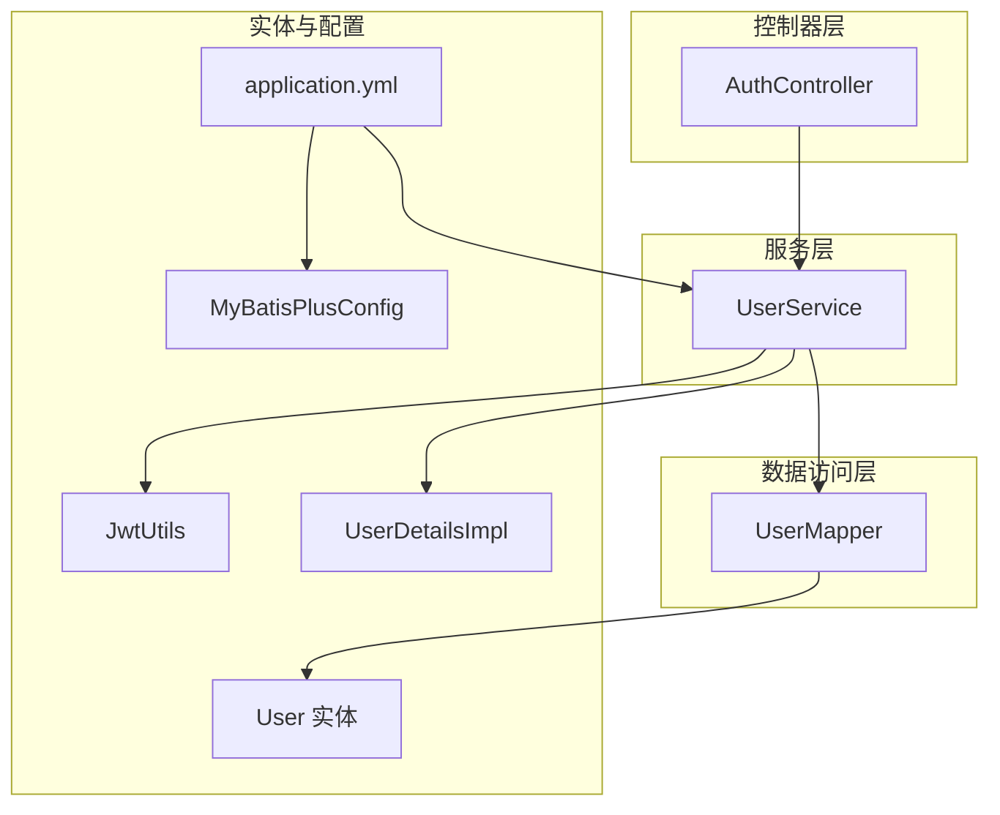
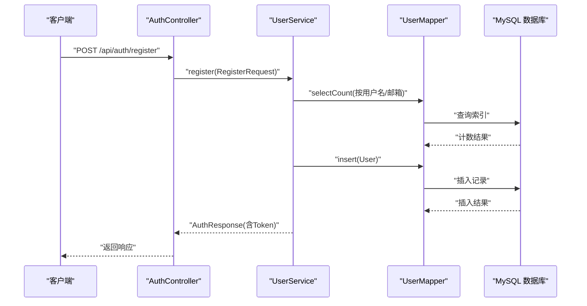
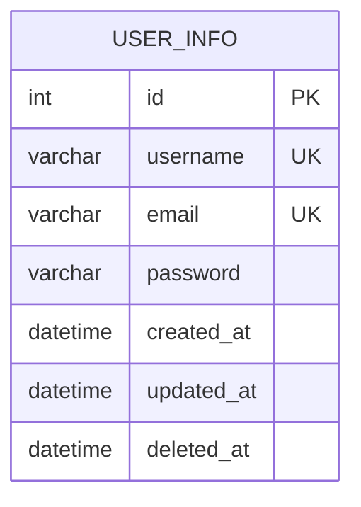
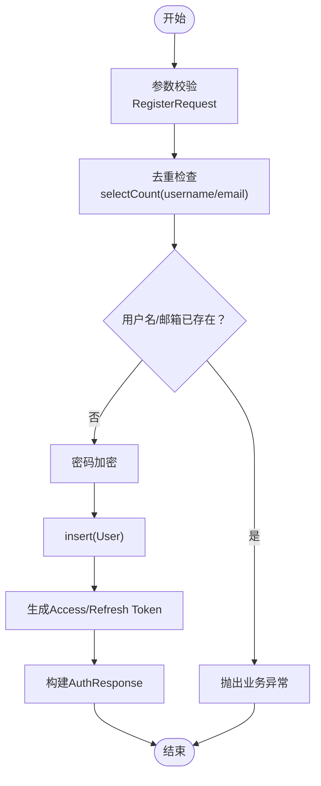
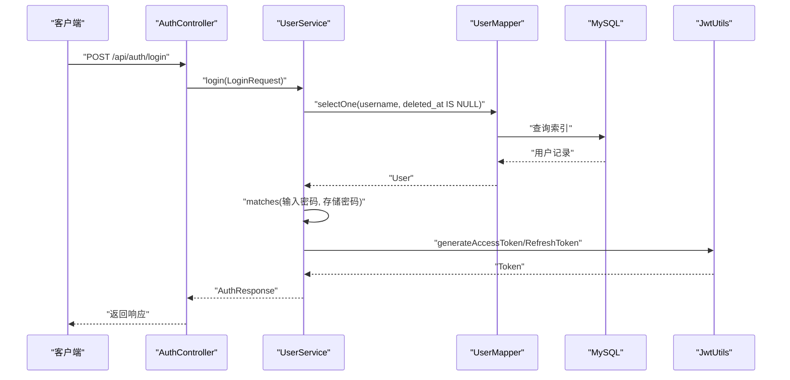
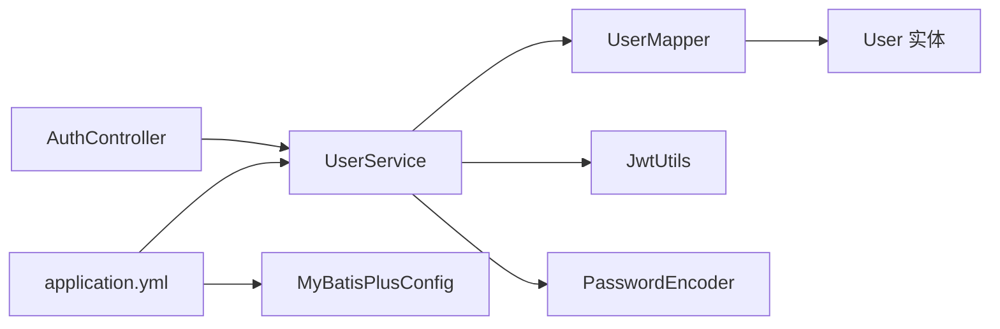

# 用户数据访问层

<cite>
**本文引用的文件**
- [UserMapper.java](file://backend/src/main/java/com/freetrader/mapper/UserMapper.java)
- [User.java](file://backend/src/main/java/com/freetrader/entity/User.java)
- [UserService.java](file://backend/src/main/java/com/freetrader/service/UserService.java)
- [AuthController.java](file://backend/src/main/java/com/freetrader/controller/AuthController.java)
- [RegisterRequest.java](file://backend/src/main/java/com/freetrader/dto/RegisterRequest.java)
- [LoginRequest.java](file://backend/src/main/java/com/freetrader/dto/LoginRequest.java)
- [AuthResponse.java](file://backend/src/main/java/com/freetrader/dto/AuthResponse.java)
- [application.yml](file://backend/src/main/resources/application.yml)
- [MyBatisPlusConfig.java](file://backend/src/main/java/com/freetrader/config/MyBatisPlusConfig.java)
- [JwtUtils.java](file://backend/src/main/java/com/freetrader/security/JwtUtils.java)
- [UserDetailsImpl.java](file://backend/src/main/java/com/freetrader/security/UserDetailsImpl.java)
- [UserServiceTest.java](file://backend/src/test/java/com/freetrader/service/UserServiceTest.java)
- [user_info.sql](file://sql/user_info.sql)
</cite>

## 目录
1. [简介](#简介)
2. [项目结构](#项目结构)
3. [核心组件](#核心组件)
4. [架构总览](#架构总览)
5. [详细组件分析](#详细组件分析)
6. [依赖分析](#依赖分析)
7. [性能考量](#性能考量)
8. [故障排查指南](#故障排查指南)
9. [结论](#结论)
10. [附录](#附录)

## 简介
本文件聚焦于用户数据访问层，围绕 UserMapper 接口及其背后的数据访问逻辑进行深入技术说明。内容涵盖：
- User 实体类与数据库表 user_info 的映射关系
- 用户注册、登录验证、用户信息查询等关键数据访问操作
- 具体 SQL 查询示例与性能优化建议
- 安全考虑与最佳实践

## 项目结构
用户数据访问层位于后端模块中，采用分层架构：
- 控制器层：处理 HTTP 请求，调用服务层
- 服务层：封装业务逻辑，协调数据访问与安全组件
- 数据访问层：基于 MyBatis-Plus 的 Mapper 接口
- 实体模型：与数据库表一一对应
- 配置层：MyBatis-Plus、Redis、JWT 等配置

图表来源
- [AuthController.java](file://backend/src/main/java/com/freetrader/controller/AuthController.java#L1-L72)
- [UserService.java](file://backend/src/main/java/com/freetrader/service/UserService.java#L1-L103)
- [UserMapper.java](file://backend/src/main/java/com/freetrader/mapper/UserMapper.java#L1-L10)
- [User.java](file://backend/src/main/java/com/freetrader/entity/User.java#L1-L29)
- [application.yml](file://backend/src/main/resources/application.yml#L1-L102)
- [MyBatisPlusConfig.java](file://backend/src/main/java/com/freetrader/config/MyBatisPlusConfig.java#L1-L18)
- [JwtUtils.java](file://backend/src/main/java/com/freetrader/security/JwtUtils.java#L1-L194)
- [UserDetailsImpl.java](file://backend/src/main/java/com/freetrader/security/UserDetailsImpl.java#L1-L56)

章节来源
- [AuthController.java](file://backend/src/main/java/com/freetrader/controller/AuthController.java#L1-L72)
- [UserService.java](file://backend/src/main/java/com/freetrader/service/UserService.java#L1-L103)
- [UserMapper.java](file://backend/src/main/java/com/freetrader/mapper/UserMapper.java#L1-L10)
- [User.java](file://backend/src/main/java/com/freetrader/entity/User.java#L1-L29)
- [application.yml](file://backend/src/main/resources/application.yml#L1-L102)
- [MyBatisPlusConfig.java](file://backend/src/main/java/com/freetrader/config/MyBatisPlusConfig.java#L1-L18)
- [JwtUtils.java](file://backend/src/main/java/com/freetrader/security/JwtUtils.java#L1-L194)
- [UserDetailsImpl.java](file://backend/src/main/java/com/freetrader/security/UserDetailsImpl.java#L1-L56)

## 核心组件
- UserMapper：继承 MyBatis-Plus 的 BaseMapper，提供对 User 实体的基础 CRUD 能力
- User 实体：通过注解映射到数据库表 user_info，并包含逻辑删除字段 deletedAt
- UserService：实现 UserDetailsService，负责注册、登录、按用户名查询等业务逻辑
- AuthController：对外暴露注册、登录、刷新 Token、登出等接口
- 配置：application.yml 中启用 MyBatis-Plus、Redis 缓存、JWT 参数；MyBatisPlusConfig 注入分页插件

章节来源
- [UserMapper.java](file://backend/src/main/java/com/freetrader/mapper/UserMapper.java#L1-L10)
- [User.java](file://backend/src/main/java/com/freetrader/entity/User.java#L1-L29)
- [UserService.java](file://backend/src/main/java/com/freetrader/service/UserService.java#L1-L103)
- [AuthController.java](file://backend/src/main/java/com/freetrader/controller/AuthController.java#L1-L72)
- [application.yml](file://backend/src/main/resources/application.yml#L46-L58)
- [MyBatisPlusConfig.java](file://backend/src/main/java/com/freetrader/config/MyBatisPlusConfig.java#L1-L18)

## 架构总览
用户数据访问层遵循“控制器-服务-数据访问-数据库”的分层设计。请求从 AuthController 进入，交由 UserService 处理，再通过 UserMapper 访问数据库。密码加密与 Token 生成分别由 PasswordEncoder 与 JwtUtils 负责。

图表来源
- [AuthController.java](file://backend/src/main/java/com/freetrader/controller/AuthController.java#L46-L51)
- [UserService.java](file://backend/src/main/java/com/freetrader/service/UserService.java#L41-L71)
- [UserMapper.java](file://backend/src/main/java/com/freetrader/mapper/UserMapper.java#L1-L10)
- [user_info.sql](file://sql/user_info.sql#L24-L35)

## 详细组件分析

### UserMapper 接口与 MyBatis-Plus 基础能力
- 继承 BaseMapper<User>，天然具备基础 CRUD 方法（如 selectById、selectList、insert、update、delete 等）
- 通过 application.yml 中的 MyBatis-Plus 配置启用驼峰映射与逻辑删除
- 逻辑删除字段 deletedAt 在全局配置中定义，查询时默认过滤已删除记录

章节来源
- [UserMapper.java](file://backend/src/main/java/com/freetrader/mapper/UserMapper.java#L1-L10)
- [application.yml](file://backend/src/main/resources/application.yml#L46-L58)

### User 实体与数据库表映射
- 表名：user_info
- 主键：id（自增）
- 唯一约束：username、email
- 字段：id、username、email、password、created_at、updated_at、deleted_at
- MyBatis-Plus 注解：@TableName("user_info")、@TableId(type = IdType.AUTO)

图表来源
- [User.java](file://backend/src/main/java/com/freetrader/entity/User.java#L10-L28)
- [user_info.sql](file://sql/user_info.sql#L24-L35)

章节来源
- [User.java](file://backend/src/main/java/com/freetrader/entity/User.java#L1-L29)
- [user_info.sql](file://sql/user_info.sql#L24-L35)

### 用户注册流程
- 输入校验：RegisterRequest 对 username、email、password 进行非空与格式校验
- 去重检查：按 username 与 email 分别查询计数，若大于 0 则抛出业务异常
- 密码加密：使用 PasswordEncoder 对明文密码进行编码
- 写入数据库：构造 User 对象并调用 insert 插入
- Token 生成：注册成功后生成 Access/Refresh Token 并封装到 AuthResponse

图表来源
- [UserService.java](file://backend/src/main/java/com/freetrader/service/UserService.java#L41-L71)
- [RegisterRequest.java](file://backend/src/main/java/com/freetrader/dto/RegisterRequest.java#L1-L23)
- [JwtUtils.java](file://backend/src/main/java/com/freetrader/security/JwtUtils.java#L97-L120)

章节来源
- [UserService.java](file://backend/src/main/java/com/freetrader/service/UserService.java#L41-L71)
- [RegisterRequest.java](file://backend/src/main/java/com/freetrader/dto/RegisterRequest.java#L1-L23)
- [JwtUtils.java](file://backend/src/main/java/com/freetrader/security/JwtUtils.java#L97-L120)

### 登录验证流程
- 查询用户：按 username 查询，且 deleted_at 为空
- 校验密码：使用 PasswordEncoder.matches 对比输入密码与存储值
- Token 生成：登录成功后生成 Access/Refresh Token 并封装到 AuthResponse
- 异常处理：用户名不存在或密码错误时抛出业务异常

图表来源
- [AuthController.java](file://backend/src/main/java/com/freetrader/controller/AuthController.java#L34-L39)
- [UserService.java](file://backend/src/main/java/com/freetrader/service/UserService.java#L73-L96)
- [UserMapper.java](file://backend/src/main/java/com/freetrader/mapper/UserMapper.java#L1-L10)
- [JwtUtils.java](file://backend/src/main/java/com/freetrader/security/JwtUtils.java#L97-L120)

章节来源
- [UserService.java](file://backend/src/main/java/com/freetrader/service/UserService.java#L73-L96)
- [AuthController.java](file://backend/src/main/java/com/freetrader/controller/AuthController.java#L28-L39)

### 用户信息查询
- 按用户名查询：UserService.findByUsername 使用 QueryWrapper.eq("username").isNull("deleted_at")
- 返回 User 实体，便于后续业务使用

章节来源
- [UserService.java](file://backend/src/main/java/com/freetrader/service/UserService.java#L98-L101)

### 安全实现要点
- 密码安全：注册时对明文密码进行编码，登录时使用 matches 校验
- 认证集成：实现 UserDetailsService，返回 UserDetailsImpl，支持 Spring Security
- Token 管理：JwtUtils 负责生成与验证 Access/Refresh Token，支持类型区分与过期判断

章节来源
- [UserService.java](file://backend/src/main/java/com/freetrader/service/UserService.java#L31-L39)
- [UserDetailsImpl.java](file://backend/src/main/java/com/freetrader/security/UserDetailsImpl.java#L1-L56)
- [JwtUtils.java](file://backend/src/main/java/com/freetrader/security/JwtUtils.java#L97-L154)

## 依赖分析
- 控制器依赖服务：AuthController 注入 UserService
- 服务依赖数据访问：UserService 注入 UserMapper、PasswordEncoder、JwtUtils
- 数据访问依赖实体：UserMapper 操作 User 实体
- 配置依赖：application.yml 提供 MyBatis-Plus、Redis、JWT 参数；MyBatisPlusConfig 注入分页插件

图表来源
- [AuthController.java](file://backend/src/main/java/com/freetrader/controller/AuthController.java#L25-L26)
- [UserService.java](file://backend/src/main/java/com/freetrader/service/UserService.java#L27-L29)
- [UserMapper.java](file://backend/src/main/java/com/freetrader/mapper/UserMapper.java#L1-L10)
- [application.yml](file://backend/src/main/resources/application.yml#L46-L58)
- [MyBatisPlusConfig.java](file://backend/src/main/java/com/freetrader/config/MyBatisPlusConfig.java#L12-L17)

章节来源
- [AuthController.java](file://backend/src/main/java/com/freetrader/controller/AuthController.java#L25-L26)
- [UserService.java](file://backend/src/main/java/com/freetrader/service/UserService.java#L27-L29)
- [application.yml](file://backend/src/main/resources/application.yml#L46-L58)
- [MyBatisPlusConfig.java](file://backend/src/main/java/com/freetrader/config/MyBatisPlusConfig.java#L12-L17)

## 性能考量
- 索引与唯一性：username 与 email 均建立唯一索引，可显著降低重复注册与登录查询成本
- 逻辑删除：deletedAt 字段参与查询条件，避免物理删除带来的维护成本，但需确保查询均带上该条件
- 缓存策略：application.yml 启用 Redis 缓存，可结合业务场景缓存热点用户信息或 Token 黑名单
- 连接池：HikariCP 连接池参数合理配置，避免高并发下的连接争用
- 分页插件：MyBatisPlusConfig 注入分页内核，避免全表扫描

章节来源
- [user_info.sql](file://sql/user_info.sql#L33-L34)
- [application.yml](file://backend/src/main/resources/application.yml#L13-L18)
- [MyBatisPlusConfig.java](file://backend/src/main/java/com/freetrader/config/MyBatisPlusConfig.java#L12-L17)

## 故障排查指南
- 登录失败：检查用户名是否存在、密码是否匹配；确认 deleted_at 条件是否生效
- 注册失败：确认 username/email 唯一约束是否被触发；查看密码编码是否正常
- Token 相关：确认 JWT 密钥长度满足最小要求；检查 Token 类型区分与过期时间
- 数据访问：确认 MyBatis-Plus 配置是否正确加载，逻辑删除字段是否按约定使用

章节来源
- [UserServiceTest.java](file://backend/src/test/java/com/freetrader/service/UserServiceTest.java#L58-L122)
- [UserServiceTest.java](file://backend/src/test/java/com/freetrader/service/UserServiceTest.java#L124-L178)
- [UserServiceTest.java](file://backend/src/test/java/com/freetrader/service/UserServiceTest.java#L180-L210)
- [JwtUtils.java](file://backend/src/main/java/com/freetrader/security/JwtUtils.java#L34-L48)

## 结论
用户数据访问层以 MyBatis-Plus 为基础，结合 Spring Security 与 JWT，实现了安全、清晰的用户注册与登录流程。通过合理的数据库索引、逻辑删除与缓存配置，能够在保证数据一致性的同时提升性能。建议在生产环境中进一步强化日志审计、限流策略与密钥安全管理。

## 附录

### SQL 查询示例
- 按用户名查询（包含逻辑删除过滤）
  - 示例路径：[UserService.java](file://backend/src/main/java/com/freetrader/service/UserService.java#L33-L38)
- 去重检查（用户名/邮箱）
  - 示例路径：[UserService.java](file://backend/src/main/java/com/freetrader/service/UserService.java#L45-L51)
- 插入用户
  - 示例路径：[UserService.java](file://backend/src/main/java/com/freetrader/service/UserService.java#L56-L58)

### 关键 DTO 与实体
- RegisterRequest：注册请求参数校验
  - 示例路径：[RegisterRequest.java](file://backend/src/main/java/com/freetrader/dto/RegisterRequest.java#L1-L23)
- LoginRequest：登录请求参数校验
  - 示例路径：[LoginRequest.java](file://backend/src/main/java/com/freetrader/dto/LoginRequest.java#L1-L15)
- AuthResponse：认证响应封装
  - 示例路径：[AuthResponse.java](file://backend/src/main/java/com/freetrader/dto/AuthResponse.java#L1-L19)
- User 实体：数据库表 user_info 映射
  - 示例路径：[User.java](file://backend/src/main/java/com/freetrader/entity/User.java#L10-L28)