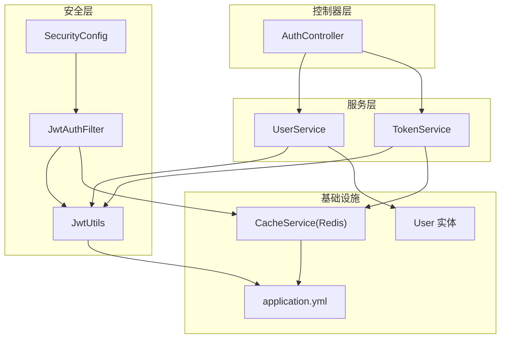
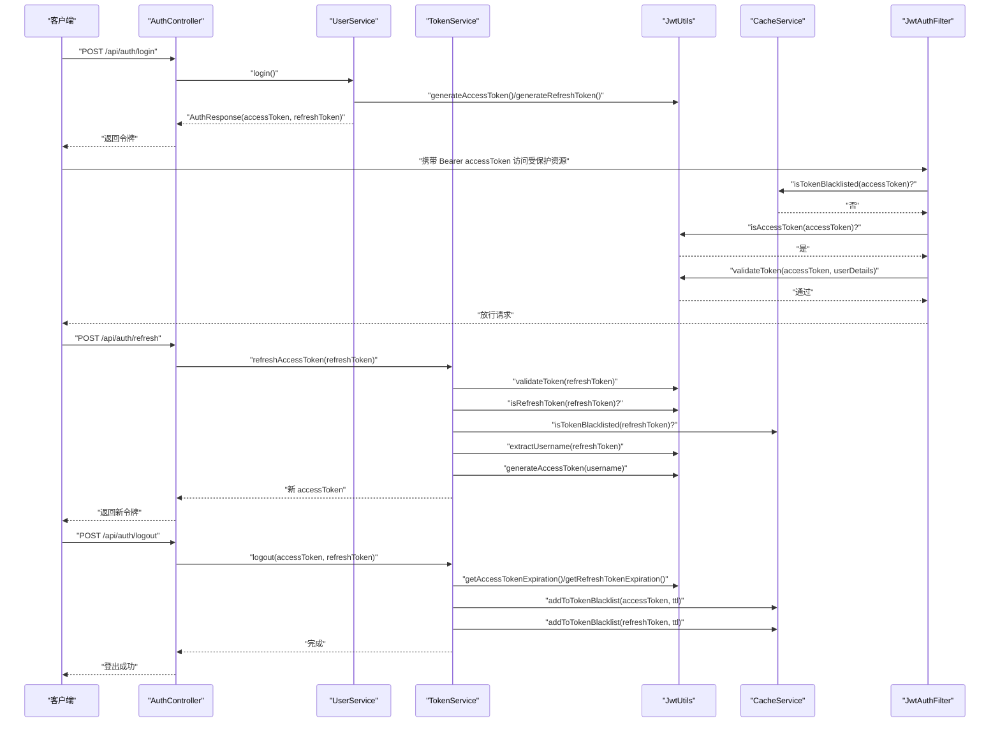
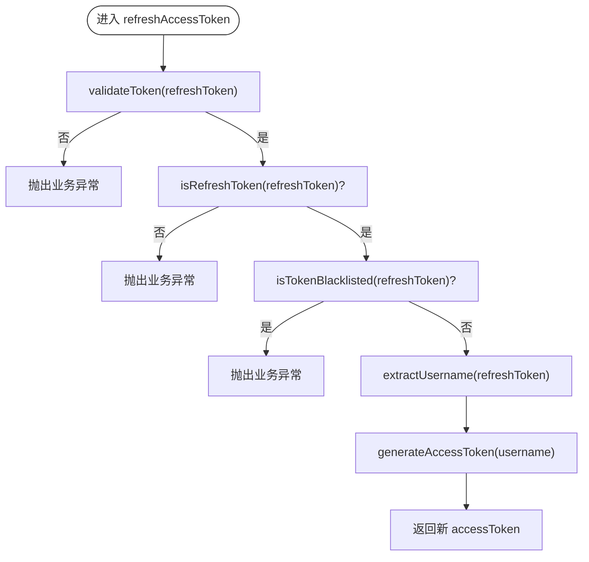
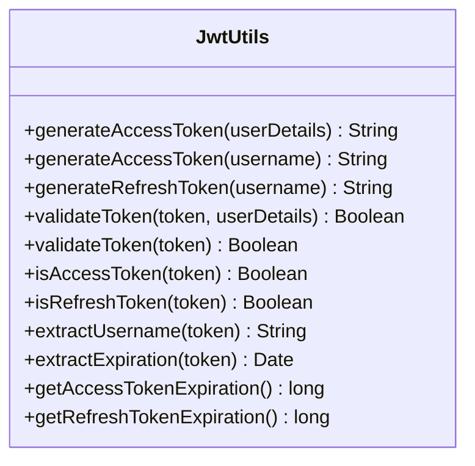
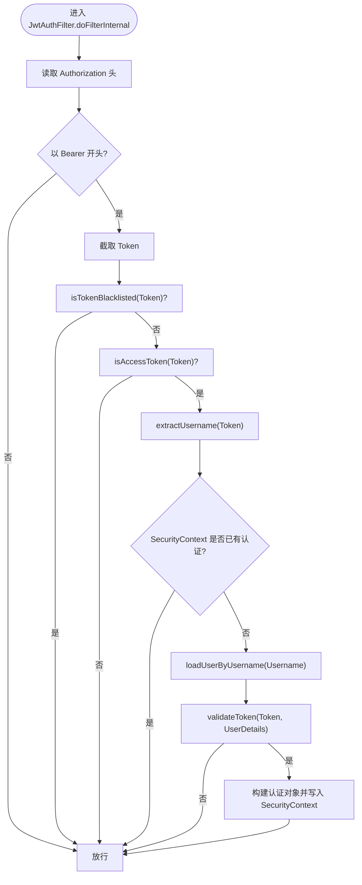
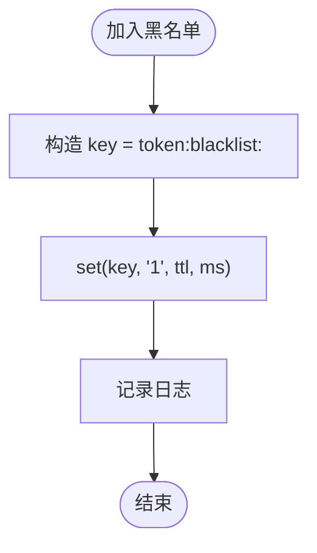
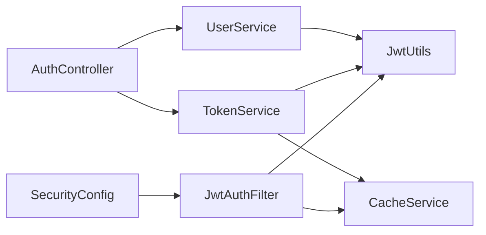

# 令牌服务

<cite>
**本文引用的文件**
- [TokenService.java](file://backend/src/main/java/com/freetrader/service/TokenService.java)
- [JwtUtils.java](file://backend/src/main/java/com/freetrader/security/JwtUtils.java)
- [JwtAuthFilter.java](file://backend/src/main/java/com/freetrader/security/JwtAuthFilter.java)
- [CacheService.java](file://backend/src/main/java/com/freetrader/service/CacheService.java)
- [SecurityConstants.java](file://backend/src/main/java/com/freetrader/util/SecurityConstants.java)
- [AuthController.java](file://backend/src/main/java/com/freetrader/controller/AuthController.java)
- [UserService.java](file://backend/src/main/java/com/freetrader/service/UserService.java)
- [application.yml](file://backend/src/main/resources/application.yml)
- [SecurityConfig.java](file://backend/src/main/java/com/freetrader/config/SecurityConfig.java)
- [User.java](file://backend/src/main/java/com/freetrader/entity/User.java)
- [TokenServiceTest.java](file://backend/src/test/java/com/freetrader/service/TokenServiceTest.java)
- [JwtUtilsTest.java](file://backend/src/test/java/com/freetrader/security/JwtUtilsTest.java)
</cite>

## 目录
1. [简介](#简介)
2. [项目结构](#项目结构)
3. [核心组件](#核心组件)
4. [架构总览](#架构总览)
5. [详细组件分析](#详细组件分析)
6. [依赖关系分析](#依赖关系分析)
7. [性能考虑](#性能考虑)
8. [故障排查指南](#故障排查指南)
9. [结论](#结论)
10. [附录](#附录)

## 简介
本文件为 FreeTrader 令牌服务的技术文档，聚焦于 TokenService 的完整生命周期管理能力，涵盖访问令牌与刷新令牌的生成、验证、撤销、刷新流程、黑名单管理与会话状态维护等。文档同时阐述 JWT 结构设计、签名算法、负载信息与过期时间等安全机制，并给出与用户认证系统的集成方式、安全最佳实践、调试与性能优化指南。

## 项目结构
后端采用分层架构，令牌服务位于 service 层，配合 security 层的 JwtUtils、JwtAuthFilter 与 CacheService 实现完整的认证与授权链路；配置集中在 application.yml 与 SecurityConfig 中；控制器 AuthController 对外暴露登录、注册、刷新与登出接口。

图表来源
- [AuthController.java](file://backend/src/main/java/com/freetrader/controller/AuthController.java#L1-L72)
- [UserService.java](file://backend/src/main/java/com/freetrader/service/UserService.java#L1-L103)
- [TokenService.java](file://backend/src/main/java/com/freetrader/service/TokenService.java#L1-L64)
- [JwtUtils.java](file://backend/src/main/java/com/freetrader/security/JwtUtils.java#L1-L194)
- [JwtAuthFilter.java](file://backend/src/main/java/com/freetrader/security/JwtAuthFilter.java#L1-L84)
- [SecurityConfig.java](file://backend/src/main/java/com/freetrader/config/SecurityConfig.java#L1-L61)
- [CacheService.java](file://backend/src/main/java/com/freetrader/service/CacheService.java#L1-L206)
- [application.yml](file://backend/src/main/resources/application.yml#L1-L102)
- [User.java](file://backend/src/main/java/com/freetrader/entity/User.java#L1-L29)

章节来源
- [AuthController.java](file://backend/src/main/java/com/freetrader/controller/AuthController.java#L1-L72)
- [UserService.java](file://backend/src/main/java/com/freetrader/service/UserService.java#L1-L103)
- [TokenService.java](file://backend/src/main/java/com/freetrader/service/TokenService.java#L1-L64)
- [JwtUtils.java](file://backend/src/main/java/com/freetrader/security/JwtUtils.java#L1-L194)
- [JwtAuthFilter.java](file://backend/src/main/java/com/freetrader/security/JwtAuthFilter.java#L1-L84)
- [SecurityConfig.java](file://backend/src/main/java/com/freetrader/config/SecurityConfig.java#L1-L61)
- [CacheService.java](file://backend/src/main/java/com/freetrader/service/CacheService.java#L1-L206)
- [application.yml](file://backend/src/main/resources/application.yml#L1-L102)
- [User.java](file://backend/src/main/java/com/freetrader/entity/User.java#L1-L29)

## 核心组件
- TokenService：提供刷新访问令牌、登出时将令牌加入黑名单、校验令牌有效性等能力，依赖 JwtUtils 与 CacheService。
- JwtUtils：负责 JWT 的生成、解析、验证、类型识别与过期时间获取，密钥由 application.yml 注入。
- JwtAuthFilter：拦截请求，解析 Authorization 头中的 Bearer Token，校验是否为 AccessToken 且未被拉黑，加载用户详情并注入认证上下文。
- CacheService：基于 Redis 的统一缓存服务，提供令牌黑名单、用户收藏、板块缓存等能力，令牌黑名单键带有过期时间。
- SecurityConstants：集中定义安全相关常量，如 Token 前缀、Authorization 头名、Token 类型声明字段名等。
- AuthController：对外提供登录、注册、刷新、登出接口，调用 UserService 与 TokenService。
- UserService：实现用户登录与注册，生成 Access/Refresh Token 并封装响应。
- SecurityConfig：配置无状态会话、放行公开接口、添加 JwtAuthFilter。
- application.yml：JWT 密钥、Access/Refresh 过期时间、Redis 连接与缓存配置。

章节来源
- [TokenService.java](file://backend/src/main/java/com/freetrader/service/TokenService.java#L1-L64)
- [JwtUtils.java](file://backend/src/main/java/com/freetrader/security/JwtUtils.java#L1-L194)
- [JwtAuthFilter.java](file://backend/src/main/java/com/freetrader/security/JwtAuthFilter.java#L1-L84)
- [CacheService.java](file://backend/src/main/java/com/freetrader/service/CacheService.java#L1-L206)
- [SecurityConstants.java](file://backend/src/main/java/com/freetrader/util/SecurityConstants.java#L1-L42)
- [AuthController.java](file://backend/src/main/java/com/freetrader/controller/AuthController.java#L1-L72)
- [UserService.java](file://backend/src/main/java/com/freetrader/service/UserService.java#L1-L103)
- [SecurityConfig.java](file://backend/src/main/java/com/freetrader/config/SecurityConfig.java#L1-L61)
- [application.yml](file://backend/src/main/resources/application.yml#L1-L102)

## 架构总览
下图展示从客户端到服务端的关键交互路径：登录/注册生成双 Token，后续请求携带 AccessToken 经 JwtAuthFilter 校验，刷新接口使用 Refresh Token 生成新 AccessToken，登出将两个 Token 加入黑名单并按各自过期时间同步失效。

图表来源
- [AuthController.java](file://backend/src/main/java/com/freetrader/controller/AuthController.java#L1-L72)
- [UserService.java](file://backend/src/main/java/com/freetrader/service/UserService.java#L1-L103)
- [TokenService.java](file://backend/src/main/java/com/freetrader/service/TokenService.java#L1-L64)
- [JwtUtils.java](file://backend/src/main/java/com/freetrader/security/JwtUtils.java#L1-L194)
- [JwtAuthFilter.java](file://backend/src/main/java/com/freetrader/security/JwtAuthFilter.java#L1-L84)
- [CacheService.java](file://backend/src/main/java/com/freetrader/service/CacheService.java#L1-L206)

## 详细组件分析

### TokenService 分析
- 刷新访问令牌
  - 校验 Refresh Token 有效性与类型
  - 检查是否已在黑名单
  - 解析用户名并生成新的 Access Token
- 登出
  - 若 Access/Refresh Token 有效，则按各自过期时间加入黑名单
- 令牌有效性校验
  - 先验证 Token 本身，再检查是否在黑名单

图表来源
- [TokenService.java](file://backend/src/main/java/com/freetrader/service/TokenService.java#L18-L39)

章节来源
- [TokenService.java](file://backend/src/main/java/com/freetrader/service/TokenService.java#L1-L64)
- [TokenServiceTest.java](file://backend/src/test/java/com/freetrader/service/TokenServiceTest.java#L1-L222)

### JwtUtils 分析
- 密钥与签名
  - 从配置读取密钥，确保最小长度，使用 HMAC-SHA 签发
- 载荷与过期
  - 载荷包含类型声明(type)与主体(sub)，签发时间与过期时间由配置控制
- 验证与类型判断
  - 支持带 UserDetails 的验证与纯 Token 验证
  - 通过载荷中的 type 字段区分 Access/Refresh Token
- 过期时间查询
  - 提供 Access/Refresh 过期时间毫秒数

图表来源
- [JwtUtils.java](file://backend/src/main/java/com/freetrader/security/JwtUtils.java#L1-L194)
- [application.yml](file://backend/src/main/resources/application.yml#L60-L66)

章节来源
- [JwtUtils.java](file://backend/src/main/java/com/freetrader/security/JwtUtils.java#L1-L194)
- [application.yml](file://backend/src/main/resources/application.yml#L60-L66)
- [JwtUtilsTest.java](file://backend/src/test/java/com/freetrader/security/JwtUtilsTest.java#L1-L302)

### JwtAuthFilter 分析
- 请求拦截
  - 从 Authorization 头解析 Bearer Token
  - 若 Token 在黑名单则直接放行（不阻断），避免重复处理
  - 仅处理 AccessToken，拒绝非 AccessToken
  - 从 UserDetailsServiceImpl 加载用户详情并进行 Token 校验
  - 成功后将认证信息写入 SecurityContext

图表来源
- [JwtAuthFilter.java](file://backend/src/main/java/com/freetrader/security/JwtAuthFilter.java#L1-L84)
- [SecurityConfig.java](file://backend/src/main/java/com/freetrader/config/SecurityConfig.java#L1-L61)

章节来源
- [JwtAuthFilter.java](file://backend/src/main/java/com/freetrader/security/JwtAuthFilter.java#L1-L84)
- [SecurityConfig.java](file://backend/src/main/java/com/freetrader/config/SecurityConfig.java#L1-L61)

### CacheService（令牌黑名单）分析
- 黑名单键前缀与过期
  - 键格式：token:blacklist:<token>
  - 过期时间与 Token 类型对应（Access/Refresh）
- 查询与加入
  - isTokenBlacklisted 通过 hasKey 判断
  - addToTokenBlacklist 写入并设置过期时间

图表来源
- [CacheService.java](file://backend/src/main/java/com/freetrader/service/CacheService.java#L84-L101)

章节来源
- [CacheService.java](file://backend/src/main/java/com/freetrader/service/CacheService.java#L1-L206)

### 安全常量与配置
- 安全常量
  - Bearer 前缀、Authorization 头名、Token 类型声明字段名、Access/Refresh 类型标识
- JWT 配置
  - secret、access-token-expiration、refresh-token-expiration
  - Redis 连接与缓存 TTL

章节来源
- [SecurityConstants.java](file://backend/src/main/java/com/freetrader/util/SecurityConstants.java#L1-L42)
- [application.yml](file://backend/src/main/resources/application.yml#L60-L66)
- [application.yml](file://backend/src/main/resources/application.yml#L24-L45)

### 控制器与用户服务集成
- AuthController
  - /api/auth/login：调用 UserService.login 生成双 Token
  - /api/auth/register：调用 UserService.register 生成双 Token
  - /api/auth/refresh：调用 TokenService.refreshAccessToken
  - /api/auth/logout：调用 TokenService.logout
- UserService
  - 登录/注册成功后分别生成 Access/Refresh Token 并封装 AuthResponse

章节来源
- [AuthController.java](file://backend/src/main/java/com/freetrader/controller/AuthController.java#L1-L72)
- [UserService.java](file://backend/src/main/java/com/freetrader/service/UserService.java#L1-L103)

## 依赖关系分析
- 组件耦合
  - TokenService 依赖 JwtUtils 与 CacheService
  - JwtAuthFilter 依赖 JwtUtils、UserDetailsService、CacheService
  - AuthController 依赖 UserService 与 TokenService
  - UserService 依赖 JwtUtils、UserMapper、PasswordEncoder
- 关键依赖链
  - 登录/注册 → JwtUtils 生成 Token → AuthController 返回
  - 请求拦截 → JwtAuthFilter → JwtUtils 校验 → SecurityContext 认证
  - 刷新/登出 → TokenService → JwtUtils/CacheService

图表来源
- [AuthController.java](file://backend/src/main/java/com/freetrader/controller/AuthController.java#L1-L72)
- [UserService.java](file://backend/src/main/java/com/freetrader/service/UserService.java#L1-L103)
- [TokenService.java](file://backend/src/main/java/com/freetrader/service/TokenService.java#L1-L64)
- [JwtUtils.java](file://backend/src/main/java/com/freetrader/security/JwtUtils.java#L1-L194)
- [JwtAuthFilter.java](file://backend/src/main/java/com/freetrader/security/JwtAuthFilter.java#L1-L84)
- [SecurityConfig.java](file://backend/src/main/java/com/freetrader/config/SecurityConfig.java#L1-L61)
- [CacheService.java](file://backend/src/main/java/com/freetrader/service/CacheService.java#L1-L206)

章节来源
- [AuthController.java](file://backend/src/main/java/com/freetrader/controller/AuthController.java#L1-L72)
- [UserService.java](file://backend/src/main/java/com/freetrader/service/UserService.java#L1-L103)
- [TokenService.java](file://backend/src/main/java/com/freetrader/service/TokenService.java#L1-L64)
- [JwtUtils.java](file://backend/src/main/java/com/freetrader/security/JwtUtils.java#L1-L194)
- [JwtAuthFilter.java](file://backend/src/main/java/com/freetrader/security/JwtAuthFilter.java#L1-L84)
- [SecurityConfig.java](file://backend/src/main/java/com/freetrader/config/SecurityConfig.java#L1-L61)
- [CacheService.java](file://backend/src/main/java/com/freetrader/service/CacheService.java#L1-L206)

## 性能考虑
- 无状态会话
  - SecurityConfig 配置 STATELESS，减少会话开销
- Redis 黑名单
  - 使用带过期时间的键，避免无限增长；键前缀明确便于清理
- 扫描策略
  - CacheService 使用 SCAN 代替 KEYS，避免阻塞 Redis
- Token 过期时间
  - Access/Refresh 过期时间在 application.yml 中集中配置，便于调优

章节来源
- [SecurityConfig.java](file://backend/src/main/java/com/freetrader/config/SecurityConfig.java#L40-L43)
- [CacheService.java](file://backend/src/main/java/com/freetrader/service/CacheService.java#L141-L183)
- [application.yml](file://backend/src/main/resources/application.yml#L60-L66)

## 故障排查指南
- 常见问题定位
  - 刷新失败：检查 Refresh Token 是否有效、是否为 Refresh 类型、是否已在黑名单
  - 登录后无法访问受保护资源：确认 Authorization 头格式、是否为 AccessToken、是否被加入黑名单
  - 登出无效：确认传入的 Token 是否有效，以及黑名单写入是否成功
- 日志与断点
  - TokenService 与 JwtAuthFilter 中均包含日志输出，可据此定位阶段
  - 单元测试覆盖了多种边界场景，可参考其断言逻辑快速定位问题
- 配置核对
  - 确认 JWT 密钥与过期时间配置正确
  - 确认 Redis 连接参数与缓存 TTL 合理

章节来源
- [TokenService.java](file://backend/src/main/java/com/freetrader/service/TokenService.java#L18-L62)
- [JwtAuthFilter.java](file://backend/src/main/java/com/freetrader/security/JwtAuthFilter.java#L38-L82)
- [TokenServiceTest.java](file://backend/src/test/java/com/freetrader/service/TokenServiceTest.java#L1-L222)
- [JwtUtilsTest.java](file://backend/src/test/java/com/freetrader/security/JwtUtilsTest.java#L1-L302)
- [application.yml](file://backend/src/main/resources/application.yml#L60-L66)

## 结论
TokenService 通过 JwtUtils 与 CacheService 实现了完整的令牌生命周期管理：生成、验证、类型识别、黑名单与过期控制。结合 JwtAuthFilter 的拦截与注入，形成无状态、可扩展的认证链路。配合合理的配置与测试用例，系统在安全性与可维护性方面具备良好基础。

## 附录

### JWT 结构与安全机制
- 结构
  - 头部与载荷由 JwtUtils 生成，签名使用 HMAC-SHA
  - 载荷包含 type（access/refresh）、sub（用户名）、iat（签发时间）、exp（过期时间）
- 签名算法
  - 使用对称密钥（secret）进行 HMAC-SHA 签发与验证
- 过期时间
  - Access/Refresh 过期时间在 application.yml 中配置，分别用于生成与黑名单过期设置

章节来源
- [JwtUtils.java](file://backend/src/main/java/com/freetrader/security/JwtUtils.java#L107-L133)
- [application.yml](file://backend/src/main/resources/application.yml#L60-L66)

### 令牌刷新流程
- 输入：Refresh Token
- 步骤：校验 → 类型判断 → 黑名单检查 → 解析用户名 → 生成新 Access Token → 返回

章节来源
- [TokenService.java](file://backend/src/main/java/com/freetrader/service/TokenService.java#L18-L39)
- [JwtUtils.java](file://backend/src/main/java/com/freetrader/security/JwtUtils.java#L107-L120)

### 令牌黑名单管理
- 加入：根据 Token 类型获取过期时间，写入 Redis 键 token:blacklist:<token>
- 查询：hasKey 判断是否在黑名单
- 清理：通过 SCAN 逐步清理，避免 KEYS 阻塞

章节来源
- [CacheService.java](file://backend/src/main/java/com/freetrader/service/CacheService.java#L84-L101)
- [CacheService.java](file://backend/src/main/java/com/freetrader/service/CacheService.java#L141-L183)

### 与用户认证系统的集成
- 登录/注册
  - UserService 生成 Access/Refresh Token 并返回 AuthResponse
- 请求拦截
  - JwtAuthFilter 仅处理 AccessToken，校验通过后注入认证上下文
- 授权
  - 受保护接口需认证，认证由 SecurityConfig 配置

章节来源
- [UserService.java](file://backend/src/main/java/com/freetrader/service/UserService.java#L73-L96)
- [JwtAuthFilter.java](file://backend/src/main/java/com/freetrader/security/JwtAuthFilter.java#L31-L82)
- [SecurityConfig.java](file://backend/src/main/java/com/freetrader/config/SecurityConfig.java#L35-L43)

### 安全最佳实践
- 传输加密
  - 强制 HTTPS，防止 Token 明文传输
- 密钥管理
  - 生产环境务必通过环境变量设置足够强度的 JWT 密钥
- 防重放与撤销
  - 登出时将 Token 加入黑名单并设置过期时间
- 令牌最小权限
  - Access Token 仅用于访问受保护资源，Refresh Token 仅用于换取新 Access Token
- 监控与告警
  - 关注 Token 刷新与登出的日志，及时发现异常行为

章节来源
- [application.yml](file://backend/src/main/resources/application.yml#L60-L66)
- [TokenService.java](file://backend/src/main/java/com/freetrader/service/TokenService.java#L41-L55)
- [CacheService.java](file://backend/src/main/java/com/freetrader/service/CacheService.java#L84-L101)