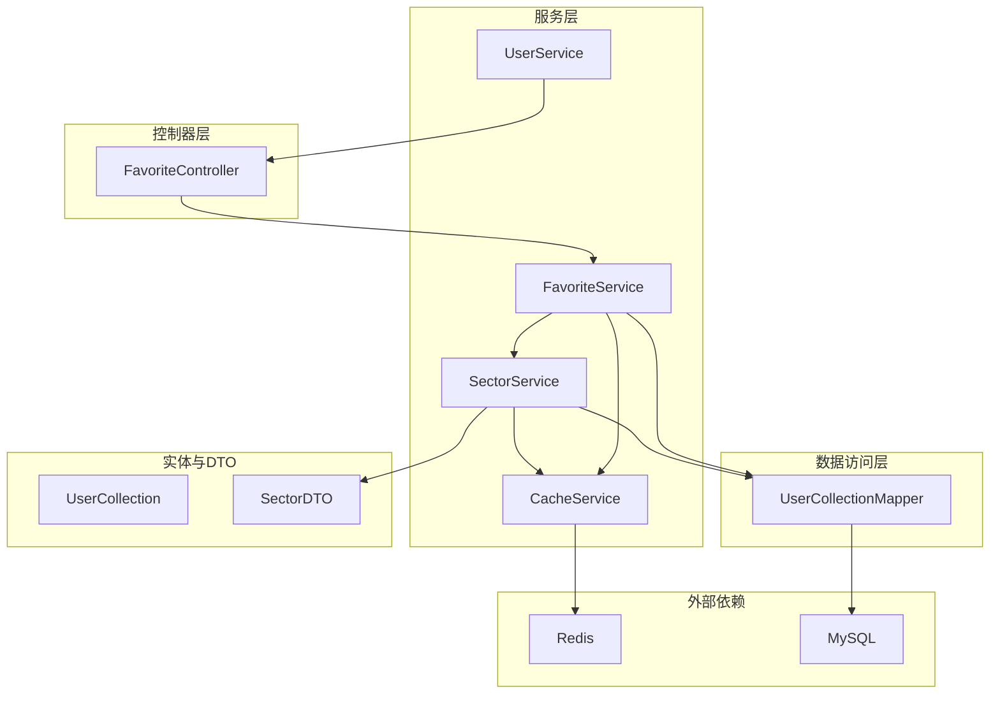
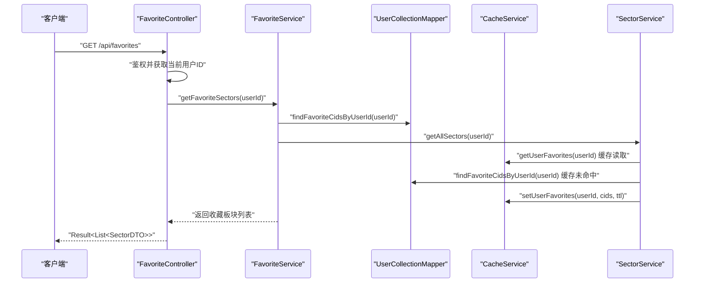
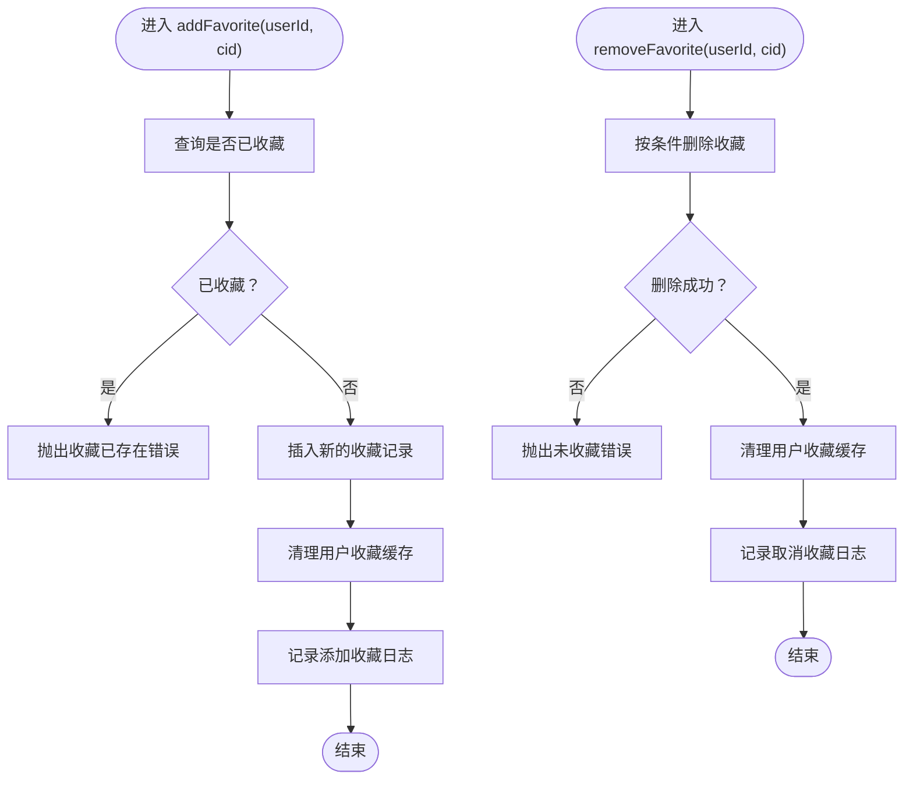
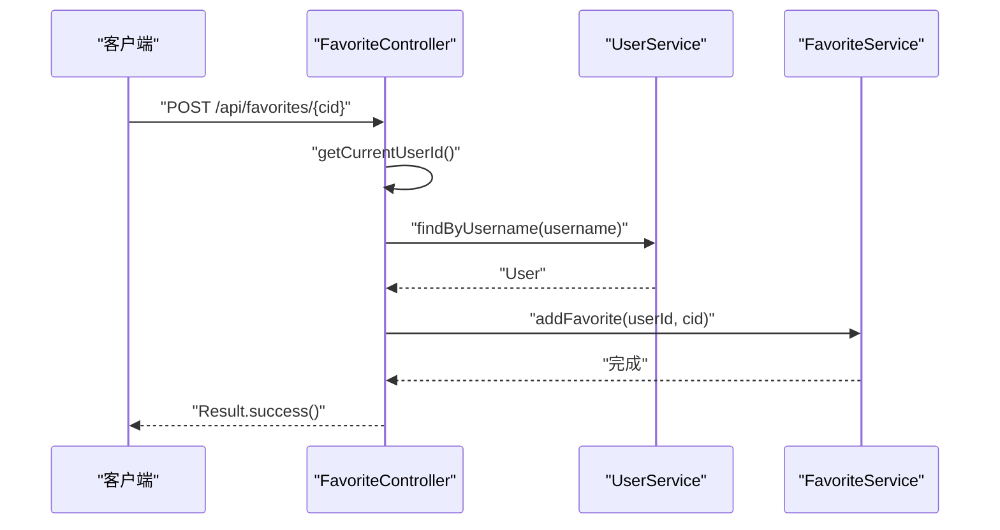
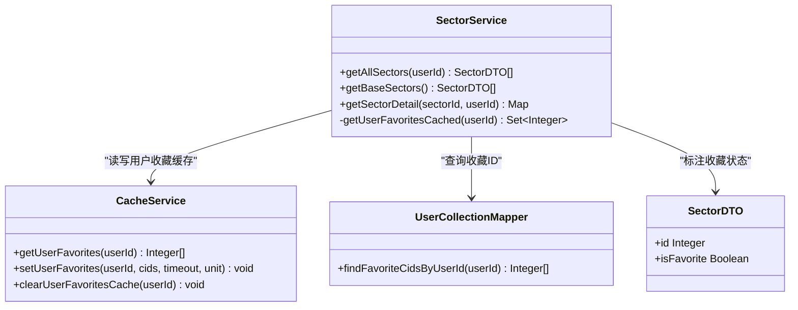
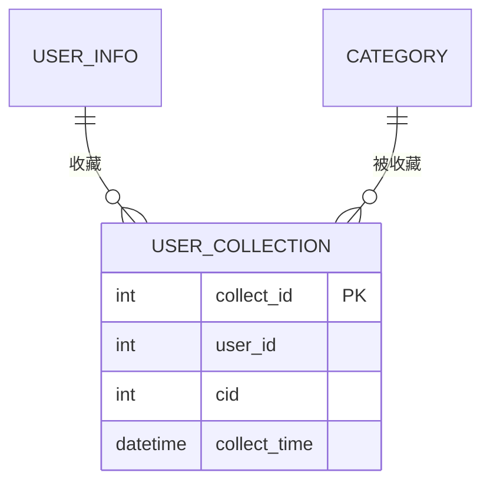
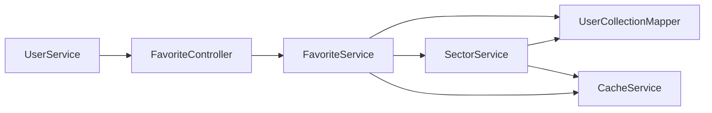

# 收藏服务

<cite>
**本文引用的文件**
- [FavoriteService.java](file://backend/src/main/java/com/freetrader/service/FavoriteService.java)
- [FavoriteController.java](file://backend/src/main/java/com/freetrader/controller/FavoriteController.java)
- [UserCollectionMapper.java](file://backend/src/main/java/com/freetrader/mapper/UserCollectionMapper.java)
- [UserCollection.java](file://backend/src/main/java/com/freetrader/entity/UserCollection.java)
- [UserService.java](file://backend/src/main/java/com/freetrader/service/UserService.java)
- [SectorService.java](file://backend/src/main/java/com/freetrader/service/SectorService.java)
- [CacheService.java](file://backend/src/main/java/com/freetrader/service/CacheService.java)
- [SectorDTO.java](file://backend/src/main/java/com/freetrader/dto/SectorDTO.java)
- [ErrorCode.java](file://backend/src/main/java/com/freetrader/exception/ErrorCode.java)
- [application.yml](file://backend/src/main/resources/application.yml)
- [RedisConfig.java](file://backend/src/main/java/com/freetrader/config/RedisConfig.java)
- [user_collection.sql](file://sql/user_collection.sql)
</cite>

## 目录
1. [简介](#简介)
2. [项目结构](#项目结构)
3. [核心组件](#核心组件)
4. [架构总览](#架构总览)
5. [详细组件分析](#详细组件分析)
6. [依赖关系分析](#依赖关系分析)
7. [性能考虑](#性能考虑)
8. [故障排查指南](#故障排查指南)
9. [结论](#结论)

## 简介
本文件面向 FreeTrader 收藏服务的技术文档，聚焦 FavoriteService 的核心业务逻辑与实现细节，涵盖：
- 用户收藏管理：添加、取消、切换收藏状态
- 收藏列表维护：基于缓存的收藏集合与板块数据联动
- 数据一致性与去重：数据库唯一约束与服务层校验
- 权限验证与集成：用户身份获取、板块数据关联、收藏状态同步
- 缓存策略、事务管理与异常处理
- 性能优化与最佳实践

## 项目结构
收藏服务位于后端模块，采用分层架构：
- 控制器层：FavoriteController 负责鉴权与请求转发
- 服务层：FavoriteService 实现收藏业务；SectorService 提供板块数据与缓存；CacheService 统一 Redis 操作
- 数据访问层：UserCollectionMapper 访问 user_collection 表
- 实体模型：UserCollection 映射收藏记录
- 配置与资源：application.yml、RedisConfig 定义缓存与连接

图表来源
- [FavoriteController.java](file://backend/src/main/java/com/freetrader/controller/FavoriteController.java#L30-L90)
- [FavoriteService.java](file://backend/src/main/java/com/freetrader/service/FavoriteService.java#L25-L119)
- [SectorService.java](file://backend/src/main/java/com/freetrader/service/SectorService.java#L30-L253)
- [CacheService.java](file://backend/src/main/java/com/freetrader/service/CacheService.java#L25-L206)
- [UserCollectionMapper.java](file://backend/src/main/java/com/freetrader/mapper/UserCollectionMapper.java#L11-L20)
- [UserCollection.java](file://backend/src/main/java/com/freetrader/entity/UserCollection.java#L10-L23)
- [SectorDTO.java](file://backend/src/main/java/com/freetrader/dto/SectorDTO.java#L9-L23)

章节来源
- [FavoriteController.java](file://backend/src/main/java/com/freetrader/controller/FavoriteController.java#L25-L90)
- [FavoriteService.java](file://backend/src/main/java/com/freetrader/service/FavoriteService.java#L18-L119)
- [SectorService.java](file://backend/src/main/java/com/freetrader/service/SectorService.java#L23-L253)
- [CacheService.java](file://backend/src/main/java/com/freetrader/service/CacheService.java#L18-L206)
- [UserCollectionMapper.java](file://backend/src/main/java/com/freetrader/mapper/UserCollectionMapper.java#L11-L20)
- [UserCollection.java](file://backend/src/main/java/com/freetrader/entity/UserCollection.java#L10-L23)
- [SectorDTO.java](file://backend/src/main/java/com/freetrader/dto/SectorDTO.java#L9-L23)

## 核心组件
- FavoriteService：收藏业务核心，负责收藏 CRUD、状态切换、与缓存同步
- FavoriteController：鉴权与路由，将请求转换为服务层调用
- SectorService：提供板块数据与收藏状态标注，并维护用户收藏缓存
- CacheService：统一 Redis 操作，支持用户收藏缓存读写与清理
- UserCollectionMapper：访问 user_collection 表，提供收藏 ID 查询
- UserCollection：收藏记录实体
- ErrorCode：业务错误码定义，用于统一异常语义

章节来源
- [FavoriteService.java](file://backend/src/main/java/com/freetrader/service/FavoriteService.java#L25-L119)
- [FavoriteController.java](file://backend/src/main/java/com/freetrader/controller/FavoriteController.java#L30-L90)
- [SectorService.java](file://backend/src/main/java/com/freetrader/service/SectorService.java#L30-L253)
- [CacheService.java](file://backend/src/main/java/com/freetrader/service/CacheService.java#L25-L206)
- [UserCollectionMapper.java](file://backend/src/main/java/com/freetrader/mapper/UserCollectionMapper.java#L11-L20)
- [UserCollection.java](file://backend/src/main/java/com/freetrader/entity/UserCollection.java#L10-L23)
- [ErrorCode.java](file://backend/src/main/java/com/freetrader/exception/ErrorCode.java#L8-L35)

## 架构总览
收藏服务围绕“用户-收藏-板块”三者关系构建：
- 用户通过 FavoriteController 获取当前登录用户信息，再调用 FavoriteService
- FavoriteService 通过 UserCollectionMapper 与数据库交互，同时通过 CacheService 同步缓存
- SectorService 提供板块数据与收藏状态标注，内部也使用 CacheService 缓存板块基础数据
- 数据库层面通过 user_collection 的唯一约束实现收藏去重

图表来源
- [FavoriteController.java](file://backend/src/main/java/com/freetrader/controller/FavoriteController.java#L45-L52)
- [FavoriteService.java](file://backend/src/main/java/com/freetrader/service/FavoriteService.java#L34-L41)
- [SectorService.java](file://backend/src/main/java/com/freetrader/service/SectorService.java#L109-L119)
- [CacheService.java](file://backend/src/main/java/com/freetrader/service/CacheService.java#L108-L139)
- [UserCollectionMapper.java](file://backend/src/main/java/com/freetrader/mapper/UserCollectionMapper.java#L14-L18)

## 详细组件分析

### FavoriteService 核心逻辑
- 获取收藏列表：先查询用户收藏的 cid 集合，再从全量板块中筛选标记收藏状态
- 添加收藏：检查重复收藏，若不存在则插入新记录，并清理用户收藏缓存
- 取消收藏：按用户与板块 ID 删除，若无匹配记录则抛出未收藏错误
- 切换收藏：根据是否存在收藏记录决定新增或删除，始终清理缓存并返回当前状态

图表来源
- [FavoriteService.java](file://backend/src/main/java/com/freetrader/service/FavoriteService.java#L46-L85)

章节来源
- [FavoriteService.java](file://backend/src/main/java/com/freetrader/service/FavoriteService.java#L31-L117)

### FavoriteController 鉴权与路由
- 通过 SecurityContextHolder 获取认证主体，结合 UserService 查找用户 ID
- 对未登录用户统一抛出用户未登录错误
- 提供获取收藏列表、添加收藏、取消收藏、切换收藏状态四个接口

图表来源
- [FavoriteController.java](file://backend/src/main/java/com/freetrader/controller/FavoriteController.java#L35-L43)
- [UserService.java](file://backend/src/main/java/com/freetrader/service/UserService.java#L98-L101)
- [FavoriteController.java](file://backend/src/main/java/com/freetrader/controller/FavoriteController.java#L59-L65)

章节来源
- [FavoriteController.java](file://backend/src/main/java/com/freetrader/controller/FavoriteController.java#L35-L88)
- [UserService.java](file://backend/src/main/java/com/freetrader/service/UserService.java#L31-L101)

### SectorService 与收藏状态标注
- 用户收藏缓存：优先从缓存读取，未命中则查询数据库并写入缓存，缓存 TTL 为 5 分钟
- 板块数据缓存：基础板块数据与详情数据分别缓存，TTL 为 5 分钟
- 收藏状态标注：在获取全量板块时，将用户收藏集合映射到每个板块 DTO 的 isFavorite 字段

图表来源
- [SectorService.java](file://backend/src/main/java/com/freetrader/service/SectorService.java#L81-L119)
- [CacheService.java](file://backend/src/main/java/com/freetrader/service/CacheService.java#L108-L139)
- [UserCollectionMapper.java](file://backend/src/main/java/com/freetrader/mapper/UserCollectionMapper.java#L14-L18)
- [SectorDTO.java](file://backend/src/main/java/com/freetrader/dto/SectorDTO.java#L12-L22)

章节来源
- [SectorService.java](file://backend/src/main/java/com/freetrader/service/SectorService.java#L78-L119)
- [CacheService.java](file://backend/src/main/java/com/freetrader/service/CacheService.java#L103-L139)
- [UserCollectionMapper.java](file://backend/src/main/java/com/freetrader/mapper/UserCollectionMapper.java#L14-L18)
- [SectorDTO.java](file://backend/src/main/java/com/freetrader/dto/SectorDTO.java#L12-L22)

### 数据模型与数据库设计
- UserCollection 实体映射 user_collection 表，包含自增主键、用户 ID、板块 ID、收藏时间
- user_collection 表通过唯一索引确保“同一用户不能重复收藏同一板块”
- 外键约束：用户与板块删除时级联删除收藏记录

图表来源
- [UserCollection.java](file://backend/src/main/java/com/freetrader/entity/UserCollection.java#L12-L22)
- [user_collection.sql](file://sql/user_collection.sql#L24-L34)

章节来源
- [UserCollection.java](file://backend/src/main/java/com/freetrader/entity/UserCollection.java#L12-L22)
- [user_collection.sql](file://sql/user_collection.sql#L24-L34)

### 缓存策略与事务管理
- Redis 缓存：CacheService 提供统一的 set/get/delete/clear 接口，用户收藏缓存键前缀为 user:favorites:
- 用户收藏缓存 TTL：5 分钟，避免过期导致的状态不同步
- 板块数据缓存：基础板块与详情缓存 TTL 为 5 分钟，减少数据库压力
- 事务管理：收藏相关操作使用 @Transactional，确保数据库一致性
- 异常处理：业务异常统一包装为 Result，错误码来自 ErrorCode

章节来源
- [CacheService.java](file://backend/src/main/java/com/freetrader/service/CacheService.java#L25-L206)
- [RedisConfig.java](file://backend/src/main/java/com/freetrader/config/RedisConfig.java#L47-L77)
- [application.yml](file://backend/src/main/resources/application.yml#L39-L45)
- [FavoriteService.java](file://backend/src/main/java/com/freetrader/service/FavoriteService.java#L46-L117)
- [ErrorCode.java](file://backend/src/main/java/com/freetrader/exception/ErrorCode.java#L8-L35)

## 依赖关系分析
- FavoriteService 依赖：
  - UserCollectionMapper：查询用户收藏 ID 列表
  - SectorService：获取全量板块并标注收藏状态
  - CacheService：读写用户收藏缓存
- FavoriteController 依赖：
  - UserService：解析当前用户
  - FavoriteService：执行收藏业务
- SectorService 依赖：
  - UserCollectionMapper：查询用户收藏 ID
  - CacheService：用户收藏缓存与板块缓存
- 数据库依赖：
  - user_collection：收藏记录表，唯一约束保证去重

图表来源
- [FavoriteController.java](file://backend/src/main/java/com/freetrader/controller/FavoriteController.java#L32-L33)
- [FavoriteService.java](file://backend/src/main/java/com/freetrader/service/FavoriteService.java#L27-L29)
- [SectorService.java](file://backend/src/main/java/com/freetrader/service/SectorService.java#L32-L36)

章节来源
- [FavoriteController.java](file://backend/src/main/java/com/freetrader/controller/FavoriteController.java#L32-L33)
- [FavoriteService.java](file://backend/src/main/java/com/freetrader/service/FavoriteService.java#L27-L29)
- [SectorService.java](file://backend/src/main/java/com/freetrader/service/SectorService.java#L32-L36)

## 性能考虑
- 缓存优先策略：用户收藏集合优先从 Redis 读取，未命中才查询数据库，并写入缓存
- 批量过滤：先获取用户收藏 ID 集合，再对全量板块进行集合判断，避免多次数据库往返
- 事务边界：收藏增删改均在事务内执行，保证一致性
- Redis 连接池与序列化：合理配置连接池大小与序列化器，降低网络与序列化开销
- 缓存 TTL 设计：用户收藏缓存短 TTL，平衡实时性与性能
- 批量删除：使用 SCAN 替代 KEYS，避免阻塞 Redis

章节来源
- [SectorService.java](file://backend/src/main/java/com/freetrader/service/SectorService.java#L81-L104)
- [CacheService.java](file://backend/src/main/java/com/freetrader/service/CacheService.java#L108-L139)
- [RedisConfig.java](file://backend/src/main/java/com/freetrader/config/RedisConfig.java#L25-L45)
- [application.yml](file://backend/src/main/resources/application.yml#L24-L38)

## 故障排查指南
- 收藏已存在：当尝试重复收藏同一板块时，服务层抛出收藏已存在错误
- 未收藏：取消收藏时若无匹配记录，抛出未收藏错误
- 用户未登录：FavoriteController 在无法解析当前用户时抛出用户未登录错误
- Redis 异常：CacheService 对 Redis 操作进行异常捕获并记录日志，不影响主流程
- 数据库约束：user_collection 唯一索引防止重复收藏，违反约束将导致异常

章节来源
- [ErrorCode.java](file://backend/src/main/java/com/freetrader/exception/ErrorCode.java#L28-L30)
- [FavoriteController.java](file://backend/src/main/java/com/freetrader/controller/FavoriteController.java#L35-L43)
- [CacheService.java](file://backend/src/main/java/com/freetrader/service/CacheService.java#L40-L58)
- [user_collection.sql](file://sql/user_collection.sql#L30)

## 结论
FavoriteService 通过清晰的分层设计与完善的缓存策略，实现了高性能、低耦合的收藏管理能力。结合数据库唯一约束与服务层校验，确保了收藏数据的一致性与去重。配合 SectorService 的收藏状态标注与 CacheService 的缓存同步，前端可获得稳定且实时的收藏体验。建议在生产环境进一步完善监控与告警，持续优化缓存 TTL 与 Redis 参数，以应对高并发场景。