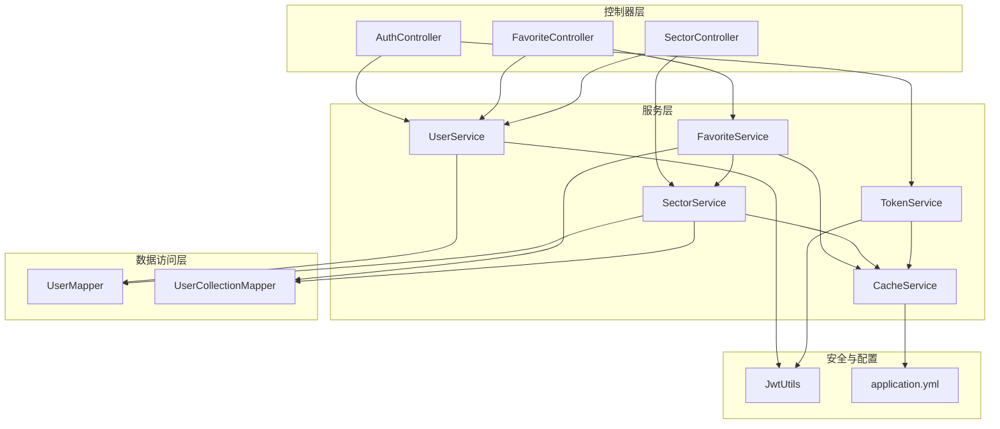
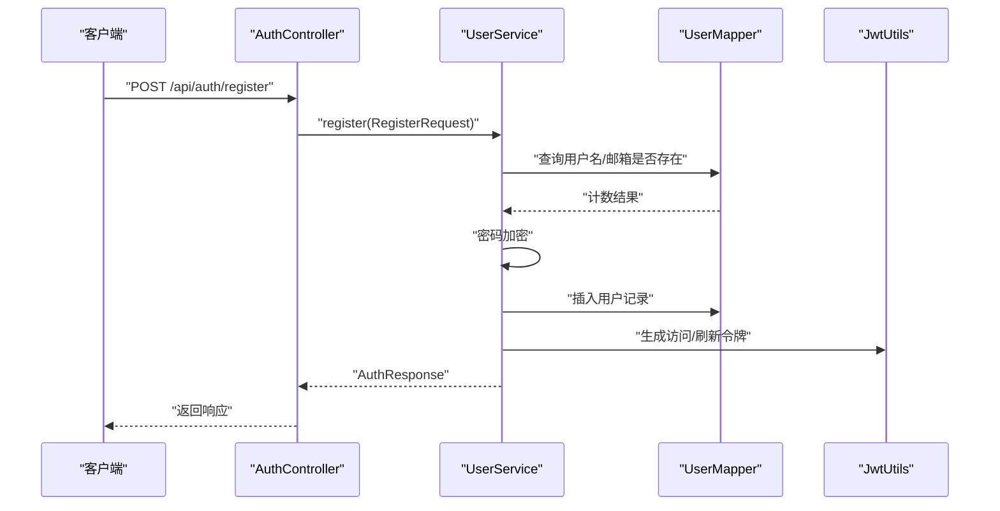
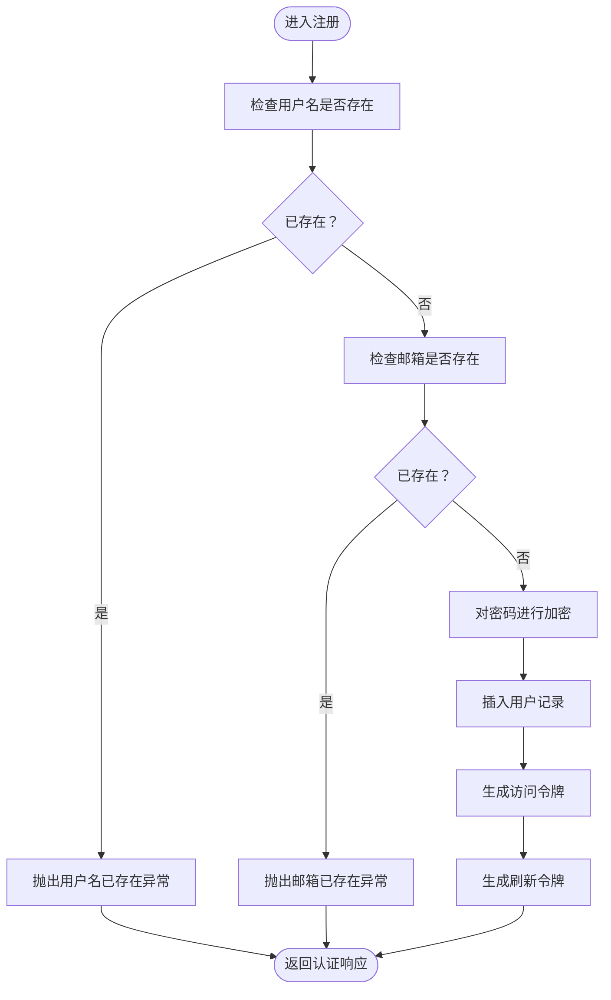
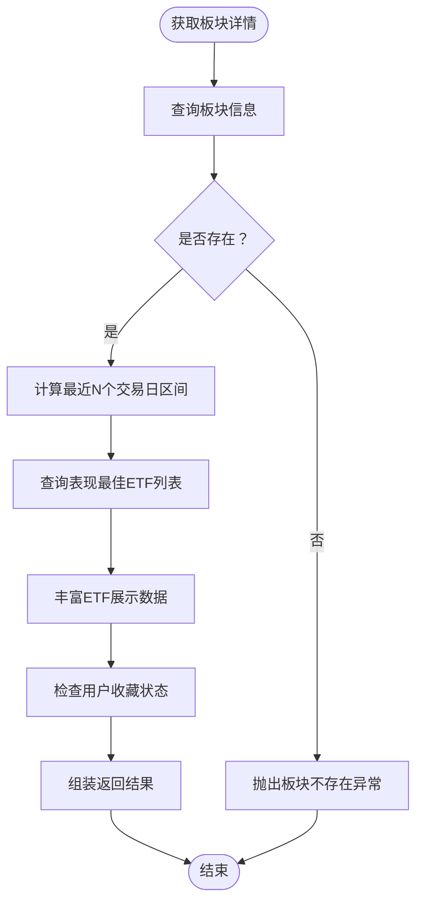
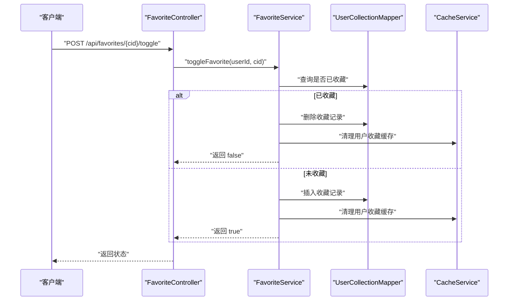
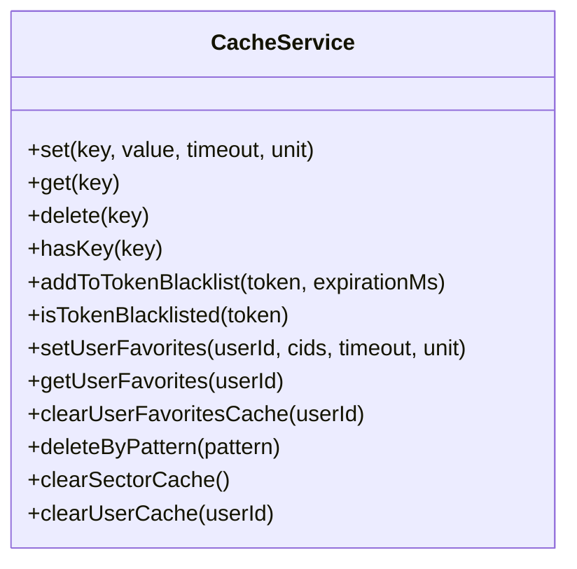
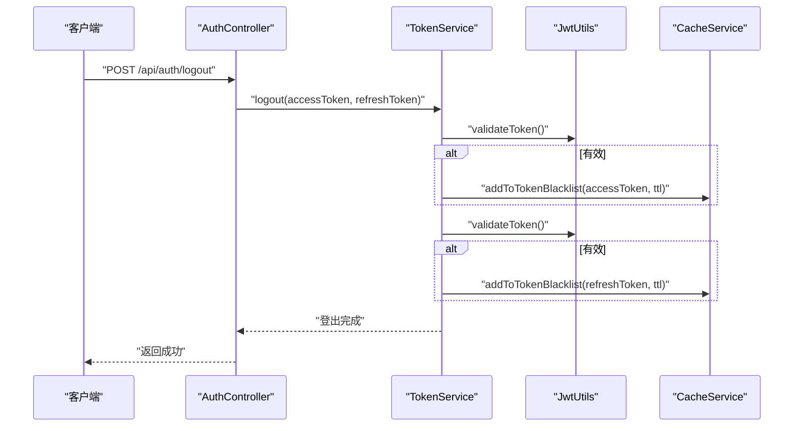
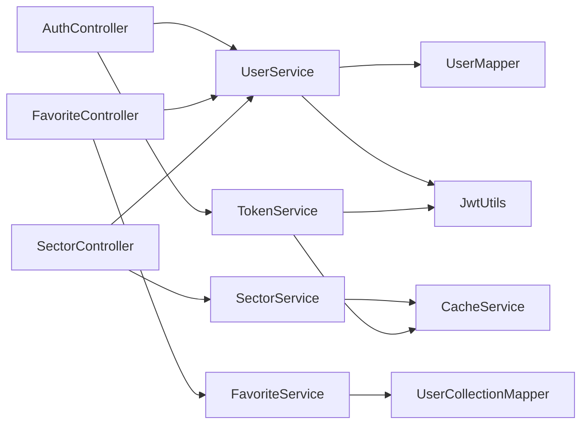

# 服务层设计

<cite>
**本文引用的文件**
- [UserService.java](file://backend/src/main/java/com/freetrader/service/UserService.java)
- [SectorService.java](file://backend/src/main/java/com/freetrader/service/SectorService.java)
- [FavoriteService.java](file://backend/src/main/java/com/freetrader/service/FavoriteService.java)
- [CacheService.java](file://backend/src/main/java/com/freetrader/service/CacheService.java)
- [TokenService.java](file://backend/src/main/java/com/freetrader/service/TokenService.java)
- [User.java](file://backend/src/main/java/com/freetrader/entity/User.java)
- [UserCollection.java](file://backend/src/main/java/com/freetrader/entity/UserCollection.java)
- [UserMapper.java](file://backend/src/main/java/com/freetrader/mapper/UserMapper.java)
- [UserCollectionMapper.java](file://backend/src/main/java/com/freetrader/mapper/UserCollectionMapper.java)
- [application.yml](file://backend/src/main/resources/application.yml)
- [AuthController.java](file://backend/src/main/java/com/freetrader/controller/AuthController.java)
- [FavoriteController.java](file://backend/src/main/java/com/freetrader/controller/FavoriteController.java)
- [SectorController.java](file://backend/src/main/java/com/freetrader/controller/SectorController.java)
- [JwtUtils.java](file://backend/src/main/java/com/freetrader/security/JwtUtils.java)
- [AuthResponse.java](file://backend/src/main/java/com/freetrader/dto/AuthResponse.java)
</cite>

## 目录
1. [引言](#引言)
2. [项目结构](#项目结构)
3. [核心组件](#核心组件)
4. [架构总览](#架构总览)
5. [详细组件分析](#详细组件分析)
6. [依赖关系分析](#依赖关系分析)
7. [性能考量](#性能考量)
8. [故障排查指南](#故障排查指南)
9. [结论](#结论)
10. [附录](#附录)

## 引言
本文件面向 FreeTrader 的服务层，系统性阐述其在分层架构中的核心职责与业务逻辑封装方式。服务层负责：
- 用户服务：用户注册、登录、身份加载与信息查询
- 板块服务：板块数据获取、趋势计算、表现分析与缓存策略
- 收藏服务：用户收藏的增删查与状态切换
- 缓存服务：基于 Redis 的统一缓存抽象，覆盖 Token 黑名单、用户收藏、板块缓存等
- 令牌服务：刷新访问令牌、登出加入黑名单、令牌有效性校验

同时给出事务管理、异常处理、性能优化的最佳实践，并通过图示化的方式帮助读者快速理解各组件之间的交互。

## 项目结构
服务层位于 backend/src/main/java/com/freetrader/service，围绕用户、板块、收藏、缓存、令牌五大领域服务展开；配合控制器层进行端到端流程编排，结合安全组件（JWT）与配置文件（application.yml）完成认证授权与运行时参数注入。

图表来源
- [AuthController.java](file://backend/src/main/java/com/freetrader/controller/AuthController.java#L1-L72)
- [FavoriteController.java](file://backend/src/main/java/com/freetrader/controller/FavoriteController.java#L1-L90)
- [SectorController.java](file://backend/src/main/java/com/freetrader/controller/SectorController.java#L1-L63)
- [UserService.java](file://backend/src/main/java/com/freetrader/service/UserService.java#L1-L103)
- [SectorService.java](file://backend/src/main/java/com/freetrader/service/SectorService.java#L1-L253)
- [FavoriteService.java](file://backend/src/main/java/com/freetrader/service/FavoriteService.java#L1-L119)
- [CacheService.java](file://backend/src/main/java/com/freetrader/service/CacheService.java#L1-L206)
- [TokenService.java](file://backend/src/main/java/com/freetrader/service/TokenService.java#L1-L64)
- [JwtUtils.java](file://backend/src/main/java/com/freetrader/security/JwtUtils.java#L1-L194)
- [application.yml](file://backend/src/main/resources/application.yml#L1-L102)

章节来源
- [application.yml](file://backend/src/main/resources/application.yml#L1-L102)

## 核心组件
- 用户服务（UserService）
  - 负责用户身份加载、注册、登录与按用户名查询
  - 注册流程包含用户名/邮箱唯一性校验、密码加密、JWT 令牌签发
  - 登录流程包含凭据校验与 JWT 令牌签发
- 板块服务（SectorService）
  - 提供板块基础数据、详情、趋势与展示增强
  - 基于交易日历与配置常量计算平均涨跌幅、估算市值、价格与走势
  - 使用缓存注解与自定义缓存服务实现多级缓存
- 收藏服务（FavoriteService）
  - 提供收藏列表查询、添加、移除与切换
  - 通过事务保证收藏变更的一致性，并清理相关缓存
- 缓存服务（CacheService）
  - 统一 Redis 操作，支持 Token 黑名单、用户收藏、板块缓存等键空间
  - 提供批量删除（SCAN 替代 KEYS）与用户/板块维度的缓存清理
- 令牌服务（TokenService）
  - 刷新访问令牌、登出加入黑名单、令牌有效性校验
  - 结合 JWT 工具与缓存黑名单实现安全的令牌生命周期管理

章节来源
- [UserService.java](file://backend/src/main/java/com/freetrader/service/UserService.java#L1-L103)
- [SectorService.java](file://backend/src/main/java/com/freetrader/service/SectorService.java#L1-L253)
- [FavoriteService.java](file://backend/src/main/java/com/freetrader/service/FavoriteService.java#L1-L119)
- [CacheService.java](file://backend/src/main/java/com/freetrader/service/CacheService.java#L1-L206)
- [TokenService.java](file://backend/src/main/java/com/freetrader/service/TokenService.java#L1-L64)

## 架构总览
服务层通过控制器暴露 REST 接口，内部通过依赖注入组合使用 Mapper、实体与安全工具，形成清晰的业务边界与可测试性。

图表来源
- [AuthController.java](file://backend/src/main/java/com/freetrader/controller/AuthController.java#L46-L51)
- [UserService.java](file://backend/src/main/java/com/freetrader/service/UserService.java#L41-L71)
- [UserMapper.java](file://backend/src/main/java/com/freetrader/mapper/UserMapper.java#L1-L10)
- [JwtUtils.java](file://backend/src/main/java/com/freetrader/security/JwtUtils.java#L98-L120)

## 详细组件分析

### 用户服务（UserService）
- 身份加载
  - 通过用户名加载用户并构建 UserDetails 实体，用于 Spring Security 的认证流程
- 注册流程
  - 并发安全：先查询用户名/邮箱唯一性，再写入数据库
  - 密码加密：使用配置的 PasswordEncoder 对明文密码进行编码存储
  - 令牌签发：注册成功后生成访问/刷新令牌并返回
- 登录流程
  - 查询用户并校验密码，成功后签发新令牌
- 查询用户
  - 提供按用户名查询用户的方法，用于控制器解析当前用户

图表来源
- [UserService.java](file://backend/src/main/java/com/freetrader/service/UserService.java#L41-L71)

章节来源
- [UserService.java](file://backend/src/main/java/com/freetrader/service/UserService.java#L31-L101)
- [User.java](file://backend/src/main/java/com/freetrader/entity/User.java#L1-L29)
- [UserMapper.java](file://backend/src/main/java/com/freetrader/mapper/UserMapper.java#L1-L10)
- [JwtUtils.java](file://backend/src/main/java/com/freetrader/security/JwtUtils.java#L98-L120)
- [AuthResponse.java](file://backend/src/main/java/com/freetrader/dto/AuthResponse.java#L1-L19)

### 板块服务（SectorService）
- 数据获取与缓存
  - 板块基础数据：根据最近 N 个交易日区间计算平均涨跌幅，使用缓存注解缓存结果
  - 板块详情：查询板块信息与表现最佳 ETF 列表，丰富展示字段（图标、背景色等），并标注收藏状态
- 用户收藏缓存
  - 优先从缓存读取用户收藏集合，未命中则查询数据库并写回缓存，降低频繁 IO
- 算法实现
  - 估算市值：基于基金数量与倍数系数计算并格式化显示单位
  - 价格计算：以基准价为基础，按涨跌幅推导当前价格
  - 走势生成：基于涨跌方向与随机扰动生成短期趋势点列
- 配置项
  - 默认交易日天数、默认展示 ETF 数量、估算市值倍数、基准价格等由配置文件注入

图表来源
- [SectorService.java](file://backend/src/main/java/com/freetrader/service/SectorService.java#L169-L212)

章节来源
- [SectorService.java](file://backend/src/main/java/com/freetrader/service/SectorService.java#L109-L251)
- [application.yml](file://backend/src/main/resources/application.yml#L67-L76)

### 收藏服务（FavoriteService）
- 收藏列表
  - 通过用户 ID 获取收藏的板块 ID 集合，再委托板块服务过滤出完整 DTO 列表
- 添加收藏
  - 幂等性检查：若已收藏则抛出业务异常
  - 事务内插入收藏记录，并清理用户收藏缓存
- 移除收藏
  - 通过条件删除，若未删除任何记录则抛出“未收藏”异常
  - 同步清理缓存
- 切换收藏
  - 无异常地执行添加/删除，返回当前收藏状态

图表来源
- [FavoriteController.java](file://backend/src/main/java/com/freetrader/controller/FavoriteController.java#L82-L88)
- [FavoriteService.java](file://backend/src/main/java/com/freetrader/service/FavoriteService.java#L91-L117)
- [UserCollectionMapper.java](file://backend/src/main/java/com/freetrader/mapper/UserCollectionMapper.java#L14-L18)
- [CacheService.java](file://backend/src/main/java/com/freetrader/service/CacheService.java#L132-L139)

章节来源
- [FavoriteService.java](file://backend/src/main/java/com/freetrader/service/FavoriteService.java#L34-L117)
- [UserCollection.java](file://backend/src/main/java/com/freetrader/entity/UserCollection.java#L1-L23)
- [UserCollectionMapper.java](file://backend/src/main/java/com/freetrader/mapper/UserCollectionMapper.java#L1-L20)

### 缓存服务（CacheService）
- 键空间设计
  - Token 黑名单：前缀区分访问/刷新令牌
  - 用户缓存：按用户维度隔离
  - 板块缓存：按板块维度隔离
- 基础能力
  - 单 Key 操作：set/get/delete/hasKey
  - 批量删除：使用 SCAN 代替 KEYS，避免阻塞
- 业务能力
  - 用户收藏缓存：读取/写入/清理
  - 板块缓存清理：按模式批量清理
  - 用户缓存清理：按用户维度清理

图表来源
- [CacheService.java](file://backend/src/main/java/com/freetrader/service/CacheService.java#L25-L205)

章节来源
- [CacheService.java](file://backend/src/main/java/com/freetrader/service/CacheService.java#L25-L205)

### 令牌服务（TokenService）
- 刷新访问令牌
  - 校验刷新令牌合法性与类型，检查黑名单，成功后签发新的访问令牌
- 登出
  - 将当前访问/刷新令牌加入黑名单，过期时间对应各自有效期
- 令牌有效性
  - 先验证令牌本身，再检查是否在黑名单中

图表来源
- [AuthController.java](file://backend/src/main/java/com/freetrader/controller/AuthController.java#L66-L70)
- [TokenService.java](file://backend/src/main/java/com/freetrader/service/TokenService.java#L41-L55)
- [JwtUtils.java](file://backend/src/main/java/com/freetrader/security/JwtUtils.java#L146-L154)
- [CacheService.java](file://backend/src/main/java/com/freetrader/service/CacheService.java#L86-L101)

章节来源
- [TokenService.java](file://backend/src/main/java/com/freetrader/service/TokenService.java#L18-L62)
- [JwtUtils.java](file://backend/src/main/java/com/freetrader/security/JwtUtils.java#L98-L120)

## 依赖关系分析
- 控制器依赖服务：AuthController 依赖 UserService 与 TokenService；FavoriteController 依赖 FavoriteService 与 UserService；SectorController 依赖 SectorService 与 UserService
- 服务依赖数据访问：UserService 依赖 UserMapper；FavoriteService 依赖 UserCollectionMapper；SectorService 依赖多个 Mapper 与 CacheService
- 安全与配置：JwtUtils 提供令牌生成与校验；application.yml 提供数据库、Redis、JWT、应用参数等配置

图表来源
- [AuthController.java](file://backend/src/main/java/com/freetrader/controller/AuthController.java#L25-L26)
- [FavoriteController.java](file://backend/src/main/java/com/freetrader/controller/FavoriteController.java#L32-L33)
- [SectorController.java](file://backend/src/main/java/com/freetrader/controller/SectorController.java#L28-L29)
- [UserService.java](file://backend/src/main/java/com/freetrader/service/UserService.java#L27-L29)
- [FavoriteService.java](file://backend/src/main/java/com/freetrader/service/FavoriteService.java#L27-L29)
- [SectorService.java](file://backend/src/main/java/com/freetrader/service/SectorService.java#L32-L36)
- [TokenService.java](file://backend/src/main/java/com/freetrader/service/TokenService.java#L15-L16)

章节来源
- [application.yml](file://backend/src/main/resources/application.yml#L60-L76)

## 性能考量
- 缓存策略
  - 板块基础数据与详情使用缓存注解与自定义缓存，减少数据库压力
  - 用户收藏缓存采用短 TTL（分钟级），平衡一致性与性能
  - 批量删除使用 SCAN 代替 KEYS，避免阻塞 Redis
- 事务边界
  - 用户注册、收藏添加/移除/切换均在事务中执行，确保数据一致性
- 算法复杂度
  - 板块详情查询涉及多次数据库访问与列表处理，建议结合索引与分页策略
- 配置调优
  - Redis 连接池大小、超时时间与缓存 TTL 可根据业务峰值调整
  - JWT 过期时间需权衡用户体验与安全性

## 故障排查指南
- 用户相关
  - 注册用户名/邮箱重复：检查唯一性约束与服务层校验逻辑
  - 登录失败：确认密码编码器配置与凭据匹配逻辑
- 收藏相关
  - 已收藏仍尝试添加：服务层会抛出业务异常，需前端提示
  - 未收藏却尝试移除：同样会触发业务异常
- 板块相关
  - 板块不存在：详情查询会抛出业务异常，需校验输入 ID
  - 交易日数据为空：服务层提供回退策略，检查交易日历数据源
- 缓存相关
  - 用户收藏缓存未命中：确认缓存键空间与 TTL 设置
  - 批量删除无效：检查模式匹配与 SCAN 行为
- 令牌相关
  - 刷新令牌无效：检查令牌类型、黑名单与过期时间
  - 登出后仍可访问：确认黑名单写入与校验链路

章节来源
- [UserService.java](file://backend/src/main/java/com/freetrader/service/UserService.java#L45-L51)
- [UserService.java](file://backend/src/main/java/com/freetrader/service/UserService.java#L79-L82)
- [FavoriteService.java](file://backend/src/main/java/com/freetrader/service/FavoriteService.java#L54-L56)
- [FavoriteService.java](file://backend/src/main/java/com/freetrader/service/FavoriteService.java#L78-L80)
- [SectorService.java](file://backend/src/main/java/com/freetrader/service/SectorService.java#L175-L178)
- [TokenService.java](file://backend/src/main/java/com/freetrader/service/TokenService.java#L19-L32)

## 结论
服务层通过明确的职责划分与良好的依赖注入，实现了认证、收藏、板块数据与缓存/令牌管理的高内聚低耦合。配合缓存与事务机制，在保证数据一致性的前提下提升了整体性能与可维护性。建议持续关注缓存命中率、Redis 性能与 JWT 密钥安全管理，以支撑业务增长。

## 附录
- 关键配置项
  - 数据库连接池与 MyBatis Plus 全局配置
  - Redis 连接与缓存 TTL
  - JWT 密钥与过期时间
  - 应用参数：交易日天数、展示 ETF 数量、板块计算常量

章节来源
- [application.yml](file://backend/src/main/resources/application.yml#L8-L58)
- [application.yml](file://backend/src/main/resources/application.yml#L60-L76)