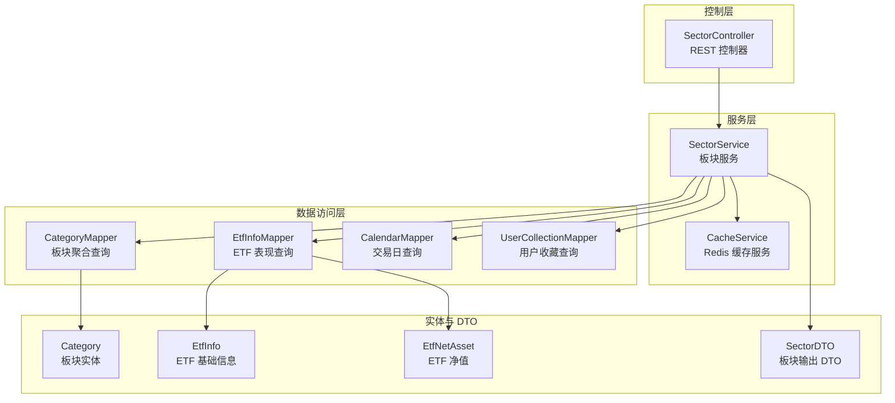
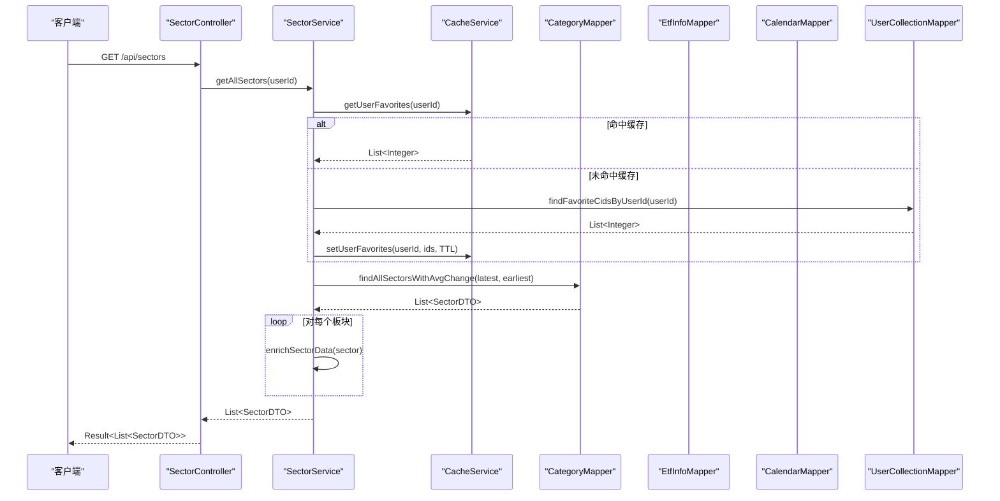
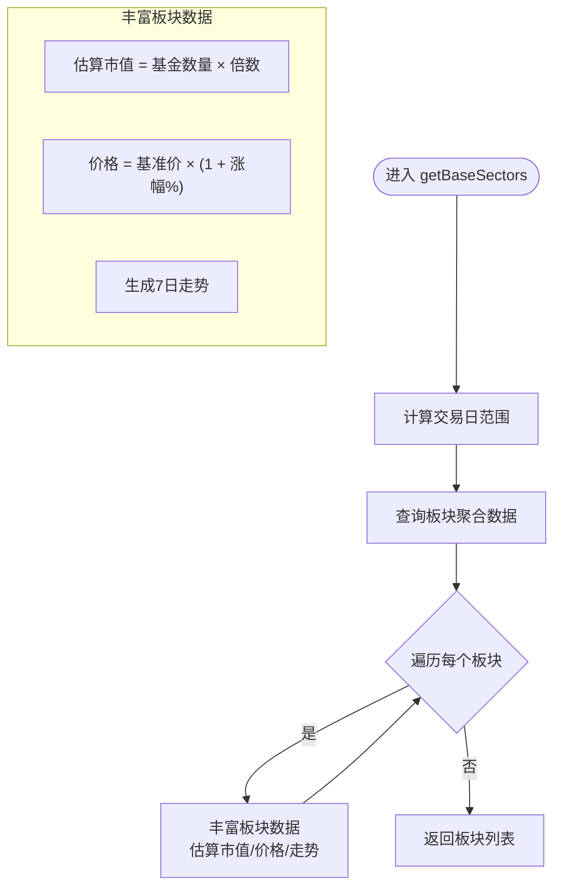
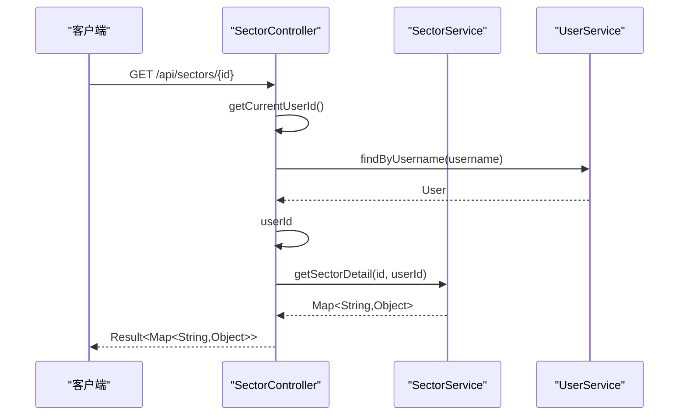
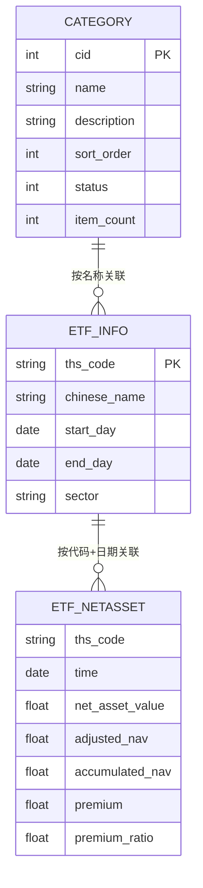
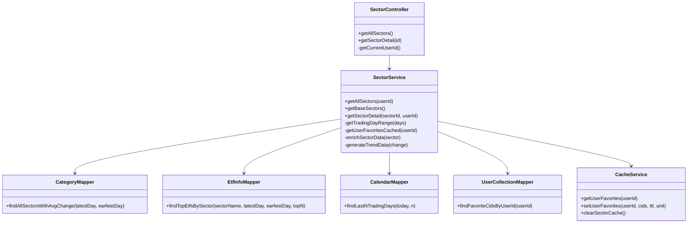

# 板块服务

<cite>
**本文引用的文件**
- [SectorService.java](file://backend/src/main/java/com/freetrader/service/SectorService.java)
- [SectorController.java](file://backend/src/main/java/com/freetrader/controller/SectorController.java)
- [EtfInfoMapper.java](file://backend/src/main/java/com/freetrader/mapper/EtfInfoMapper.java)
- [CategoryMapper.java](file://backend/src/main/java/com/freetrader/mapper/CategoryMapper.java)
- [CalendarMapper.java](file://backend/src/main/java/com/freetrader/mapper/CalendarMapper.java)
- [UserCollectionMapper.java](file://backend/src/main/java/com/freetrader/mapper/UserCollectionMapper.java)
- [CacheService.java](file://backend/src/main/java/com/freetrader/service/CacheService.java)
- [SectorDTO.java](file://backend/src/main/java/com/freetrader/dto/SectorDTO.java)
- [Category.java](file://backend/src/main/java/com/freetrader/entity/Category.java)
- [EtfInfo.java](file://backend/src/main/java/com/freetrader/entity/EtfInfo.java)
- [EtfNetAsset.java](file://backend/src/main/java/com/freetrader/entity/EtfNetAsset.java)
- [application.yml](file://backend/src/main/resources/application.yml)
- [category.sql](file://sql/category.sql)
</cite>

## 目录
1. [简介](#简介)
2. [项目结构](#项目结构)
3. [核心组件](#核心组件)
4. [架构总览](#架构总览)
5. [详细组件分析](#详细组件分析)
6. [依赖关系分析](#依赖关系分析)
7. [性能考量](#性能考量)
8. [故障排查指南](#故障排查指南)
9. [结论](#结论)
10. [附录](#附录)

## 简介
本技术文档围绕 FreeTrader 的板块服务进行系统化梳理，重点解析 SectorService 的核心业务逻辑与实现细节，涵盖：
- 板块数据获取与聚合算法
- ETF 信息查询与净值计算
- 走势数据生成与展示
- 板块分类管理与收藏状态维护
- 数据访问层交互、缓存策略与异常处理
- 接口实现与分页/过滤/排序的数据访问模式
- 性能优化建议与最佳实践

## 项目结构
后端采用 Spring Boot + MyBatis-Plus 架构，板块服务位于 service 层，控制器位于 controller 层，数据访问通过 Mapper 接口完成，并结合 Redis 缓存提升性能。

图表来源
- [SectorController.java](file://backend/src/main/java/com/freetrader/controller/SectorController.java#L22-L62)
- [SectorService.java](file://backend/src/main/java/com/freetrader/service/SectorService.java#L30-L36)
- [CategoryMapper.java](file://backend/src/main/java/com/freetrader/mapper/CategoryMapper.java#L12-L47)
- [EtfInfoMapper.java](file://backend/src/main/java/com/freetrader/mapper/EtfInfoMapper.java#L12-L52)
- [CalendarMapper.java](file://backend/src/main/java/com/freetrader/mapper/CalendarMapper.java#L11-L24)
- [UserCollectionMapper.java](file://backend/src/main/java/com/freetrader/mapper/UserCollectionMapper.java#L11-L19)
- [CacheService.java](file://backend/src/main/java/com/freetrader/service/CacheService.java#L24-L205)
- [Category.java](file://backend/src/main/java/com/freetrader/entity/Category.java#L12-L44)
- [EtfInfo.java](file://backend/src/main/java/com/freetrader/entity/EtfInfo.java#L10-L23)
- [EtfNetAsset.java](file://backend/src/main/java/com/freetrader/entity/EtfNetAsset.java#L9-L25)
- [SectorDTO.java](file://backend/src/main/java/com/freetrader/dto/SectorDTO.java#L12-L22)

章节来源
- [SectorController.java](file://backend/src/main/java/com/freetrader/controller/SectorController.java#L22-L62)
- [SectorService.java](file://backend/src/main/java/com/freetrader/service/SectorService.java#L27-L50)

## 核心组件
- SectorController：提供 REST 接口，负责接收请求、解析当前用户并调用 SectorService。
- SectorService：核心业务逻辑，负责板块聚合、ETF 查询、净值计算、收藏状态、缓存与异常处理。
- CacheService：统一 Redis 缓存操作，支持用户收藏缓存、批量清理等。
- Mapper 层：基于 MyBatis-Plus 的接口，封装 SQL 查询，包括板块聚合、ETF 表现、交易日、用户收藏等。
- 实体与 DTO：Category、EtfInfo、EtfNetAsset、SectorDTO 定义数据模型与输出结构。

章节来源
- [SectorController.java](file://backend/src/main/java/com/freetrader/controller/SectorController.java#L22-L62)
- [SectorService.java](file://backend/src/main/java/com/freetrader/service/SectorService.java#L30-L36)
- [CacheService.java](file://backend/src/main/java/com/freetrader/service/CacheService.java#L24-L205)
- [CategoryMapper.java](file://backend/src/main/java/com/freetrader/mapper/CategoryMapper.java#L12-L47)
- [EtfInfoMapper.java](file://backend/src/main/java/com/freetrader/mapper/EtfInfoMapper.java#L12-L52)
- [CalendarMapper.java](file://backend/src/main/java/com/freetrader/mapper/CalendarMapper.java#L11-L24)
- [UserCollectionMapper.java](file://backend/src/main/java/com/freetrader/mapper/UserCollectionMapper.java#L11-L19)
- [Category.java](file://backend/src/main/java/com/freetrader/entity/Category.java#L12-L44)
- [EtfInfo.java](file://backend/src/main/java/com/freetrader/entity/EtfInfo.java#L10-L23)
- [EtfNetAsset.java](file://backend/src/main/java/com/freetrader/entity/EtfNetAsset.java#L9-L25)
- [SectorDTO.java](file://backend/src/main/java/com/freetrader/dto/SectorDTO.java#L12-L22)

## 架构总览
板块服务遵循典型的三层架构：控制层负责请求接入与响应封装；服务层承载业务规则与数据聚合；数据访问层通过 MyBatis-Plus 组织 SQL；缓存层通过 Redis 提升热点数据访问效率。

图表来源
- [SectorController.java](file://backend/src/main/java/com/freetrader/controller/SectorController.java#L41-L48)
- [SectorService.java](file://backend/src/main/java/com/freetrader/service/SectorService.java#L109-L141)
- [CacheService.java](file://backend/src/main/java/com/freetrader/service/CacheService.java#L105-L130)
- [CategoryMapper.java](file://backend/src/main/java/com/freetrader/mapper/CategoryMapper.java#L19-L46)
- [UserCollectionMapper.java](file://backend/src/main/java/com/freetrader/mapper/UserCollectionMapper.java#L14-L18)

## 详细组件分析

### SectorService：板块服务核心
- 交易日范围计算：根据默认交易天数与交易日历，回溯最近 N 个交易日，若无交易日则回退到自然日。
- 用户收藏缓存：优先从 Redis 获取收藏板块 ID 列表，未命中则查询数据库并写入缓存，设置短 TTL。
- 板块基础数据：通过 CategoryMapper 聚合板块平均涨跌幅，随后对每个板块进行数据丰富（估算市值、价格、走势）。
- 板块详情：按板块 ID 查询分类信息，获取最近 N 天内表现最好的 ETF 列表，丰富展示字段（图标、背景色等），并检查收藏状态。
- 走势数据生成：基于涨跌方向生成近 7 天的随机波动走势，用于前端 Sparkline 展示。
- 异常处理：板块不存在时抛出业务异常，便于上层统一处理。

图表来源
- [SectorService.java](file://backend/src/main/java/com/freetrader/service/SectorService.java#L124-L141)
- [SectorService.java](file://backend/src/main/java/com/freetrader/service/SectorService.java#L146-L165)

章节来源
- [SectorService.java](file://backend/src/main/java/com/freetrader/service/SectorService.java#L64-L76)
- [SectorService.java](file://backend/src/main/java/com/freetrader/service/SectorService.java#L81-L104)
- [SectorService.java](file://backend/src/main/java/com/freetrader/service/SectorService.java#L124-L141)
- [SectorService.java](file://backend/src/main/java/com/freetrader/service/SectorService.java#L171-L212)
- [SectorService.java](file://backend/src/main/java/com/freetrader/service/SectorService.java#L239-L251)

### SectorController：接口实现
- 获取所有板块：解析当前用户，调用 SectorService.getAllSectors 并封装为 Result。
- 获取板块详情：解析路径参数 id，调用 SectorService.getSectorDetail，封装为 Result。
- 用户解析：通过 SecurityContextHolder 获取当前认证用户，再通过 UserService 查找用户 ID。

图表来源
- [SectorController.java](file://backend/src/main/java/com/freetrader/controller/SectorController.java#L31-L39)
- [SectorController.java](file://backend/src/main/java/com/freetrader/controller/SectorController.java#L55-L61)

章节来源
- [SectorController.java](file://backend/src/main/java/com/freetrader/controller/SectorController.java#L41-L48)
- [SectorController.java](file://backend/src/main/java/com/freetrader/controller/SectorController.java#L55-L61)

### 数据访问层：聚合与查询
- 板块聚合查询：CategoryMapper.findAllSectorsWithAvgChange 通过连接 etf_info 与 etf_netasset，按板块统计最近 N 天涨跌幅均值，支持排序与过滤。
- ETF 表现查询：EtfInfoMapper.findTopEtfsBySector 依据板块名筛选 ETF，按涨跌幅排序并限制数量。
- 交易日查询：CalendarMapper.findLastNTradingDays 返回最近 N 个交易日。
- 用户收藏查询：UserCollectionMapper.findFavoriteCidsByUserId 返回用户收藏的板块 ID 列表。

图表来源
- [Category.java](file://backend/src/main/java/com/freetrader/entity/Category.java#L12-L44)
- [EtfInfo.java](file://backend/src/main/java/com/freetrader/entity/EtfInfo.java#L10-L23)
- [EtfNetAsset.java](file://backend/src/main/java/com/freetrader/entity/EtfNetAsset.java#L9-L25)
- [CategoryMapper.java](file://backend/src/main/java/com/freetrader/mapper/CategoryMapper.java#L19-L46)
- [EtfInfoMapper.java](file://backend/src/main/java/com/freetrader/mapper/EtfInfoMapper.java#L18-L51)

章节来源
- [CategoryMapper.java](file://backend/src/main/java/com/freetrader/mapper/CategoryMapper.java#L19-L46)
- [EtfInfoMapper.java](file://backend/src/main/java/com/freetrader/mapper/EtfInfoMapper.java#L18-L51)
- [CalendarMapper.java](file://backend/src/main/java/com/freetrader/mapper/CalendarMapper.java#L17-L23)
- [UserCollectionMapper.java](file://backend/src/main/java/com/freetrader/mapper/UserCollectionMapper.java#L14-L18)

### 缓存策略与异常处理
- 缓存策略：
  - 板块基础数据缓存：@Cacheable("sectors")，键为固定字符串，TTL 由 application.yml 中 redis.time-to-live 控制。
  - 板块详情缓存：@Cacheable("sectorDetail")，键为板块 ID。
  - 用户收藏缓存：CacheService.setUserFavorites(userId, ids, TTL)，TTL 为 5 分钟。
  - 批量清理：CacheService.clearSectorCache() 清理板块相关缓存键前缀。
- 异常处理：
  - 板块不存在：抛出 BusinessException(ErrorCode.SECTOR_NOT_FOUND)，由全局异常处理器统一处理。
  - Redis 操作异常：捕获并记录错误，不影响主流程。

章节来源
- [SectorService.java](file://backend/src/main/java/com/freetrader/service/SectorService.java#L124-L141)
- [SectorService.java](file://backend/src/main/java/com/freetrader/service/SectorService.java#L171-L178)
- [CacheService.java](file://backend/src/main/java/com/freetrader/service/CacheService.java#L187-L195)
- [application.yml](file://backend/src/main/resources/application.yml#L40-L44)

### 数据模型与 DTO
- SectorDTO：对外输出的板块数据结构，包含平均涨跌幅、价格、市值、收藏状态、基金数量、描述与走势。
- Category：板块实体，包含排序、状态、计数等元信息。
- EtfInfo / EtfNetAsset：ETF 基础信息与净值数据，支撑板块聚合与 ETF 表现查询。

章节来源
- [SectorDTO.java](file://backend/src/main/java/com/freetrader/dto/SectorDTO.java#L12-L22)
- [Category.java](file://backend/src/main/java/com/freetrader/entity/Category.java#L12-L44)
- [EtfInfo.java](file://backend/src/main/java/com/freetrader/entity/EtfInfo.java#L10-L23)
- [EtfNetAsset.java](file://backend/src/main/java/com/freetrader/entity/EtfNetAsset.java#L9-L25)

## 依赖关系分析
- 控制器依赖服务层；服务层依赖多个 Mapper 与 CacheService；Mapper 依赖数据库表结构。
- 关键依赖链：
  - SectorController → SectorService
  - SectorService → CategoryMapper、EtfInfoMapper、CalendarMapper、UserCollectionMapper、CacheService
  - Mapper → 实体与 DTO

图表来源
- [SectorController.java](file://backend/src/main/java/com/freetrader/controller/SectorController.java#L26-L29)
- [SectorService.java](file://backend/src/main/java/com/freetrader/service/SectorService.java#L30-L36)
- [CacheService.java](file://backend/src/main/java/com/freetrader/service/CacheService.java#L24-L205)
- [CategoryMapper.java](file://backend/src/main/java/com/freetrader/mapper/CategoryMapper.java#L12-L47)
- [EtfInfoMapper.java](file://backend/src/main/java/com/freetrader/mapper/EtfInfoMapper.java#L12-L52)
- [CalendarMapper.java](file://backend/src/main/java/com/freetrader/mapper/CalendarMapper.java#L11-L24)
- [UserCollectionMapper.java](file://backend/src/main/java/com/freetrader/mapper/UserCollectionMapper.java#L11-L19)

## 性能考量
- 缓存命中率优化
  - 板块基础数据与详情分别使用独立缓存键空间，避免相互污染。
  - 用户收藏缓存短 TTL，降低数据陈旧风险。
- 数据库查询优化
  - 板块聚合查询使用 JOIN + GROUP BY + ORDER BY，确保按排序字段高效返回。
  - ETF 表现查询使用 LIMIT 控制返回数量，避免大结果集。
- 交易日回退策略
  - 当交易日历不可用时回退到自然日，保证服务可用性。
- Redis 扫描与批量删除
  - 使用 SCAN 替代 KEYS，避免阻塞；提供批量清理接口。
- 配置项建议
  - 根据业务峰值调整 Redis TTL、MyBatis 日志级别与连接池大小。
  - 在生产环境开启 SQL 日志前评估性能影响。

章节来源
- [SectorService.java](file://backend/src/main/java/com/freetrader/service/SectorService.java#L124-L141)
- [SectorService.java](file://backend/src/main/java/com/freetrader/service/SectorService.java#L81-L104)
- [CacheService.java](file://backend/src/main/java/com/freetrader/service/CacheService.java#L147-L183)
- [application.yml](file://backend/src/main/resources/application.yml#L13-L18)
- [application.yml](file://backend/src/main/resources/application.yml#L40-L52)

## 故障排查指南
- 板块不存在
  - 现象：接口返回 404 或业务异常。
  - 排查：确认板块 ID 是否正确，CategoryMapper 是否存在对应记录。
- Redis 缓存异常
  - 现象：缓存读写失败或清理无效。
  - 排查：检查 Redis 连接配置、KEY 前缀、SCAN 操作日志。
- 交易日查询为空
  - 现象：板块涨跌幅为 0 或异常。
  - 排查：确认 calendar 表中是否存在有效交易日，回退逻辑是否生效。
- ETF 表现查询为空
  - 现象：板块详情中 ETF 列表为空。
  - 排查：确认 etf_info 与 etf_netasset 数据完整性与时间对齐。

章节来源
- [SectorService.java](file://backend/src/main/java/com/freetrader/service/SectorService.java#L171-L178)
- [CacheService.java](file://backend/src/main/java/com/freetrader/service/CacheService.java#L40-L58)
- [CalendarMapper.java](file://backend/src/main/java/com/freetrader/mapper/CalendarMapper.java#L17-L23)
- [EtfInfoMapper.java](file://backend/src/main/java/com/freetrader/mapper/EtfInfoMapper.java#L18-L51)

## 结论
SectorService 通过清晰的分层设计与缓存策略，实现了板块数据的高效聚合与展示。其核心优势在于：
- 基于交易日历的稳健数据窗口计算
- 以 Redis 为核心的多级缓存体系
- 可扩展的板块与 ETF 数据模型
- 明确的异常处理与可观测性

建议在生产环境中进一步完善：
- 缓存失效与预热策略
- 数据一致性监控与告警
- 查询性能基准测试与索引优化

## 附录
- 配置参考
  - 默认交易天数、展示 ETF 数量、估算市值倍数与基准价等可通过 application.yml 调整。
- 数据库建表参考
  - category 表结构定义了板块的元信息与索引，确保查询性能。

章节来源
- [application.yml](file://backend/src/main/resources/application.yml#L68-L76)
- [category.sql](file://sql/category.sql#L23-L36)