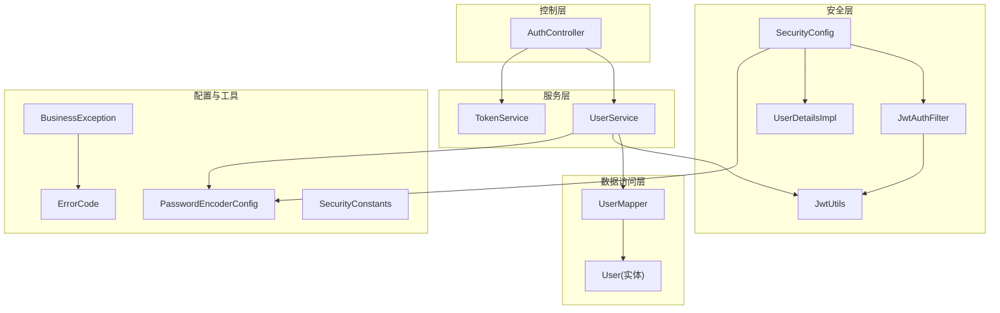
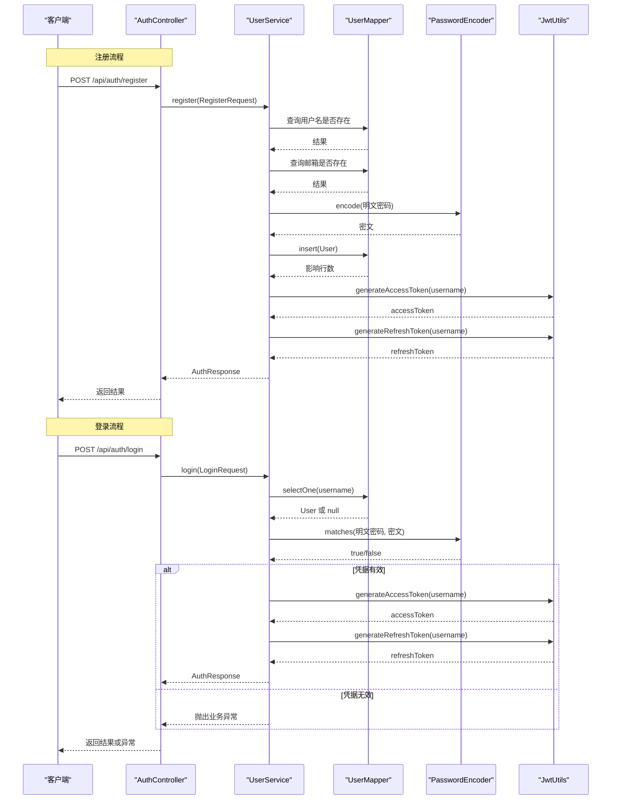
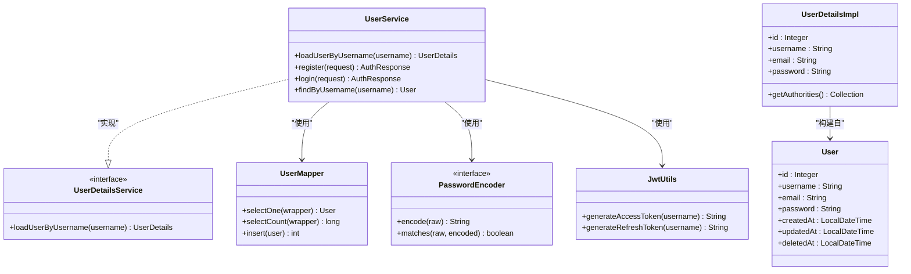
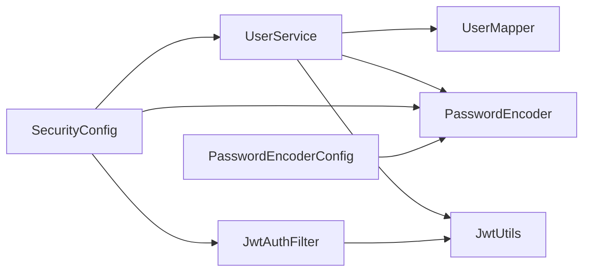

# 用户服务

<cite>
**本文引用的文件**
- [UserService.java](file://backend/src/main/java/com/freetrader/service/UserService.java)
- [UserDetailsImpl.java](file://backend/src/main/java/com/freetrader/security/UserDetailsImpl.java)
- [UserMapper.java](file://backend/src/main/java/com/freetrader/mapper/UserMapper.java)
- [User.java](file://backend/src/main/java/com/freetrader/entity/User.java)
- [PasswordEncoderConfig.java](file://backend/src/main/java/com/freetrader/config/PasswordEncoderConfig.java)
- [SecurityConfig.java](file://backend/src/main/java/com/freetrader/config/SecurityConfig.java)
- [JwtUtils.java](file://backend/src/main/java/com/freetrader/security/JwtUtils.java)
- [RegisterRequest.java](file://backend/src/main/java/com/freetrader/dto/RegisterRequest.java)
- [LoginRequest.java](file://backend/src/main/java/com/freetrader/dto/LoginRequest.java)
- [AuthResponse.java](file://backend/src/main/java/com/freetrader/dto/AuthResponse.java)
- [AuthController.java](file://backend/src/main/java/com/freetrader/controller/AuthController.java)
- [BusinessException.java](file://backend/src/main/java/com/freetrader/exception/BusinessException.java)
- [ErrorCode.java](file://backend/src/main/java/com/freetrader/exception/ErrorCode.java)
- [SecurityConstants.java](file://backend/src/main/java/com/freetrader/util/SecurityConstants.java)
- [UserServiceTest.java](file://backend/src/test/java/com/freetrader/service/UserServiceTest.java)
</cite>

## 目录
1. [简介](#简介)
2. [项目结构](#项目结构)
3. [核心组件](#核心组件)
4. [架构总览](#架构总览)
5. [详细组件分析](#详细组件分析)
6. [依赖关系分析](#依赖关系分析)
7. [性能考虑](#性能考虑)
8. [故障排查指南](#故障排查指南)
9. [结论](#结论)
10. [附录](#附录)

## 简介
本文件面向 FreeTrader 的用户服务，围绕 UserService 类展开，系统性阐述以下主题：
- 用户注册：用户名与邮箱唯一性校验、密码加密存储、用户信息持久化
- 用户登录：凭据匹配、密码编码器使用、用户状态检查
- Spring Security UserDetailsService 实现：用户加载、权限构建
- 注册与登录完整流程示例：请求参数校验、业务异常处理、JWT 令牌生成
- 事务管理、日志记录、性能优化等最佳实践

## 项目结构
后端采用分层架构，用户服务位于 service 层，配合控制器、数据访问层、安全配置与工具类协同工作。

图表来源
- [AuthController.java](file://backend/src/main/java/com/freetrader/controller/AuthController.java#L1-L72)
- [UserService.java](file://backend/src/main/java/com/freetrader/service/UserService.java#L1-L103)
- [UserMapper.java](file://backend/src/main/java/com/freetrader/mapper/UserMapper.java#L1-L10)
- [User.java](file://backend/src/main/java/com/freetrader/entity/User.java#L1-L29)
- [SecurityConfig.java](file://backend/src/main/java/com/freetrader/config/SecurityConfig.java#L1-L61)
- [JwtUtils.java](file://backend/src/main/java/com/freetrader/security/JwtUtils.java#L1-L194)
- [UserDetailsImpl.java](file://backend/src/main/java/com/freetrader/security/UserDetailsImpl.java#L1-L56)
- [PasswordEncoderConfig.java](file://backend/src/main/java/com/freetrader/config/PasswordEncoderConfig.java#L1-L20)
- [BusinessException.java](file://backend/src/main/java/com/freetrader/exception/BusinessException.java#L1-L30)
- [ErrorCode.java](file://backend/src/main/java/com/freetrader/exception/ErrorCode.java#L1-L35)
- [SecurityConstants.java](file://backend/src/main/java/com/freetrader/util/SecurityConstants.java#L1-L42)

章节来源
- [AuthController.java](file://backend/src/main/java/com/freetrader/controller/AuthController.java#L1-L72)
- [UserService.java](file://backend/src/main/java/com/freetrader/service/UserService.java#L1-L103)
- [SecurityConfig.java](file://backend/src/main/java/com/freetrader/config/SecurityConfig.java#L1-L61)

## 核心组件
- UserService：实现用户注册、登录、按用户名查询；同时实现 Spring Security 的 UserDetailsService，用于认证与授权。
- UserMapper：MyBatis-Plus Mapper，负责用户表的读写。
- User：用户实体，映射 user_info 表。
- UserDetailsImpl：实现 UserDetails，封装用户认证所需信息与权限。
- PasswordEncoderConfig：提供 BCrypt 密码编码器 Bean。
- SecurityConfig：配置基于 JWT 的无状态认证链路、DaoAuthenticationProvider。
- JwtUtils：JWT 生成、解析、验证工具。
- DTO：RegisterRequest、LoginRequest、AuthResponse。
- 异常体系：BusinessException 与 ErrorCode 枚举，统一业务异常语义。

章节来源
- [UserService.java](file://backend/src/main/java/com/freetrader/service/UserService.java#L1-L103)
- [UserMapper.java](file://backend/src/main/java/com/freetrader/mapper/UserMapper.java#L1-L10)
- [User.java](file://backend/src/main/java/com/freetrader/entity/User.java#L1-L29)
- [UserDetailsImpl.java](file://backend/src/main/java/com/freetrader/security/UserDetailsImpl.java#L1-L56)
- [PasswordEncoderConfig.java](file://backend/src/main/java/com/freetrader/config/PasswordEncoderConfig.java#L1-L20)
- [SecurityConfig.java](file://backend/src/main/java/com/freetrader/config/SecurityConfig.java#L1-L61)
- [JwtUtils.java](file://backend/src/main/java/com/freetrader/security/JwtUtils.java#L1-L194)
- [RegisterRequest.java](file://backend/src/main/java/com/freetrader/dto/RegisterRequest.java#L1-L23)
- [LoginRequest.java](file://backend/src/main/java/com/freetrader/dto/LoginRequest.java#L1-L15)
- [AuthResponse.java](file://backend/src/main/java/com/freetrader/dto/AuthResponse.java#L1-L19)
- [BusinessException.java](file://backend/src/main/java/com/freetrader/exception/BusinessException.java#L1-L30)
- [ErrorCode.java](file://backend/src/main/java/com/freetrader/exception/ErrorCode.java#L1-L35)

## 架构总览
下图展示用户注册与登录的关键交互路径，以及与 Spring Security、JWT 的集成。

图表来源
- [AuthController.java](file://backend/src/main/java/com/freetrader/controller/AuthController.java#L28-L51)
- [UserService.java](file://backend/src/main/java/com/freetrader/service/UserService.java#L41-L96)
- [UserMapper.java](file://backend/src/main/java/com/freetrader/mapper/UserMapper.java#L1-L10)
- [PasswordEncoderConfig.java](file://backend/src/main/java/com/freetrader/config/PasswordEncoderConfig.java#L15-L18)
- [JwtUtils.java](file://backend/src/main/java/com/freetrader/security/JwtUtils.java#L100-L120)

## 详细组件分析

### UserService 类详解
- 职责边界
  - 用户注册：校验用户名与邮箱唯一性，使用密码编码器加密，持久化用户，生成访问与刷新令牌。
  - 用户登录：按用户名检索用户，使用密码编码器进行凭据匹配，生成访问与刷新令牌。
  - 用户加载：实现 UserDetailsService，按用户名加载用户并构建 UserDetails。
  - 用户查询：按用户名查询用户（排除软删除）。
- 关键实现要点
  - 唯一性校验：分别对 username 与 email 执行 count 查询，若大于 0 则抛出对应业务异常。
  - 密码处理：通过注入的 PasswordEncoder 对明文密码进行编码后再入库。
  - 事务管理：注册流程标注 @Transactional，确保唯一性检查与插入的一致性。
  - 日志记录：在注册与登录入口记录关键信息，便于审计与排障。
  - 权限构建：返回 UserDetailsImpl，默认赋予 ROLE_USER。
- 错误处理
  - 用户名或邮箱已存在：抛出 USERNAME_EXISTS 或 EMAIL_EXISTS。
  - 登录失败（用户不存在或密码错误）：抛出 PASSWORD_ERROR。
  - 其他业务异常：统一由 BusinessException 与 ErrorCode 提供一致语义。

章节来源
- [UserService.java](file://backend/src/main/java/com/freetrader/service/UserService.java#L31-L96)
- [BusinessException.java](file://backend/src/main/java/com/freetrader/exception/BusinessException.java#L1-L30)
- [ErrorCode.java](file://backend/src/main/java/com/freetrader/exception/ErrorCode.java#L21-L25)

#### 类关系图

图表来源
- [UserService.java](file://backend/src/main/java/com/freetrader/service/UserService.java#L25-L39)
- [UserMapper.java](file://backend/src/main/java/com/freetrader/mapper/UserMapper.java#L1-L10)
- [User.java](file://backend/src/main/java/com/freetrader/entity/User.java#L1-L29)
- [UserDetailsImpl.java](file://backend/src/main/java/com/freetrader/security/UserDetailsImpl.java#L15-L34)
- [PasswordEncoderConfig.java](file://backend/src/main/java/com/freetrader/config/PasswordEncoderConfig.java#L15-L18)
- [JwtUtils.java](file://backend/src/main/java/com/freetrader/security/JwtUtils.java#L100-L120)

### Spring Security UserDetailsService 实现
- 实现方法
  - loadUserByUsername：按用户名查询用户（排除软删除），若不存在抛出 UsernameNotFoundException；否则调用 UserDetailsImpl.build 构建 UserDetails。
- 权限模型
  - getAuthorities 返回 ROLE_USER，表示普通用户角色。
- 与认证提供者集成
  - SecurityConfig 中通过 DaoAuthenticationProvider 设置 UserDetailsService 与 PasswordEncoder，形成基于数据库的认证链路。

章节来源
- [UserService.java](file://backend/src/main/java/com/freetrader/service/UserService.java#L31-L39)
- [UserDetailsImpl.java](file://backend/src/main/java/com/freetrader/security/UserDetailsImpl.java#L31-L34)
- [SecurityConfig.java](file://backend/src/main/java/com/freetrader/config/SecurityConfig.java#L48-L54)

### 密码编码与登录校验
- 编码器
  - 通过 PasswordEncoderConfig 提供 BCryptPasswordEncoder Bean，确保密码安全存储。
- 登录校验
  - UserService.login 使用 passwordEncoder.matches 对比明文与存储的密文，严格区分“用户不存在”和“密码错误”的场景，分别抛出不同业务异常。
- 控制器层
  - AuthController 对登录与注册接口添加限流注解，降低暴力破解风险。

章节来源
- [PasswordEncoderConfig.java](file://backend/src/main/java/com/freetrader/config/PasswordEncoderConfig.java#L15-L18)
- [UserService.java](file://backend/src/main/java/com/freetrader/service/UserService.java#L73-L82)
- [AuthController.java](file://backend/src/main/java/com/freetrader/controller/AuthController.java#L34-L39)

### JWT 令牌生成与验证
- 令牌类型
  - AccessToken 与 RefreshToken，分别设置不同的过期时长与 claim 类型。
- 生成策略
  - UserService 在注册与登录成功后分别生成两种令牌，并封装到 AuthResponse。
- 验证能力
  - JwtUtils 支持解析、校验过期、区分令牌类型、验证令牌与用户信息一致性等。

章节来源
- [UserService.java](file://backend/src/main/java/com/freetrader/service/UserService.java#L61-L62)
- [UserService.java](file://backend/src/main/java/com/freetrader/service/UserService.java#L84-L85)
- [JwtUtils.java](file://backend/src/main/java/com/freetrader/security/JwtUtils.java#L100-L120)
- [JwtUtils.java](file://backend/src/main/java/com/freetrader/security/JwtUtils.java#L138-L154)
- [JwtUtils.java](file://backend/src/main/java/com/freetrader/security/JwtUtils.java#L159-L178)

### 数据模型与持久化
- 实体映射
  - User 实体映射 user_info 表，包含 id、username、email、password 及时间戳字段。
- Mapper 接口
  - UserMapper 继承 MyBatis-Plus BaseMapper，提供基础 CRUD 能力。
- 查询策略
  - 注册与登录均使用 QueryWrapper 进行精确匹配，并通过 deletedAt 为空判断未软删除用户。

章节来源
- [User.java](file://backend/src/main/java/com/freetrader/entity/User.java#L10-L28)
- [UserMapper.java](file://backend/src/main/java/com/freetrader/mapper/UserMapper.java#L1-L10)
- [UserService.java](file://backend/src/main/java/com/freetrader/service/UserService.java#L33-L38)
- [UserService.java](file://backend/src/main/java/com/freetrader/service/UserService.java#L76-L77)
- [UserService.java](file://backend/src/main/java/com/freetrader/service/UserService.java#L99-L101)

### 请求参数与响应模型
- RegisterRequest：包含用户名、邮箱、密码的校验规则。
- LoginRequest：包含用户名与密码的非空校验。
- AuthResponse：封装访问令牌、刷新令牌及用户基本信息。

章节来源
- [RegisterRequest.java](file://backend/src/main/java/com/freetrader/dto/RegisterRequest.java#L9-L22)
- [LoginRequest.java](file://backend/src/main/java/com/freetrader/dto/LoginRequest.java#L7-L14)
- [AuthResponse.java](file://backend/src/main/java/com/freetrader/dto/AuthResponse.java#L12-L18)

### 完整注册与登录流程示例
- 注册流程
  - 参数校验：RegisterRequest 校验用户名长度、邮箱格式、密码长度。
  - 唯一性检查：对 username 与 email 分别执行 count 查询。
  - 密码加密：使用 BCrypt 编码后存入数据库。
  - 令牌生成：生成 access 与 refresh 令牌并返回。
- 登录流程
  - 用户检索：按用户名查询未删除用户。
  - 凭据匹配：使用 matches 对比密码。
  - 令牌生成：成功后生成 access 与 refresh 令牌并返回。
- 异常处理
  - 用户名/邮箱已存在、密码错误等场景抛出 BusinessException，结合 ErrorCode 提供明确错误码与消息。

章节来源
- [UserService.java](file://backend/src/main/java/com/freetrader/service/UserService.java#L41-L71)
- [UserService.java](file://backend/src/main/java/com/freetrader/service/UserService.java#L73-L96)
- [BusinessException.java](file://backend/src/main/java/com/freetrader/exception/BusinessException.java#L20-L28)
- [ErrorCode.java](file://backend/src/main/java/com/freetrader/exception/ErrorCode.java#L21-L25)

## 依赖关系分析
- 组件耦合
  - UserService 依赖 UserMapper、PasswordEncoder、JwtUtils，职责清晰，内聚性强。
  - SecurityConfig 通过依赖注入装配 UserDetailsService 与 PasswordEncoder，形成认证提供者。
- 外部依赖
  - MyBatis-Plus 提供 ORM 能力；Spring Security 提供认证与授权；BCrypt 提供密码编码；JWT 库提供令牌生成与解析。
- 循环依赖规避
  - PasswordEncoderConfig 独立配置，避免与 SecurityConfig 的循环依赖问题。

图表来源
- [UserService.java](file://backend/src/main/java/com/freetrader/service/UserService.java#L27-L29)
- [SecurityConfig.java](file://backend/src/main/java/com/freetrader/config/SecurityConfig.java#L25-L27)
- [PasswordEncoderConfig.java](file://backend/src/main/java/com/freetrader/config/PasswordEncoderConfig.java#L15-L18)

章节来源
- [UserService.java](file://backend/src/main/java/com/freetrader/service/UserService.java#L1-L103)
- [SecurityConfig.java](file://backend/src/main/java/com/freetrader/config/SecurityConfig.java#L1-L61)
- [PasswordEncoderConfig.java](file://backend/src/main/java/com/freetrader/config/PasswordEncoderConfig.java#L1-L20)

## 性能考虑
- 唯一性检查
  - 注册时对 username 与 email 各执行一次 count 查询，建议在数据库层面建立唯一索引以减少重复扫描与异常开销。
- 密码编码成本
  - BCrypt 编码为 CPU 密集型操作，建议在高并发场景下适当调整编码强度参数或引入缓存策略（如热点用户预热）。
- 事务范围
  - 注册流程使用 @Transactional，确保原子性；建议保持事务最小化，避免在事务中执行耗时操作。
- 日志与监控
  - 在关键节点增加结构化日志与指标埋点，便于定位性能瓶颈。
- 缓存策略
  - 对频繁访问的用户信息可引入 Redis 缓存，结合 Token 黑名单实现登出失效。

## 故障排查指南
- 常见错误与定位
  - 用户名或邮箱已存在：检查唯一性校验与数据库索引；确认请求参数格式。
  - 密码错误：核对前端传参与后端编码器配置；查看日志中的警告信息。
  - 用户不存在：确认用户名大小写与软删除条件。
- 异常体系
  - BusinessException 统一承载错误码与消息；结合 ErrorCode 快速定位问题类别。
- 测试参考
  - UserServiceTest 覆盖登录成功/失败、注册成功/失败、按用户名查询等场景，可作为回归测试基线。

章节来源
- [BusinessException.java](file://backend/src/main/java/com/freetrader/exception/BusinessException.java#L1-L30)
- [ErrorCode.java](file://backend/src/main/java/com/freetrader/exception/ErrorCode.java#L1-L35)
- [UserServiceTest.java](file://backend/src/test/java/com/freetrader/service/UserServiceTest.java#L56-L212)

## 结论
UserService 以简洁清晰的职责划分实现了用户注册与登录的核心业务，结合 Spring Security 的认证链路与 JWT 令牌机制，提供了安全可靠的用户身份管理能力。通过统一的异常体系与完善的单元测试，保障了系统的稳定性与可维护性。建议在生产环境中进一步强化数据库索引、缓存与监控体系，持续提升性能与可观测性。

## 附录
- 安全常量
  - SecurityConstants 定义了 Token 前缀、请求头名称与令牌类型声明字段名，便于前后端约定一致。
- 控制器接口
  - AuthController 提供登录、注册、刷新与登出接口，配合限流注解增强安全性。

章节来源
- [SecurityConstants.java](file://backend/src/main/java/com/freetrader/util/SecurityConstants.java#L6-L41)
- [AuthController.java](file://backend/src/main/java/com/freetrader/controller/AuthController.java#L19-L71)