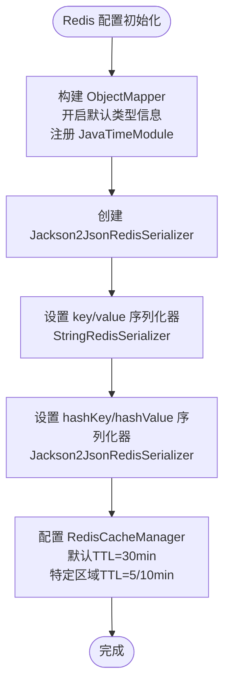

# 缓存服务

<cite>
**本文引用的文件**
- [CacheService.java](file://backend/src/main/java/com/freetrader/service/CacheService.java)
- [CacheKeys.java](file://backend/src/main/java/com/freetrader/util/CacheKeys.java)
- [RedisConfig.java](file://backend/src/main/java/com/freetrader/config/RedisConfig.java)
- [application.yml](file://backend/src/main/resources/application.yml)
- [FavoriteService.java](file://backend/src/main/java/com/freetrader/service/FavoriteService.java)
- [JwtAuthFilter.java](file://backend/src/main/java/com/freetrader/security/JwtAuthFilter.java)
- [TokenService.java](file://backend/src/main/java/com/freetrader/service/TokenService.java)
- [JwtUtils.java](file://backend/src/main/java/com/freetrader/security/JwtUtils.java)
- [SectorService.java](file://backend/src/main/java/com/freetrader/service/SectorService.java)
- [TokenServiceTest.java](file://backend/src/test/java/com/freetrader/service/TokenServiceTest.java)
</cite>

## 更新摘要
**变更内容**
- 新增集中化缓存键管理工具类 CacheKeys
- 改进缓存清理操作，统一使用 CacheKeys 生成键名
- 增强缓存失效逻辑的描述性注释
- 优化缓存键命名规范和生成方法

## 目录
1. [简介](#简介)
2. [项目结构](#项目结构)
3. [核心组件](#核心组件)
4. [架构总览](#架构总览)
5. [详细组件分析](#详细组件分析)
6. [依赖关系分析](#依赖关系分析)
7. [性能考量](#性能考量)
8. [故障排查指南](#故障排查指南)
9. [结论](#结论)
10. [附录](#附录)

## 简介
本文件围绕 FreeTrader 的缓存服务进行系统性技术文档整理，重点阐述 CacheService 的设计理念与实现原理，涵盖 Redis 集成、缓存策略、失效机制、键命名规范、序列化方案、过期时间设置、常见缓存问题（穿透、击穿、雪崩）的应对与预防、缓存使用最佳实践（更新策略、预热、监控）、与业务服务的集成方式、缓存一致性保障以及性能调优与故障排查。

**更新** 引入集中化的 CacheKeys 工具类，统一管理所有 Redis 缓存键的前缀和生成方法，提升代码的可维护性和一致性。

## 项目结构
FreeTrader 后端采用 Spring Boot + Spring Data Redis 架构，缓存服务位于 service 层，通过 RedisConfig 完成 RedisTemplate 与 RedisCacheManager 的装配；业务层（如 TokenService、JwtAuthFilter、FavoriteService、SectorService）通过注入 CacheService 和 CacheKeys 实现缓存读写与失效控制。

**图表来源**
- [RedisConfig.java](file://backend/src/main/java/com/freetrader/config/RedisConfig.java#L25-L97)
- [application.yml](file://backend/src/main/resources/application.yml#L24-L45)
- [CacheService.java](file://backend/src/main/java/com/freetrader/service/CacheService.java#L1-L206)
- [CacheKeys.java](file://backend/src/main/java/com/freetrader/util/CacheKeys.java#L1-L77)
- [TokenService.java](file://backend/src/main/java/com/freetrader/service/TokenService.java#L1-L64)
- [FavoriteService.java](file://backend/src/main/java/com/freetrader/service/FavoriteService.java#L1-L115)
- [SectorService.java](file://backend/src/main/java/com/freetrader/service/SectorService.java#L1-L212)
- [JwtAuthFilter.java](file://backend/src/main/java/com/freetrader/security/JwtAuthFilter.java#L1-L84)
- [JwtUtils.java](file://backend/src/main/java/com/freetrader/security/JwtUtils.java#L1-L205)

**章节来源**
- [RedisConfig.java](file://backend/src/main/java/com/freetrader/config/RedisConfig.java#L25-L97)
- [application.yml](file://backend/src/main/resources/application.yml#L24-L45)

## 核心组件
- **CacheService**：提供统一的 Redis 操作接口，包括基础的 set/get/delete/hasKey，以及 Token 黑名单、用户收藏缓存、板块缓存清理等业务专用方法；支持基于 SCAN 的批量删除以避免 KEYS 阻塞。**更新** 现在使用 CacheKeys 工具类生成缓存键名。
- **CacheKeys**：新增的缓存键常量类，统一管理所有 Redis 缓存的 key 前缀和生成方法，确保 @Cacheable 注解和 RedisTemplate 使用一致的键格式。
- **RedisConfig**：定义 RedisTemplate 序列化器（字符串键、JSON 值），并配置 RedisCacheManager 的默认 TTL 与特定缓存区间的 TTL。
- **application.yml**：集中管理 Redis 连接参数、连接池配置、Spring Cache 类型与默认 TTL。
- **TokenService**：负责刷新访问令牌与登出时将 Token 加入黑名单，并对 Token 有效性进行综合判断（含黑名单检查）。
- **JwtAuthFilter**：在请求过滤阶段检查 Token 是否在黑名单中，若在则放行（由后续流程处理）。
- **FavoriteService**：在用户收藏变更后主动清理用户收藏缓存，确保缓存一致性。
- **SectorService**：提供板块数据查询和缓存功能，使用 @Cacheable 注解管理缓存生命周期。

**章节来源**
- [CacheService.java](file://backend/src/main/java/com/freetrader/service/CacheService.java#L1-L206)
- [CacheKeys.java](file://backend/src/main/java/com/freetrader/util/CacheKeys.java#L1-L77)
- [RedisConfig.java](file://backend/src/main/java/com/freetrader/config/RedisConfig.java#L25-L97)
- [application.yml](file://backend/src/main/resources/application.yml#L24-L45)
- [TokenService.java](file://backend/src/main/java/com/freetrader/service/TokenService.java#L1-L64)
- [JwtAuthFilter.java](file://backend/src/main/java/com/freetrader/security/JwtAuthFilter.java#L1-L84)
- [FavoriteService.java](file://backend/src/main/java/com/freetrader/service/FavoriteService.java#L1-L115)
- [SectorService.java](file://backend/src/main/java/com/freetrader/service/SectorService.java#L1-L212)

## 架构总览
下图展示缓存服务在系统中的位置与交互路径，突出 Token 黑名单、用户收藏缓存、板块缓存清理与请求拦截之间的协作。

**图表来源**
- [JwtAuthFilter.java](file://backend/src/main/java/com/freetrader/security/JwtAuthFilter.java#L49-L54)
- [TokenService.java](file://backend/src/main/java/com/freetrader/service/TokenService.java#L41-L55)
- [CacheService.java](file://backend/src/main/java/com/freetrader/service/CacheService.java#L89-L101)
- [CacheKeys.java](file://backend/src/main/java/com/freetrader/util/CacheKeys.java#L41-L46)

## 详细组件分析

### CacheService 设计与实现
- **统一 Redis 操作封装**：提供 set/get/delete/hasKey 等基础方法，均包含异常捕获与日志记录，保证调用方的健壮性。
- **Token 黑名单**：使用 CacheKeys 工具类生成统一的黑名单键格式 `token:blacklist:{token}`，值为占位符，过期时间与对应 Token 的有效期一致，用于快速判定请求是否应被拒绝。
- **用户收藏缓存**：使用 CacheKeys.userFavorites(userId) 生成缓存键，格式为 `userFavorites::{userId}`，提供设置、读取与清理方法；读取时进行类型校验，异常时返回空结果。
- **板块缓存清理**：提供按前缀批量清理的方法，内部使用 SCAN 命令替代 KEYS，避免阻塞。使用 CacheKeys 的各种模式生成方法进行精确匹配。
- **扫描与批量删除**：通过 RedisCallback + Cursor + ScanOptions 进行增量扫描，限制每次迭代返回数量，降低内存占用与阻塞风险。

**更新** CacheService 现在完全依赖 CacheKeys 工具类生成缓存键，确保所有缓存操作的一致性和可维护性。

**图表来源**
- [CacheService.java](file://backend/src/main/java/com/freetrader/service/CacheService.java#L1-L206)
- [CacheKeys.java](file://backend/src/main/java/com/freetrader/util/CacheKeys.java#L1-L77)

**章节来源**
- [CacheService.java](file://backend/src/main/java/com/freetrader/service/CacheService.java#L1-L206)
- [CacheKeys.java](file://backend/src/main/java/com/freetrader/util/CacheKeys.java#L1-L77)

### CacheKeys 工具类设计与实现
- **集中化键管理**：统一管理所有 Redis 缓存的 key 前缀和生成方法，确保 @Cacheable 注解和 RedisTemplate 使用一致的键格式。
- **缓存名称常量**：提供 `SECTORS`、`SECTOR_DETAIL`、`USER_FAVORITES`、`USER_INFO` 等缓存名称常量，用于 Spring Cache 注解。
- **键前缀管理**：提供 `TOKEN_BLACKLIST_PREFIX`、`USER_CACHE_PREFIX`、`SECTOR_CACHE_PREFIX` 等键前缀常量。
- **键生成方法**：提供 `tokenBlacklist()`、`userFavorites()`、`userCachePattern()`、`sectorsCachePattern()`、`sectorDetailCachePattern()` 等方法，生成具体的缓存键或键模式。

**新增** CacheKeys 工具类是本次重构的核心组件，提供了统一的缓存键管理机制。

**图表来源**
- [CacheKeys.java](file://backend/src/main/java/com/freetrader/util/CacheKeys.java#L1-L77)

**章节来源**
- [CacheKeys.java](file://backend/src/main/java/com/freetrader/util/CacheKeys.java#L1-L77)

### Redis 配置与序列化
- **RedisTemplate 序列化**：
  - 键与 HashKey 使用 StringRedisSerializer，确保键名可读且与业务前缀一致。
  - 值与 HashValue 使用 Jackson2JsonRedisSerializer，启用默认类型信息与 JavaTimeModule，支持复杂对象序列化与反序列化。
- **RedisCacheManager**：
  - 默认 TTL 为 30 分钟，禁用缓存空值。
  - 针对 sectors、sectorDetail、userInfo 缓存区分别设置较短 TTL（5 分钟、5 分钟、10 分钟），以平衡一致性与性能。
- **application.yml**：
  - Redis 主机、端口、密码、数据库、超时、连接池参数集中配置。
  - Spring Cache 类型为 redis，默认 TTL 为 5 分钟，禁用缓存空值。

**图表来源**
- [RedisConfig.java](file://backend/src/main/java/com/freetrader/config/RedisConfig.java#L29-L97)
- [application.yml](file://backend/src/main/resources/application.yml#L24-L45)

**章节来源**
- [RedisConfig.java](file://backend/src/main/java/com/freetrader/config/RedisConfig.java#L25-L97)
- [application.yml](file://backend/src/main/resources/application.yml#L24-L45)

### Token 黑名单与请求拦截
- **登出与刷新流程**：
  - TokenService 在登出时根据 Token 类型与有效期将其加入黑名单；刷新访问令牌前先校验刷新 Token 是否在黑名单。
  - JwtAuthFilter 在请求进入时优先检查 AccessToken 是否在黑名单，若在则放行（由后续流程处理），否则继续鉴权。
- **有效性判断**：
  - TokenService.isTokenValid 将 Token 有效性与黑名单状态结合，确保即使 Token 未过期但处于黑名单也视为无效。
- **CacheKeys 集成**：所有黑名单操作都使用 CacheKeys.tokenBlacklist() 方法生成统一的键格式。

**更新** 所有 Token 黑名单操作现在使用 CacheKeys 工具类生成键名，确保一致性。

**图表来源**
- [TokenService.java](file://backend/src/main/java/com/freetrader/service/TokenService.java#L41-L62)
- [JwtAuthFilter.java](file://backend/src/main/java/com/freetrader/security/JwtAuthFilter.java#L49-L54)
- [CacheService.java](file://backend/src/main/java/com/freetrader/service/CacheService.java#L89-L101)
- [CacheKeys.java](file://backend/src/main/java/com/freetrader/util/CacheKeys.java#L41-L46)
- [JwtUtils.java](file://backend/src/main/java/com/freetrader/security/JwtUtils.java#L138-L154)

**章节来源**
- [TokenService.java](file://backend/src/main/java/com/freetrader/service/TokenService.java#L1-L64)
- [JwtAuthFilter.java](file://backend/src/main/java/com/freetrader/security/JwtAuthFilter.java#L1-L84)
- [CacheService.java](file://backend/src/main/java/com/freetrader/service/CacheService.java#L89-L101)
- [CacheKeys.java](file://backend/src/main/java/com/freetrader/util/CacheKeys.java#L41-L46)
- [JwtUtils.java](file://backend/src/main/java/com/freetrader/security/JwtUtils.java#L1-L205)

### 用户收藏缓存与一致性
- **写入**：FavoriteService 在用户收藏/取消收藏后，调用 CacheService 清理该用户的收藏缓存，避免脏读。使用 @CacheEvict 注解自动失效缓存。
- **读取**：SectorService 使用 @Cacheable 注解缓存用户收藏数据，CacheService 对用户收藏缓存读取时进行类型校验，异常时返回空结果，保证上层逻辑稳定。
- **CacheKeys 集成**：所有用户收藏缓存操作都使用 CacheKeys.userFavorites() 方法生成统一的键格式。

**更新** 用户收藏缓存现在使用 CacheKeys 工具类生成键名，确保与 Spring Cache 注解的键格式保持一致。

**图表来源**
- [FavoriteService.java](file://backend/src/main/java/com/freetrader/service/FavoriteService.java#L90-L113)
- [CacheService.java](file://backend/src/main/java/com/freetrader/service/CacheService.java#L131-L135)
- [CacheKeys.java](file://backend/src/main/java/com/freetrader/util/CacheKeys.java#L52-L54)
- [SectorService.java](file://backend/src/main/java/com/freetrader/service/SectorService.java#L74-L86)

**章节来源**
- [FavoriteService.java](file://backend/src/main/java/com/freetrader/service/FavoriteService.java#L1-L115)
- [CacheService.java](file://backend/src/main/java/com/freetrader/service/CacheService.java#L104-L135)
- [CacheKeys.java](file://backend/src/main/java/com/freetrader/util/CacheKeys.java#L52-L54)
- [SectorService.java](file://backend/src/main/java/com/freetrader/service/SectorService.java#L74-L86)

### 板块缓存管理
- **基础板块数据缓存**：SectorService 使用 @Cacheable 注解缓存板块基础数据，键为 `sectors::base_sectors`，TTL 为 5 分钟。
- **板块详情缓存**：SectorService 使用 @Cacheable 注解缓存板块详情数据，键为 `sectorDetail::{sectorId}`，TTL 为 5 分钟。
- **缓存清理**：CacheService.clearSectorCache() 方法使用 CacheKeys 的各种模式生成方法，精确清理板块相关的所有缓存。
- **用户信息缓存**：CacheService.clearUserCache() 方法清理指定用户的所有缓存，包括用户缓存和收藏缓存。

**更新** 板块缓存清理现在使用 CacheKeys 的模式生成方法，确保精确匹配和高效清理。

**图表来源**
- [SectorService.java](file://backend/src/main/java/com/freetrader/service/SectorService.java#L106-L123)
- [SectorService.java](file://backend/src/main/java/com/freetrader/service/SectorService.java#L152-L190)
- [CacheService.java](file://backend/src/main/java/com/freetrader/service/CacheService.java#L190-L195)
- [CacheKeys.java](file://backend/src/main/java/com/freetrader/util/CacheKeys.java#L66-L75)

**章节来源**
- [SectorService.java](file://backend/src/main/java/com/freetrader/service/SectorService.java#L106-L190)
- [CacheService.java](file://backend/src/main/java/com/freetrader/service/CacheService.java#L190-L204)
- [CacheKeys.java](file://backend/src/main/java/com/freetrader/util/CacheKeys.java#L66-L75)

### 键命名规范与数据序列化
- **键命名规范**：
  - Token 黑名单：`token:blacklist:{token}`
  - 用户缓存：`user:{userId}:{subKey}`
  - 用户收藏缓存：`userFavorites::{userId}`（与 Spring Cache 保持一致）
  - 板块缓存：`sector:{id}` 或 `sector:*`、`sectors*`、`sectorDetail*`
- **数据序列化**：
  - 键使用字符串序列化，便于前缀匹配与扫描。
  - 值使用 JSON 序列化，支持复杂对象存储与跨语言兼容。

**更新** 用户收藏缓存键格式现在与 Spring Cache 注解保持一致，使用 `userFavorites::{userId}` 格式。

**章节来源**
- [CacheKeys.java](file://backend/src/main/java/com/freetrader/util/CacheKeys.java#L30-L75)
- [RedisConfig.java](file://backend/src/main/java/com/freetrader/config/RedisConfig.java#L50-L58)

### 缓存策略与失效机制
- **基础策略**：
  - 默认 TTL：30 分钟（RedisCacheManager）
  - 特定区域 TTL：sectors/sectorDetail 5 分钟，userInfo 10 分钟
  - 禁用缓存空值，减少无效缓存占用
- **失效机制**：
  - Token 黑名单：随 Token 有效期自动过期，实现即时失效
  - 用户收藏缓存：写入路径主动清理，保证强一致
  - 板块缓存：提供按前缀批量清理，避免陈旧数据
  - Spring Cache：使用注解驱动的缓存管理，自动处理缓存生命周期

**更新** 缓存失效机制现在更加完善，通过 CacheKeys 工具类确保所有缓存操作的一致性。

**章节来源**
- [RedisConfig.java](file://backend/src/main/java/com/freetrader/config/RedisConfig.java#L67-L95)
- [CacheService.java](file://backend/src/main/java/com/freetrader/service/CacheService.java#L190-L204)
- [CacheKeys.java](file://backend/src/main/java/com/freetrader/util/CacheKeys.java#L16-L26)

### 常见缓存问题与对策
- **缓存穿透（查询不存在的数据）**：
  - 建议：对热点查询增加布隆过滤器或缓存空值（当前配置禁用空值，需按场景评估是否允许缓存空值）
- **缓存击穿（热点 Key 过期）**：
  - 建议：热点 Key 设置随机过期时间；读取失败时采用互斥锁或单飞队列降级
- **缓存雪崩（大量 Key 同时过期）**：
  - 建议：为不同 Key 设置随机偏移；分批过期；引入本地缓存兜底

**更新** CacheKeys 工具类的引入有助于更好地管理和控制缓存键的生成，减少缓存穿透的风险。

### 缓存使用最佳实践
- **更新策略**：写多读少场景采用"写后失效"，写少读多场景采用"写后更新"；对关键路径采用异步更新
- **缓存预热**：启动时加载热点数据至缓存；定时任务预热高频查询
- **缓存监控**：关注命中率、淘汰率、内存使用、命令耗时；对黑名单命中与扫描耗时进行专项监控
- **一致性保证**：写路径主动失效；读路径降级容错；对关键数据采用最终一致性策略
- **键管理**：使用 CacheKeys 工具类统一管理缓存键，确保键格式的一致性和可维护性

**更新** 新增使用 CacheKeys 工具类进行统一键管理的最佳实践。

## 依赖关系分析
- **CacheService** 被多个业务模块依赖：TokenService（黑名单）、JwtAuthFilter（黑名单）、FavoriteService（收藏缓存清理）、SectorService（板块缓存管理）
- **CacheKeys** 为 CacheService 和 SectorService 提供统一的缓存键管理
- **RedisConfig** 为 CacheService 提供 RedisTemplate 与 RedisCacheManager
- **application.yml** 为 Redis 连接与 Spring Cache 提供全局配置

**图表来源**
- [TokenService.java](file://backend/src/main/java/com/freetrader/service/TokenService.java#L15-L16)
- [JwtAuthFilter.java](file://backend/src/main/java/com/freetrader/security/JwtAuthFilter.java#L27-L29)
- [FavoriteService.java](file://backend/src/main/java/com/freetrader/service/FavoriteService.java#L27-L29)
- [SectorService.java](file://backend/src/main/java/com/freetrader/service/SectorService.java#L27-L30)
- [RedisConfig.java](file://backend/src/main/java/com/freetrader/config/RedisConfig.java#L25-L45)
- [application.yml](file://backend/src/main/resources/application.yml#L24-L45)

**章节来源**
- [TokenService.java](file://backend/src/main/java/com/freetrader/service/TokenService.java#L1-L64)
- [JwtAuthFilter.java](file://backend/src/main/java/com/freetrader/security/JwtAuthFilter.java#L1-L84)
- [FavoriteService.java](file://backend/src/main/java/com/freetrader/service/FavoriteService.java#L1-L115)
- [SectorService.java](file://backend/src/main/java/com/freetrader/service/SectorService.java#L1-L212)
- [CacheService.java](file://backend/src/main/java/com/freetrader/service/CacheService.java#L1-L206)
- [CacheKeys.java](file://backend/src/main/java/com/freetrader/util/CacheKeys.java#L1-L77)
- [RedisConfig.java](file://backend/src/main/java/com/freetrader/config/RedisConfig.java#L25-L97)
- [application.yml](file://backend/src/main/resources/application.yml#L24-L45)

## 性能考量
- **连接池与超时**：合理设置最大连接数、空闲连接数与最大等待时间，避免高并发下的连接争用
- **序列化开销**：JSON 序列化对复杂对象友好，但 CPU 开销较大；对简单对象可考虑自定义序列化
- **扫描性能**：SCAN 每次迭代返回数量可调，建议结合业务峰值流量进行压测与调优
- **TTL 策略**：热点数据短 TTL + 随机偏移，避免雪崩；冷数据长 TTL + 异步更新
- **监控指标**：命中率、过期率、内存使用、命令耗时、黑名单命中率
- **CacheKeys 优势**：统一的键管理减少了字符串拼接的开销，提高了缓存操作的效率

**更新** CacheKeys 工具类的引入提升了缓存操作的性能和可维护性。

## 故障排查指南
- **Redis 连接失败**：
  - 检查 application.yml 中 Redis 地址、端口、密码、数据库与超时配置
  - 核对连接池参数是否合理
- **缓存读取异常**：
  - 查看 CacheService.get 的异常日志，确认序列化器配置与对象类型是否匹配
- **扫描耗时过长**：
  - 检查 SCAN_COUNT 是否过大；确认业务键空间规模与前缀匹配是否准确
- **Token 黑名单未生效**：
  - 确认 Token 有效期与黑名单 TTL 是否一致；检查黑名单键格式与前缀
- **缓存键不一致**：
  - 检查 CacheKeys 工具类的键生成方法是否正确使用
  - 确认 Spring Cache 注解的键格式与 RedisTemplate 使用的键格式一致
- **单元测试参考**：
  - TokenServiceTest 覆盖了刷新、登出、有效性判断的关键分支，可据此定位问题

**更新** 新增了 CacheKeys 相关的故障排查指导。

**章节来源**
- [application.yml](file://backend/src/main/resources/application.yml#L24-L45)
- [CacheService.java](file://backend/src/main/java/com/freetrader/service/CacheService.java#L36-L78)
- [CacheKeys.java](file://backend/src/main/java/com/freetrader/util/CacheKeys.java#L41-L75)
- [TokenServiceTest.java](file://backend/src/test/java/com/freetrader/service/TokenServiceTest.java#L35-L100)

## 结论
CacheService 通过统一的 Redis 操作接口与合理的键命名规范，为 Token 黑名单、用户收藏缓存与板块缓存提供了清晰的生命周期管理。**更新** 引入的 CacheKeys 工具类进一步提升了缓存系统的可维护性和一致性，通过集中化的键管理确保了所有缓存操作的一致性和可靠性。配合 RedisConfig 的序列化与 TTL 策略，以及 TokenService、JwtAuthFilter、FavoriteService、SectorService 的协同，实现了高可用、可维护的缓存体系。建议在生产环境中进一步完善缓存监控、热点数据保护与异常降级策略，持续优化性能与稳定性。

## 附录

### 缓存配置清单
- **Redis 连接与池化**：主机、端口、密码、数据库、超时、连接池参数
- **Spring Cache**：类型为 redis，TTL 默认 5 分钟，禁用缓存空值
- **RedisCacheManager**：默认 TTL 30 分钟；sectors/sectorDetail 5 分钟；userInfo 10 分钟
- **CacheKeys 常量**：SECTORS、SECTOR_DETAIL、USER_FAVORITES、USER_INFO 等缓存名称
- **CacheKeys 前缀**：TOKEN_BLACKLIST_PREFIX、USER_CACHE_PREFIX、SECTOR_CACHE_PREFIX 等键前缀

**更新** 新增了 CacheKeys 相关的配置清单。

**章节来源**
- [application.yml](file://backend/src/main/resources/application.yml#L24-L45)
- [RedisConfig.java](file://backend/src/main/java/com/freetrader/config/RedisConfig.java#L67-L95)
- [CacheKeys.java](file://backend/src/main/java/com/freetrader/util/CacheKeys.java#L16-L37)

### CacheKeys 工具类使用示例
- **生成黑名单键**：`CacheKeys.tokenBlacklist(token)` → `token:blacklist:{token}`
- **生成用户收藏键**：`CacheKeys.userFavorites(userId)` → `userFavorites::{userId}`
- **生成用户缓存模式**：`CacheKeys.userCachePattern(userId)` → `user:{userId}:*`
- **生成板块缓存模式**：`CacheKeys.sectorsCachePattern()` → `sectors*`
- **生成板块详情缓存模式**：`CacheKeys.sectorDetailCachePattern()` → `sectorDetail*`

**章节来源**
- [CacheKeys.java](file://backend/src/main/java/com/freetrader/util/CacheKeys.java#L41-L75)