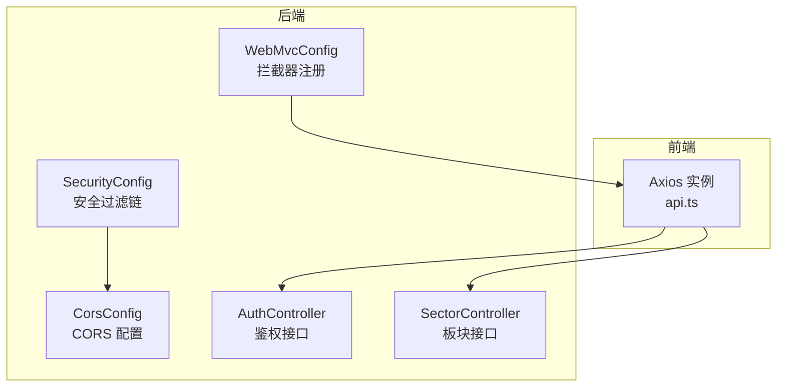
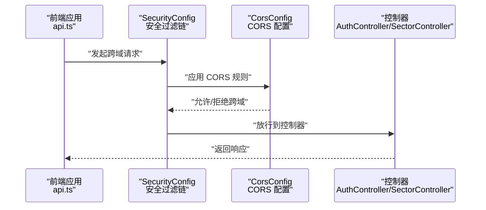
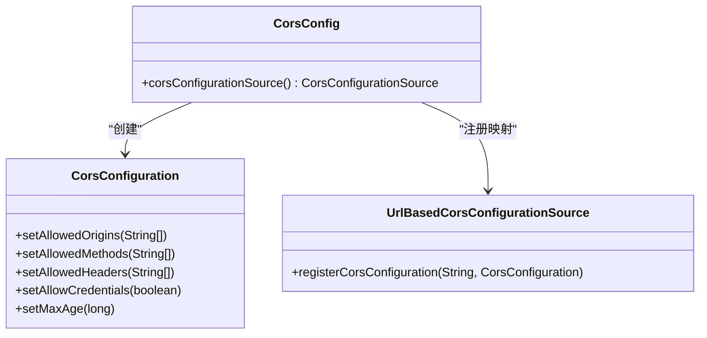
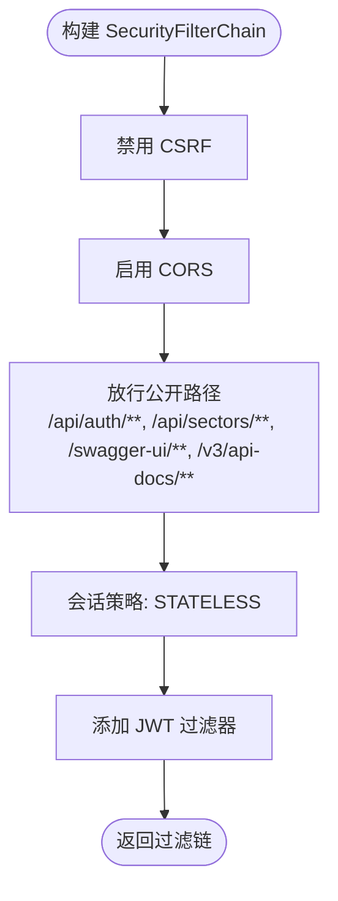
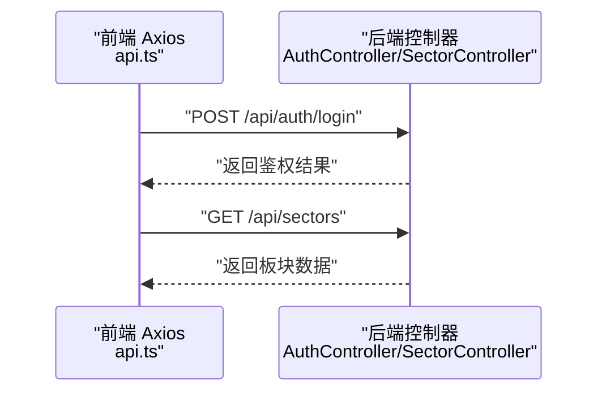
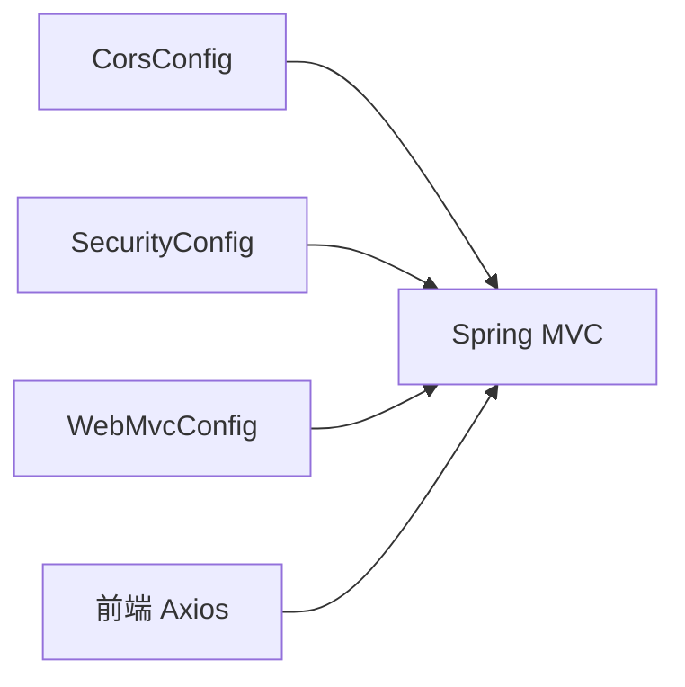

# CORS 配置与跨域安全

<cite>
**本文引用的文件**
- [CorsConfig.java](file://backend/src/main/java/com/freetrader/config/CorsConfig.java)
- [SecurityConfig.java](file://backend/src/main/java/com/freetrader/config/SecurityConfig.java)
- [application.yml](file://backend/src/main/resources/application.yml)
- [WebMvcConfig.java](file://backend/src/main/java/com/freetrader/config/WebMvcConfig.java)
- [api.ts](file://frontend/src/lib/api.ts)
- [AuthController.java](file://backend/src/main/java/com/freetrader/controller/AuthController.java)
- [SectorController.java](file://backend/src/main/java/com/freetrader/controller/SectorController.java)
- [SecurityConstants.java](file://backend/src/main/java/com/freetrader/util/SecurityConstants.java)
</cite>

## 目录
1. [引言](#引言)
2. [项目结构](#项目结构)
3. [核心组件](#核心组件)
4. [架构总览](#架构总览)
5. [详细组件分析](#详细组件分析)
6. [依赖关系分析](#依赖关系分析)
7. [性能考量](#性能考量)
8. [故障排查指南](#故障排查指南)
9. [结论](#结论)
10. [附录](#附录)

## 引言
本文件面向 FreeTrader 后端的 CORS（跨域资源共享）配置与跨域安全进行系统化说明。内容涵盖：
- CORS 的基本概念与安全意义（同源策略、跨域请求处理）
- CorsConfig 配置类的实现细节（允许源、方法、请求头、凭据与缓存）
- SecurityConfig 中 CORS 的集成方式与默认行为
- 不同环境（开发/测试/生产）下的配置策略
- 预检请求（OPTIONS）处理与缓存机制
- 凭据（Credentials）的安全处理与最佳实践
- 跨域安全最佳实践与常见问题排查

## 项目结构
FreeTrader 后端采用 Spring Boot 架构，CORS 配置位于配置层，与安全过滤链集成，并由前端通过 Axios 发起跨域请求。

图表来源
- [CorsConfig.java](file://backend/src/main/java/com/freetrader/config/CorsConfig.java#L12-L28)
- [SecurityConfig.java](file://backend/src/main/java/com/freetrader/config/SecurityConfig.java#L20-L46)
- [WebMvcConfig.java](file://backend/src/main/java/com/freetrader/config/WebMvcConfig.java#L13-L25)
- [api.ts](file://frontend/src/lib/api.ts#L3-L11)
- [AuthController.java](file://backend/src/main/java/com/freetrader/controller/AuthController.java#L20-L23)
- [SectorController.java](file://backend/src/main/java/com/freetrader/controller/SectorController.java#L22-L26)

章节来源
- [CorsConfig.java](file://backend/src/main/java/com/freetrader/config/CorsConfig.java#L1-L29)
- [SecurityConfig.java](file://backend/src/main/java/com/freetrader/config/SecurityConfig.java#L1-L61)
- [WebMvcConfig.java](file://backend/src/main/java/com/freetrader/config/WebMvcConfig.java#L1-L26)
- [api.ts](file://frontend/src/lib/api.ts#L1-L89)

## 核心组件
- CorsConfig：定义全局 CORS 规则，包括允许的源、方法、请求头、凭据与缓存时间。
- SecurityConfig：启用 CORS 并与 CSRF 关闭、会话策略、鉴权过滤器等安全配置组合。
- WebMvcConfig：注册拦截器（如限流），不影响 CORS，但影响请求生命周期。
- application.yml：提供环境变量与配置项，支撑 CORS 与安全策略在不同环境中的差异化。

章节来源
- [CorsConfig.java](file://backend/src/main/java/com/freetrader/config/CorsConfig.java#L12-L28)
- [SecurityConfig.java](file://backend/src/main/java/com/freetrader/config/SecurityConfig.java#L29-L46)
- [WebMvcConfig.java](file://backend/src/main/java/com/freetrader/config/WebMvcConfig.java#L13-L25)
- [application.yml](file://backend/src/main/resources/application.yml#L1-L102)

## 架构总览
下图展示 CORS 在 FreeTrader 中的集成路径：前端 Axios 请求经由 Spring Security 过滤链，CORS 配置生效，随后进入业务控制器。

图表来源
- [SecurityConfig.java](file://backend/src/main/java/com/freetrader/config/SecurityConfig.java#L30-L46)
- [CorsConfig.java](file://backend/src/main/java/com/freetrader/config/CorsConfig.java#L15-L27)
- [AuthController.java](file://backend/src/main/java/com/freetrader/controller/AuthController.java#L35-L39)
- [SectorController.java](file://backend/src/main/java/com/freetrader/controller/SectorController.java#L44-L48)

## 详细组件分析

### CORS 配置类（CorsConfig）
- 允许的源（Allowed Origins）：本地开发环境的两个常用地址，便于前端本地调试。
- 允许的方法（Allowed Methods）：标准 REST 方法与 OPTIONS，满足预检与实际请求。
- 允许的请求头（Allowed Headers）：包含认证头、内容类型与异步请求头，支持常见场景。
- 凭据（Allow Credentials）：开启，允许携带 Cookie 或 Authorization 头。
- 缓存时间（Max Age）：1 小时，减少重复预检请求次数。

图表来源
- [CorsConfig.java](file://backend/src/main/java/com/freetrader/config/CorsConfig.java#L15-L27)

章节来源
- [CorsConfig.java](file://backend/src/main/java/com/freetrader/config/CorsConfig.java#L12-L28)

### 安全配置与 CORS 集成（SecurityConfig）
- 启用 CORS：在 HttpSecurity 上通过 cors() lambda 启用，默认使用 WebMvcConfigurer 提供的 CorsConfigurationSource。
- 关闭 CSRF：出于无状态鉴权（JWT）场景，禁用 CSRF。
- 会话策略：STATELESS，避免服务端维护会话。
- 认证链路：添加 JWT 过滤器，按需放行公开接口（如鉴权与 Swagger）。

图表来源
- [SecurityConfig.java](file://backend/src/main/java/com/freetrader/config/SecurityConfig.java#L30-L46)

章节来源
- [SecurityConfig.java](file://backend/src/main/java/com/freetrader/config/SecurityConfig.java#L20-L61)

### 预检请求（OPTIONS）与缓存
- 预检请求：浏览器在复杂请求（非简单请求）前发送 OPTIONS，后端需允许该方法。
- 缓存机制：通过 Max-Age 控制预检结果缓存时长，降低重复预检开销。
- 当前配置：允许 OPTIONS 方法并设置较长缓存时间，适合开发阶段频繁调试。

章节来源
- [CorsConfig.java](file://backend/src/main/java/com/freetrader/config/CorsConfig.java#L18-L22)

### 凭据（Credentials）处理与安全
- 允许凭据：配置中开启 Allow Credentials，可携带 Cookie 或 Authorization 头。
- 安全注意事项：
  - 生产环境应明确允许源列表，避免通配符导致跨站脚本风险。
  - 对于需要凭据的跨域，Origin 必须精确匹配，不能使用通配符。
  - 结合 HTTPS 与安全的 Cookie 属性（SameSite、Secure、HttpOnly）提升整体安全。

章节来源
- [CorsConfig.java](file://backend/src/main/java/com/freetrader/config/CorsConfig.java#L20-L21)

### 前后端交互与跨域请求
- 前端 Axios：基础 URL 指向后端 8080 端口，统一添加 Content-Type 与 Authorization 头。
- 后端控制器：鉴权与板块接口均位于 /api 命名空间，符合 CORS 放行规则。

图表来源
- [api.ts](file://frontend/src/lib/api.ts#L3-L11)
- [AuthController.java](file://backend/src/main/java/com/freetrader/controller/AuthController.java#L35-L39)
- [SectorController.java](file://backend/src/main/java/com/freetrader/controller/SectorController.java#L44-L48)

章节来源
- [api.ts](file://frontend/src/lib/api.ts#L1-L89)
- [AuthController.java](file://backend/src/main/java/com/freetrader/controller/AuthController.java#L1-L72)
- [SectorController.java](file://backend/src/main/java/com/freetrader/controller/SectorController.java#L1-L63)

## 依赖关系分析
- CorsConfig 作为 Bean 提供 CORS 配置源，被 Spring MVC 自动发现并应用。
- SecurityConfig 通过 HttpSecurity 的 cors() 启用 CORS，无需额外注册 Bean。
- WebMvcConfig 注册拦截器，不影响 CORS，但会影响请求处理顺序。

图表来源
- [CorsConfig.java](file://backend/src/main/java/com/freetrader/config/CorsConfig.java#L15-L27)
- [SecurityConfig.java](file://backend/src/main/java/com/freetrader/config/SecurityConfig.java#L33-L34)
- [WebMvcConfig.java](file://backend/src/main/java/com/freetrader/config/WebMvcConfig.java#L19-L24)

章节来源
- [CorsConfig.java](file://backend/src/main/java/com/freetrader/config/CorsConfig.java#L1-L29)
- [SecurityConfig.java](file://backend/src/main/java/com/freetrader/config/SecurityConfig.java#L1-L61)
- [WebMvcConfig.java](file://backend/src/main/java/com/freetrader/config/WebMvcConfig.java#L1-L26)

## 性能考量
- 预检缓存：合理设置 Max-Age 可显著减少 OPTIONS 预检请求，提升性能。
- 方法与头部白名单：仅暴露必要方法与头部，避免宽泛匹配带来的额外校验成本。
- 凭据使用：开启凭据会增加安全校验与响应头处理开销，应谨慎使用并限制允许源。

## 故障排查指南
- 症状：浏览器报跨域错误
  - 检查允许源是否包含前端地址；开发环境可使用 localhost:3000，生产需精确域名。
  - 确认允许方法包含实际请求使用的 HTTP 方法（含 OPTIONS）。
  - 确认允许请求头包含 Authorization、Content-Type 等必要头部。
- 症状：携带凭据失败
  - 若 Origin 为通配符，浏览器不会发送凭据；需改为具体域名。
  - 确认 Allow Credentials 已开启且 Max-Age 设置合理。
- 症状：预检频繁触发
  - 检查客户端是否频繁变更请求头或方法，适当调整 Allowed Headers 与 Allowed Methods。
  - 提升 Max-Age，减少预检频率。
- 症状：鉴权头未生效
  - 确认前端 Axios 是否正确设置 Authorization 头（Bearer Token）。
  - 确认后端控制器与安全过滤链对 /api/auth/** 的放行配置。

章节来源
- [CorsConfig.java](file://backend/src/main/java/com/freetrader/config/CorsConfig.java#L18-L22)
- [api.ts](file://frontend/src/lib/api.ts#L14-L23)
- [SecurityConstants.java](file://backend/src/main/java/com/freetrader/util/SecurityConstants.java#L24-L25)

## 结论
FreeTrader 的 CORS 配置在开发环境下提供了便捷的本地联调能力，同时通过 SecurityConfig 的集成实现了与安全体系的协同。生产环境中应收紧允许源、避免通配符、结合 HTTPS 与 Cookie 安全属性，确保跨域访问既高效又安全。

## 附录

### 不同环境下的 CORS 策略建议
- 开发环境（dev）
  - 允许源：本地开发地址（如 localhost:3000）
  - 方法与头部：保持宽松，便于调试
  - 凭据：可开启，便于本地调试
- 测试环境（test）
  - 允许源：测试域名或 IP
  - 方法与头部：与开发一致，但逐步收敛
  - 凭据：按需开启
- 生产环境（prod）
  - 允许源：仅生产域名，禁止通配符
  - 方法与头部：最小化暴露
  - 凭据：严格控制，配合 HTTPS 与安全 Cookie 属性

### 跨域安全最佳实践
- 最小权限原则：仅开放必要的源、方法与头部
- 域名白名单：生产环境禁止通配符，精确列出可信域名
- 安全头设置：结合 HTTPS、Strict-Transport-Security、Content-Security-Policy
- 凭据安全：Origin 精确匹配，避免通配符；Cookie 使用 Secure、SameSite、HttpOnly
- 预检缓存：合理设置 Max-Age，平衡性能与灵活性