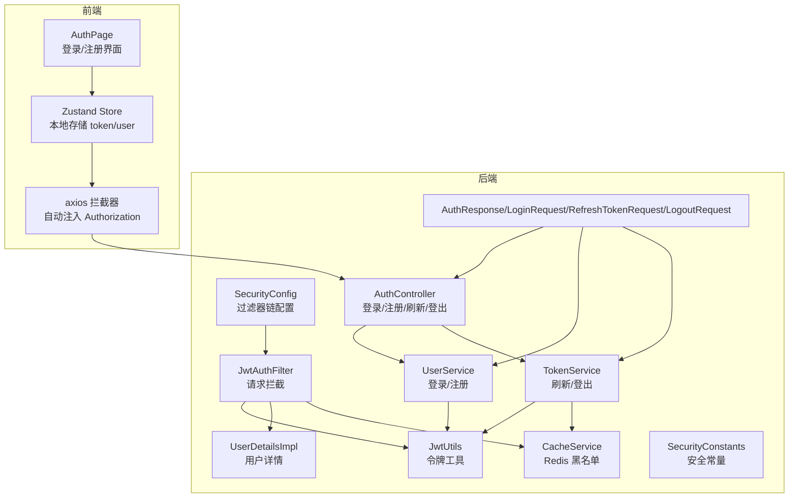
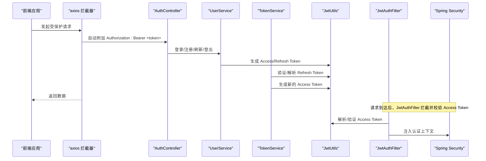
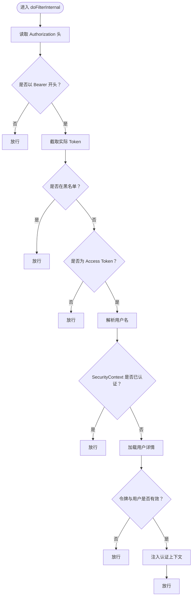
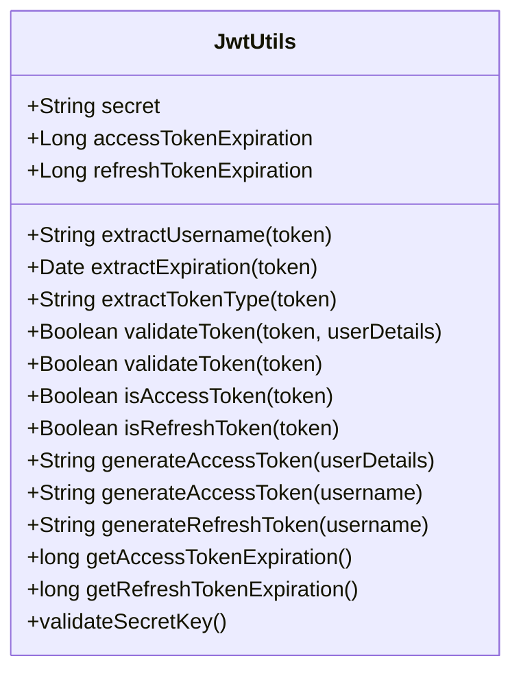
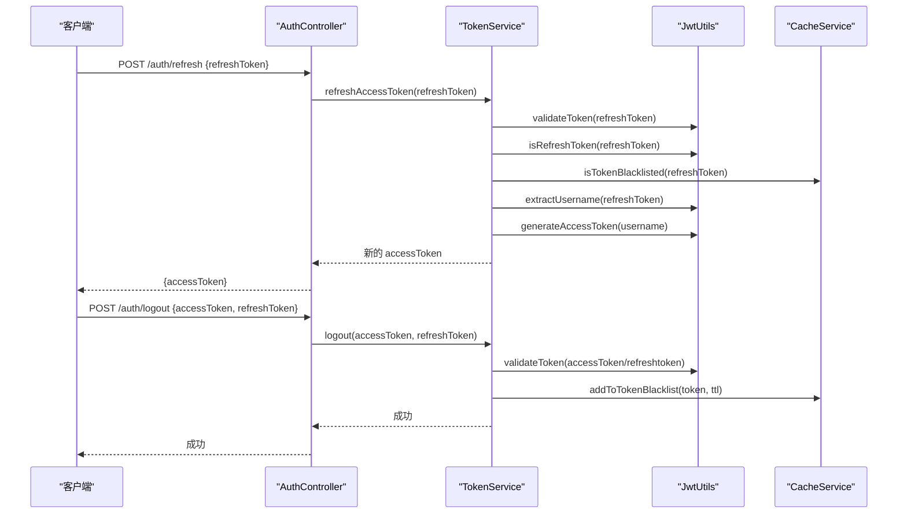
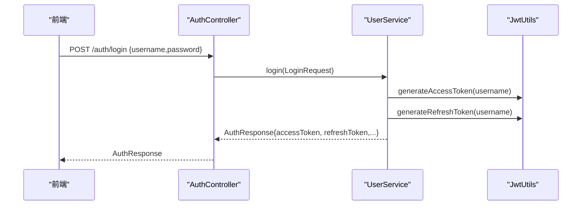
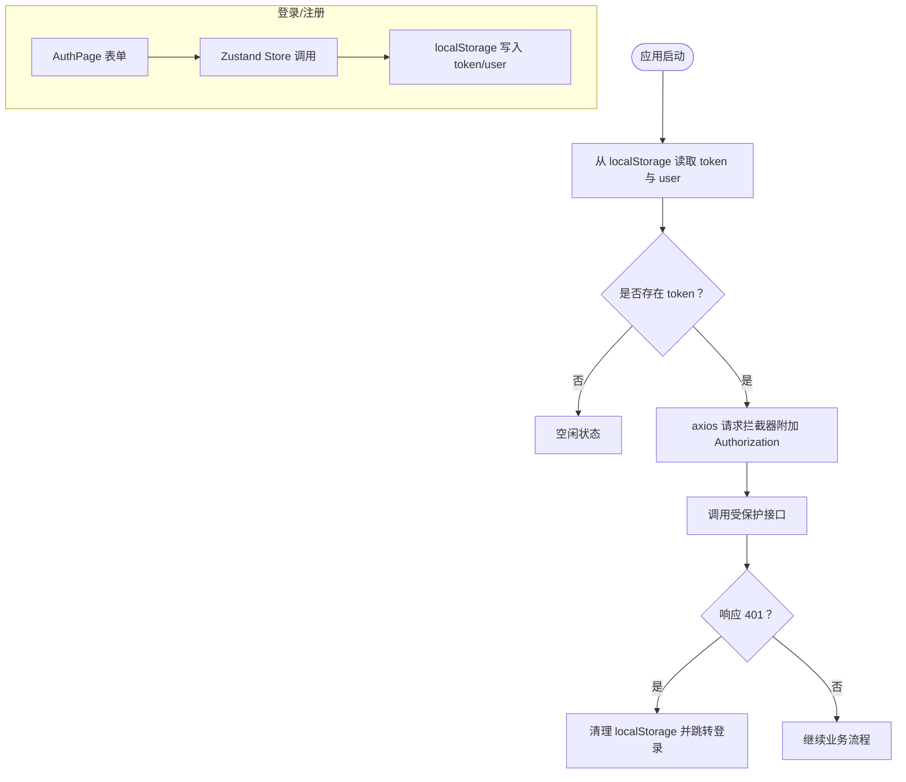
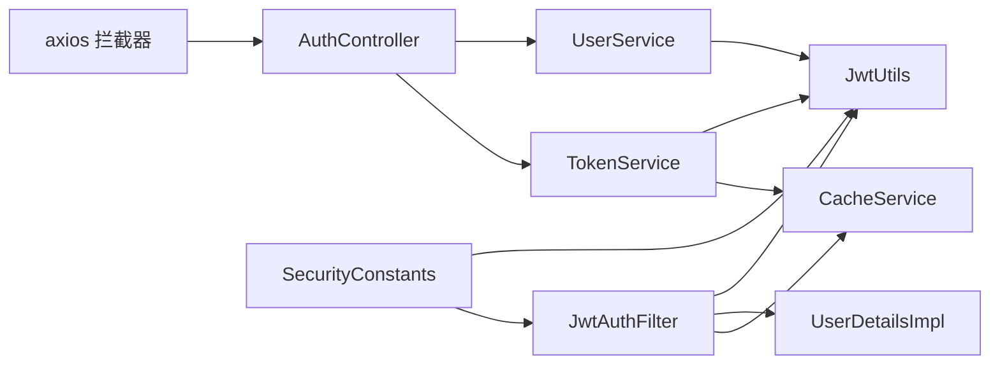

# JWT 认证机制

<cite>
**本文引用的文件**
- [JwtAuthFilter.java](file://backend/src/main/java/com/freetrader/security/JwtAuthFilter.java)
- [JwtUtils.java](file://backend/src/main/java/com/freetrader/security/JwtUtils.java)
- [UserDetailsImpl.java](file://backend/src/main/java/com/freetrader/security/UserDetailsImpl.java)
- [SecurityConstants.java](file://backend/src/main/java/com/freetrader/util/SecurityConstants.java)
- [TokenService.java](file://backend/src/main/java/com/freetrader/service/TokenService.java)
- [SecurityConfig.java](file://backend/src/main/java/com/freetrader/config/SecurityConfig.java)
- [AuthController.java](file://backend/src/main/java/com/freetrader/controller/AuthController.java)
- [UserService.java](file://backend/src/main/java/com/freetrader/service/UserService.java)
- [CacheService.java](file://backend/src/main/java/com/freetrader/service/CacheService.java)
- [application.yml](file://backend/src/main/resources/application.yml)
- [api.ts](file://frontend/src/lib/api.ts)
- [useStore.ts](file://frontend/src/store/useStore.ts)
- [AuthPage.tsx](file://frontend/src/components/AuthPage.tsx)
- [AuthResponse.java](file://backend/src/main/java/com/freetrader/dto/AuthResponse.java)
- [LoginRequest.java](file://backend/src/main/java/com/freetrader/dto/LoginRequest.java)
- [RefreshTokenRequest.java](file://backend/src/main/java/com/freetrader/dto/RefreshTokenRequest.java)
- [LogoutRequest.java](file://backend/src/main/java/com/freetrader/dto/LogoutRequest.java)
- [JwtUtilsTest.java](file://backend/src/test/java/com/freetrader/security/JwtUtilsTest.java)
</cite>

## 更新摘要
**所做更改**
- 新增 SecurityConstants 安全常量类，统一管理 JWT 相关常量
- 增强 JwtUtils 工具类，支持更严格的密钥验证和改进的令牌验证逻辑
- 新增 TokenService 的登出功能和令牌刷新管理
- 更新 AuthController 支持登出接口和刷新令牌管理
- 改进黑名单管理机制，通过 CacheService 实现令牌失效控制
- **新增** 强化的密钥验证机制：在应用启动时强制验证JWT密钥长度，抛出明确异常而非静默填充弱密钥

## 目录
1. [简介](#简介)
2. [项目结构](#项目结构)
3. [核心组件](#核心组件)
4. [架构总览](#架构总览)
5. [详细组件分析](#详细组件分析)
6. [依赖关系分析](#依赖关系分析)
7. [性能与安全考量](#性能与安全考量)
8. [故障排查指南](#故障排查指南)
9. [结论](#结论)
10. [附录](#附录)

## 简介
本文件系统性阐述 FreeTrader 后端的 JWT 认证机制，覆盖令牌生成、验证与刷新的完整流程；解释 JwtAuthFilter 过滤器如何拦截请求并完成身份校验；详解 JwtUtils 工具类的令牌操作方法；梳理从登录到令牌验证的端到端流程；说明令牌在请求头中的传递方式与客户端处理策略；给出令牌刷新的最佳实践与常见问题排查方法。

**更新** 新增了 SecurityConstants 安全常量类，增强了 JwtUtils 的密钥验证机制，完善了 TokenService 的登出和刷新功能。**新增** 强化的密钥验证机制：在应用启动时强制验证JWT密钥长度，确保生产环境使用足够强度的密钥。

## 项目结构
后端采用 Spring Security + Spring MVC 架构，认证相关代码集中在 security、service、controller、dto、util 等包中，并通过配置类注入过滤器链。前端使用 axios 拦截器统一注入 Authorization 头，Zustand 状态管理持久化令牌与用户信息。

**图表来源**
- [SecurityConfig.java](file://backend/src/main/java/com/freetrader/config/SecurityConfig.java#L29-L46)
- [JwtAuthFilter.java](file://backend/src/main/java/com/freetrader/security/JwtAuthFilter.java#L31-L82)
- [JwtUtils.java](file://backend/src/main/java/com/freetrader/security/JwtUtils.java#L100-L133)
- [UserService.java](file://backend/src/main/java/com/freetrader/service/UserService.java#L73-L96)
- [TokenService.java](file://backend/src/main/java/com/freetrader/service/TokenService.java#L18-L39)
- [CacheService.java](file://backend/src/main/java/com/freetrader/service/CacheService.java#L89-L101)
- [AuthController.java](file://backend/src/main/java/com/freetrader/controller/AuthController.java#L35-L70)
- [SecurityConstants.java](file://backend/src/main/java/com/freetrader/util/SecurityConstants.java#L18-L41)
- [api.ts](file://frontend/src/lib/api.ts#L13-L37)
- [useStore.ts](file://frontend/src/store/useStore.ts#L69-L103)

**章节来源**
- [SecurityConfig.java](file://backend/src/main/java/com/freetrader/config/SecurityConfig.java#L29-L46)
- [application.yml](file://backend/src/main/resources/application.yml#L60-L66)

## 核心组件
- **JwtAuthFilter**：基于 OncePerRequestFilter 的请求拦截器，负责从请求头提取 Bearer 令牌、校验类型与黑名单、解析用户名并注入 Spring Security 上下文。
- **JwtUtils**：提供令牌生成、解析、验证、类型判断与过期时间查询等能力，基于 HMAC 密钥与过期时间配置，**新增** 启动时强制密钥长度验证（至少32字节）。
- **SecurityConstants**：新增安全常量类，集中定义令牌前缀、请求头名、令牌类型声明键及类型枚举。
- **TokenService**：封装刷新令牌与登出逻辑，执行令牌有效性校验、类型校验、黑名单校验，并将失效令牌加入黑名单。
- **UserService**：实现 UserDetailsService，负责用户认证与登录/注册时签发 Access/Refresh 令牌。
- **CacheService**：基于 Redis 的缓存服务，提供令牌黑名单的写入与查询。
- **AuthController**：对外暴露登录、注册、刷新、登出接口。
- **前端 axios 拦截器**：统一在请求头注入 Authorization: Bearer token；响应 401 时清理本地 token 并跳转登录页。

**章节来源**
- [JwtAuthFilter.java](file://backend/src/main/java/com/freetrader/security/JwtAuthFilter.java#L31-L82)
- [JwtUtils.java](file://backend/src/main/java/com/freetrader/security/JwtUtils.java#L100-L194)
- [SecurityConstants.java](file://backend/src/main/java/com/freetrader/util/SecurityConstants.java#L18-L41)
- [TokenService.java](file://backend/src/main/java/com/freetrader/service/TokenService.java#L18-L62)
- [UserService.java](file://backend/src/main/java/com/freetrader/service/UserService.java#L31-L96)
- [CacheService.java](file://backend/src/main/java/com/freetrader/service/CacheService.java#L89-L101)
- [AuthController.java](file://backend/src/main/java/com/freetrader/controller/AuthController.java#L35-L70)
- [api.ts](file://frontend/src/lib/api.ts#L13-L37)

## 架构总览
下图展示从客户端发起请求到后端完成鉴权的整体流程，以及各组件之间的交互关系。

**图表来源**
- [AuthController.java](file://backend/src/main/java/com/freetrader/controller/AuthController.java#L35-L70)
- [UserService.java](file://backend/src/main/java/com/freetrader/service/UserService.java#L73-L96)
- [TokenService.java](file://backend/src/main/java/com/freetrader/service/TokenService.java#L18-L39)
- [JwtUtils.java](file://backend/src/main/java/com/freetrader/security/JwtUtils.java#L100-L141)
- [JwtAuthFilter.java](file://backend/src/main/java/com/freetrader/security/JwtAuthFilter.java#L31-L82)

## 详细组件分析

### SecurityConstants 安全常量类
**新增** SecurityConstants 类提供了统一的安全常量管理，包括：

- **匿名用户标识**：`ANONYMOUS_USER = "anonymousUser"`
- **JWT Token 前缀**：`TOKEN_PREFIX = "Bearer "`
- **Authorization 请求头名称**：`AUTHORIZATION_HEADER = "Authorization"`
- **Token 类型声明字段名**：`TOKEN_TYPE_CLAIM = "type"`
- **Access Token 类型标识**：`ACCESS_TOKEN_TYPE = "access"`
- **Refresh Token 类型标识**：`REFRESH_TOKEN_TYPE = "refresh"`

这些常量在整个认证流程中被广泛使用，确保了常量定义的一致性和可维护性。

**章节来源**
- [SecurityConstants.java](file://backend/src/main/java/com/freetrader/util/SecurityConstants.java#L18-L41)

### JwtAuthFilter 过滤器
- **请求拦截**：从 Authorization 头提取 Bearer 令牌，若无或前缀不符则放行。
- **黑名单检查**：调用 CacheService 检查令牌是否在黑名单，是则放行（允许匿名访问，便于登出后的请求处理）。
- **类型校验**：使用 JwtUtils.isAccessToken 判断是否为 Access Token，非 Access 则放行。
- **用户解析与注入**：从 Access Token 提取用户名，若 SecurityContext 未认证且用户存在，则构建 UsernamePasswordAuthenticationToken 并注入。
- **异常处理**：捕获异常并记录日志，不影响后续过滤器链。

**图表来源**
- [JwtAuthFilter.java](file://backend/src/main/java/com/freetrader/security/JwtAuthFilter.java#L31-L82)
- [JwtUtils.java](file://backend/src/main/java/com/freetrader/security/JwtUtils.java#L138-L141)
- [CacheService.java](file://backend/src/main/java/com/freetrader/service/CacheService.java#L98-L101)

**章节来源**
- [JwtAuthFilter.java](file://backend/src/main/java/com/freetrader/security/JwtAuthFilter.java#L31-L82)

### JwtUtils 工具类
**更新** JwtUtils 工具类进行了重大增强：

- **密钥与过期时间**：从配置读取 secret、access-token-expiration、refresh-token-expiration，**新增** 启动时强制密钥长度验证。
- **增强的密钥验证**：新增 `validateSecretKey()` 方法，在启动时强制验证密钥长度至少为 32 字节，**这是本次更新的核心安全增强**。
- **令牌生成**：
  - Access Token：携带类型声明为 access，使用 accessTokenExpiration。
  - Refresh Token：携带类型声明为 refresh，使用 refreshTokenExpiration。
- **令牌解析与验证**：
  - extractUsername/extractExpiration/extractTokenType：解析声明。
  - validateToken(token, userDetails)：用户名匹配且未过期。
  - validateToken(token)：仅验证格式与过期。
  - isAccessToken/isRefreshToken：根据声明类型判断。
- **过期时间查询**：分别提供获取 Access/Refresh 令牌过期时间的方法。

**图表来源**
- [JwtUtils.java](file://backend/src/main/java/com/freetrader/security/JwtUtils.java#L25-L205)

**章节来源**
- [JwtUtils.java](file://backend/src/main/java/com/freetrader/security/JwtUtils.java#L25-L205)
- [application.yml](file://backend/src/main/resources/application.yml#L60-L66)

### TokenService 刷新与登出
**更新** TokenService 增强了功能：

- **刷新 Access Token**：
  - 校验 Refresh Token 有效性与类型。
  - 检查是否在黑名单。
  - 从 Refresh Token 提取用户名并生成新的 Access Token。
- **登出功能**：
  - 若 Access/Refresh Token 有效，按各自过期时间写入黑名单。
  - 支持同时处理多个令牌。
- **令牌有效性检查**：综合 JwtUtils 验证与黑名单检查。

**图表来源**
- [AuthController.java](file://backend/src/main/java/com/freetrader/controller/AuthController.java#L58-L70)
- [TokenService.java](file://backend/src/main/java/com/freetrader/service/TokenService.java#L18-L55)
- [JwtUtils.java](file://backend/src/main/java/com/freetrader/security/JwtUtils.java#L138-L141)
- [CacheService.java](file://backend/src/main/java/com/freetrader/service/CacheService.java#L89-L101)

**章节来源**
- [TokenService.java](file://backend/src/main/java/com/freetrader/service/TokenService.java#L18-L62)
- [AuthController.java](file://backend/src/main/java/com/freetrader/controller/AuthController.java#L58-L70)

### 用户认证与登录/注册
- **UserService 实现 UserDetailsService**，按用户名查询用户并构建 UserDetailsImpl。
- **登录/注册成功后**，使用 JwtUtils 生成 Access Token 与 Refresh Token，并封装到 AuthResponse 返回给客户端。

**图表来源**
- [AuthController.java](file://backend/src/main/java/com/freetrader/controller/AuthController.java#L35-L39)
- [UserService.java](file://backend/src/main/java/com/freetrader/service/UserService.java#L73-L96)
- [JwtUtils.java](file://backend/src/main/java/com/freetrader/security/JwtUtils.java#L100-L120)
- [AuthResponse.java](file://backend/src/main/java/com/freetrader/dto/AuthResponse.java#L13-L18)

**章节来源**
- [UserService.java](file://backend/src/main/java/com/freetrader/service/UserService.java#L73-L96)
- [AuthController.java](file://backend/src/main/java/com/freetrader/controller/AuthController.java#L35-L39)
- [AuthResponse.java](file://backend/src/main/java/com/freetrader/dto/AuthResponse.java#L13-L18)

### 客户端令牌传递与处理
- **axios 请求拦截器**：从 localStorage 读取 token，若存在则在请求头添加 Authorization: Bearer token。
- **axios 响应拦截器**：捕获 401 错误，清理本地 token 与用户信息，并跳转至登录页。
- **Zustand Store**：登录/注册成功后持久化 token 与用户信息；初始化时尝试恢复本地 token 与用户状态。
- **登录/注册界面**：收集用户名、密码等输入，调用 store 的 login/register 方法。

**图表来源**
- [api.ts](file://frontend/src/lib/api.ts#L13-L37)
- [useStore.ts](file://frontend/src/store/useStore.ts#L69-L103)
- [AuthPage.tsx](file://frontend/src/components/AuthPage.tsx#L38-L70)

**章节来源**
- [api.ts](file://frontend/src/lib/api.ts#L13-L37)
- [useStore.ts](file://frontend/src/store/useStore.ts#L69-L103)
- [AuthPage.tsx](file://frontend/src/components/AuthPage.tsx#L38-L70)

## 依赖关系分析
**更新** 依赖关系得到完善：

- **JwtAuthFilter** 依赖 JwtUtils、UserDetailsService、CacheService。
- **JwtUtils** 依赖 SecurityConstants、配置项（secret、过期时间），**新增** 启动时密钥验证。
- **TokenService** 依赖 JwtUtils、CacheService。
- **UserService** 依赖 JwtUtils、UserMapper、PasswordEncoder。
- **AuthController** 依赖 UserService、TokenService。
- **前端 axios** 依赖后端 AuthController 接口。

**图表来源**
- [JwtAuthFilter.java](file://backend/src/main/java/com/freetrader/security/JwtAuthFilter.java#L27-L29)
- [JwtUtils.java](file://backend/src/main/java/com/freetrader/security/JwtUtils.java#L25-L32)
- [TokenService.java](file://backend/src/main/java/com/freetrader/service/TokenService.java#L15-L16)
- [UserService.java](file://backend/src/main/java/com/freetrader/service/UserService.java#L27-L29)
- [AuthController.java](file://backend/src/main/java/com/freetrader/controller/AuthController.java#L25-L26)
- [api.ts](file://frontend/src/lib/api.ts#L13-L23)
- [SecurityConstants.java](file://backend/src/main/java/com/freetrader/util/SecurityConstants.java#L18-L41)

**章节来源**
- [JwtAuthFilter.java](file://backend/src/main/java/com/freetrader/security/JwtAuthFilter.java#L27-L29)
- [JwtUtils.java](file://backend/src/main/java/com/freetrader/security/JwtUtils.java#L25-L32)
- [TokenService.java](file://backend/src/main/java/com/freetrader/service/TokenService.java#L15-L16)
- [UserService.java](file://backend/src/main/java/com/freetrader/service/UserService.java#L27-L29)
- [AuthController.java](file://backend/src/main/java/com/freetrader/controller/AuthController.java#L25-L26)
- [api.ts](file://frontend/src/lib/api.ts#L13-L23)
- [SecurityConstants.java](file://backend/src/main/java/com/freetrader/util/SecurityConstants.java#L18-L41)

## 性能与安全考量
**更新** 性能与安全考量得到加强：

- **令牌类型区分**：Access Token 用于受保护资源访问，Refresh Token 仅用于换取新 Access Token，避免在常规请求中误用。
- **黑名单机制**：登出与刷新时将旧令牌写入 Redis 黑名单，结合过期时间实现短期失效控制。
- **过期时间配置**：Access Token 过期时间较短（1小时），Refresh Token 较长（7天），降低泄露风险。
- **密钥安全**：**新增** 生产环境必须使用足够强度的密钥（至少32字节）并通过环境变量注入，**应用启动时强制验证**，确保密钥强度符合安全要求。
- **过滤器链**：启用无状态会话策略，减少服务器端会话开销。
- **异常处理**：改进的异常处理机制，提供更好的错误诊断信息。

**章节来源**
- [application.yml](file://backend/src/main/resources/application.yml#L60-L66)
- [JwtUtils.java](file://backend/src/main/java/com/freetrader/security/JwtUtils.java#L25-L32)
- [TokenService.java](file://backend/src/main/java/com/freetrader/service/TokenService.java#L41-L55)
- [CacheService.java](file://backend/src/main/java/com/freetrader/service/CacheService.java#L89-L101)

## 故障排查指南
**更新** 故障排查指南得到完善：

- **401 未授权**：
  - 检查前端是否正确在 Authorization 头添加 Bearer 前缀。
  - 检查后端 JwtAuthFilter 是否拦截到有效 Access Token。
  - 检查 Token 是否在黑名单（登出/刷新后会写入）。
- **刷新失败**：
  - 确认传入的是 Refresh Token 且未过期。
  - 确认 Refresh Token 未被加入黑名单。
  - 检查后端日志中的错误提示。
- **登录/注册后无法访问受保护资源**：
  - 确认返回的 Access Token 与 Refresh Token 正确保存在前端。
  - 检查 axios 拦截器是否生效。
- **密钥验证失败**：
  - **新增** 检查 JWT_SECRET 环境变量是否设置且长度至少为32字节。
  - **新增** 确认应用启动时没有抛出密钥长度验证异常："JWT secret key must be at least 32 bytes"。
  - **新增** 如遇启动失败，检查 application.yml 中的 jwt.secret 配置。
- **登出功能异常**：
  - 检查 LogoutRequest 中的令牌参数是否正确传递。
  - 确认 CacheService 能够正确写入和查询黑名单。
- **单元测试参考**：
  - 可参考 JwtUtilsTest 对令牌生成、解析、验证、类型判断与过期时间的断言用例。

**章节来源**
- [api.ts](file://frontend/src/lib/api.ts#L13-L37)
- [JwtAuthFilter.java](file://backend/src/main/java/com/freetrader/security/JwtAuthFilter.java#L49-L79)
- [TokenService.java](file://backend/src/main/java/com/freetrader/service/TokenService.java#L18-L39)
- [JwtUtilsTest.java](file://backend/src/test/java/com/freetrader/security/JwtUtilsTest.java#L44-L91)

## 结论
FreeTrader 的 JWT 认证体系通过 JwtAuthFilter、JwtUtils、TokenService、UserService 与 CacheService 的协同，实现了"短效 Access Token + 长效 Refresh Token"的双令牌模型，并结合黑名单机制提升安全性。新增的 SecurityConstants 统一了安全常量管理，**增强的 JwtUtils 提供了更强的密钥验证机制**，完善的 TokenService 支持了完整的登出和刷新功能。前端通过 axios 拦截器与 Zustand 状态管理，保证了令牌传递与用户体验的一致性。**新增的启动时密钥验证机制确保了生产环境的安全性**，建议在生产环境严格配置密钥与过期时间，并对关键接口进行限流与监控。

## 附录
**更新** 附录内容得到扩展：

- **令牌结构要点**
  - 声明字段：包含类型声明（access 或 refresh）、主题（用户名）、签发时间、过期时间等。
  - 类型校验：通过声明字段区分 Access/Refresh Token，仅 Access Token 允许访问受保护资源。
  - 密钥要求：**新增** 必须使用至少32字节的强密钥，建议通过环境变量配置，**应用启动时强制验证**。
- **请求头传递**
  - 格式：Authorization: Bearer <token>
  - 前端自动注入，后端通过 SecurityConstants.AUTHORIZATION_HEADER 与 TOKEN_PREFIX 识别。
- **刷新与登出**
  - 刷新：POST /auth/refresh，传入 Refresh Token，返回新的 Access Token。
  - 登出：POST /auth/logout，传入 Access/Refresh Token，服务端将其加入黑名单。
- **安全常量**
  - 统一管理所有 JWT 相关常量，包括前缀、头部名、类型声明等。
  - 确保前后端常量定义的一致性。
- **黑名单管理**
  - 通过 Redis 实现高效的令牌黑名单存储。
  - 支持按令牌过期时间自动清理。
  - 提供批量删除和扫描功能，避免阻塞 Redis。
- **密钥验证机制**
  - **新增** 启动时强制验证密钥长度（@PostConstruct）
  - **新增** 最小密钥长度：32字节
  - **新增** 明确的异常消息：包含当前长度和所需长度信息
  - **新增** 生产环境密钥配置建议

**章节来源**
- [SecurityConstants.java](file://backend/src/main/java/com/freetrader/util/SecurityConstants.java#L18-L41)
- [AuthController.java](file://backend/src/main/java/com/freetrader/controller/AuthController.java#L58-L70)
- [TokenService.java](file://backend/src/main/java/com/freetrader/service/TokenService.java#L18-L55)
- [CacheService.java](file://backend/src/main/java/com/freetrader/service/CacheService.java#L89-L101)
- [JwtUtils.java](file://backend/src/main/java/com/freetrader/security/JwtUtils.java#L42-L51)