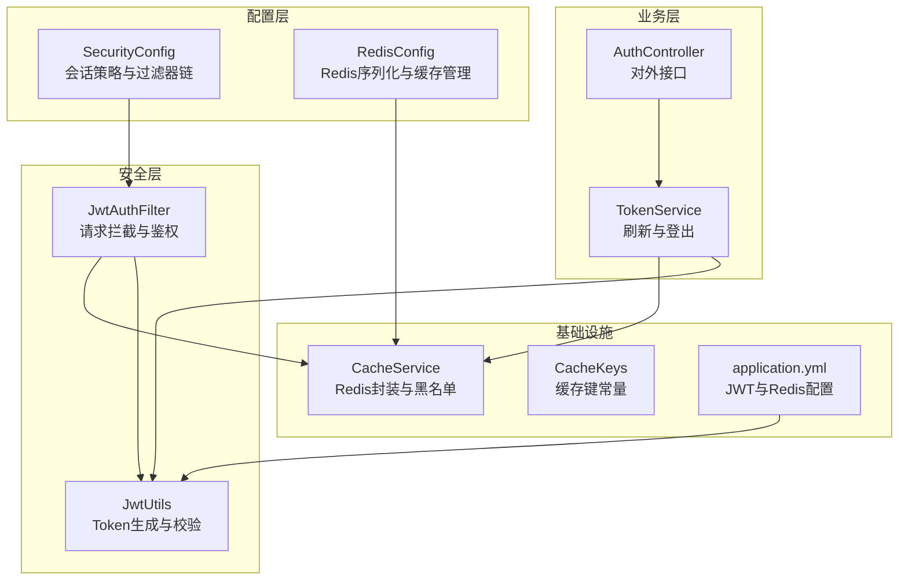
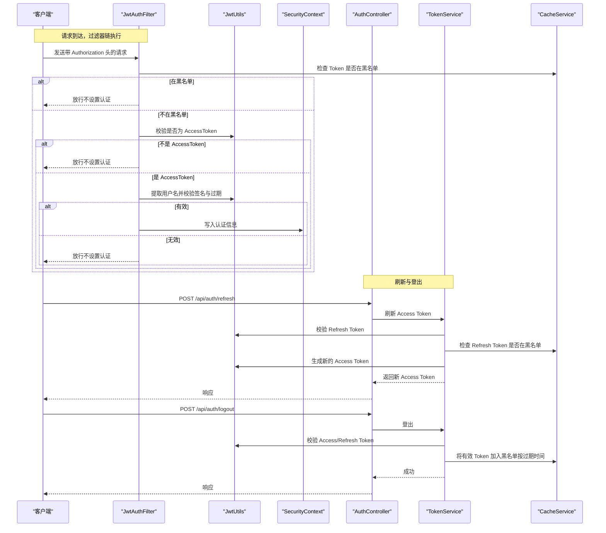
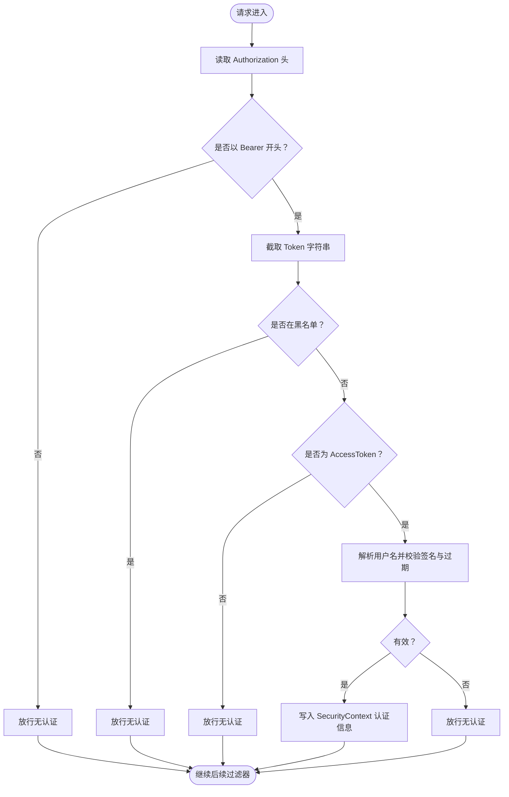
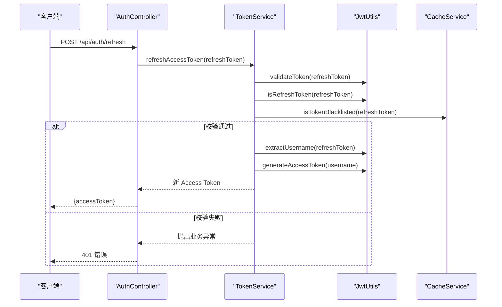
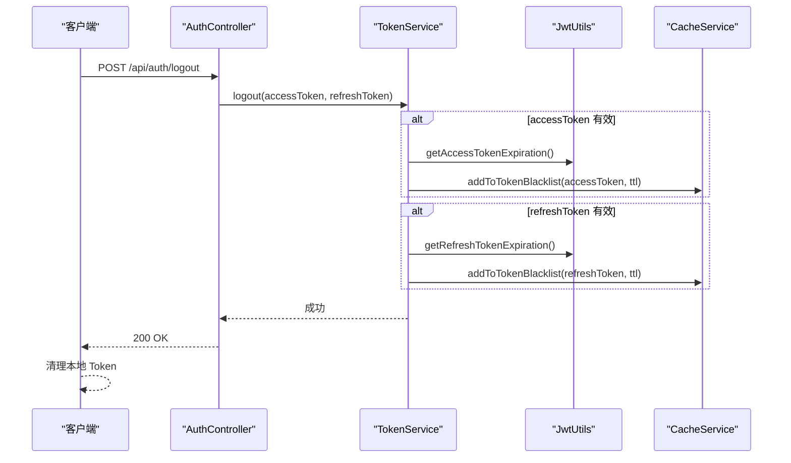
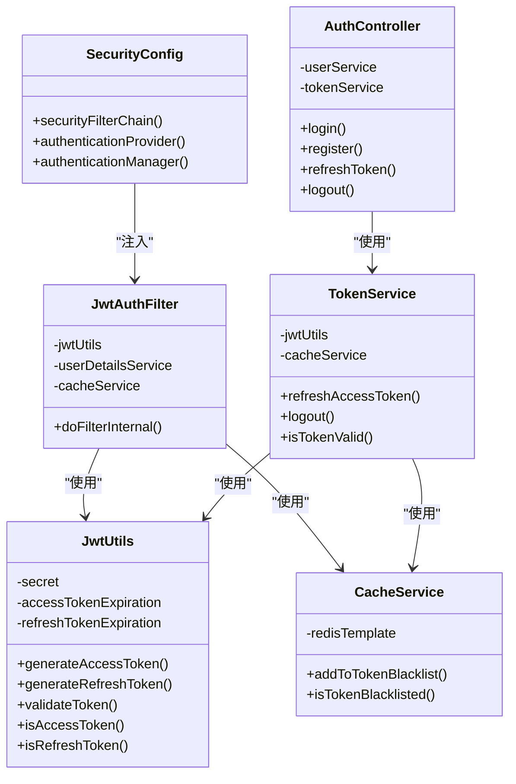

# Token 管理与会话控制

<cite>
**本文引用的文件**
- [SecurityConfig.java](file://backend/src/main/java/com/freetrader/config/SecurityConfig.java)
- [JwtAuthFilter.java](file://backend/src/main/java/com/freetrader/security/JwtAuthFilter.java)
- [JwtUtils.java](file://backend/src/main/java/com/freetrader/security/JwtUtils.java)
- [TokenService.java](file://backend/src/main/java/com/freetrader/service/TokenService.java)
- [AuthController.java](file://backend/src/main/java/com/freetrader/controller/AuthController.java)
- [SecurityConstants.java](file://backend/src/main/java/com/freetrader/util/SecurityConstants.java)
- [CacheService.java](file://backend/src/main/java/com/freetrader/service/CacheService.java)
- [CacheKeys.java](file://backend/src/main/java/com/freetrader/util/CacheKeys.java)
- [RedisConfig.java](file://backend/src/main/java/com/freetrader/config/RedisConfig.java)
- [application.yml](file://backend/src/main/resources/application.yml)
- [JwtUtilsTest.java](file://backend/src/test/java/com/freetrader/security/JwtUtilsTest.java)
- [TokenServiceTest.java](file://backend/src/test/java/com/freetrader/service/TokenServiceTest.java)
</cite>

## 更新摘要
**变更内容**
- 新增 TokenService 令牌服务类，提供完整的令牌刷新和登出功能
- 完善 CacheService 中令牌黑名单的 Redis 实现，支持高效的黑名单管理
- 在 JwtAuthFilter 中集成令牌黑名单检查机制，增强请求过滤安全性
- 建立完整的令牌生命周期管理体系，涵盖生成、验证、刷新、登出和失效处理
- 优化分布式环境下的令牌一致性保障机制

## 目录
1. [简介](#简介)
2. [项目结构](#项目结构)
3. [核心组件](#核心组件)
4. [架构总览](#架构总览)
5. [组件详解](#组件详解)
6. [依赖关系分析](#依赖关系分析)
7. [性能考量](#性能考量)
8. [故障排查指南](#故障排查指南)
9. [结论](#结论)
10. [附录](#附录)

## 简介
本文件面向 FreeTrader 项目的 Token 管理与会话控制，系统性阐述以下主题：
- Token 生命周期管理：生成、存储、验证与失效处理
- 刷新机制：refresh token 的生成、验证与轮换策略
- 登出流程：客户端 Token 清除与服务器端 Token 失效
- 无状态会话：SessionCreationPolicy.STATELESS 的配置与影响
- 分布式一致性：多实例部署下的 Token 一致性保障
- 安全性：泄露防护、过期时间、重放攻击防范
- 最佳实践与常见问题解决

## 项目结构
后端采用 Spring Security + JWT + Redis 的无状态认证方案。核心文件分布如下：
- 配置层：SecurityConfig（过滤器链与会话策略）、RedisConfig（Redis 序列化与缓存）
- 安全层：JwtAuthFilter（请求拦截与鉴权）、JwtUtils（Token 生成与校验）
- 业务层：TokenService（刷新与登出）、AuthController（对外接口）
- 基础设施：CacheService（Redis封装与黑名单）、CacheKeys（缓存键常量）
- 常量与配置：SecurityConstants（安全常量）、application.yml（JWT 与 Redis 配置）

**图表来源**
- [SecurityConfig.java](file://backend/src/main/java/com/freetrader/config/SecurityConfig.java#L29-L46)
- [JwtAuthFilter.java](file://backend/src/main/java/com/freetrader/security/JwtAuthFilter.java#L31-L82)
- [JwtUtils.java](file://backend/src/main/java/com/freetrader/security/JwtUtils.java#L100-L133)
- [TokenService.java](file://backend/src/main/java/com/freetrader/service/TokenService.java#L18-L55)
- [AuthController.java](file://backend/src/main/java/com/freetrader/controller/AuthController.java#L58-L70)
- [CacheService.java](file://backend/src/main/java/com/freetrader/service/CacheService.java#L89-L101)
- [CacheKeys.java](file://backend/src/main/java/com/freetrader/util/CacheKeys.java#L30-L46)
- [RedisConfig.java](file://backend/src/main/java/com/freetrader/config/RedisConfig.java#L25-L45)
- [application.yml](file://backend/src/main/resources/application.yml#L60-L66)

**章节来源**
- [SecurityConfig.java](file://backend/src/main/java/com/freetrader/config/SecurityConfig.java#L29-L46)
- [RedisConfig.java](file://backend/src/main/java/com/freetrader/config/RedisConfig.java#L25-L45)
- [application.yml](file://backend/src/main/resources/application.yml#L60-L66)

## 核心组件
- **SecurityConfig**：禁用 CSRF，开放部分路径，启用无状态会话（STATELESS），注入自定义 JwtAuthFilter 并添加到过滤链。
- **JwtAuthFilter**：从 Authorization 头读取 Bearer Token，检查黑名单，区分 AccessToken 与 RefreshToken，调用 JwtUtils 解析与校验，并将认证信息写入 SecurityContext。
- **JwtUtils**：基于 HMAC 密钥生成 Access/Refresh Token，携带 type 声明；提供提取用户名、过期时间、类型判断与整体校验。
- **TokenService**：刷新逻辑（校验 RefreshToken、黑名单检查、生成新 Access Token）；登出逻辑（将 Access/Refresh Token 加入黑名单）；统一校验工具。
- **CacheService**：以 Redis 实现 Token 黑名单（带过期时间），键前缀 token:blacklist:，过期时间与对应 Token 类型一致。
- **CacheKeys**：统一管理缓存键常量，包括 Token 黑名单前缀 token:blacklist: 的生成方法。
- **AuthController**：对外暴露 /api/auth/login、/api/auth/register、/api/auth/refresh、/api/auth/logout 接口。
- **SecurityConstants**：统一的安全常量，如 TOKEN_PREFIX、AUTHORIZATION_HEADER、ACCESS_TOKEN_TYPE、REFRESH_TOKEN_TYPE。
- **RedisConfig**：配置 RedisTemplate 与 RedisCacheManager，确保序列化一致。
- **application.yml**：JWT 密钥、Access/Refresh 过期时间、Redis 连接参数。

**章节来源**
- [SecurityConfig.java](file://backend/src/main/java/com/freetrader/config/SecurityConfig.java#L30-L43)
- [JwtAuthFilter.java](file://backend/src/main/java/com/freetrader/security/JwtAuthFilter.java#L31-L82)
- [JwtUtils.java](file://backend/src/main/java/com/freetrader/security/JwtUtils.java#L100-L192)
- [TokenService.java](file://backend/src/main/java/com/freetrader/service/TokenService.java#L18-L62)
- [CacheService.java](file://backend/src/main/java/com/freetrader/service/CacheService.java#L89-L101)
- [CacheKeys.java](file://backend/src/main/java/com/freetrader/util/CacheKeys.java#L30-L46)
- [AuthController.java](file://backend/src/main/java/com/freetrader/controller/AuthController.java#L58-L70)
- [SecurityConstants.java](file://backend/src/main/java/com/freetrader/util/SecurityConstants.java#L18-L40)
- [RedisConfig.java](file://backend/src/main/java/com/freetrader/config/RedisConfig.java#L25-L77)
- [application.yml](file://backend/src/main/resources/application.yml#L60-L66)

## 架构总览
下图展示从请求进入至鉴权完成的关键交互，以及 Token 刷新与登出的流程。

**图表来源**
- [JwtAuthFilter.java](file://backend/src/main/java/com/freetrader/security/JwtAuthFilter.java#L31-L82)
- [JwtUtils.java](file://backend/src/main/java/com/freetrader/security/JwtUtils.java#L138-L154)
- [TokenService.java](file://backend/src/main/java/com/freetrader/service/TokenService.java#L18-L55)
- [CacheService.java](file://backend/src/main/java/com/freetrader/service/CacheService.java#L89-L101)
- [AuthController.java](file://backend/src/main/java/com/freetrader/controller/AuthController.java#L58-L70)

## 组件详解

### 1) 会话策略与无状态管理
- **会话策略**：通过 SessionCreationPolicy.STATELESS 禁用服务器端会话，强制无状态认证。
- **影响**：所有认证状态由客户端持有（Token），服务器不维护会话上下文，便于水平扩展与多实例部署。
- **配置位置**：SecurityConfig 中的 sessionManagement(...).sessionCreationPolicy(...)。

**章节来源**
- [SecurityConfig.java](file://backend/src/main/java/com/freetrader/config/SecurityConfig.java#L40-L41)

### 2) Token 生命周期管理
- **生成**：JwtUtils 生成 Access Token 与 Refresh Token，均包含 type 声明与过期时间。
- **存储**：Access/Refresh Token 由客户端本地存储（内存/持久化），服务器端仅在登出时将 Token 加入 Redis 黑名单并设置过期时间。
- **验证**：JwtAuthFilter 读取 Authorization 头，检查黑名单与类型，再调用 JwtUtils 校验签名与过期；通过则写入 SecurityContext。
- **失效**：登出时将 Access/Refresh Token 加入黑名单，过期后自动失效；刷新 Token 被吊销时也会被黑名单拦截。

**图表来源**
- [JwtAuthFilter.java](file://backend/src/main/java/com/freetrader/security/JwtAuthFilter.java#L38-L79)
- [JwtUtils.java](file://backend/src/main/java/com/freetrader/security/JwtUtils.java#L138-L154)

**章节来源**
- [JwtAuthFilter.java](file://backend/src/main/java/com/freetrader/security/JwtAuthFilter.java#L31-L82)
- [JwtUtils.java](file://backend/src/main/java/com/freetrader/security/JwtUtils.java#L100-L154)
- [CacheService.java](file://backend/src/main/java/com/freetrader/service/CacheService.java#L89-L101)

### 3) 刷新机制（Refresh Token）
- **生成**：JwtUtils 生成 Refresh Token，type 为 refresh。
- **验证**：TokenService 校验 Refresh Token 的有效性与类型，检查是否在黑名单。
- **生成新 Access Token**：通过 JwtUtils 为原用户名生成新的 Access Token。
- **轮换策略**：当前实现未强制轮换 Refresh Token；可扩展为每次刷新生成新的 Refresh Token 并吊销旧的。

**图表来源**
- [AuthController.java](file://backend/src/main/java/com/freetrader/controller/AuthController.java#L58-L62)
- [TokenService.java](file://backend/src/main/java/com/freetrader/service/TokenService.java#L18-L39)
- [JwtUtils.java](file://backend/src/main/java/com/freetrader/security/JwtUtils.java#L116-L120)
- [JwtUtilsTest.java](file://backend/src/test/java/com/freetrader/security/JwtUtilsTest.java#L69-L81)

**章节来源**
- [TokenService.java](file://backend/src/main/java/com/freetrader/service/TokenService.java#L18-L39)
- [JwtUtils.java](file://backend/src/main/java/com/freetrader/security/JwtUtils.java#L116-L120)
- [TokenServiceTest.java](file://backend/src/test/java/com/freetrader/service/TokenServiceTest.java#L37-L100)

### 4) 登出流程（客户端与服务器协同）
- **服务器端**：TokenService 校验传入的 Access/Refresh Token，若有效则按各自过期时间加入黑名单。
- **客户端**：收到登出成功响应后，清理本地存储的 Access/Refresh Token。
- **效果**：Token 立即失效，即使未到过期时间。

**图表来源**
- [AuthController.java](file://backend/src/main/java/com/freetrader/controller/AuthController.java#L66-L70)
- [TokenService.java](file://backend/src/main/java/com/freetrader/service/TokenService.java#L41-L55)
- [CacheService.java](file://backend/src/main/java/com/freetrader/service/CacheService.java#L89-L93)

**章节来源**
- [TokenService.java](file://backend/src/main/java/com/freetrader/service/TokenService.java#L41-L55)
- [AuthController.java](file://backend/src/main/java/com/freetrader/controller/AuthController.java#L66-L70)

### 5) Token 类型与声明
- **类型声明**：JwtUtils 在生成 Token 时写入 type 声明（access 或 refresh）。
- **类型识别**：JwtAuthFilter 与 TokenService 通过 extractTokenType 与 isAccessToken/isRefreshToken 判断类型。
- **常量**：SecurityConstants 定义了 TOKEN_PREFIX、AUTHORIZATION_HEADER、ACCESS_TOKEN_TYPE、REFRESH_TOKEN_TYPE。

**章节来源**
- [JwtUtils.java](file://backend/src/main/java/com/freetrader/security/JwtUtils.java#L67-L178)
- [SecurityConstants.java](file://backend/src/main/java/com/freetrader/util/SecurityConstants.java#L18-L40)

### 6) 分布式一致性与 Redis 黑名单
- **黑名单键**：CacheService 使用 token:blacklist:<token> 作为键，值为占位，过期时间与 Token 类型一致。
- **一致性**：所有应用实例共享同一 Redis，黑名单生效范围覆盖整个集群。
- **扫描与批量删除**：CacheService 提供基于 SCAN 的批量删除，避免 KEYS 阻塞。

**章节来源**
- [CacheService.java](file://backend/src/main/java/com/freetrader/service/CacheService.java#L89-L101)
- [CacheKeys.java](file://backend/src/main/java/com/freetrader/util/CacheKeys.java#L30-L46)
- [RedisConfig.java](file://backend/src/main/java/com/freetrader/config/RedisConfig.java#L25-L45)

### 7) 配置要点
- **JWT 密钥与过期时间**：application.yml 中通过环境变量配置，生产环境务必设置安全密钥与合理过期时间。
- **Redis 连接**：连接参数、超时、池大小等在 application.yml 中配置。
- **序列化**：RedisConfig 统一配置字符串与 JSON 序列化策略。

**章节来源**
- [application.yml](file://backend/src/main/resources/application.yml#L60-L66)
- [application.yml](file://backend/src/main/resources/application.yml#L24-L38)
- [RedisConfig.java](file://backend/src/main/java/com/freetrader/config/RedisConfig.java#L25-L45)

## 依赖关系分析
- **控制反转**：SecurityConfig 注入 JwtAuthFilter；JwtAuthFilter 依赖 JwtUtils、UserDetailsService、CacheService。
- **业务边界**：TokenService 依赖 JwtUtils 与 CacheService；AuthController 依赖 TokenService 与 UserService。
- **配置耦合**：JwtUtils 依赖 application.yml 中的密钥与过期时间；CacheService 依赖 RedisConfig 的 RedisTemplate。

**图表来源**
- [SecurityConfig.java](file://backend/src/main/java/com/freetrader/config/SecurityConfig.java#L25-L27)
- [JwtAuthFilter.java](file://backend/src/main/java/com/freetrader/security/JwtAuthFilter.java#L27-L29)
- [JwtUtils.java](file://backend/src/main/java/com/freetrader/security/JwtUtils.java#L25-L32)
- [TokenService.java](file://backend/src/main/java/com/freetrader/service/TokenService.java#L15-L16)
- [CacheService.java](file://backend/src/main/java/com/freetrader/service/CacheService.java#L27)
- [AuthController.java](file://backend/src/main/java/com/freetrader/controller/AuthController.java#L25-L26)

**章节来源**
- [SecurityConfig.java](file://backend/src/main/java/com/freetrader/config/SecurityConfig.java#L25-L27)
- [JwtAuthFilter.java](file://backend/src/main/java/com/freetrader/security/JwtAuthFilter.java#L27-L29)
- [JwtUtils.java](file://backend/src/main/java/com/freetrader/security/JwtUtils.java#L25-L32)
- [TokenService.java](file://backend/src/main/java/com/freetrader/service/TokenService.java#L15-L16)
- [CacheService.java](file://backend/src/main/java/com/freetrader/service/CacheService.java#L27)
- [AuthController.java](file://backend/src/main/java/com/freetrader/controller/AuthController.java#L25-L26)

## 性能考量
- **无状态设计**：STATELESS 减少服务器端会话开销，适合高并发与弹性扩缩容。
- **Redis 黑名单**：黑名单键带过期时间，天然 GC，避免无限增长；批量删除使用 SCAN，避免 KEYS 阻塞。
- **Token 校验**：JwtUtils 使用 HMAC 校验，CPU 开销低；黑名单检查为 O(1) 查找。
- **建议**：
  - 合理设置 Access/Refresh 过期时间，平衡用户体验与安全。
  - 对频繁刷新场景，可考虑引入刷新 Token 的滑动窗口限制。
  - 监控 Redis 命中率与延迟，必要时调整连接池与 TTL。

## 故障排查指南
- **常见问题**
  - **401 未授权**：检查 Authorization 头格式（Bearer 前缀）、Token 是否过期或被加入黑名单。
  - **刷新失败**：确认传入的是 Refresh Token，且未被吊销；检查 Refresh Token 是否在黑名单。
  - **登出无效**：确认客户端确实清理了本地 Token；检查服务器端是否正确将 Token 加入黑名单。
- **关键日志点**
  - **JwtAuthFilter**：Token 类型判断、黑名单命中、验证异常。
  - **TokenService**：刷新/登出过程中的校验与黑名单写入。
  - **CacheService**：黑名单写入与查询。
- **单元测试参考**
  - **JwtUtilsTest**：覆盖生成、提取、验证、类型判断与过期时间配置。
  - **TokenServiceTest**：覆盖刷新、登出、有效性校验。

**章节来源**
- [JwtAuthFilter.java](file://backend/src/main/java/com/freetrader/security/JwtAuthFilter.java#L49-L79)
- [TokenService.java](file://backend/src/main/java/com/freetrader/service/TokenService.java#L18-L55)
- [CacheService.java](file://backend/src/main/java/com/freetrader/service/CacheService.java#L89-L101)
- [JwtUtilsTest.java](file://backend/src/test/java/com/freetrader/security/JwtUtilsTest.java#L155-L220)
- [TokenServiceTest.java](file://backend/src/test/java/com/freetrader/service/TokenServiceTest.java#L60-L100)

## 结论
FreeTrader 的 Token 管理与会话控制以 Spring Security + JWT + Redis 为基础，实现了：
- 明确的 Token 生命周期与无状态会话策略；
- 可靠的刷新与登出机制；
- 分布式环境下的一致性保障；
- 良好的安全性与可运维性。
遵循本文最佳实践，可在生产环境中稳定运行并持续演进。

## 附录

### A. Token 安全最佳实践
- **密钥管理**：使用强随机密钥，定期轮换；通过环境变量注入，避免硬编码。
- **过期时间**：Access Token 设为较短周期，Refresh Token 较长但需配合黑名单与吊销策略。
- **传输安全**：HTTPS 必须开启，防止中间人攻击与 Token 泄露。
- **重放防护**：利用黑名单与过期时间双重保障；对关键操作可引入一次性票据或设备绑定。
- **客户端安全**：避免将敏感 Token 存放在易泄漏的存储介质；登出后立即清理。

### B. 分布式部署一致性建议
- **全局共享 Redis**：确保所有实例共享同一 Redis 实例或集群。
- **时钟同步**：各实例时间保持同步，避免因时钟偏差导致的过期误判。
- **幂等设计**：刷新与登出接口尽量幂等，结合业务唯一标识进行去重。

### C. 配置清单（关键项）
- **JWT 密钥与过期时间**：application.yml 中 jwt.secret、jwt.access-token-expiration、jwt.refresh-token-expiration。
- **Redis 连接与超时**：application.yml 中 spring.redis.*。
- **序列化策略**：RedisConfig 中的 RedisTemplate 与 RedisCacheManager 配置。

**章节来源**
- [application.yml](file://backend/src/main/resources/application.yml#L60-L66)
- [application.yml](file://backend/src/main/resources/application.yml#L24-L38)
- [RedisConfig.java](file://backend/src/main/java/com/freetrader/config/RedisConfig.java#L25-L77)