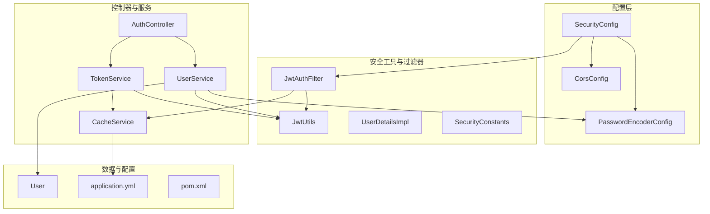
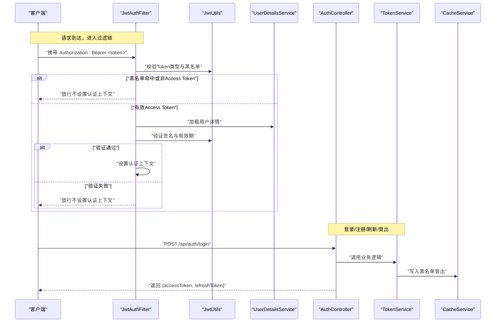
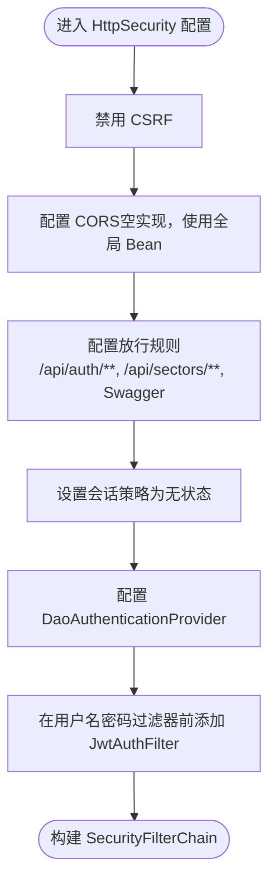
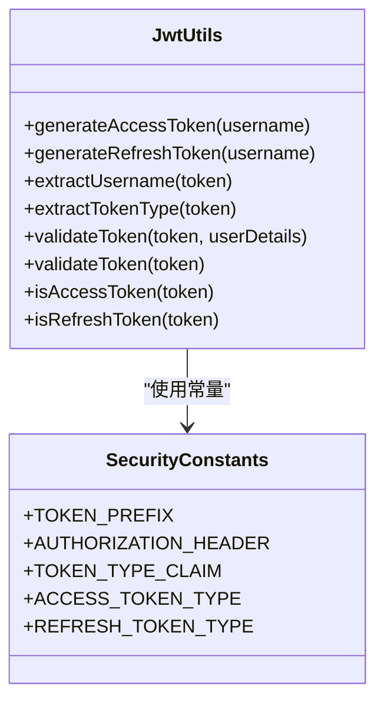
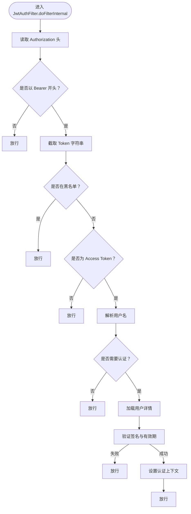
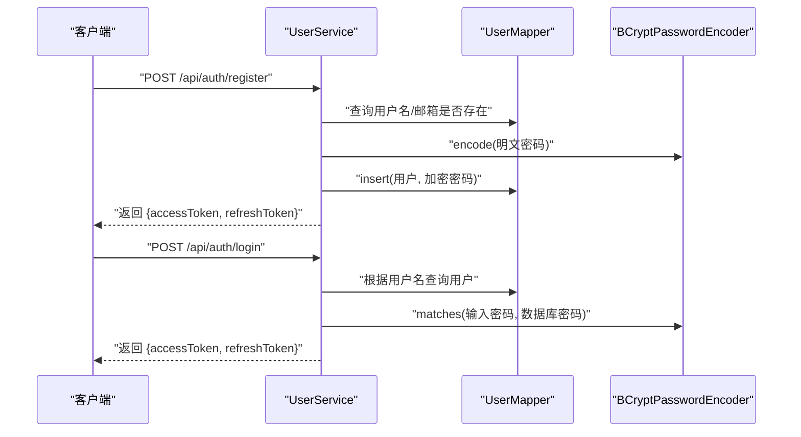
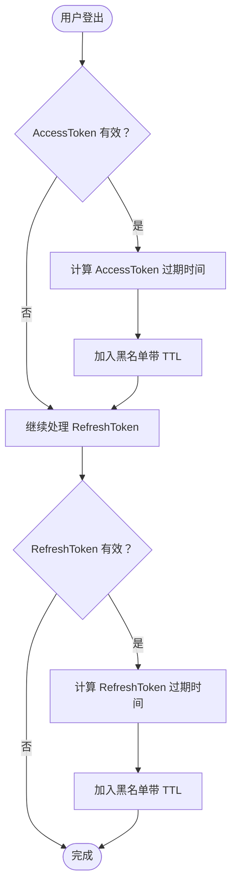
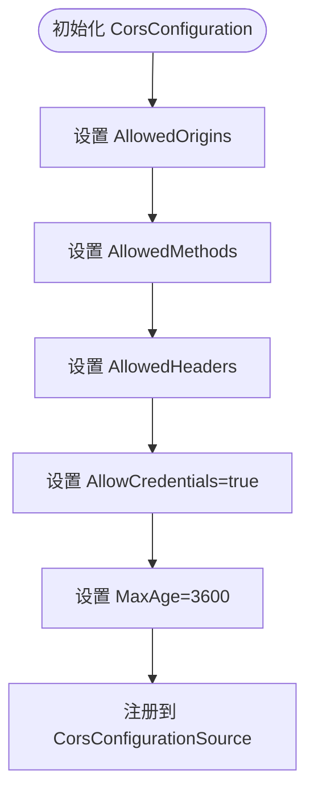
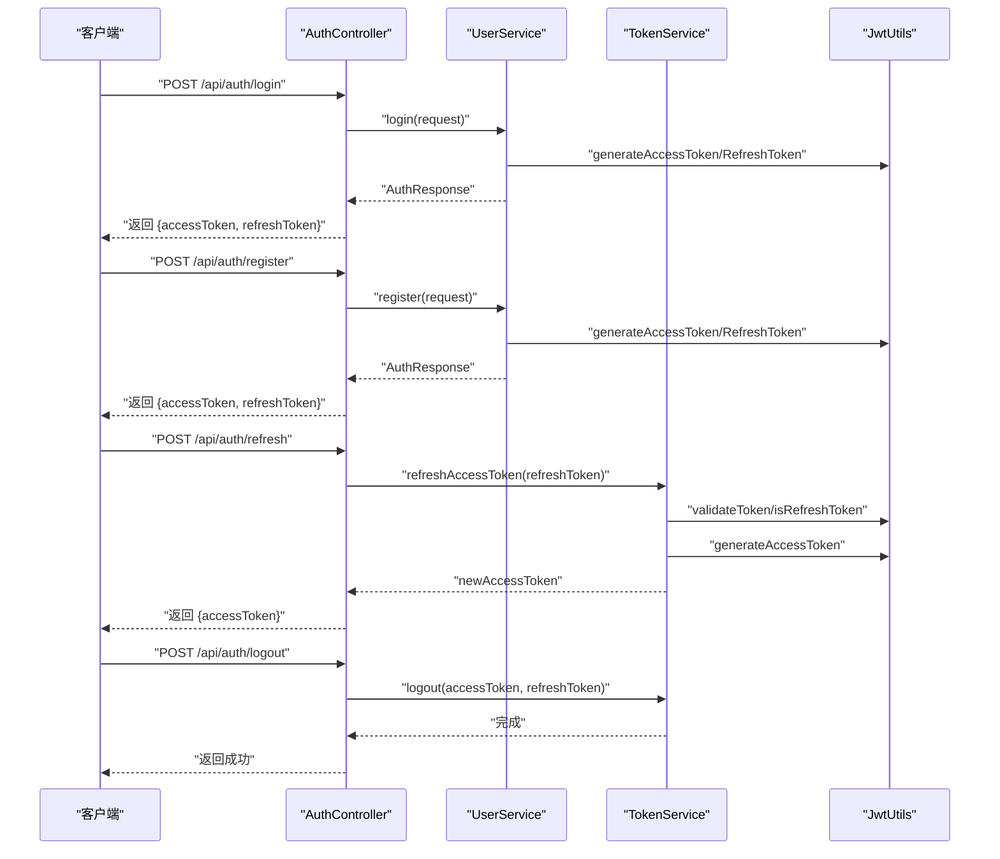
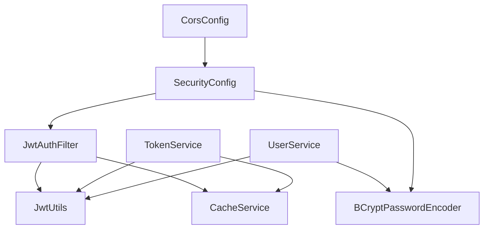

# 安全系统

<cite>
**本文引用的文件**
- [SecurityConfig.java](file://backend/src/main/java/com/freetrader/config/SecurityConfig.java)
- [JwtAuthFilter.java](file://backend/src/main/java/com/freetrader/security/JwtAuthFilter.java)
- [JwtUtils.java](file://backend/src/main/java/com/freetrader/security/JwtUtils.java)
- [PasswordEncoderConfig.java](file://backend/src/main/java/com/freetrader/config/PasswordEncoderConfig.java)
- [CorsConfig.java](file://backend/src/main/java/com/freetrader/config/CorsConfig.java)
- [SecurityConstants.java](file://backend/src/main/java/com/freetrader/util/SecurityConstants.java)
- [TokenService.java](file://backend/src/main/java/com/freetrader/service/TokenService.java)
- [AuthController.java](file://backend/src/main/java/com/freetrader/controller/AuthController.java)
- [UserService.java](file://backend/src/main/java/com/freetrader/service/UserService.java)
- [CacheService.java](file://backend/src/main/java/com/freetrader/service/CacheService.java)
- [UserDetailsImpl.java](file://backend/src/main/java/com/freetrader/security/UserDetailsImpl.java)
- [User.java](file://backend/src/main/java/com/freetrader/entity/User.java)
- [application.yml](file://backend/src/main/resources/application.yml)
- [pom.xml](file://backend/pom.xml)
</cite>

## 目录
1. [简介](#简介)
2. [项目结构](#项目结构)
3. [核心组件](#核心组件)
4. [架构总览](#架构总览)
5. [详细组件分析](#详细组件分析)
6. [依赖关系分析](#依赖关系分析)
7. [性能考量](#性能考量)
8. [故障排查指南](#故障排查指南)
9. [结论](#结论)
10. [附录](#附录)

## 简介
本文件系统性梳理 FreeTrader 后端的安全体系，覆盖以下主题：
- JWT 无状态认证：Token 生成、验证与刷新流程
- Spring Security 配置与自定义过滤器链
- 密码加密机制：BCrypt 的使用与存储策略
- Token 黑名单机制：登出后的 Token 失效处理
- CORS 配置与跨域安全策略
- 安全最佳实践与常见漏洞防范
- 环境变量驱动的安全配置与动态能力

## 项目结构
安全相关代码主要分布在以下包与文件：
- 配置层：SecurityConfig、PasswordEncoderConfig、CorsConfig、OpenApiConfig、RedisConfig、MyBatisPlusConfig、WebMvcConfig
- 安全工具与过滤器：JwtUtils、JwtAuthFilter、UserDetailsImpl、SecurityConstants
- 控制器与服务：AuthController、UserService、TokenService、CacheService
- 实体与配置：User、application.yml、pom.xml

图表来源
- [SecurityConfig.java](file://backend/src/main/java/com/freetrader/config/SecurityConfig.java#L29-L46)
- [JwtAuthFilter.java](file://backend/src/main/java/com/freetrader/security/JwtAuthFilter.java#L25-L82)
- [JwtUtils.java](file://backend/src/main/java/com/freetrader/security/JwtUtils.java#L23-L193)
- [TokenService.java](file://backend/src/main/java/com/freetrader/service/TokenService.java#L13-L63)
- [AuthController.java](file://backend/src/main/java/com/freetrader/controller/AuthController.java#L23-L71)
- [UserService.java](file://backend/src/main/java/com/freetrader/service/UserService.java#L25-L102)
- [CacheService.java](file://backend/src/main/java/com/freetrader/service/CacheService.java#L25-L205)
- [UserDetailsImpl.java](file://backend/src/main/java/com/freetrader/security/UserDetailsImpl.java#L15-L55)
- [User.java](file://backend/src/main/java/com/freetrader/entity/User.java#L12-L28)
- [application.yml](file://backend/src/main/resources/application.yml#L60-L66)
- [pom.xml](file://backend/pom.xml#L43-L97)

章节来源
- [SecurityConfig.java](file://backend/src/main/java/com/freetrader/config/SecurityConfig.java#L29-L46)
- [application.yml](file://backend/src/main/resources/application.yml#L60-L66)

## 核心组件
- Spring Security 过滤链与认证提供者：通过配置类启用无状态会话、禁用 CSRF、开放特定路径、注入自定义 JWT 过滤器与认证提供者。
- JWT 工具：负责密钥生成、Token 构建、声明提取、类型判断、有效期校验与签名验证。
- 自定义 JWT 过滤器：从请求头读取 Bearer Token，校验黑名单与类型，解析用户信息并写入安全上下文。
- 密码编码器：独立配置 BCrypt，用于注册与登录时的密码存储与比对。
- Token 服务：提供刷新与登出逻辑，结合 Redis 实现 Token 黑名单。
- 缓存服务：基于 Redis 的统一缓存接口，含 Token 黑名单键空间与批量清理能力。
- 用户服务：实现 UserDetailsService，注册时使用 BCrypt 存储密码，登录时签发 Access/Refresh Token。
- CORS 配置：限定允许来源、方法、头部与凭据，设置预检缓存时长。

章节来源
- [SecurityConfig.java](file://backend/src/main/java/com/freetrader/config/SecurityConfig.java#L29-L59)
- [JwtUtils.java](file://backend/src/main/java/com/freetrader/security/JwtUtils.java#L25-L193)
- [JwtAuthFilter.java](file://backend/src/main/java/com/freetrader/security/JwtAuthFilter.java#L31-L82)
- [PasswordEncoderConfig.java](file://backend/src/main/java/com/freetrader/config/PasswordEncoderConfig.java#L15-L18)
- [TokenService.java](file://backend/src/main/java/com/freetrader/service/TokenService.java#L18-L55)
- [CacheService.java](file://backend/src/main/java/com/freetrader/service/CacheService.java#L89-L101)
- [UserService.java](file://backend/src/main/java/com/freetrader/service/UserService.java#L42-L96)
- [CorsConfig.java](file://backend/src/main/java/com/freetrader/config/CorsConfig.java#L15-L27)

## 架构总览
下图展示从客户端到后端的关键交互与安全控制点：

图表来源
- [JwtAuthFilter.java](file://backend/src/main/java/com/freetrader/security/JwtAuthFilter.java#L31-L82)
- [JwtUtils.java](file://backend/src/main/java/com/freetrader/security/JwtUtils.java#L100-L154)
- [UserService.java](file://backend/src/main/java/com/freetrader/service/UserService.java#L73-L96)
- [TokenService.java](file://backend/src/main/java/com/freetrader/service/TokenService.java#L41-L55)
- [CacheService.java](file://backend/src/main/java/com/freetrader/service/CacheService.java#L89-L101)
- [AuthController.java](file://backend/src/main/java/com/freetrader/controller/AuthController.java#L35-L70)

## 详细组件分析

### Spring Security 配置与过滤器链
- 无状态会话：禁用 CSRF，设置 SessionCreationPolicy 为 STATELESS，确保 JWT 无状态特性。
- 路由放行：/api/auth/**、/api/sectors/**、Swagger 文档路径均放行；其余请求需认证。
- 认证提供者：使用 DaoAuthenticationProvider，结合 UserDetailsService 与 PasswordEncoder。
- 自定义过滤器：在 UsernamePasswordAuthenticationFilter 之前插入 JwtAuthFilter，实现 Token 解析与认证上下文设置。

图表来源
- [SecurityConfig.java](file://backend/src/main/java/com/freetrader/config/SecurityConfig.java#L30-L46)

章节来源
- [SecurityConfig.java](file://backend/src/main/java/com/freetrader/config/SecurityConfig.java#L29-L59)

### JWT 工具与 Token 生命周期
- 密钥与最小长度：从配置读取密钥，内部保证最小长度，使用 HMAC SHA 签名。
- 声明提取：支持提取用户名、过期时间、Token 类型等。
- Token 类型：区分 access 与 refresh，分别设置过期时间。
- 验证策略：先解析签名与载荷，再检查过期；支持仅验证有效性与带用户信息验证两种方式。

图表来源
- [JwtUtils.java](file://backend/src/main/java/com/freetrader/security/JwtUtils.java#L25-L193)
- [SecurityConstants.java](file://backend/src/main/java/com/freetrader/util/SecurityConstants.java#L6-L41)

章节来源
- [JwtUtils.java](file://backend/src/main/java/com/freetrader/security/JwtUtils.java#L25-L193)
- [SecurityConstants.java](file://backend/src/main/java/com/freetrader/util/SecurityConstants.java#L6-L41)

### 自定义 JWT 过滤器
- 请求头解析：从 Authorization 头读取 Bearer Token。
- 黑名单检查：若命中黑名单则放行（不设置认证上下文），避免重复认证。
- 类型校验：仅处理 Access Token，拒绝 Refresh Token。
- 用户加载与验证：加载用户详情，验证签名与有效期，成功则设置认证上下文。

图表来源
- [JwtAuthFilter.java](file://backend/src/main/java/com/freetrader/security/JwtAuthFilter.java#L31-L82)
- [JwtUtils.java](file://backend/src/main/java/com/freetrader/security/JwtUtils.java#L100-L154)
- [CacheService.java](file://backend/src/main/java/com/freetrader/service/CacheService.java#L98-L101)

章节来源
- [JwtAuthFilter.java](file://backend/src/main/java/com/freetrader/security/JwtAuthFilter.java#L31-L82)

### 密码加密与存储策略
- 注册流程：使用 BCrypt 对明文密码进行编码后持久化。
- 登录流程：从数据库取出加密密码，使用 BCrypt.matches 进行比对。
- 独立配置：PasswordEncoderConfig 将 PasswordEncoder 单独配置，避免循环依赖。

图表来源
- [UserService.java](file://backend/src/main/java/com/freetrader/service/UserService.java#L42-L96)
- [PasswordEncoderConfig.java](file://backend/src/main/java/com/freetrader/config/PasswordEncoderConfig.java#L15-L18)
- [User.java](file://backend/src/main/java/com/freetrader/entity/User.java#L21-L21)

章节来源
- [UserService.java](file://backend/src/main/java/com/freetrader/service/UserService.java#L42-L96)
- [PasswordEncoderConfig.java](file://backend/src/main/java/com/freetrader/config/PasswordEncoderConfig.java#L15-L18)
- [User.java](file://backend/src/main/java/com/freetrader/entity/User.java#L21-L21)

### Token 黑名单与登出机制
- 登出流程：将当前 Access/Refresh Token 加入黑名单，并按各自过期时间设置 TTL。
- 刷新流程：校验 Refresh Token 的有效性、类型与黑名单状态，通过后签发新的 Access Token。
- 过滤器拦截：请求到达时检查 Access Token 是否在黑名单，若在则放行（不认证）。

图表来源
- [TokenService.java](file://backend/src/main/java/com/freetrader/service/TokenService.java#L41-L55)
- [CacheService.java](file://backend/src/main/java/com/freetrader/service/CacheService.java#L89-L101)
- [JwtUtils.java](file://backend/src/main/java/com/freetrader/security/JwtUtils.java#L183-L192)

章节来源
- [TokenService.java](file://backend/src/main/java/com/freetrader/service/TokenService.java#L41-L55)
- [CacheService.java](file://backend/src/main/java/com/freetrader/service/CacheService.java#L89-L101)

### CORS 配置与跨域安全策略
- 允许来源：开发环境默认允许本地前端地址。
- 允许方法与头部：GET/POST/PUT/DELETE/OPTIONS 与常见头部。
- 凭据允许：允许携带 Cookie/Authorization。
- 预检缓存：设置 Max-Age，减少重复预检。

图表来源
- [CorsConfig.java](file://backend/src/main/java/com/freetrader/config/CorsConfig.java#L15-L27)

章节来源
- [CorsConfig.java](file://backend/src/main/java/com/freetrader/config/CorsConfig.java#L15-L27)

### 认证与授权流程（登录/注册）
- 登录：校验用户存在与密码正确，签发 Access/Refresh Token。
- 注册：校验用户名/邮箱唯一，BCrypt 存储密码，签发 Access/Refresh Token。
- 控制器：提供 /api/auth/login、/api/auth/register、/api/auth/refresh、/api/auth/logout 接口。

图表来源
- [AuthController.java](file://backend/src/main/java/com/freetrader/controller/AuthController.java#L35-L70)
- [UserService.java](file://backend/src/main/java/com/freetrader/service/UserService.java#L73-L96)
- [TokenService.java](file://backend/src/main/java/com/freetrader/service/TokenService.java#L18-L39)
- [JwtUtils.java](file://backend/src/main/java/com/freetrader/security/JwtUtils.java#L100-L120)

章节来源
- [AuthController.java](file://backend/src/main/java/com/freetrader/controller/AuthController.java#L28-L70)
- [UserService.java](file://backend/src/main/java/com/freetrader/service/UserService.java#L73-L96)
- [TokenService.java](file://backend/src/main/java/com/freetrader/service/TokenService.java#L18-L39)

## 依赖关系分析
- 组件耦合：JwtAuthFilter 依赖 JwtUtils、UserDetailsService、CacheService；TokenService 依赖 JwtUtils、CacheService；UserService 依赖 JwtUtils、PasswordEncoder、UserMapper。
- 外部依赖：Spring Security、jjwt、Redis、BCrypt。
- 配置依赖：application.yml 提供 JWT 密钥与过期时间、Redis 连接参数、日志级别等。

图表来源
- [JwtAuthFilter.java](file://backend/src/main/java/com/freetrader/security/JwtAuthFilter.java#L27-L29)
- [TokenService.java](file://backend/src/main/java/com/freetrader/service/TokenService.java#L15-L16)
- [UserService.java](file://backend/src/main/java/com/freetrader/service/UserService.java#L27-L29)
- [SecurityConfig.java](file://backend/src/main/java/com/freetrader/config/SecurityConfig.java#L25-L27)
- [CorsConfig.java](file://backend/src/main/java/com/freetrader/config/CorsConfig.java#L15-L27)

章节来源
- [pom.xml](file://backend/pom.xml#L43-L97)
- [application.yml](file://backend/src/main/resources/application.yml#L24-L44)

## 性能考量
- 无状态认证：避免服务器端会话存储，降低内存压力。
- Redis 黑名单：使用带 TTL 的键空间，天然过期，无需定期清理。
- 过滤器链短路：黑名单与类型校验失败直接放行，减少后续开销。
- 批量删除优化：使用 SCAN 替代 KEYS，避免阻塞 Redis。
- 日志级别：生产环境建议降低 Spring Security 与 Web 层日志级别，减少 I/O。

## 故障排查指南
- 登录失败（用户名或密码错误）：检查密码编码与比对逻辑，确认数据库中密码为 BCrypt 编码。
- Token 无法验证：检查密钥长度与配置项，确认签名算法一致；核对过期时间与服务器时间。
- 登出无效：确认黑名单键空间格式与 TTL 设置；检查 Redis 可用性与连接参数。
- CORS 报错：核对允许来源、方法与头部；确认预检缓存是否生效。
- 过滤器未生效：确认过滤器在 UsernamePasswordAuthenticationFilter 之前注册；检查放行路径配置。

章节来源
- [UserService.java](file://backend/src/main/java/com/freetrader/service/UserService.java#L79-L82)
- [JwtUtils.java](file://backend/src/main/java/com/freetrader/security/JwtUtils.java#L40-L48)
- [TokenService.java](file://backend/src/main/java/com/freetrader/service/TokenService.java#L42-L52)
- [CorsConfig.java](file://backend/src/main/java/com/freetrader/config/CorsConfig.java#L18-L22)
- [CacheService.java](file://backend/src/main/java/com/freetrader/service/CacheService.java#L89-L101)

## 结论
FreeTrader 的安全体系以 Spring Security 为基础，结合 JWT 与 Redis 实现了无状态认证、细粒度的 Token 生命周期管理与跨域安全策略。通过独立的密码编码器配置与严格的黑名单机制，系统在保障易用性的同时兼顾安全性与可维护性。建议在生产环境强化密钥管理、日志审计与限流策略，并持续监控 Token 黑名单与 Redis 性能。

## 附录

### 环境变量与动态配置
- JWT 配置：密钥、Access/Refresh 过期时间通过环境变量注入，便于不同环境差异化部署。
- 数据源与 Redis：数据库 URL、用户名、密码、Redis 连接参数均可通过环境变量配置。
- 日志与 Swagger：日志级别、Swagger 开关可通过环境变量控制。

章节来源
- [application.yml](file://backend/src/main/resources/application.yml#L60-L66)
- [application.yml](file://backend/src/main/resources/application.yml#L8-L38)
- [application.yml](file://backend/src/main/resources/application.yml#L77-L101)