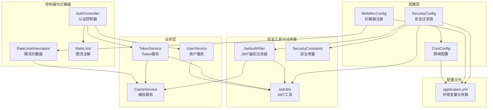
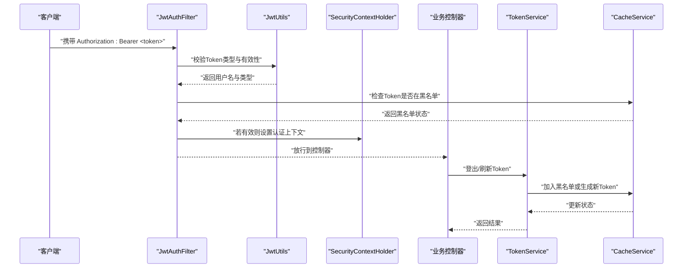
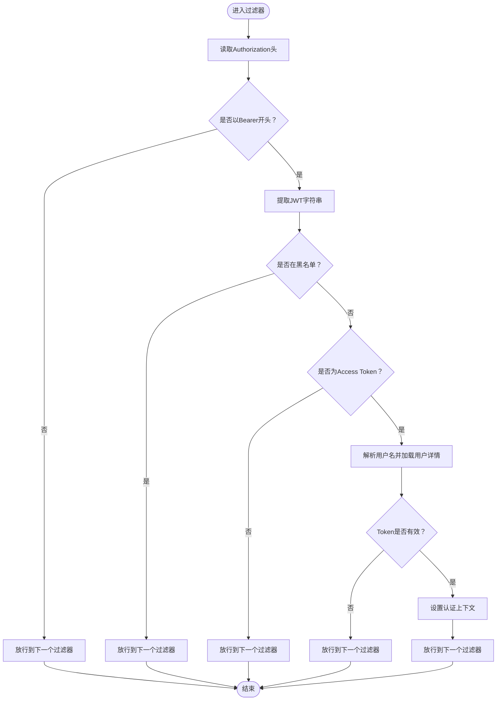
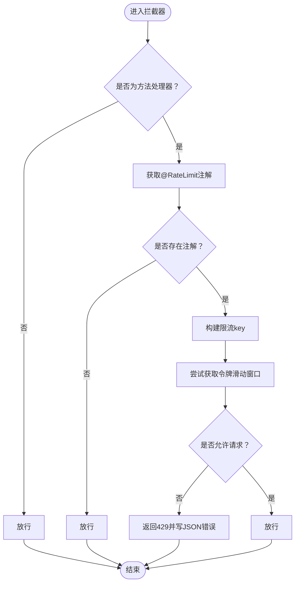
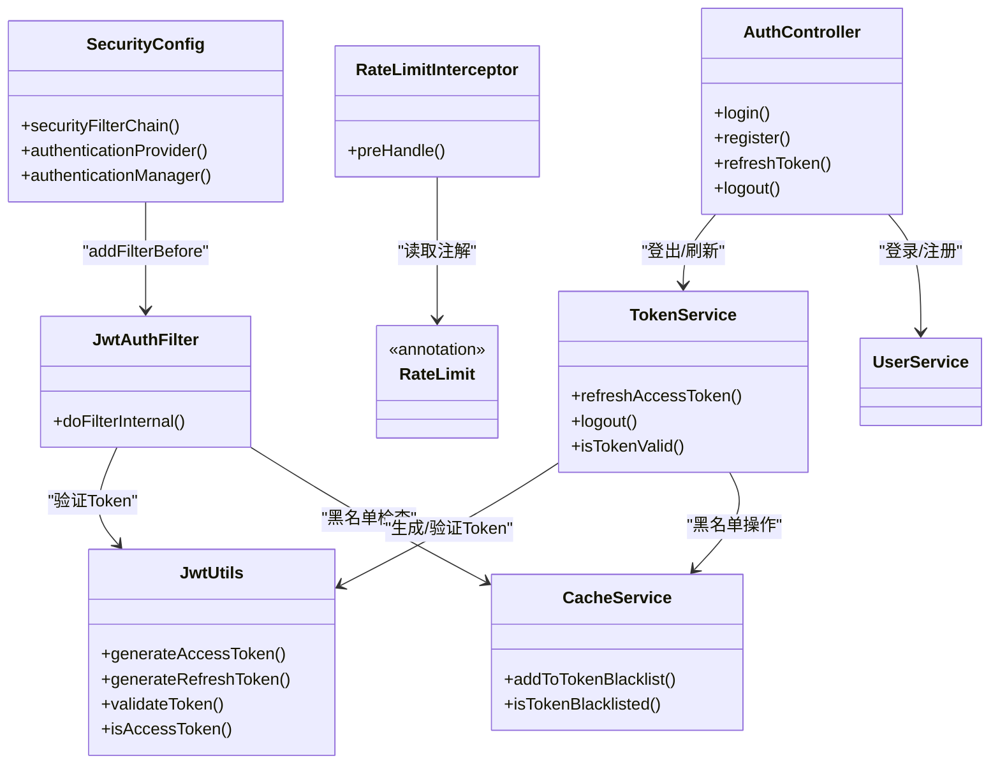

# 安全配置与最佳实践

<cite>
**本文引用的文件列表**
- [SecurityConfig.java](file://backend/src/main/java/com/freetrader/config/SecurityConfig.java)
- [JwtAuthFilter.java](file://backend/src/main/java/com/freetrader/security/JwtAuthFilter.java)
- [JwtUtils.java](file://backend/src/main/java/com/freetrader/security/JwtUtils.java)
- [SecurityConstants.java](file://backend/src/main/java/com/freetrader/util/SecurityConstants.java)
- [RateLimit.java](file://backend/src/main/java/com/freetrader/annotation/RateLimit.java)
- [RateLimitInterceptor.java](file://backend/src/main/java/com/freetrader/interceptor/RateLimitInterceptor.java)
- [WebMvcConfig.java](file://backend/src/main/java/com/freetrader/config/WebMvcConfig.java)
- [CorsConfig.java](file://backend/src/main/java/com/freetrader/config/CorsConfig.java)
- [application.yml](file://backend/src/main/resources/application.yml)
- [AuthController.java](file://backend/src/main/java/com/freetrader/controller/AuthController.java)
- [TokenService.java](file://backend/src/main/java/com/freetrader/service/TokenService.java)
- [UserService.java](file://backend/src/main/java/com/freetrader/service/UserService.java)
- [CacheService.java](file://backend/src/main/java/com/freetrader/service/CacheService.java)
- [JwtUtilsTest.java](file://backend/src/test/java/com/freetrader/security/JwtUtilsTest.java)
</cite>

## 目录
1. [简介](#简介)
2. [项目结构](#项目结构)
3. [核心组件](#核心组件)
4. [架构总览](#架构总览)
5. [详细组件分析](#详细组件分析)
6. [依赖关系分析](#依赖关系分析)
7. [性能考量](#性能考量)
8. [故障排查指南](#故障排查指南)
9. [结论](#结论)
10. [附录](#附录)

## 简介
本文件面向 FreeTrader 后端的安全配置与最佳实践，围绕以下目标展开：
- 解释 SecurityConfig 的整体安全策略：CSRF 禁用、HTTP 安全头设置、会话管理策略
- 详解安全过滤器与拦截器：JwtAuthFilter 的集成与鉴权流程、自定义拦截器 RateLimitInterceptor 的限流机制
- 说明速率限制注解 RateLimit 的使用与拦截器处理逻辑
- 描述安全常量的定义与管理（SecurityConstants）
- 解释环境变量驱动的安全配置（敏感信息外部化）
- 提供安全审计与日志记录的最佳实践（认证失败记录、异常监控）
- 给出部署指南与生产环境安全加固建议

## 项目结构
后端采用分层架构，安全相关代码主要分布在以下模块：
- 配置层：SecurityConfig、WebMvcConfig、CorsConfig、PasswordEncoderConfig、RedisConfig、OpenApiConfig、MyBatisPlusConfig
- 安全工具与过滤器：JwtUtils、JwtAuthFilter、UserDetailsImpl
- 业务层：UserService、TokenService、CacheService
- 控制器：AuthController
- 拦截器与注解：RateLimit、RateLimitInterceptor
- 常量：SecurityConstants
- 配置文件：application.yml

图表来源
- [SecurityConfig.java](file://backend/src/main/java/com/freetrader/config/SecurityConfig.java#L29-L46)
- [WebMvcConfig.java](file://backend/src/main/java/com/freetrader/config/WebMvcConfig.java#L19-L24)
- [CorsConfig.java](file://backend/src/main/java/com/freetrader/config/CorsConfig.java#L15-L27)
- [JwtAuthFilter.java](file://backend/src/main/java/com/freetrader/security/JwtAuthFilter.java#L25-L82)
- [JwtUtils.java](file://backend/src/main/java/com/freetrader/security/JwtUtils.java#L23-L193)
- [SecurityConstants.java](file://backend/src/main/java/com/freetrader/util/SecurityConstants.java#L6-L41)
- [UserService.java](file://backend/src/main/java/com/freetrader/service/UserService.java#L25-L102)
- [TokenService.java](file://backend/src/main/java/com/freetrader/service/TokenService.java#L13-L63)
- [CacheService.java](file://backend/src/main/java/com/freetrader/service/CacheService.java#L25-L205)
- [AuthController.java](file://backend/src/main/java/com/freetrader/controller/AuthController.java#L23-L71)
- [RateLimitInterceptor.java](file://backend/src/main/java/com/freetrader/interceptor/RateLimitInterceptor.java#L27-L152)
- [RateLimit.java](file://backend/src/main/java/com/freetrader/annotation/RateLimit.java#L9-L48)
- [application.yml](file://backend/src/main/resources/application.yml#L60-L66)

章节来源
- [SecurityConfig.java](file://backend/src/main/java/com/freetrader/config/SecurityConfig.java#L29-L46)
- [WebMvcConfig.java](file://backend/src/main/java/com/freetrader/config/WebMvcConfig.java#L19-L24)
- [CorsConfig.java](file://backend/src/main/java/com/freetrader/config/CorsConfig.java#L15-L27)
- [application.yml](file://backend/src/main/resources/application.yml#L60-L66)

## 核心组件
本节聚焦安全配置的核心组件及其职责：
- SecurityConfig：定义安全过滤链、CSRF 禁用、CORS、授权规则、会话策略、认证提供者与认证管理器
- JwtAuthFilter：基于请求头 Authorization 的 Bearer Token 进行鉴权，结合 JwtUtils 与 CacheService 实现 Token 校验与黑名单校验
- JwtUtils：负责 JWT 的生成、解析、验证、类型判断与密钥管理
- SecurityConstants：集中管理安全相关常量（如请求头、Token 前缀、Token 类型等）
- RateLimit 注解与 RateLimitInterceptor：基于 Redis 的滑动窗口限流，支持按 IP、用户、全局三种维度
- WebMvcConfig：注册拦截器并排除特定路径（如 Token 刷新接口）
- CacheService：提供 Redis 访问与 Token 黑名单存储能力
- application.yml：通过环境变量注入 JWT 密钥、过期时间、Redis 连接等敏感配置

章节来源
- [SecurityConfig.java](file://backend/src/main/java/com/freetrader/config/SecurityConfig.java#L29-L59)
- [JwtAuthFilter.java](file://backend/src/main/java/com/freetrader/security/JwtAuthFilter.java#L31-L82)
- [JwtUtils.java](file://backend/src/main/java/com/freetrader/security/JwtUtils.java#L25-L48)
- [SecurityConstants.java](file://backend/src/main/java/com/freetrader/util/SecurityConstants.java#L12-L41)
- [RateLimit.java](file://backend/src/main/java/com/freetrader/annotation/RateLimit.java#L14-L48)
- [RateLimitInterceptor.java](file://backend/src/main/java/com/freetrader/interceptor/RateLimitInterceptor.java#L35-L114)
- [WebMvcConfig.java](file://backend/src/main/java/com/freetrader/config/WebMvcConfig.java#L19-L24)
- [CacheService.java](file://backend/src/main/java/com/freetrader/service/CacheService.java#L84-L101)
- [application.yml](file://backend/src/main/resources/application.yml#L60-L66)

## 架构总览
下图展示安全相关组件之间的交互关系与数据流向。

图表来源
- [JwtAuthFilter.java](file://backend/src/main/java/com/freetrader/security/JwtAuthFilter.java#L31-L82)
- [JwtUtils.java](file://backend/src/main/java/com/freetrader/security/JwtUtils.java#L138-L154)
- [TokenService.java](file://backend/src/main/java/com/freetrader/service/TokenService.java#L41-L55)
- [CacheService.java](file://backend/src/main/java/com/freetrader/service/CacheService.java#L89-L101)

## 详细组件分析

### 安全配置类 SecurityConfig
- CSRF 禁用：出于无状态 API 设计，禁用 CSRF 保护
- CORS：通过空配置启用 CORS，具体策略由 CorsConfig 提供
- 授权规则：
  - /api/auth/** 允许匿名访问（登录、注册、刷新、登出）
  - /api/sectors/** 允许匿名访问（公开板块数据）
  - /swagger-ui/**、/v3/api-docs/**、/swagger-ui.html 允许匿名访问（文档）
  - 其余请求均需认证
- 会话管理：STATELESS，无 Session，完全基于 Token
- 认证提供者：DaoAuthenticationProvider，结合 UserDetailsService 与 PasswordEncoder
- 认证管理器：从 AuthenticationConfiguration 获取
- 过滤器链：在 UsernamePasswordAuthenticationFilter 之前插入 JwtAuthFilter

章节来源
- [SecurityConfig.java](file://backend/src/main/java/com/freetrader/config/SecurityConfig.java#L29-L59)

### JWT 鉴权过滤器 JwtAuthFilter
- 请求头解析：读取 Authorization 头，要求以 Bearer 开头
- 黑名单检查：调用 CacheService.isTokenBlacklisted 判断 Token 是否被拉黑
- 类型校验：通过 JwtUtils.isAccessToken 确保为 Access Token
- 用户加载与验证：根据用户名加载 UserDetails，并用 JwtUtils.validateToken 校验
- 上下文设置：通过 UsernamePasswordAuthenticationToken 设置认证上下文
- 异常处理：捕获异常并记录调试日志，不影响后续过滤器执行

图表来源
- [JwtAuthFilter.java](file://backend/src/main/java/com/freetrader/security/JwtAuthFilter.java#L31-L82)
- [JwtUtils.java](file://backend/src/main/java/com/freetrader/security/JwtUtils.java#L138-L154)
- [CacheService.java](file://backend/src/main/java/com/freetrader/service/CacheService.java#L98-L101)

章节来源
- [JwtAuthFilter.java](file://backend/src/main/java/com/freetrader/security/JwtAuthFilter.java#L31-L82)

### JWT 工具 JwtUtils
- 密钥管理：从配置文件读取 jwt.secret，最小长度校验并生成 HMAC 密钥
- 生成 Token：支持 Access Token 与 Refresh Token，包含类型声明与过期时间
- 解析与验证：提取用户名、过期时间、Token 类型；验证签名与过期时间
- 类型判断：区分 Access Token 与 Refresh Token
- 过期时间：分别暴露 Access 与 Refresh Token 的过期毫秒数

章节来源
- [JwtUtils.java](file://backend/src/main/java/com/freetrader/security/JwtUtils.java#L25-L48)
- [JwtUtils.java](file://backend/src/main/java/com/freetrader/security/JwtUtils.java#L100-L133)
- [JwtUtils.java](file://backend/src/main/java/com/freetrader/security/JwtUtils.java#L138-L178)

### 安全常量 SecurityConstants
- ANONYMOUS_USER：Spring Security 匿名用户标识
- TOKEN_PREFIX：Bearer 前缀
- AUTHORIZATION_HEADER：Authorization 请求头名称
- TOKEN_TYPE_CLAIM：Token 类型声明字段名
- ACCESS_TOKEN_TYPE、REFRESH_TOKEN_TYPE：Token 类型标识

章节来源
- [SecurityConstants.java](file://backend/src/main/java/com/freetrader/util/SecurityConstants.java#L12-L41)

### 速率限制注解与拦截器
- RateLimit 注解：
  - window：时间窗口（秒），默认 60
  - maxRequests：窗口内最大请求数，默认 10
  - prefix：限流 key 前缀，默认使用方法名
  - limitType：限流类型（IP、USER、GLOBAL）
- RateLimitInterceptor：
  - 基于 Redis 的滑动窗口计数器算法
  - key 构造：prefix:method:identifier（identifier 由 limitType 决定）
  - IP 限流：取 X-Forwarded-For、Proxy-Client-IP、WL-Proxy-Client-IP、X-Real-IP 或 RemoteAddr
  - USER 限流：从 SecurityContextHolder 获取当前用户名
  - GLOBAL 限流：固定标识
  - Redis 异常时放行，避免影响正常服务
  - 触发限流返回 429 并写入 JSON 错误响应

图表来源
- [RateLimitInterceptor.java](file://backend/src/main/java/com/freetrader/interceptor/RateLimitInterceptor.java#L35-L114)
- [RateLimit.java](file://backend/src/main/java/com/freetrader/annotation/RateLimit.java#L14-L48)

章节来源
- [RateLimit.java](file://backend/src/main/java/com/freetrader/annotation/RateLimit.java#L14-L48)
- [RateLimitInterceptor.java](file://backend/src/main/java/com/freetrader/interceptor/RateLimitInterceptor.java#L35-L152)

### Web MVC 配置与拦截器注册
- 注册 RateLimitInterceptor，对 /api/** 路径生效
- 排除 /api/auth/refresh，避免刷新接口被限流

章节来源
- [WebMvcConfig.java](file://backend/src/main/java/com/freetrader/config/WebMvcConfig.java#L19-L24)

### 跨域配置 CorsConfig
- 允许来源：本地开发前端地址
- 允许方法：GET、POST、PUT、DELETE、OPTIONS
- 允许头：Authorization、Content-Type、X-Requested-With
- 允许凭据：true
- 预检缓存：3600 秒

章节来源
- [CorsConfig.java](file://backend/src/main/java/com/freetrader/config/CorsConfig.java#L15-L27)

### 环境变量驱动的安全配置
- JWT 密钥与过期时间：通过环境变量注入，生产环境务必覆盖默认值
- Redis 连接：host、port、password、database、timeout 等
- 日志级别：对 Spring Security 与 Web 层进行适当降噪

章节来源
- [application.yml](file://backend/src/main/resources/application.yml#L60-L66)
- [application.yml](file://backend/src/main/resources/application.yml#L24-L38)
- [application.yml](file://backend/src/main/resources/application.yml#L77-L86)

### 认证与登出流程
- 登录/注册：UserService 校验用户并生成 Access/Refresh Token
- 登出：TokenService 将 Access/Refresh Token 加入黑名单，同时记录日志
- 刷新 Token：TokenService 校验 Refresh Token 并生成新的 Access Token

章节来源
- [UserService.java](file://backend/src/main/java/com/freetrader/service/UserService.java#L73-L96)
- [TokenService.java](file://backend/src/main/java/com/freetrader/service/TokenService.java#L18-L55)
- [AuthController.java](file://backend/src/main/java/com/freetrader/controller/AuthController.java#L34-L70)

## 依赖关系分析
- SecurityConfig 依赖 JwtAuthFilter、UserDetailsService、PasswordEncoder
- JwtAuthFilter 依赖 JwtUtils、UserDetailsService、CacheService
- TokenService 依赖 JwtUtils、CacheService
- RateLimitInterceptor 依赖 RedisTemplate、ObjectMapper
- AuthController 使用 RateLimit 注解并调用 UserService、TokenService

图表来源
- [SecurityConfig.java](file://backend/src/main/java/com/freetrader/config/SecurityConfig.java#L29-L59)
- [JwtAuthFilter.java](file://backend/src/main/java/com/freetrader/security/JwtAuthFilter.java#L25-L82)
- [JwtUtils.java](file://backend/src/main/java/com/freetrader/security/JwtUtils.java#L23-L193)
- [TokenService.java](file://backend/src/main/java/com/freetrader/service/TokenService.java#L13-L63)
- [CacheService.java](file://backend/src/main/java/com/freetrader/service/CacheService.java#L25-L205)
- [RateLimitInterceptor.java](file://backend/src/main/java/com/freetrader/interceptor/RateLimitInterceptor.java#L27-L152)
- [RateLimit.java](file://backend/src/main/java/com/freetrader/annotation/RateLimit.java#L9-L48)
- [AuthController.java](file://backend/src/main/java/com/freetrader/controller/AuthController.java#L23-L71)

## 性能考量
- 无状态设计：STATELESS 会话策略降低服务器状态维护成本
- Redis 限流：滑动窗口计数器算法简单高效，但需合理设置窗口与阈值，避免过高 QPS 导致 Redis 压力
- 黑名单存储：Token 黑名单键带有过期时间，避免无限增长
- 日志级别：生产环境建议降低 Spring Security 与 Web 层日志级别，减少 I/O 压力

[本节为通用指导，无需列出章节来源]

## 故障排查指南
- 认证失败与异常监控
  - 登录失败：UserService 在用户名或密码错误时抛出业务异常并记录告警日志
  - Token 验证失败：JwtUtils.validateToken 捕获异常并记录警告日志
  - 刷新 Token 失败：TokenService 对无效或过期的 Refresh Token 抛出业务异常
  - 黑名单命中：JwtAuthFilter 与 TokenService 对黑名单中的 Token 记录告警
- 限流触发
  - RateLimitInterceptor 触发限流时返回 429，并记录告警日志
  - Redis 异常时拦截器放行，避免影响正常服务
- 跨域问题
  - 检查 CorsConfig 中允许的来源、方法与头是否与前端一致
- 配置问题
  - 确认 application.yml 中 JWT 密钥、过期时间、Redis 连接参数正确
  - 生产环境务必通过环境变量覆盖默认值

章节来源
- [UserService.java](file://backend/src/main/java/com/freetrader/service/UserService.java#L79-L82)
- [JwtUtils.java](file://backend/src/main/java/com/freetrader/security/JwtUtils.java#L146-L154)
- [TokenService.java](file://backend/src/main/java/com/freetrader/service/TokenService.java#L19-L32)
- [JwtAuthFilter.java](file://backend/src/main/java/com/freetrader/security/JwtAuthFilter.java#L49-L79)
- [RateLimitInterceptor.java](file://backend/src/main/java/com/freetrader/interceptor/RateLimitInterceptor.java#L48-L59)
- [CorsConfig.java](file://backend/src/main/java/com/freetrader/config/CorsConfig.java#L15-L27)
- [application.yml](file://backend/src/main/resources/application.yml#L60-L66)

## 结论
FreeTrader 的安全体系以无状态 API 为核心，通过 CSRF 禁用、CORS 明确、JWT 鉴权与黑名单机制、以及基于 Redis 的限流策略，构建了清晰且可扩展的安全框架。配合环境变量驱动的敏感配置与完善的日志记录，能够在开发与生产环境中快速落地并持续演进。

[本节为总结性内容，无需列出章节来源]

## 附录

### 安全审计与日志记录最佳实践
- 认证失败记录：UserService 在登录失败时记录告警日志，便于追踪暴力破解行为
- 异常监控：JwtUtils 与 TokenService 对异常进行捕获与记录，便于定位问题
- 限流审计：RateLimitInterceptor 触发限流时记录告警日志，便于识别异常流量
- 日志级别：生产环境建议降低 Spring Security 与 Web 层日志级别，避免噪声

章节来源
- [UserService.java](file://backend/src/main/java/com/freetrader/service/UserService.java#L79-L82)
- [JwtUtils.java](file://backend/src/main/java/com/freetrader/security/JwtUtils.java#L146-L154)
- [TokenService.java](file://backend/src/main/java/com/freetrader/service/TokenService.java#L19-L32)
- [RateLimitInterceptor.java](file://backend/src/main/java/com/freetrader/interceptor/RateLimitInterceptor.java#L48-L59)
- [application.yml](file://backend/src/main/resources/application.yml#L77-L86)

### 部署指南与生产环境安全加固建议
- 环境变量配置
  - 必须通过环境变量设置 JWT 密钥（至少 32 字节）、过期时间
  - Redis 连接参数通过环境变量注入，避免硬编码
- 生产环境加固
  - 启用 HTTPS 并配置 HSTS、CSP 等安全头（可在网关或反向代理层统一配置）
  - 严格控制 CORS 允许来源，避免通配符
  - 限制 Redis 访问范围，仅允许应用服务器访问
  - 对数据库连接启用 SSL/TLS
  - 定期轮换 JWT 密钥，使用强随机源生成
- 监控与告警
  - 关注认证失败率、限流触发次数、Redis 连接异常
  - 对异常日志进行聚合与告警

章节来源
- [application.yml](file://backend/src/main/resources/application.yml#L60-L66)
- [application.yml](file://backend/src/main/resources/application.yml#L24-L38)
- [CorsConfig.java](file://backend/src/main/java/com/freetrader/config/CorsConfig.java#L15-L27)