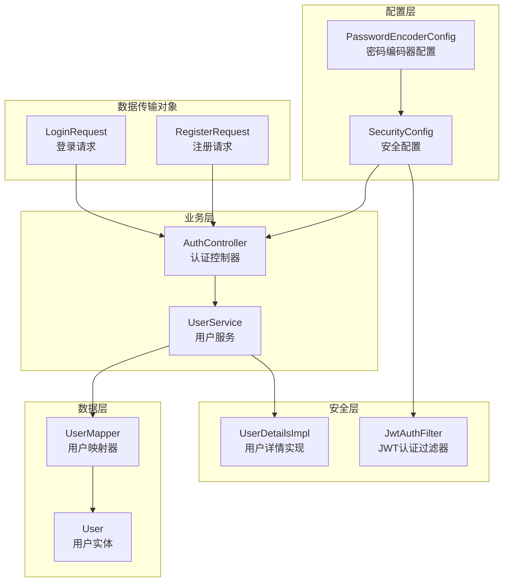
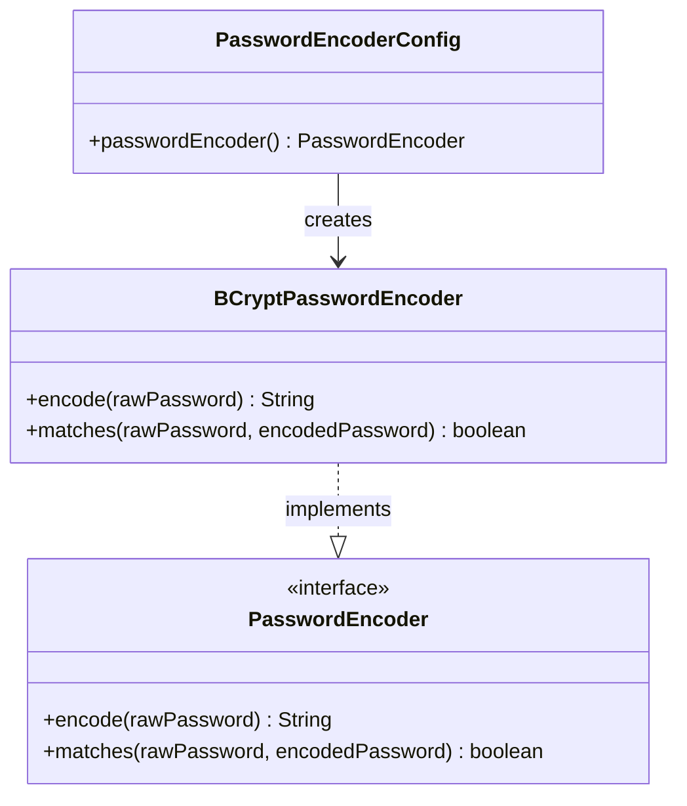
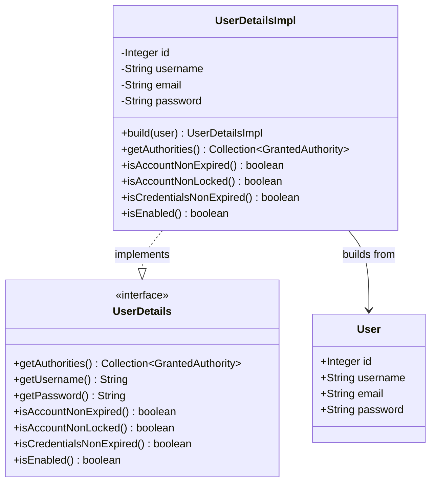
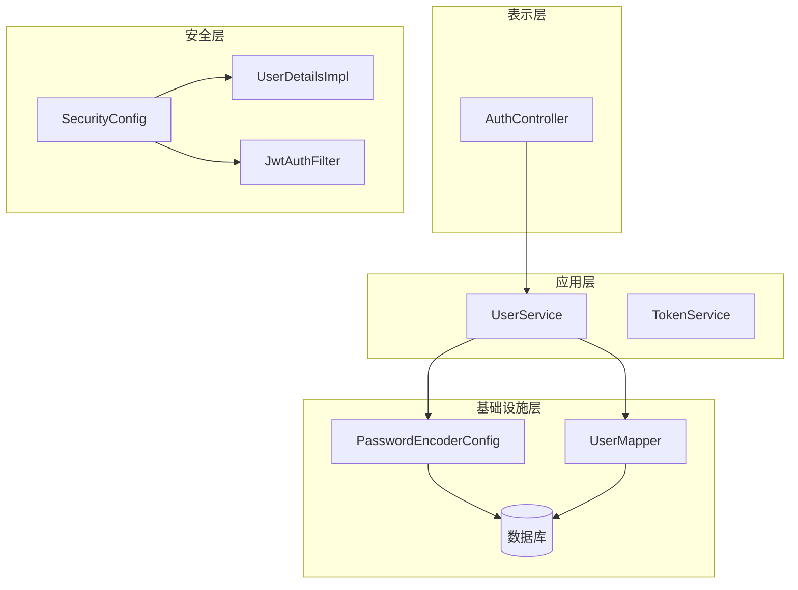
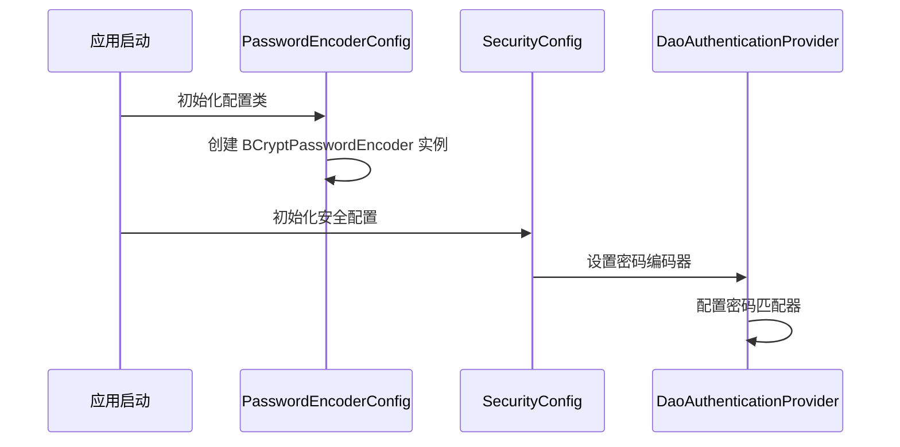
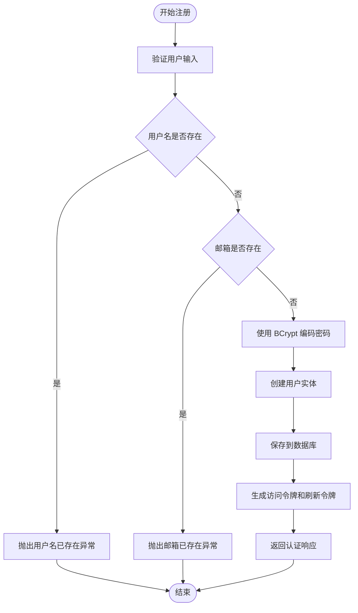
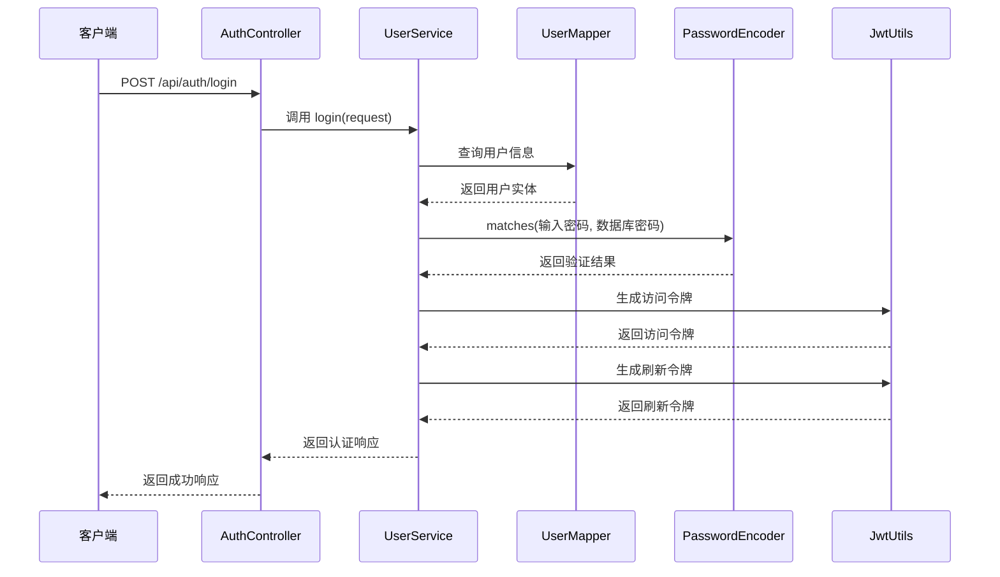
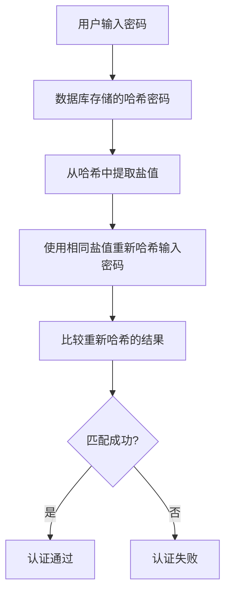
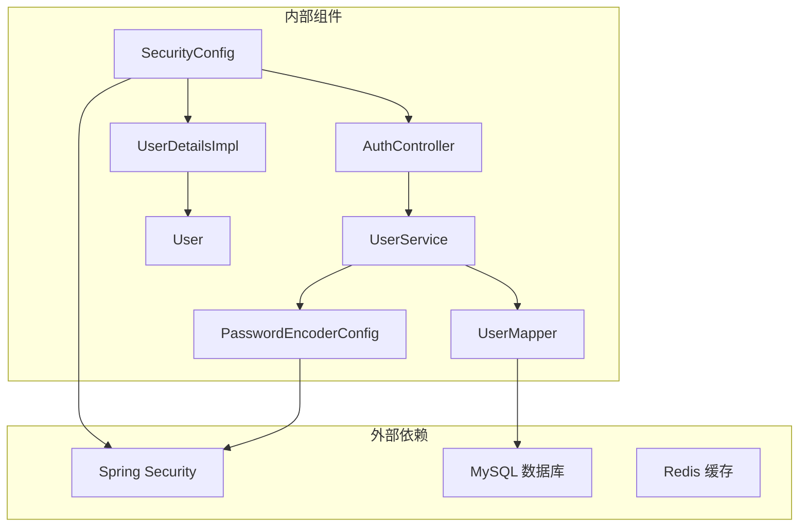

# 密码加密与安全存储

<cite>
**本文档引用的文件**
- [PasswordEncoderConfig.java](file://backend/src/main/java/com/freetrader/config/PasswordEncoderConfig.java)
- [SecurityConfig.java](file://backend/src/main/java/com/freetrader/config/SecurityConfig.java)
- [UserDetailsImpl.java](file://backend/src/main/java/com/freetrader/security/UserDetailsImpl.java)
- [UserService.java](file://backend/src/main/java/com/freetrader/service/UserService.java)
- [AuthController.java](file://backend/src/main/java/com/freetrader/controller/AuthController.java)
- [User.java](file://backend/src/main/java/com/freetrader/entity/User.java)
- [RegisterRequest.java](file://backend/src/main/java/com/freetrader/dto/RegisterRequest.java)
- [LoginRequest.java](file://backend/src/main/java/com/freetrader/dto/LoginRequest.java)
- [SecurityConstants.java](file://backend/src/main/java/com/freetrader/util/SecurityConstants.java)
- [application.yml](file://backend/src/main/resources/application.yml)
- [UserServiceTest.java](file://backend/src/test/java/com/freetrader/service/UserServiceTest.java)
</cite>

## 目录
1. [简介](#简介)
2. [项目结构](#项目结构)
3. [核心组件](#核心组件)
4. [架构概览](#架构概览)
5. [详细组件分析](#详细组件分析)
6. [依赖关系分析](#依赖关系分析)
7. [性能考虑](#性能考虑)
8. [故障排除指南](#故障排除指南)
9. [结论](#结论)
10. [附录](#附录)

## 简介

FreeTrader 项目采用现代密码学原理实现安全的用户身份验证系统。本项目基于 Spring Security 框架，使用 BCrypt 密码编码器提供强大的密码哈希保护，结合 JWT（JSON Web Token）实现无状态的身份验证机制。

BCrypt 是业界标准的密码哈希算法，具有以下安全特性：
- **自适应工作因子**：可调整的计算复杂度，随硬件性能提升而增加
- **内置盐值**：每个密码都生成独特的随机盐值，防止彩虹表攻击
- **时间成本函数**：提供渐进式安全增强能力
- **跨平台兼容性**：支持多种编程语言实现

## 项目结构

FreeTrader 项目的密码安全相关组件分布在以下模块中：



**图表来源**
- [PasswordEncoderConfig.java](file://backend/src/main/java/com/freetrader/config/PasswordEncoderConfig.java#L1-L20)
- [SecurityConfig.java](file://backend/src/main/java/com/freetrader/config/SecurityConfig.java#L1-L61)
- [AuthController.java](file://backend/src/main/java/com/freetrader/controller/AuthController.java#L1-L72)

**章节来源**
- [PasswordEncoderConfig.java](file://backend/src/main/java/com/freetrader/config/PasswordEncoderConfig.java#L1-L20)
- [SecurityConfig.java](file://backend/src/main/java/com/freetrader/config/SecurityConfig.java#L1-L61)

## 核心组件

### BCrypt 密码编码器配置

项目使用独立的 `PasswordEncoderConfig` 类来配置 BCrypt 编码器，这种设计避免了循环依赖问题并提供了清晰的职责分离。



**图表来源**
- [PasswordEncoderConfig.java](file://backend/src/main/java/com/freetrader/config/PasswordEncoderConfig.java#L15-L18)

### 用户详情实现

`UserDetailsImpl` 类实现了 Spring Security 的 `UserDetails` 接口，提供用户认证所需的核心信息。



**图表来源**
- [UserDetailsImpl.java](file://backend/src/main/java/com/freetrader/security/UserDetailsImpl.java#L15-L55)
- [User.java](file://backend/src/main/java/com/freetrader/entity/User.java#L12-L28)

**章节来源**
- [PasswordEncoderConfig.java](file://backend/src/main/java/com/freetrader/config/PasswordEncoderConfig.java#L1-L20)
- [UserDetailsImpl.java](file://backend/src/main/java/com/freetrader/security/UserDetailsImpl.java#L1-L56)

## 架构概览

FreeTrader 采用分层架构实现密码安全，各层职责明确且相互独立：



**图表来源**
- [AuthController.java](file://backend/src/main/java/com/freetrader/controller/AuthController.java#L23-L26)
- [UserService.java](file://backend/src/main/java/com/freetrader/service/UserService.java#L25-L29)
- [SecurityConfig.java](file://backend/src/main/java/com/freetrader/config/SecurityConfig.java#L23-L27)

## 详细组件分析

### 密码编码器配置类实现

`PasswordEncoderConfig` 类是整个密码安全系统的核心配置组件，负责提供统一的密码编码器实例。

#### 关键特性

1. **独立配置**：将密码编码器配置从主安全配置中分离，避免循环依赖
2. **BCrypt 实现**：使用业界标准的 BCrypt 算法提供强密码哈希
3. **Spring 集成**：通过 `@Bean` 注解提供可注入的编码器实例

#### 配置细节



**图表来源**
- [PasswordEncoderConfig.java](file://backend/src/main/java/com/freetrader/config/PasswordEncoderConfig.java#L15-L18)
- [SecurityConfig.java](file://backend/src/main/java/com/freetrader/config/SecurityConfig.java#L49-L54)

**章节来源**
- [PasswordEncoderConfig.java](file://backend/src/main/java/com/freetrader/config/PasswordEncoderConfig.java#L1-L20)

### 用户详情类实现

`UserDetailsImpl` 类实现了 Spring Security 的用户详情接口，提供认证所需的用户信息。

#### 权限管理

系统采用简单的角色模型，默认为所有用户分配 `ROLE_USER` 权限。这种设计提供了基础的访问控制能力。

#### 账户状态管理

所有账户状态检查均返回 `true`，表示账户始终有效。实际部署中可根据需要实现更严格的账户状态管理。

**章节来源**
- [UserDetailsImpl.java](file://backend/src/main/java/com/freetrader/security/UserDetailsImpl.java#L1-L56)

### 用户注册流程

用户注册过程涉及密码加密、数据验证和令牌生成等多个步骤：



**图表来源**
- [UserService.java](file://backend/src/main/java/com/freetrader/service/UserService.java#L42-L71)

#### 注册流程的关键点

1. **输入验证**：使用 `@NotBlank` 和 `@Size` 注解确保用户名和密码的有效性
2. **重复检查**：查询用户名和邮箱是否已被使用
3. **密码加密**：使用 `passwordEncoder.encode()` 方法进行安全加密
4. **事务管理**：使用 `@Transactional` 确保数据一致性

**章节来源**
- [UserService.java](file://backend/src/main/java/com/freetrader/service/UserService.java#L41-L71)
- [RegisterRequest.java](file://backend/src/main/java/com/freetrader/dto/RegisterRequest.java#L1-L23)

### 用户登录流程

用户登录过程包含密码验证和令牌生成两个主要阶段：



**图表来源**
- [AuthController.java](file://backend/src/main/java/com/freetrader/controller/AuthController.java#L35-L39)
- [UserService.java](file://backend/src/main/java/com/freetrader/service/UserService.java#L73-L96)

#### 登录验证机制

1. **用户查找**：通过用户名查询用户信息
2. **密码验证**：使用 `passwordEncoder.matches()` 方法验证密码
3. **异常处理**：用户名不存在或密码错误时抛出业务异常
4. **令牌生成**：验证成功后生成访问令牌和刷新令牌

**章节来源**
- [UserService.java](file://backend/src/main/java/com/freetrader/service/UserService.java#L73-L96)
- [LoginRequest.java](file://backend/src/main/java/com/freetrader/dto/LoginRequest.java#L1-L15)

### 密码匹配实现机制

密码匹配是认证过程的核心环节，系统使用 BCrypt 的 `matches` 方法进行密码验证：



**图表来源**
- [UserServiceTest.java](file://backend/src/test/java/com/freetrader/service/UserServiceTest.java#L69-L84)

**章节来源**
- [UserServiceTest.java](file://backend/src/test/java/com/freetrader/service/UserServiceTest.java#L69-L84)

## 依赖关系分析

系统各组件之间的依赖关系体现了清晰的分层架构：



**图表来源**
- [PasswordEncoderConfig.java](file://backend/src/main/java/com/freetrader/config/PasswordEncoderConfig.java#L1-L20)
- [SecurityConfig.java](file://backend/src/main/java/com/freetrader/config/SecurityConfig.java#L1-L61)

**章节来源**
- [application.yml](file://backend/src/main/resources/application.yml#L8-L18)

## 性能考虑

### BCrypt 性能特性

BCrypt 算法具有以下性能特征：

1. **计算复杂度**：默认工作因子为 10，提供良好的安全性和性能平衡
2. **内存使用**：相对较低的内存占用，适合高并发场景
3. **CPU 密集型**：需要足够的 CPU 资源来保证安全性

### 优化建议

1. **工作因子调整**：根据硬件性能定期调整 BCrypt 工作因子
2. **缓存策略**：对频繁访问的用户信息实施适当的缓存
3. **连接池配置**：合理配置数据库连接池参数

## 故障排除指南

### 常见问题及解决方案

#### 密码验证失败

**症状**：用户登录时报错，提示用户名或密码错误

**可能原因**：
1. 密码输入错误
2. 数据库中存储的密码被意外修改
3. 密码编码器配置不一致

**解决方法**：
1. 确认用户输入的密码正确性
2. 检查数据库中用户密码字段
3. 验证密码编码器配置的一致性

#### 用户名重复错误

**症状**：注册时提示用户名已存在

**解决方法**：
1. 提示用户提供不同的用户名
2. 在前端添加实时用户名检查功能

#### JWT 令牌问题

**症状**：访问受保护资源时出现认证失败

**解决方法**：
1. 检查 JWT 密钥配置
2. 验证令牌过期时间设置
3. 确认客户端正确传递认证头

**章节来源**
- [UserServiceTest.java](file://backend/src/test/java/com/freetrader/service/UserServiceTest.java#L88-L121)

## 结论

FreeTrader 项目采用成熟的密码学技术和最佳实践，构建了一个安全可靠的用户身份验证系统。通过使用 BCrypt 密码编码器、JWT 令牌机制和 Spring Security 框架，系统在保证安全性的同时提供了良好的用户体验。

### 主要优势

1. **安全性**：采用业界标准的密码哈希算法
2. **可维护性**：清晰的分层架构和职责分离
3. **扩展性**：模块化设计便于功能扩展
4. **可靠性**：完善的异常处理和错误恢复机制

### 改进建议

1. **密码强度策略**：可以考虑添加更强的密码复杂度要求
2. **多因素认证**：未来可以集成短信验证码等额外认证方式
3. **审计日志**：增加详细的认证操作审计记录
4. **监控告警**：建立认证相关的监控和告警机制

## 附录

### 安全配置最佳实践

#### JWT 密钥配置

```yaml
# application.yml
jwt:
  secret: ${JWT_SECRET:dev-only-secret-key-please-change-in-production-environment-min-32-bytes}
  access-token-expiration: ${JWT_ACCESS_EXPIRATION:3600000}
  refresh-token-expiration: ${JWT_REFRESH_EXPIRATION:604800000}
```

#### 生产环境安全建议

1. **密钥管理**：使用环境变量或密钥管理服务存储敏感配置
2. **HTTPS 部署**：确保所有通信都通过 HTTPS 加密
3. **CORS 配置**：严格限制跨域访问
4. **速率限制**：实施合理的请求频率限制
5. **日志安全**：避免在日志中记录敏感信息

#### 密码安全策略

1. **最小长度**：建议至少 8-12 个字符
2. **复杂度要求**：包含大小写字母、数字和特殊字符
3. **历史记录**：不允许重复使用最近使用的密码
4. **锁定机制**：多次失败后自动锁定账户
5. **定期更新**：强制用户定期更改密码