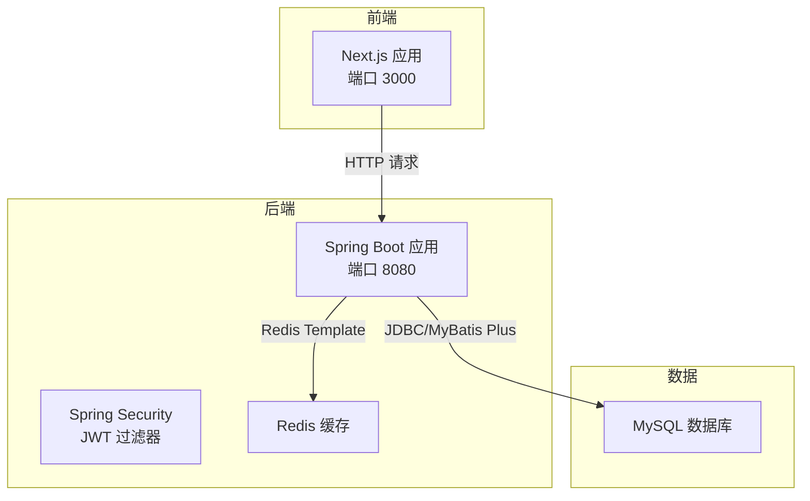
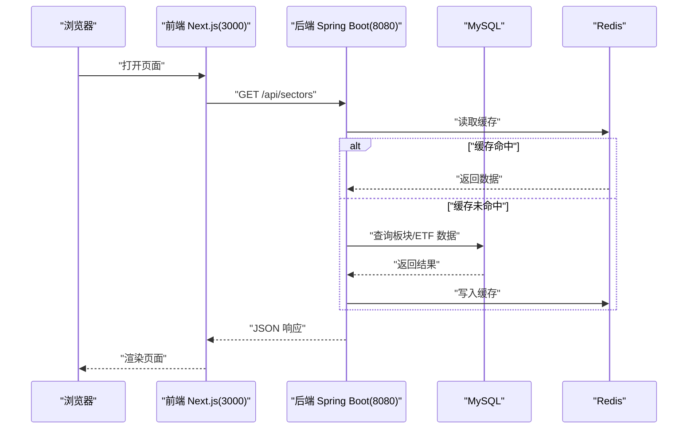
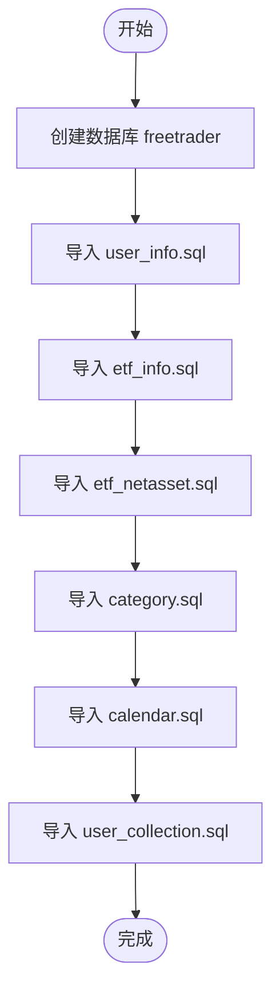
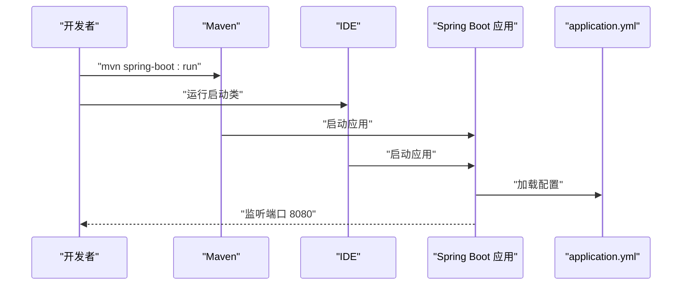
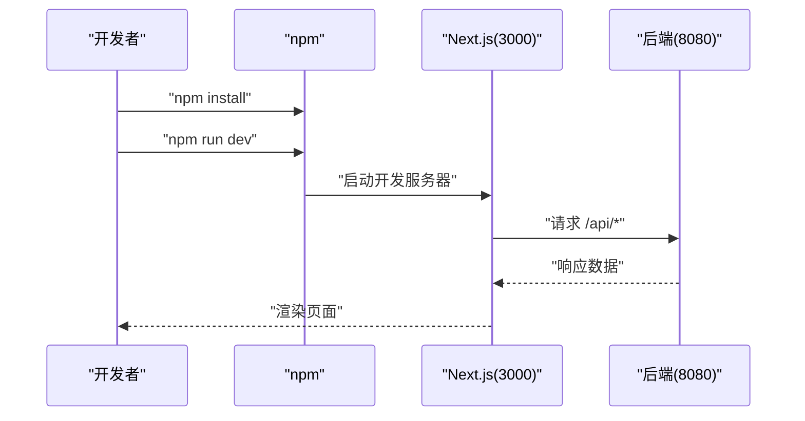
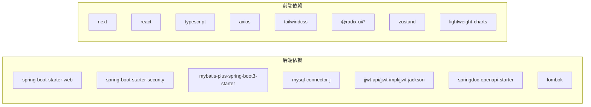

# 快速开始

<cite>
**本文引用的文件**
- [README.md](file://README.md)
- [pom.xml](file://backend/pom.xml)
- [application.yml](file://backend/src/main/resources/application.yml)
- [FreeTraderApplication.java](file://backend/src/main/java/com/freetrader/FreeTraderApplication.java)
- [RedisConfig.java](file://backend/src/main/java/com/freetrader/config/RedisConfig.java)
- [SecurityConfig.java](file://backend/src/main/java/com/freetrader/config/SecurityConfig.java)
- [package.json](file://frontend/package.json)
- [next.config.ts](file://frontend/next.config.ts)
- [api.ts](file://frontend/src/lib/api.ts)
- [layout.tsx](file://frontend/src/app/layout.tsx)
- [tsconfig.json](file://frontend/tsconfig.json)
- [calendar.sql](file://sql/calendar.sql)
- [category.sql](file://sql/category.sql)
- [etf_info.sql](file://sql/etf_info.sql)
- [etf_netasset.sql](file://sql/etf_netasset.sql)
- [user_collection.sql](file://sql/user_collection.sql)
- [user_info.sql](file://sql/user_info.sql)
</cite>

## 目录
1. [简介](#简介)
2. [项目结构](#项目结构)
3. [核心组件](#核心组件)
4. [架构总览](#架构总览)
5. [详细组件分析](#详细组件分析)
6. [依赖关系分析](#依赖关系分析)
7. [性能注意事项](#性能注意事项)
8. [故障排除指南](#故障排除指南)
9. [结论](#结论)
10. [附录](#附录)

## 简介
本指南面向新手开发者，帮助你在最短时间内完成 FreeTrader 项目的本地开发环境搭建与运行。内容涵盖环境准备、数据库初始化、后端与前端启动、配置文件修改以及基本使用说明。

## 项目结构
FreeTrader 采用前后端分离架构：
- 后端：Spring Boot 应用，提供 REST API、安全认证、缓存与数据访问层。
- 前端：Next.js 应用，基于 TypeScript 与 Tailwind CSS，提供用户界面与交互。
- 数据库：MySQL 8.0，包含用户、ETF、板块、日历等基础数据表。
- 缓存：可选 Redis，用于缓存与 Token 黑名单。

**图示来源**
- [layout.tsx](file://frontend/src/app/layout.tsx#L1-L36)
- [api.ts](file://frontend/src/lib/api.ts#L1-L89)
- [application.yml](file://backend/src/main/resources/application.yml#L1-L102)
- [RedisConfig.java](file://backend/src/main/java/com/freetrader/config/RedisConfig.java#L1-L79)

**章节来源**
- [README.md](file://README.md#L28-L47)

## 核心组件
- 后端入口与扫描：Spring Boot 启动类负责扫描 Mapper 与启动应用。
- 配置中心：application.yml 提供数据库、Redis、JWT、日志、OpenAPI 等配置项。
- 安全体系：基于 Spring Security 的无状态认证，配合 JWT 过滤器与 Token 黑名单。
- 缓存策略：RedisTemplate 与 RedisCacheManager，按区域设置 TTL。
- 前端代理：前端通过本地 8080 端口访问后端 API。

**章节来源**
- [FreeTraderApplication.java](file://backend/src/main/java/com/freetrader/FreeTraderApplication.java#L1-L15)
- [application.yml](file://backend/src/main/resources/application.yml#L1-L102)
- [SecurityConfig.java](file://backend/src/main/java/com/freetrader/config/SecurityConfig.java#L1-L61)
- [RedisConfig.java](file://backend/src/main/java/com/freetrader/config/RedisConfig.java#L1-L79)
- [api.ts](file://frontend/src/lib/api.ts#L1-L89)

## 架构总览
下图展示了从浏览器到后端服务、数据库与缓存的整体调用链路。

**图示来源**
- [api.ts](file://frontend/src/lib/api.ts#L52-L63)
- [RedisConfig.java](file://backend/src/main/java/com/freetrader/config/RedisConfig.java#L47-L77)
- [application.yml](file://backend/src/main/resources/application.yml#L24-L45)

## 详细组件分析

### 环境要求与安装步骤
- 环境要求
  - Node.js 18+
  - Java 17+
  - MySQL 8.0+
  - Maven 3.8+
  - Redis 6.0+（可选）
- 安装步骤
  1) 安装并启动 MySQL 与 Redis。
  2) 使用管理员账户登录 MySQL，创建数据库与用户（根据实际需求调整）。
  3) 执行数据库初始化脚本，按顺序导入所有 SQL 文件。
  4) 在后端 application.yml 中配置数据库连接与 Redis（或通过环境变量覆盖）。
  5) 启动后端（Maven 或 IDE）。
  6) 在前端目录安装依赖并启动开发服务器。
  7) 浏览器访问前端地址查看应用。

**章节来源**
- [README.md](file://README.md#L67-L119)

### 数据库初始化流程
- 创建数据库与用户（以 root 登录为例）
- 依次导入以下 SQL 脚本，顺序不可打乱：
  - 用户表：user_info.sql
  - ETF 基础信息：etf_info.sql
  - ETF 净值：etf_netasset.sql
  - 板块分类：category.sql
  - 交易日历：calendar.sql
  - 用户收藏：user_collection.sql

**图示来源**
- [user_info.sql](file://sql/user_info.sql#L1-L38)
- [etf_info.sql](file://sql/etf_info.sql#L1-L108)
- [etf_netasset.sql](file://sql/etf_netasset.sql#L1-L37)
- [category.sql](file://sql/category.sql)
- [calendar.sql](file://sql/calendar.sql#L1-L34)
- [user_collection.sql](file://sql/user_collection.sql)

**章节来源**
- [README.md](file://README.md#L75-L89)

### 后端启动与配置
- 启动方式
  - Maven：在 backend 目录执行打包与启动命令。
  - IDE：直接运行启动类。
- 关键配置
  - 数据库连接：通过 application.yml 或环境变量覆盖。
  - Redis：启用缓存与 Token 黑名单。
  - JWT：密钥与过期时间需在生产环境替换为强密钥。
  - 日志与 OpenAPI：控制台输出与 Swagger 文档路径。

**图示来源**
- [pom.xml](file://backend/pom.xml#L126-L141)
- [FreeTraderApplication.java](file://backend/src/main/java/com/freetrader/FreeTraderApplication.java#L1-L15)
- [application.yml](file://backend/src/main/resources/application.yml#L1-L102)

**章节来源**
- [README.md](file://README.md#L91-L101)
- [pom.xml](file://backend/pom.xml#L1-L143)
- [application.yml](file://backend/src/main/resources/application.yml#L1-L102)

### 前端启动与配置
- 启动方式
  - 安装依赖后启动开发服务器。
  - 可构建生产包并启动。
- API 代理
  - 前端通过本地 8080 端口访问后端 API。
- TypeScript 与样式
  - 使用 TypeScript 与 Tailwind CSS，路径别名 @/* 指向 src。

**图示来源**
- [package.json](file://frontend/package.json#L1-L44)
- [api.ts](file://frontend/src/lib/api.ts#L1-L89)
- [tsconfig.json](file://frontend/tsconfig.json#L1-L35)

**章节来源**
- [README.md](file://README.md#L103-L117)
- [package.json](file://frontend/package.json#L1-L44)
- [api.ts](file://frontend/src/lib/api.ts#L1-L89)

### 配置文件修改指南
- 后端 application.yml
  - 数据库：DB_URL、DB_USERNAME、DB_PASSWORD、DB_POOL_SIZE。
  - Redis：REDIS_HOST、REDIS_PORT、REDIS_PASSWORD、REDIS_DATABASE。
  - JWT：JWT_SECRET、JWT_ACCESS_EXPIRATION、JWT_REFRESH_EXPIRATION。
  - 日志与 OpenAPI：LOG_LEVEL、LOG_PATH、SWAGGER_ENABLED。
- 前端
  - 如需变更 API 地址，可在前端 API 文件中调整基础 URL。
  - TypeScript 路径别名已在 tsconfig 中配置。

**章节来源**
- [application.yml](file://backend/src/main/resources/application.yml#L1-L102)
- [api.ts](file://frontend/src/lib/api.ts#L1-L89)
- [tsconfig.json](file://frontend/tsconfig.json#L1-L35)

### 访问应用与基本使用
- 前端访问：http://localhost:3000
- 后端 API 文档：Swagger UI 与 OpenAPI JSON
- 基本操作：注册/登录后可浏览板块、查看 ETF 详情、添加/移除收藏。

**章节来源**
- [README.md](file://README.md#L119-L120)
- [README.md](file://README.md#L59-L64)

## 依赖关系分析
- 后端依赖
  - Spring Boot Web、Security、Validation、Data Redis、MyBatis-Plus、MySQL 驱动、JWT、OpenAPI、Lombok。
- 前端依赖
  - Next.js、React、TypeScript、Tailwind CSS、Radix UI、Zustand、Axios、Lightweight Charts 等。

**图示来源**
- [pom.xml](file://backend/pom.xml#L43-L124)
- [package.json](file://frontend/package.json#L11-L42)

**章节来源**
- [pom.xml](file://backend/pom.xml#L1-L143)
- [package.json](file://frontend/package.json#L1-L44)

## 性能注意事项
- 数据库连接池：合理设置最大连接数与空闲超时，避免高并发下的连接争用。
- 缓存策略：针对高频接口设置合理的 TTL，减少数据库压力。
- 日志级别：生产环境建议降低日志级别，避免 IO 压力。
- 前端静态资源：构建生产包并开启压缩，提升首屏加载速度。

## 故障排除指南
- 启动失败（端口占用）
  - 修改后端 server.port 或前端 next.config.ts 中的端口。
- 数据库连接失败
  - 检查 application.yml 中的 DB_URL、DB_USERNAME、DB_PASSWORD 是否正确。
- Redis 连接失败（可选）
  - 检查 REDIS_HOST、REDIS_PORT、REDIS_PASSWORD 是否正确。
- JWT 密钥问题
  - 生产环境必须设置安全的 JWT_SECRET，避免默认密钥导致的安全风险。
- 前端无法访问后端
  - 确认前端 API 基础 URL 指向后端 8080 端口，且后端已启动。

**章节来源**
- [application.yml](file://backend/src/main/resources/application.yml#L1-L102)
- [api.ts](file://frontend/src/lib/api.ts#L1-L89)

## 结论
按照本指南完成环境准备、数据库初始化与配置修改后，你可以在本地成功启动 FreeTrader 的前后端服务，并通过浏览器访问应用。建议在开发过程中逐步验证各模块（认证、缓存、API 文档）的可用性，确保整体链路畅通。

## 附录
- 快速命令摘要
  - 后端：进入 backend 目录，执行打包与启动命令；或在 IDE 中运行启动类。
  - 前端：进入 frontend 目录，安装依赖后启动开发服务器。
  - 数据库：按顺序导入所有 SQL 脚本，确保表结构完整。

**章节来源**
- [README.md](file://README.md#L91-L119)