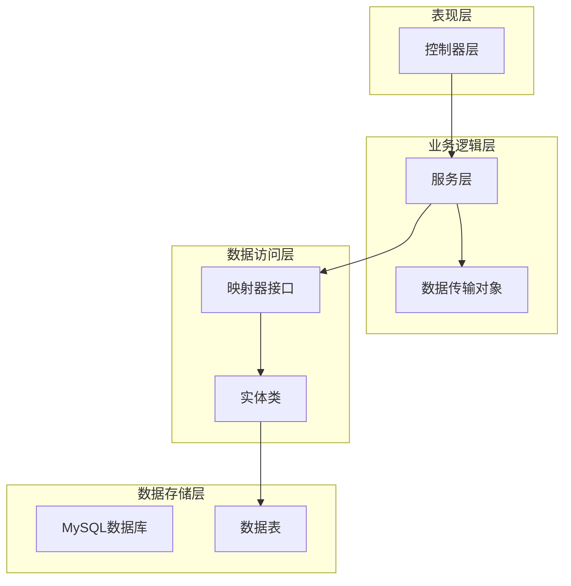
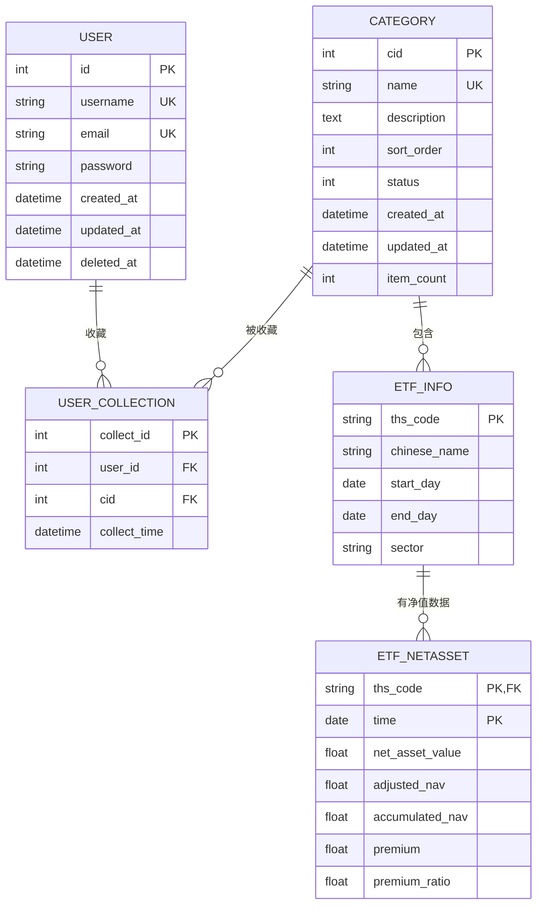
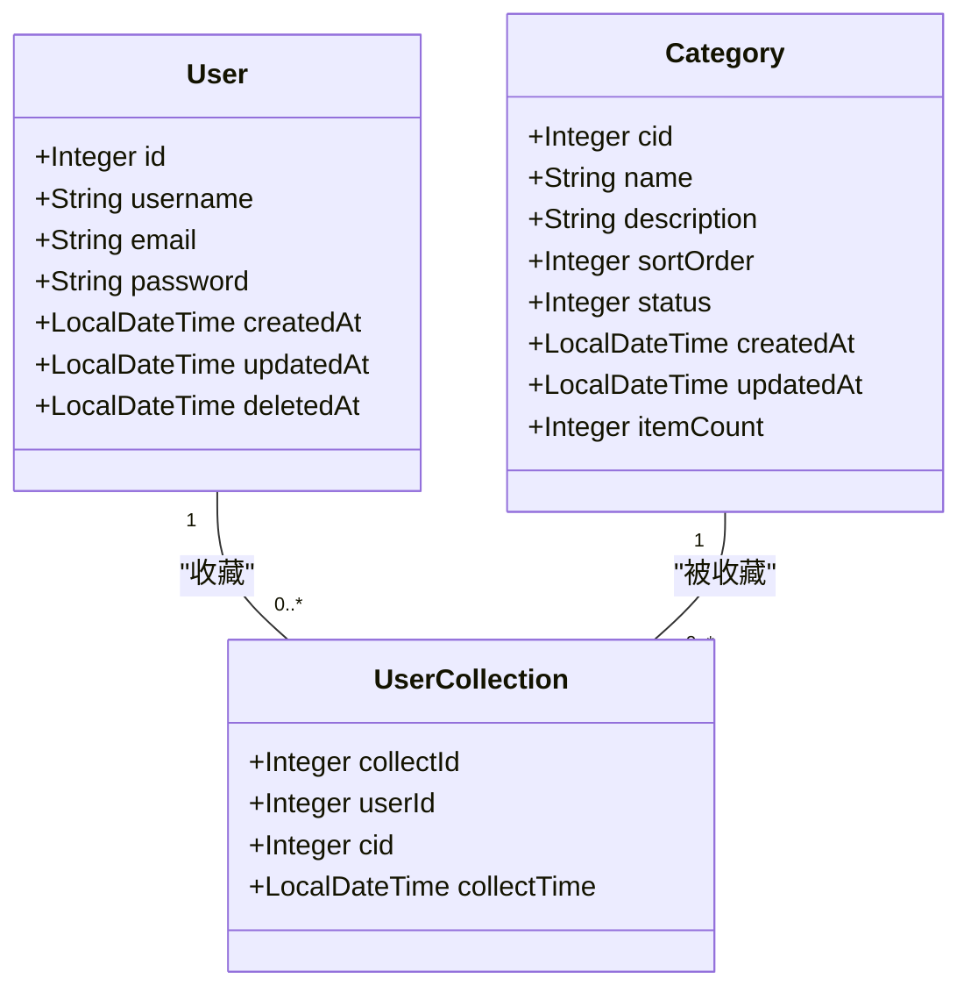
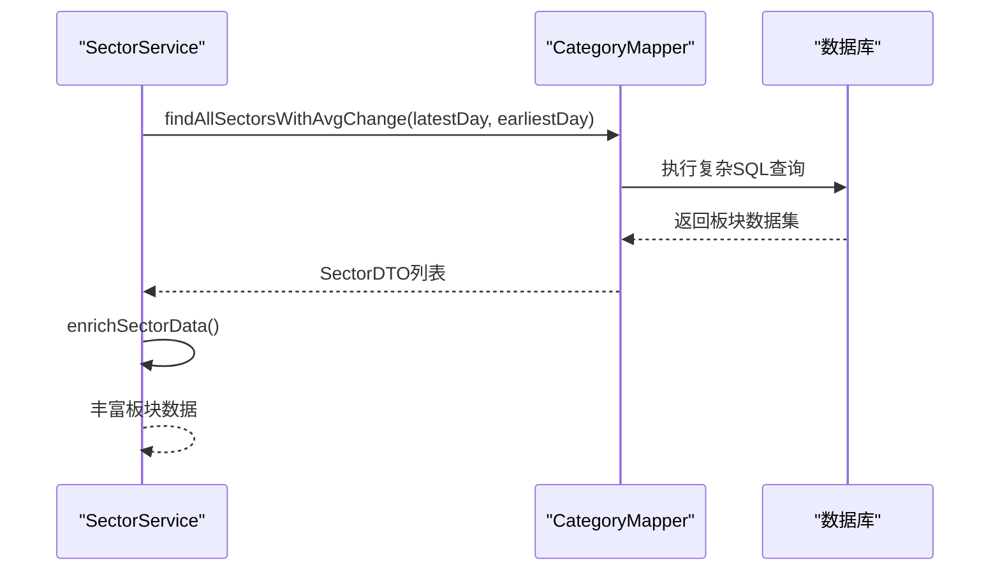
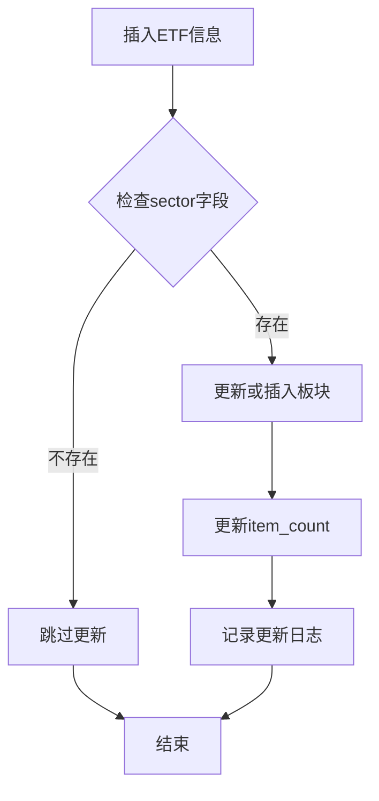
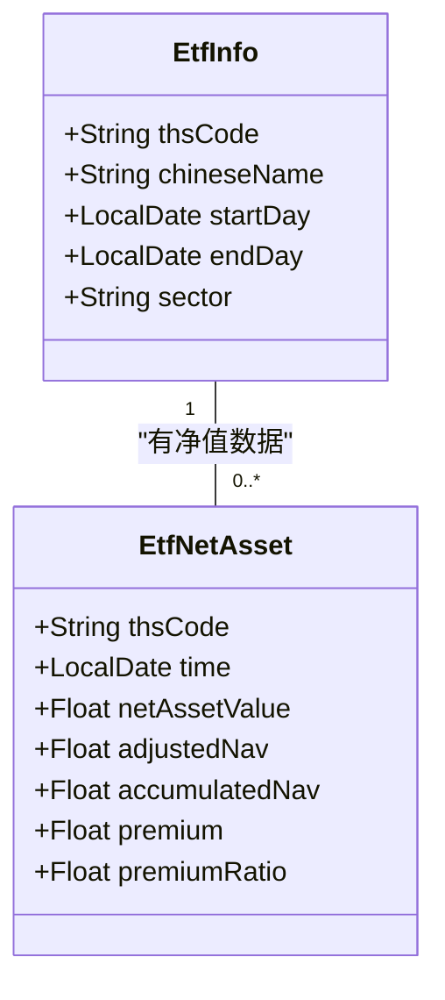
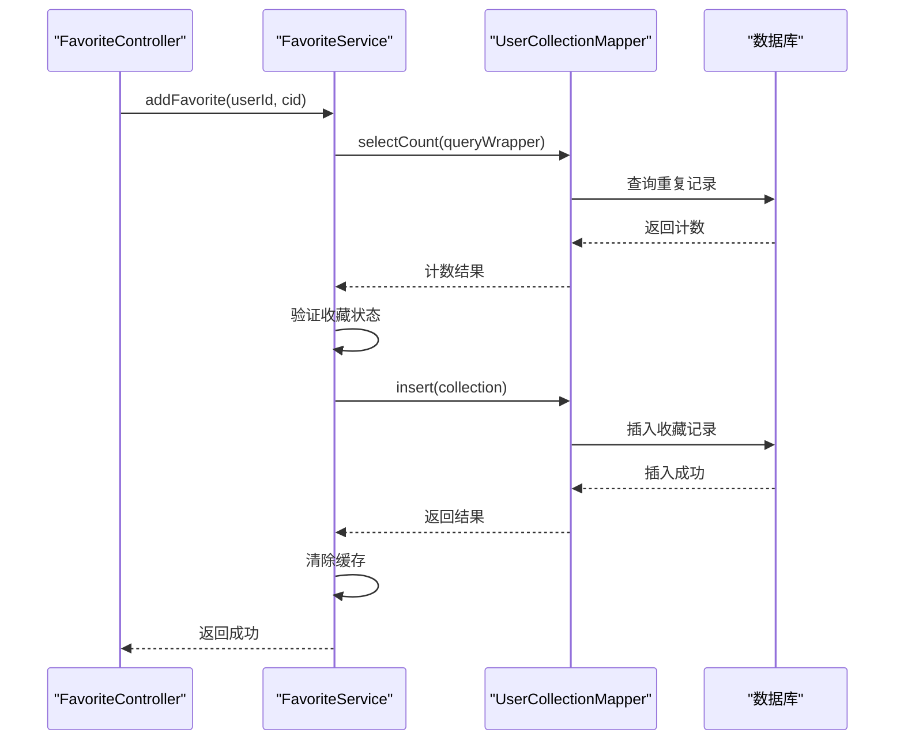
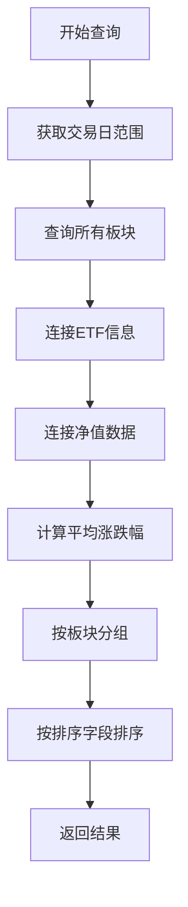
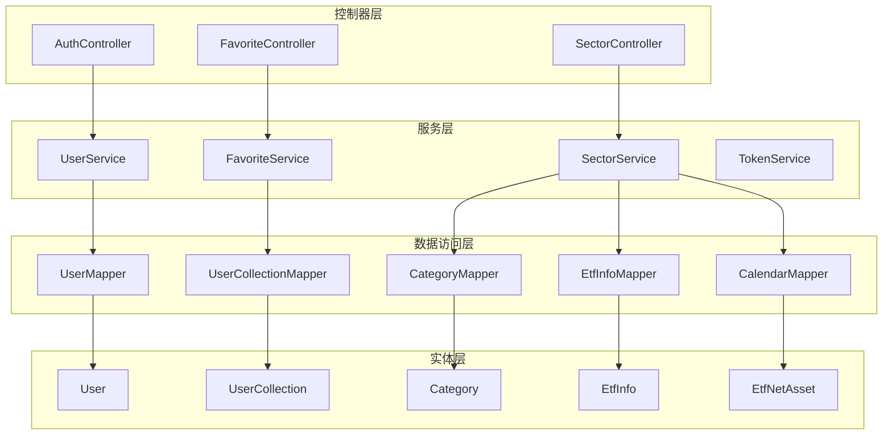

# 实体关系模型

<cite>
**本文档引用的文件**
- [User.java](file://backend/src/main/java/com/freetrader/entity/User.java)
- [UserCollection.java](file://backend/src/main/java/com/freetrader/entity/UserCollection.java)
- [Category.java](file://backend/src/main/java/com/freetrader/entity/Category.java)
- [EtfInfo.java](file://backend/src/main/java/com/freetrader/entity/EtfInfo.java)
- [EtfNetAsset.java](file://backend/src/main/java/com/freetrader/entity/EtfNetAsset.java)
- [user_info.sql](file://sql/user_info.sql)
- [user_collection.sql](file://sql/user_collection.sql)
- [category.sql](file://sql/category.sql)
- [etf_info.sql](file://sql/etf_info.sql)
- [etf_netasset.sql](file://sql/etf_netasset.sql)
- [FavoriteService.java](file://backend/src/main/java/com/freetrader/service/FavoriteService.java)
- [SectorService.java](file://backend/src/main/java/com/freetrader/service/SectorService.java)
- [UserCollectionMapper.java](file://backend/src/main/java/com/freetrader/mapper/UserCollectionMapper.java)
- [CategoryMapper.java](file://backend/src/main/java/com/freetrader/mapper/CategoryMapper.java)
- [EtfInfoMapper.java](file://backend/src/main/java/com/freetrader/mapper/EtfInfoMapper.java)
</cite>

## 目录
1. [简介](#简介)
2. [项目结构](#项目结构)
3. [核心实体](#核心实体)
4. [架构概览](#架构概览)
5. [详细组件分析](#详细组件分析)
6. [依赖关系分析](#依赖关系分析)
7. [性能考虑](#性能考虑)
8. [故障排除指南](#故障排除指南)
9. [结论](#结论)

## 简介

FreeTrader 项目是一个基于 Java Spring Boot 的金融数据管理系统，专注于 ETF（交易型开放式指数基金）板块数据的展示和管理。本项目实现了完整的实体关系模型，包括用户管理、板块分类、ETF 信息管理和净值数据追踪等功能。

系统采用 MySQL 数据库，通过 MyBatis-Plus 进行数据持久化操作，实现了复杂的数据关系管理和业务逻辑处理。本文档将详细分析系统的实体关系模型，包括各种关系类型、外键约束设计、级联行为以及数据一致性保证机制。

## 项目结构

FreeTrader 项目采用标准的分层架构设计，主要包含以下层次：

**图表来源**
- [User.java](file://backend/src/main/java/com/freetrader/entity/User.java#L1-L29)
- [Category.java](file://backend/src/main/java/com/freetrader/entity/Category.java#L1-L45)
- [EtfInfo.java](file://backend/src/main/java/com/freetrader/entity/EtfInfo.java#L1-L24)

**章节来源**
- [User.java](file://backend/src/main/java/com/freetrader/entity/User.java#L1-L29)
- [UserCollection.java](file://backend/src/main/java/com/freetrader/entity/UserCollection.java#L1-L23)
- [Category.java](file://backend/src/main/java/com/freetrader/entity/Category.java#L1-L45)
- [EtfInfo.java](file://backend/src/main/java/com/freetrader/entity/EtfInfo.java#L1-L24)
- [EtfNetAsset.java](file://backend/src/main/java/com/freetrader/entity/EtfNetAsset.java#L1-L26)

## 核心实体

系统包含五个核心实体，每个实体都承载着特定的业务职责：

### 用户实体 (User)
用户实体是系统的基础身份认证实体，负责存储用户的基本信息和账户状态。

### 用户收藏实体 (UserCollection)
用户收藏实体实现了用户与板块之间的多对多关系，通过中间表管理用户收藏的板块信息。

### 板块实体 (Category)
板块实体代表 ETF 分类体系，支持动态分类管理和统计功能。

### ETF 信息实体 (EtfInfo)
ETF 信息实体存储具体的 ETF 基金信息，包括代码、名称和所属板块等属性。

### 净值数据实体 (EtfNetAsset)
净值数据实体记录 ETF 的历史净值数据，支持按日期查询和分析。

**章节来源**
- [User.java](file://backend/src/main/java/com/freetrader/entity/User.java#L10-L28)
- [UserCollection.java](file://backend/src/main/java/com/freetrader/entity/UserCollection.java#L11-L22)
- [Category.java](file://backend/src/main/java/com/freetrader/entity/Category.java#L12-L44)
- [EtfInfo.java](file://backend/src/main/java/com/freetrader/entity/EtfInfo.java#L9-L23)
- [EtfNetAsset.java](file://backend/src/main/java/com/freetrader/entity/EtfNetAsset.java#L8-L25)

## 架构概览

系统采用经典的三层架构模式，通过清晰的职责分离实现松耦合的设计：

**图表来源**
- [user_info.sql](file://sql/user_info.sql#L24-L35)
- [user_collection.sql](file://sql/user_collection.sql#L24-L34)
- [category.sql](file://sql/category.sql#L24-L36)
- [etf_info.sql](file://sql/etf_info.sql#L24-L33)
- [etf_netasset.sql](file://sql/etf_netasset.sql#L24-L34)

## 详细组件分析

### 用户与用户收藏关系

用户与用户收藏之间存在典型的一对多关系：一个用户可以收藏多个板块，但每个板块只能被单个用户收藏一次。

**图表来源**
- [User.java](file://backend/src/main/java/com/freetrader/entity/User.java#L14-L15)
- [UserCollection.java](file://backend/src/main/java/com/freetrader/entity/UserCollection.java#L14-L19)
- [Category.java](file://backend/src/main/java/com/freetrader/entity/Category.java#L15-L16)

这种关系通过外键约束实现数据完整性：

- `user_collection.user_id` 引用 `user_info.id`
- `user_collection.cid` 引用 `category.cid`
- 复合唯一约束确保用户不能重复收藏同一板块

**章节来源**
- [UserCollection.java](file://backend/src/main/java/com/freetrader/entity/UserCollection.java#L11-L22)
- [user_collection.sql](file://sql/user_collection.sql#L26-L33)

### 板块与ETF信息关系

板块与ETF信息之间存在一对多关系：一个板块可以包含多个ETF基金，但每个ETF只能属于一个板块。

**图表来源**
- [SectorService.java](file://backend/src/main/java/com/freetrader/service/SectorService.java#L124-L141)
- [CategoryMapper.java](file://backend/src/main/java/com/freetrader/mapper/CategoryMapper.java#L19-L46)

这种关系通过触发器实现自动维护：

**图表来源**
- [etf_info.sql](file://sql/etf_info.sql#L40-L52)

**章节来源**
- [Category.java](file://backend/src/main/java/com/freetrader/entity/Category.java#L30-L31)
- [EtfInfo.java](file://backend/src/main/java/com/freetrader/entity/EtfInfo.java#L22-L23)
- [etf_info.sql](file://sql/etf_info.sql#L38-L54)

### ETF信息与净值数据关系

ETF信息与净值数据之间存在一对多关系：每个ETF可以有多个历史净值记录，每条记录对应特定日期。

**图表来源**
- [EtfInfo.java](file://backend/src/main/java/com/freetrader/entity/EtfInfo.java#L13-L14)
- [EtfNetAsset.java](file://backend/src/main/java/com/freetrader/entity/EtfNetAsset.java#L12-L14)

**章节来源**
- [EtfNetAsset.java](file://backend/src/main/java/com/freetrader/entity/EtfNetAsset.java#L8-L25)
- [etf_netasset.sql](file://sql/etf_netasset.sql#L24-L34)

### 外键约束设计与维护策略

系统采用严格的外键约束确保数据一致性：

#### 级联删除行为
- 用户删除时：通过 `ON DELETE CASCADE` 自动删除该用户的所有收藏记录
- 板块删除时：通过 `ON DELETE CASCADE` 自动删除该板块下的所有收藏记录

#### 级联更新行为
- 外键更新时：使用 `ON UPDATE RESTRICT` 防止意外的数据不一致

#### 索引优化策略
- 用户收藏表：复合唯一索引 `(user_id, cid)` 防止重复收藏
- 板块表：状态字段索引支持快速筛选
- ETF表：主键索引和分类索引优化查询性能

**章节来源**
- [user_collection.sql](file://sql/user_collection.sql#L30-L33)
- [category.sql](file://sql/category.sql#L34-L35)
- [etf_info.sql](file://sql/etf_info.sql#L31-L32)
- [etf_netasset.sql](file://sql/etf_netasset.sql#L32-L33)

### 业务逻辑中的实体关系体现

系统通过多种服务层组件体现实体关系：

#### 收藏管理流程

**图表来源**
- [FavoriteService.java](file://backend/src/main/java/com/freetrader/service/FavoriteService.java#L46-L66)
- [UserCollectionMapper.java](file://backend/src/main/java/com/freetrader/mapper/UserCollectionMapper.java#L17-L18)

#### 板块数据聚合流程

**图表来源**
- [CategoryMapper.java](file://backend/src/main/java/com/freetrader/mapper/CategoryMapper.java#L19-L46)

**章节来源**
- [FavoriteService.java](file://backend/src/main/java/com/freetrader/service/FavoriteService.java#L34-L41)
- [SectorService.java](file://backend/src/main/java/com/freetrader/service/SectorService.java#L109-L119)

## 依赖关系分析

系统各层之间的依赖关系体现了清晰的架构设计：

**图表来源**
- [FavoriteService.java](file://backend/src/main/java/com/freetrader/service/FavoriteService.java#L27-L29)
- [SectorService.java](file://backend/src/main/java/com/freetrader/service/SectorService.java#L32-L36)

**章节来源**
- [FavoriteService.java](file://backend/src/main/java/com/freetrader/service/FavoriteService.java#L1-L119)
- [SectorService.java](file://backend/src/main/java/com/freetrader/service/SectorService.java#L1-L253)

## 性能考虑

系统在设计时充分考虑了性能优化：

### 查询优化
- 使用复合索引减少重复查询
- 通过缓存机制降低数据库压力
- 合理的 SQL 查询结构避免 N+1 问题

### 缓存策略
- 用户收藏缓存：5分钟有效期
- 板块数据缓存：提升查询性能
- 缓存失效机制确保数据一致性

### 数据库优化
- 触发器自动维护统计数据
- 合理的索引设计支持高频查询
- 外键约束保证数据完整性

## 故障排除指南

### 常见问题及解决方案

#### 收藏重复问题
**症状**：用户尝试重复收藏同一板块时报错
**原因**：复合唯一约束防止重复收藏
**解决**：使用切换收藏功能而非重复添加

#### 外键约束错误
**症状**：删除用户或板块时报外键约束错误
**原因**：存在相关记录导致约束冲突
**解决**：先删除相关收藏记录，再删除主记录

#### 性能问题
**症状**：板块查询响应缓慢
**原因**：缺少必要的索引或缓存未生效
**解决**：检查索引配置，清理缓存后重试

**章节来源**
- [FavoriteService.java](file://backend/src/main/java/com/freetrader/service/FavoriteService.java#L54-L56)
- [FavoriteService.java](file://backend/src/main/java/com/freetrader/service/FavoriteService.java#L78-L80)

## 结论

FreeTrader 项目的实体关系模型设计合理，通过清晰的层次结构和严格的约束机制实现了良好的数据一致性。系统采用的触发器自动维护机制、缓存策略和索引优化确保了高性能的业务处理能力。

主要特点包括：
- 完整的实体关系设计，涵盖用户、收藏、板块、ETF和净值数据
- 严格的外键约束和级联行为保证数据完整性
- 智能的触发器机制自动维护统计数据
- 高效的缓存和索引策略优化查询性能
- 清晰的服务层架构便于扩展和维护

该设计为金融数据管理场景提供了可靠的基础设施，能够支持复杂的业务需求和高并发访问场景。