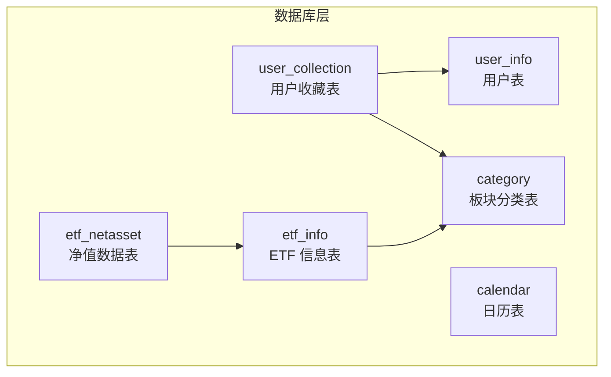
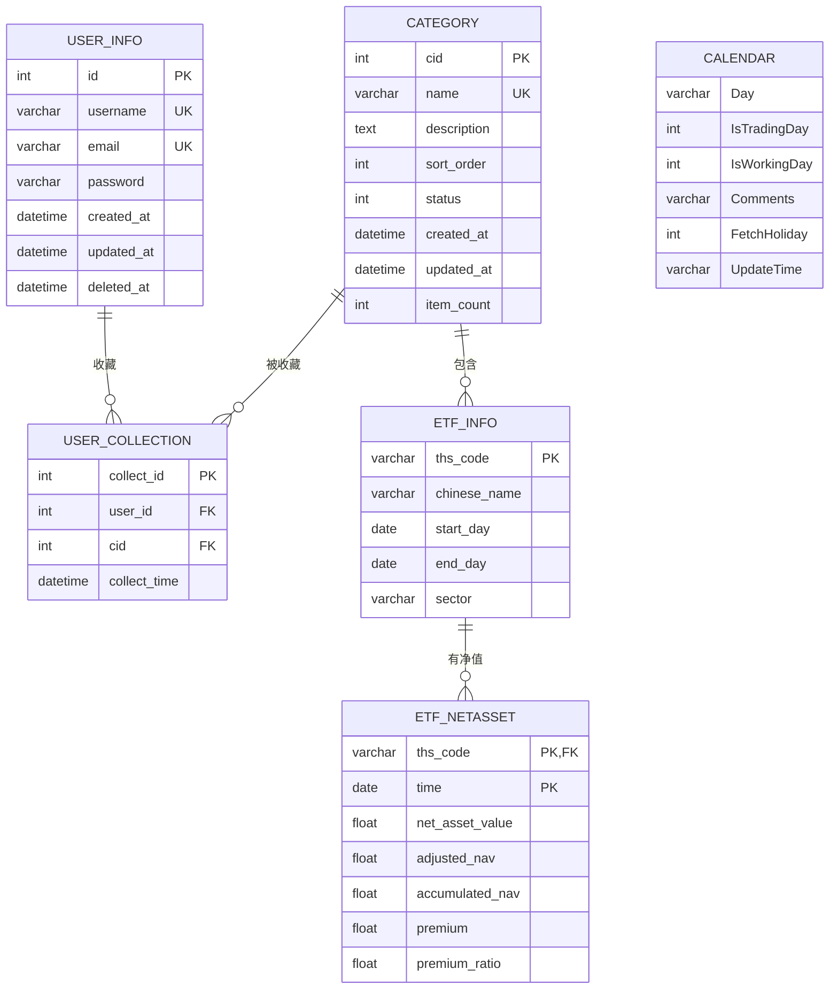
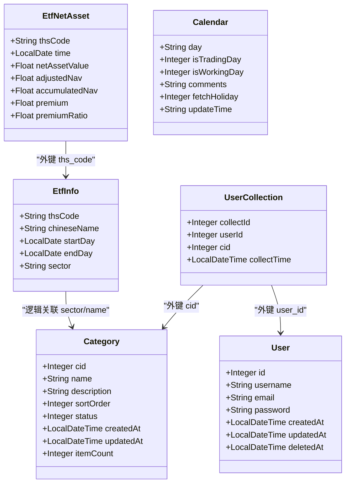

# 数据库设计

<cite>
**本文引用的文件**
- [sql/user_info.sql](file://sql/user_info.sql)
- [sql/category.sql](file://sql/category.sql)
- [sql/etf_info.sql](file://sql/etf_info.sql)
- [sql/user_collection.sql](file://sql/user_collection.sql)
- [sql/etf_netasset.sql](file://sql/etf_netasset.sql)
- [sql/calendar.sql](file://sql/calendar.sql)
- [backend/src/main/java/com/freetrader/entity/User.java](file://backend/src/main/java/com/freetrader/entity/User.java)
- [backend/src/main/java/com/freetrader/entity/Category.java](file://backend/src/main/java/com/freetrader/entity/Category.java)
- [backend/src/main/java/com/freetrader/entity/EtfInfo.java](file://backend/src/main/java/com/freetrader/entity/EtfInfo.java)
- [backend/src/main/java/com/freetrader/entity/UserCollection.java](file://backend/src/main/java/com/freetrader/entity/UserCollection.java)
- [backend/src/main/java/com/freetrader/entity/EtfNetAsset.java](file://backend/src/main/java/com/freetrader/entity/EtfNetAsset.java)
- [backend/src/main/java/com/freetrader/entity/Calendar.java](file://backend/src/main/java/com/freetrader/entity/Calendar.java)
- [backend/src/main/java/com/freetrader/mapper/CategoryMapper.java](file://backend/src/main/java/com/freetrader/mapper/CategoryMapper.java)
- [backend/src/main/java/com/freetrader/mapper/EtfInfoMapper.java](file://backend/src/main/java/com/freetrader/mapper/EtfInfoMapper.java)
- [backend/src/main/java/com/freetrader/mapper/UserCollectionMapper.java](file://backend/src/main/java/com/freetrader/mapper/UserCollectionMapper.java)
- [backend/src/main/java/com/freetrader/mapper/EtfNetAssetMapper.java](file://backend/src/main/java/com/freetrader/mapper/EtfNetAssetMapper.java)
- [backend/src/main/java/com/freetrader/mapper/UserMapper.java](file://backend/src/main/java/com/freetrader/mapper/UserMapper.java)
</cite>

## 目录
1. [简介](#简介)
2. [项目结构](#项目结构)
3. [核心组件](#核心组件)
4. [架构总览](#架构总览)
5. [详细组件分析](#详细组件分析)
6. [依赖分析](#依赖分析)
7. [性能考量](#性能考量)
8. [故障排查指南](#故障排查指南)
9. [结论](#结论)
10. [附录](#附录)

## 简介
本文件面向数据库管理员与开发者，系统化梳理 FreeTrader 项目的数据库设计，覆盖用户、板块分类、ETF 信息、用户收藏、净值数据与日历等表的结构、主键与索引策略、数据类型与约束、实体关系模型、数据访问模式与查询优化，并给出数据迁移与版本管理建议。

## 项目结构
后端采用 Spring Boot + MyBatis-Plus 架构，数据库层通过实体类与 Mapper 接口映射到 SQL 表。数据库对象主要分布在以下 SQL 文件中：
- 用户表：user_info
- 板块分类表：category
- ETF 信息表：etf_info
- 用户收藏表：user_collection
- 净值数据表：etf_netasset
- 日历表：calendar

图表来源
- [sql/user_info.sql](file://sql/user_info.sql#L24-L35)
- [sql/category.sql](file://sql/category.sql#L24-L36)
- [sql/etf_info.sql](file://sql/etf_info.sql#L24-L33)
- [sql/user_collection.sql](file://sql/user_collection.sql#L24-L34)
- [sql/etf_netasset.sql](file://sql/etf_netasset.sql#L24-L34)
- [sql/calendar.sql](file://sql/calendar.sql#L24-L31)

章节来源
- [sql/user_info.sql](file://sql/user_info.sql#L24-L35)
- [sql/category.sql](file://sql/category.sql#L24-L36)
- [sql/etf_info.sql](file://sql/etf_info.sql#L24-L33)
- [sql/user_collection.sql](file://sql/user_collection.sql#L24-L34)
- [sql/etf_netasset.sql](file://sql/etf_netasset.sql#L24-L34)
- [sql/calendar.sql](file://sql/calendar.sql#L24-L31)

## 核心组件
- 用户表 user_info：存储用户身份与认证信息，含唯一用户名与邮箱索引，支持软删除字段。
- 板块分类表 category：存储行业/主题板块信息，含排序权重、状态与计数字段，支持按状态快速筛选。
- ETF 信息表 etf_info：以 Ths 代码为主键，记录中文名称、起止日期与所属板块；配合触发器维护分类计数。
- 用户收藏表 user_collection：记录用户对板块的收藏，唯一性约束防止重复收藏，外键级联删除保证数据一致性。
- 净值数据表 etf_netasset：复合主键（Ths 代码 + 交易日），记录单位净值、复权净值、贴水等指标。
- 日历表 calendar：记录交易日/工作日标记与更新信息，支撑回测与收益计算的时间维度。

章节来源
- [backend/src/main/java/com/freetrader/entity/User.java](file://backend/src/main/java/com/freetrader/entity/User.java#L10-L28)
- [backend/src/main/java/com/freetrader/entity/Category.java](file://backend/src/main/java/com/freetrader/entity/Category.java#L11-L44)
- [backend/src/main/java/com/freetrader/entity/EtfInfo.java](file://backend/src/main/java/com/freetrader/entity/EtfInfo.java#L9-L23)
- [backend/src/main/java/com/freetrader/entity/UserCollection.java](file://backend/src/main/java/com/freetrader/entity/UserCollection.java#L10-L22)
- [backend/src/main/java/com/freetrader/entity/EtfNetAsset.java](file://backend/src/main/java/com/freetrader/entity/EtfNetAsset.java#L8-L25)
- [backend/src/main/java/com/freetrader/entity/Calendar.java](file://backend/src/main/java/com/freetrader/entity/Calendar.java#L6-L21)

## 架构总览
下图展示各表之间的实体关系与约束：

图表来源
- [sql/user_info.sql](file://sql/user_info.sql#L24-L35)
- [sql/category.sql](file://sql/category.sql#L24-L36)
- [sql/etf_info.sql](file://sql/etf_info.sql#L24-L33)
- [sql/user_collection.sql](file://sql/user_collection.sql#L24-L34)
- [sql/etf_netasset.sql](file://sql/etf_netasset.sql#L24-L34)
- [sql/calendar.sql](file://sql/calendar.sql#L24-L31)

## 详细组件分析

### 用户表 user_info
- 主键设计：自增整型 id。
- 唯一性约束：username、email 唯一索引，避免重复注册。
- 字段说明：
  - id：用户唯一标识。
  - username：登录名。
  - email：登录与找回密码使用。
  - password：建议存储加密值。
  - created_at、updated_at：记录创建与更新时间。
  - deleted_at：软删除标记。
- 索引策略：唯一索引 uk_username、uk_email；结合业务查询（按用户名/邮箱登录）优化。
- 数据类型与约束：字符串使用 utf8mb4，长度合理；时间字段使用 datetime；软删除字段允许为空。

章节来源
- [sql/user_info.sql](file://sql/user_info.sql#L24-L35)
- [backend/src/main/java/com/freetrader/entity/User.java](file://backend/src/main/java/com/freetrader/entity/User.java#L10-L28)

### 板块分类表 category
- 主键设计：自增整型 cid。
- 唯一性约束：name 唯一索引，避免重复分类。
- 字段说明：
  - cid：分类唯一标识。
  - name：分类名称（与 etf_info.sector 对应）。
  - description：分类描述。
  - sort_order：排序权重，数值越大越靠前。
  - status：状态（1 启用，0 禁用），支持逻辑删除。
  - item_count：该分类下的 ETF 数量，由触发器维护。
  - created_at、updated_at：时间戳。
- 索引策略：idx_status 便于筛选启用/禁用分类；uk_name 保证名称唯一。
- 触发器联动：在 etf_info 插入/更新/删除时自动维护 item_count 并按需新增分类。

章节来源
- [sql/category.sql](file://sql/category.sql#L24-L36)
- [backend/src/main/java/com/freetrader/entity/Category.java](file://backend/src/main/java/com/freetrader/entity/Category.java#L11-L44)
- [sql/etf_info.sql](file://sql/etf_info.sql#L38-L105)

### ETF 信息表 etf_info
- 主键设计：varchar 类型的 ths_code（Ths 基金代码）。
- 外键关系：sector 字段与 category.name 关联（逻辑关联，无外键约束）。
- 字段说明：
  - ths_code：主键。
  - chinese_name：中文名称。
  - start_day/end_day：存续期起止日期。
  - sector：所属板块名称，与 category.name 对应。
- 索引策略：idx_etf_id、idx_etf_category 用于按代码与板块检索。
- 触发器机制：插入/更新/删除时自动维护对应板块的 item_count；若板块不存在则自动插入。

章节来源
- [sql/etf_info.sql](file://sql/etf_info.sql#L24-L33)
- [backend/src/main/java/com/freetrader/entity/EtfInfo.java](file://backend/src/main/java/com/freetrader/entity/EtfInfo.java#L9-L23)

### 用户收藏表 user_collection
- 主键设计：自增整型 collect_id。
- 唯一性约束：uk_user_cid 防止同一用户重复收藏同一板块。
- 外键关系：
  - fk_collection_user → user_info(id)，级联删除。
  - fk_collection_category → category(cid)，级联删除。
- 字段说明：
  - collect_id：收藏记录唯一标识。
  - user_id：收藏用户。
  - cid：被收藏的板块。
  - collect_time：收藏时间。
- 索引策略：idx_cid 便于按板块查询收藏用户；uk_user_cid 防重。

章节来源
- [sql/user_collection.sql](file://sql/user_collection.sql#L24-L34)
- [backend/src/main/java/com/freetrader/entity/UserCollection.java](file://backend/src/main/java/com/freetrader/entity/UserCollection.java#L10-L22)

### 净值数据表 etf_netasset
- 主键设计：复合主键（ths_code, time）。
- 字段说明：
  - ths_code：ETF 代码。
  - time：交易日。
  - net_asset_value：单位净值。
  - adjusted_nav：复权单位净值。
  - accumulated_nav：累计单位净值。
  - premium：贴水。
  - premium_ratio：贴水率。
- 索引策略：idx_etf_time 优化按 ETF+日期范围的查询。

章节来源
- [sql/etf_netasset.sql](file://sql/etf_netasset.sql#L24-L34)
- [backend/src/main/java/com/freetrader/entity/EtfNetAsset.java](file://backend/src/main/java/com/freetrader/entity/EtfNetAsset.java#L8-L25)

### 日历表 calendar
- 设计说明：记录交易日/工作日标记与更新信息，字段为字符串或整型，便于直接映射。
- 使用场景：支撑收益计算与回测的时间窗口选择。

章节来源
- [sql/calendar.sql](file://sql/calendar.sql#L24-L31)
- [backend/src/main/java/com/freetrader/entity/Calendar.java](file://backend/src/main/java/com/freetrader/entity/Calendar.java#L6-L21)

## 依赖分析
- 实体类与表映射：
  - User ↔ user_info
  - Category ↔ category
  - EtfInfo ↔ etf_info
  - UserCollection ↔ user_collection
  - EtfNetAsset ↔ etf_netasset
  - Calendar ↔ calendar
- 查询依赖：
  - CategoryMapper.findAllSectorsWithAvgChange：跨表聚合计算板块平均涨跌幅。
  - EtfInfoMapper.findTopEtfsBySector：按板块筛选并排序 ETF。
  - UserCollectionMapper.findFavoriteCidsByUserId：按用户查询收藏板块 ID 列表。
- 外键与触发器：
  - user_collection 的两个外键约束保证级联删除。
  - etf_info 的触发器自动维护 category.item_count 并按需新增分类。

图表来源
- [backend/src/main/java/com/freetrader/entity/User.java](file://backend/src/main/java/com/freetrader/entity/User.java#L10-L28)
- [backend/src/main/java/com/freetrader/entity/Category.java](file://backend/src/main/java/com/freetrader/entity/Category.java#L11-L44)
- [backend/src/main/java/com/freetrader/entity/EtfInfo.java](file://backend/src/main/java/com/freetrader/entity/EtfInfo.java#L9-L23)
- [backend/src/main/java/com/freetrader/entity/UserCollection.java](file://backend/src/main/java/com/freetrader/entity/UserCollection.java#L10-L22)
- [backend/src/main/java/com/freetrader/entity/EtfNetAsset.java](file://backend/src/main/java/com/freetrader/entity/EtfNetAsset.java#L8-L25)
- [backend/src/main/java/com/freetrader/entity/Calendar.java](file://backend/src/main/java/com/freetrader/entity/Calendar.java#L6-L21)

章节来源
- [backend/src/main/java/com/freetrader/mapper/CategoryMapper.java](file://backend/src/main/java/com/freetrader/mapper/CategoryMapper.java#L19-L46)
- [backend/src/main/java/com/freetrader/mapper/EtfInfoMapper.java](file://backend/src/main/java/com/freetrader/mapper/EtfInfoMapper.java#L18-L51)
- [backend/src/main/java/com/freetrader/mapper/UserCollectionMapper.java](file://backend/src/main/java/com/freetrader/mapper/UserCollectionMapper.java#L17-L18)

## 性能考量
- 索引策略
  - user_info：uk_username、uk_email 保障登录与注册场景高效去重与查找。
  - category：idx_status 支持按启用/禁用快速筛选；uk_name 防止重复。
  - etf_info：idx_etf_id、idx_etf_category 提升按代码与板块的检索效率。
  - user_collection：uk_user_cid 防重；idx_cid 支持按板块查收藏用户。
  - etf_netasset：idx_etf_time 优化按 ETF 与日期范围的查询。
- 复合主键与分区
  - etf_netasset 使用复合主键（ths_code, time），天然支持按 ETF 聚合与按时间切片查询。
- 触发器与写入放大
  - etf_info 的触发器在插入/更新/删除时维护 category.item_count，注意批量写入时的触发器开销。
- 查询优化
  - CategoryMapper 与 EtfInfoMapper 使用 JOIN + CASE/COALESCE 计算涨跌幅，建议在 etf_netasset 上确保 ths_code 与 time 的索引命中。
  - UserCollectionMapper 的简单查询可通过 idx_cid 与 uk_user_cid 优化。

章节来源
- [sql/user_info.sql](file://sql/user_info.sql#L32-L34)
- [sql/category.sql](file://sql/category.sql#L33-L35)
- [sql/etf_info.sql](file://sql/etf_info.sql#L31-L32)
- [sql/user_collection.sql](file://sql/user_collection.sql#L29-L33)
- [sql/etf_netasset.sql](file://sql/etf_netasset.sql#L32-L33)
- [backend/src/main/java/com/freetrader/mapper/CategoryMapper.java](file://backend/src/main/java/com/freetrader/mapper/CategoryMapper.java#L19-L46)
- [backend/src/main/java/com/freetrader/mapper/EtfInfoMapper.java](file://backend/src/main/java/com/freetrader/mapper/EtfInfoMapper.java#L18-L51)
- [backend/src/main/java/com/freetrader/mapper/UserCollectionMapper.java](file://backend/src/main/java/com/freetrader/mapper/UserCollectionMapper.java#L17-L18)

## 故障排查指南
- 登录/注册失败
  - 检查 user_info 是否存在重复 username 或 email；确认 uk_username、uk_email 索引是否生效。
- 收藏失败（重复收藏）
  - 检查 uk_user_cid 唯一性约束是否触发；确认用户 ID 与板块 ID 是否正确。
- 板块涨跌幅统计异常
  - 检查 etf_netasset 中是否存在缺失的日期或空值；确认 latest 与 earliest 的日期参数是否有效。
- 分类计数不准确
  - 检查 etf_info 的触发器是否正常执行；确认 sector 名称大小写与 category.name 是否一致。
- 性能问题
  - 对高频查询（如按板块查询 ETF、按用户查询收藏）确认索引是否命中；关注触发器带来的写入延迟。

章节来源
- [sql/user_info.sql](file://sql/user_info.sql#L32-L34)
- [sql/user_collection.sql](file://sql/user_collection.sql#L29-L33)
- [sql/etf_info.sql](file://sql/etf_info.sql#L38-L105)
- [backend/src/main/java/com/freetrader/mapper/CategoryMapper.java](file://backend/src/main/java/com/freetrader/mapper/CategoryMapper.java#L19-L46)
- [backend/src/main/java/com/freetrader/mapper/EtfInfoMapper.java](file://backend/src/main/java/com/freetrader/mapper/EtfInfoMapper.java#L18-L51)

## 结论
本数据库设计围绕用户、板块、ETF、收藏与净值五大核心域构建，采用合理的主键与索引策略，结合触发器实现关键字段的自动维护，满足查询与统计需求。建议在生产环境中持续监控热点查询与写入路径，结合业务增长迭代索引与分区策略。

## 附录

### 数据字典与字段说明
- user_info
  - id：自增主键，用户唯一标识。
  - username：唯一，登录名。
  - email：唯一，登录与找回密码使用。
  - password：加密存储。
  - created_at、updated_at：记录创建与更新时间。
  - deleted_at：软删除标记。
- category
  - cid：自增主键，分类唯一标识。
  - name：唯一，分类名称。
  - description：分类描述。
  - sort_order：排序权重。
  - status：状态（1 启用，0 禁用）。
  - item_count：该分类下的 ETF 数量。
  - created_at、updated_at：时间戳。
- etf_info
  - ths_code：主键，ETF 代码。
  - chinese_name：中文名称。
  - start_day/end_day：存续期。
  - sector：所属板块名称。
- user_collection
  - collect_id：自增主键，收藏记录唯一标识。
  - user_id：外键，关联用户。
  - cid：外键，关联板块。
  - collect_time：收藏时间。
- etf_netasset
  - ths_code：主键，ETF 代码。
  - time：主键，交易日。
  - net_asset_value：单位净值。
  - adjusted_nav：复权单位净值。
  - accumulated_nav：累计单位净值。
  - premium：贴水。
  - premium_ratio：贴水率。
- calendar
  - Day：日期字符串。
  - IsTradingDay：是否交易日。
  - IsWorkingDay：是否工作日。
  - Comments：备注。
  - FetchHoliday：节假日标记。
  - UpdateTime：更新时间。

章节来源
- [sql/user_info.sql](file://sql/user_info.sql#L24-L35)
- [sql/category.sql](file://sql/category.sql#L24-L36)
- [sql/etf_info.sql](file://sql/etf_info.sql#L24-L33)
- [sql/user_collection.sql](file://sql/user_collection.sql#L24-L34)
- [sql/etf_netasset.sql](file://sql/etf_netasset.sql#L24-L34)
- [sql/calendar.sql](file://sql/calendar.sql#L24-L31)

### 数据访问模式与查询优化策略
- 实体映射
  - 所有实体类通过注解映射到对应表，遵循表名与字段命名约定。
- 查询模式
  - 聚合查询：CategoryMapper 通过 JOIN 与 CASE/COALESCE 计算板块平均涨跌幅。
  - 条件筛选：EtfInfoMapper 按板块筛选并排序 ETF。
  - 关联查询：UserCollectionMapper 获取用户收藏的板块 ID 列表。
- 优化建议
  - 在 etf_netasset 上确保 ths_code 与 time 的索引命中。
  - 控制触发器在批量写入时的额外开销。
  - 对高频查询建立合适的复合索引与物化视图（如需要）。

章节来源
- [backend/src/main/java/com/freetrader/entity/User.java](file://backend/src/main/java/com/freetrader/entity/User.java#L10-L28)
- [backend/src/main/java/com/freetrader/entity/Category.java](file://backend/src/main/java/com/freetrader/entity/Category.java#L11-L44)
- [backend/src/main/java/com/freetrader/entity/EtfInfo.java](file://backend/src/main/java/com/freetrader/entity/EtfInfo.java#L9-L23)
- [backend/src/main/java/com/freetrader/entity/UserCollection.java](file://backend/src/main/java/com/freetrader/entity/UserCollection.java#L10-L22)
- [backend/src/main/java/com/freetrader/entity/EtfNetAsset.java](file://backend/src/main/java/com/freetrader/entity/EtfNetAsset.java#L8-L25)
- [backend/src/main/java/com/freetrader/entity/Calendar.java](file://backend/src/main/java/com/freetrader/entity/Calendar.java#L6-L21)
- [backend/src/main/java/com/freetrader/mapper/CategoryMapper.java](file://backend/src/main/java/com/freetrader/mapper/CategoryMapper.java#L19-L46)
- [backend/src/main/java/com/freetrader/mapper/EtfInfoMapper.java](file://backend/src/main/java/com/freetrader/mapper/EtfInfoMapper.java#L18-L51)
- [backend/src/main/java/com/freetrader/mapper/UserCollectionMapper.java](file://backend/src/main/java/com/freetrader/mapper/UserCollectionMapper.java#L17-L18)

### 数据迁移与版本管理
- 迁移策略
  - 采用增量 SQL 脚本，先创建/变更表结构，再补充索引与触发器。
  - 对大表变更（如新增列、重建索引）建议分批执行并安排在低峰时段。
- 版本管理
  - 为每个版本生成独立脚本文件，记录变更内容与回滚方案。
  - 在触发器与索引变更时，明确依赖关系与执行顺序。
- 兼容性
  - 保持字段命名与实体类一致，避免破坏 MyBatis-Plus 映射。
  - 对历史数据进行校验与补全（如补齐 sector 与 item_count）。

章节来源
- [sql/user_info.sql](file://sql/user_info.sql#L1-L38)
- [sql/category.sql](file://sql/category.sql#L1-L39)
- [sql/etf_info.sql](file://sql/etf_info.sql#L1-L108)
- [sql/user_collection.sql](file://sql/user_collection.sql#L1-L37)
- [sql/etf_netasset.sql](file://sql/etf_netasset.sql#L1-L37)
- [sql/calendar.sql](file://sql/calendar.sql#L1-L34)