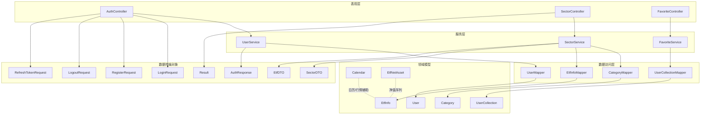
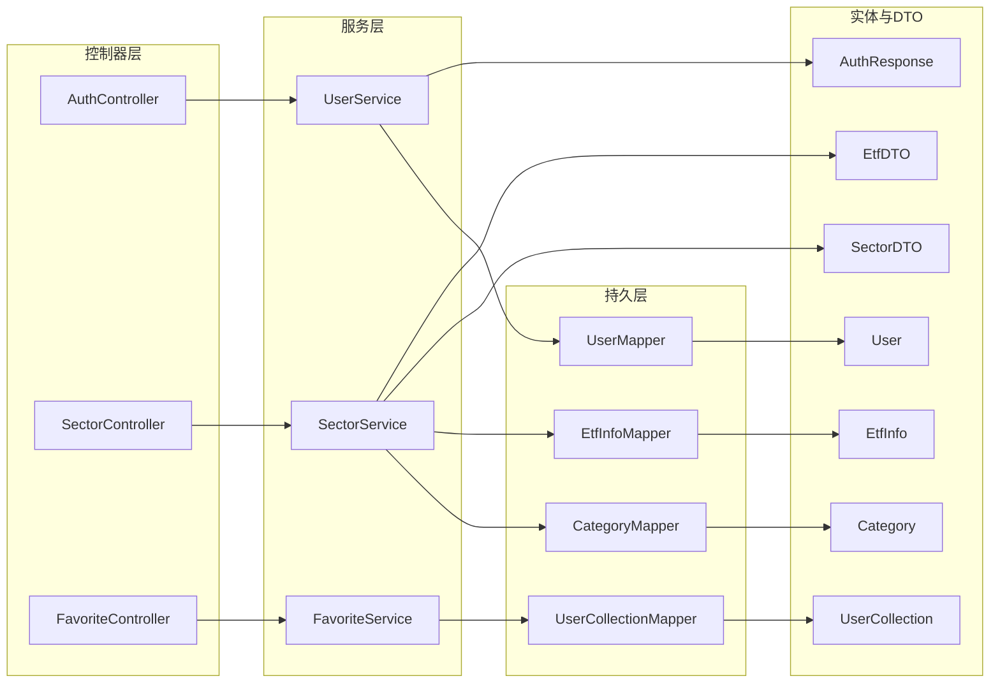
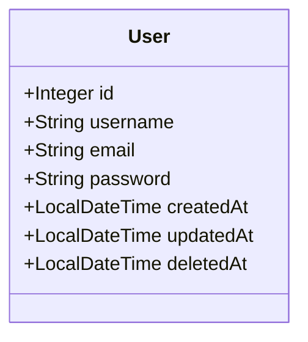
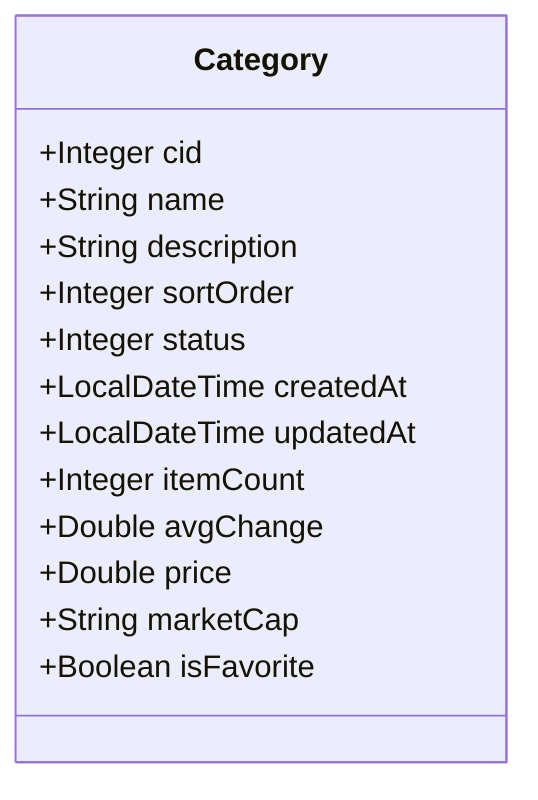
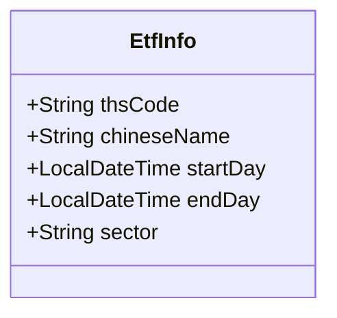
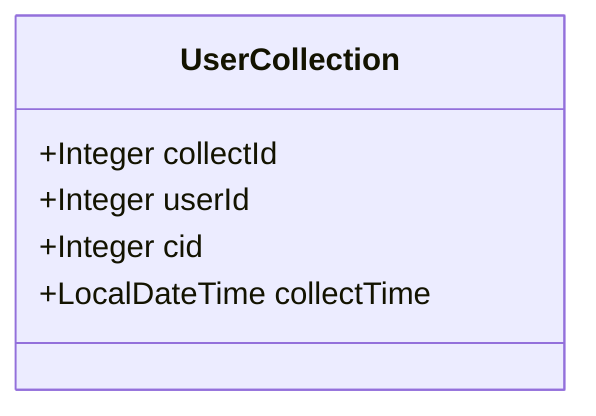
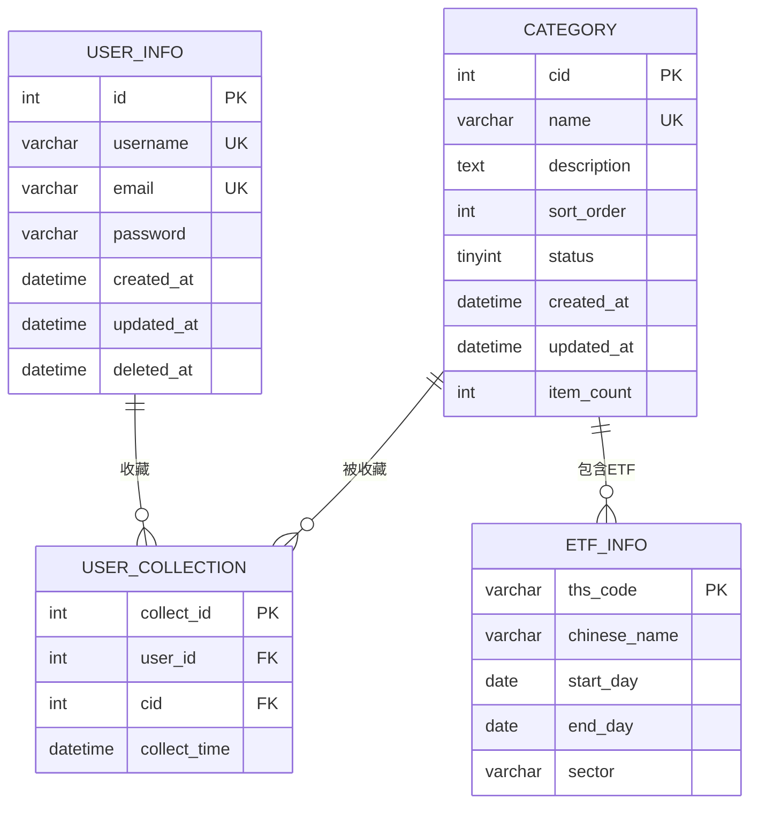

# 数据模型说明

<cite>
**本文引用的文件**
- [User.java](file://backend/src/main/java/com/freetrader/entity/User.java)
- [Category.java](file://backend/src/main/java/com/freetrader/entity/Category.java)
- [EtfInfo.java](file://backend/src/main/java/com/freetrader/entity/EtfInfo.java)
- [UserCollection.java](file://backend/src/main/java/com/freetrader/entity/UserCollection.java)
- [Calendar.java](file://backend/src/main/java/com/freetrader/entity/Calendar.java)
- [EtfNetAsset.java](file://backend/src/main/java/com/freetrader/entity/EtfNetAsset.java)
- [AuthResponse.java](file://backend/src/main/java/com/freetrader/dto/AuthResponse.java)
- [SectorDTO.java](file://backend/src/main/java/com/freetrader/dto/SectorDTO.java)
- [EtfDTO.java](file://backend/src/main/java/com/freetrader/dto/EtfDTO.java)
- [LoginRequest.java](file://backend/src/main/java/com/freetrader/dto/LoginRequest.java)
- [RegisterRequest.java](file://backend/src/main/java/com/freetrader/dto/RegisterRequest.java)
- [LogoutRequest.java](file://backend/src/main/java/com/freetrader/dto/LogoutRequest.java)
- [RefreshTokenRequest.java](file://backend/src/main/java/com/freetrader/dto/RefreshTokenRequest.java)
- [Result.java](file://backend/src/main/java/com/freetrader/dto/Result.java)
- [user_info.sql](file://sql/user_info.sql)
- [category.sql](file://sql/category.sql)
- [etf_info.sql](file://sql/etf_info.sql)
</cite>

## 目录
1. [简介](#简介)
2. [项目结构](#项目结构)
3. [核心组件](#核心组件)
4. [架构总览](#架构总览)
5. [详细组件分析](#详细组件分析)
6. [依赖分析](#依赖分析)
7. [性能考虑](#性能考虑)
8. [故障排查指南](#故障排查指南)
9. [结论](#结论)
10. [附录](#附录)

## 简介
本文件系统性梳理 FreeTrader 后端的数据模型设计，覆盖核心实体类（User、Category、EtfInfo、UserCollection 等）与数据传输对象（DTO，如 AuthResponse、SectorDTO、EtfDTO 等）的属性定义、业务含义、与数据库表的映射关系、数据验证规则与业务约束，并给出使用示例与最佳实践，帮助开发者在分层架构中清晰理解各层职责与数据流转。

## 项目结构
后端采用典型的分层架构：controller（控制器）、service（服务）、mapper（持久层）、entity（实体）、dto（数据传输对象）。数据模型主要分布在 entity 与 dto 包中，数据库表结构由 sql 目录下的建表脚本定义。

图表来源
- [User.java](file://backend/src/main/java/com/freetrader/entity/User.java#L1-L29)
- [Category.java](file://backend/src/main/java/com/freetrader/entity/Category.java#L1-L45)
- [EtfInfo.java](file://backend/src/main/java/com/freetrader/entity/EtfInfo.java#L1-L24)
- [UserCollection.java](file://backend/src/main/java/com/freetrader/entity/UserCollection.java#L1-L23)
- [Calendar.java](file://backend/src/main/java/com/freetrader/entity/Calendar.java#L1-L22)
- [EtfNetAsset.java](file://backend/src/main/java/com/freetrader/entity/EtfNetAsset.java#L1-L26)
- [AuthResponse.java](file://backend/src/main/java/com/freetrader/dto/AuthResponse.java#L1-L19)
- [SectorDTO.java](file://backend/src/main/java/com/freetrader/dto/SectorDTO.java#L1-L23)
- [EtfDTO.java](file://backend/src/main/java/com/freetrader/dto/EtfDTO.java#L1-L23)
- [LoginRequest.java](file://backend/src/main/java/com/freetrader/dto/LoginRequest.java#L1-L15)
- [RegisterRequest.java](file://backend/src/main/java/com/freetrader/dto/RegisterRequest.java#L1-L23)
- [LogoutRequest.java](file://backend/src/main/java/com/freetrader/dto/LogoutRequest.java#L1-L10)
- [RefreshTokenRequest.java](file://backend/src/main/java/com/freetrader/dto/RefreshTokenRequest.java#L1-L11)
- [Result.java](file://backend/src/main/java/com/freetrader/dto/Result.java#L1-L31)

章节来源
- [User.java](file://backend/src/main/java/com/freetrader/entity/User.java#L1-L29)
- [Category.java](file://backend/src/main/java/com/freetrader/entity/Category.java#L1-L45)
- [EtfInfo.java](file://backend/src/main/java/com/freetrader/entity/EtfInfo.java#L1-L24)
- [UserCollection.java](file://backend/src/main/java/com/freetrader/entity/UserCollection.java#L1-L23)
- [Calendar.java](file://backend/src/main/java/com/freetrader/entity/Calendar.java#L1-L22)
- [EtfNetAsset.java](file://backend/src/main/java/com/freetrader/entity/EtfNetAsset.java#L1-L26)
- [AuthResponse.java](file://backend/src/main/java/com/freetrader/dto/AuthResponse.java#L1-L19)
- [SectorDTO.java](file://backend/src/main/java/com/freetrader/dto/SectorDTO.java#L1-L23)
- [EtfDTO.java](file://backend/src/main/java/com/freetrader/dto/EtfDTO.java#L1-L23)
- [LoginRequest.java](file://backend/src/main/java/com/freetrader/dto/LoginRequest.java#L1-L15)
- [RegisterRequest.java](file://backend/src/main/java/com/freetrader/dto/RegisterRequest.java#L1-L23)
- [LogoutRequest.java](file://backend/src/main/java/com/freetrader/dto/LogoutRequest.java#L1-L10)
- [RefreshTokenRequest.java](file://backend/src/main/java/com/freetrader/dto/RefreshTokenRequest.java#L1-L11)
- [Result.java](file://backend/src/main/java/com/freetrader/dto/Result.java#L1-L31)

## 核心组件
本节聚焦核心实体与关键 DTO 的属性与业务含义，以及它们在系统中的角色。

- 用户实体 User
  - 职责：承载用户基本信息与审计字段，支持登录、注册、权限加载等场景。
  - 关键属性：id、username、email、password、createdAt、updatedAt、deletedAt。
  - 业务含义：id 主键；username、email 唯一约束；deletedAt 支持软删除；createdAt/updatedAt 记录生命周期。

- 分类实体 Category
  - 职责：表示板块/分类维度，支持排序、状态控制与动态计数。
  - 关键属性：cid、name、description、sortOrder、status、createdAt、updatedAt、itemCount。
  - 计算字段：avgChange、price、marketCap、isFavorite（非持久化，用于聚合或渲染）。

- ETF 实体 EtfInfo
  - 职责：ETF 基本信息与所属板块映射。
  - 关键属性：thsCode（主键）、chineseName、startDay、endDay、sector。
  - 业务含义：通过 sector 与 Category 建立关联，触发数据库级 item_count 维护。

- 用户收藏实体 UserCollection
  - 职责：记录用户对分类的收藏关系。
  - 关键属性：collectId、userId、cid、collectTime。
  - 业务含义：userId 与 cid 构成组合维度，collectTime 记录收藏时刻。

- DTO 设计
  - AuthResponse：封装认证成功后的令牌与用户身份信息，便于前端统一处理。
  - SectorDTO：封装板块聚合数据（平均涨跌、最新净值、是否收藏、历史趋势等），用于列表与详情展示。
  - EtfDTO：封装 ETF 展示所需字段（名称、净值、涨跌幅、图标样式、是否收藏等）。

章节来源
- [User.java](file://backend/src/main/java/com/freetrader/entity/User.java#L10-L28)
- [Category.java](file://backend/src/main/java/com/freetrader/entity/Category.java#L11-L44)
- [EtfInfo.java](file://backend/src/main/java/com/freetrader/entity/EtfInfo.java#L9-L23)
- [UserCollection.java](file://backend/src/main/java/com/freetrader/entity/UserCollection.java#L10-L22)
- [AuthResponse.java](file://backend/src/main/java/com/freetrader/dto/AuthResponse.java#L12-L18)
- [SectorDTO.java](file://backend/src/main/java/com/freetrader/dto/SectorDTO.java#L12-L22)
- [EtfDTO.java](file://backend/src/main/java/com/freetrader/dto/EtfDTO.java#L10-L22)

## 架构总览
下图展示数据模型在分层架构中的位置与交互路径，强调实体与 DTO 的职责边界：实体面向持久化与业务领域，DTO 面向接口契约与跨层传输。

图表来源
- [User.java](file://backend/src/main/java/com/freetrader/entity/User.java#L10-L28)
- [Category.java](file://backend/src/main/java/com/freetrader/entity/Category.java#L11-L44)
- [EtfInfo.java](file://backend/src/main/java/com/freetrader/entity/EtfInfo.java#L9-L23)
- [UserCollection.java](file://backend/src/main/java/com/freetrader/entity/UserCollection.java#L10-L22)
- [AuthResponse.java](file://backend/src/main/java/com/freetrader/dto/AuthResponse.java#L12-L18)
- [SectorDTO.java](file://backend/src/main/java/com/freetrader/dto/SectorDTO.java#L12-L22)
- [EtfDTO.java](file://backend/src/main/java/com/freetrader/dto/EtfDTO.java#L10-L22)

## 详细组件分析

### 实体类：User
- 映射关系
  - 表名：user_info
  - 主键：id（自增）
  - 唯一约束：username、email
  - 审计字段：createdAt、updatedAt、deletedAt
- 业务含义
  - 登录凭据：username/email + password
  - 生命周期：创建、更新、软删除
- 使用示例
  - 注册流程：接收 RegisterRequest，创建 User 并持久化
  - 登录流程：根据 username/email 查询 User，校验密码
- 最佳实践
  - 密码必须加密存储，不落库明文
  - 软删除字段配合查询过滤，避免误删

图表来源
- [User.java](file://backend/src/main/java/com/freetrader/entity/User.java#L10-L28)
- [user_info.sql](file://sql/user_info.sql#L24-L35)

章节来源
- [User.java](file://backend/src/main/java/com/freetrader/entity/User.java#L10-L28)
- [user_info.sql](file://sql/user_info.sql#L24-L35)

### 实体类：Category
- 映射关系
  - 表名：category
  - 主键：cid（自增）
  - 唯一约束：name
  - 索引：status
  - 计算字段：itemCount（由数据库触发器维护）
- 业务含义
  - 板块/分类管理：启用/禁用、排序、描述
  - 动态计数：itemCount 反映该分类下 ETF 数量
- 使用示例
  - 获取启用分类列表：按 status=1、sortOrder 排序
  - 聚合板块统计：结合 SectorService 返回 SectorDTO
- 最佳实践
  - 不要直接修改 item_count，交由数据库触发器维护
  - 前端渲染时优先使用非持久化计算字段（如 avgChange、price、isFavorite）

图表来源
- [Category.java](file://backend/src/main/java/com/freetrader/entity/Category.java#L11-L44)
- [category.sql](file://sql/category.sql#L24-L36)

章节来源
- [Category.java](file://backend/src/main/java/com/freetrader/entity/Category.java#L11-L44)
- [category.sql](file://sql/category.sql#L24-L36)

### 实体类：EtfInfo
- 映射关系
  - 表名：etf_info
  - 主键：ths_code
  - 外键/关联：sector -> category.name（通过触发器维护 item_count）
- 业务含义
  - ETF 基本信息：中文名、起止日期、所属板块
  - 与 Category 的联动：新增/更新/删除 ETF 时，自动维护分类计数
- 使用示例
  - 列表查询：按 sector 过滤，返回 EtfDTO
  - 详情聚合：结合 EtfNetAsset 历史净值生成趋势图
- 最佳实践
  - sector 字段变更需谨慎，触发器会重算分类计数
  - 主键使用字符串型 ths_code，保持外部数据一致性

图表来源
- [EtfInfo.java](file://backend/src/main/java/com/freetrader/entity/EtfInfo.java#L9-L23)
- [etf_info.sql](file://sql/etf_info.sql#L24-L33)

章节来源
- [EtfInfo.java](file://backend/src/main/java/com/freetrader/entity/EtfInfo.java#L9-L23)
- [etf_info.sql](file://sql/etf_info.sql#L24-L33)

### 实体类：UserCollection
- 映射关系
  - 表名：user_collection
  - 主键：collect_id（自增）
  - 外键：userId -> user_info.id，cid -> category.cid
- 业务含义
  - 用户对分类的收藏关系
  - 收藏时间记录，便于后续排序与分析
- 使用示例
  - 添加收藏：传入 userId 与 cid，写入 UserCollection
  - 取消收藏：按 userId 与 cid 删除
- 最佳实践
  - 唯一键约束建议在数据库层面保证（如联合唯一），避免重复收藏

图表来源
- [UserCollection.java](file://backend/src/main/java/com/freetrader/entity/UserCollection.java#L10-L22)

章节来源
- [UserCollection.java](file://backend/src/main/java/com/freetrader/entity/UserCollection.java#L10-L22)

### 实体类：Calendar 与 EtfNetAsset（辅助模型）
- Calendar
  - 用途：交易日历、节假日标记等辅助数据
  - 字段：day、isTradingDay、isWorkingDay、comments、fetchHoliday、updateTime
- EtfNetAsset
  - 用途：ETF 净值序列，支持趋势分析
  - 字段：thsCode、time、netAssetValue、adjustedNav、accumulatedNav、premium、premiumRatio

章节来源
- [Calendar.java](file://backend/src/main/java/com/freetrader/entity/Calendar.java#L8-L21)
- [EtfNetAsset.java](file://backend/src/main/java/com/freetrader/entity/EtfNetAsset.java#L9-L25)

### DTO 设计：AuthResponse、SectorDTO、EtfDTO
- AuthResponse
  - 用途：认证响应载体，包含访问令牌、刷新令牌与用户身份信息
  - 字段：accessToken、refreshToken、userId、username、email
- SectorDTO
  - 用途：板块聚合数据传输，支撑列表页与详情页展示
  - 字段：id、name、change、price、marketCap、isFavorite、fundsCount、description、trend
- EtfDTO
  - 用途：ETF 展示数据传输，包含名称、净值、涨跌幅、图标样式与收藏状态
  - 字段：name、fullName、price、fcfShare、mktCap、returns、returnsPercent、icon、iconBg、iconColor、isFavorite

章节来源
- [AuthResponse.java](file://backend/src/main/java/com/freetrader/dto/AuthResponse.java#L12-L18)
- [SectorDTO.java](file://backend/src/main/java/com/freetrader/dto/SectorDTO.java#L12-L22)
- [EtfDTO.java](file://backend/src/main/java/com/freetrader/dto/EtfDTO.java#L10-L22)

### 请求 DTO 与通用响应：LoginRequest、RegisterRequest、LogoutRequest、RefreshTokenRequest、Result
- LoginRequest/RefreshTokenRequest
  - 用途：认证请求参数校验
  - 规则：字段非空校验，错误消息本地化
- RegisterRequest
  - 用途：注册请求参数校验
  - 规则：用户名长度、邮箱格式、密码长度
- LogoutRequest
  - 用途：登出请求，携带访问令牌与刷新令牌
- Result
  - 用途：统一响应包装，包含 code、message、data
  - 工具方法：success/error 快捷构造

章节来源
- [LoginRequest.java](file://backend/src/main/java/com/freetrader/dto/LoginRequest.java#L7-L14)
- [RegisterRequest.java](file://backend/src/main/java/com/freetrader/dto/RegisterRequest.java#L9-L22)
- [LogoutRequest.java](file://backend/src/main/java/com/freetrader/dto/LogoutRequest.java#L6-L9)
- [RefreshTokenRequest.java](file://backend/src/main/java/com/freetrader/dto/RefreshTokenRequest.java#L7-L10)
- [Result.java](file://backend/src/main/java/com/freetrader/dto/Result.java#L10-L30)

## 依赖分析
- 实体与表结构映射
  - User -> user_info：主键、唯一约束、审计字段一一对应
  - Category -> category：主键、唯一约束、索引、计算字段 item_count
  - EtfInfo -> etf_info：主键、索引、触发器维护 item_count
  - UserCollection -> user_collection：外键关系
- DTO 与实体/服务的耦合
  - SectorDTO 与 Category、EtfInfo 解耦，通过服务层聚合
  - AuthResponse 与 User 解耦，仅传递必要字段
- 数据验证与约束
  - DTO 层使用注解进行输入校验（用户名、邮箱、密码、刷新令牌）
  - 数据库层使用唯一索引与触发器保障业务一致性

图表来源
- [user_info.sql](file://sql/user_info.sql#L24-L35)
- [category.sql](file://sql/category.sql#L24-L36)
- [etf_info.sql](file://sql/etf_info.sql#L24-L33)

章节来源
- [user_info.sql](file://sql/user_info.sql#L24-L35)
- [category.sql](file://sql/category.sql#L24-L36)
- [etf_info.sql](file://sql/etf_info.sql#L24-L33)

## 性能考虑
- 索引与查询
  - category：status 索引用于快速筛选启用分类
  - etf_info：ths_code 主键、sector 索引用于按板块过滤
- 触发器与一致性
  - 通过数据库触发器维护 item_count，避免应用层重复计算
- DTO 渲染
  - 非持久化字段（如 avgChange、price、isFavorite）用于减少多次查询
- 缓存建议
  - 对热门板块与 ETF 列表增加缓存，降低数据库压力

## 故障排查指南
- 注册失败（用户名/邮箱重复）
  - 现象：唯一约束冲突
  - 排查：检查 user_info 唯一索引，确认 DTO 校验与数据库约束一致
- 板块计数异常
  - 现象：item_count 不正确
  - 排查：检查 etf_info 的插入/更新/删除触发器逻辑
- 登录失败（用户名或密码错误）
  - 现象：认证接口返回错误
  - 排查：确认 LoginRequest 校验、User 加载与密码校验流程
- 收藏重复
  - 现象：重复收藏
  - 排查：建议在数据库层增加联合唯一索引（userId,cid），或在服务层去重

章节来源
- [user_info.sql](file://sql/user_info.sql#L33-L34)
- [category.sql](file://sql/category.sql#L33-L35)
- [etf_info.sql](file://sql/etf_info.sql#L38-L105)
- [LoginRequest.java](file://backend/src/main/java/com/freetrader/dto/LoginRequest.java#L9-L13)
- [RegisterRequest.java](file://backend/src/main/java/com/freetrader/dto/RegisterRequest.java#L11-L21)

## 结论
本数据模型以 MyBatis-Plus 实体为核心，结合数据库触发器与 DTO 传输对象，实现了从领域模型到接口契约的清晰分层。User、Category、EtfInfo、UserCollection 四大实体分别承担用户、分类、ETF 与收藏关系的建模职责；AuthResponse、SectorDTO、EtfDTO 则确保前后端交互的一致性与可维护性。通过数据库索引与触发器，系统在保证数据一致性的同时提升了查询与维护效率。

## 附录
- 数据验证规则摘要
  - 登录：用户名与密码非空
  - 注册：用户名长度 3-50、邮箱格式正确、密码长度 6-100
  - 刷新令牌：刷新令牌非空
- 最佳实践清单
  - 密码加密存储，不落库明文
  - 使用软删除字段 deletedAt，避免物理删除
  - 通过触发器维护 item_count，避免应用层重复计算
  - DTO 仅暴露必要字段，避免过度暴露实体细节
  - 对高频查询建立索引，优化查询性能