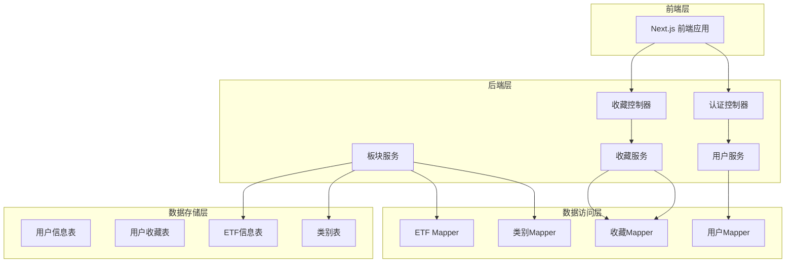
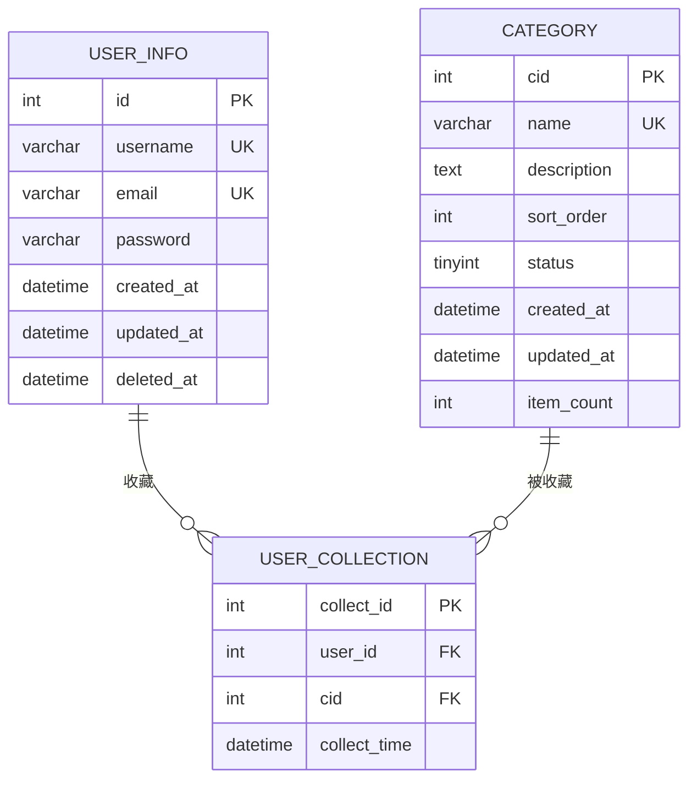
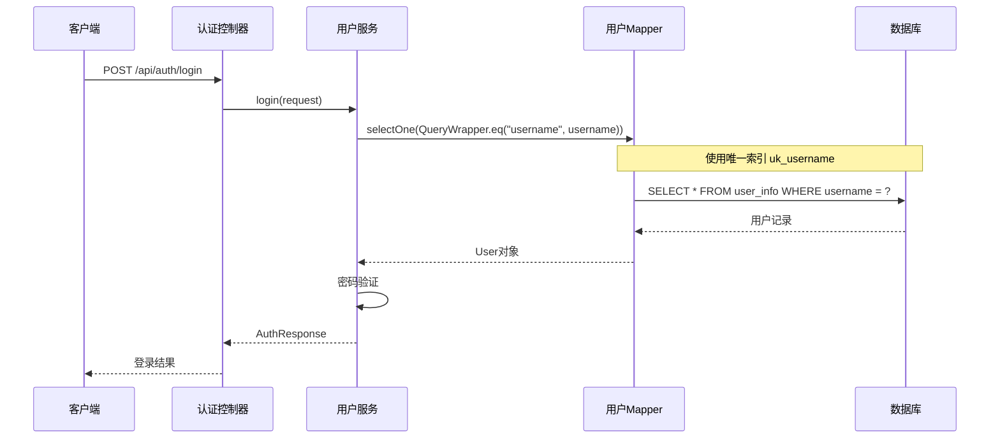
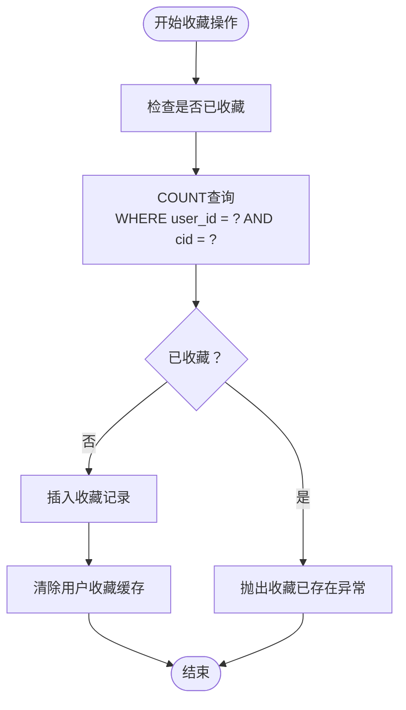
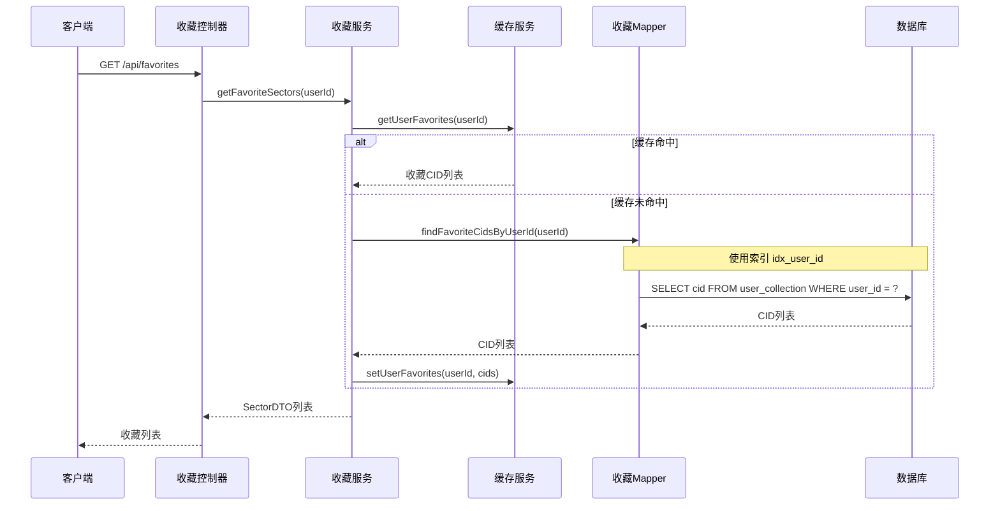

# 索引策略设计

<cite>
**本文档引用的文件**
- [user_info.sql](file://sql/user_info.sql)
- [user_collection.sql](file://sql/user_collection.sql)
- [category.sql](file://sql/category.sql)
- [User.java](file://backend/src/main/java/com/freetrader/entity/User.java)
- [UserCollection.java](file://backend/src/main/java/com/freetrader/entity/UserCollection.java)
- [UserMapper.java](file://backend/src/main/java/com/freetrader/mapper/UserMapper.java)
- [UserCollectionMapper.java](file://backend/src/main/java/com/freetrader/mapper/UserCollectionMapper.java)
- [UserService.java](file://backend/src/main/java/com/freetrader/service/UserService.java)
- [FavoriteService.java](file://backend/src/main/java/com/freetrader/service/FavoriteService.java)
- [SectorService.java](file://backend/src/main/java/com/freetrader/service/SectorService.java)
- [application.yml](file://backend/src/main/resources/application.yml)
</cite>

## 目录
1. [简介](#简介)
2. [项目结构概述](#项目结构概述)
3. [核心表结构分析](#核心表结构分析)
4. [索引设计方案](#索引设计方案)
5. [查询性能分析](#查询性能分析)
6. [索引维护策略](#索引维护策略)
7. [最佳实践指南](#最佳实践指南)
8. [查询场景优化策略](#查询场景优化策略)
9. [性能监控与调优](#性能监控与调优)
10. [总结](#总结)

## 简介

本文件为FreeTrader项目制定全面的数据库索引策略设计文档。FreeTrader是一个ETF投资分析平台，主要包含用户管理、收藏管理和板块数据分析等功能模块。本文档详细阐述了各表的索引设计方案，包括主键索引、唯一索引和普通索引的选择原则，并针对用户表的用户名和邮箱唯一索引、用户收藏表的复合索引进行了深入分析。

## 项目结构概述

FreeTrader项目采用前后端分离架构，后端基于Spring Boot框架开发，数据库采用MySQL 8.0。项目包含以下核心模块：

- **用户管理模块**：处理用户注册、登录、认证等功能
- **收藏管理模块**：管理用户对板块的收藏操作
- **板块分析模块**：提供ETF板块数据查询和分析功能
- **缓存管理模块**：通过Redis实现数据缓存优化



**图表来源**
- [AuthController.java](file://backend/src/main/java/com/freetrader/controller/AuthController.java#L25-L39)
- [FavoriteController.java](file://backend/src/main/java/com/freetrader/controller/FavoriteController.java#L32-L43)
- [UserService.java](file://backend/src/main/java/com/freetrader/service/UserService.java#L27-L29)
- [FavoriteService.java](file://backend/src/main/java/com/freetrader/service/FavoriteService.java#L27-L29)

## 核心表结构分析

### 用户信息表 (user_info)

用户信息表是系统的核心表之一，存储用户的基本信息和认证凭据：



**图表来源**
- [user_info.sql](file://sql/user_info.sql#L24-L35)
- [user_collection.sql](file://sql/user_collection.sql#L24-L34)
- [category.sql](file://sql/category.sql#L24-L36)

**节来源**
- [user_info.sql](file://sql/user_info.sql#L24-L35)
- [User.java](file://backend/src/main/java/com/freetrader/entity/User.java#L14-L27)

### 用户收藏表 (user_collection)

用户收藏表记录用户对板块的收藏关系，采用复合主键确保数据完整性：

**节来源**
- [user_collection.sql](file://sql/user_collection.sql#L24-L34)
- [UserCollection.java](file://backend/src/main/java/com/freetrader/entity/UserCollection.java#L14-L21)

### 类别表 (category)

类别表存储板块分类信息，支持状态筛选和名称唯一性约束：

**节来源**
- [category.sql](file://sql/category.sql#L24-L36)

## 索引设计方案

### 主键索引设计

所有表都采用了自增主键设计，这是数据库性能的基础保障：

#### 用户信息表主键索引
- **索引类型**：主键索引 (PRIMARY KEY)
- **字段**：id (自增整数)
- **设计原则**：主键索引自动建立，无需额外配置
- **性能特点**：提供O(log n)的查找性能，确保数据唯一性和完整性

#### 用户收藏表复合主键索引
- **索引类型**：复合主键索引 (PRIMARY KEY)
- **字段**：collect_id (自增主键)
- **设计原则**：使用自增主键简化业务逻辑，避免复合主键带来的复杂性
- **性能特点**：主键索引保证插入和查询的高效性

#### 类别表主键索引
- **索引类型**：主键索引 (PRIMARY KEY)
- **字段**：cid (自增整数)
- **设计原则**：标准的自增主键设计
- **性能特点**：支持高效的范围查询和排序操作

### 唯一索引设计

唯一索引确保数据的唯一性和完整性，防止重复数据的产生。

#### 用户表唯一索引

**用户名唯一索引 (uk_username)**
- **索引类型**：唯一索引 (UNIQUE INDEX)
- **字段**：username
- **设计目的**：确保用户名的唯一性，防止重复注册
- **查询优化**：支持用户名登录和验证查询
- **维护成本**：每次插入或更新用户名时需要检查唯一性

**邮箱唯一索引 (uk_email)**
- **索引类型**：唯一索引 (UNIQUE INDEX)
- **字段**：email
- **设计目的**：确保邮箱地址的唯一性，便于找回密码
- **查询优化**：支持邮箱登录和验证查询
- **维护成本**：与用户名索引相同的维护开销

**节来源**
- [user_info.sql](file://sql/user_info.sql#L33-L34)

#### 用户收藏表唯一索引

**用户-类别组合唯一索引 (uk_user_cid)**
- **索引类型**：复合唯一索引 (UNIQUE INDEX)
- **字段**：(user_id, cid)
- **设计目的**：防止同一用户重复收藏同一板块
- **查询优化**：支持收藏状态检查和去重查询
- **维护成本**：插入重复记录时会触发唯一性约束检查

#### 类别表唯一索引

**类别名称唯一索引 (uk_name)**
- **索引类型**：唯一索引 (UNIQUE INDEX)
- **字段**：name
- **设计目的**：确保类别名称的唯一性
- **查询优化**：支持按名称查找类别
- **维护成本**：类别名称变更时需要考虑唯一性约束

### 普通索引设计

普通索引用于优化特定查询模式，提高查询性能。

#### 用户收藏表普通索引

**类别索引 (idx_cid)**
- **索引类型**：普通索引 (INDEX)
- **字段**：cid
- **设计目的**：优化按类别查询收藏用户的场景
- **查询优化**：支持"查找收藏某类别的所有用户"的查询
- **维护成本**：插入、更新、删除记录时需要维护索引

**用户索引 (idx_user_id)**
- **索引类型**：普通索引 (INDEX)
- **字段**：user_id
- **设计目的**：优化按用户查询收藏记录的场景
- **查询优化**：支持"查找某用户的所有收藏"的查询
- **维护成本**：与类别索引相同的维护开销

**节来源**
- [user_collection.sql](file://sql/user_collection.sql#L30-L31)

#### 类别表普通索引

**状态索引 (idx_status)**
- **索引类型**：普通索引 (INDEX)
- **字段**：status
- **设计目的**：优化类别状态筛选查询
- **查询优化**：支持"查找启用/禁用的类别"的查询
- **维护成本**：类别状态变更时需要维护索引

**节来源**
- [category.sql](file://sql/category.sql#L35)

## 查询性能分析

### 登录认证查询优化

用户登录是系统最频繁的操作之一，需要优化用户名和邮箱的查询性能。



**图表来源**
- [UserService.java](file://backend/src/main/java/com/freetrader/service/UserService.java#L76-L82)
- [UserMapper.java](file://backend/src/main/java/com/freetrader/mapper/UserMapper.java#L8)

**节来源**
- [UserService.java](file://backend/src/main/java/com/freetrader/service/UserService.java#L32-L39)
- [UserService.java](file://backend/src/main/java/com/freetrader/service/UserService.java#L76-L82)

### 收藏管理查询优化

收藏功能涉及复杂的多表查询，需要精心设计索引以优化性能。



**图表来源**
- [FavoriteService.java](file://backend/src/main/java/com/freetrader/service/FavoriteService.java#L49-L56)
- [UserCollectionMapper.java](file://backend/src/main/java/com/freetrader/mapper/UserCollectionMapper.java#L17-L18)

**节来源**
- [FavoriteService.java](file://backend/src/main/java/com/freetrader/service/FavoriteService.java#L46-L66)

### 收藏列表查询优化

用户收藏列表查询是高频操作，需要优化查询性能。



**图表来源**
- [SectorService.java](file://backend/src/main/java/com/freetrader/service/SectorService.java#L81-L104)
- [UserCollectionMapper.java](file://backend/src/main/java/com/freetrader/mapper/UserCollectionMapper.java#L17-L18)

**节来源**
- [SectorService.java](file://backend/src/main/java/com/freetrader/service/SectorService.java#L81-L104)

## 索引维护策略

### 插入操作的索引维护

索引维护的主要成本来自于插入操作，需要平衡数据完整性和性能。

| 操作类型 | 唯一索引维护 | 普通索引维护 | 总体成本 |
|---------|-------------|-------------|---------|
| 插入用户 | 检查用户名唯一性 | 无索引维护 | 中等 |
| 插入收藏 | 检查用户-类别唯一性 | 维护cid索引 | 较高 |
| 更新用户 | 检查用户名/邮箱唯一性 | 无索引维护 | 中等 |
| 删除收藏 | 无唯一性检查 | 维护cid索引 | 低 |

### 索引碎片化管理

定期进行索引维护以保持查询性能：

1. **索引统计分析**：定期检查索引使用率和碎片化程度
2. **索引重建**：对于碎片化严重的索引进行重建
3. **索引优化**：根据查询模式调整索引策略

### 缓存策略配合

通过Redis缓存减少数据库查询压力：

**节来源**
- [application.yml](file://backend/src/main/resources/application.yml#L40-L44)

## 最佳实践指南

### 索引设计原则

1. **查询优先原则**：优先为高频查询字段建立索引
2. **选择性原则**：高选择性的字段更适合建立索引
3. **覆盖查询原则**：尽量让查询能够完全由索引满足
4. **维护成本原则**：平衡查询性能和维护成本

### 查询优化技巧

#### 使用EXPLAIN分析查询计划
```sql
EXPLAIN SELECT * FROM user_info WHERE username = 'testuser';
EXPLAIN SELECT cid FROM user_collection WHERE user_id = 1;
```

#### 避免全表扫描
- 使用合适的WHERE条件
- 确保索引列在WHERE子句中
- 避免在索引列上使用函数

#### 合理使用LIMIT
```sql
-- 推荐：限制结果集大小
SELECT * FROM user_collection WHERE user_id = 1 LIMIT 100;

-- 不推荐：可能返回大量数据
SELECT * FROM user_collection WHERE user_id = 1;
```

### 索引监控指标

| 指标类型 | 监控方法 | 建议阈值 |
|---------|---------|---------|
| 索引使用率 | SHOW INDEX FROM table_name | >80% |
| 缓冲池命中率 | SHOW STATUS LIKE 'Innodb_buffer_pool_read%' | >95% |
| 查询响应时间 | 慢查询日志 | <100ms |
| 索引碎片率 | ANALYZE TABLE | <10% |

## 查询场景优化策略

### 场景一：用户登录认证

**查询特征**：
- 单点查询，按用户名或邮箱查找
- 高频操作，要求快速响应
- 需要密码验证

**索引策略**：
- 使用用户名和邮箱的唯一索引
- 避免在索引列上使用函数
- 考虑使用复合查询优化器

**节来源**
- [UserService.java](file://backend/src/main/java/com/freetrader/service/UserService.java#L76-L82)

### 场景二：收藏状态检查

**查询特征**：
- 复合条件查询，检查用户是否已收藏
- 需要避免重复收藏
- 高并发场景

**索引策略**：
- 使用用户-类别组合唯一索引
- 在业务层进行双重检查
- 考虑使用INSERT IGNORE避免重复

**节来源**
- [FavoriteService.java](file://backend/src/main/java/com/freetrader/service/FavoriteService.java#L49-L56)

### 场景三：收藏列表获取

**查询特征**：
- 批量查询用户收藏的CID
- 高频读取，低写入
- 可以使用缓存优化

**索引策略**：
- 使用用户ID索引优化查询
- 结合Redis缓存减少数据库压力
- 实现合理的缓存失效策略

**节来源**
- [SectorService.java](file://backend/src/main/java/com/freetrader/service/SectorService.java#L94-L104)

### 场景四：类别筛选查询

**查询特征**：
- 按状态筛选启用的类别
- 支持分页查询
- 需要排序显示

**索引策略**：
- 使用状态索引优化筛选
- 考虑复合索引优化排序
- 实现适当的分页策略

**节来源**
- [category.sql](file://sql/category.sql#L35)

## 性能监控与调优

### 监控工具配置

**慢查询日志配置**：
```yaml
# application.yml
mybatis-plus:
  configuration:
    log-impl: ${MYBATIS_LOG_IMPL:org.apache.ibatis.logging.stdout.StdOutImpl}
```

**节来源**
- [application.yml](file://backend/src/main/resources/application.yml#L51-L52)

### 性能基准测试

建议定期进行以下性能测试：

1. **登录认证测试**：测试用户名和邮箱登录的响应时间
2. **收藏操作测试**：测试添加、删除、切换收藏的性能
3. **批量查询测试**：测试收藏列表获取的性能
4. **并发测试**：模拟高并发场景下的系统表现

### 优化建议

1. **定期分析查询计划**：使用EXPLAIN分析关键查询的执行计划
2. **监控索引使用情况**：定期检查索引的使用效率
3. **调整缓存策略**：根据实际使用情况调整缓存时间和策略
4. **数据库参数优化**：根据实际负载调整MySQL参数

## 总结

FreeTrader项目的索引策略设计充分考虑了系统的业务需求和性能要求。通过合理的主键、唯一索引和普通索引设计，以及配套的缓存策略，实现了高效的查询性能和良好的扩展性。

### 关键设计要点

1. **用户唯一性保障**：通过用户名和邮箱的唯一索引确保用户数据的完整性
2. **收藏关系优化**：使用复合唯一索引防止重复收藏，同时提供高效的查询能力
3. **查询性能优化**：针对高频查询场景设计专门的索引策略
4. **缓存策略配合**：通过Redis缓存减少数据库压力，提升整体性能

### 未来优化方向

1. **索引监控自动化**：建立索引使用情况的自动化监控体系
2. **查询优化持续改进**：根据实际使用情况进行持续的查询优化
3. **数据库参数调优**：根据实际负载进行MySQL参数的精细化调优
4. **性能基准测试**：建立完善的性能基准测试体系

通过以上索引策略的设计和实施，FreeTrader项目能够在保证数据完整性的同时，提供优秀的用户体验和稳定的系统性能。