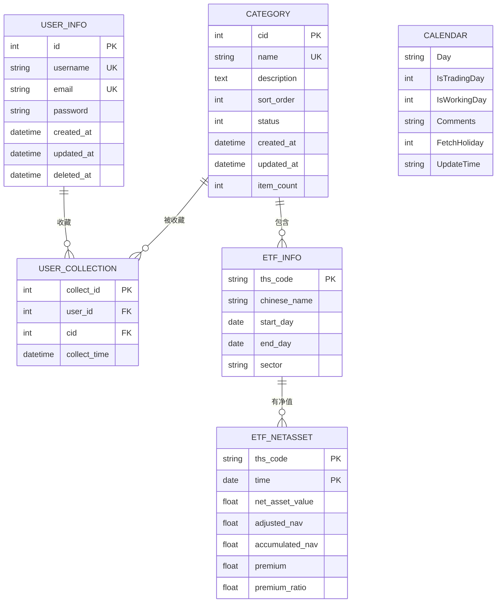
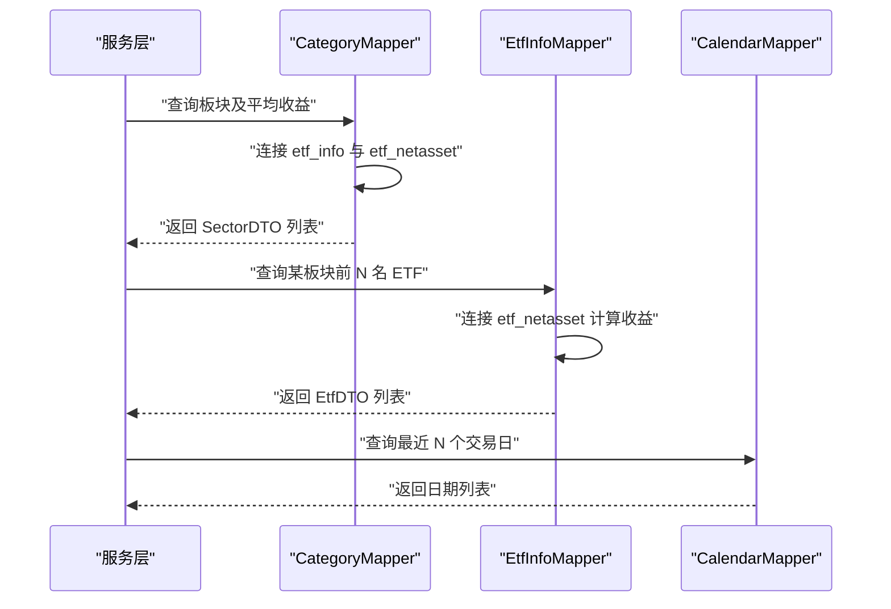

# 表结构设计

<cite>
**本文引用的文件**
- [sql/user_info.sql](file://sql/user_info.sql)
- [backend/src/main/java/com/freetrader/entity/User.java](file://backend/src/main/java/com/freetrader/entity/User.java)
- [sql/category.sql](file://sql/category.sql)
- [backend/src/main/java/com/freetrader/entity/Category.java](file://backend/src/main/java/com/freetrader/entity/Category.java)
- [sql/etf_info.sql](file://sql/etf_info.sql)
- [backend/src/main/java/com/freetrader/entity/EtfInfo.java](file://backend/src/main/java/com/freetrader/entity/EtfInfo.java)
- [sql/user_collection.sql](file://sql/user_collection.sql)
- [backend/src/main/java/com/freetrader/entity/UserCollection.java](file://backend/src/main/java/com/freetrader/entity/UserCollection.java)
- [sql/etf_netasset.sql](file://sql/etf_netasset.sql)
- [backend/src/main/java/com/freetrader/entity/EtfNetAsset.java](file://backend/src/main/java/com/freetrader/entity/EtfNetAsset.java)
- [sql/calendar.sql](file://sql/calendar.sql)
- [backend/src/main/java/com/freetrader/entity/Calendar.java](file://backend/src/main/java/com/freetrader/entity/Calendar.java)
- [backend/src/main/java/com/freetrader/mapper/CategoryMapper.java](file://backend/src/main/java/com/freetrader/mapper/CategoryMapper.java)
- [backend/src/main/java/com/freetrader/mapper/EtfInfoMapper.java](file://backend/src/main/java/com/freetrader/mapper/EtfInfoMapper.java)
- [backend/src/main/java/com/freetrader/mapper/UserCollectionMapper.java](file://backend/src/main/java/com/freetrader/mapper/UserCollectionMapper.java)
- [backend/src/main/java/com/freetrader/mapper/CalendarMapper.java](file://backend/src/main/java/com/freetrader/mapper/CalendarMapper.java)
</cite>

## 目录
1. [简介](#简介)
2. [项目结构](#项目结构)
3. [核心组件](#核心组件)
4. [架构总览](#架构总览)
5. [详细组件分析](#详细组件分析)
6. [依赖分析](#依赖分析)
7. [性能考虑](#性能考虑)
8. [故障排查指南](#故障排查指南)
9. [结论](#结论)
10. [附录](#附录)

## 简介
本文件面向 FreeTrader 项目，系统化梳理数据库表结构设计，逐表说明字段定义、数据类型、约束与索引，并结合实体类与 Mapper 查询语义解释业务含义与设计理念。重点覆盖以下表：
- 用户信息表(user_info)
- 板块分类表(category)
- ETF 信息表(etf_info)
- 用户收藏表(user_collection)
- 净值数据表(etf_netasset)
- 交易日历表(calendar)

## 项目结构
后端采用 Spring Boot + MyBatis-Plus 架构，数据库表结构由 SQL 脚本定义，Java 实体类通过注解映射到对应表，Mapper 接口承载查询逻辑。

```mermaid
graph TB
subgraph "数据库层"
T_USER["表: user_info"]
T_CATEGORY["表: category"]
T_ETF_INFO["表: etf_info"]
T_USER_COLLECTION["表: user_collection"]
T_ETF_NETASSET["表: etf_netasset"]
T_CALENDAR["表: calendar"]
end
subgraph "实体与映射"
E_USER["实体: User"]
E_CATEGORY["实体: Category"]
E_ETF_INFO["实体: EtfInfo"]
E_USER_COLLECTION["实体: UserCollection"]
E_ETF_NETASSET["实体: EtfNetAsset"]
E_CALENDAR["实体: Calendar"]
M_USER["Mapper: UserMapper"]
M_CATEGORY["Mapper: CategoryMapper"]
M_ETF_INFO["Mapper: EtfInfoMapper"]
M_USER_COLLECTION["Mapper: UserCollectionMapper"]
M_ETF_NETASSET["Mapper: EtfNetAssetMapper"]
M_CALENDAR["Mapper: CalendarMapper"]
end
E_USER --> T_USER
E_CATEGORY --> T_CATEGORY
E_ETF_INFO --> T_ETF_INFO
E_USER_COLLECTION --> T_USER_COLLECTION
E_ETF_NETASSET --> T_ETF_NETASSET
E_CALENDAR --> T_CALENDAR
M_USER --> T_USER
M_CATEGORY --> T_CATEGORY
M_ETF_INFO --> T_ETF_INFO
M_USER_COLLECTION --> T_USER_COLLECTION
M_ETF_NETASSET --> T_ETF_NETASSET
M_CALENDAR --> T_CALENDAR
```

图表来源
- [sql/user_info.sql](file://sql/user_info.sql#L24-L35)
- [backend/src/main/java/com/freetrader/entity/User.java](file://backend/src/main/java/com/freetrader/entity/User.java#L10-L28)
- [sql/category.sql](file://sql/category.sql#L24-L36)
- [backend/src/main/java/com/freetrader/entity/Category.java](file://backend/src/main/java/com/freetrader/entity/Category.java#L11-L44)
- [sql/etf_info.sql](file://sql/etf_info.sql#L24-L33)
- [backend/src/main/java/com/freetrader/entity/EtfInfo.java](file://backend/src/main/java/com/freetrader/entity/EtfInfo.java#L9-L23)
- [sql/user_collection.sql](file://sql/user_collection.sql#L24-L34)
- [backend/src/main/java/com/freetrader/entity/UserCollection.java](file://backend/src/main/java/com/freetrader/entity/UserCollection.java#L10-L22)
- [sql/etf_netasset.sql](file://sql/etf_netasset.sql#L24-L34)
- [backend/src/main/java/com/freetrader/entity/EtfNetAsset.java](file://backend/src/main/java/com/freetrader/entity/EtfNetAsset.java#L8-L25)
- [sql/calendar.sql](file://sql/calendar.sql#L24-L31)
- [backend/src/main/java/com/freetrader/entity/Calendar.java](file://backend/src/main/java/com/freetrader/entity/Calendar.java#L6-L21)

章节来源
- [sql/user_info.sql](file://sql/user_info.sql#L24-L35)
- [backend/src/main/java/com/freetrader/entity/User.java](file://backend/src/main/java/com/freetrader/entity/User.java#L10-L28)
- [sql/category.sql](file://sql/category.sql#L24-L36)
- [backend/src/main/java/com/freetrader/entity/Category.java](file://backend/src/main/java/com/freetrader/entity/Category.java#L11-L44)
- [sql/etf_info.sql](file://sql/etf_info.sql#L24-L33)
- [backend/src/main/java/com/freetrader/entity/EtfInfo.java](file://backend/src/main/java/com/freetrader/entity/EtfInfo.java#L9-L23)
- [sql/user_collection.sql](file://sql/user_collection.sql#L24-L34)
- [backend/src/main/java/com/freetrader/entity/UserCollection.java](file://backend/src/main/java/com/freetrader/entity/UserCollection.java#L10-L22)
- [sql/etf_netasset.sql](file://sql/etf_netasset.sql#L24-L34)
- [backend/src/main/java/com/freetrader/entity/EtfNetAsset.java](file://backend/src/main/java/com/freetrader/entity/EtfNetAsset.java#L8-L25)
- [sql/calendar.sql](file://sql/calendar.sql#L24-L31)
- [backend/src/main/java/com/freetrader/entity/Calendar.java](file://backend/src/main/java/com/freetrader/entity/Calendar.java#L6-L21)

## 核心组件
- 用户信息表(user_info)：存储用户身份与认证相关的核心字段，支持唯一性约束与时间戳字段。
- 板块分类表(category)：维护 ETF 所属板块的分类信息，包含排序、状态与计数字段。
- ETF 信息表(etf_info)：记录 ETF 基金的基本信息与所属板块，配合触发器维护分类计数。
- 用户收藏表(user_collection)：建立用户与兴趣类别的多对多关系，保证去重与级联删除。
- 净值数据表(etf_netasset)：按日记录 ETF 的净值与贴水等指标，复合主键确保唯一性。
- 交易日历表(calendar)：记录日期与是否交易日/工作日等元数据，支撑回测与统计。

章节来源
- [sql/user_info.sql](file://sql/user_info.sql#L24-L35)
- [sql/category.sql](file://sql/category.sql#L24-L36)
- [sql/etf_info.sql](file://sql/etf_info.sql#L24-L33)
- [sql/user_collection.sql](file://sql/user_collection.sql#L24-L34)
- [sql/etf_netasset.sql](file://sql/etf_netasset.sql#L24-L34)
- [sql/calendar.sql](file://sql/calendar.sql#L24-L31)

## 架构总览
下图展示各表之间的关系与约束，以及典型查询路径（从实体类与 Mapper 的使用角度抽象）：

图表来源
- [sql/user_info.sql](file://sql/user_info.sql#L24-L35)
- [sql/category.sql](file://sql/category.sql#L24-L36)
- [sql/etf_info.sql](file://sql/etf_info.sql#L24-L33)
- [sql/user_collection.sql](file://sql/user_collection.sql#L24-L34)
- [sql/etf_netasset.sql](file://sql/etf_netasset.sql#L24-L34)
- [sql/calendar.sql](file://sql/calendar.sql#L24-L31)

## 详细组件分析

### 用户信息表(user_info)
- 字段与类型
  - id: 整型，自增主键，唯一标识用户。
  - username: 变长字符串，唯一且非空，作为登录名。
  - email: 变长字符串，唯一且非空，用于登录与找回密码。
  - password: 变长字符串，存储加密后的凭据。
  - created_at: 时间戳，默认当前时间，记录账户创建时间。
  - updated_at: 时间戳，默认当前时间并自动更新，记录信息变更时间。
  - deleted_at: 可空时间戳，支持软删除标记。
- 约束与索引
  - 主键: id
  - 唯一索引: uk_username, uk_email
- 设计理念
  - 唯一性约束保障用户体系不重复；软删除便于审计与恢复。
  - 时间戳字段便于统计与合规追踪。
- 对应实体类字段
  - id、username、email、password、createdAt、updatedAt、deletedAt
- 关键查询/用途
  - 登录校验、注册去重、用户资料更新、软删除清理。

章节来源
- [sql/user_info.sql](file://sql/user_info.sql#L24-L35)
- [backend/src/main/java/com/freetrader/entity/User.java](file://backend/src/main/java/com/freetrader/entity/User.java#L10-L28)

### 板块分类表(category)
- 字段与类型
  - cid: 整型，自增主键，分类唯一标识。
  - name: 变长字符串，唯一且非空，分类名称（如行业板块）。
  - description: 文本，分类描述。
  - sort_order: 整型，默认0，用于前端展示排序。
  - status: 小整型，默认1，逻辑删除开关（1启用，0禁用）。
  - created_at/updated_at: 时间戳，默认当前时间并自动更新。
  - item_count: 整型，默认0，记录该分类下的 ETF 数量。
- 约束与索引
  - 主键: cid
  - 唯一索引: uk_name
  - 普通索引: idx_status（按状态筛选）
- 设计理念
  - 通过 item_count 与触发器联动，动态维护分类热度与统计。
  - status 支持逻辑删除，避免影响历史收藏与报表。
- 对应实体类字段
  - cid、name、description、sortOrder、status、createdAt、updatedAt、itemCount
- 关键查询/用途
  - 获取启用分类列表、按排序展示、统计各板块基金数量。

章节来源
- [sql/category.sql](file://sql/category.sql#L24-L36)
- [backend/src/main/java/com/freetrader/entity/Category.java](file://backend/src/main/java/com/freetrader/entity/Category.java#L11-L44)

### ETF 信息表(etf_info)
- 字段与类型
  - ths_code: 字符串，主键，东方通编码，唯一标识 ETF。
  - chinese_name: 字符串，ETF 中文名称。
  - start_day/end_day: 日期，起止交易日。
  - sector: 字符串，所属板块名称，与 category.name 关联。
- 约束与索引
  - 主键: ths_code
  - 普通索引: idx_etf_id、idx_etf_category
- 触发器行为
  - 插入/更新/删除后自动维护 category.item_count，并在新增时自动创建分类。
- 设计理念
  - 以 ths_code 为主键，便于与行情数据对接；sector 作为分类外键，驱动分类计数。
  - 触发器确保分类统计与数据一致性。
- 对应实体类字段
  - thsCode、chineseName、startDay、endDay、sector
- 关键查询/用途
  - 按板块筛选 ETF 列表、计算板块收益、构建收藏关系。

章节来源
- [sql/etf_info.sql](file://sql/etf_info.sql#L24-L33)
- [backend/src/main/java/com/freetrader/entity/EtfInfo.java](file://backend/src/main/java/com/freetrader/entity/EtfInfo.java#L9-L23)

### 用户收藏表(user_collection)
- 字段与类型
  - collect_id: 整型，自增主键，收藏记录唯一标识。
  - user_id: 整型，非空，关联 user_info.id。
  - cid: 整型，非空，关联 category.cid。
  - collect_time: 时间戳，默认当前时间，记录收藏时间。
- 约束与索引
  - 主键: collect_id
  - 唯一索引: uk_user_cid（同一用户不可重复收藏同一分类）
  - 普通索引: idx_cid（按分类查询收藏用户）
  - 外键: fk_collection_category、fk_collection_user（级联删除）
- 设计理念
  - 唯一索引防止重复收藏；外键级联删除保证数据整洁。
  - 收藏时间便于个性化推荐与行为分析。
- 对应实体类字段
  - collectId、userId、cid、collectTime
- 关键查询/用途
  - 获取某用户的全部收藏分类 ID；按分类反查收藏用户。

章节来源
- [sql/user_collection.sql](file://sql/user_collection.sql#L24-L34)
- [backend/src/main/java/com/freetrader/entity/UserCollection.java](file://backend/src/main/java/com/freetrader/entity/UserCollection.java#L10-L22)

### 净值数据表(etf_netasset)
- 字段与类型
  - ths_code: 字符串，主键之一，ETF 编码。
  - time: 日期，主键之一，交易日。
  - net_asset_value: 浮点数，单位净值。
  - adjusted_nav: 浮点数，复权单位净值。
  - accumulated_nav: 浮点数，累计单位净值。
  - premium: 浮点数，贴水。
  - premium_ratio: 浮点数，贴水率。
- 约束与索引
  - 主键: (ths_code, time)
  - 普通索引: idx_etf_time
- 设计理念
  - 复合主键确保每只 ETF 每日净值唯一；索引支持按 ETF+日期快速检索。
  - 记录复权净值与贴水指标，满足收益计算与折溢价分析。
- 对应实体类字段
  - thsCode、time、netAssetValue、adjustedNav、accumulatedNav、premium、premiumRatio
- 关键查询/用途
  - 计算区间涨跌幅、复权收益、贴水分析；与板块统计结合。

章节来源
- [sql/etf_netasset.sql](file://sql/etf_netasset.sql#L24-L34)
- [backend/src/main/java/com/freetrader/entity/EtfNetAsset.java](file://backend/src/main/java/com/freetrader/entity/EtfNetAsset.java#L8-L25)

### 交易日历表(calendar)
- 字段与类型
  - Day: 字符串，日期标识。
  - IsTradingDay: 小整型，是否交易日。
  - IsWorkingDay: 小整型，是否工作日。
  - Comments: 字符串，备注。
  - FetchHoliday: 小整型，节假日标记。
  - UpdateTime: 字符串，更新时间。
- 设计理念
  - 提供统一的交易日与工作日判断依据，支撑回测与统计口径一致。
- 对应实体类字段
  - day、isTradingDay、isWorkingDay、comments、fetchHoliday、updateTime
- 关键查询/用途
  - 获取最近 N 个交易日，用于收益区间的基准对齐。

章节来源
- [sql/calendar.sql](file://sql/calendar.sql#L24-L31)
- [backend/src/main/java/com/freetrader/entity/Calendar.java](file://backend/src/main/java/com/freetrader/entity/Calendar.java#L6-L21)

## 依赖分析
- 实体类与表映射
  - 各实体类通过注解明确映射关系，确保字段命名与表结构一致。
- 查询依赖
  - CategoryMapper 使用 etf_info 与 etf_netasset 进行板块平均收益计算。
  - EtfInfoMapper 使用 etf_netasset 进行板块内 ETF 排行。
  - UserCollectionMapper 读取用户收藏分类。
  - CalendarMapper 读取交易日历。
- 外键与触发器
  - user_collection 与 category、user_info 的外键约束保证参照完整性。
  - etf_info 的触发器自动维护 category.item_count 并在缺失时创建分类。

图表来源
- [backend/src/main/java/com/freetrader/mapper/CategoryMapper.java](file://backend/src/main/java/com/freetrader/mapper/CategoryMapper.java#L19-L46)
- [backend/src/main/java/com/freetrader/mapper/EtfInfoMapper.java](file://backend/src/main/java/com/freetrader/mapper/EtfInfoMapper.java#L18-L51)
- [backend/src/main/java/com/freetrader/mapper/CalendarMapper.java](file://backend/src/main/java/com/freetrader/mapper/CalendarMapper.java#L17-L23)

章节来源
- [backend/src/main/java/com/freetrader/mapper/CategoryMapper.java](file://backend/src/main/java/com/freetrader/mapper/CategoryMapper.java#L19-L46)
- [backend/src/main/java/com/freetrader/mapper/EtfInfoMapper.java](file://backend/src/main/java/com/freetrader/mapper/EtfInfoMapper.java#L18-L51)
- [backend/src/main/java/com/freetrader/mapper/UserCollectionMapper.java](file://backend/src/main/java/com/freetrader/mapper/UserCollectionMapper.java#L17-L18)
- [backend/src/main/java/com/freetrader/mapper/CalendarMapper.java](file://backend/src/main/java/com/freetrader/mapper/CalendarMapper.java#L17-L23)

## 性能考虑
- 索引策略
  - user_info: uk_username、uk_email 用于登录与注册去重。
  - category: uk_name、idx_status 用于分类查询与筛选。
  - etf_info: idx_etf_id、idx_etf_category 用于按 ETF 与板块检索。
  - user_collection: uk_user_cid、idx_cid 用于去重与按分类查询。
  - etf_netasset: idx_etf_time 用于按 ETF+日期检索。
- 触发器开销
  - etf_info 的触发器在插入/更新/删除时维护 category.item_count，需关注批量写入场景的性能影响。
- 查询优化
  - 使用精确过滤条件与必要索引，避免全表扫描。
  - 分页与 TopN 查询限制结果集大小。

## 故障排查指南
- 常见问题
  - 重复注册：检查 user_info.uk_username 与 uk_email 唯一索引冲突。
  - 无法收藏：确认 user_collection.uk_user_cid 唯一性与外键是否存在。
  - 板块计数异常：检查 etf_info 触发器逻辑与 category.item_count 是否同步。
  - 收益计算为空：确认 etf_netasset 中对应日期的数据存在。
- 定位手段
  - 查看对应 Mapper 的 SQL 片段，核对连接条件与日期范围。
  - 检查实体类字段映射是否与表结构一致。

章节来源
- [sql/user_info.sql](file://sql/user_info.sql#L32-L34)
- [sql/user_collection.sql](file://sql/user_collection.sql#L30-L33)
- [sql/etf_info.sql](file://sql/etf_info.sql#L38-L105)
- [backend/src/main/java/com/freetrader/mapper/CategoryMapper.java](file://backend/src/main/java/com/freetrader/mapper/CategoryMapper.java#L19-L46)
- [backend/src/main/java/com/freetrader/mapper/EtfInfoMapper.java](file://backend/src/main/java/com/freetrader/mapper/EtfInfoMapper.java#L18-L51)

## 结论
本设计以清晰的主外键关系、完善的唯一性与索引策略为基础，结合触发器与查询层逻辑，实现了用户收藏、板块统计与净值分析的完整闭环。建议在高并发写入场景下评估触发器与索引的综合成本，并持续监控关键查询的执行计划。

## 附录
- 表结构与字段注释概览
  - user_info: 用户唯一标识、登录名、邮箱、密码、创建/更新/删除时间戳。
  - category: 分类唯一标识、名称、描述、排序、状态、创建/更新/计数。
  - etf_info: ETF 基金编码、中文名、起止日期、所属板块。
  - user_collection: 收藏记录、用户、分类、收藏时间。
  - etf_netasset: ETF 编码、交易日、单位净值、复权净值、累计净值、贴水与贴水率。
  - calendar: 日期、交易日标志、工作日标志、备注、节假日标记、更新时间。