# 分层架构设计

<cite>
**本文引用的文件**
- [FreeTraderApplication.java](file://backend/src/main/java/com/freetrader/FreeTraderApplication.java)
- [AuthController.java](file://backend/src/main/java/com/freetrader/controller/AuthController.java)
- [UserService.java](file://backend/src/main/java/com/freetrader/service/UserService.java)
- [TokenService.java](file://backend/src/main/java/com/freetrader/service/TokenService.java)
- [CacheService.java](file://backend/src/main/java/com/freetrader/service/CacheService.java)
- [UserMapper.java](file://backend/src/main/java/com/freetrader/mapper/UserMapper.java)
- [JwtUtils.java](file://backend/src/main/java/com/freetrader/security/JwtUtils.java)
- [SecurityConfig.java](file://backend/src/main/java/com/freetrader/config/SecurityConfig.java)
- [MyBatisPlusConfig.java](file://backend/src/main/java/com/freetrader/config/MyBatisPlusConfig.java)
- [Result.java](file://backend/src/main/java/com/freetrader/dto/Result.java)
- [AuthResponse.java](file://backend/src/main/java/com/freetrader/dto/AuthResponse.java)
- [LoginRequest.java](file://backend/src/main/java/com/freetrader/dto/LoginRequest.java)
- [application.yml](file://backend/src/main/resources/application.yml)
- [BusinessException.java](file://backend/src/main/java/com/freetrader/exception/BusinessException.java)
- [ErrorCode.java](file://backend/src/main/java/com/freetrader/exception/ErrorCode.java)
- [User.java](file://backend/src/main/java/com/freetrader/entity/User.java)
- [pom.xml](file://backend/pom.xml)
</cite>

## 目录
1. [简介](#简介)
2. [项目结构](#项目结构)
3. [核心组件](#核心组件)
4. [架构总览](#架构总览)
5. [详细组件分析](#详细组件分析)
6. [依赖关系分析](#依赖关系分析)
7. [性能考虑](#性能考虑)
8. [故障排查指南](#故障排查指南)
9. [结论](#结论)

## 简介
本文件面向 FreeTrader 项目的后端部分，系统性阐述基于 Spring Boot 的分层架构设计与实现，重点覆盖三层职责划分：控制器层（Controller）、服务层（Service）、数据访问层（Mapper）。文档将结合实际代码路径，说明各层的设计原则、依赖注入方式、接口设计、异常处理机制、层间通信方式（方法调用、参数传递、返回值处理），并通过图示展示典型流程，帮助开发者理解如何通过分层实现关注点分离与代码复用。

## 项目结构
后端采用标准的 Spring Boot 结构，按功能域组织包：
- controller：对外暴露 REST 接口，负责请求接收、参数校验、响应封装
- service：业务逻辑编排，事务控制，跨 Mapper 调用
- mapper：数据访问接口，基于 MyBatis-Plus
- entity/dto：数据模型与传输对象
- security：安全与鉴权相关组件
- config：Spring 配置（安全、MyBatis-Plus、OpenAPI 等）
- exception：全局异常与错误码定义
- util：工具类常量

图表来源
- [FreeTraderApplication.java](file://backend/src/main/java/com/freetrader/FreeTraderApplication.java#L1-L15)
- [AuthController.java](file://backend/src/main/java/com/freetrader/controller/AuthController.java#L1-L72)
- [UserService.java](file://backend/src/main/java/com/freetrader/service/UserService.java#L1-L103)
- [TokenService.java](file://backend/src/main/java/com/freetrader/service/TokenService.java#L1-L64)
- [CacheService.java](file://backend/src/main/java/com/freetrader/service/CacheService.java#L1-L206)
- [UserMapper.java](file://backend/src/main/java/com/freetrader/mapper/UserMapper.java#L1-L10)
- [JwtUtils.java](file://backend/src/main/java/com/freetrader/security/JwtUtils.java#L1-L194)
- [SecurityConfig.java](file://backend/src/main/java/com/freetrader/config/SecurityConfig.java#L1-L61)
- [MyBatisPlusConfig.java](file://backend/src/main/java/com/freetrader/config/MyBatisPlusConfig.java#L1-L19)

章节来源
- [FreeTraderApplication.java](file://backend/src/main/java/com/freetrader/FreeTraderApplication.java#L1-L15)
- [application.yml](file://backend/src/main/resources/application.yml#L1-L102)

## 核心组件
- 控制器层：以 AuthController 为例，负责接收认证相关请求，进行参数校验与速率限制注解，调用服务层并统一封装响应。
- 服务层：UserService 处理用户登录/注册与加载用户详情；TokenService 处理 Token 刷新与登出；CacheService 提供 Redis 统一缓存能力。
- 数据访问层：UserMapper 继承 MyBatis-Plus 基类接口，提供基础 CRUD 能力。
- 安全与配置：JwtUtils 提供 Token 生成与校验；SecurityConfig 配置无状态安全链；MyBatisPlusConfig 注册分页插件。
- 统一响应：Result<T> 封装统一响应结构；AuthResponse 作为认证返回体。
- 异常体系：BusinessException + ErrorCode 提供可读的业务错误码与消息。

章节来源
- [AuthController.java](file://backend/src/main/java/com/freetrader/controller/AuthController.java#L1-L72)
- [UserService.java](file://backend/src/main/java/com/freetrader/service/UserService.java#L1-L103)
- [TokenService.java](file://backend/src/main/java/com/freetrader/service/TokenService.java#L1-L64)
- [CacheService.java](file://backend/src/main/java/com/freetrader/service/CacheService.java#L1-L206)
- [UserMapper.java](file://backend/src/main/java/com/freetrader/mapper/UserMapper.java#L1-L10)
- [JwtUtils.java](file://backend/src/main/java/com/freetrader/security/JwtUtils.java#L1-L194)
- [SecurityConfig.java](file://backend/src/main/java/com/freetrader/config/SecurityConfig.java#L1-L61)
- [MyBatisPlusConfig.java](file://backend/src/main/java/com/freetrader/config/MyBatisPlusConfig.java#L1-L19)
- [Result.java](file://backend/src/main/java/com/freetrader/dto/Result.java#L1-L31)
- [AuthResponse.java](file://backend/src/main/java/com/freetrader/dto/AuthResponse.java#L1-L19)
- [BusinessException.java](file://backend/src/main/java/com/freetrader/exception/BusinessException.java#L1-L30)
- [ErrorCode.java](file://backend/src/main/java/com/freetrader/exception/ErrorCode.java#L1-L35)

## 架构总览
下图展示了典型的认证流程：控制器接收请求 → 服务层执行业务 → 数据访问层持久化 → 返回统一响应。

图表来源
- [AuthController.java](file://backend/src/main/java/com/freetrader/controller/AuthController.java#L36-L39)
- [UserService.java](file://backend/src/main/java/com/freetrader/service/UserService.java#L73-L96)
- [UserMapper.java](file://backend/src/main/java/com/freetrader/mapper/UserMapper.java#L1-L10)
- [JwtUtils.java](file://backend/src/main/java/com/freetrader/security/JwtUtils.java#L100-L120)
- [Result.java](file://backend/src/main/java/com/freetrader/dto/Result.java#L15-L21)

## 详细组件分析

### 控制器层（Controller）
- 职责
  - 接收 HTTP 请求，绑定 DTO 参数，进行参数校验与限流注解
  - 调用服务层执行业务逻辑
  - 统一封装响应体，返回 Result<T>
- 设计要点
  - 使用 Lombok 的 @RequiredArgsConstructor 实现构造器注入，便于测试与线程安全
  - 使用 Swagger 注解标注接口元数据，提升 API 可发现性
  - 对敏感操作（登录/注册）增加速率限制注解
- 层间通信
  - 方法调用：login/register/refreshToken/logout 直接调用对应服务方法
  - 参数传递：请求 DTO（如 LoginRequest）由 Spring MVC 自动校验
  - 返回值处理：服务层返回领域对象，控制器包装为 Result.success()

章节来源
- [AuthController.java](file://backend/src/main/java/com/freetrader/controller/AuthController.java#L1-L72)
- [LoginRequest.java](file://backend/src/main/java/com/freetrader/dto/LoginRequest.java#L1-L15)
- [Result.java](file://backend/src/main/java/com/freetrader/dto/Result.java#L1-L31)

### 服务层（Service）
- 职责
  - 用户服务：用户登录/注册、加载用户详情、用户名查询
  - 令牌服务：刷新访问 Token、登出（加入黑名单）、校验 Token 有效性
  - 缓存服务：统一 Redis 操作，支持黑名单、用户收藏、板块缓存清理等
- 设计要点
  - 使用 @Transactional 标注事务边界（注册场景）
  - 通过依赖注入获得 Mapper/工具/缓存服务
  - 业务异常统一抛出 BusinessException，交由全局异常处理器处理
- 层间通信
  - 调用 Mapper 进行数据持久化与查询
  - 调用 JwtUtils 生成/校验 Token
  - 调用 CacheService 进行缓存与黑名单维护

```mermaid
classDiagram
class AuthController {
+login(request)
+register(request)
+refreshToken(request)
+logout(request)
}
class UserService {
+login(request)
+register(request)
+findByUsername(username)
+loadUserByUsername(username)
}
class TokenService {
+refreshAccessToken(refreshToken)
+logout(accessToken, refreshToken)
+isTokenValid(token)
}
class CacheService {
+addToTokenBlacklist(token, ttl)
+isTokenBlacklisted(token)
+getUserFavorites(userId)
+clearSectorCache()
}
class UserMapper {
<<interface>>
}
class JwtUtils {
+generateAccessToken(username)
+generateRefreshToken(username)
+validateToken(token)
+isRefreshToken(token)
}
AuthController --> UserService : "依赖"
AuthController --> TokenService : "依赖"
UserService --> UserMapper : "依赖"
TokenService --> JwtUtils : "依赖"
TokenService --> CacheService : "依赖"
```

图表来源
- [AuthController.java](file://backend/src/main/java/com/freetrader/controller/AuthController.java#L25-L26)
- [UserService.java](file://backend/src/main/java/com/freetrader/service/UserService.java#L27-L29)
- [TokenService.java](file://backend/src/main/java/com/freetrader/service/TokenService.java#L15-L16)
- [CacheService.java](file://backend/src/main/java/com/freetrader/service/CacheService.java#L27-L32)
- [UserMapper.java](file://backend/src/main/java/com/freetrader/mapper/UserMapper.java#L1-L10)
- [JwtUtils.java](file://backend/src/main/java/com/freetrader/security/JwtUtils.java#L100-L120)

章节来源
- [UserService.java](file://backend/src/main/java/com/freetrader/service/UserService.java#L1-L103)
- [TokenService.java](file://backend/src/main/java/com/freetrader/service/TokenService.java#L1-L64)
- [CacheService.java](file://backend/src/main/java/com/freetrader/service/CacheService.java#L1-L206)

### 数据访问层（Mapper）
- 职责
  - 基于 MyBatis-Plus 的通用 Mapper 接口，提供基础 CRUD 能力
  - 通过 QueryWrapper 构建查询条件，配合逻辑删除字段
- 设计要点
  - 使用 @Mapper 注解标识接口，配合 @MapperScan 在启动类扫描
  - 与实体类 User 映射，遵循驼峰命名与数据库字段映射
- 层间通信
  - 服务层通过 Mapper 执行查询/插入/更新
  - 返回实体对象给上层组装响应

章节来源
- [UserMapper.java](file://backend/src/main/java/com/freetrader/mapper/UserMapper.java#L1-L10)
- [User.java](file://backend/src/main/java/com/freetrader/entity/User.java#L1-L29)
- [FreeTraderApplication.java](file://backend/src/main/java/com/freetrader/FreeTraderApplication.java#L8)

### 安全与配置
- 安全配置
  - 无状态会话策略（STATELESS）
  - 允许 /api/auth/** 与 /api/sectors/** 匹配的公开路径
  - 使用自定义 JwtAuthFilter 与 DaoAuthenticationProvider
- JWT 工具
  - 生成/解析/校验 Token，区分 Access/Refresh 类型
  - 支持过期时间与密钥长度校验
- MyBatis-Plus 配置
  - 注册分页插件，适配 MySQL

章节来源
- [SecurityConfig.java](file://backend/src/main/java/com/freetrader/config/SecurityConfig.java#L1-L61)
- [JwtUtils.java](file://backend/src/main/java/com/freetrader/security/JwtUtils.java#L1-L194)
- [MyBatisPlusConfig.java](file://backend/src/main/java/com/freetrader/config/MyBatisPlusConfig.java#L1-L19)

### 统一响应与异常处理
- 统一响应
  - Result<T> 提供 success()/error() 静态工厂方法，控制器直接返回 Result
- 异常体系
  - BusinessException 支持传入自定义 code/message 或枚举 ErrorCode
  - ErrorCode 定义业务错误码与消息，便于前端统一处理

章节来源
- [Result.java](file://backend/src/main/java/com/freetrader/dto/Result.java#L1-L31)
- [BusinessException.java](file://backend/src/main/java/com/freetrader/exception/BusinessException.java#L1-L30)
- [ErrorCode.java](file://backend/src/main/java/com/freetrader/exception/ErrorCode.java#L1-L35)

## 依赖关系分析
- 控制器依赖服务层（构造器注入）
- 服务层依赖 Mapper/工具/缓存服务
- 安全配置依赖 JwtAuthFilter 与 UserDetailsService
- 应用启动类启用 Mapper 扫描与 Spring Boot 自动装配

图表来源
- [AuthController.java](file://backend/src/main/java/com/freetrader/controller/AuthController.java#L25-L26)
- [UserService.java](file://backend/src/main/java/com/freetrader/service/UserService.java#L27-L29)
- [TokenService.java](file://backend/src/main/java/com/freetrader/service/TokenService.java#L15-L16)
- [SecurityConfig.java](file://backend/src/main/java/com/freetrader/config/SecurityConfig.java#L25-L27)
- [FreeTraderApplication.java](file://backend/src/main/java/com/freetrader/FreeTraderApplication.java#L8)

章节来源
- [pom.xml](file://backend/pom.xml#L43-L124)

## 性能考虑
- Redis 批量删除使用 SCAN 替代 KEYS，避免阻塞
- 缓存 TTL 合理设置，结合业务热点数据进行优化
- MyBatis-Plus 分页插件减少大结果集内存压力
- JWT 过期时间与密钥长度配置需满足生产安全要求
- 登录/注册接口限流，防止暴力破解与流量洪峰

## 故障排查指南
- 认证失败
  - 检查用户名/密码是否正确，确认 UserService 抛出的业务异常与错误码
  - 核对 SecurityConfig 的公开路径配置
- Token 无效或过期
  - 检查 JwtUtils 的密钥与过期时间配置
  - 确认 Token 是否被加入黑名单（CacheService）
- 数据访问异常
  - 检查 UserMapper 查询条件与逻辑删除字段
  - 关注 MyBatis-Plus 日志输出与连接池配置
- 缓存问题
  - 使用 CacheService 的 scanKeys 辅助定位键空间
  - 核对 RedisTemplate 的序列化与连接参数

章节来源
- [UserService.java](file://backend/src/main/java/com/freetrader/service/UserService.java#L79-L82)
- [TokenService.java](file://backend/src/main/java/com/freetrader/service/TokenService.java#L19-L32)
- [CacheService.java](file://backend/src/main/java/com/freetrader/service/CacheService.java#L147-L183)
- [application.yml](file://backend/src/main/resources/application.yml#L60-L66)

## 结论
FreeTrader 后端通过清晰的三层架构实现了关注点分离：控制器负责接口与响应，服务层承载业务与事务，数据访问层专注持久化。配合统一响应、业务异常、JWT 安全与 Redis 缓存，整体具备良好的可维护性与扩展性。建议在生产环境中进一步完善日志审计、监控告警与缓存预热策略，持续优化性能与稳定性。