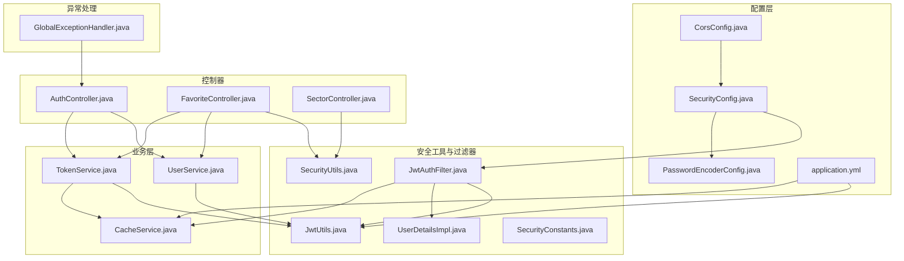
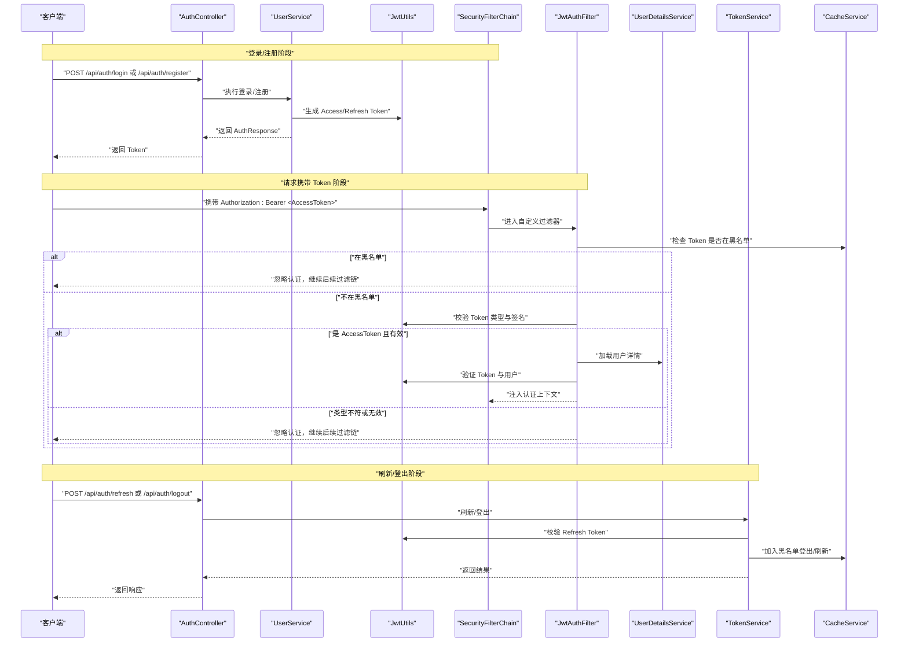
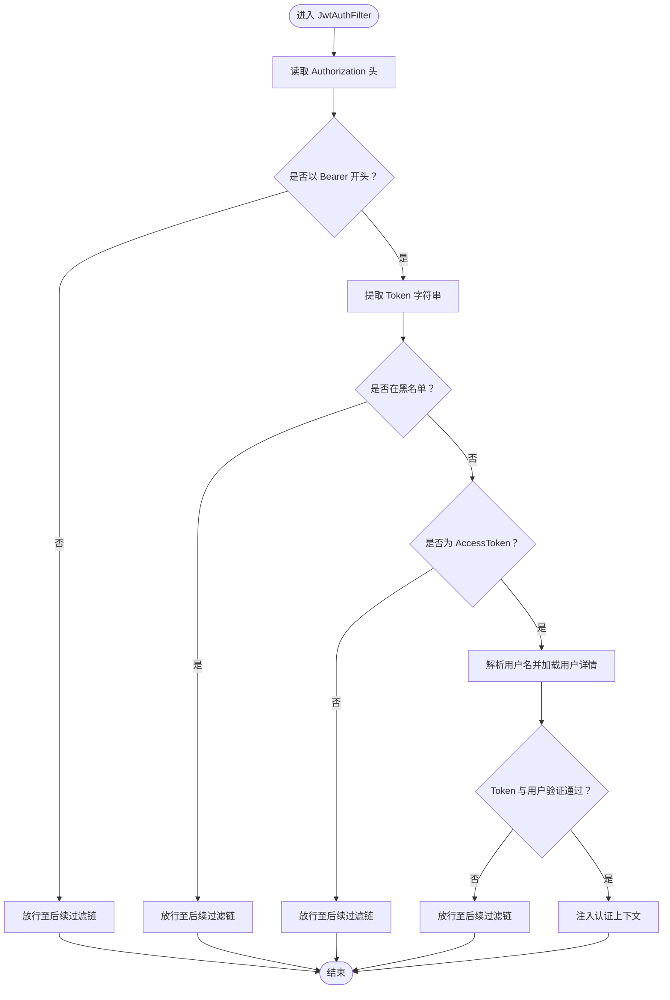
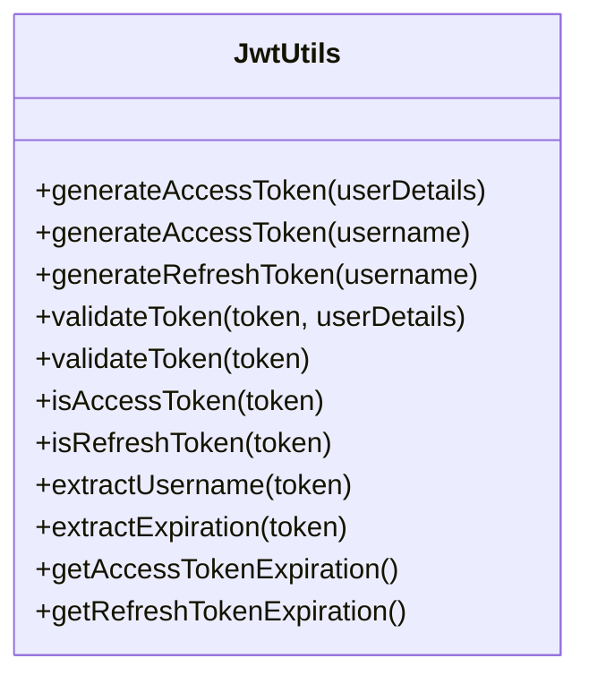
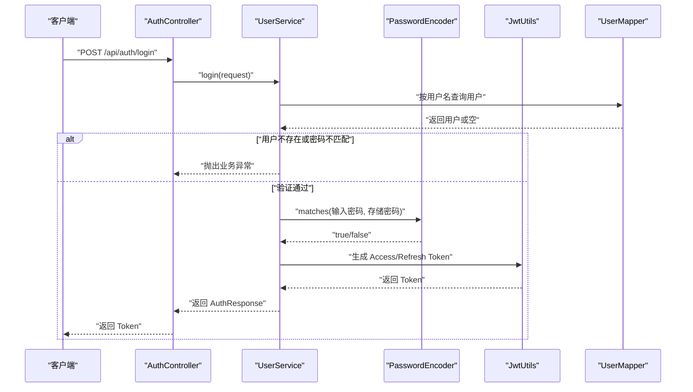
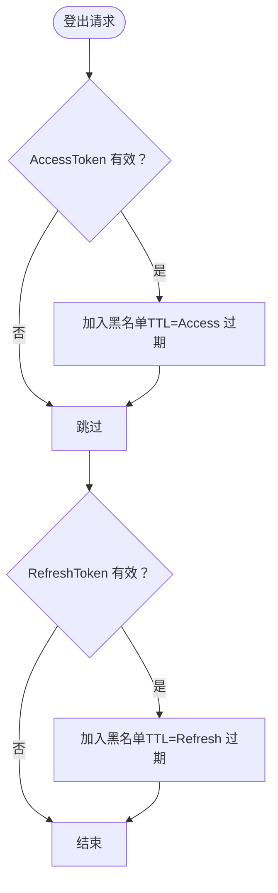
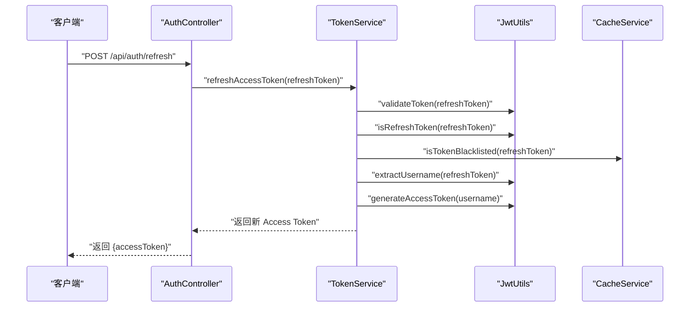
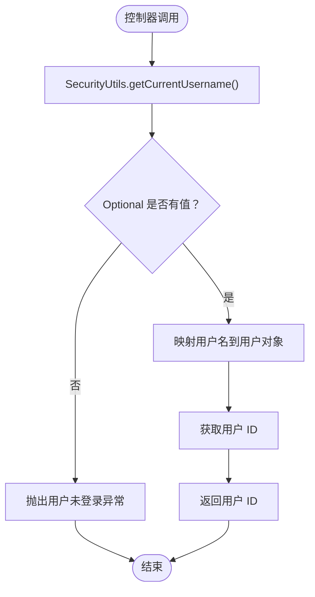
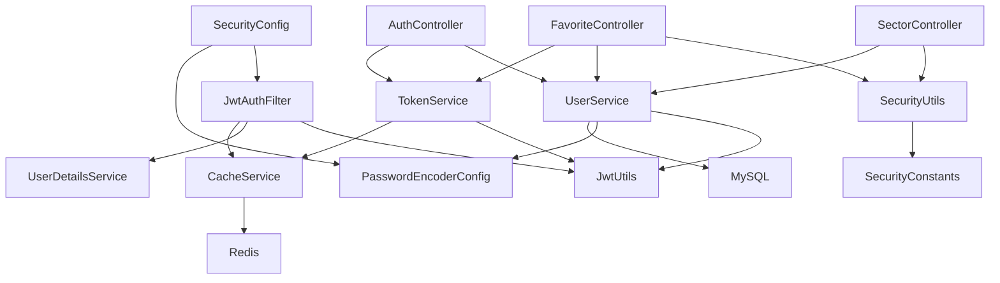

# 安全架构设计

<cite>
**本文档引用的文件**
- [SecurityConfig.java](file://backend/src/main/java/com/freetrader/config/SecurityConfig.java)
- [JwtAuthFilter.java](file://backend/src/main/java/com/freetrader/security/JwtAuthFilter.java)
- [JwtUtils.java](file://backend/src/main/java/com/freetrader/security/JwtUtils.java)
- [CorsConfig.java](file://backend/src/main/java/com/freetrader/config/CorsConfig.java)
- [PasswordEncoderConfig.java](file://backend/src/main/java/com/freetrader/config/PasswordEncoderConfig.java)
- [SecurityConstants.java](file://backend/src/main/java/com/freetrader/util/SecurityConstants.java)
- [SecurityUtils.java](file://backend/src/main/java/com/freetrader/util/SecurityUtils.java)
- [TokenService.java](file://backend/src/main/java/com/freetrader/service/TokenService.java)
- [CacheService.java](file://backend/src/main/java/com/freetrader/service/CacheService.java)
- [UserService.java](file://backend/src/main/java/com/freetrader/service/UserService.java)
- [FavoriteController.java](file://backend/src/main/java/com/freetrader/controller/FavoriteController.java)
- [SectorController.java](file://backend/src/main/java/com/freetrader/controller/SectorController.java)
- [AuthController.java](file://backend/src/main/java/com/freetrader/controller/AuthController.java)
- [application.yml](file://backend/src/main/resources/application.yml)
- [GlobalExceptionHandler.java](file://backend/src/main/java/com/freetrader/exception/GlobalExceptionHandler.java)
- [UserDetailsImpl.java](file://backend/src/main/java/com/freetrader/security/UserDetailsImpl.java)
- [LoginRequest.java](file://backend/src/main/java/com/freetrader/dto/LoginRequest.java)
- [RegisterRequest.java](file://backend/src/main/java/com/freetrader/dto/RegisterRequest.java)
- [JwtUtilsTest.java](file://backend/src/test/java/com/freetrader/security/JwtUtilsTest.java)
</cite>

## 更新摘要
**所做更改**
- 新增 SecurityUtils 工具类章节，详细介绍集中化的认证信息获取机制
- 更新控制器章节，说明 SecurityUtils 在收藏管理和板块管理中的应用
- 增强安全工具类的架构分析，展示其在简化控制器代码方面的作用
- 补充 SecurityUtils 的功能式编程特性说明

## 目录
1. [引言](#引言)
2. [项目结构](#项目结构)
3. [核心组件](#核心组件)
4. [架构总览](#架构总览)
5. [详细组件分析](#详细组件分析)
6. [依赖关系分析](#依赖关系分析)
7. [性能考虑](#性能考虑)
8. [故障排查指南](#故障排查指南)
9. [结论](#结论)
10. [附录](#附录)

## 引言
本文件面向 FreeTrader 后端的安全架构设计，围绕基于 JWT 的无状态认证体系进行系统性阐述。内容涵盖 Token 生成与验证、刷新流程、Spring Security 配置与自定义过滤器、密码加密策略、CORS 跨域安全策略、会话管理（无状态与 Token 黑名单）、安全工具类的集中化设计、最佳实践与常见威胁防护，并提供可追溯到源码的参考路径。

## 项目结构
后端采用分层架构，安全相关的关键模块集中在以下包与文件：
- 配置层：SecurityConfig、CorsConfig、PasswordEncoderConfig、OpenApiConfig、RedisConfig、MyBatisPlusConfig、WebMvcConfig
- 安全工具与过滤器：JwtUtils、JwtAuthFilter、UserDetailsImpl、SecurityConstants、SecurityUtils
- 业务层：UserService、TokenService、CacheService
- 控制器：AuthController、FavoriteController、SectorController
- 配置文件：application.yml
- 全局异常处理：GlobalExceptionHandler
- DTO：LoginRequest、RegisterRequest

**图表来源**
- [SecurityConfig.java](file://backend/src/main/java/com/freetrader/config/SecurityConfig.java#L29-L60)
- [JwtAuthFilter.java](file://backend/src/main/java/com/freetrader/security/JwtAuthFilter.java#L25-L84)
- [JwtUtils.java](file://backend/src/main/java/com/freetrader/security/JwtUtils.java#L23-L194)
- [CorsConfig.java](file://backend/src/main/java/com/freetrader/config/CorsConfig.java#L13-L29)
- [PasswordEncoderConfig.java](file://backend/src/main/java/com/freetrader/config/PasswordEncoderConfig.java#L12-L20)
- [application.yml](file://backend/src/main/resources/application.yml#L60-L66)
- [UserService.java](file://backend/src/main/java/com/freetrader/service/UserService.java#L25-L103)
- [TokenService.java](file://backend/src/main/java/com/freetrader/service/TokenService.java#L13-L64)
- [CacheService.java](file://backend/src/main/java/com/freetrader/service/CacheService.java#L25-L206)
- [AuthController.java](file://backend/src/main/java/com/freetrader/controller/AuthController.java#L23-L72)
- [FavoriteController.java](file://backend/src/main/java/com/freetrader/controller/FavoriteController.java#L1-L87)
- [SectorController.java](file://backend/src/main/java/com/freetrader/controller/SectorController.java#L1-L60)
- [GlobalExceptionHandler.java](file://backend/src/main/java/com/freetrader/exception/GlobalExceptionHandler.java#L18-L87)

**章节来源**
- [SecurityConfig.java](file://backend/src/main/java/com/freetrader/config/SecurityConfig.java#L20-L61)
- [CorsConfig.java](file://backend/src/main/java/com/freetrader/config/CorsConfig.java#L12-L29)
- [PasswordEncoderConfig.java](file://backend/src/main/java/com/freetrader/config/PasswordEncoderConfig.java#L12-L20)
- [application.yml](file://backend/src/main/resources/application.yml#L60-L66)

## 核心组件
- Spring Security 无状态配置：禁用 CSRF，开启 CORS，基于请求路径放行，其余请求需认证；会话策略为 STATELESS。
- 自定义 JWT 过滤器：在请求进入时从 Authorization 头解析 Bearer Token，校验 Token 类型与黑名单，加载用户详情并注入认证上下文。
- JWT 工具：负责密钥生成、Token 构建与解析、声明提取、过期判断、类型判断与验证。
- 密码编码：BCrypt 编码器，独立配置避免循环依赖。
- Token 服务：刷新 Access Token、登出加入黑名单、统一校验 Token 有效性。
- 缓存服务：基于 Redis 的 Token 黑名单存储，支持按前缀扫描与批量清理。
- 用户服务：实现 UserDetailsService，完成登录与注册流程，生成 Access/Refresh Token。
- 安全工具类：提供集中化的认证信息获取功能，简化控制器中的 Spring Security 上下文操作。
- 控制器：提供登录、注册、刷新、登出接口，以及收藏管理、板块管理等业务接口。
- 全局异常处理：对认证、授权、参数校验等异常进行统一响应。

**章节来源**
- [SecurityConfig.java](file://backend/src/main/java/com/freetrader/config/SecurityConfig.java#L29-L60)
- [JwtAuthFilter.java](file://backend/src/main/java/com/freetrader/security/JwtAuthFilter.java#L31-L82)
- [JwtUtils.java](file://backend/src/main/java/com/freetrader/security/JwtUtils.java#L23-L194)
- [PasswordEncoderConfig.java](file://backend/src/main/java/com/freetrader/config/PasswordEncoderConfig.java#L15-L18)
- [TokenService.java](file://backend/src/main/java/com/freetrader/service/TokenService.java#L18-L62)
- [CacheService.java](file://backend/src/main/java/com/freetrader/service/CacheService.java#L89-L101)
- [UserService.java](file://backend/src/main/java/com/freetrader/service/UserService.java#L41-L96)
- [SecurityUtils.java](file://backend/src/main/java/com/freetrader/util/SecurityUtils.java#L18-L41)
- [AuthController.java](file://backend/src/main/java/com/freetrader/controller/AuthController.java#L35-L70)
- [GlobalExceptionHandler.java](file://backend/src/main/java/com/freetrader/exception/GlobalExceptionHandler.java#L20-L85)

## 架构总览
下图展示从客户端到后端的认证与授权流程，以及关键组件之间的交互关系。

**图表来源**
- [AuthController.java](file://backend/src/main/java/com/freetrader/controller/AuthController.java#L35-L70)
- [UserService.java](file://backend/src/main/java/com/freetrader/service/UserService.java#L73-L96)
- [JwtAuthFilter.java](file://backend/src/main/java/com/freetrader/security/JwtAuthFilter.java#L36-L82)
- [JwtUtils.java](file://backend/src/main/java/com/freetrader/security/JwtUtils.java#L138-L154)
- [TokenService.java](file://backend/src/main/java/com/freetrader/service/TokenService.java#L18-L55)
- [CacheService.java](file://backend/src/main/java/com/freetrader/service/CacheService.java#L89-L101)

## 详细组件分析

### Spring Security 无状态配置与自定义过滤器
- 安全过滤链配置要点：
  - 禁用 CSRF，适合前后端分离的无状态应用。
  - 开启 CORS 并允许特定来源、方法与头部。
  - 对认证接口与公开接口放行，其余请求需认证。
  - 会话策略为无状态（STATELESS），确保水平扩展与弹性伸缩。
  - 注册自定义 JWT 过滤器于 UsernamePasswordAuthenticationFilter 之前，拦截请求并注入认证信息。
  - 认证提供者使用 DaoAuthenticationProvider，结合 UserDetailsService 与 PasswordEncoder。
- 自定义 JWT 过滤器逻辑：
  - 从 Authorization 头读取 Bearer Token。
  - 若 Token 在黑名单则直接放行（避免重复处理），提升吞吐。
  - 校验是否为 AccessToken，否则放行。
  - 解析用户名并在认证上下文为空时加载用户详情并验证 Token，成功则注入认证令牌。
  - 异常捕获并记录日志，不影响后续过滤链。

**图表来源**
- [JwtAuthFilter.java](file://backend/src/main/java/com/freetrader/security/JwtAuthFilter.java#L36-L82)
- [SecurityConfig.java](file://backend/src/main/java/com/freetrader/config/SecurityConfig.java#L30-L46)

**章节来源**
- [SecurityConfig.java](file://backend/src/main/java/com/freetrader/config/SecurityConfig.java#L29-L60)
- [JwtAuthFilter.java](file://backend/src/main/java/com/freetrader/security/JwtAuthFilter.java#L31-L82)

### JWT 生成、验证与类型区分
- 密钥与过期时间：
  - 密钥来自配置文件，最小长度校验与 HMAC-SHA 密钥构建。
  - Access/Refresh Token 过期时间分别来自配置项。
- Token 生成：
  - Access Token：携带类型声明"access"，用于短期访问受保护资源。
  - Refresh Token：携带类型声明"refresh"，用于换取新的 Access Token。
- Token 验证：
  - 支持两种验证方式：带 UserDetails 的完整验证（用户名一致且未过期）与仅验证有效性（解析并判断过期）。
  - 类型判断：根据声明字段"type"区分 Access/Refresh。
- 过期时间查询：提供获取 Access/Refresh 过期时间的方法，便于登出时设置黑名单 TTL。

**图表来源**
- [JwtUtils.java](file://backend/src/main/java/com/freetrader/security/JwtUtils.java#L100-L194)

**章节来源**
- [JwtUtils.java](file://backend/src/main/java/com/freetrader/security/JwtUtils.java#L23-L194)
- [application.yml](file://backend/src/main/resources/application.yml#L60-L66)

### 密码加密策略与用户认证流程
- 密码编码：
  - 使用 BCryptPasswordEncoder，独立配置避免循环依赖。
- 用户认证：
  - 登录：校验用户名与密码，成功后生成 Access/Refresh Token 并返回。
  - 注册：校验用户名与邮箱唯一性，密码经 BCrypt 编码后入库，随后生成 Token 返回。
  - 用户详情加载：UserDetailsService 实现，按用户名查询未删除用户并封装 UserDetailsImpl。

**图表来源**
- [UserService.java](file://backend/src/main/java/com/freetrader/service/UserService.java#L73-L96)
- [PasswordEncoderConfig.java](file://backend/src/main/java/com/freetrader/config/PasswordEncoderConfig.java#L15-L18)
- [UserDetailsImpl.java](file://backend/src/main/java/com/freetrader/security/UserDetailsImpl.java#L22-L29)

**章节来源**
- [UserService.java](file://backend/src/main/java/com/freetrader/service/UserService.java#L25-L103)
- [PasswordEncoderConfig.java](file://backend/src/main/java/com/freetrader/config/PasswordEncoderConfig.java#L12-L20)
- [UserDetailsImpl.java](file://backend/src/main/java/com/freetrader/security/UserDetailsImpl.java#L13-L56)

### CORS 配置与跨域安全策略
- 允许来源：开发环境默认允许本地前端地址。
- 允许方法：GET、POST、PUT、DELETE、OPTIONS。
- 允许头部：Authorization、Content-Type、X-Requested-With。
- 凭证允许：允许携带 Cookie/凭证。
- 预检缓存：Max-Age 3600 秒。
- 建议：生产环境应明确限定允许来源，避免通配符。

**章节来源**
- [CorsConfig.java](file://backend/src/main/java/com/freetrader/config/CorsConfig.java#L15-L27)

### 会话管理策略：无状态与 Token 黑名单
- 无状态会话：
  - Spring Security 会话策略为 STATELESS，不创建 Session。
  - 通过 JWT 承载认证信息，适合分布式与弹性扩缩容。
- Token 黑名单：
  - 登出时将 Access/Refresh Token 加入黑名单，TTL 与对应 Token 过期时间一致。
  - 过滤器在请求进入时先检查黑名单，命中即忽略认证，避免已失效 Token 继续生效。
  - 刷新 Token 时同样校验黑名单，防止被撤销的 Token 再次使用。

**图表来源**
- [TokenService.java](file://backend/src/main/java/com/freetrader/service/TokenService.java#L41-L55)
- [CacheService.java](file://backend/src/main/java/com/freetrader/service/CacheService.java#L89-L101)
- [JwtAuthFilter.java](file://backend/src/main/java/com/freetrader/security/JwtAuthFilter.java#L50-L54)

**章节来源**
- [TokenService.java](file://backend/src/main/java/com/freetrader/service/TokenService.java#L18-L62)
- [CacheService.java](file://backend/src/main/java/com/freetrader/service/CacheService.java#L84-L101)
- [JwtAuthFilter.java](file://backend/src/main/java/com/freetrader/security/JwtAuthFilter.java#L49-L54)

### Token 刷新流程
- 输入：RefreshToken。
- 校验：确认 Token 有效、类型为 Refresh、未在黑名单。
- 处理：解析用户名，生成新的 Access Token。
- 输出：返回新的 Access Token。

**图表来源**
- [AuthController.java](file://backend/src/main/java/com/freetrader/controller/AuthController.java#L58-L62)
- [TokenService.java](file://backend/src/main/java/com/freetrader/service/TokenService.java#L18-L39)
- [JwtUtils.java](file://backend/src/main/java/com/freetrader/security/JwtUtils.java#L116-L120)

**章节来源**
- [AuthController.java](file://backend/src/main/java/com/freetrader/controller/AuthController.java#L58-L62)
- [TokenService.java](file://backend/src/main/java/com/freetrader/service/TokenService.java#L18-L39)

### 安全工具类：集中化认证信息管理
**更新** 新增 SecurityUtils 工具类，提供集中化的认证信息获取功能，简化控制器中的 Spring Security 上下文操作。

- 功能概述：
  - getCurrentUsername()：获取当前认证用户的用户名，返回 Optional<String>，未认证时返回 empty。
  - isAuthenticated()：判断当前请求是否已认证，返回布尔值。
  - 基于 SecurityConstants.ANONYMOUS_USER 常量进行匿名用户检测。
  - 使用 Optional 类型提供函数式编程风格的代码。

- 在收藏管理中的应用：
  - FavoriteController 中的 getCurrentUserId() 方法使用 SecurityUtils.getCurrentUsername() 获取当前用户信息。
  - 通过 Optional.map() 操作实现链式调用，简化空值处理。
  - 当用户未登录时抛出 BusinessException(ErrorCode.USER_NOT_LOGIN)。

- 在板块管理中的应用：
  - SectorController 中的 getCurrentUserId() 方法同样使用 SecurityUtils.getCurrentUsername()。
  - 通过 Optional 映射实现用户 ID 获取，未登录时返回 null。

- 设计优势：
  - 集中化：所有认证信息获取逻辑集中在单一工具类中。
  - 简化控制器：控制器无需直接操作 Spring Security 上下文。
  - 函数式编程：使用 Optional 类型提供更简洁的代码风格。
  - 可重用性：多个控制器可以共享相同的认证信息获取逻辑。

**图表来源**
- [SecurityUtils.java](file://backend/src/main/java/com/freetrader/util/SecurityUtils.java#L23-L30)
- [FavoriteController.java](file://backend/src/main/java/com/freetrader/controller/FavoriteController.java#L33-L40)
- [SectorController.java](file://backend/src/main/java/com/freetrader/controller/SectorController.java#L29-L36)

**章节来源**
- [SecurityUtils.java](file://backend/src/main/java/com/freetrader/util/SecurityUtils.java#L18-L41)
- [FavoriteController.java](file://backend/src/main/java/com/freetrader/controller/FavoriteController.java#L33-L40)
- [SectorController.java](file://backend/src/main/java/com/freetrader/controller/SectorController.java#L29-L36)

### 错误处理与安全响应
- 全局异常处理：
  - 业务异常：返回统一错误码与消息。
  - 参数校验异常：提取首个错误字段并返回。
  - 认证异常：返回 UNAUTHORIZED。
  - 访问拒绝：返回 FORBIDDEN。
  - 未捕获异常：返回 INTERNAL_SERVER_ERROR。
- 安全相关日志：
  - 过滤器与工具类对 Token 验证失败、黑名单命中等情况进行日志记录，便于审计与排查。

**章节来源**
- [GlobalExceptionHandler.java](file://backend/src/main/java/com/freetrader/exception/GlobalExceptionHandler.java#L20-L85)
- [JwtAuthFilter.java](file://backend/src/main/java/com/freetrader/security/JwtAuthFilter.java#L49-L79)
- [JwtUtils.java](file://backend/src/main/java/com/freetrader/security/JwtUtils.java#L146-L154)

## 依赖关系分析
- 组件耦合与职责：
  - SecurityConfig 作为入口，装配 JwtAuthFilter、UserDetailsService、PasswordEncoder。
  - JwtAuthFilter 依赖 JwtUtils、UserDetailsService、CacheService。
  - TokenService 依赖 JwtUtils、CacheService，协调刷新与登出。
  - UserService 依赖 UserMapper、PasswordEncoder、JwtUtils，完成认证与注册。
  - SecurityUtils 作为工具类，被多个控制器依赖，提供认证信息获取功能。
  - AuthController、FavoriteController、SectorController 依赖 SecurityUtils 和相应服务。
  - CacheService 提供 Redis 操作与 Token 黑名单能力。
- 外部依赖：
  - Redis：用于 Token 黑名单与通用缓存。
  - MySQL：用户数据持久化。
  - Swagger/OpenAPI：文档访问放行。

**图表来源**
- [SecurityConfig.java](file://backend/src/main/java/com/freetrader/config/SecurityConfig.java#L25-L59)
- [JwtAuthFilter.java](file://backend/src/main/java/com/freetrader/security/JwtAuthFilter.java#L27-L29)
- [TokenService.java](file://backend/src/main/java/com/freetrader/service/TokenService.java#L15-L16)
- [UserService.java](file://backend/src/main/java/com/freetrader/service/UserService.java#L27-L29)
- [SecurityUtils.java](file://backend/src/main/java/com/freetrader/util/SecurityUtils.java#L12-L16)
- [application.yml](file://backend/src/main/resources/application.yml#L24-L44)

**章节来源**
- [SecurityConfig.java](file://backend/src/main/java/com/freetrader/config/SecurityConfig.java#L25-L59)
- [JwtAuthFilter.java](file://backend/src/main/java/com/freetrader/security/JwtAuthFilter.java#L27-L29)
- [TokenService.java](file://backend/src/main/java/com/freetrader/service/TokenService.java#L15-L16)
- [UserService.java](file://backend/src/main/java/com/freetrader/service/UserService.java#L27-L29)
- [SecurityUtils.java](file://backend/src/main/java/com/freetrader/util/SecurityUtils.java#L12-L16)
- [application.yml](file://backend/src/main/resources/application.yml#L24-L44)

## 性能考虑
- 无状态设计：STATELESS 会话策略降低服务器状态维护成本，利于横向扩展。
- 过滤器短路：黑名单快速判定与类型校验减少无效解码与数据库查询。
- 缓存优化：Token 黑名单使用 Redis，TTL 自动过期，避免内存泄漏。
- 扫描替代：批量删除使用 SCAN 替代 KEYS，避免阻塞 Redis。
- 密码成本：BCrypt 默认成本适中，兼顾安全性与性能；可根据硬件调整。
- 工具类优化：SecurityUtils 提供高效的认证信息获取，减少重复的 Spring Security 上下文操作。

## 故障排查指南
- 登录失败：
  - 检查用户名是否存在与密码是否匹配。
  - 查看全局异常处理器对凭证错误的响应。
- Token 无效或过期：
  - 确认请求头格式为"Bearer <AccessToken>"。
  - 检查 Token 是否在黑名单（登出后会加入黑名单）。
  - 核对配置中的密钥与过期时间。
- 刷新失败：
  - 确认使用 Refresh Token，且未被加入黑名单。
  - 检查刷新接口返回的业务异常码。
- CORS 问题：
  - 确认前端来源在允许列表内，预检请求已通过。
- Redis 连接：
  - 检查连接参数与网络连通性，关注缓存写入异常日志。
- SecurityUtils 使用问题：
  - 确认控制器正确导入 SecurityUtils 类。
  - 检查 SecurityConstants 中的常量定义是否正确。
  - 验证 Optional 操作链是否正确处理空值情况。

**章节来源**
- [GlobalExceptionHandler.java](file://backend/src/main/java/com/freetrader/exception/GlobalExceptionHandler.java#L59-L78)
- [JwtAuthFilter.java](file://backend/src/main/java/com/freetrader/security/JwtAuthFilter.java#L49-L79)
- [TokenService.java](file://backend/src/main/java/com/freetrader/service/TokenService.java#L19-L32)
- [CorsConfig.java](file://backend/src/main/java/com/freetrader/config/CorsConfig.java#L18-L22)
- [application.yml](file://backend/src/main/resources/application.yml#L25-L38)
- [SecurityUtils.java](file://backend/src/main/java/com/freetrader/util/SecurityUtils.java#L23-L41)

## 结论
FreeTrader 的安全架构以 Spring Security 无状态配置为基础，结合自定义 JWT 过滤器与 Token 黑名单机制，实现了可靠的认证与授权控制。JWT 负责身份承载与验证，Redis 负责黑名单与缓存，整体设计满足分布式场景下的可扩展性与安全性要求。

**更新** 新增的 SecurityUtils 工具类进一步提升了架构的整洁性和可维护性，通过集中化的认证信息获取功能，简化了控制器中的代码复杂度，提供了更简洁的函数式编程体验。建议在生产环境强化密钥管理、限制 CORS 来源、完善审计日志与监控告警。

## 附录
- 配置项参考：
  - JWT 密钥与过期时间：见配置文件中 jwt.* 项。
  - Redis 连接与缓存 TTL：见配置文件中 spring.redis 与 spring.cache.redis.* 项。
- 常量定义：
  - 安全常量（前缀、头名、声明键、类型标识）集中于 SecurityConstants。
  - 匿名用户标识：ANONYMOUS_USER="anonymousUser"。
- 工具类功能：
  - SecurityUtils：提供 getCurrentUsername() 和 isAuthenticated() 方法。
  - 支持 Optional 类型的函数式编程风格。
- 测试参考：
  - JwtUtils 的单元测试覆盖了生成、提取、验证与类型判断等关键行为。

**章节来源**
- [application.yml](file://backend/src/main/resources/application.yml#L60-L66)
- [application.yml](file://backend/src/main/resources/application.yml#L24-L44)
- [SecurityConstants.java](file://backend/src/main/java/com/freetrader/util/SecurityConstants.java#L6-L42)
- [SecurityUtils.java](file://backend/src/main/java/com/freetrader/util/SecurityUtils.java#L18-L41)
- [JwtUtilsTest.java](file://backend/src/test/java/com/freetrader/security/JwtUtilsTest.java#L25-L38)