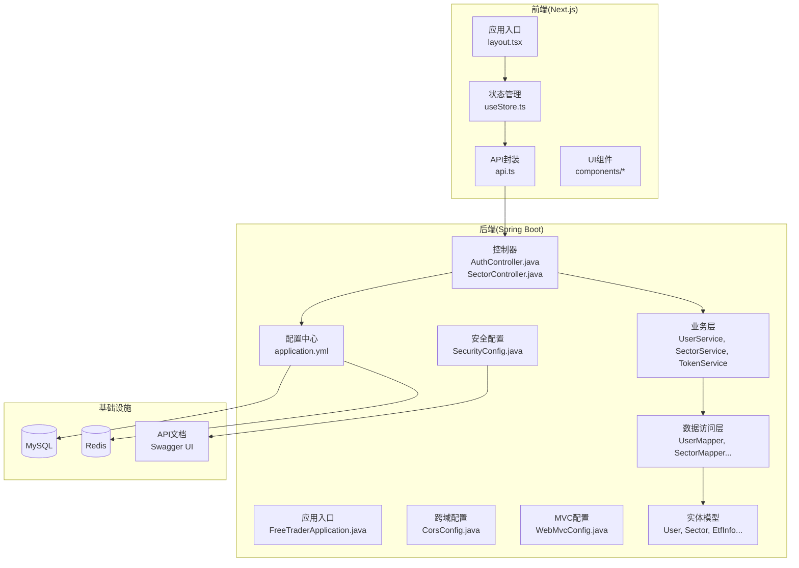
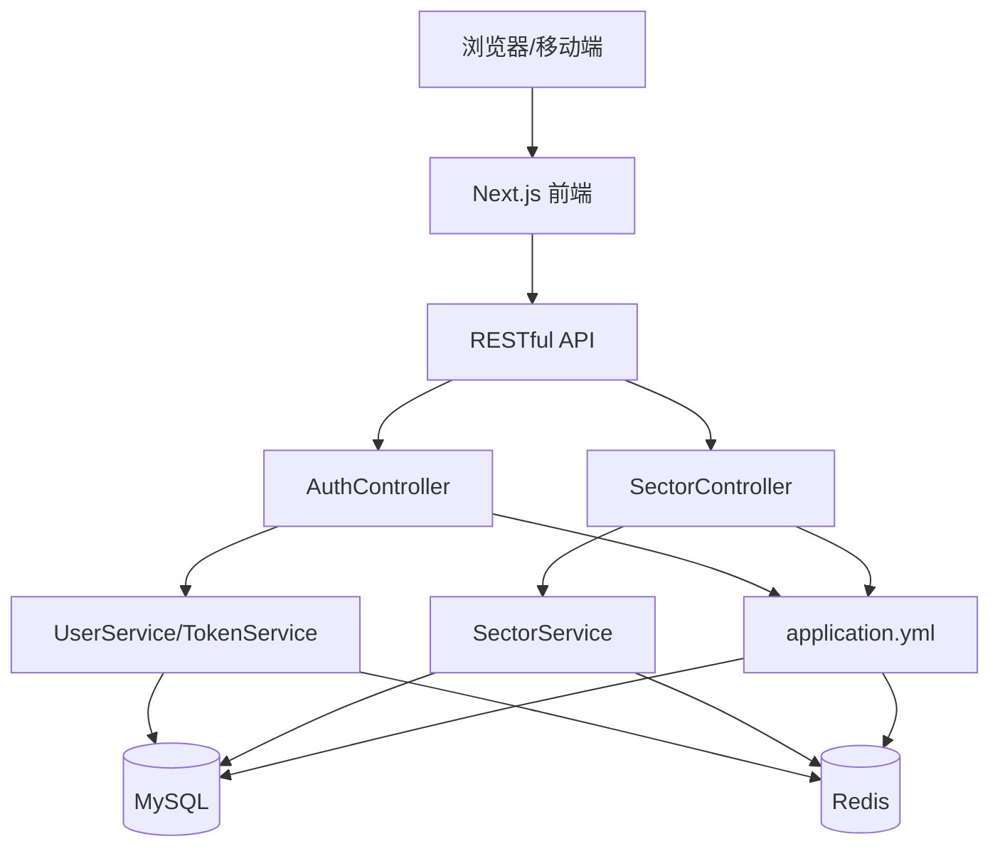
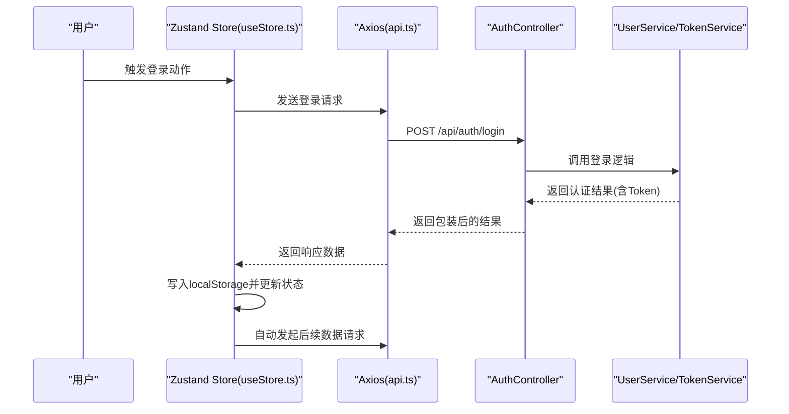
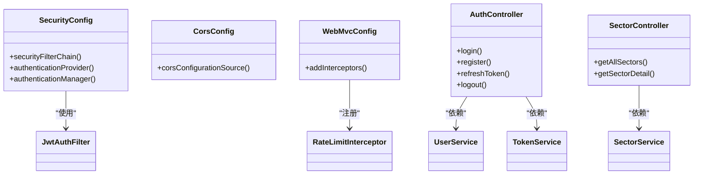
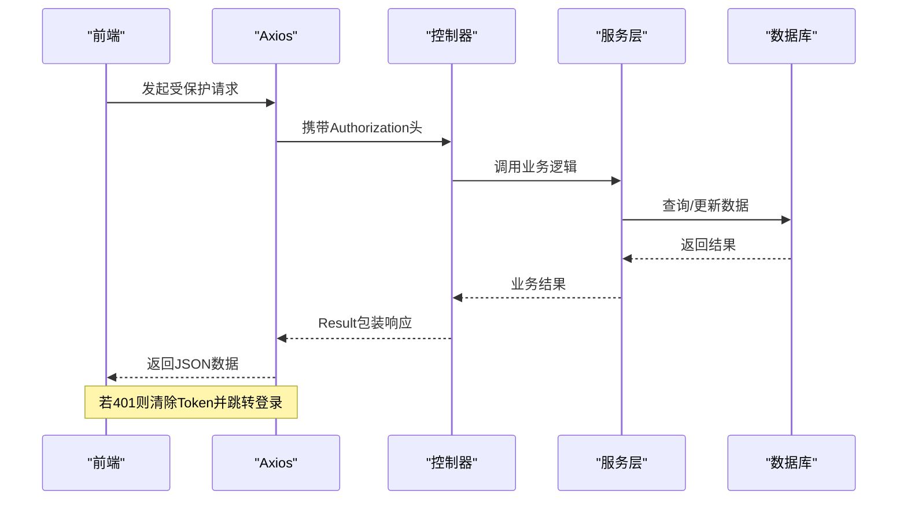
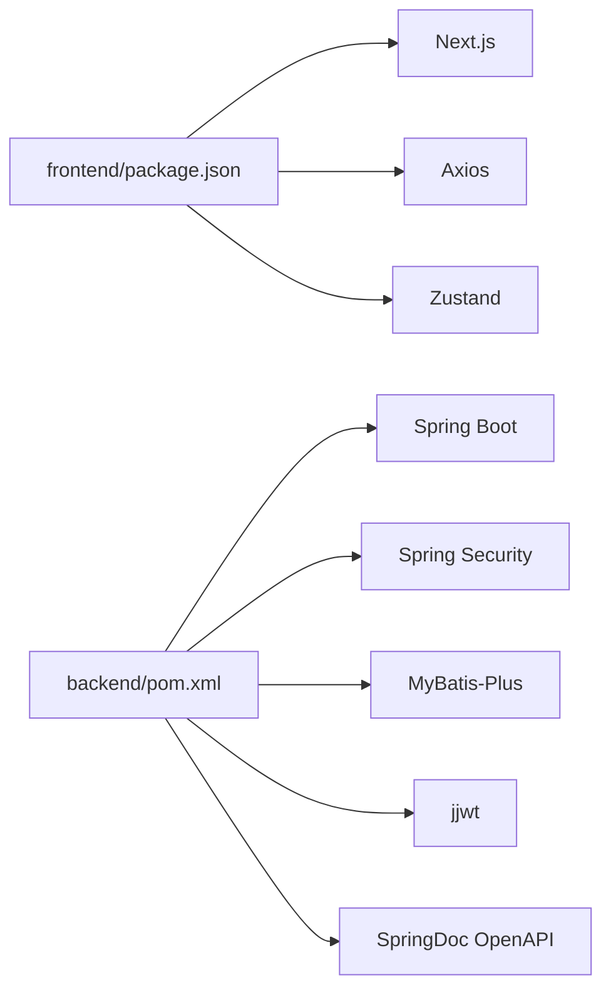

# 整体架构概览

<cite>
**本文档引用的文件**
- [README.md](file://README.md)
- [FreeTraderApplication.java](file://backend/src/main/java/com/freetrader/FreeTraderApplication.java)
- [application.yml](file://backend/src/main/resources/application.yml)
- [SecurityConfig.java](file://backend/src/main/java/com/freetrader/config/SecurityConfig.java)
- [CorsConfig.java](file://backend/src/main/java/com/freetrader/config/CorsConfig.java)
- [WebMvcConfig.java](file://backend/src/main/java/com/freetrader/config/WebMvcConfig.java)
- [AuthController.java](file://backend/src/main/java/com/freetrader/controller/AuthController.java)
- [SectorController.java](file://backend/src/main/java/com/freetrader/controller/SectorController.java)
- [api.ts](file://frontend/src/lib/api.ts)
- [useStore.ts](file://frontend/src/store/useStore.ts)
- [layout.tsx](file://frontend/src/app/layout.tsx)
- [pom.xml](file://backend/pom.xml)
- [package.json](file://frontend/package.json)
</cite>

## 目录
1. [引言](#引言)
2. [项目结构](#项目结构)
3. [核心组件](#核心组件)
4. [架构总览](#架构总览)
5. [详细组件分析](#详细组件分析)
6. [依赖关系分析](#依赖关系分析)
7. [性能考虑](#性能考虑)
8. [故障排除指南](#故障排除指南)
9. [结论](#结论)

## 引言
本项目采用前后端分离架构设计，后端基于 Spring Boot 微服务框架，前端采用 Next.js 应用。系统通过 RESTful API 进行前后端通信，实现用户认证与授权、ETF 板块数据查询、收藏管理、缓存与限流等核心功能。整体设计遵循分层架构原则，确保表现层、业务层、数据访问层职责清晰，便于维护与扩展。

## 项目结构
项目采用典型的前后端分离布局：
- 后端：Spring Boot 应用，包含配置、控制器、服务、数据访问层、实体与异常处理模块
- 前端：Next.js 应用，包含页面路由、UI 组件、状态管理、API 封装与类型定义
- 数据库：MySQL 初始化脚本位于 sql 目录
- 文档与配置：README 提供技术栈与快速开始说明，配置文件集中于后端 resources 与前端根目录

**图表来源**
- [layout.tsx](file://frontend/src/app/layout.tsx#L16-L35)
- [useStore.ts](file://frontend/src/store/useStore.ts#L62-L304)
- [api.ts](file://frontend/src/lib/api.ts#L1-L89)
- [FreeTraderApplication.java](file://backend/src/main/java/com/freetrader/FreeTraderApplication.java#L9-L14)
- [application.yml](file://backend/src/main/resources/application.yml#L1-L102)
- [SecurityConfig.java](file://backend/src/main/java/com/freetrader/config/SecurityConfig.java#L20-L61)
- [CorsConfig.java](file://backend/src/main/java/com/freetrader/config/CorsConfig.java#L13-L29)
- [WebMvcConfig.java](file://backend/src/main/java/com/freetrader/config/WebMvcConfig.java#L13-L26)
- [AuthController.java](file://backend/src/main/java/com/freetrader/controller/AuthController.java#L19-L72)
- [SectorController.java](file://backend/src/main/java/com/freetrader/controller/SectorController.java#L22-L63)

**章节来源**
- [README.md](file://README.md#L28-L47)
- [package.json](file://frontend/package.json#L1-L44)
- [pom.xml](file://backend/pom.xml#L1-L143)

## 核心组件
- 前端应用
  - 应用入口与路由：Next.js 页面路由与根布局，统一注入头部导航、全局客户端组件与通知系统
  - 状态管理：基于 Zustand 的应用状态容器，封装认证、UI、图表选择与数据加载逻辑
  - API 封装：基于 Axios 的请求/响应拦截器，自动携带 Bearer Token 并处理 401 错误
- 后端应用
  - 应用入口：Spring Boot 启动类，扫描 Mapper 包路径
  - 配置中心：application.yml 集中管理数据库、Redis、JWT、MyBatis Plus、日志与 OpenAPI 等配置
  - 安全体系：基于 Spring Security 的无状态 JWT 认证链，支持跨域与限流
  - 控制器层：提供认证、板块查询等 REST 接口，统一返回 Result 包装
  - 业务层：封装用户、收藏、板块等业务逻辑
  - 数据访问层：MyBatis-Plus Mapper 映射数据库表

**章节来源**
- [layout.tsx](file://frontend/src/app/layout.tsx#L16-L35)
- [useStore.ts](file://frontend/src/store/useStore.ts#L24-L60)
- [api.ts](file://frontend/src/lib/api.ts#L1-L89)
- [FreeTraderApplication.java](file://backend/src/main/java/com/freetrader/FreeTraderApplication.java#L9-L14)
- [application.yml](file://backend/src/main/resources/application.yml#L1-L102)
- [SecurityConfig.java](file://backend/src/main/java/com/freetrader/config/SecurityConfig.java#L20-L61)
- [CorsConfig.java](file://backend/src/main/java/com/freetrader/config/CorsConfig.java#L13-L29)
- [WebMvcConfig.java](file://backend/src/main/java/com/freetrader/config/WebMvcConfig.java#L13-L26)
- [AuthController.java](file://backend/src/main/java/com/freetrader/controller/AuthController.java#L19-L72)
- [SectorController.java](file://backend/src/main/java/com/freetrader/controller/SectorController.java#L22-L63)

## 架构总览
系统采用前后端分离的微服务理念（后端以单一 Spring Boot 应用形式呈现），通过 RESTful API 进行通信。整体架构遵循分层设计：
- 表现层：Next.js 前端负责用户交互与状态管理，通过 Axios 调用后端接口
- 业务层：后端控制器接收请求，调用服务层执行业务逻辑
- 数据访问层：服务层通过 Mapper 访问数据库，结合 Redis 缓存提升性能
- 安全层：JWT 无状态认证，配合 Token 黑名单与刷新机制，保障会话安全
- 配置层：集中化配置管理，支持环境变量覆盖与 OpenAPI 文档生成

**图表来源**
- [api.ts](file://frontend/src/lib/api.ts#L1-L89)
- [AuthController.java](file://backend/src/main/java/com/freetrader/controller/AuthController.java#L23-L72)
- [SectorController.java](file://backend/src/main/java/com/freetrader/controller/SectorController.java#L26-L63)
- [application.yml](file://backend/src/main/resources/application.yml#L1-L102)

## 详细组件分析

### 前端组件分析
- 应用入口与路由
  - 根布局统一注入头部导航、全局客户端组件与通知系统，确保认证守卫与主题切换等功能可用
- 状态管理
  - 使用 Zustand 管理认证状态、用户信息、图表选择、数据加载与收藏切换等逻辑
  - 支持乐观更新：本地先更新 UI，再异步同步至后端；若失败保留本地状态保证用户体验
- API 封装
  - Axios 实例配置基础 URL 与通用请求头
  - 请求拦截器自动附加 Bearer Token
  - 响应拦截器统一处理 401 未授权错误，清空本地存储并跳转登录页

**图表来源**
- [useStore.ts](file://frontend/src/store/useStore.ts#L69-L103)
- [api.ts](file://frontend/src/lib/api.ts#L40-L50)
- [AuthController.java](file://backend/src/main/java/com/freetrader/controller/AuthController.java#L34-L39)

**章节来源**
- [layout.tsx](file://frontend/src/app/layout.tsx#L16-L35)
- [useStore.ts](file://frontend/src/store/useStore.ts#L62-L304)
- [api.ts](file://frontend/src/lib/api.ts#L1-L89)

### 后端组件分析
- 应用入口与配置
  - 启动类启用 MyBatis-Plus Mapper 扫描，简化数据访问层开发
  - application.yml 集中管理数据库连接、Redis、JWT、MyBatis Plus、日志与 OpenAPI
- 安全与跨域
  - SecurityConfig 配置无状态会话、JWT 过滤器、CORS 与权限规则
  - CorsConfig 限定允许的源、方法与头部，并支持凭据传递
  - WebMvcConfig 注册限流拦截器，保护敏感接口
- 控制器层
  - AuthController 提供登录、注册、刷新与登出接口，使用注解生成 OpenAPI 文档
  - SectorController 提供板块列表与详情查询，集成当前用户 ID 用于个性化数据
- 业务与数据访问
  - 业务层封装用户认证、Token 管理、板块聚合与收藏逻辑
  - 数据访问层通过 MyBatis-Plus Mapper 访问数据库，支持逻辑删除与驼峰映射

**图表来源**
- [SecurityConfig.java](file://backend/src/main/java/com/freetrader/config/SecurityConfig.java#L20-L61)
- [CorsConfig.java](file://backend/src/main/java/com/freetrader/config/CorsConfig.java#L13-L29)
- [WebMvcConfig.java](file://backend/src/main/java/com/freetrader/config/WebMvcConfig.java#L13-L26)
- [AuthController.java](file://backend/src/main/java/com/freetrader/controller/AuthController.java#L23-L72)
- [SectorController.java](file://backend/src/main/java/com/freetrader/controller/SectorController.java#L26-L63)

**章节来源**
- [FreeTraderApplication.java](file://backend/src/main/java/com/freetrader/FreeTraderApplication.java#L9-L14)
- [application.yml](file://backend/src/main/resources/application.yml#L1-L102)
- [SecurityConfig.java](file://backend/src/main/java/com/freetrader/config/SecurityConfig.java#L20-L61)
- [CorsConfig.java](file://backend/src/main/java/com/freetrader/config/CorsConfig.java#L13-L29)
- [WebMvcConfig.java](file://backend/src/main/java/com/freetrader/config/WebMvcConfig.java#L13-L26)
- [AuthController.java](file://backend/src/main/java/com/freetrader/controller/AuthController.java#L23-L72)
- [SectorController.java](file://backend/src/main/java/com/freetrader/controller/SectorController.java#L26-L63)

### RESTful API 设计原则
- 资源命名与路径
  - 认证相关：/api/auth/login、/api/auth/register、/api/auth/refresh、/api/auth/logout
  - 板块相关：/api/sectors、/api/sectors/{id}
  - 收藏相关：/api/favorites、/api/favorites/{cid}、/api/favorites/{cid}/toggle
- 方法语义
  - GET：查询板块列表与详情
  - POST：登录、注册、刷新 Token、添加收藏
  - DELETE：取消收藏
  - POST + 路径参数：切换收藏状态
- 响应格式
  - 统一使用 Result 包装，包含 code、message 与 data 字段，便于前端一致处理
- 安全与鉴权
  - 除公开接口外，其余请求需携带 Bearer Token
  - 登出后 Token 加入黑名单，防止继续使用

**章节来源**
- [AuthController.java](file://backend/src/main/java/com/freetrader/controller/AuthController.java#L23-L72)
- [SectorController.java](file://backend/src/main/java/com/freetrader/controller/SectorController.java#L26-L63)
- [api.ts](file://frontend/src/lib/api.ts#L40-L86)

### 前后端通信协议
- 协议与端口
  - 前端通过 http://localhost:8080/api 调用后端 REST 接口
  - 开发模式下前端代理指向后端 8080 端口
- 认证流程
  - 登录成功后，后端返回包含 Access Token 与 Refresh Token 的响应
  - 前端将 Token 存储于 localStorage，并在后续请求头 Authorization 中附带 Bearer Token
  - 当响应 401 时，前端清除本地存储并重定向至登录页
- 错误处理
  - 前端统一拦截 401 未授权错误，触发登出流程
  - 后端通过统一异常处理器与业务异常类提供结构化错误信息

**图表来源**
- [api.ts](file://frontend/src/lib/api.ts#L13-L37)
- [AuthController.java](file://backend/src/main/java/com/freetrader/controller/AuthController.java#L34-L39)
- [SectorController.java](file://backend/src/main/java/com/freetrader/controller/SectorController.java#L44-L48)

**章节来源**
- [api.ts](file://frontend/src/lib/api.ts#L1-L89)
- [application.yml](file://backend/src/main/resources/application.yml#L1-L102)

## 依赖关系分析
- 技术栈依赖
  - 前端：Next.js、React、TypeScript、Axios、Zustand、Radix UI、Tailwind CSS、Lightweight Charts
  - 后端：Spring Boot、Spring Security、MyBatis-Plus、MySQL、Redis、JWT、SpringDoc OpenAPI、Lombok
- 模块耦合
  - 前端 Store 与 API 封装紧密耦合，但通过接口抽象降低对具体实现的依赖
  - 后端控制器仅依赖服务接口，服务层依赖 Mapper，形成清晰的依赖方向
- 外部依赖
  - 数据库与缓存通过 application.yml 配置，支持环境变量覆盖
  - OpenAPI 自动生成接口文档，便于前后端协作

**图表来源**
- [package.json](file://frontend/package.json#L11-L31)
- [pom.xml](file://backend/pom.xml#L43-L124)

**章节来源**
- [package.json](file://frontend/package.json#L1-L44)
- [pom.xml](file://backend/pom.xml#L1-L143)

## 性能考虑
- 缓存策略
  - Redis 作为二级缓存，提升热点数据读取性能；默认 TTL 5 分钟，可根据业务调整
- 数据库连接池
  - HikariCP 连接池参数可调，生产环境建议根据并发量优化最大连接数与超时时间
- 限流与防护
  - WebMvcConfig 注册限流拦截器，保护登录、注册等敏感接口；刷新 Token 接口除外
- 前端性能
  - Zustand 精简状态管理，避免不必要的重渲染
  - 本地回退数据：当网络异常时使用本地常量数据，提升用户体验

**章节来源**
- [application.yml](file://backend/src/main/resources/application.yml#L13-L18)
- [application.yml](file://backend/src/main/resources/application.yml#L32-L44)
- [WebMvcConfig.java](file://backend/src/main/java/com/freetrader/config/WebMvcConfig.java#L19-L24)
- [useStore.ts](file://frontend/src/store/useStore.ts#L164-L206)

## 故障排除指南
- 常见问题
  - 登录后无法访问受保护接口：检查前端是否正确写入 Token 至 localStorage，并确认请求头 Authorization 是否包含 Bearer Token
  - 401 未授权错误：前端会自动清除本地存储并跳转登录页；检查后端 JWT 密钥与过期时间配置
  - 数据库连接失败：核对 application.yml 中数据库 URL、用户名与密码，确认 MySQL 服务运行正常
  - Redis 连接异常：检查 Redis 地址、端口与密码配置，确认 Redis 服务可用
- 排查步骤
  - 启用 SQL 日志（开发环境）查看 MyBatis-Plus 执行的 SQL
  - 查看后端日志文件定位异常堆栈
  - 使用 Swagger UI 验证接口可用性与参数格式

**章节来源**
- [api.ts](file://frontend/src/lib/api.ts#L25-L37)
- [application.yml](file://backend/src/main/resources/application.yml#L51-L52)
- [application.yml](file://backend/src/main/resources/application.yml#L87-L90)

## 结论
FreeTrader 项目通过前后端分离架构实现了清晰的职责划分与良好的可维护性。后端采用 Spring Boot 微服务理念（以单体应用形式），结合 JWT 认证、Redis 缓存与限流策略，提供了稳定可靠的 API 服务能力；前端基于 Next.js 与 Zustand 实现了高效的交互体验。整体架构具备良好的扩展性，可在保持现有分层结构的基础上按需引入独立微服务或容器化部署。