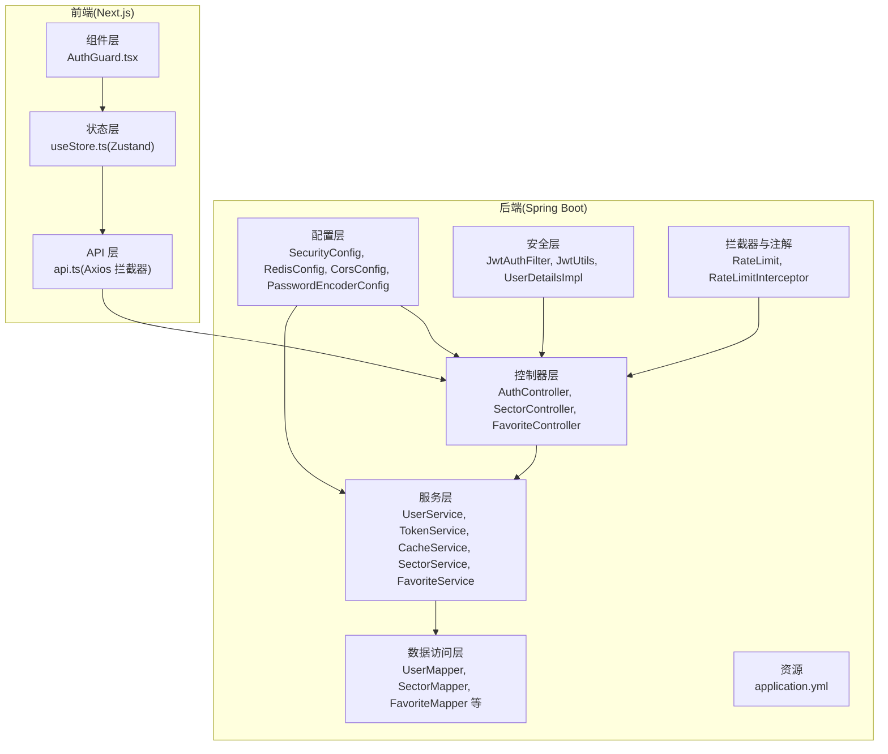
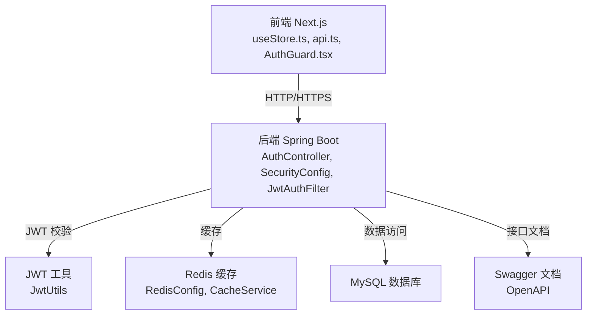
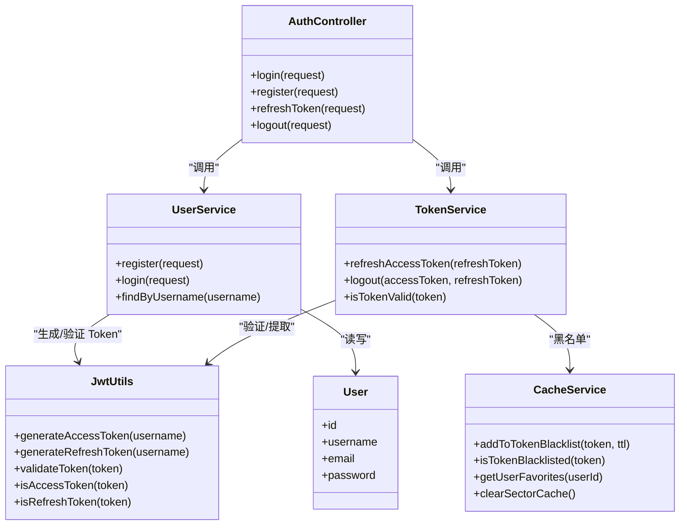
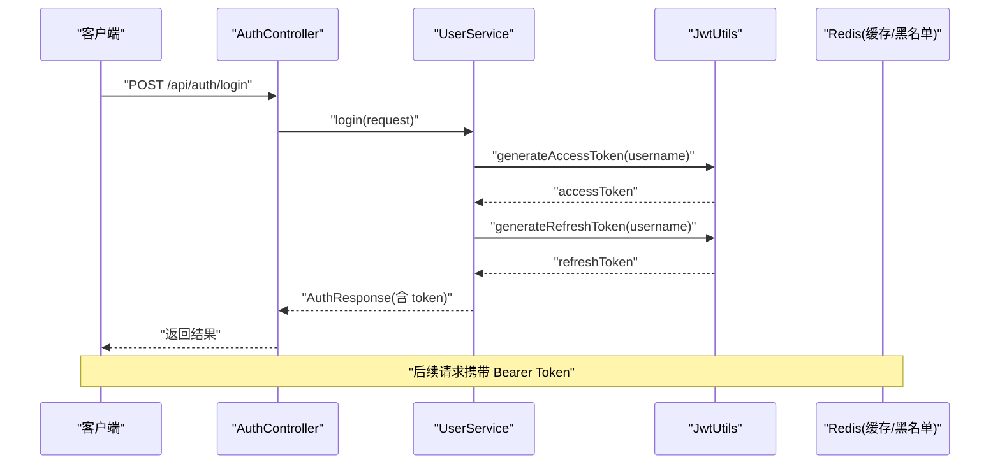
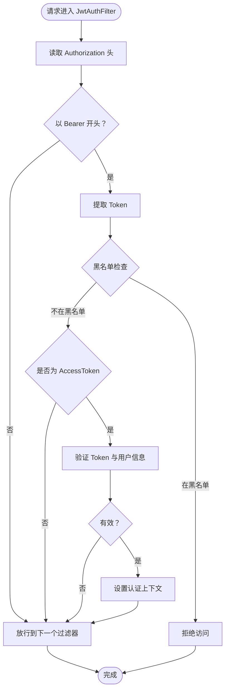
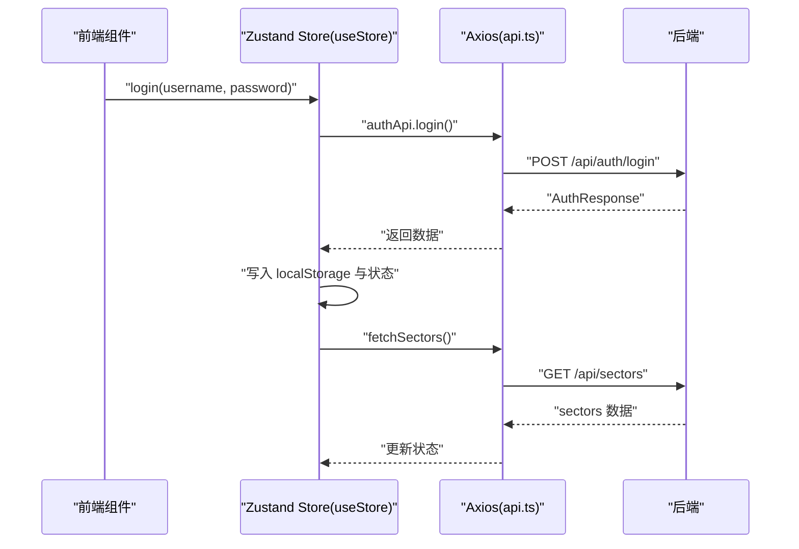
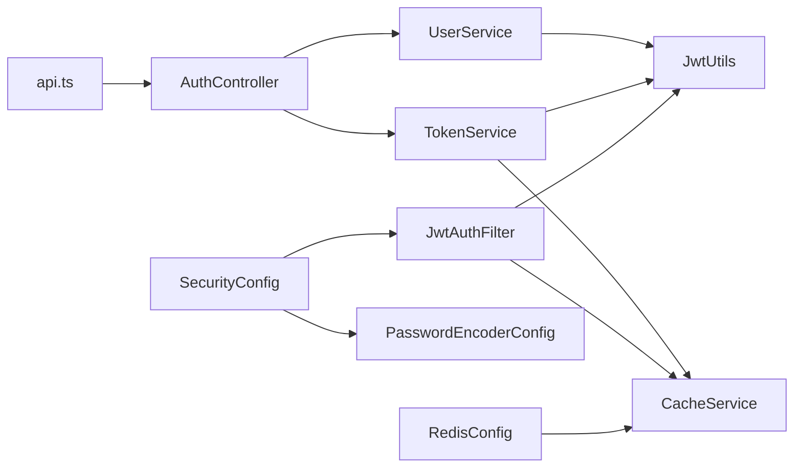

# 架构设计

<cite>
**本文档引用的文件**
- [SecurityConfig.java](file://backend/src/main/java/com/freetrader/config/SecurityConfig.java)
- [RedisConfig.java](file://backend/src/main/java/com/freetrader/config/RedisConfig.java)
- [CorsConfig.java](file://backend/src/main/java/com/freetrader/config/CorsConfig.java)
- [PasswordEncoderConfig.java](file://backend/src/main/java/com/freetrader/config/PasswordEncoderConfig.java)
- [AuthController.java](file://backend/src/main/java/com/freetrader/controller/AuthController.java)
- [JwtAuthFilter.java](file://backend/src/main/java/com/freetrader/security/JwtAuthFilter.java)
- [JwtUtils.java](file://backend/src/main/java/com/freetrader/security/JwtUtils.java)
- [UserService.java](file://backend/src/main/java/com/freetrader/service/UserService.java)
- [TokenService.java](file://backend/src/main/java/com/freetrader/service/TokenService.java)
- [CacheService.java](file://backend/src/main/java/com/freetrader/service/CacheService.java)
- [RateLimit.java](file://backend/src/main/java/com/freetrader/annotation/RateLimit.java)
- [RateLimitInterceptor.java](file://backend/src/main/java/com/freetrader/interceptor/RateLimitInterceptor.java)
- [SecurityConstants.java](file://backend/src/main/java/com/freetrader/util/SecurityConstants.java)
- [User.java](file://backend/src/main/java/com/freetrader/entity/User.java)
- [application.yml](file://backend/src/main/resources/application.yml)
- [api.ts](file://frontend/src/lib/api.ts)
- [useStore.ts](file://frontend/src/store/useStore.ts)
- [AuthGuard.tsx](file://frontend/src/components/AuthGuard.tsx)
</cite>

## 目录
1. [简介](#简介)
2. [项目结构](#项目结构)
3. [核心组件](#核心组件)
4. [架构总览](#架构总览)
5. [详细组件分析](#详细组件分析)
6. [依赖关系分析](#依赖关系分析)
7. [性能考虑](#性能考虑)
8. [故障排除指南](#故障排除指南)
9. [结论](#结论)

## 简介
本架构设计文档面向 FreeTrader 项目，系统采用前后端分离架构：后端基于 Spring Boot 微服务，提供 REST API；前端基于 Next.js 应用，使用 Zustand 进行状态管理。系统遵循分层架构设计，包含控制器层、服务层与数据访问层；安全架构采用 JWT 认证、CORS 配置与密码加密；缓存架构基于 Redis，结合 Token 黑名单机制实现安全的会话管理；前端通过 Axios 拦截器与 Zustand 状态管理实现统一的认证态与业务状态控制。

## 项目结构
FreeTrader 项目分为后端与前端两大模块：
- 后端（Spring Boot）
  - 配置层：安全、缓存、跨域、密码编码等配置类
  - 控制器层：对外暴露 REST 接口（认证、收藏、板块等）
  - 服务层：业务逻辑处理（用户、Token、缓存等）
  - 安全层：JWT 过滤器、工具类、用户详情实现
  - 数据访问层：MyBatis-Plus Mapper 接口与实体类
  - 拦截器与注解：限流注解与拦截器
  - 资源：配置文件 application.yml
- 前端（Next.js）
  - API 层：Axios 实例与拦截器封装
  - 状态层：Zustand Store 管理认证态与业务数据
  - 组件层：路由守卫、页面与 UI 组件

图表来源
- [SecurityConfig.java](file://backend/src/main/java/com/freetrader/config/SecurityConfig.java#L20-L61)
- [RedisConfig.java](file://backend/src/main/java/com/freetrader/config/RedisConfig.java#L21-L79)
- [CorsConfig.java](file://backend/src/main/java/com/freetrader/config/CorsConfig.java#L12-L29)
- [PasswordEncoderConfig.java](file://backend/src/main/java/com/freetrader/config/PasswordEncoderConfig.java#L12-L20)
- [AuthController.java](file://backend/src/main/java/com/freetrader/controller/AuthController.java#L19-L72)
- [JwtAuthFilter.java](file://backend/src/main/java/com/freetrader/security/JwtAuthFilter.java#L22-L84)
- [JwtUtils.java](file://backend/src/main/java/com/freetrader/security/JwtUtils.java#L21-L194)
- [UserService.java](file://backend/src/main/java/com/freetrader/service/UserService.java#L22-L103)
- [TokenService.java](file://backend/src/main/java/com/freetrader/service/TokenService.java#L10-L64)
- [CacheService.java](file://backend/src/main/java/com/freetrader/service/CacheService.java#L18-L206)
- [RateLimit.java](file://backend/src/main/java/com/freetrader/annotation/RateLimit.java#L5-L49)
- [RateLimitInterceptor.java](file://backend/src/main/java/com/freetrader/interceptor/RateLimitInterceptor.java#L20-L153)
- [application.yml](file://backend/src/main/resources/application.yml#L1-L102)
- [api.ts](file://frontend/src/lib/api.ts#L1-L89)
- [useStore.ts](file://frontend/src/store/useStore.ts#L1-L304)
- [AuthGuard.tsx](file://frontend/src/components/AuthGuard.tsx#L11-L60)

章节来源
- [application.yml](file://backend/src/main/resources/application.yml#L1-L102)

## 核心组件
- 安全配置（后端）
  - 安全过滤链：禁用 CSRF，启用 CORS，基于路径的授权规则，无状态会话
  - 认证提供者：基于数据库的用户详情加载与密码编码器
- 缓存配置（后端）
  - RedisTemplate 与 RedisCacheManager：JSON 序列化、TTL 策略、命名空间缓存
- 跨域配置（后端）
  - 允许本地前端域名、常用方法与头部、允许凭据、预检缓存
- 密码编码（后端）
  - BCrypt 密码编码器独立配置，避免循环依赖
- 限流注解与拦截器（后端）
  - 注解定义滑动窗口限流参数；拦截器基于 Redis 实现计数与过期
- JWT 工具与过滤器（后端）
  - JWT 生成/解析/验证、类型判断、过期时间；过滤器校验 Token 并集成黑名单
- 用户与 Token 服务（后端）
  - 用户注册/登录、密码加密；Token 刷新与登出（加入黑名单）
- 前端 API 与状态管理（前端）
  - Axios 请求/响应拦截器、认证态持久化；Zustand 管理用户、UI、数据与收藏同步

章节来源
- [SecurityConfig.java](file://backend/src/main/java/com/freetrader/config/SecurityConfig.java#L29-L60)
- [RedisConfig.java](file://backend/src/main/java/com/freetrader/config/RedisConfig.java#L25-L77)
- [CorsConfig.java](file://backend/src/main/java/com/freetrader/config/CorsConfig.java#L15-L28)
- [PasswordEncoderConfig.java](file://backend/src/main/java/com/freetrader/config/PasswordEncoderConfig.java#L15-L19)
- [RateLimit.java](file://backend/src/main/java/com/freetrader/annotation/RateLimit.java#L12-L49)
- [RateLimitInterceptor.java](file://backend/src/main/java/com/freetrader/interceptor/RateLimitInterceptor.java#L35-L114)
- [JwtUtils.java](file://backend/src/main/java/com/freetrader/security/JwtUtils.java#L23-L194)
- [JwtAuthFilter.java](file://backend/src/main/java/com/freetrader/security/JwtAuthFilter.java#L25-L84)
- [UserService.java](file://backend/src/main/java/com/freetrader/service/UserService.java#L25-L103)
- [TokenService.java](file://backend/src/main/java/com/freetrader/service/TokenService.java#L13-L64)
- [api.ts](file://frontend/src/lib/api.ts#L13-L37)
- [useStore.ts](file://frontend/src/store/useStore.ts#L24-L60)

## 架构总览
系统采用前后端分离的微服务风格后端与 SPA 前端协作：
- 后端通过 Spring MVC 暴露 REST API，使用 Spring Security 保护接口
- 前端通过 Axios 与后端通信，使用拦截器统一注入 Bearer Token
- 状态管理采用 Zustand，集中管理认证态、UI 状态与业务数据
- 缓存与安全通过 Redis 与 JWT 协同，实现高性能与可审计的会话管理

图表来源
- [api.ts](file://frontend/src/lib/api.ts#L1-L89)
- [useStore.ts](file://frontend/src/store/useStore.ts#L1-L304)
- [AuthGuard.tsx](file://frontend/src/components/AuthGuard.tsx#L11-L60)
- [AuthController.java](file://backend/src/main/java/com/freetrader/controller/AuthController.java#L19-L72)
- [SecurityConfig.java](file://backend/src/main/java/com/freetrader/config/SecurityConfig.java#L29-L60)
- [JwtAuthFilter.java](file://backend/src/main/java/com/freetrader/security/JwtAuthFilter.java#L31-L82)
- [JwtUtils.java](file://backend/src/main/java/com/freetrader/security/JwtUtils.java#L23-L194)
- [RedisConfig.java](file://backend/src/main/java/com/freetrader/config/RedisConfig.java#L21-L79)
- [CacheService.java](file://backend/src/main/java/com/freetrader/service/CacheService.java#L18-L206)
- [application.yml](file://backend/src/main/resources/application.yml#L1-L102)

## 详细组件分析

### 分层架构设计
- 控制器层（Controller）
  - 职责：接收 HTTP 请求，参数校验，调用服务层，封装统一响应结果
  - 示例：认证控制器提供登录、注册、刷新 Token、登出接口
- 服务层（Service）
  - 职责：业务编排、事务控制、与缓存/外部系统交互
  - 示例：用户服务负责注册/登录与密码加密；Token 服务负责刷新与黑名单维护
- 数据访问层（Mapper/Entity）
  - 职责：SQL 映射与实体模型，支持逻辑删除与驼峰映射
  - 示例：用户实体与用户 Mapper，配合 MyBatis-Plus 使用

图表来源
- [AuthController.java](file://backend/src/main/java/com/freetrader/controller/AuthController.java#L23-L72)
- [UserService.java](file://backend/src/main/java/com/freetrader/service/UserService.java#L25-L103)
- [TokenService.java](file://backend/src/main/java/com/freetrader/service/TokenService.java#L13-L64)
- [CacheService.java](file://backend/src/main/java/com/freetrader/service/CacheService.java#L18-L206)
- [JwtUtils.java](file://backend/src/main/java/com/freetrader/security/JwtUtils.java#L23-L194)
- [User.java](file://backend/src/main/java/com/freetrader/entity/User.java#L10-L29)

章节来源
- [AuthController.java](file://backend/src/main/java/com/freetrader/controller/AuthController.java#L19-L72)
- [UserService.java](file://backend/src/main/java/com/freetrader/service/UserService.java#L25-L103)
- [TokenService.java](file://backend/src/main/java/com/freetrader/service/TokenService.java#L13-L64)
- [CacheService.java](file://backend/src/main/java/com/freetrader/service/CacheService.java#L18-L206)
- [JwtUtils.java](file://backend/src/main/java/com/freetrader/security/JwtUtils.java#L23-L194)
- [User.java](file://backend/src/main/java/com/freetrader/entity/User.java#L10-L29)

### 安全架构
- JWT 认证机制
  - 登录/注册成功后生成 Access Token 与 Refresh Token，并设置过期时间
  - 请求拦截器在 Authorization 头中携带 Bearer Token
  - JWT 过滤器解析 Token，校验类型与有效期，结合黑名单拒绝已失效 Token
- CORS 配置
  - 允许本地开发域名、常用方法与头部，支持凭据与预检缓存
- 密码加密
  - 使用 BCrypt 对用户密码进行编码存储，独立配置避免循环依赖
- 限流策略
  - 基于 Redis 的滑动窗口限流，支持按 IP、用户、全局三种维度

图表来源
- [AuthController.java](file://backend/src/main/java/com/freetrader/controller/AuthController.java#L28-L39)
- [UserService.java](file://backend/src/main/java/com/freetrader/service/UserService.java#L73-L96)
- [JwtUtils.java](file://backend/src/main/java/com/freetrader/security/JwtUtils.java#L100-L120)

章节来源
- [SecurityConfig.java](file://backend/src/main/java/com/freetrader/config/SecurityConfig.java#L29-L60)
- [CorsConfig.java](file://backend/src/main/java/com/freetrader/config/CorsConfig.java#L15-L28)
- [PasswordEncoderConfig.java](file://backend/src/main/java/com/freetrader/config/PasswordEncoderConfig.java#L15-L19)
- [JwtAuthFilter.java](file://backend/src/main/java/com/freetrader/security/JwtAuthFilter.java#L31-L82)
- [JwtUtils.java](file://backend/src/main/java/com/freetrader/security/JwtUtils.java#L135-L178)
- [RateLimitInterceptor.java](file://backend/src/main/java/com/freetrader/interceptor/RateLimitInterceptor.java#L35-L114)

### 缓存架构
- Redis 缓存策略
  - RedisTemplate 使用 JSON 序列化，键空间包含用户、收藏、板块等命名前缀
  - CacheManager 配置默认 TTL 与特定缓存（如 sectors、sectorDetail、userInfo）的短 TTL
- Token 黑名单机制
  - 登出或刷新时将 Access/Refresh Token 写入黑名单，Key 带有过期时间
  - 过滤器在每次请求检查 Token 是否在黑名单，确保已失效 Token 无法继续使用

图表来源
- [JwtAuthFilter.java](file://backend/src/main/java/com/freetrader/security/JwtAuthFilter.java#L31-L82)
- [CacheService.java](file://backend/src/main/java/com/freetrader/service/CacheService.java#L84-L101)
- [TokenService.java](file://backend/src/main/java/com/freetrader/service/TokenService.java#L41-L55)

章节来源
- [RedisConfig.java](file://backend/src/main/java/com/freetrader/config/RedisConfig.java#L25-L77)
- [CacheService.java](file://backend/src/main/java/com/freetrader/service/CacheService.java#L18-L206)
- [TokenService.java](file://backend/src/main/java/com/freetrader/service/TokenService.java#L13-L64)

### 状态管理架构（Zustand）
- 状态模型
  - 认证态：isAuthenticated、user、token
  - UI 态：selectedSector、isCommandPaletteOpen、chart 选择
  - 数据态：stocks、sectors、sectorDetail、isLoading
- 行为与副作用
  - 登录/注册：调用后端 API，成功后写入 localStorage 并更新状态
  - 初始化：从 localStorage 恢复认证态，拉取板块列表
  - 收藏切换：乐观更新本地状态，异步同步至后端（失败不回滚）
  - 图表选择：最多 5 只基金，去重与清空
- 前端拦截器
  - 请求拦截器自动注入 Bearer Token
  - 响应拦截器处理 401，清理本地存储并跳转到认证页

图表来源
- [useStore.ts](file://frontend/src/store/useStore.ts#L62-L133)
- [api.ts](file://frontend/src/lib/api.ts#L13-L37)
- [AuthController.java](file://backend/src/main/java/com/freetrader/controller/AuthController.java#L28-L39)

章节来源
- [useStore.ts](file://frontend/src/store/useStore.ts#L24-L304)
- [api.ts](file://frontend/src/lib/api.ts#L1-L89)
- [AuthGuard.tsx](file://frontend/src/components/AuthGuard.tsx#L11-L60)

## 依赖关系分析
- 后端组件耦合
  - 控制器依赖服务层；服务层依赖工具类与缓存服务；安全过滤器依赖 JWT 工具与用户详情服务
  - 配置类贯穿于安全、缓存、跨域与密码编码，形成横切关注点
- 前后端集成
  - 前端通过 Axios 与后端 REST API 交互；拦截器统一处理认证与错误
  - 路由守卫根据认证态决定页面访问权限

图表来源
- [AuthController.java](file://backend/src/main/java/com/freetrader/controller/AuthController.java#L23-L72)
- [UserService.java](file://backend/src/main/java/com/freetrader/service/UserService.java#L25-L103)
- [TokenService.java](file://backend/src/main/java/com/freetrader/service/TokenService.java#L13-L64)
- [JwtAuthFilter.java](file://backend/src/main/java/com/freetrader/security/JwtAuthFilter.java#L25-L84)
- [JwtUtils.java](file://backend/src/main/java/com/freetrader/security/JwtUtils.java#L23-L194)
- [CacheService.java](file://backend/src/main/java/com/freetrader/service/CacheService.java#L18-L206)
- [SecurityConfig.java](file://backend/src/main/java/com/freetrader/config/SecurityConfig.java#L29-L60)
- [PasswordEncoderConfig.java](file://backend/src/main/java/com/freetrader/config/PasswordEncoderConfig.java#L15-L19)
- [RedisConfig.java](file://backend/src/main/java/com/freetrader/config/RedisConfig.java#L21-L79)
- [api.ts](file://frontend/src/lib/api.ts#L1-L89)

章节来源
- [SecurityConfig.java](file://backend/src/main/java/com/freetrader/config/SecurityConfig.java#L29-L60)
- [RedisConfig.java](file://backend/src/main/java/com/freetrader/config/RedisConfig.java#L21-L79)
- [CorsConfig.java](file://backend/src/main/java/com/freetrader/config/CorsConfig.java#L12-L29)
- [PasswordEncoderConfig.java](file://backend/src/main/java/com/freetrader/config/PasswordEncoderConfig.java#L12-L20)
- [JwtAuthFilter.java](file://backend/src/main/java/com/freetrader/security/JwtAuthFilter.java#L25-L84)
- [JwtUtils.java](file://backend/src/main/java/com/freetrader/security/JwtUtils.java#L23-L194)
- [UserService.java](file://backend/src/main/java/com/freetrader/service/UserService.java#L25-L103)
- [TokenService.java](file://backend/src/main/java/com/freetrader/service/TokenService.java#L13-L64)
- [CacheService.java](file://backend/src/main/java/com/freetrader/service/CacheService.java#L18-L206)
- [RateLimit.java](file://backend/src/main/java/com/freetrader/annotation/RateLimit.java#L12-L49)
- [RateLimitInterceptor.java](file://backend/src/main/java/com/freetrader/interceptor/RateLimitInterceptor.java#L20-L153)
- [api.ts](file://frontend/src/lib/api.ts#L1-L89)
- [useStore.ts](file://frontend/src/store/useStore.ts#L1-L304)

## 性能考虑
- 缓存策略
  - 默认缓存 TTL 与热点数据短 TTL，减少数据库压力
  - 使用 SCAN 替代 KEYS，避免 Redis 阻塞
- 限流机制
  - 滑动窗口计数器算法，Redis incr+expire 实现，异常时放行保证可用性
- 序列化与连接池
  - Jackson JSON 序列化配置，Redis 连接池参数合理设置
- 前端优化
  - Zustand 本地状态，减少不必要的渲染；乐观更新提升交互体验

## 故障排除指南
- 认证失败/401
  - 检查前端是否正确注入 Bearer Token；确认后端 JWT 密钥与过期时间配置
  - 查看后端日志中 JWT 解析与黑名单检查输出
- 跨域问题
  - 确认 CORS 配置允许前端地址与方法；检查浏览器网络面板的预检请求
- 限流触发
  - 观察 Redis 中 rate_limit:* 键是否存在与过期时间；调整窗口与阈值
- 登出后仍可访问
  - 确认黑名单写入与过期时间；检查过滤器是否正确拦截

章节来源
- [api.ts](file://frontend/src/lib/api.ts#L25-L37)
- [JwtAuthFilter.java](file://backend/src/main/java/com/freetrader/security/JwtAuthFilter.java#L49-L82)
- [RateLimitInterceptor.java](file://backend/src/main/java/com/freetrader/interceptor/RateLimitInterceptor.java#L48-L62)
- [application.yml](file://backend/src/main/resources/application.yml#L60-L66)

## 结论
FreeTrader 项目通过清晰的分层架构、完善的 JWT 安全体系、基于 Redis 的缓存与黑名单机制，以及前端 Zustand 的高效状态管理，实现了高可用、易扩展且用户体验良好的金融数据展示平台。建议在生产环境中强化密钥管理、完善监控告警与日志审计，并持续评估缓存命中率与限流策略效果。