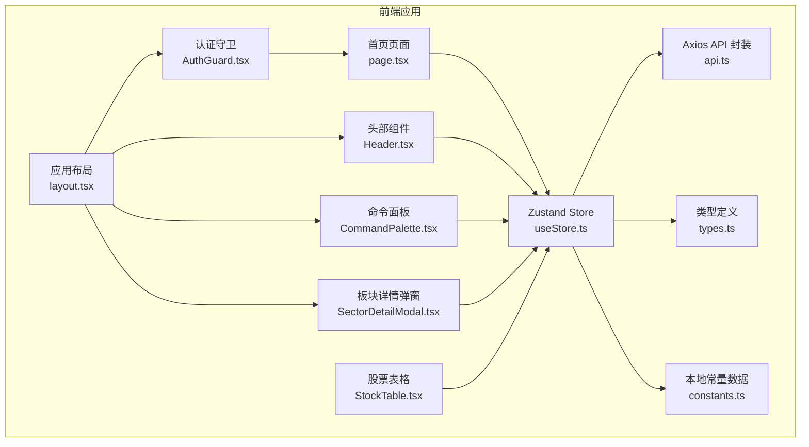
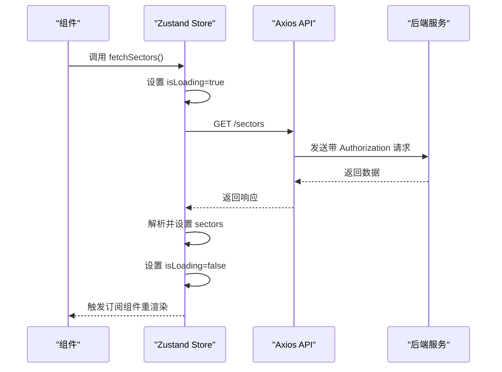
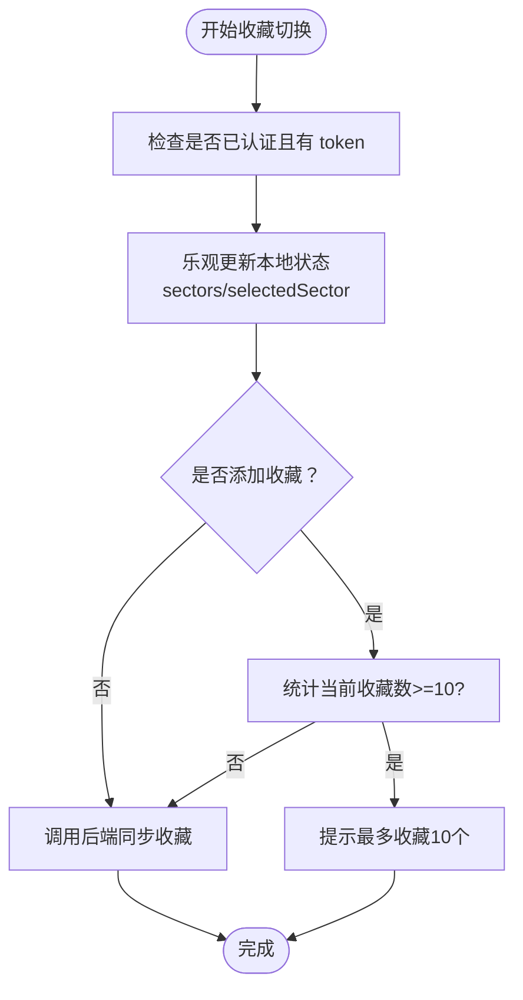
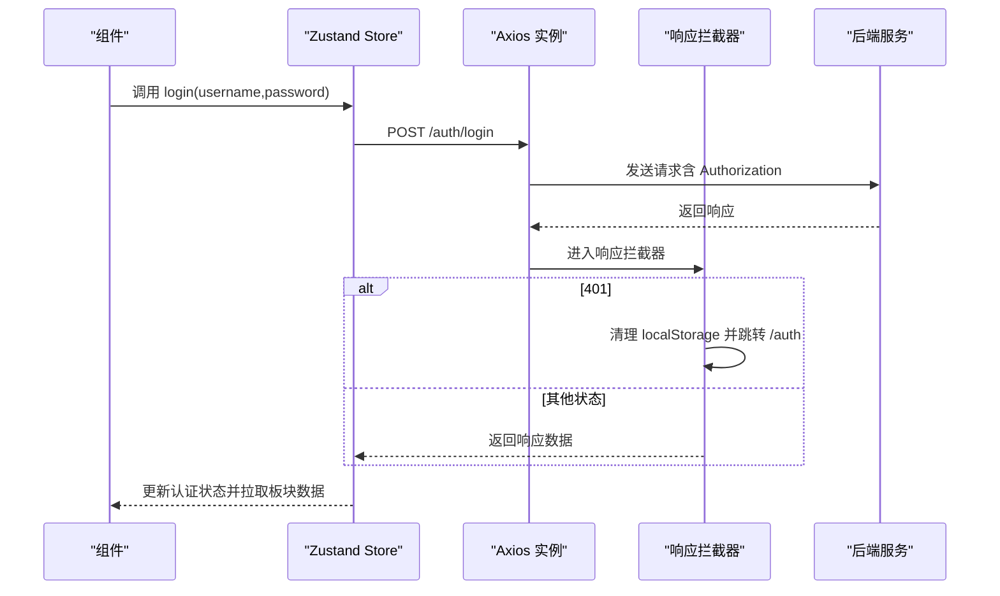
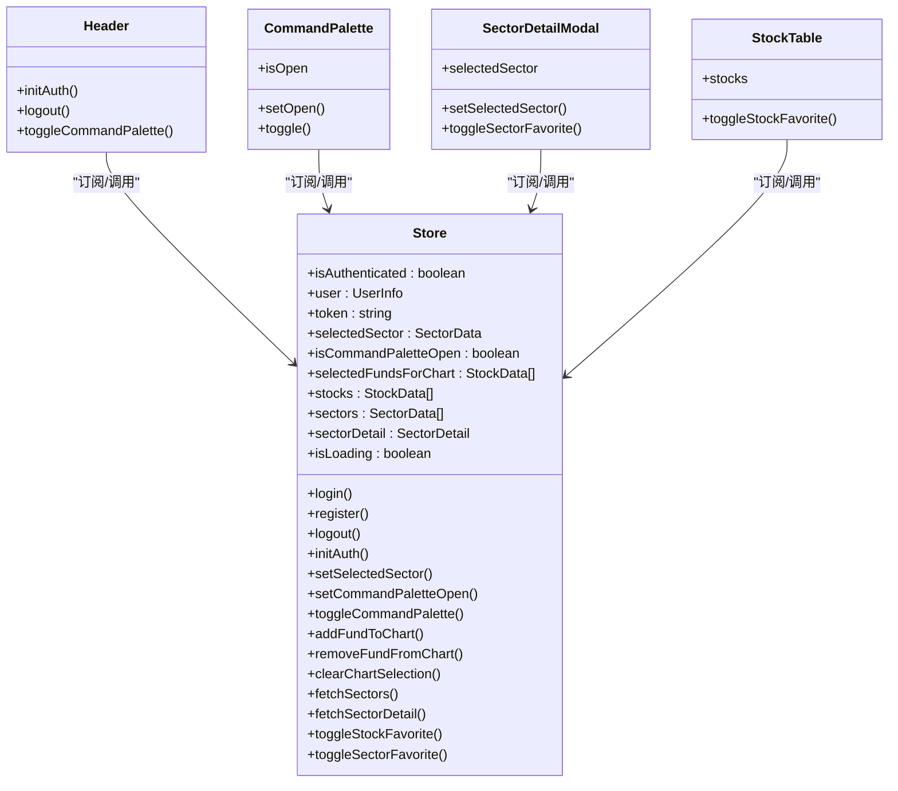
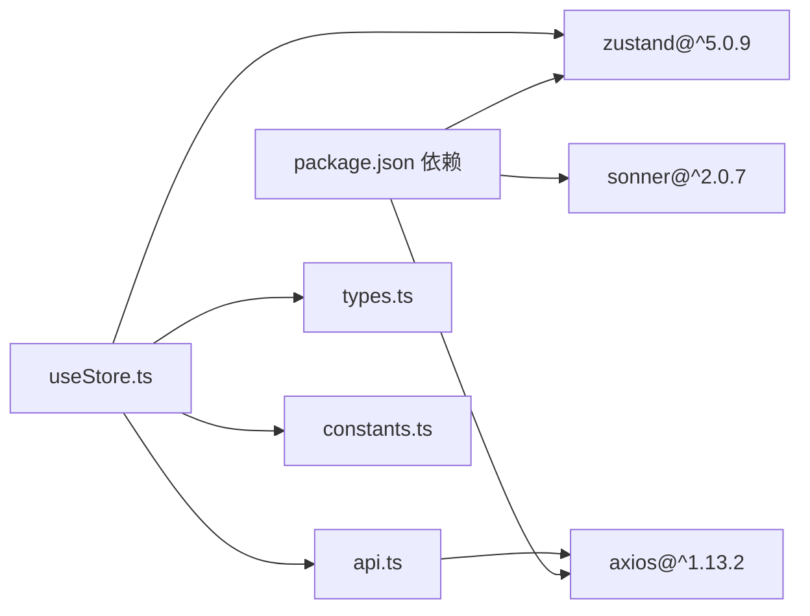

# 状态管理架构

<cite>
**本文引用的文件**
- [useStore.ts](file://frontend/src/store/useStore.ts)
- [api.ts](file://frontend/src/lib/api.ts)
- [types.ts](file://frontend/src/lib/types.ts)
- [constants.ts](file://frontend/src/lib/constants.ts)
- [package.json](file://frontend/package.json)
- [AuthGuard.tsx](file://frontend/src/components/AuthGuard.tsx)
- [Header.tsx](file://frontend/src/components/Header.tsx)
- [CommandPalette.tsx](file://frontend/src/components/CommandPalette.tsx)
- [SectorDetailModal.tsx](file://frontend/src/components/SectorDetailModal.tsx)
- [StockTable.tsx](file://frontend/src/components/StockTable.tsx)
- [page.tsx](file://frontend/src/app/page.tsx)
- [layout.tsx](file://frontend/src/app/layout.tsx)
</cite>

## 目录
1. [引言](#引言)
2. [项目结构](#项目结构)
3. [核心组件](#核心组件)
4. [架构总览](#架构总览)
5. [详细组件分析](#详细组件分析)
6. [依赖关系分析](#依赖关系分析)
7. [性能考量](#性能考量)
8. [故障排查指南](#故障排查指南)
9. [结论](#结论)
10. [附录](#附录)

## 引言
本文件系统性阐述 FreeTrader 前端的状态管理架构，重点围绕 Zustand 库的选型与使用策略，解释全局状态的分类与设计原则，详述状态更新机制（含异步更新、持久化、同步），以及状态管理与 API 的交互关系（数据获取、缓存策略、错误处理）。同时提供最佳实践建议与具体使用示例路径，帮助开发者高效、安全地维护状态层。

## 项目结构
FreeTrader 前端采用 Next.js 16 + TypeScript 构建，状态管理集中于 Zustand Store，API 层通过 Axios 封装统一请求与拦截器，类型定义集中在 types.ts，本地常量数据用于兜底与演示。

图表来源
- [layout.tsx](file://frontend/src/app/layout.tsx#L16-L35)
- [page.tsx](file://frontend/src/app/page.tsx#L11-L20)
- [AuthGuard.tsx](file://frontend/src/components/AuthGuard.tsx#L11-L26)
- [Header.tsx](file://frontend/src/components/Header.tsx#L12-L24)
- [CommandPalette.tsx](file://frontend/src/components/CommandPalette.tsx#L26-L47)
- [SectorDetailModal.tsx](file://frontend/src/components/SectorDetailModal.tsx#L10-L16)
- [StockTable.tsx](file://frontend/src/components/StockTable.tsx#L37-L40)
- [useStore.ts](file://frontend/src/store/useStore.ts#L62-L303)
- [api.ts](file://frontend/src/lib/api.ts#L1-L89)
- [types.ts](file://frontend/src/lib/types.ts#L1-L47)
- [constants.ts](file://frontend/src/lib/constants.ts#L1-L96)

章节来源
- [layout.tsx](file://frontend/src/app/layout.tsx#L16-L35)
- [useStore.ts](file://frontend/src/store/useStore.ts#L62-L303)
- [api.ts](file://frontend/src/lib/api.ts#L1-L89)
- [types.ts](file://frontend/src/lib/types.ts#L1-L47)
- [constants.ts](file://frontend/src/lib/constants.ts#L1-L96)

## 核心组件
- Zustand Store：集中管理用户态、应用态、UI 态与数据态，提供异步数据拉取、收藏切换、图表选择等动作。
- Axios API 封装：统一请求基础地址、鉴权头注入、401 自动登出与响应拦截。
- 类型系统：StockData、SectorData、ChartDataPoint 等强类型定义，确保状态结构一致性。
- 本地常量：SECTORS_DATA、STOCK_DATA 作为兜底数据，保障首次渲染与网络异常时的可用性。
- 组件集成：页面、头部、命令面板、详情弹窗、表格等组件通过 useStore 订阅与触发状态变更。

章节来源
- [useStore.ts](file://frontend/src/store/useStore.ts#L62-L303)
- [api.ts](file://frontend/src/lib/api.ts#L1-L89)
- [types.ts](file://frontend/src/lib/types.ts#L1-L47)
- [constants.ts](file://frontend/src/lib/constants.ts#L1-L96)

## 架构总览
Zustand 以函数式 Store 模式组织状态，结合 Axios 拦截器实现鉴权与错误处理，组件通过选择器订阅所需字段，避免不必要重渲染。

图表来源
- [useStore.ts](file://frontend/src/store/useStore.ts#L171-L206)
- [api.ts](file://frontend/src/lib/api.ts#L53-L63)

## 详细组件分析

### Zustand Store 设计与职责
- 用户态（认证）：isAuthenticated、user、token；支持 login/register/logout/initAuth；登录/注册成功后写入 localStorage 并拉取板块数据；initAuth 从 localStorage 恢复状态。
- UI 态：selectedSector、isCommandPaletteOpen、selectedFundsForChart；提供切换与清空等动作。
- 数据态：stocks、sectors、sectorDetail、isLoading；提供 fetchSectors、fetchSectorDetail、toggleStockFavorite、toggleSectorFavorite。
- 同步策略：toggleSectorFavorite 采用乐观更新（先本地变更，再异步同步后端），若后端失败不回滚，保证用户体验连续性。

图表来源
- [useStore.ts](file://frontend/src/store/useStore.ts#L261-L302)

章节来源
- [useStore.ts](file://frontend/src/store/useStore.ts#L24-L60)
- [useStore.ts](file://frontend/src/store/useStore.ts#L62-L303)

### API 封装与鉴权拦截
- 基础配置：baseURL 指向后端 /api，统一 Content-Type。
- 请求拦截：自动从 localStorage 注入 Authorization: Bearer token。
- 响应拦截：401 时清理本地 token 与用户信息并跳转至 /auth。
- 功能模块：authApi（login/register）、sectorApi（getAll/getDetail）、favoritesApi（getAll/add/remove/toggle）。

图表来源
- [api.ts](file://frontend/src/lib/api.ts#L13-L37)
- [useStore.ts](file://frontend/src/store/useStore.ts#L69-L103)

章节来源
- [api.ts](file://frontend/src/lib/api.ts#L1-L89)
- [useStore.ts](file://frontend/src/store/useStore.ts#L69-L133)

### 组件与 Store 的集成模式
- 页面（Dashboard）：初始化时拉取板块列表，展示收藏与涨跌幅排行，并渲染 Sparkline。
- 头部（Header）：显示用户信息与登出按钮，初始化认证状态。
- 命令面板（CommandPalette）：通过 Store 控制打开/关闭与键盘快捷键。
- 板块详情弹窗（SectorDetailModal）：根据选中的板块加载详情与基金列表。
- 股票表格（StockTable）：展示基金列表并支持单只基金收藏切换。

图表来源
- [useStore.ts](file://frontend/src/store/useStore.ts#L62-L303)
- [Header.tsx](file://frontend/src/components/Header.tsx#L12-L29)
- [CommandPalette.tsx](file://frontend/src/components/CommandPalette.tsx#L26-L47)
- [SectorDetailModal.tsx](file://frontend/src/components/SectorDetailModal.tsx#L10-L16)
- [StockTable.tsx](file://frontend/src/components/StockTable.tsx#L37-L40)

章节来源
- [Header.tsx](file://frontend/src/components/Header.tsx#L12-L29)
- [CommandPalette.tsx](file://frontend/src/components/CommandPalette.tsx#L26-L47)
- [SectorDetailModal.tsx](file://frontend/src/components/SectorDetailModal.tsx#L10-L16)
- [StockTable.tsx](file://frontend/src/components/StockTable.tsx#L37-L40)
- [page.tsx](file://frontend/src/app/page.tsx#L11-L20)

### 状态更新机制与持久化
- 异步更新：fetchSectors、fetchSectorDetail 使用 try/catch 包裹，成功后更新状态，失败保留本地数据或记录日志。
- 乐观更新：toggleSectorFavorite 先更新本地状态，再异步同步后端；失败不回滚，保持交互流畅。
- 持久化：登录/注册成功后将 token 与用户信息写入 localStorage；initAuth 从 localStorage 恢复认证状态。
- 同步：仅在已认证且存在 token 时才进行后端同步，避免未授权请求。

章节来源
- [useStore.ts](file://frontend/src/store/useStore.ts#L171-L206)
- [useStore.ts](file://frontend/src/store/useStore.ts#L261-L302)
- [useStore.ts](file://frontend/src/store/useStore.ts#L115-L133)

### 状态管理与 API 交互
- 数据获取：Dashboard 初始化时调用 fetchSectors；点击板块时调用 fetchSectorDetail。
- 缓存策略：Store 内部未实现复杂缓存，但使用本地常量数据作为兜底，网络异常时仍可展示静态内容。
- 错误处理：Axios 响应拦截器统一处理 401，自动登出并跳转；Store 中对网络异常进行日志记录并保留本地数据。

章节来源
- [page.tsx](file://frontend/src/app/page.tsx#L17-L20)
- [useStore.ts](file://frontend/src/store/useStore.ts#L171-L253)
- [api.ts](file://frontend/src/lib/api.ts#L25-L37)
- [constants.ts](file://frontend/src/lib/constants.ts#L86-L96)

## 依赖关系分析
- Zustand 版本：5.0.9，满足 React 18+ 与 use-sync-external-store 要求。
- Axios：1.x，提供拦截器能力，简化 API 调用。
- Sonner：用于 toast 提示，配合收藏切换与警告场景。
- 类型系统：types.ts 定义 StockData、SectorData 等，确保 Store 与组件间的数据契约一致。

图表来源
- [package.json](file://frontend/package.json#L11-L30)
- [useStore.ts](file://frontend/src/store/useStore.ts#L1-L5)
- [api.ts](file://frontend/src/lib/api.ts#L1-L11)
- [types.ts](file://frontend/src/lib/types.ts#L1-L47)
- [constants.ts](file://frontend/src/lib/constants.ts#L1-L2)

章节来源
- [package.json](file://frontend/package.json#L11-L30)

## 性能考量
- 选择器订阅：组件通过选择器订阅所需字段，避免因全局状态变化导致不必要的重渲染。
- 乐观更新：收藏切换即时生效，减少等待时间，提升交互体验。
- 本地兜底：SECTORS_DATA、STOCK_DATA 作为初始数据，降低首屏等待与网络失败风险。
- 图表数据：CHART_DATA 为本地随机生成，避免额外请求开销。

章节来源
- [useStore.ts](file://frontend/src/store/useStore.ts#L151-L162)
- [constants.ts](file://frontend/src/lib/constants.ts#L3-L96)

## 故障排查指南
- 登录/注册失败：检查后端返回码与消息，Store 抛出错误；确认网络连通与后端接口可达。
- 401 未授权：响应拦截器会清除本地 token 并跳转 /auth；检查请求头 Authorization 是否正确注入。
- 收藏上限：添加收藏前检查当前收藏数量，超过 10 个会提示；确认乐观更新与后端同步逻辑。
- 网络异常：fetchSectors 失败时保留本地数据；检查网络与后端服务状态。

章节来源
- [useStore.ts](file://frontend/src/store/useStore.ts#L69-L103)
- [useStore.ts](file://frontend/src/store/useStore.ts#L261-L302)
- [api.ts](file://frontend/src/lib/api.ts#L25-L37)

## 结论
FreeTrader 的状态管理以 Zustand 为核心，结合 Axios 拦截器与本地常量数据，实现了简洁、可控且具备良好用户体验的状态流。通过选择器订阅、乐观更新与本地兜底策略，系统在功能完整性与性能之间取得平衡。后续可在 Store 内引入更细粒度的缓存与去重策略，进一步优化复杂场景下的性能表现。

## 附录

### 使用示例与代码片段路径
- 初始化认证与拉取板块数据
  - [useStore.ts](file://frontend/src/store/useStore.ts#L115-L133)
  - [useStore.ts](file://frontend/src/store/useStore.ts#L171-L206)
- 登录/注册流程
  - [useStore.ts](file://frontend/src/store/useStore.ts#L69-L103)
  - [api.ts](file://frontend/src/lib/api.ts#L39-L50)
- 切换收藏（乐观更新）
  - [useStore.ts](file://frontend/src/store/useStore.ts#L261-L302)
- 获取板块详情
  - [useStore.ts](file://frontend/src/store/useStore.ts#L208-L253)
  - [api.ts](file://frontend/src/lib/api.ts#L52-L63)
- 命令面板控制
  - [CommandPalette.tsx](file://frontend/src/components/CommandPalette.tsx#L26-L47)
  - [useStore.ts](file://frontend/src/store/useStore.ts#L146-L148)
- 头部组件集成
  - [Header.tsx](file://frontend/src/components/Header.tsx#L12-L29)
  - [AuthGuard.tsx](file://frontend/src/components/AuthGuard.tsx#L11-L26)
- 页面渲染与交互
  - [page.tsx](file://frontend/src/app/page.tsx#L11-L20)
  - [StockTable.tsx](file://frontend/src/components/StockTable.tsx#L37-L40)
  - [SectorDetailModal.tsx](file://frontend/src/components/SectorDetailModal.tsx#L10-L16)