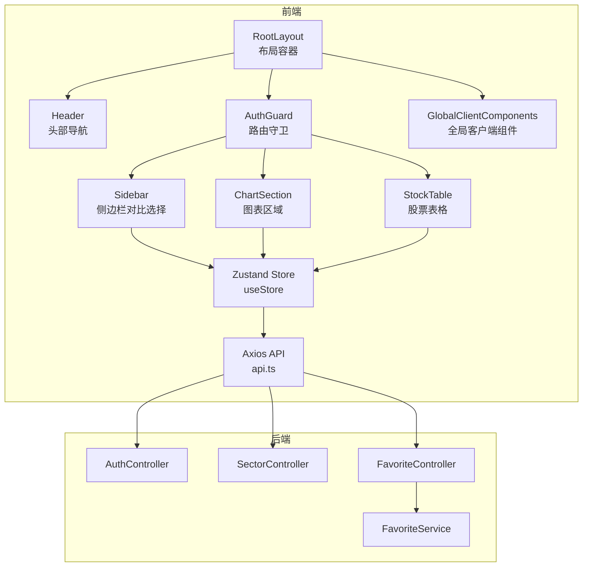
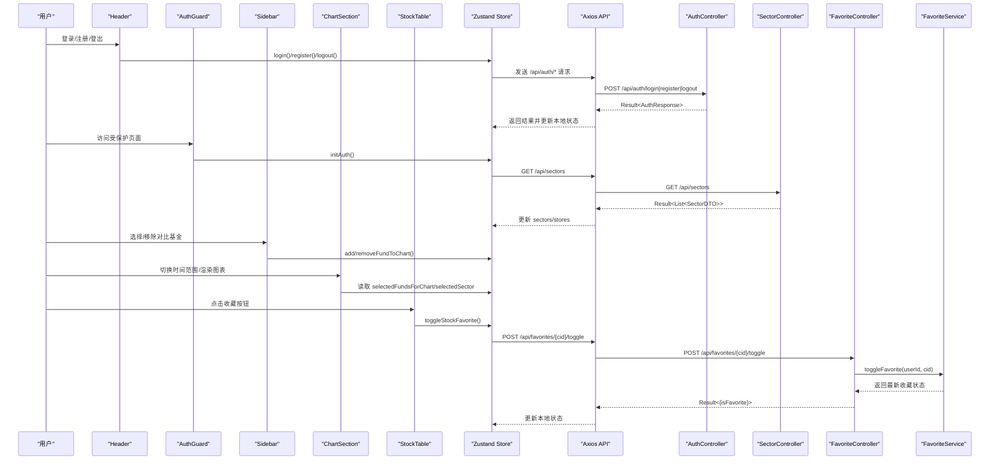
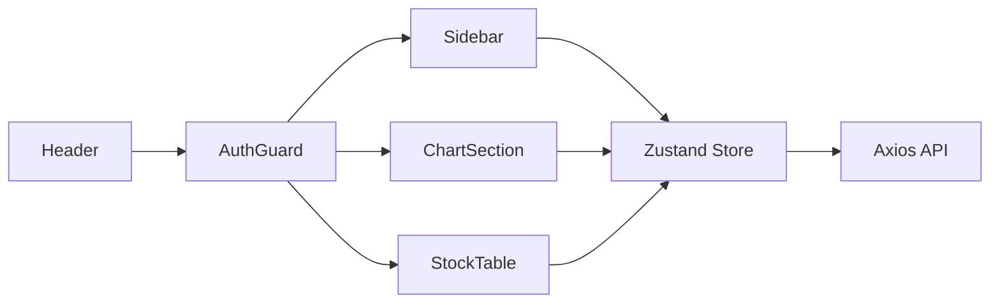
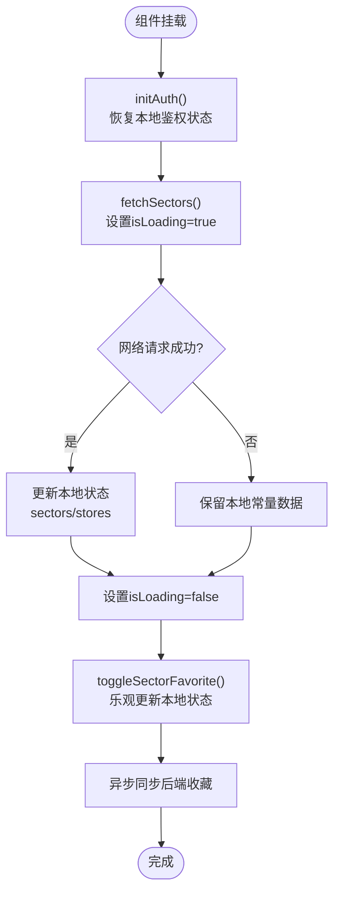
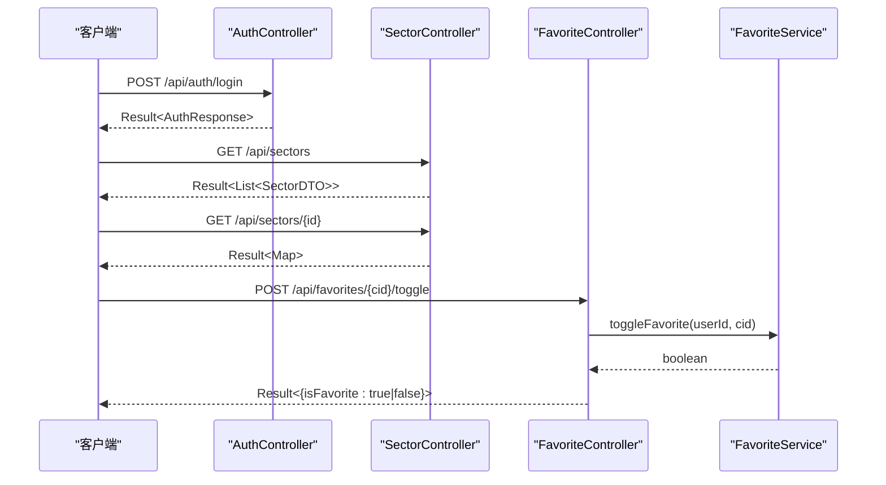
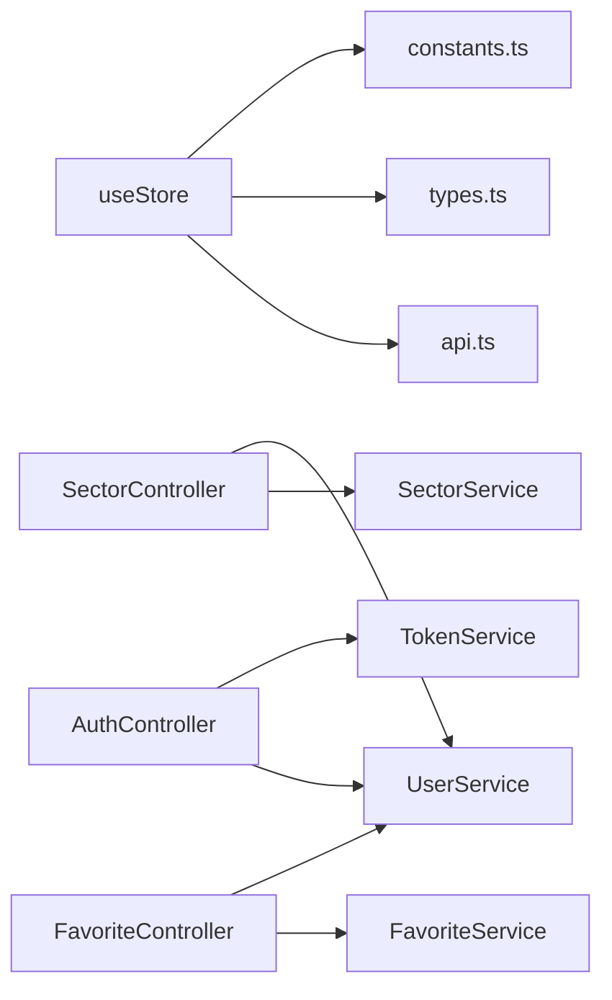

# 组件交互设计

<cite>
**本文引用的文件**
- [README.md](file://README.md)
- [frontend/src/app/layout.tsx](file://frontend/src/app/layout.tsx)
- [frontend/src/components/Header.tsx](file://frontend/src/components/Header.tsx)
- [frontend/src/components/AuthGuard.tsx](file://frontend/src/components/AuthGuard.tsx)
- [frontend/src/components/GlobalClientComponents.tsx](file://frontend/src/components/GlobalClientComponents.tsx)
- [frontend/src/components/Sidebar.tsx](file://frontend/src/components/Sidebar.tsx)
- [frontend/src/components/ChartSection.tsx](file://frontend/src/components/ChartSection.tsx)
- [frontend/src/components/StockTable.tsx](file://frontend/src/components/StockTable.tsx)
- [frontend/src/store/useStore.ts](file://frontend/src/store/useStore.ts)
- [frontend/src/lib/api.ts](file://frontend/src/lib/api.ts)
- [frontend/src/lib/types.ts](file://frontend/src/lib/types.ts)
- [frontend/src/lib/constants.ts](file://frontend/src/lib/constants.ts)
- [backend/src/main/java/com/freetrader/controller/AuthController.java](file://backend/src/main/java/com/freetrader/controller/AuthController.java)
- [backend/src/main/java/com/freetrader/controller/SectorController.java](file://backend/src/main/java/com/freetrader/controller/SectorController.java)
- [backend/src/main/java/com/freetrader/controller/FavoriteController.java](file://backend/src/main/java/com/freetrader/controller/FavoriteController.java)
- [backend/src/main/java/com/freetrader/service/FavoriteService.java](file://backend/src/main/java/com/freetrader/service/FavoriteService.java)
</cite>

## 目录
1. [引言](#引言)
2. [项目结构](#项目结构)
3. [核心组件](#核心组件)
4. [架构总览](#架构总览)
5. [详细组件分析](#详细组件分析)
6. [依赖关系分析](#依赖关系分析)
7. [性能考量](#性能考量)
8. [故障排查指南](#故障排查指南)
9. [结论](#结论)
10. [附录](#附录)

## 引言
本设计文档聚焦 FreeTrader 项目的组件交互设计，涵盖前端组件间通信机制（父子、兄弟、跨层级）、状态同步与生命周期管理策略；同时阐述后端服务交互模式、数据流转与错误传播路径，并总结 API 设计原则与前后端约定。文档以图示化方式呈现关键流程，辅以后端控制器与服务层实现细节，帮助开发者快速理解系统的动态行为与最佳实践。

## 项目结构
前端采用 Next.js 应用，按页面与组件分层组织；状态管理基于 Zustand；UI 组件来自 Radix UI 与 Tailwind CSS；图表使用 Lightweight Charts；HTTP 通信通过 Axios 并内置鉴权拦截器。后端采用 Spring Boot，控制器负责对外 API，服务层承载业务逻辑，统一返回 Result 包裹结构。

**图表来源**
- [frontend/src/app/layout.tsx](file://frontend/src/app/layout.tsx#L16-L35)
- [frontend/src/components/Header.tsx](file://frontend/src/components/Header.tsx#L12-L128)
- [frontend/src/components/AuthGuard.tsx](file://frontend/src/components/AuthGuard.tsx#L11-L59)
- [frontend/src/components/GlobalClientComponents.tsx](file://frontend/src/components/GlobalClientComponents.tsx#L6-L13)
- [frontend/src/components/Sidebar.tsx](file://frontend/src/components/Sidebar.tsx#L16-L117)
- [frontend/src/components/ChartSection.tsx](file://frontend/src/components/ChartSection.tsx#L14-L245)
- [frontend/src/components/StockTable.tsx](file://frontend/src/components/StockTable.tsx#L37-L111)
- [frontend/src/store/useStore.ts](file://frontend/src/store/useStore.ts#L62-L303)
- [frontend/src/lib/api.ts](file://frontend/src/lib/api.ts#L1-L89)
- [backend/src/main/java/com/freetrader/controller/AuthController.java](file://backend/src/main/java/com/freetrader/controller/AuthController.java#L23-L71)
- [backend/src/main/java/com/freetrader/controller/SectorController.java](file://backend/src/main/java/com/freetrader/controller/SectorController.java#L26-L62)
- [backend/src/main/java/com/freetrader/controller/FavoriteController.java](file://backend/src/main/java/com/freetrader/controller/FavoriteController.java#L30-L89)

**章节来源**
- [README.md](file://README.md#L28-L47)
- [frontend/src/app/layout.tsx](file://frontend/src/app/layout.tsx#L16-L35)

## 核心组件
- 布局与路由守卫
  - RootLayout 提供全局布局与通知组件挂载点；AuthGuard 在渲染受保护页面前进行鉴权校验与重定向。
- 头部与导航
  - Header 展示导航、命令面板触发、收藏与登出入口；根据鉴权状态决定可见性。
- 侧边栏与图表联动
  - Sidebar 基于 Zustand 状态维护“对比选择”集合，支持添加/移除；ChartSection 读取该集合绘制多条对比线。
- 表格与收藏
  - StockTable 展示板块内基金列表，支持逐项收藏切换；收藏状态变更通过 useStore 的乐观更新与异步同步。
- 状态中心
  - useStore 统一管理认证、UI、图表选择、数据加载与后端 API 调用；提供 fetchSectors、fetchSectorDetail、toggleSectorFavorite 等动作。
- HTTP 与拦截器
  - api.ts 封装 axios 实例，请求头注入 Bearer Token；响应拦截器处理 401 自动登出。

**章节来源**
- [frontend/src/components/Header.tsx](file://frontend/src/components/Header.tsx#L12-L128)
- [frontend/src/components/AuthGuard.tsx](file://frontend/src/components/AuthGuard.tsx#L11-L59)
- [frontend/src/components/Sidebar.tsx](file://frontend/src/components/Sidebar.tsx#L16-L117)
- [frontend/src/components/ChartSection.tsx](file://frontend/src/components/ChartSection.tsx#L14-L245)
- [frontend/src/components/StockTable.tsx](file://frontend/src/components/StockTable.tsx#L37-L111)
- [frontend/src/store/useStore.ts](file://frontend/src/store/useStore.ts#L24-L303)
- [frontend/src/lib/api.ts](file://frontend/src/lib/api.ts#L1-L89)

## 架构总览
下图展示从前端组件到后端控制器与服务层的调用链路，以及状态在前端 Store 中的流转与持久化。

**图表来源**
- [frontend/src/components/Header.tsx](file://frontend/src/components/Header.tsx#L26-L29)
- [frontend/src/components/AuthGuard.tsx](file://frontend/src/components/AuthGuard.tsx#L22-L38)
- [frontend/src/components/Sidebar.tsx](file://frontend/src/components/Sidebar.tsx#L54-L83)
- [frontend/src/components/ChartSection.tsx](file://frontend/src/components/ChartSection.tsx#L174-L174)
- [frontend/src/components/StockTable.tsx](file://frontend/src/components/StockTable.tsx#L84-L87)
- [frontend/src/store/useStore.ts](file://frontend/src/store/useStore.ts#L69-L103)
- [frontend/src/lib/api.ts](file://frontend/src/lib/api.ts#L40-L86)
- [backend/src/main/java/com/freetrader/controller/AuthController.java](file://backend/src/main/java/com/freetrader/controller/AuthController.java#L35-L70)
- [backend/src/main/java/com/freetrader/controller/SectorController.java](file://backend/src/main/java/com/freetrader/controller/SectorController.java#L44-L61)
- [backend/src/main/java/com/freetrader/controller/FavoriteController.java](file://backend/src/main/java/com/freetrader/controller/FavoriteController.java#L59-L88)
- [backend/src/main/java/com/freetrader/service/FavoriteService.java](file://backend/src/main/java/com/freetrader/service/FavoriteService.java#L92-L117)

## 详细组件分析

### 前端组件通信机制
- 父子组件通信
  - RootLayout 作为根容器，向子组件传递 children；Header 与 AuthGuard 嵌套在 Layout 内；GlobalClientComponents 作为全局客户端组件挂载点。
  - Sidebar、ChartSection、StockTable 均通过 useStore 读写共享状态，形成“父子”级的单向数据流。
- 兄弟组件通信
  - Sidebar 与 ChartSection 通过 useStore 的 selectedFundsForChart 实现协同：Sidebar 决定选中集合，ChartSection 读取并渲染。
  - StockTable 与 FavoriteController 通过 useStore 的 toggleSectorFavorite 协同，实现收藏状态的跨组件同步。
- 跨层级组件通信
  - Header 与 AuthGuard 通过 useStore 的 initAuth 与路由守卫逻辑实现跨层级的鉴权控制；Header 仅在已鉴权时显示导航与命令面板。
  - 全局通知 Toast 由 RootLayout 注入，任何组件均可通过 toast 触达全局提示。

**图表来源**
- [frontend/src/app/layout.tsx](file://frontend/src/app/layout.tsx#L24-L29)
- [frontend/src/components/Header.tsx](file://frontend/src/components/Header.tsx#L12-L128)
- [frontend/src/components/AuthGuard.tsx](file://frontend/src/components/AuthGuard.tsx#L11-L59)
- [frontend/src/components/Sidebar.tsx](file://frontend/src/components/Sidebar.tsx#L16-L117)
- [frontend/src/components/ChartSection.tsx](file://frontend/src/components/ChartSection.tsx#L19-L21)
- [frontend/src/components/StockTable.tsx](file://frontend/src/components/StockTable.tsx#L37-L40)
- [frontend/src/store/useStore.ts](file://frontend/src/store/useStore.ts#L62-L303)
- [frontend/src/lib/api.ts](file://frontend/src/lib/api.ts#L1-L89)

**章节来源**
- [frontend/src/app/layout.tsx](file://frontend/src/app/layout.tsx#L16-L35)
- [frontend/src/components/Header.tsx](file://frontend/src/components/Header.tsx#L12-L128)
- [frontend/src/components/AuthGuard.tsx](file://frontend/src/components/AuthGuard.tsx#L11-L59)
- [frontend/src/components/Sidebar.tsx](file://frontend/src/components/Sidebar.tsx#L16-L117)
- [frontend/src/components/ChartSection.tsx](file://frontend/src/components/ChartSection.tsx#L14-L245)
- [frontend/src/components/StockTable.tsx](file://frontend/src/components/StockTable.tsx#L37-L111)

### 状态管理与生命周期
- 初始化与鉴权
  - Header 在挂载时调用 initAuth，从 localStorage 恢复 token 与用户信息；AuthGuard 在路由变化时进行鉴权判断与跳转。
- 数据加载与回退
  - useStore 在 fetchSectors 时设置 isLoading，无论成功与否均结束加载；若网络失败，保留本地常量数据作为回退。
- 乐观更新与容错
  - toggleSectorFavorite 先本地更新，再异步同步至后端；若后端失败，保持本地状态不变，保证用户体验连续性。
- 图表渲染与清理
  - ChartSection 在组件卸载时主动销毁图表实例，避免内存泄漏；窗口尺寸变化时动态调整图表大小。

**图表来源**
- [frontend/src/components/Header.tsx](file://frontend/src/components/Header.tsx#L21-L24)
- [frontend/src/components/AuthGuard.tsx](file://frontend/src/components/AuthGuard.tsx#L22-L38)
- [frontend/src/store/useStore.ts](file://frontend/src/store/useStore.ts#L171-L206)
- [frontend/src/store/useStore.ts](file://frontend/src/store/useStore.ts#L261-L302)
- [frontend/src/components/ChartSection.tsx](file://frontend/src/components/ChartSection.tsx#L177-L184)

**章节来源**
- [frontend/src/components/Header.tsx](file://frontend/src/components/Header.tsx#L21-L24)
- [frontend/src/components/AuthGuard.tsx](file://frontend/src/components/AuthGuard.tsx#L22-L38)
- [frontend/src/store/useStore.ts](file://frontend/src/store/useStore.ts#L171-L206)
- [frontend/src/store/useStore.ts](file://frontend/src/store/useStore.ts#L261-L302)
- [frontend/src/components/ChartSection.tsx](file://frontend/src/components/ChartSection.tsx#L177-L184)

### 后端服务交互模式
- 认证流程
  - AuthController 提供登录、注册、刷新与登出接口；登录成功返回包含用户信息与令牌的响应；登出将令牌加入黑名单。
- 板块数据
  - SectorController 获取板块列表与详情，内部通过 SecurityContextHolder 解析当前用户 ID，结合业务服务返回带收藏标记的数据。
- 收藏管理
  - FavoriteController 提供收藏列表、添加、移除与切换接口；切换操作由 FavoriteService 基于事务执行，避免并发问题；同时清理相关缓存键。

**图表来源**
- [backend/src/main/java/com/freetrader/controller/AuthController.java](file://backend/src/main/java/com/freetrader/controller/AuthController.java#L35-L70)
- [backend/src/main/java/com/freetrader/controller/SectorController.java](file://backend/src/main/java/com/freetrader/controller/SectorController.java#L44-L61)
- [backend/src/main/java/com/freetrader/controller/FavoriteController.java](file://backend/src/main/java/com/freetrader/controller/FavoriteController.java#L59-L88)
- [backend/src/main/java/com/freetrader/service/FavoriteService.java](file://backend/src/main/java/com/freetrader/service/FavoriteService.java#L92-L117)

**章节来源**
- [backend/src/main/java/com/freetrader/controller/AuthController.java](file://backend/src/main/java/com/freetrader/controller/AuthController.java#L23-L71)
- [backend/src/main/java/com/freetrader/controller/SectorController.java](file://backend/src/main/java/com/freetrader/controller/SectorController.java#L26-L62)
- [backend/src/main/java/com/freetrader/controller/FavoriteController.java](file://backend/src/main/java/com/freetrader/controller/FavoriteController.java#L30-L89)
- [backend/src/main/java/com/freetrader/service/FavoriteService.java](file://backend/src/main/java/com/freetrader/service/FavoriteService.java#L34-L117)

### API 设计原则与前后端约定
- 统一响应结构
  - 后端控制器统一返回 Result<T>，包含 code、message、data 字段，便于前端一致处理。
- 鉴权与拦截
  - 前端 axios 在请求头注入 Authorization: Bearer token；后端通过 Spring Security 与 JWT 进行校验。
- 错误传播
  - 前端响应拦截器捕获 401 自动清除本地 token 并跳转登录页；后端通过 BusinessException 与 GlobalExceptionHandler 统一错误码与消息。
- 前端 API 封装
  - authApi、sectorApi、favoritesApi 明确职责边界，便于替换与扩展。

**章节来源**
- [frontend/src/lib/api.ts](file://frontend/src/lib/api.ts#L1-L89)
- [backend/src/main/java/com/freetrader/controller/AuthController.java](file://backend/src/main/java/com/freetrader/controller/AuthController.java#L28-L39)
- [backend/src/main/java/com/freetrader/controller/SectorController.java](file://backend/src/main/java/com/freetrader/controller/SectorController.java#L41-L48)
- [backend/src/main/java/com/freetrader/controller/FavoriteController.java](file://backend/src/main/java/com/freetrader/controller/FavoriteController.java#L45-L52)

## 依赖关系分析
- 前端组件对 Store 的依赖
  - Sidebar、ChartSection、StockTable、Header、AuthGuard 均通过 useStore 访问或修改状态，耦合度低、职责清晰。
- Store 对外部的依赖
  - useStore 依赖 api.ts 提供的 HTTP 客户端；类型定义来自 types.ts；默认数据来自 constants.ts。
- 后端控制器对服务层的依赖
  - AuthController 依赖 UserService 与 TokenService；SectorController 依赖 SectorService 与 UserService；FavoriteController 依赖 FavoriteService 与 UserService。

**图表来源**
- [frontend/src/store/useStore.ts](file://frontend/src/store/useStore.ts#L1-L6)
- [frontend/src/lib/types.ts](file://frontend/src/lib/types.ts#L1-L47)
- [frontend/src/lib/constants.ts](file://frontend/src/lib/constants.ts#L1-L96)
- [frontend/src/lib/api.ts](file://frontend/src/lib/api.ts#L1-L89)
- [backend/src/main/java/com/freetrader/controller/AuthController.java](file://backend/src/main/java/com/freetrader/controller/AuthController.java#L25-L26)
- [backend/src/main/java/com/freetrader/controller/SectorController.java](file://backend/src/main/java/com/freetrader/controller/SectorController.java#L28-L29)
- [backend/src/main/java/com/freetrader/controller/FavoriteController.java](file://backend/src/main/java/com/freetrader/controller/FavoriteController.java#L32-L33)

**章节来源**
- [frontend/src/store/useStore.ts](file://frontend/src/store/useStore.ts#L1-L6)
- [frontend/src/lib/types.ts](file://frontend/src/lib/types.ts#L1-L47)
- [frontend/src/lib/constants.ts](file://frontend/src/lib/constants.ts#L1-L96)
- [frontend/src/lib/api.ts](file://frontend/src/lib/api.ts#L1-L89)
- [backend/src/main/java/com/freetrader/controller/AuthController.java](file://backend/src/main/java/com/freetrader/controller/AuthController.java#L25-L26)
- [backend/src/main/java/com/freetrader/controller/SectorController.java](file://backend/src/main/java/com/freetrader/controller/SectorController.java#L28-L29)
- [backend/src/main/java/com/freetrader/controller/FavoriteController.java](file://backend/src/main/java/com/freetrader/controller/FavoriteController.java#L32-L33)

## 性能考量
- 前端
  - 图表渲染：ChartSection 使用 useMemo 计算数据点数量，减少不必要的重算；在组件卸载时销毁图表实例，避免内存泄漏。
  - 状态粒度：useStore 将 UI 状态与业务数据分离，降低无关渲染；乐观更新减少等待时间。
  - 回退策略：网络失败时保留本地常量数据，提升可用性。
- 后端
  - 收藏切换使用事务保证一致性；缓存键清理确保数据新鲜度。
  - 控制器方法短小明确，便于横向扩展与测试。

[本节为通用指导，无需列出具体文件来源]

## 故障排查指南
- 登录/鉴权问题
  - 若出现 401，前端会自动清除本地 token 并跳转登录页；检查后端 JWT 配置与 Token 黑名单是否生效。
- 收藏不同步
  - 前端采用乐观更新，若后端失败仍保持本地状态；可在控制台查看网络请求与返回值，确认收藏状态是否正确。
- 图表空白
  - 确认 selectedFundsForChart 是否为空；若为空且无板块趋势，图表将显示提示信息；检查 Store 中 selectedSector 与 stocks 数据。
- 页面无法进入
  - AuthGuard 在未鉴权时会重定向到 /auth；已在鉴权页时重定向到首页；检查 initAuth 是否正常执行。

**章节来源**
- [frontend/src/lib/api.ts](file://frontend/src/lib/api.ts#L25-L37)
- [frontend/src/store/useStore.ts](file://frontend/src/store/useStore.ts#L261-L302)
- [frontend/src/components/ChartSection.tsx](file://frontend/src/components/ChartSection.tsx#L236-L242)
- [frontend/src/components/AuthGuard.tsx](file://frontend/src/components/AuthGuard.tsx#L28-L38)

## 结论
本项目通过明确的前端组件分层与 Zustand 状态中心，实现了父子、兄弟与跨层级组件的高效协作；后端控制器与服务层职责清晰，配合统一响应结构与鉴权拦截，保障了数据流与错误传播的一致性。遵循本文提出的交互原则与最佳实践，有助于在保持组件解耦的同时，提升系统的可维护性与用户体验。

[本节为总结性内容，无需列出具体文件来源]

## 附录
- 关键类型与常量
  - 类型定义：StockData、SectorData、TimeRange 等，用于约束前后端数据结构。
  - 常量数据：SECTORS_DATA、STOCK_DATA 作为本地回退数据源。
- API 端点概览
  - 认证：POST /api/auth/login、POST /api/auth/register、POST /api/auth/refresh、POST /api/auth/logout
  - 板块：GET /api/sectors、GET /api/sectors/{id}
  - 收藏：GET /api/favorites、POST /api/favorites/{cid}、DELETE /api/favorites/{cid}、POST /api/favorites/{cid}/toggle

**章节来源**
- [frontend/src/lib/types.ts](file://frontend/src/lib/types.ts#L1-L47)
- [frontend/src/lib/constants.ts](file://frontend/src/lib/constants.ts#L86-L96)
- [frontend/src/lib/api.ts](file://frontend/src/lib/api.ts#L40-L86)
- [backend/src/main/java/com/freetrader/controller/AuthController.java](file://backend/src/main/java/com/freetrader/controller/AuthController.java#L35-L70)
- [backend/src/main/java/com/freetrader/controller/SectorController.java](file://backend/src/main/java/com/freetrader/controller/SectorController.java#L44-L61)
- [backend/src/main/java/com/freetrader/controller/FavoriteController.java](file://backend/src/main/java/com/freetrader/controller/FavoriteController.java#L48-L88)