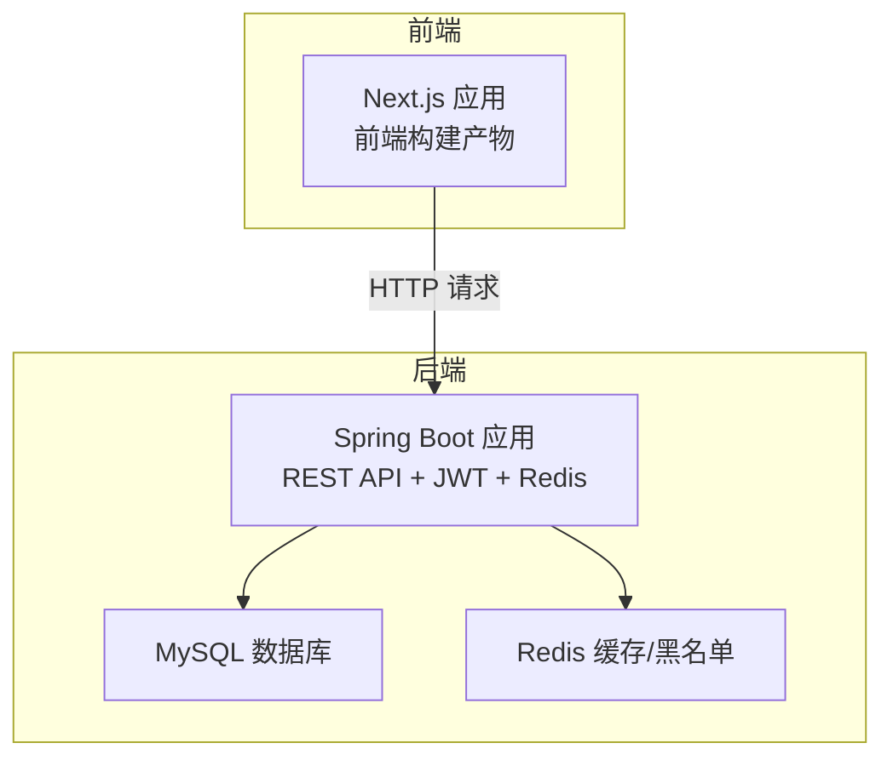
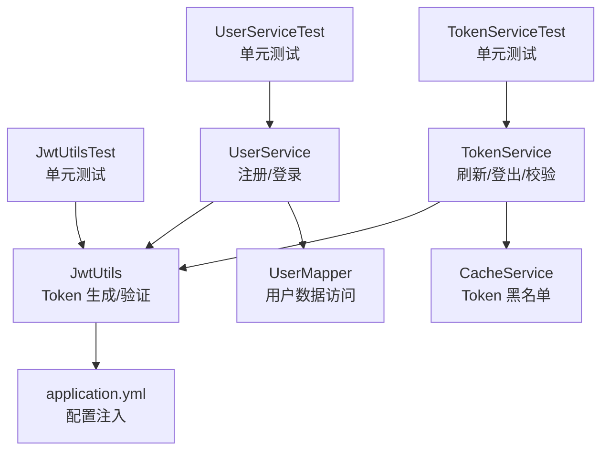
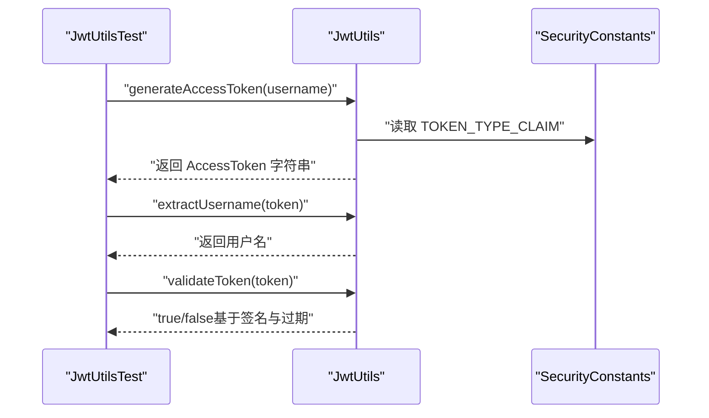
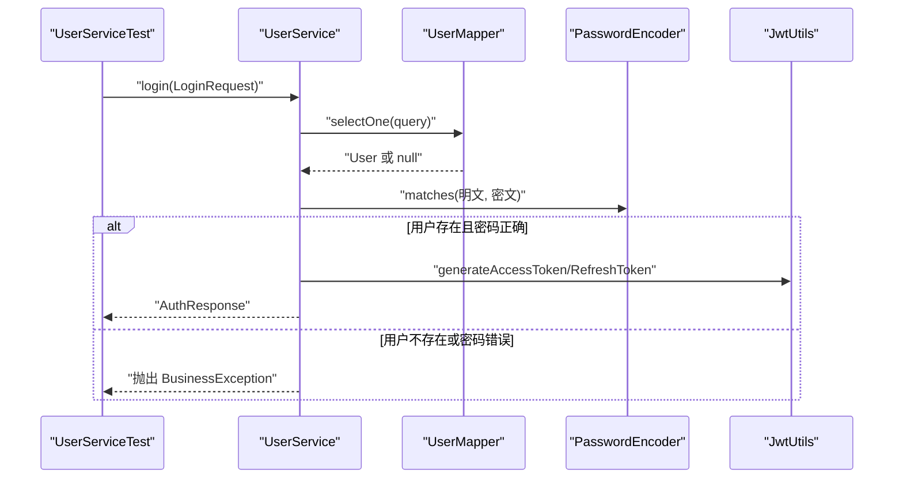
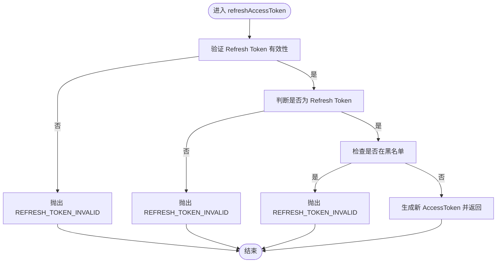
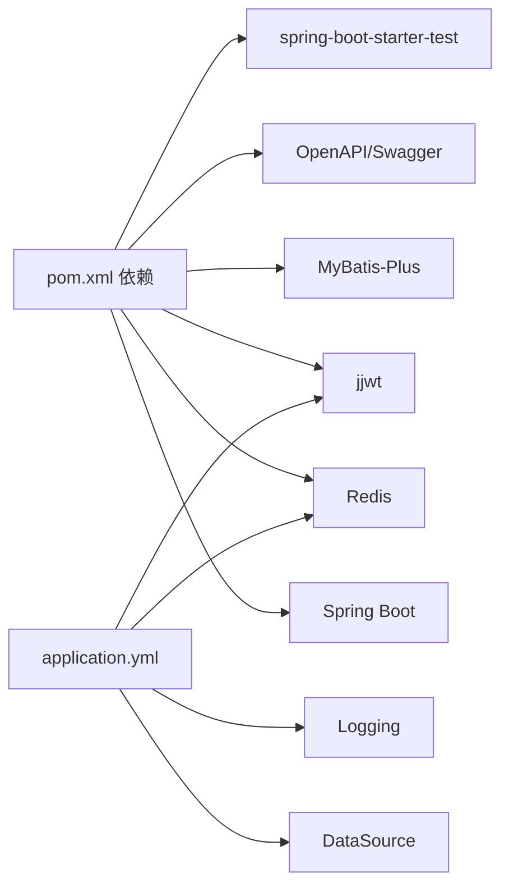

# 测试与部署

<cite>
**本文引用的文件**
- [pom.xml](file://backend/pom.xml)
- [application.yml](file://backend/src/main/resources/application.yml)
- [JwtUtils.java](file://backend/src/main/java/com/freetrader/security/JwtUtils.java)
- [JwtUtilsTest.java](file://backend/src/test/java/com/freetrader/security/JwtUtilsTest.java)
- [UserService.java](file://backend/src/main/java/com/freetrader/service/UserService.java)
- [UserServiceTest.java](file://backend/src/test/java/com/freetrader/service/UserServiceTest.java)
- [TokenService.java](file://backend/src/main/java/com/freetrader/service/TokenService.java)
- [TokenServiceTest.java](file://backend/src/test/java/com/freetrader/service/TokenServiceTest.java)
- [README.md](file://README.md)
- [package.json](file://frontend/package.json)
- [next.config.ts](file://frontend/next.config.ts)
- [tsconfig.json](file://frontend/tsconfig.json)
</cite>

## 目录
1. [简介](#简介)
2. [项目结构](#项目结构)
3. [核心组件](#核心组件)
4. [架构总览](#架构总览)
5. [详细组件分析](#详细组件分析)
6. [依赖关系分析](#依赖关系分析)
7. [性能考虑](#性能考虑)
8. [故障排除指南](#故障排除指南)
9. [结论](#结论)
10. [附录](#附录)

## 简介
本文件面向 DevOps 工程师与运维人员，系统性阐述 FreeTrader 项目的测试与部署实践。内容涵盖：
- 单元测试与集成测试的实现策略、测试框架选择与用例设计
- JWT 工具类、服务层与控制器的测试策略
- 测试覆盖率分析与持续集成配置建议
- 后端 Maven 构建与 Docker 容器化部署流程
- 前端构建与静态资源部署方案
- 环境配置管理（开发、测试、生产）
- 监控与日志配置，以及常见问题排查

## 项目结构
FreeTrader 采用前后端分离架构：
- 后端基于 Spring Boot 3.2.1，使用 Java 17，集成 Spring Security、MyBatis-Plus、Redis、JWT、OpenAPI/Swagger 等技术栈
- 前端基于 Next.js 16、TypeScript、Tailwind CSS 4，使用 Zustand 状态管理与 Radix UI 组件库
- 数据库为 MySQL 8.0，缓存与 Token 黑名单使用 Redis

章节来源
- file://README.md#L28-L47

## 核心组件
- JWT 工具类：负责 Token 的生成、解析、验证与类型判断
- 用户服务：处理注册、登录、按用户名查询用户
- Token 服务：刷新访问令牌、登出与 Token 有效性校验
- 配置中心：application.yml 提供多环境配置与日志、缓存、数据库、Redis、JWT 等参数

章节来源
- file://backend/src/main/java/com/freetrader/security/JwtUtils.java#L1-L194
- file://backend/src/main/java/com/freetrader/service/UserService.java#L1-L103
- file://backend/src/main/java/com/freetrader/service/TokenService.java#L1-L64
- file://backend/src/main/resources/application.yml#L1-L102

## 架构总览
下图展示了后端在测试与部署中的关键交互：测试驱动的单元测试、服务层与工具层协作、配置驱动的运行时行为。

图表来源
- [JwtUtilsTest.java](file://backend/src/test/java/com/freetrader/security/JwtUtilsTest.java#L1-L302)
- [UserServiceTest.java](file://backend/src/test/java/com/freetrader/service/UserServiceTest.java#L1-L212)
- [TokenServiceTest.java](file://backend/src/test/java/com/freetrader/service/TokenServiceTest.java#L1-L222)
- [JwtUtils.java](file://backend/src/main/java/com/freetrader/security/JwtUtils.java#L1-L194)
- [UserService.java](file://backend/src/main/java/com/freetrader/service/UserService.java#L1-L103)
- [TokenService.java](file://backend/src/main/java/com/freetrader/service/TokenService.java#L1-L64)
- [application.yml](file://backend/src/main/resources/application.yml#L1-L102)

## 详细组件分析

### JWT 工具类测试策略
- 测试目标：覆盖 Token 生成（Access/Refresh）、提取（用户名、过期时间、类型）、验证（格式、有效期、用户匹配）、类型判断与过期时间配置
- 测试框架：JUnit 5 + AssertJ；使用反射工具设置私有字段以模拟配置
- 关键断言：Token 非空、用户名一致、类型正确、过期时间在未来、非法格式返回 false、过期返回 false
- 失败场景：用户名不匹配、无效格式、过期时间设置为过去

图表来源
- [JwtUtilsTest.java](file://backend/src/test/java/com/freetrader/security/JwtUtilsTest.java#L1-L302)
- [JwtUtils.java](file://backend/src/main/java/com/freetrader/security/JwtUtils.java#L1-L194)

章节来源
- file://backend/src/test/java/com/freetrader/security/JwtUtilsTest.java#L1-L302
- file://backend/src/main/java/com/freetrader/security/JwtUtils.java#L1-L194

### 用户服务测试策略
- 测试目标：登录成功/失败、注册成功/失败、按用户名查询
- 测试框架：JUnit 5 + Mockito；使用 @Mock/@InjectMocks 注入依赖
- 关键断言：返回 AuthResponse 字段正确、调用链顺序与次数符合预期、异常类型正确
- 失败场景：用户不存在、密码错误、用户名已存在

图表来源
- [UserServiceTest.java](file://backend/src/test/java/com/freetrader/service/UserServiceTest.java#L1-L212)
- [UserService.java](file://backend/src/main/java/com/freetrader/service/UserService.java#L1-L103)

章节来源
- file://backend/src/test/java/com/freetrader/service/UserServiceTest.java#L1-L212
- file://backend/src/main/java/com/freetrader/service/UserService.java#L1-L103

### Token 服务测试策略
- 测试目标：刷新访问令牌、登出（加入黑名单）、Token 有效性校验
- 测试框架：JUnit 5 + Mockito；依赖 JwtUtils 与 CacheService
- 关键断言：刷新条件满足时返回新 AccessToken，否则抛异常；登出时按过期时间写入黑名单；有效性校验综合 Token 与黑名单

图表来源
- [TokenServiceTest.java](file://backend/src/test/java/com/freetrader/service/TokenServiceTest.java#L1-L222)
- [TokenService.java](file://backend/src/main/java/com/freetrader/service/TokenService.java#L1-L64)

章节来源
- file://backend/src/test/java/com/freetrader/service/TokenServiceTest.java#L1-L222
- file://backend/src/main/java/com/freetrader/service/TokenService.java#L1-L64

### 控制器层测试策略
- 当前仓库未提供控制器单元测试示例，建议采用 Spring Boot Test + MockMvc 或 RestAssured 进行集成测试
- 测试要点：鉴权拦截、参数校验、业务异常映射、响应状态码与结构
- 建议使用 @WebMvcTest 或 @Import(测试配置) 仅加载控制器层，结合 @MockBean 注入服务层

（本节为通用指导，不直接分析具体文件）

## 依赖关系分析
- 后端依赖管理：Maven POM 包含 Spring Boot Starter、MyBatis-Plus、MySQL 驱动、JWT、Redis、OpenAPI、测试依赖等
- 运行时配置：application.yml 通过环境变量注入数据库、Redis、JWT、日志、缓存等参数
- 前端依赖：Next.js、React、TypeScript、Tailwind CSS、Axios、Zustand、Radix UI 等

图表来源
- [pom.xml](file://backend/pom.xml#L1-L143)
- [application.yml](file://backend/src/main/resources/application.yml#L1-L102)

章节来源
- file://backend/pom.xml#L1-L143
- file://backend/src/main/resources/application.yml#L1-L102

## 性能考虑
- Token 过期时间：Access Token 1 小时，Refresh Token 7 天，减少频繁重新登录
- 缓存策略：Redis 默认 TTL 5 分钟，适合短期高频数据；可根据业务调整
- SQL 日志：开发环境开启，生产环境建议关闭以降低开销
- 连接池：HikariCP 默认池大小适中，可根据并发调整
- 前端构建：Next.js 生产构建优化静态资源与代码分割，建议启用压缩与缓存头

（本节为通用指导，不直接分析具体文件）

## 故障排除指南
- 登录失败
  - 现象：返回密码错误
  - 排查：确认用户名存在、密码加密匹配、数据库连接正常
- 注册失败
  - 现象：用户名或邮箱已存在
  - 排查：检查唯一性约束、Mapper 查询逻辑
- Token 无效
  - 现象：刷新失败或接口 401
  - 排查：确认 Token 格式、签名密钥、过期时间、是否在黑名单
- 跨域问题
  - 现象：前端请求被拒绝
  - 排查：检查 CORS 配置与预检请求
- 日志定位
  - 现象：业务异常或性能瓶颈
  - 排查：查看 application.yml 中的日志级别与输出路径

章节来源
- file://backend/src/main/java/com/freetrader/service/UserService.java#L73-L96
- file://backend/src/main/java/com/freetrader/service/TokenService.java#L18-L39
- file://backend/src/main/resources/application.yml#L77-L91

## 结论
本项目在后端实现了完善的 JWT 认证与 Token 生命周期管理，并配套了覆盖生成、验证、类型判断与黑名单策略的单元测试。前端采用现代工程化工具链，具备良好的开发体验与构建效率。建议在 CI/CD 中引入自动化测试与构建流程，结合容器化部署提升交付稳定性与可重复性。

## 附录

### 测试与覆盖率分析
- 测试框架：JUnit 5 + Mockito + AssertJ
- 覆盖率建议：使用 JaCoCo 插件在 Maven 构建阶段生成覆盖率报告，目标阈值建议：方法 80%+、分支 70%+
- CI 集成：在 GitHub Actions/GitLab CI 中执行 mvn test 与覆盖率收集，失败即阻断发布

章节来源
- file://backend/pom.xml#L113-L124

### 持续集成配置建议
- 触发条件：push 到主分支与 Pull Request
- 步骤建议：
  1) 安装 JDK 17 与 Maven
  2) 安装 Node.js 与 npm
  3) 还原依赖（mvn dependency:go-offline）
  4) 运行后端测试与覆盖率收集
  5) 前端安装依赖与构建
  6) 生成制品（后端 jar + 前端静态文件）
  7) 可选：Docker 镜像构建与推送
- 环境变量：通过 CI 系统注入 DB_URL、JWT_SECRET、REDIS_* 等

（本节为通用指导，不直接分析具体文件）

### 部署流程

#### 后端：Maven 构建与 Docker 容器化
- 构建
  - 进入 backend 目录，执行构建命令生成可执行 jar
  - 使用 Maven 插件打包，排除 Lombok
- 容器化
  - 建议使用多阶段构建：基础镜像（如 eclipse-temurin:17-jre-alpine）复制 jar 运行
  - 暴露端口 8080，挂载日志目录
  - 通过环境变量注入数据库、Redis、JWT 密钥等配置
- 编排
  - 使用 docker-compose 启动 MySQL 与 Redis，并挂载持久化卷
  - 后端容器依赖网络连通性与健康检查

章节来源
- file://backend/pom.xml#L126-L141
- file://backend/src/main/resources/application.yml#L1-L102

#### 前端：构建与静态资源部署
- 构建
  - 进入 frontend 目录，安装依赖后执行构建命令生成静态产物
  - Next.js 生产构建默认输出到 .next，可配置输出目录
- 部署
  - 方案一：将静态产物部署至 Nginx/Apache，反向代理后端 8080 端口
  - 方案二：将前端与后端合并为单容器镜像，统一入口
  - 方案三：使用 CDN 托管静态资源，后端提供 API

章节来源
- file://frontend/package.json#L5-L10
- file://frontend/next.config.ts#L1-L8
- file://frontend/tsconfig.json#L1-L35

### 环境配置管理
- 开发环境
  - application.yml 默认值，本地 MySQL/Redis，JWT 密钥较短便于调试
- 测试环境
  - 通过环境变量覆盖 DB_URL/REDIS_*，启用更严格的日志级别
- 生产环境
  - 强制使用环境变量注入敏感配置（JWT_SECRET、DB 凭据），关闭 SQL 日志
  - 合理设置 Redis TTL、连接池参数与 JVM 堆大小

章节来源
- file://backend/src/main/resources/application.yml#L1-L102

### 监控与日志配置
- 日志
  - 控制台与文件双输出，支持滚动与保留天数
  - 根日志级别与包级别可按需调整
- 监控
  - 建议集成 Actuator 暴露健康检查与指标端点
  - 结合 Prometheus/Grafana 对数据库连接池、Redis 命中率、请求耗时进行监控

章节来源
- file://backend/src/main/resources/application.yml#L77-L91