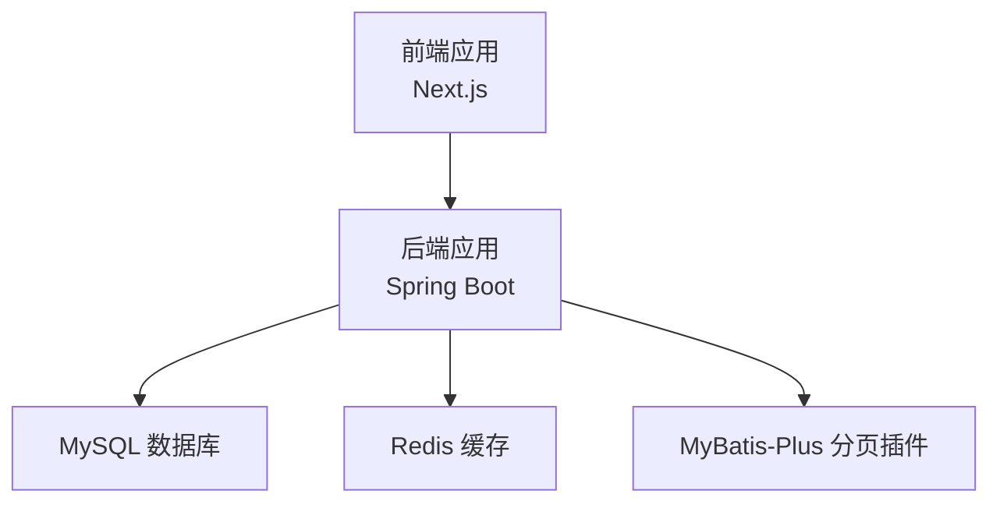
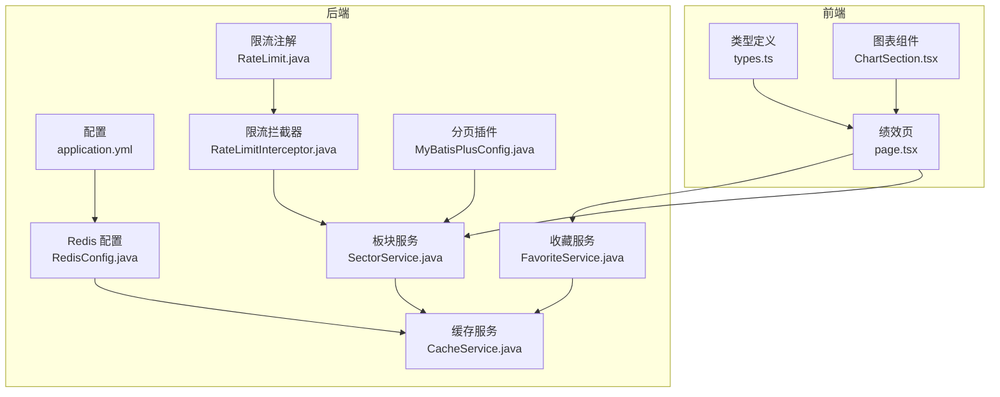
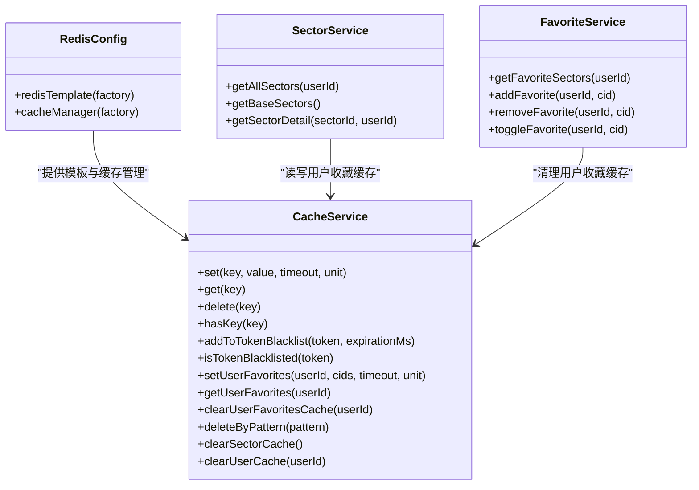
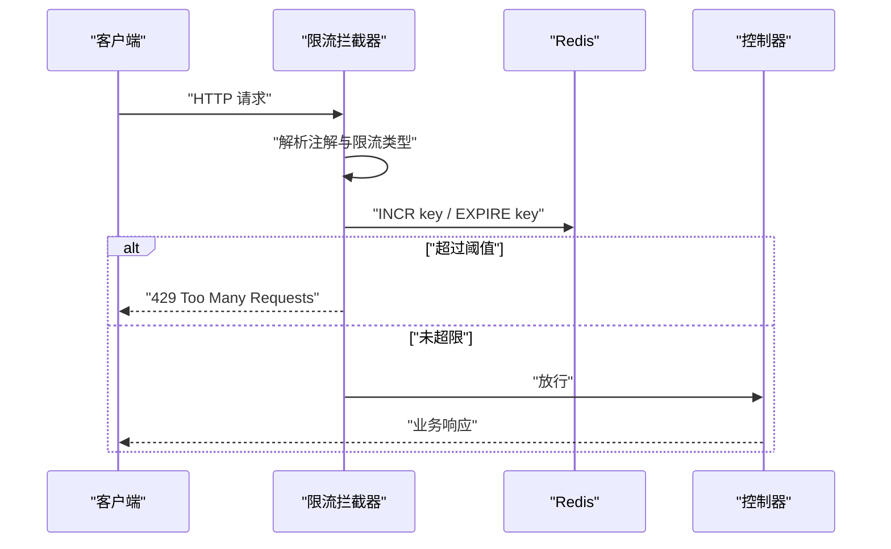
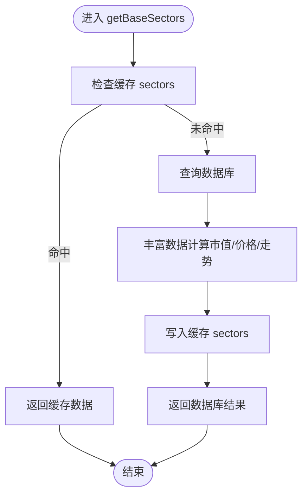
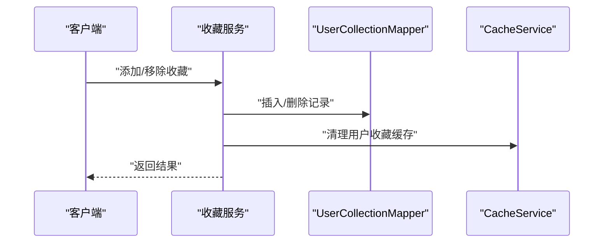
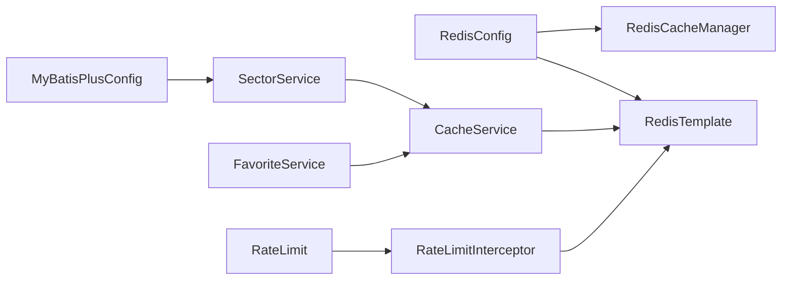

# 性能监控与调优

<cite>
**本文引用的文件**
- [application.yml](file://backend/src/main/resources/application.yml)
- [RedisConfig.java](file://backend/src/main/java/com/freetrader/config/RedisConfig.java)
- [MyBatisPlusConfig.java](file://backend/src/main/java/com/freetrader/config/MyBatisPlusConfig.java)
- [CacheService.java](file://backend/src/main/java/com/freetrader/service/CacheService.java)
- [SectorService.java](file://backend/src/main/java/com/freetrader/service/SectorService.java)
- [FavoriteService.java](file://backend/src/main/java/com/freetrader/service/FavoriteService.java)
- [AuthController.java](file://backend/src/main/java/com/freetrader/controller/AuthController.java)
- [RateLimit.java](file://backend/src/main/java/com/freetrader/annotation/RateLimit.java)
- [RateLimitInterceptor.java](file://backend/src/main/java/com/freetrader/interceptor/RateLimitInterceptor.java)
- [pom.xml](file://backend/pom.xml)
- [page.tsx（绩效页）](file://frontend/src/app/performance/page.tsx)
- [types.ts](file://frontend/src/lib/types.ts)
- [ChartSection.tsx](file://frontend/src/components/ChartSection.tsx)
</cite>

## 目录
1. [简介](#简介)
2. [项目结构](#项目结构)
3. [核心组件](#核心组件)
4. [架构总览](#架构总览)
5. [详细组件分析](#详细组件分析)
6. [依赖关系分析](#依赖关系分析)
7. [性能指标监控方案](#性能指标监控方案)
8. [缓存性能优化](#缓存性能优化)
9. [数据库查询优化](#数据库查询优化)
10. [API 响应时间优化](#api-响应时间优化)
11. [性能测试与基准测试](#性能测试与基准测试)
12. [性能问题诊断与排障](#性能问题诊断与排障)
13. [结论](#结论)

## 简介
本文件面向 FreeTrader 后端与前端的性能监控与调优，围绕以下目标展开：
- 系统性能指标监控：响应时间、吞吐量、内存使用率、CPU 利用率
- 缓存性能优化：命中率提升、缓存预热、缓存分片与键空间设计
- 数据库查询优化：慢查询分析、索引优化、查询重写
- API 响应时间优化：异步处理、批量操作、数据压缩
- 性能测试与基准测试：工具与方法论
- 故障排查：常见问题定位与解决思路

## 项目结构
后端采用 Spring Boot + MyBatis-Plus + Redis 的典型架构；前端为 Next.js 应用，负责数据展示与交互。整体结构清晰，便于在各层进行性能优化。

图表来源
- [application.yml](file://backend/src/main/resources/application.yml#L8-L18)
- [RedisConfig.java](file://backend/src/main/java/com/freetrader/config/RedisConfig.java#L25-L45)
- [MyBatisPlusConfig.java](file://backend/src/main/java/com/freetrader/config/MyBatisPlusConfig.java#L12-L17)

章节来源
- [application.yml](file://backend/src/main/resources/application.yml#L1-L102)
- [pom.xml](file://backend/pom.xml#L43-L124)

## 核心组件
- Redis 缓存与缓存管理：提供序列化配置、默认 TTL、按区域自定义 TTL 的缓存管理器
- 缓存服务：统一的缓存 CRUD、黑名单、用户收藏缓存、基于 SCAN 的批量删除
- 业务服务：板块服务（含缓存注解）、收藏服务（事务 + 缓存一致性）
- 限流注解与拦截器：基于 Redis 的滑动窗口限流，支持 IP/用户/全局三种维度
- MyBatis-Plus 分页插件：内置分页拦截器，避免全表扫描
- 前端页面与图表：绩效页与图表组件，涉及数据渲染与时间范围选择

章节来源
- [RedisConfig.java](file://backend/src/main/java/com/freetrader/config/RedisConfig.java#L21-L79)
- [CacheService.java](file://backend/src/main/java/com/freetrader/service/CacheService.java#L18-L206)
- [SectorService.java](file://backend/src/main/java/com/freetrader/service/SectorService.java#L27-L253)
- [FavoriteService.java](file://backend/src/main/java/com/freetrader/service/FavoriteService.java#L18-L119)
- [RateLimit.java](file://backend/src/main/java/com/freetrader/annotation/RateLimit.java#L1-L49)
- [RateLimitInterceptor.java](file://backend/src/main/java/com/freetrader/interceptor/RateLimitInterceptor.java#L20-L153)
- [MyBatisPlusConfig.java](file://backend/src/main/java/com/freetrader/config/MyBatisPlusConfig.java#L9-L18)
- [page.tsx（绩效页）](file://frontend/src/app/performance/page.tsx#L1-L36)
- [types.ts](file://frontend/src/lib/types.ts#L1-L46)
- [ChartSection.tsx](file://frontend/src/components/ChartSection.tsx#L125-L153)

## 架构总览
后端通过 Redis 实现多级缓存与限流，结合 MyBatis-Plus 分页减少数据库压力；前端负责数据可视化与交互，通过 store 管理状态与请求。

图表来源
- [application.yml](file://backend/src/main/resources/application.yml#L24-L44)
- [RedisConfig.java](file://backend/src/main/java/com/freetrader/config/RedisConfig.java#L47-L77)
- [SectorService.java](file://backend/src/main/java/com/freetrader/service/SectorService.java#L124-L141)
- [FavoriteService.java](file://backend/src/main/java/com/freetrader/service/FavoriteService.java#L46-L85)
- [CacheService.java](file://backend/src/main/java/com/freetrader/service/CacheService.java#L186-L204)
- [RateLimit.java](file://backend/src/main/java/com/freetrader/annotation/RateLimit.java#L12-L47)
- [RateLimitInterceptor.java](file://backend/src/main/java/com/freetrader/interceptor/RateLimitInterceptor.java#L35-L62)
- [MyBatisPlusConfig.java](file://backend/src/main/java/com/freetrader/config/MyBatisPlusConfig.java#L12-L17)

## 详细组件分析

### 缓存体系与键空间设计
- RedisTemplate 序列化：键使用字符串序列化，值使用 JSON 序列化，支持 JavaTime 模块
- RedisCacheManager：默认 TTL 30 分钟，针对 sectors/sectorDetail/userInfo 分别设置更短 TTL（5/5/10 分钟），降低热点失效带来的抖动
- CacheService：提供通用缓存 CRUD、黑名单、用户收藏缓存、基于 SCAN 的批量删除，避免 KEYS 导致的阻塞

图表来源
- [RedisConfig.java](file://backend/src/main/java/com/freetrader/config/RedisConfig.java#L25-L77)
- [CacheService.java](file://backend/src/main/java/com/freetrader/service/CacheService.java#L25-L206)
- [SectorService.java](file://backend/src/main/java/com/freetrader/service/SectorService.java#L78-L104)
- [FavoriteService.java](file://backend/src/main/java/com/freetrader/service/FavoriteService.java#L46-L85)

章节来源
- [RedisConfig.java](file://backend/src/main/java/com/freetrader/config/RedisConfig.java#L21-L79)
- [CacheService.java](file://backend/src/main/java/com/freetrader/service/CacheService.java#L18-L206)

### 限流机制（滑动窗口 + Redis）
- 注解支持：window（秒）、maxRequests（次数）、prefix（key 前缀）、limitType（IP/USER/GLOBAL）
- 拦截器实现：构建 key → 自增计数 → 首次设置过期 → 超限返回 429
- 客户端 IP 解析与当前用户解析，保证不同限流维度

图表来源
- [RateLimit.java](file://backend/src/main/java/com/freetrader/annotation/RateLimit.java#L12-L47)
- [RateLimitInterceptor.java](file://backend/src/main/java/com/freetrader/interceptor/RateLimitInterceptor.java#L35-L62)
- [RateLimitInterceptor.java](file://backend/src/main/java/com/freetrader/interceptor/RateLimitInterceptor.java#L96-L114)

章节来源
- [RateLimit.java](file://backend/src/main/java/com/freetrader/annotation/RateLimit.java#L1-L49)
- [RateLimitInterceptor.java](file://backend/src/main/java/com/freetrader/interceptor/RateLimitInterceptor.java#L20-L153)
- [AuthController.java](file://backend/src/main/java/com/freetrader/controller/AuthController.java#L34-L46)

### 板块服务与缓存注解
- getBaseSectors 使用 @Cacheable("sectors") 缓存基础板块数据
- getSectorDetail 使用 @Cacheable("sectorDetail") 缓存板块详情
- 用户收藏缓存：先查缓存，未命中再查库并回填缓存，降低数据库压力

图表来源
- [SectorService.java](file://backend/src/main/java/com/freetrader/service/SectorService.java#L124-L141)
- [SectorService.java](file://backend/src/main/java/com/freetrader/service/SectorService.java#L81-L104)

章节来源
- [SectorService.java](file://backend/src/main/java/com/freetrader/service/SectorService.java#L27-L253)

### 收藏服务与缓存一致性
- 添加/移除收藏后，清理对应用户收藏缓存，确保后续读取最新数据
- 事务性操作保障数据一致性

图表来源
- [FavoriteService.java](file://backend/src/main/java/com/freetrader/service/FavoriteService.java#L46-L85)
- [CacheService.java](file://backend/src/main/java/com/freetrader/service/CacheService.java#L132-L140)

章节来源
- [FavoriteService.java](file://backend/src/main/java/com/freetrader/service/FavoriteService.java#L18-L119)
- [CacheService.java](file://backend/src/main/java/com/freetrader/service/CacheService.java#L103-L140)

## 依赖关系分析
- Redis 连接池与序列化配置由 RedisConfig 提供
- CacheService 依赖 RedisTemplate 与 RedisCacheManager
- SectorService 与 FavoriteService 依赖 CacheService 实现缓存读写
- RateLimitInterceptor 依赖 RedisTemplate 实现滑动窗口限流
- MyBatis-Plus 分页插件由 MyBatisPlusConfig 注册

图表来源
- [RedisConfig.java](file://backend/src/main/java/com/freetrader/config/RedisConfig.java#L25-L77)
- [CacheService.java](file://backend/src/main/java/com/freetrader/service/CacheService.java#L27-L27)
- [SectorService.java](file://backend/src/main/java/com/freetrader/service/SectorService.java#L36-L36)
- [FavoriteService.java](file://backend/src/main/java/com/freetrader/service/FavoriteService.java#L29-L29)
- [RateLimitInterceptor.java](file://backend/src/main/java/com/freetrader/interceptor/RateLimitInterceptor.java#L29-L30)
- [MyBatisPlusConfig.java](file://backend/src/main/java/com/freetrader/config/MyBatisPlusConfig.java#L12-L17)

章节来源
- [RedisConfig.java](file://backend/src/main/java/com/freetrader/config/RedisConfig.java#L21-L79)
- [CacheService.java](file://backend/src/main/java/com/freetrader/service/CacheService.java#L18-L206)
- [SectorService.java](file://backend/src/main/java/com/freetrader/service/SectorService.java#L27-L253)
- [FavoriteService.java](file://backend/src/main/java/com/freetrader/service/FavoriteService.java#L18-L119)
- [RateLimitInterceptor.java](file://backend/src/main/java/com/freetrader/interceptor/RateLimitInterceptor.java#L20-L153)
- [MyBatisPlusConfig.java](file://backend/src/main/java/com/freetrader/config/MyBatisPlusConfig.java#L9-L18)

## 性能指标监控方案
- 响应时间
  - 后端：在网关/反向代理层或应用层增加请求耗时埋点（如拦截器/过滤器），统计 P50/P90/P99
  - 前端：在数据请求前后记录时间戳，计算渲染延迟与网络延迟
- 吞吐量
  - 统计每秒请求数 QPS，区分接口维度与限流触发率
- 内存使用率/CPU 利用率
  - JVM 指标：堆/非堆内存、GC 次数与耗时、线程数
  - 系统指标：容器/主机 CPU/内存/IO
- 缓存命中率
  - Redis 命中/未命中计数，结合业务缓存键空间统计

监控建议
- 使用 Micrometer + Prometheus + Grafana 或云监控平台采集指标
- 对关键路径（板块详情、收藏切换、登录注册）单独建立仪表盘

## 缓存性能优化
- 命中率提升
  - 合理设置 TTL：对热点数据设置较短 TTL，避免雪崩；对冷数据延长 TTL
  - 键空间命名规范：统一前缀与分层，便于清理与统计
  - 预热策略：启动或定时任务预热高频键，降低首次访问延迟
- 缓存预热
  - 在应用启动后或低峰时段，批量写入 sectors/sectorDetail 等高频键
- 缓存分片与键空间
  - 按用户维度拆分键空间，避免单节点热点
  - 使用 SCAN 代替 KEYS，避免阻塞
- 一致性与失效
  - 写操作后主动失效相关缓存，确保读写一致
  - 对黑名单、用户收藏等敏感键设置短 TTL 并及时清理

章节来源
- [RedisConfig.java](file://backend/src/main/java/com/freetrader/config/RedisConfig.java#L47-L77)
- [CacheService.java](file://backend/src/main/java/com/freetrader/service/CacheService.java#L141-L183)
- [SectorService.java](file://backend/src/main/java/com/freetrader/service/SectorService.java#L124-L141)
- [FavoriteService.java](file://backend/src/main/java/com/freetrader/service/FavoriteService.java#L63-L84)

## 数据库查询优化
- 慢查询分析
  - 开启 MySQL 慢查询日志，定位执行时间长、扫描行数多的 SQL
  - 结合应用侧日志与数据库审计，复核参数绑定与条件
- 索引优化
  - 为常用过滤字段（如 user_id、cid、sector_id）建立复合索引
  - 避免在索引列上使用函数或隐式转换
- 查询重写
  - 使用分页插件（MyBatis-Plus）避免一次性拉取大量数据
  - 将“先查后过滤”改为“带条件查询”，减少中间结果集
  - 对聚合查询使用覆盖索引，减少回表

章节来源
- [MyBatisPlusConfig.java](file://backend/src/main/java/com/freetrader/config/MyBatisPlusConfig.java#L12-L17)
- [SectorService.java](file://backend/src/main/java/com/freetrader/service/SectorService.java#L129-L134)

## API 响应时间优化
- 异步处理
  - 对非关键路径（如日志上报、统计任务）采用异步队列
- 批量操作
  - 合并多次请求为批量请求，减少往返开销
- 数据压缩
  - 启用 Gzip/Br 压缩传输，降低带宽占用
- 限流与降级
  - 使用滑动窗口限流保护后端，必要时对非关键接口降级

章节来源
- [RateLimitInterceptor.java](file://backend/src/main/java/com/freetrader/interceptor/RateLimitInterceptor.java#L96-L114)
- [AuthController.java](file://backend/src/main/java/com/freetrader/controller/AuthController.java#L34-L46)

## 性能测试与基准测试
- 工具
  - 压力测试：JMeter、k6、Locust
  - JVM 分析：JProfiler、Async Profiler、Arthas
  - 端到端：Browser/Node 场景录制与回放
- 方法
  - 基准场景：登录/注册、板块列表、板块详情、收藏切换
  - 渐进式压测：从 10 并发逐步提升至峰值，观察 P95 延迟与错误率
  - 灰度发布：小流量验证，对比基线指标

## 性能问题诊断与排障
- 常见问题
  - 缓存击穿：热点键过期导致瞬时高 DB 压力；建议互斥锁或永不过期 + 异步刷新
  - 缓存穿透：非法 key 导致空值缓存；建议布隆过滤器或缓存空对象
  - 缓存雪崩：大面积过期；建议 TTL 随机化与多级缓存
  - 限流误伤：滑动窗口边界导致突发限流；可调整窗口或引入令牌桶
- 诊断步骤
  - 查看 Redis 命中率与连接池使用情况
  - 检查慢查询与热点 SQL
  - 关注 GC 与线程池状态
  - 前端渲染卡顿：检查数据量与图表渲染逻辑

## 结论
通过合理的缓存策略、限流保护、分页与索引优化，以及完善的性能监控与测试流程，FreeTrader 可在高并发场景下保持稳定与低延迟。建议持续迭代：完善缓存预热与失效策略、细化限流维度、加强慢查询治理，并将性能指标纳入 CI/CD 质量门禁。