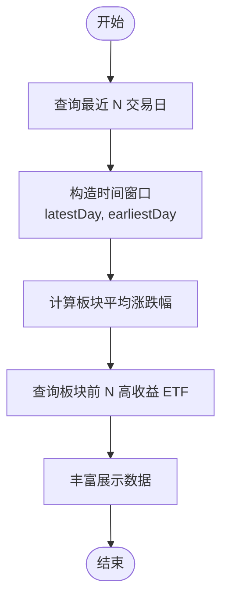

# 数据库查询优化

<cite>
**本文引用的文件**
- [MyBatisPlusConfig.java](file://backend/src/main/java/com/freetrader/config/MyBatisPlusConfig.java)
- [application.yml](file://backend/src/main/resources/application.yml)
- [EtfInfoMapper.java](file://backend/src/main/java/com/freetrader/mapper/EtfInfoMapper.java)
- [CategoryMapper.java](file://backend/src/main/java/com/freetrader/mapper/CategoryMapper.java)
- [CalendarMapper.java](file://backend/src/main/java/com/freetrader/mapper/CalendarMapper.java)
- [UserCollectionMapper.java](file://backend/src/main/java/com/freetrader/mapper/UserCollectionMapper.java)
- [SectorService.java](file://backend/src/main/java/com/freetrader/service/SectorService.java)
- [FavoriteService.java](file://backend/src/main/java/com/freetrader/service/FavoriteService.java)
- [category.sql](file://sql/category.sql)
- [etf_info.sql](file://sql/etf_info.sql)
- [etf_netasset.sql](file://sql/etf_netasset.sql)
- [calendar.sql](file://sql/calendar.sql)
</cite>

## 目录
1. [简介](#简介)
2. [项目结构](#项目结构)
3. [核心组件](#核心组件)
4. [架构总览](#架构总览)
5. [详细组件分析](#详细组件分析)
6. [依赖关系分析](#依赖关系分析)
7. [性能考量与优化建议](#性能考量与优化建议)
8. [故障排查指南](#故障排查指南)
9. [结论](#结论)
10. [附录](#附录)

## 简介
本文件面向 FreeTrader 后端数据库查询优化，聚焦于 MyBatis-Plus 查询优化策略（懒加载、批量查询、关联查询）、Mapper 查询语句优化（执行计划与索引建议）、分页查询优化（含大数据量场景）、缓存与数据库协同、连接池配置与连接复用、慢查询日志与监控实践，以及数据库层面的性能调优案例与最佳实践。文档以代码与数据库结构为依据，提供可落地的优化建议。

## 项目结构
后端采用 Spring Boot + MyBatis-Plus 架构，查询层由 Mapper 接口承担，业务层由 Service 调用 Mapper 并结合缓存实现读写分离与热点数据加速；配置层通过 application.yml 统一管理数据源、MyBatis-Plus、Redis 缓存与日志等。

图表来源
- [MyBatisPlusConfig.java](file://backend/src/main/java/com/freetrader/config/MyBatisPlusConfig.java#L10-L18)
- [application.yml](file://backend/src/main/resources/application.yml#L8-L58)
- [CategoryMapper.java](file://backend/src/main/java/com/freetrader/mapper/CategoryMapper.java#L12-L47)
- [EtfInfoMapper.java](file://backend/src/main/java/com/freetrader/mapper/EtfInfoMapper.java#L12-L52)
- [CalendarMapper.java](file://backend/src/main/java/com/freetrader/mapper/CalendarMapper.java#L11-L24)
- [UserCollectionMapper.java](file://backend/src/main/java/com/freetrader/mapper/UserCollectionMapper.java#L11-L19)
- [SectorService.java](file://backend/src/main/java/com/freetrader/service/SectorService.java#L30-L36)
- [FavoriteService.java](file://backend/src/main/java/com/freetrader/service/FavoriteService.java#L24-L29)

章节来源
- [MyBatisPlusConfig.java](file://backend/src/main/java/com/freetrader/config/MyBatisPlusConfig.java#L10-L18)
- [application.yml](file://backend/src/main/resources/application.yml#L8-L58)

## 核心组件
- 分页拦截器：在 MyBatis-Plus 中注册分页插件，统一处理分页逻辑，避免业务层重复实现。
- Mapper 接口：定义领域查询，包含原生 SQL 的复杂关联与聚合查询。
- Service 层：组合多 Mapper 查询，引入缓存与参数预计算，降低数据库压力。
- 连接池与缓存：通过 HikariCP 与 Redis 实现连接复用与热点数据缓存。

章节来源
- [MyBatisPlusConfig.java](file://backend/src/main/java/com/freetrader/config/MyBatisPlusConfig.java#L10-L18)
- [SectorService.java](file://backend/src/main/java/com/freetrader/service/SectorService.java#L124-L141)
- [FavoriteService.java](file://backend/src/main/java/com/freetrader/service/FavoriteService.java#L34-L41)
- [application.yml](file://backend/src/main/resources/application.yml#L13-L44)

## 架构总览
查询路径从 Controller 到 Service，再到多个 Mapper 的组合查询，并通过缓存与分页拦截器协同，形成“查询 + 缓存 + 分页”的整体优化闭环。

图表来源
- [SectorService.java](file://backend/src/main/java/com/freetrader/service/SectorService.java#L109-L141)
- [SectorService.java](file://backend/src/main/java/com/freetrader/service/SectorService.java#L169-L212)
- [CalendarMapper.java](file://backend/src/main/java/com/freetrader/mapper/CalendarMapper.java#L17-L23)
- [CategoryMapper.java](file://backend/src/main/java/com/freetrader/mapper/CategoryMapper.java#L19-L46)
- [EtfInfoMapper.java](file://backend/src/main/java/com/freetrader/mapper/EtfInfoMapper.java#L18-L51)
- [UserCollectionMapper.java](file://backend/src/main/java/com/freetrader/mapper/UserCollectionMapper.java#L17-L18)

## 详细组件分析

### 分页查询优化
- 插件配置：MyBatis-Plus 在配置类中注册分页拦截器，对所有分页查询生效，无需手动分页。
- 大数据量分页建议：
  - 使用“基于索引的游标分页”替代“LIMIT offset, size”，避免大 offset 导致的全表扫描。
  - 对高频分页字段建立复合索引，减少回表与排序成本。
  - 控制每页大小，避免一次性返回过多数据。

章节来源
- [MyBatisPlusConfig.java](file://backend/src/main/java/com/freetrader/config/MyBatisPlusConfig.java#L12-L17)
- [application.yml](file://backend/src/main/resources/application.yml#L46-L58)

### 关联查询与聚合优化（SectorService）
- 交易日范围计算：通过 CalendarMapper 查询最近 N 个交易日，作为 ETF 净值统计的时间窗口。
- 板块平均涨跌幅：CategoryMapper 聚合计算板块内 ETF 的区间涨跌幅均值，涉及多表关联与条件聚合。
- 板块内 Top ETF：EtfInfoMapper 基于两个净值快照（最新与最早）计算收益与收益百分比，按收益排序并限制条数。

图表来源
- [SectorService.java](file://backend/src/main/java/com/freetrader/service/SectorService.java#L64-L76)
- [SectorService.java](file://backend/src/main/java/com/freetrader/service/SectorService.java#L127-L134)
- [SectorService.java](file://backend/src/main/java/com/freetrader/service/SectorService.java#L187-L191)
- [CalendarMapper.java](file://backend/src/main/java/com/freetrader/mapper/CalendarMapper.java#L17-L23)
- [CategoryMapper.java](file://backend/src/main/java/com/freetrader/mapper/CategoryMapper.java#L19-L46)
- [EtfInfoMapper.java](file://backend/src/main/java/com/freetrader/mapper/EtfInfoMapper.java#L18-L51)

章节来源
- [SectorService.java](file://backend/src/main/java/com/freetrader/service/SectorService.java#L64-L76)
- [SectorService.java](file://backend/src/main/java/com/freetrader/service/SectorService.java#L127-L134)
- [SectorService.java](file://backend/src/main/java/com/freetrader/service/SectorService.java#L187-L191)
- [CalendarMapper.java](file://backend/src/main/java/com/freetrader/mapper/CalendarMapper.java#L17-L23)
- [CategoryMapper.java](file://backend/src/main/java/com/freetrader/mapper/CategoryMapper.java#L19-L46)
- [EtfInfoMapper.java](file://backend/src/main/java/com/freetrader/mapper/EtfInfoMapper.java#L18-L51)

### 收藏查询与缓存协同（FavoriteService + SectorService）
- 用户收藏查询：UserCollectionMapper 提供按用户查询收藏 cid 列表。
- 缓存策略：
  - SectorService 对板块基础数据与板块详情分别进行缓存，降低重复聚合查询压力。
  - 用户收藏查询先查缓存，未命中再查库并写入缓存，同时在收藏变更时清理缓存，保证一致性。
- 批量查询：收藏查询返回整表子集，适合批量处理与后续过滤。

图表来源
- [SectorService.java](file://backend/src/main/java/com/freetrader/service/SectorService.java#L81-L104)
- [UserCollectionMapper.java](file://backend/src/main/java/com/freetrader/mapper/UserCollectionMapper.java#L17-L18)
- [FavoriteService.java](file://backend/src/main/java/com/freetrader/service/FavoriteService.java#L46-L85)

章节来源
- [SectorService.java](file://backend/src/main/java/com/freetrader/service/SectorService.java#L81-L104)
- [FavoriteService.java](file://backend/src/main/java/com/freetrader/service/FavoriteService.java#L46-L85)
- [UserCollectionMapper.java](file://backend/src/main/java/com/freetrader/mapper/UserCollectionMapper.java#L17-L18)

### Mapper 查询语句与索引建议

#### EtfInfoMapper：板块 Top ETF 查询
- 查询要点：按板块筛选 ETF，连接两个净值快照计算收益与收益百分比，按收益降序取前 N。
- 索引建议：
  - etf_info(sector)：加速按板块过滤。
  - etf_netasset(ths_code, time)：复合主键，支持快速定位某 ETF 在某日的净值与复权净值。
- 性能提示：TOP N 会触发排序，建议在 time 字段上保持高效索引，避免额外排序开销。

章节来源
- [EtfInfoMapper.java](file://backend/src/main/java/com/freetrader/mapper/EtfInfoMapper.java#L18-L51)
- [etf_netasset.sql](file://sql/etf_netasset.sql#L32-L34)
- [etf_info.sql](file://sql/etf_info.sql#L31-L32)

#### CategoryMapper：板块平均涨跌幅聚合
- 查询要点：对每个板块内的 ETF 计算区间涨跌幅均值，涉及多表关联与条件聚合。
- 索引建议：
  - etf_info(sector)：加速关联与分组前过滤。
  - etf_netasset(ths_code, time)：支撑最新与最早净值的快速访问。
- 性能提示：GROUP BY 与 AVG 可能产生临时表与排序，建议评估是否可通过物化视图或定期任务预计算。

章节来源
- [CategoryMapper.java](file://backend/src/main/java/com/freetrader/mapper/CategoryMapper.java#L19-L46)
- [etf_info.sql](file://sql/etf_info.sql#L31-L32)
- [etf_netasset.sql](file://sql/etf_netasset.sql#L32-L34)

#### CalendarMapper：最近 N 交易日查询
- 查询要点：按交易日标志与截止日期倒序取 N 条。
- 索引建议：
  - calendar(IsTradingDay, Day)：复合索引可覆盖过滤与排序。
- 性能提示：若 Day 字段格式固定，考虑将其转为 DATE 类型并建立索引，提升比较与排序效率。

章节来源
- [CalendarMapper.java](file://backend/src/main/java/com/freetrader/mapper/CalendarMapper.java#L17-L23)
- [calendar.sql](file://sql/calendar.sql#L24-L31)

#### UserCollectionMapper：用户收藏查询
- 查询要点：按用户 ID 查询收藏的板块 ID 列表。
- 索引建议：
  - user_collection(user_id)：加速按用户过滤。
- 性能提示：若收藏量巨大，可考虑将用户维度拆分或引入二级索引，减少单表扫描。

章节来源
- [UserCollectionMapper.java](file://backend/src/main/java/com/freetrader/mapper/UserCollectionMapper.java#L17-L18)

### 数据模型与索引现状

图表来源
- [category.sql](file://sql/category.sql#L24-L36)
- [etf_info.sql](file://sql/etf_info.sql#L23-L33)
- [etf_netasset.sql](file://sql/etf_netasset.sql#L23-L34)
- [calendar.sql](file://sql/calendar.sql#L23-L31)

## 依赖关系分析
- SectorService 依赖多个 Mapper 与 CacheService，形成“查询 + 缓存”的组合查询模式。
- FavoriteService 依赖 UserCollectionMapper 与 CacheService，负责收藏的增删改查与缓存同步。
- MyBatis-Plus 分页拦截器全局生效，确保分页查询的一致性与可维护性。

图表来源
- [SectorService.java](file://backend/src/main/java/com/freetrader/service/SectorService.java#L32-L36)
- [FavoriteService.java](file://backend/src/main/java/com/freetrader/service/FavoriteService.java#L27-L29)
- [MyBatisPlusConfig.java](file://backend/src/main/java/com/freetrader/config/MyBatisPlusConfig.java#L12-L17)

章节来源
- [SectorService.java](file://backend/src/main/java/com/freetrader/service/SectorService.java#L32-L36)
- [FavoriteService.java](file://backend/src/main/java/com/freetrader/service/FavoriteService.java#L27-L29)
- [MyBatisPlusConfig.java](file://backend/src/main/java/com/freetrader/config/MyBatisPlusConfig.java#L12-L17)

## 性能考量与优化建议

### MyBatis-Plus 查询优化策略
- 懒加载：实体类中非持久化字段（如 avgChange、price、marketCap、isFavorite）不会触发数据库查询，属于应用侧计算，避免不必要的 JOIN。
- 批量查询：UserCollectionMapper 返回整表子集，适合批量处理；建议在业务层对结果进行内存过滤与去重。
- 关联查询：SectorService 的聚合查询涉及多表 JOIN 与条件聚合，建议：
  - 将时间窗口参数化，避免重复计算。
  - 对高频字段建立复合索引，减少回表与排序。

章节来源
- [SectorService.java](file://backend/src/main/java/com/freetrader/service/SectorService.java#L146-L165)
- [UserCollectionMapper.java](file://backend/src/main/java/com/freetrader/mapper/UserCollectionMapper.java#L17-L18)
- [etf_info.sql](file://sql/etf_info.sql#L31-L32)
- [etf_netasset.sql](file://sql/etf_netasset.sql#L32-L34)

### 分页查询优化技巧
- 使用分页拦截器统一处理分页，避免业务层重复实现。
- 大数据量分页建议：
  - 基于索引的游标分页（基于上次最大主键或时间戳）。
  - 控制每页大小，避免一次性返回过多数据。
  - 对分页字段建立合适索引，减少排序与回表。

章节来源
- [MyBatisPlusConfig.java](file://backend/src/main/java/com/freetrader/config/MyBatisPlusConfig.java#L12-L17)
- [application.yml](file://backend/src/main/resources/application.yml#L46-L58)

### 缓存与数据库协同优化
- 结果缓存：SectorService 对板块基础数据与板块详情进行缓存，显著降低聚合查询频率。
- 条件缓存：用户收藏查询先查缓存，未命中再查库并写入缓存，同时在收藏变更时清理缓存。
- 缓存失效策略：收藏变更后主动清理缓存，保证一致性。

章节来源
- [SectorService.java](file://backend/src/main/java/com/freetrader/service/SectorService.java#L124-L141)
- [SectorService.java](file://backend/src/main/java/com/freetrader/service/SectorService.java#L170-L212)
- [FavoriteService.java](file://backend/src/main/java/com/freetrader/service/FavoriteService.java#L63-L84)

### 数据库连接池配置与连接复用
- HikariCP 参数建议：
  - maximum-pool-size：根据并发请求数与数据库承载能力调整。
  - minimum-idle：维持一定空闲连接，降低连接创建开销。
  - connection-timeout：控制连接等待超时，避免线程长时间阻塞。
  - idle-timeout 与 max-lifetime：平衡连接生命周期与资源回收。
- 连接复用：通过连接池复用连接，减少握手与认证开销。

章节来源
- [application.yml](file://backend/src/main/resources/application.yml#L13-L18)

### 慢查询日志分析与查询性能监控
- SQL 日志：开发环境开启 SQL 输出，便于定位慢查询；生产环境建议关闭或降级。
- 监控指标：关注慢查询次数、平均响应时间、分页延迟、缓存命中率。
- 分析步骤：
  - 使用 EXPLAIN 分析关键查询的执行计划，确认索引使用情况与排序/临时表。
  - 定位热点查询与高延迟接口，结合缓存策略与索引优化进行改进。

章节来源
- [application.yml](file://backend/src/main/resources/application.yml#L51-L52)

### 数据库层面的性能调优案例与最佳实践
- 索引优化：
  - 为高频过滤字段（如 etf_info(sector)、calendar(IsTradingDay, Day)、user_collection(user_id)）建立合适索引。
  - 复合索引优先满足 WHERE 与 ORDER BY 的列顺序。
- 查询重写：
  - 将可预计算的数据（如板块 item_count）通过触发器或定时任务维护，减少运行时聚合。
  - 使用 LIMIT 控制 TOP 查询规模，避免全表扫描。
- 缓存策略：
  - 对静态或低频变动数据（板块基础信息）设置较长 TTL。
  - 对用户相关数据（收藏）设置较短 TTL 并配合失效策略。

章节来源
- [etf_info.sql](file://sql/etf_info.sql#L31-L32)
- [calendar.sql](file://sql/calendar.sql#L24-L31)
- [category.sql](file://sql/category.sql#L33-L35)
- [SectorService.java](file://backend/src/main/java/com/freetrader/service/SectorService.java#L124-L141)
- [FavoriteService.java](file://backend/src/main/java/com/freetrader/service/FavoriteService.java#L63-L84)

## 故障排查指南
- 分页异常：检查分页拦截器是否正确注册，确认请求参数与数据库方言匹配。
- 缓存不一致：确认收藏变更后是否清理了对应用户缓存，检查缓存 TTL 设置。
- 查询缓慢：使用 EXPLAIN 分析执行计划，核对索引是否被使用；必要时增加复合索引或重写查询。
- 连接池问题：观察连接池指标，调整 maximum-pool-size 与 connection-timeout，避免连接泄漏。

章节来源
- [MyBatisPlusConfig.java](file://backend/src/main/java/com/freetrader/config/MyBatisPlusConfig.java#L12-L17)
- [FavoriteService.java](file://backend/src/main/java/com/freetrader/service/FavoriteService.java#L63-L84)
- [application.yml](file://backend/src/main/resources/application.yml#L13-L18)

## 结论
通过“分页拦截器 + 缓存 + 索引优化 + 连接池调优”的组合拳，FreeTrader 的查询层可在保证一致性的同时显著提升性能。建议持续监控关键查询的执行计划与缓存命中率，针对热点数据与高复杂度聚合查询进行专项优化。

## 附录
- 关键查询路径参考：
  - 板块平均涨跌幅：[CategoryMapper.findAllSectorsWithAvgChange](file://backend/src/main/java/com/freetrader/mapper/CategoryMapper.java#L43-L46)
  - 板块 Top ETF：[EtfInfoMapper.findTopEtfsBySector](file://backend/src/main/java/com/freetrader/mapper/EtfInfoMapper.java#L46-L51)
  - 最近 N 交易日：[CalendarMapper.findLastNTradingDays](file://backend/src/main/java/com/freetrader/mapper/CalendarMapper.java#L23)
  - 用户收藏：[UserCollectionMapper.findFavoriteCidsByUserId](file://backend/src/main/java/com/freetrader/mapper/UserCollectionMapper.java#L18)