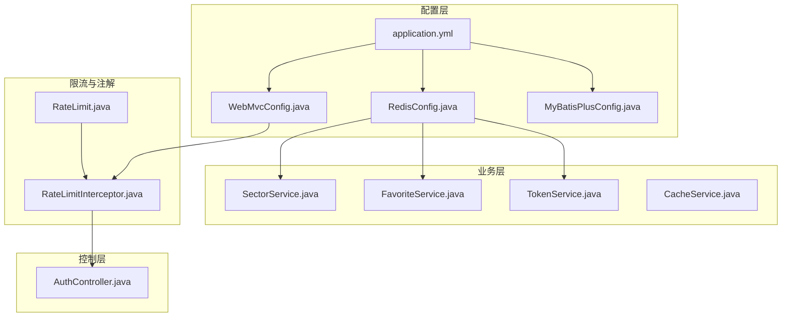
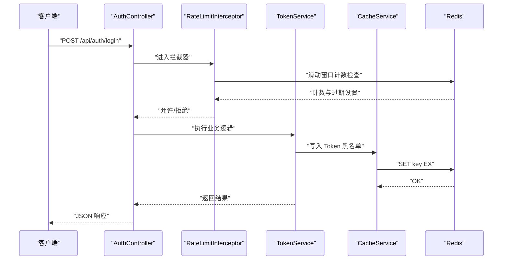
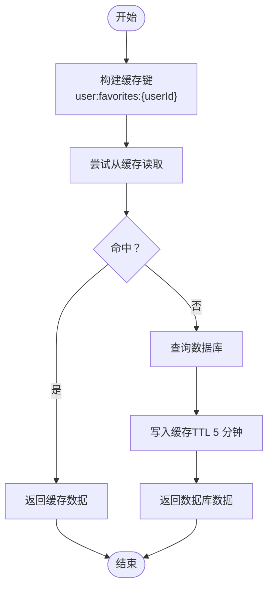
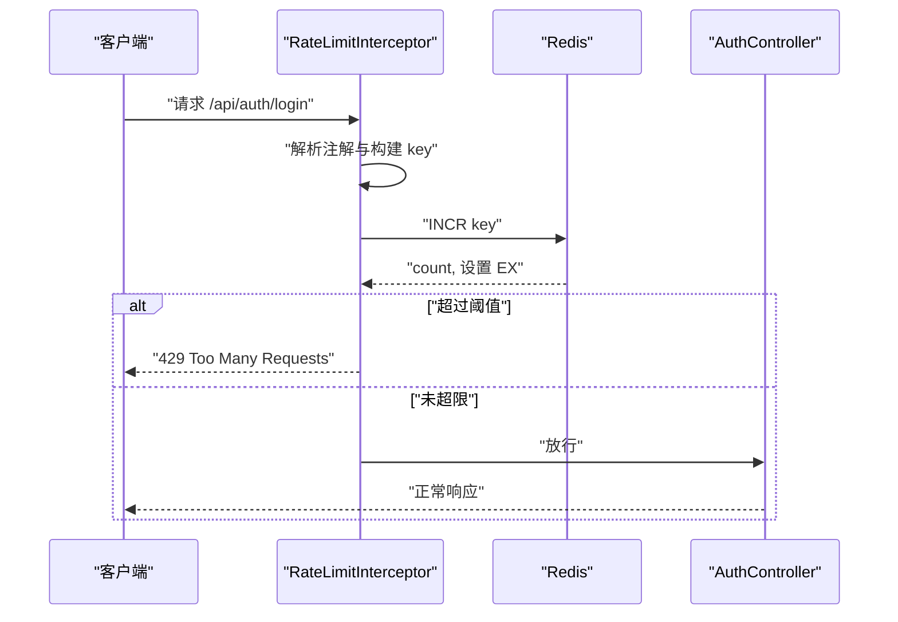
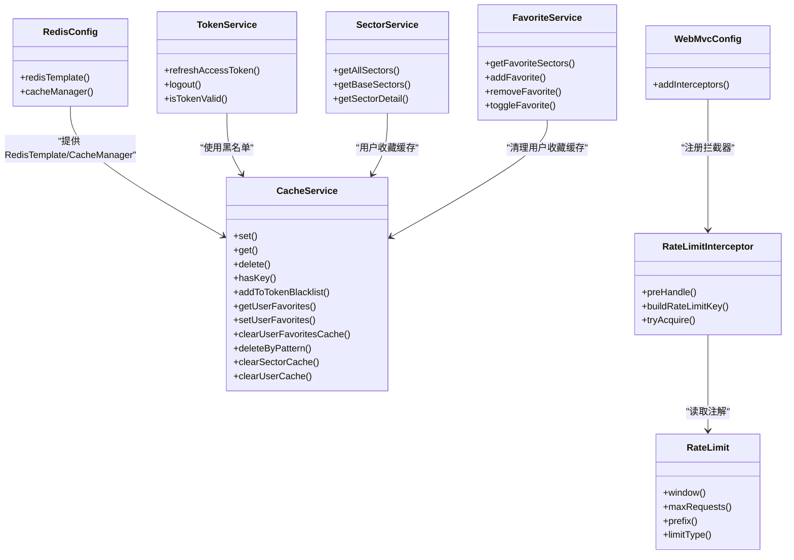

# 缓存与性能优化

<cite>
**本文引用的文件**
- [RedisConfig.java](file://backend/src/main/java/com/freetrader/config/RedisConfig.java)
- [CacheService.java](file://backend/src/main/java/com/freetrader/service/CacheService.java)
- [TokenService.java](file://backend/src/main/java/com/freetrader/service/TokenService.java)
- [SectorService.java](file://backend/src/main/java/com/freetrader/service/SectorService.java)
- [FavoriteService.java](file://backend/src/main/java/com/freetrader/service/FavoriteService.java)
- [RateLimit.java](file://backend/src/main/java/com/freetrader/annotation/RateLimit.java)
- [RateLimitInterceptor.java](file://backend/src/main/java/com/freetrader/interceptor/RateLimitInterceptor.java)
- [WebMvcConfig.java](file://backend/src/main/java/com/freetrader/config/WebMvcConfig.java)
- [application.yml](file://backend/src/main/resources/application.yml)
- [AuthController.java](file://backend/src/main/java/com/freetrader/controller/AuthController.java)
- [MyBatisPlusConfig.java](file://backend/src/main/java/com/freetrader/config/MyBatisPlusConfig.java)
- [TokenServiceTest.java](file://backend/src/test/java/com/freetrader/service/TokenServiceTest.java)
- [CacheKeys.java](file://backend/src/main/java/com/freetrader/util/CacheKeys.java)
- [pom.xml](file://backend/pom.xml)
</cite>

## 更新摘要
**所做更改**
- 新增 RedisTemplate JSON 序列化配置，支持 JavaTimeModule 和复杂对象序列化
- 新增多个缓存管理器配置，包括 sectors、sectorDetail、userInfo 的差异化 TTL 设置
- 完善 CacheService 实现，包含令牌黑名单、用户收藏缓存、板块数据缓存等功能
- 更新缓存键设计策略，统一使用 CacheKeys 工具类管理键前缀和生成方法
- 增强批量删除机制，使用 SCAN 命令替代 KEYS 避免阻塞

## 目录
1. [简介](#简介)
2. [项目结构](#项目结构)
3. [核心组件](#核心组件)
4. [架构总览](#架构总览)
5. [组件详解](#组件详解)
6. [依赖关系分析](#依赖关系分析)
7. [性能考量与优化建议](#性能考量与优化建议)
8. [故障排查指南](#故障排查指南)
9. [结论](#结论)
10. [附录](#附录)

## 简介
本文件面向系统管理员与性能优化工程师，系统性阐述 FreeTrader 后端在缓存与性能优化方面的设计与实现，涵盖 Redis 缓存配置与键设计、缓存服务（数据缓存、Token 黑名单、用户收藏缓存）、注解驱动的速率限制机制、拦截器工作原理、数据库查询优化、API 响应时间优化、缓存失效与一致性保障策略，以及性能测试与基准测试方法。

## 项目结构
后端采用 Spring Boot + MyBatis-Plus 架构，缓存层基于 Spring Cache + Redis，限流通过拦截器实现，配置集中在 application.yml 与若干 Java 配置类中。

**图表来源**
- [RedisConfig.java](file://backend/src/main/java/com/freetrader/config/RedisConfig.java#L21-L79)
- [WebMvcConfig.java](file://backend/src/main/java/com/freetrader/config/WebMvcConfig.java#L13-L26)
- [MyBatisPlusConfig.java](file://backend/src/main/java/com/freetrader/config/MyBatisPlusConfig.java#L9-L18)
- [application.yml](file://backend/src/main/resources/application.yml#L24-L45)
- [SectorService.java](file://backend/src/main/java/com/freetrader/service/SectorService.java#L27-L36)
- [FavoriteService.java](file://backend/src/main/java/com/freetrader/service/FavoriteService.java#L22-L30)
- [TokenService.java](file://backend/src/main/java/com/freetrader/service/TokenService.java#L13-L17)
- [CacheService.java](file://backend/src/main/java/com/freetrader/service/CacheService.java#L22-L28)
- [AuthController.java](file://backend/src/main/java/com/freetrader/controller/AuthController.java#L20-L23)
- [RateLimit.java](file://backend/src/main/java/com/freetrader/annotation/RateLimit.java#L1-L49)
- [RateLimitInterceptor.java](file://backend/src/main/java/com/freetrader/interceptor/RateLimitInterceptor.java#L24-L27)

**章节来源**
- [application.yml](file://backend/src/main/resources/application.yml#L1-L102)
- [pom.xml](file://backend/pom.xml#L43-L98)

## 核心组件
- **Redis 缓存配置与序列化**：定义 RedisTemplate、RedisCacheManager，默认 TTL 与各缓存区 TTL。
- **缓存服务**：统一的 Redis 操作封装，支持 Token 黑名单、用户收藏缓存、批量删除（SCAN）。
- **业务缓存**：SectorService 使用注解缓存"板块基础数据"和"板块详情"，提升读性能。
- **速率限制**：注解 + 拦截器实现滑动窗口计数器限流，支持按 IP、用户、全局三种粒度。
- **数据库优化**：MyBatis-Plus 分页插件，SQL 日志可配置，连接池参数可调。

**章节来源**
- [RedisConfig.java](file://backend/src/main/java/com/freetrader/config/RedisConfig.java#L21-L79)
- [CacheService.java](file://backend/src/main/java/com/freetrader/service/CacheService.java#L18-L206)
- [SectorService.java](file://backend/src/main/java/com/freetrader/service/SectorService.java#L124-L141)
- [SectorService.java](file://backend/src/main/java/com/freetrader/service/SectorService.java#L170-L212)
- [RateLimit.java](file://backend/src/main/java/com/freetrader/annotation/RateLimit.java#L1-L49)
- [RateLimitInterceptor.java](file://backend/src/main/java/com/freetrader/interceptor/RateLimitInterceptor.java#L20-L153)
- [WebMvcConfig.java](file://backend/src/main/java/com/freetrader/config/WebMvcConfig.java#L13-L26)
- [MyBatisPlusConfig.java](file://backend/src/main/java/com/freetrader/config/MyBatisPlusConfig.java#L9-L18)

## 架构总览
下图展示缓存与限流在系统中的位置与交互：

**图表来源**
- [AuthController.java](file://backend/src/main/java/com/freetrader/controller/AuthController.java#L34-L39)
- [RateLimitInterceptor.java](file://backend/src/main/java/com/freetrader/interceptor/RateLimitInterceptor.java#L35-L62)
- [TokenService.java](file://backend/src/main/java/com/freetrader/service/TokenService.java#L41-L55)
- [CacheService.java](file://backend/src/main/java/com/freetrader/service/CacheService.java#L89-L101)

## 组件详解

### Redis 缓存配置与键设计
**更新** 新增 RedisTemplate JSON 序列化配置和多个缓存管理器的不同 TTL 设置

- **序列化与模板**
  - RedisTemplate 使用字符串键序列化与 JSON 值序列化，支持 JavaTimeModule。
  - 统一的 ObjectMapper 配置，避免重复创建，支持复杂对象序列化。
- **缓存管理器配置**
  - 默认 TTL 30 分钟；针对 sectors、sectorDetail、userInfo 缓存区分别设置更短 TTL（5/10 分钟）。
  - 通过 RedisCacheManager.builder() 配置不同缓存区域的差异化过期策略。
- **键设计策略**
  - Token 黑名单：token:blacklist:{token}
  - 用户缓存：user:{userId}:*（如用户收藏缓存 user:favorites:{userId}）
  - 板块缓存：sector:*、sectors*、sectorDetail*
  - 限流键：rate_limit:{prefix}:{identifier}，identifier 可为 IP、用户名或 global
- **过期策略**
  - 默认缓存区 TTL 30 分钟；热点缓存（板块基础/详情）5 分钟；用户信息 10 分钟。
  - Token 黑名单 TTL 与对应 JWT 过期时间一致，随 Token 自然过期。
  - 限流键首次访问设置 TTL，窗口内复用计数。

**章节来源**
- [RedisConfig.java](file://backend/src/main/java/com/freetrader/config/RedisConfig.java#L25-L77)
- [CacheService.java](file://backend/src/main/java/com/freetrader/service/CacheService.java#L29-L33)
- [CacheService.java](file://backend/src/main/java/com/freetrader/service/CacheService.java#L89-L101)
- [CacheService.java](file://backend/src/main/java/com/freetrader/service/CacheService.java#L190-L194)
- [RateLimitInterceptor.java](file://backend/src/main/java/com/freetrader/interceptor/RateLimitInterceptor.java#L32-L91)

### 缓存服务实现（数据缓存、Token 缓存、用户收藏缓存）
**更新** 完善 CacheService 的完整实现，包含令牌黑名单、用户收藏缓存、板块数据缓存等功能

- **数据缓存**
  - SectorService 对"板块基础数据"和"板块详情"使用注解缓存，减少数据库压力。
  - 用户收藏缓存：用户收藏列表以列表形式缓存，过期时间 5 分钟；收藏变更时主动清理缓存。
- **Token 缓存（黑名单）**
  - 登出与刷新 Token 失效场景：将 Access/Refresh Token 写入黑名单，TTL 与对应 Token 过期时间一致。
  - Token 校验：先校验 JWT 有效性，再检查黑名单。
- **批量删除与一致性**
  - 使用 SCAN 命令替代 KEYS，避免阻塞；支持按模式删除，用于清空板块/用户相关缓存。
- **错误处理**
  - 所有 Redis 操作均包裹 try/catch 并记录错误日志，保证服务稳定性。

**图表来源**
- [SectorService.java](file://backend/src/main/java/com/freetrader/service/SectorService.java#L81-L104)
- [CacheService.java](file://backend/src/main/java/com/freetrader/service/CacheService.java#L108-L139)

**章节来源**
- [SectorService.java](file://backend/src/main/java/com/freetrader/service/SectorService.java#L81-L104)
- [SectorService.java](file://backend/src/main/java/com/freetrader/service/SectorService.java#L124-L141)
- [SectorService.java](file://backend/src/main/java/com/freetrader/service/SectorService.java#L170-L212)
- [FavoriteService.java](file://backend/src/main/java/com/freetrader/service/FavoriteService.java#L63-L84)
- [TokenService.java](file://backend/src/main/java/com/freetrader/service/TokenService.java#L41-L62)
- [CacheService.java](file://backend/src/main/java/com/freetrader/service/CacheService.java#L147-L194)

### 速率限制机制（注解 + 拦截器）
**更新** 增强限流拦截器实现，支持多种限流类型和灵活的键生成策略

- **注解驱动**
  - RateLimit 提供 window（秒）、maxRequests（次数）、prefix（前缀）、limitType（IP/USER/GLOBAL）。
- **拦截器实现**
  - 拦截 /api/** 路径，排除 /api/auth/refresh。
  - 构建限流键：rate_limit:{prefix}:{identifier}，identifier 由 IP、用户名或 global 决定。
  - 滑动窗口计数器：使用自增 + 过期时间实现，首次访问设置 TTL；异常时放行，避免雪崩。
- **控制器应用**
  - AuthController 的登录与注册接口分别配置不同窗口与阈值，避免暴力破解与刷接口。

**图表来源**
- [RateLimit.java](file://backend/src/main/java/com/freetrader/annotation/RateLimit.java#L12-L48)
- [RateLimitInterceptor.java](file://backend/src/main/java/com/freetrader/interceptor/RateLimitInterceptor.java#L35-L62)
- [RateLimitInterceptor.java](file://backend/src/main/java/com/freetrader/interceptor/RateLimitInterceptor.java#L96-L114)
- [WebMvcConfig.java](file://backend/src/main/java/com/freetrader/config/WebMvcConfig.java#L19-L24)
- [AuthController.java](file://backend/src/main/java/com/freetrader/controller/AuthController.java#L34-L39)

**章节来源**
- [RateLimit.java](file://backend/src/main/java/com/freetrader/annotation/RateLimit.java#L12-L48)
- [RateLimitInterceptor.java](file://backend/src/main/java/com/freetrader/interceptor/RateLimitInterceptor.java#L20-L153)
- [WebMvcConfig.java](file://backend/src/main/java/com/freetrader/config/WebMvcConfig.java#L13-L26)
- [AuthController.java](file://backend/src/main/java/com/freetrader/controller/AuthController.java#L34-L51)

### 数据库查询优化与 API 响应时间优化
**更新** 增强数据库优化策略，结合缓存层提升整体性能

- **MyBatis-Plus 分页**
  - 配置分页插件，MySQL 下生效，避免全表扫描与大结果集传输。
- **SQL 日志与连接池**
  - application.yml 中可按需开启/关闭 SQL 日志；连接池参数（最大/最小/空闲/最大存活）可调，平衡吞吐与资源占用。
- **缓存优先策略**
  - 通过注解缓存与用户收藏缓存显著降低数据库查询频次，缩短 API 响应时间。
- **接口限流**
  - 防止突发流量导致数据库抖动，保护后端稳定。

**章节来源**
- [MyBatisPlusConfig.java](file://backend/src/main/java/com/freetrader/config/MyBatisPlusConfig.java#L9-L18)
- [application.yml](file://backend/src/main/resources/application.yml#L46-L59)
- [SectorService.java](file://backend/src/main/java/com/freetrader/service/SectorService.java#L124-L141)
- [SectorService.java](file://backend/src/main/java/com/freetrader/service/SectorService.java#L170-L212)

### 缓存失效策略与一致性保障
**更新** 完善缓存失效策略，确保数据一致性和系统稳定性

- **主动失效**
  - 收藏新增/删除/切换时，主动清理用户收藏缓存，确保后续读取命中最新数据。
  - 板块数据更新后，可通过模式删除清理相关缓存（sector:*、sectors*、sectorDetail*）。
- **被动过期**
  - 默认与热点缓存设置 TTL，避免脏数据长期驻留。
- **Token 黑名单一致性**
  - 登出/刷新失败场景写入黑名单，TTL 与 Token 过期一致，保证安全与一致性。

**章节来源**
- [FavoriteService.java](file://backend/src/main/java/com/freetrader/service/FavoriteService.java#L63-L84)
- [CacheService.java](file://backend/src/main/java/com/freetrader/service/CacheService.java#L190-L194)
- [TokenService.java](file://backend/src/main/java/com/freetrader/service/TokenService.java#L41-L62)

## 依赖关系分析

**图表来源**
- [RedisConfig.java](file://backend/src/main/java/com/freetrader/config/RedisConfig.java#L21-L79)
- [CacheService.java](file://backend/src/main/java/com/freetrader/service/CacheService.java#L22-L206)
- [TokenService.java](file://backend/src/main/java/com/freetrader/service/TokenService.java#L13-L64)
- [SectorService.java](file://backend/src/main/java/com/freetrader/service/SectorService.java#L27-L36)
- [FavoriteService.java](file://backend/src/main/java/com/freetrader/service/FavoriteService.java#L22-L30)
- [RateLimit.java](file://backend/src/main/java/com/freetrader/annotation/RateLimit.java#L1-L49)
- [RateLimitInterceptor.java](file://backend/src/main/java/com/freetrader/interceptor/RateLimitInterceptor.java#L24-L27)
- [WebMvcConfig.java](file://backend/src/main/java/com/freetrader/config/WebMvcConfig.java#L13-L26)

## 性能考量与优化建议
**更新** 增强性能优化建议，结合新的缓存配置和实现

- **缓存层**
  - 合理设置热点缓存 TTL（板块基础/详情 5 分钟），平衡新鲜度与性能。
  - 使用 SCAN 替代 KEYS，避免阻塞；定期清理无用缓存键。
  - 对高频读取接口（板块详情、收藏列表）启用注解缓存。
  - 利用差异化 TTL 配置，为不同业务场景选择合适的缓存策略。
- **限流策略**
  - 登录/注册接口按 IP 限流，窗口与阈值根据业务峰值调整。
  - 刷新 Token 接口排除限流，避免正常续期受干扰。
- **数据库与连接池**
  - 开启分页插件，避免一次性拉取大量数据。
  - 根据并发与延迟目标调整连接池参数，观察慢查询日志。
- **监控与告警**
  - 结合 Redis 与应用日志，监控缓存命中率、过期率、限流触发率。
  - 对关键接口埋点，统计 P95/P99 响应时间与错误率。

## 故障排查指南
**更新** 完善故障排查指南，涵盖新的缓存配置和实现

- **限流频繁触发**
  - 检查注解配置（window/maxRequests/prefix/limitType）与实际流量。
  - 查看拦截器日志与 Redis 中 rate_limit:* 键的计数与过期。
- **缓存未命中或脏数据**
  - 确认注解缓存键与 key 生成规则一致。
  - 收藏变更后是否调用了清理缓存方法。
  - 使用 deleteByPattern 清理相关缓存键。
- **Token 校验失败**
  - 检查 JWT 有效性与黑名单状态。
  - 登出/刷新失败是否正确写入黑名单。
- **Redis 序列化问题**
  - 检查 JSON 序列化配置是否正确。
  - 确认 ObjectMapper 配置和 JavaTimeModule 注册。
- **缓存 TTL 异常**
  - 验证不同缓存区域的 TTL 配置是否正确应用。
  - 检查缓存键生成是否符合预期。
- **单元测试参考**
  - TokenServiceTest 覆盖了刷新、登出、有效性校验的关键分支，可对照定位问题。

**章节来源**
- [RateLimitInterceptor.java](file://backend/src/main/java/com/freetrader/interceptor/RateLimitInterceptor.java#L48-L62)
- [CacheService.java](file://backend/src/main/java/com/freetrader/service/CacheService.java#L147-L194)
- [TokenService.java](file://backend/src/main/java/com/freetrader/service/TokenService.java#L18-L62)
- [TokenServiceTest.java](file://backend/src/test/java/com/freetrader/service/TokenServiceTest.java#L33-L100)

## 结论
**更新** 完善项目总结，强调新的缓存配置和实现带来的性能提升

本项目通过注解缓存、Token 黑名单、用户收藏缓存与滑动窗口限流，构建了兼顾性能与安全的缓存与限流体系。新增的 RedisTemplate JSON 序列化配置和差异化 TTL 设置进一步提升了缓存系统的灵活性和性能。结合 MyBatis-Plus 分页与可调连接池，可在高并发场景下保持稳定与低延迟。建议持续监控缓存命中率与限流触发情况，动态优化 TTL 与阈值，配合压测与基准测试，持续提升系统整体性能。

## 附录

### 缓存键命名规范与 TTL 建议
**更新** 完善缓存键命名规范，包含新的缓存区域和 TTL 配置

- **Token 黑名单**：token:blacklist:{token}，TTL=Token 过期时间
- **用户收藏**：user:favorites:{userId}，TTL=5 分钟
- **板块缓存**：sector:*、sectors*、sectorDetail*，TTL=5 分钟
- **板块基础数据**：sectors:base_sectors，TTL=5 分钟
- **板块详情**：sectorDetail:{id}，TTL=5 分钟
- **用户信息**：user:{userId}:*，TTL=10 分钟
- **限流键**：rate_limit:{prefix}:{identifier}，TTL=window

**章节来源**
- [CacheService.java](file://backend/src/main/java/com/freetrader/service/CacheService.java#L29-L33)
- [CacheService.java](file://backend/src/main/java/com/freetrader/service/CacheService.java#L190-L194)
- [RedisConfig.java](file://backend/src/main/java/com/freetrader/config/RedisConfig.java#L64-L76)
- [RateLimitInterceptor.java](file://backend/src/main/java/com/freetrader/interceptor/RateLimitInterceptor.java#L32-L91)

### 速率限制配置示例（来自控制器注解）
**更新** 完善速率限制配置示例

- **登录接口**：window=60s，maxRequests=5，按 IP 限流
- **注册接口**：window=60s，maxRequests=3，按 IP 限流
- **刷新接口**：排除在限流之外

**章节来源**
- [AuthController.java](file://backend/src/main/java/com/freetrader/controller/AuthController.java#L34-L62)
- [WebMvcConfig.java](file://backend/src/main/java/com/freetrader/config/WebMvcConfig.java#L22-L24)

### 性能测试与基准测试方法
**更新** 增强性能测试方法，包含新的缓存配置测试

- **压测工具**
  - 使用 Apache Bench 或 k6 进行并发请求压测，覆盖登录、注册、板块详情等关键接口。
- **指标采集**
  - 请求成功率、响应时间（P50/P95/P99）、缓存命中率、Redis 内存与命令耗时、数据库 QPS 与慢查询数。
- **基准对比**
  - 对比启用/禁用缓存、不同 TTL、不同限流阈值下的指标变化，确定最优配置。
- **缓存配置测试**
  - 测试 JSON 序列化性能、差异化 TTL 效果、SCAN 命令替代 KEYS 的性能提升。

## 缓存配置详细说明

### RedisTemplate JSON 序列化配置
**新增** 完整的 JSON 序列化配置实现

- **ObjectMapper 配置**
  - 统一的 ObjectMapper 创建方法，避免重复实例化
  - 支持 JavaTimeModule，处理日期时间类型
  - 使用 LaissezFaireSubTypeValidator，支持多态类型序列化
- **Jackson2JsonRedisSerializer**
  - 专门的 JSON 序列化器，支持复杂对象序列化
  - 与 RedisTemplate 集成，提供类型安全的序列化

**章节来源**
- [RedisConfig.java](file://backend/src/main/java/com/freetrader/config/RedisConfig.java#L29-L43)

### 多缓存管理器配置
**新增** 差异化 TTL 设置的缓存管理器实现

- **默认配置**
  - entryTtl(Duration.ofMinutes(30)) - 默认 30 分钟
  - 禁用缓存 null 值
- **短期缓存配置**
  - sectors、sectorDetail：5 分钟 TTL
  - 适用于频繁更新的数据，如板块信息
- **中期缓存配置**
  - userInfo：10 分钟 TTL
  - 适用于用户信息等中等更新频率的数据
- **缓存区域配置**
  - 通过 withCacheConfiguration 方法为不同区域设置特定 TTL

**章节来源**
- [RedisConfig.java](file://backend/src/main/java/com/freetrader/config/RedisConfig.java#L75-L94)

### CacheKeys 工具类
**新增** 统一的缓存键管理工具类

- **缓存名称常量**
  - SECTORS、SECTOR_DETAIL、USER_FAVORITES、USER_INFO
  - 用于 @Cacheable 注解的 value 属性
- **键前缀常量**
  - TOKEN_BLACKLIST_PREFIX、USER_CACHE_PREFIX、SECTOR_CACHE_PREFIX
  - 用于直接操作 RedisTemplate 的键前缀
- **键生成方法**
  - tokenBlacklist()、userFavorites()、userCachePattern()、sectorsCachePattern()、sectorDetailCachePattern()
  - 提供标准化的键生成方法，确保一致性

**章节来源**
- [CacheKeys.java](file://backend/src/main/java/com/freetrader/util/CacheKeys.java#L14-L76)

### CacheService 功能实现
**新增** 完整的缓存服务实现细节

- **基本操作**
  - set()、get()、delete()、hasKey() - 基础 Redis 操作封装
  - 所有操作都包含异常处理和日志记录
- **Token 黑名单操作**
  - addToTokenBlacklist()、isTokenBlacklisted() - Token 失效管理
  - TTL 与 JWT 过期时间同步
- **用户收藏缓存**
  - setUserFavorites()、getUserFavorites()、clearUserFavoritesCache()
  - 支持收藏列表的缓存和清理
- **批量删除机制**
  - deleteByPattern()、scanKeys() - 使用 SCAN 命令避免阻塞
  - 支持模式匹配的批量键删除
- **板块缓存管理**
  - clearSectorCache() - 清除所有板块相关缓存
  - clearUserCache() - 清除指定用户的所有缓存

**章节来源**
- [CacheService.java](file://backend/src/main/java/com/freetrader/service/CacheService.java#L33-L205)