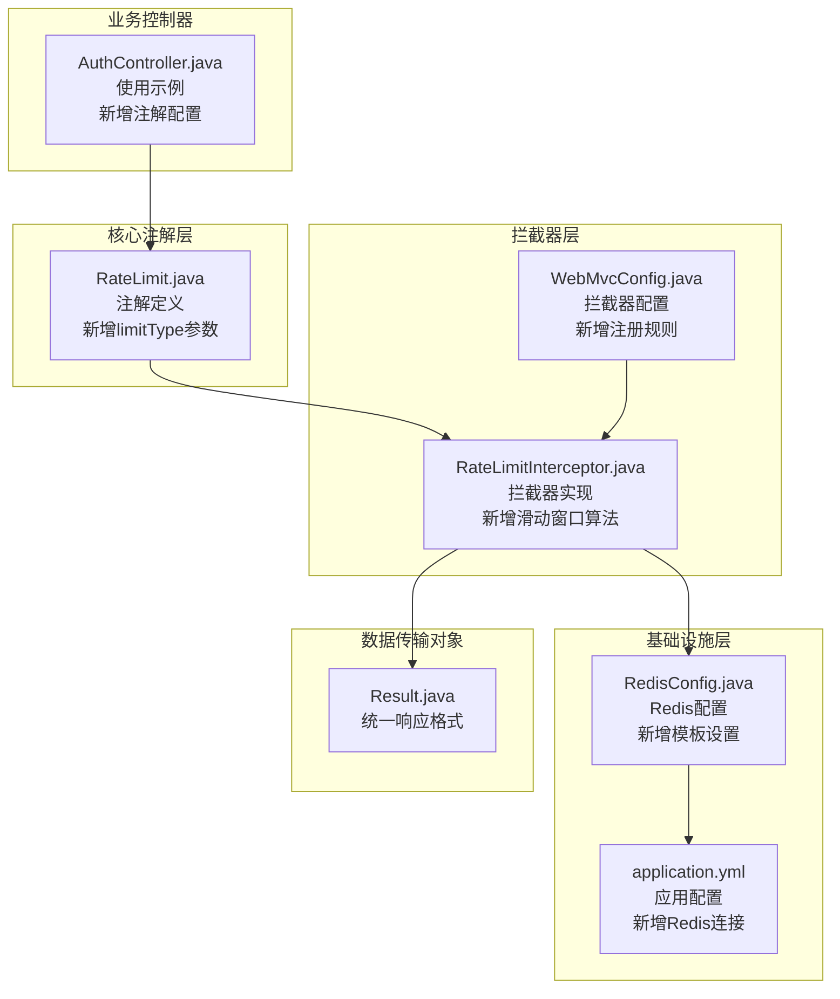
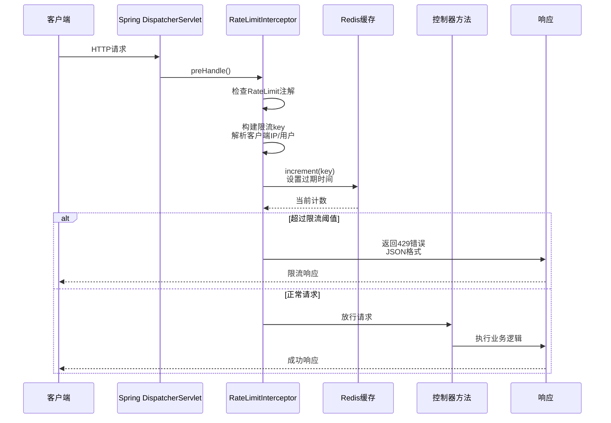
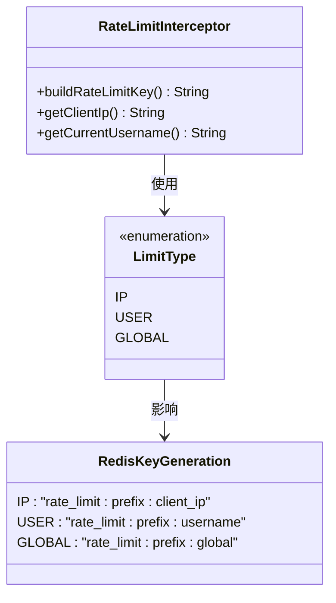
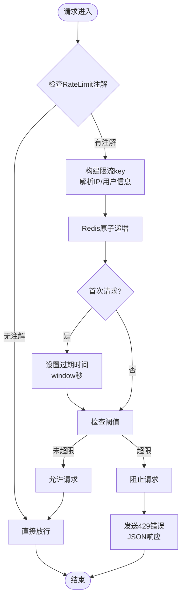
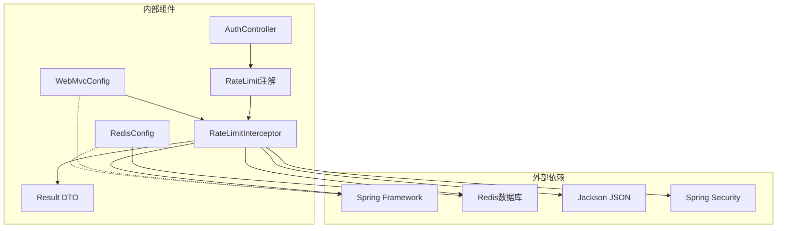

# 速率限制系统

<cite>
**本文档引用的文件**
- [RateLimit.java](file://backend/src/main/java/com/freetrader/annotation/RateLimit.java)
- [RateLimitInterceptor.java](file://backend/src/main/java/com/freetrader/interceptor/RateLimitInterceptor.java)
- [RedisConfig.java](file://backend/src/main/java/com/freetrader/config/RedisConfig.java)
- [WebMvcConfig.java](file://backend/src/main/java/com/freetrader/config/WebMvcConfig.java)
- [application.yml](file://backend/src/main/resources/application.yml)
- [Result.java](file://backend/src/main/java/com/freetrader/dto/Result.java)
- [AuthController.java](file://backend/src/main/java/com/freetrader/controller/AuthController.java)
</cite>

## 更新摘要
**变更内容**
- 新增RateLimit注解的limitType参数，支持IP、USER、GLOBAL三种限流模式
- 实现基于Redis的滑动窗口计数器算法
- 新增客户端IP解析和当前用户解析机制
- 完善WebMvcConfig中的拦截器注册配置
- 优化Redis模板配置和序列化设置

## 目录
1. [简介](#简介)
2. [项目结构](#项目结构)
3. [核心组件](#核心组件)
4. [架构概览](#架构概览)
5. [详细组件分析](#详细组件分析)
6. [依赖关系分析](#依赖关系分析)
7. [性能考虑](#性能考虑)
8. [故障排除指南](#故障排除指南)
9. [结论](#结论)

## 简介

FreeTrader 项目的速率限制系统是一个基于 Spring MVC 拦截器和 Redis 的分布式限流解决方案。该系统通过注解驱动的方式，为应用程序提供了灵活且可配置的请求频率控制能力。系统采用滑动窗口计数器算法，结合 Redis 实现全局状态共享，确保在多实例部署环境下的一致性限流效果。

**更新** 新增了基于Redis的滑动窗口算法实现，支持IP、用户、全局三种限流模式，并增强了客户端IP解析和当前用户解析机制。

## 项目结构

速率限制系统主要分布在以下目录结构中：

**图表来源**
- [RateLimit.java](file://backend/src/main/java/com/freetrader/annotation/RateLimit.java#L1-L49)
- [RateLimitInterceptor.java](file://backend/src/main/java/com/freetrader/interceptor/RateLimitInterceptor.java#L1-L153)
- [RedisConfig.java](file://backend/src/main/java/com/freetrader/config/RedisConfig.java#L1-L97)
- [WebMvcConfig.java](file://backend/src/main/java/com/freetrader/config/WebMvcConfig.java#L1-L26)

## 核心组件

### RateLimit 注解

RateLimit 注解是整个限流系统的核心配置入口，提供了五个关键参数：

- **window**: 限流时间窗口（秒），默认 60 秒
- **maxRequests**: 时间窗口内的最大请求数，默认 10 次  
- **prefix**: 限流 key 前缀，用于区分不同接口的限流规则
- **limitType**: 限流类型枚举，支持 IP、USER、GLOBAL 三种模式

**更新** 新增了limitType参数，提供更灵活的限流控制策略。

**章节来源**
- [RateLimit.java](file://backend/src/main/java/com/freetrader/annotation/RateLimit.java#L14-L47)

### RateLimitInterceptor 拦截器

拦截器实现了 HandlerInterceptor 接口，负责在请求到达控制器之前进行限流检查。其核心功能包括：

- 请求预处理：检查方法是否带有 RateLimit 注解
- 动态限流键构建：根据限流类型生成唯一的 Redis key
- **新增** 滑动窗口计数器算法：基于 Redis 实现精确的请求频率控制
- **新增** 客户端IP解析：支持多种代理头部的IP获取
- **新增** 当前用户解析：基于Spring Security获取认证用户
- 错误响应处理：当超过限流阈值时返回标准的 JSON 响应

**更新** 完全重写了拦截器实现，新增了滑动窗口算法和多种解析机制。

**章节来源**
- [RateLimitInterceptor.java](file://backend/src/main/java/com/freetrader/interceptor/RateLimitInterceptor.java#L35-L62)

## 架构概览

**图表来源**
- [RateLimitInterceptor.java](file://backend/src/main/java/com/freetrader/interceptor/RateLimitInterceptor.java#L35-L62)
- [AuthController.java](file://backend/src/main/java/com/freetrader/controller/AuthController.java#L34-L51)

## 详细组件分析

### 注解参数详解

#### window 参数
- **含义**: 限流统计的时间窗口长度（秒）
- **默认值**: 60 秒
- **配置建议**: 
  - 登录接口：30-60 秒，防止暴力破解
  - 注册接口：60-120 秒，平衡用户体验与安全
  - 普通查询接口：60-300 秒，避免爬虫攻击

#### maxRequests 参数  
- **含义**: 在时间窗口内允许的最大请求数
- **默认值**: 10 次
- **配置建议**:
  - 登录接口：3-5 次，严格限制暴力破解
  - 注册接口：1-3 次，防止批量注册
  - API 查询接口：50-200 次，满足正常业务需求

#### prefix 参数
- **含义**: Redis key 的前缀标识
- **作用**: 区分不同接口的限流规则，避免相互干扰
- **使用示例**: "login"、"register"、"api-query"

#### limitType 参数
**更新** 新增的限流类型参数，决定了限流作用域的不同维度：

**图表来源**
- [RateLimit.java](file://backend/src/main/java/com/freetrader/annotation/RateLimit.java#L40-L47)
- [RateLimitInterceptor.java](file://backend/src/main/java/com/freetrader/interceptor/RateLimitInterceptor.java#L67-L91)

**章节来源**
- [RateLimit.java](file://backend/src/main/java/com/freetrader/annotation/RateLimit.java#L14-L47)
- [RateLimitInterceptor.java](file://backend/src/main/java/com/freetrader/interceptor/RateLimitInterceptor.java#L67-L91)

### 拦截器实现原理

#### 滑动窗口计数器算法

**更新** 新增了基于Redis的滑动窗口计数器算法，通过 Redis 的原子操作实现精确的请求统计：

**图表来源**
- [RateLimitInterceptor.java](file://backend/src/main/java/com/freetrader/interceptor/RateLimitInterceptor.java#L96-L114)

#### 客户端IP解析机制

**新增** 实现了多层代理支持的IP解析机制：

- **优先级**: X-Forwarded-For > Proxy-Client-IP > WL-Proxy-Client-IP > X-Real-IP > RemoteAddr
- **代理处理**: 支持多个代理链路，取第一个IP地址
- **格式清理**: 自动去除IP地址前后空格

#### 当前用户解析机制

**新增** 基于Spring Security的用户解析：

- **认证检查**: 通过SecurityContextHolder获取当前认证信息
- **用户标识**: 已登录用户返回用户名，未登录用户返回"anonymous"
- **安全考虑**: 避免匿名用户使用特殊标识

#### 错误响应机制

当请求超过限流阈值时，拦截器会返回标准的 JSON 错误响应：

- **HTTP状态码**: 429 Too Many Requests
- **响应格式**: 使用 Result 统一包装
- **错误信息**: "请求过于频繁，请稍后再试"

**章节来源**
- [RateLimitInterceptor.java](file://backend/src/main/java/com/freetrader/interceptor/RateLimitInterceptor.java#L48-L62)
- [Result.java](file://backend/src/main/java/com/freetrader/dto/Result.java#L23-L29)

### 不同限流类型的实现

#### IP 限流
- **适用场景**: 防止同一客户端的恶意请求
- **实现方式**: 基于客户端真实 IP 地址生成 key
- **代理支持**: 自动处理 X-Forwarded-For、Proxy-Client-IP 等头部
- **示例**: "rate_limit:login:192.168.1.100"

#### 用户限流  
- **适用场景**: 基于已登录用户的限流控制
- **实现方式**: 基于当前用户名生成 key
- **安全考虑**: 未登录用户使用匿名标识
- **示例**: "rate_limit:login:john_doe"

#### 全局限流
- **适用场景**: 对整个系统或特定功能的全局限制
- **实现方式**: 使用固定标识 "global" 作为 key 后缀
- **示例**: "rate_limit:login:global"

**章节来源**
- [RateLimitInterceptor.java](file://backend/src/main/java/com/freetrader/interceptor/RateLimitInterceptor.java#L78-L88)
- [RateLimitInterceptor.java](file://backend/src/main/java/com/freetrader/interceptor/RateLimitInterceptor.java#L119-L151)

## 依赖关系分析

**图表来源**
- [RateLimitInterceptor.java](file://backend/src/main/java/com/freetrader/interceptor/RateLimitInterceptor.java#L1-L18)
- [WebMvcConfig.java](file://backend/src/main/java/com/freetrader/config/WebMvcConfig.java#L1-L26)
- [RedisConfig.java](file://backend/src/main/java/com/freetrader/config/RedisConfig.java#L1-L45)

### Redis 配置分析

**更新** Redis配置提供了完整的模板和缓存管理设置：

- **Key 序列化**: StringRedisSerializer
- **Value 序列化**: Jackson2JsonRedisSerializer
- **连接池**: Lettuce 连接池配置
- **缓存管理**: RedisCacheManager 配置
- **序列化优化**: 自定义ObjectMapper配置

**章节来源**
- [RedisConfig.java](file://backend/src/main/java/com/freetrader/config/RedisConfig.java#L25-L60)
- [application.yml](file://backend/src/main/resources/application.yml#L24-L38)

### Web 配置集成

**更新** 拦截器通过 WebMvcConfig 注册到 Spring MVC 中：

- **路径匹配**: /api/** 所有 API 接口
- **排除规则**: /api/auth/refresh 接口不参与限流
- **拦截时机**: 请求预处理阶段执行
- **配置简化**: 使用构造函数注入减少样板代码

**章节来源**
- [WebMvcConfig.java](file://backend/src/main/java/com/freetrader/config/WebMvcConfig.java#L19-L24)

## 性能考虑

### 算法选择与实现

**更新** 系统采用滑动窗口计数器算法，具有以下特点：

- **准确性**: 基于 Redis 原子操作，避免竞态条件
- **性能**: 单次 Redis 操作完成计数和过期设置
- **内存**: 每个限流键占用少量内存空间
- **扩展性**: 支持水平扩展，多实例共享状态
- **Redis优化**: 使用increment和expire组合操作

### Redis 性能优化

**更新** 包含了全面的Redis性能优化措施：

- **连接池**: 配置合理的最大连接数和空闲连接数
- **序列化**: 使用高效的 JSON 序列化方案
- **TTL 管理**: 自动过期机制减少内存占用
- **网络延迟**: 本地部署 Redis 减少网络开销
- **模板复用**: 统一的RedisTemplate配置

### 监控指标建议

建议收集以下关键指标进行性能监控：

- **QPS**: 每秒请求数量
- **限流命中率**: 超过阈值的请求比例
- **Redis 延迟**: Redis 操作平均耗时
- **错误率**: 429 错误响应比例
- **系统负载**: CPU、内存使用情况
- **IP解析成功率**: 客户端IP获取准确率

## 故障排除指南

### 常见问题诊断

**更新** 新增了针对新功能的故障排除指南：

#### 限流不生效
- **检查注解配置**: 确认目标方法正确添加了 RateLimit 注解
- **验证拦截器注册**: 检查 WebMvcConfig 是否正确注册拦截器
- **Redis 连接**: 确认 Redis 服务正常运行
- **滑动窗口算法**: 检查RedisTemplate配置是否正确

#### IP 识别错误
- **代理配置**: 检查反向代理是否正确传递客户端 IP
- **头部验证**: 确认 X-Forwarded-For 等头部是否被正确设置
- **IP解析顺序**: 验证IP解析机制的优先级设置

#### 用户限流异常
- **认证状态**: 确认用户已正确登录并建立认证上下文
- **用户名获取**: 检查 SecurityContextHolder 中的认证信息
- **Spring Security**: 验证安全配置是否正确

#### Redis 异常处理
- **异常恢复**: 系统在Redis异常时自动放行请求
- **日志记录**: 详细记录限流触发和错误信息
- **优雅降级**: 在极端情况下提供基本的限流保护

**章节来源**
- [RateLimitInterceptor.java](file://backend/src/main/java/com/freetrader/interceptor/RateLimitInterceptor.java#L109-L113)

## 结论

**更新** FreeTrader 项目的速率限制系统通过注解驱动的方式，为应用程序提供了灵活且高效的请求频率控制能力。系统采用滑动窗口计数器算法，结合 Redis 实现全局状态共享，确保在分布式环境下的准确限流效果。

### 主要优势

1. **配置简单**: 通过注解即可实现复杂的限流规则
2. **类型丰富**: 支持 IP、用户、全局三种限流类型
3. **性能优异**: 基于 Redis 原子操作，低延迟高并发
4. **扩展性强**: 易于添加新的限流类型和算法
5. **监控友好**: 提供详细的日志和错误处理机制
6. **代理支持**: 完整的多层代理IP解析机制
7. **安全可靠**: 基于Spring Security的用户认证集成

### 最佳实践建议

1. **合理配置参数**: 根据业务场景调整 window 和 maxRequests 参数
2. **分层限流**: 对不同接口采用不同的限流策略
3. **监控告警**: 建立完善的监控体系，及时发现异常流量
4. **定期评估**: 根据实际使用情况调整限流参数
5. **灰度发布**: 新增限流规则时采用渐进式部署
6. **代理配置**: 确保反向代理正确传递客户端IP信息
7. **Redis优化**: 根据实际负载调整Redis连接池配置

该系统为 FreeTrader 项目提供了坚实的安全基础，有效防止了恶意请求和滥用行为，同时保持了良好的用户体验和系统性能。新增的滑动窗口算法和多种解析机制进一步提升了系统的准确性和可靠性。