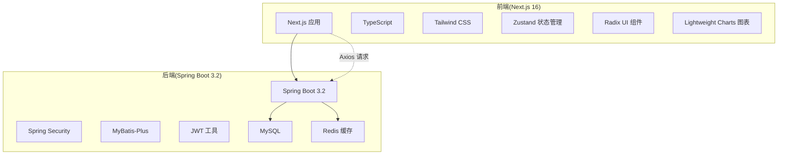
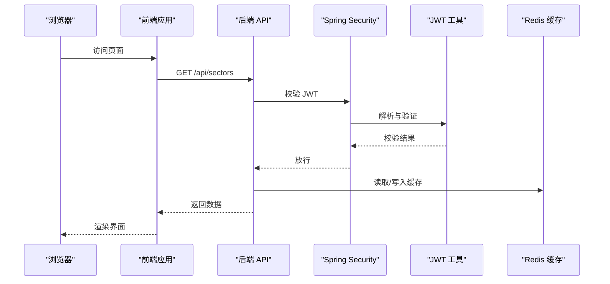
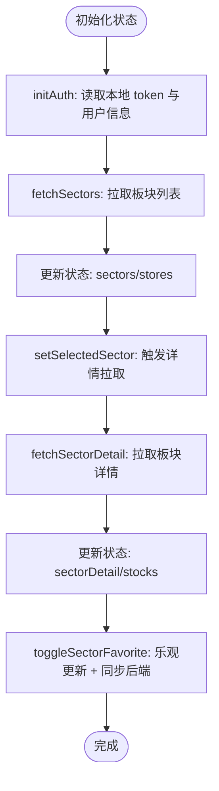
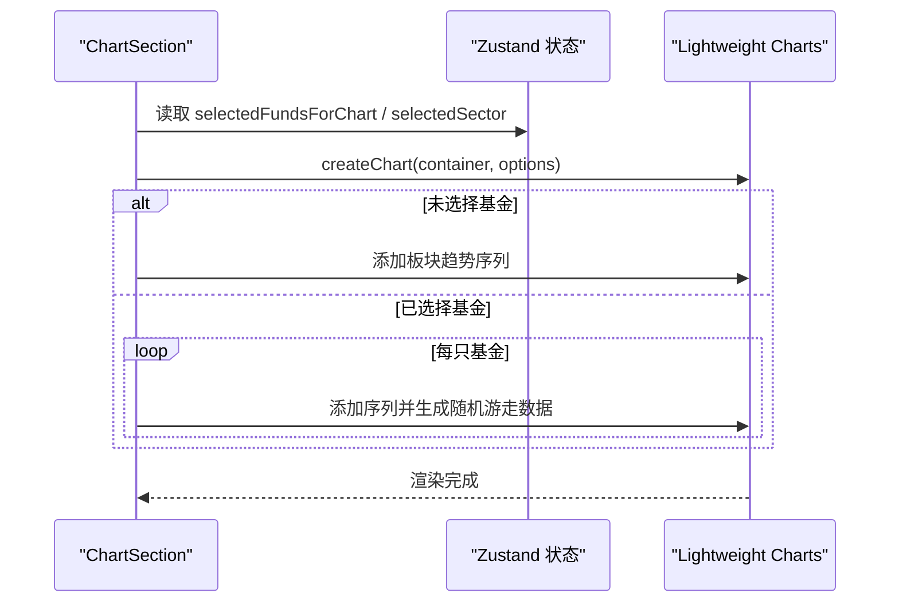
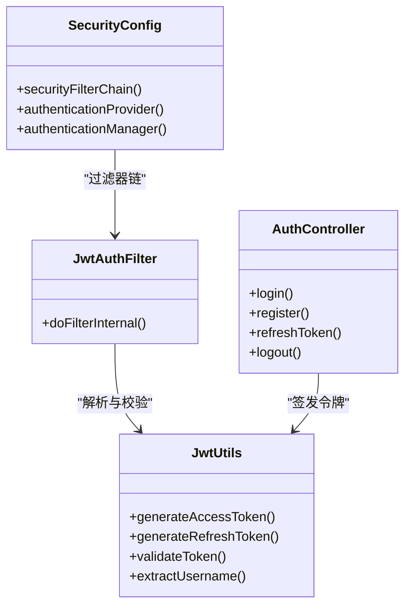
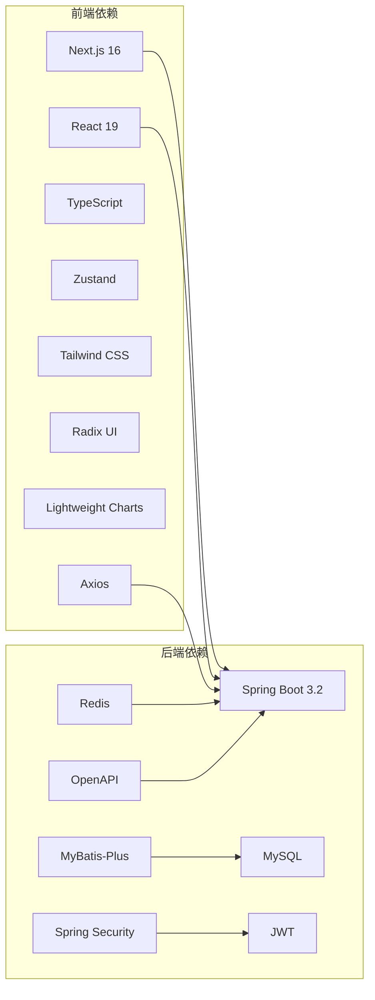

# 技术栈

<cite>
**本文引用的文件**
- [frontend/package.json](file://frontend/package.json)
- [backend/pom.xml](file://backend/pom.xml)
- [frontend/tsconfig.json](file://frontend/tsconfig.json)
- [frontend/components.json](file://frontend/components.json)
- [frontend/next.config.ts](file://frontend/next.config.ts)
- [backend/src/main/resources/application.yml](file://backend/src/main/resources/application.yml)
- [backend/src/main/java/com/freetrader/config/SecurityConfig.java](file://backend/src/main/java/com/freetrader/config/SecurityConfig.java)
- [backend/src/main/java/com/freetrader/config/RedisConfig.java](file://backend/src/main/java/com/freetrader/config/RedisConfig.java)
- [backend/src/main/java/com/freetrader/config/MyBatisPlusConfig.java](file://backend/src/main/java/com/freetrader/config/MyBatisPlusConfig.java)
- [backend/src/main/java/com/freetrader/security/JwtUtils.java](file://backend/src/main/java/com/freetrader/security/JwtUtils.java)
- [backend/src/main/java/com/freetrader/controller/AuthController.java](file://backend/src/main/java/com/freetrader/controller/AuthController.java)
- [backend/src/main/java/com/freetrader/dto/LoginRequest.java](file://backend/src/main/java/com/freetrader/dto/LoginRequest.java)
- [backend/src/main/java/com/freetrader/entity/User.java](file://backend/src/main/java/com/freetrader/entity/User.java)
- [frontend/src/lib/api.ts](file://frontend/src/lib/api.ts)
- [frontend/src/store/useStore.ts](file://frontend/src/store/useStore.ts)
- [frontend/src/components/ChartSection.tsx](file://frontend/src/components/ChartSection.tsx)
</cite>

## 目录
1. [引言](#引言)
2. [项目结构](#项目结构)
3. [核心组件](#核心组件)
4. [架构总览](#架构总览)
5. [详细组件分析](#详细组件分析)
6. [依赖分析](#依赖分析)
7. [性能考量](#性能考量)
8. [故障排查指南](#故障排查指南)
9. [结论](#结论)
10. [附录](#附录)

## 引言
本文件面向技术决策者与开发者，系统梳理 FreeTrader 的前后端技术栈选型与协作方式。前端采用 Next.js 16、React 19、TypeScript、Tailwind CSS、Zustand、Radix UI、Lightweight Charts；后端采用 Spring Boot 3.2、Java 17、Spring Security、MyBatis-Plus、MySQL、Redis、JWT。文档覆盖版本要求、配置要点、性能与可维护性考量、以及前后端集成路径。

## 项目结构
项目采用前后端分离架构，前端位于 frontend 目录，后端位于 backend 目录，数据库脚本位于 sql 目录。前端以 Next.js 16 为基础，使用 React 19、TypeScript、Tailwind CSS、Zustand 状态管理、Radix UI 组件库与 Lightweight Charts 图表库；后端基于 Spring Boot 3.2，使用 Java 17、Spring Security、MyBatis-Plus、MySQL、Redis、JWT 实现认证授权与缓存。

图示来源
- [frontend/package.json](file://frontend/package.json#L11-L31)
- [backend/pom.xml](file://backend/pom.xml#L44-L124)
- [frontend/src/lib/api.ts](file://frontend/src/lib/api.ts#L1-L89)
- [backend/src/main/resources/application.yml](file://backend/src/main/resources/application.yml#L8-L45)

章节来源
- [frontend/package.json](file://frontend/package.json#L1-L44)
- [backend/pom.xml](file://backend/pom.xml#L1-L143)
- [frontend/tsconfig.json](file://frontend/tsconfig.json#L1-L35)
- [frontend/components.json](file://frontend/components.json#L1-L23)
- [frontend/next.config.ts](file://frontend/next.config.ts#L1-L8)
- [backend/src/main/resources/application.yml](file://backend/src/main/resources/application.yml#L1-L102)

## 核心组件
- 前端技术栈
  - Next.js 16：SSR/ISR、App Router、TypeScript 支持与构建优化。
  - React 19：并发特性与函数组件生态。
  - TypeScript：类型安全与开发体验。
  - Tailwind CSS：原子化样式与主题定制。
  - Zustand：轻量状态管理，替代 Redux。
  - Radix UI：无障碍、无样式基础组件库。
  - Lightweight Charts：高性能金融图表。
- 后端技术栈
  - Spring Boot 3.2：自动配置与开箱即用。
  - Java 17：长期支持与性能稳定。
  - Spring Security：基于 JWT 的无状态认证。
  - MyBatis-Plus：简化 ORM 与分页插件。
  - MySQL：关系型数据库。
  - Redis：缓存与会话存储。
  - JWT：令牌签发与校验。

章节来源
- [frontend/package.json](file://frontend/package.json#L11-L31)
- [backend/pom.xml](file://backend/pom.xml#L20-L24)
- [backend/src/main/java/com/freetrader/config/SecurityConfig.java](file://backend/src/main/java/com/freetrader/config/SecurityConfig.java#L29-L46)
- [backend/src/main/java/com/freetrader/config/MyBatisPlusConfig.java](file://backend/src/main/java/com/freetrader/config/MyBatisPlusConfig.java#L12-L17)
- [backend/src/main/java/com/freetrader/config/RedisConfig.java](file://backend/src/main/java/com/freetrader/config/RedisConfig.java#L25-L45)
- [backend/src/main/java/com/freetrader/security/JwtUtils.java](file://backend/src/main/java/com/freetrader/security/JwtUtils.java#L100-L133)

## 架构总览
前后端通过 REST 接口通信，前端使用 Axios 发送请求并在拦截器中注入 Authorization 头；后端启用 Spring Security 的无状态策略，使用 JWT 校验请求合法性，并通过 Redis 缓存热点数据。

图示来源
- [frontend/src/lib/api.ts](file://frontend/src/lib/api.ts#L13-L37)
- [backend/src/main/java/com/freetrader/config/SecurityConfig.java](file://backend/src/main/java/com/freetrader/config/SecurityConfig.java#L30-L46)
- [backend/src/main/java/com/freetrader/security/JwtUtils.java](file://backend/src/main/java/com/freetrader/security/JwtUtils.java#L138-L154)
- [backend/src/main/java/com/freetrader/config/RedisConfig.java](file://backend/src/main/java/com/freetrader/config/RedisConfig.java#L47-L77)

## 详细组件分析

### 前端：Next.js 16 与 React 19
- 版本与特性
  - Next.js 16：提供 App Router、服务端渲染与静态生成能力，结合 TypeScript 提升开发效率。
  - React 19：利用并发特性提升交互流畅度。
- 配置要点
  - tsconfig.json：严格模式、模块解析、路径别名等。
  - components.json：对接 shadcn/ui，统一组件风格与 Tailwind 集成。
  - next.config.ts：空配置占位，便于后续扩展。
- 兼容性
  - TypeScript ^5，React 19.2.3，Next 16.1.1。

章节来源
- [frontend/package.json](file://frontend/package.json#L24-L27)
- [frontend/tsconfig.json](file://frontend/tsconfig.json#L1-L35)
- [frontend/components.json](file://frontend/components.json#L1-L23)
- [frontend/next.config.ts](file://frontend/next.config.ts#L1-L8)

### 前端：TypeScript 与类型安全
- 严格类型约束、路径映射与增量编译提升开发体验与构建速度。
- 与 Next.js 16 的集成通过内置插件完成。

章节来源
- [frontend/tsconfig.json](file://frontend/tsconfig.json#L2-L24)

### 前端：Tailwind CSS 与 Radix UI
- Tailwind CSS：原子化样式，快速搭建 UI。
- Radix UI：无障碍、可组合的基础组件，与 Tailwind 协同良好。
- 组件库集成：通过 shadcn/ui schema 与 aliases 管理组件导入路径。

章节来源
- [frontend/components.json](file://frontend/components.json#L6-L22)

### 前端：Zustand 状态管理
- 轻量、易用的状态容器，替代复杂 Redux。
- 在 useStore 中集中处理认证、UI、图表选择与数据加载逻辑。

图示来源
- [frontend/src/store/useStore.ts](file://frontend/src/store/useStore.ts#L115-L133)
- [frontend/src/store/useStore.ts](file://frontend/src/store/useStore.ts#L171-L206)
- [frontend/src/store/useStore.ts](file://frontend/src/store/useStore.ts#L208-L253)
- [frontend/src/store/useStore.ts](file://frontend/src/store/useStore.ts#L261-L302)

章节来源
- [frontend/src/store/useStore.ts](file://frontend/src/store/useStore.ts#L1-L304)

### 前端：Lightweight Charts 图表
- 用于展示板块整体趋势与多只基金对比曲线。
- 支持时间范围切换、自适应布局与跨平台渲染。

图示来源
- [frontend/src/components/ChartSection.tsx](file://frontend/src/components/ChartSection.tsx#L14-L174)
- [frontend/src/components/ChartSection.tsx](file://frontend/src/components/ChartSection.tsx#L176-L184)

章节来源
- [frontend/src/components/ChartSection.tsx](file://frontend/src/components/ChartSection.tsx#L1-L246)

### 前端：API 客户端与拦截器
- Axios 实例封装，统一基地址与请求头。
- 请求拦截器自动附加 Bearer Token。
- 响应拦截器处理 401 并重定向至登录页。

章节来源
- [frontend/src/lib/api.ts](file://frontend/src/lib/api.ts#L1-L89)

### 后端：Spring Boot 3.2 与 Java 17
- Spring Boot 3.2：提供 web、security、validation、data-redis、openapi 等 Starter。
- Java 17：长期支持版本，性能与稳定性兼顾。
- Maven 仓库：配置阿里云镜像加速下载。

章节来源
- [backend/pom.xml](file://backend/pom.xml#L7-L124)

### 后端：Spring Security 与 JWT
- 无状态会话策略，禁用 CSRF，开放部分公开接口。
- 自定义 JwtAuthFilter，在 UsernamePasswordAuthenticationFilter 之前执行。
- JwtUtils 提供签发、解析、验证与类型判断。

图示来源
- [backend/src/main/java/com/freetrader/config/SecurityConfig.java](file://backend/src/main/java/com/freetrader/config/SecurityConfig.java#L29-L60)
- [backend/src/main/java/com/freetrader/security/JwtUtils.java](file://backend/src/main/java/com/freetrader/security/JwtUtils.java#L100-L154)
- [backend/src/main/java/com/freetrader/controller/AuthController.java](file://backend/src/main/java/com/freetrader/controller/AuthController.java#L28-L71)

章节来源
- [backend/src/main/java/com/freetrader/config/SecurityConfig.java](file://backend/src/main/java/com/freetrader/config/SecurityConfig.java#L1-L61)
- [backend/src/main/java/com/freetrader/security/JwtUtils.java](file://backend/src/main/java/com/freetrader/security/JwtUtils.java#L1-L194)
- [backend/src/main/java/com/freetrader/controller/AuthController.java](file://backend/src/main/java/com/freetrader/controller/AuthController.java#L1-L72)

### 后端：MyBatis-Plus 与分页
- 分页插件针对 MySQL，简化分页查询。
- MyBatis 配置：驼峰映射、SQL 日志开关、逻辑删除字段。

章节来源
- [backend/src/main/java/com/freetrader/config/MyBatisPlusConfig.java](file://backend/src/main/java/com/freetrader/config/MyBatisPlusConfig.java#L1-L19)
- [backend/src/main/resources/application.yml](file://backend/src/main/resources/application.yml#L46-L59)

### 后端：Redis 缓存
- RedisTemplate 与 Jackson 序列化配置，支持对象缓存。
- RedisCacheManager 定义默认 TTL 与特定缓存区间的 TTL。

章节来源
- [backend/src/main/java/com/freetrader/config/RedisConfig.java](file://backend/src/main/java/com/freetrader/config/RedisConfig.java#L25-L77)
- [backend/src/main/resources/application.yml](file://backend/src/main/resources/application.yml#L24-L45)

### 后端：数据库与实体
- 数据源配置：MySQL 驱动、连接池参数、时区与字符集。
- 实体类 User 映射 user_info 表，包含逻辑删除字段。

章节来源
- [backend/src/main/resources/application.yml](file://backend/src/main/resources/application.yml#L8-L19)
- [backend/src/main/java/com/freetrader/entity/User.java](file://backend/src/main/java/com/freetrader/entity/User.java#L1-L29)

### 后端：认证 DTO 与控制器
- LoginRequest：校验用户名与密码非空。
- AuthController：提供登录、注册、刷新与登出接口，集成限流注解。

章节来源
- [backend/src/main/java/com/freetrader/dto/LoginRequest.java](file://backend/src/main/java/com/freetrader/dto/LoginRequest.java#L1-L15)
- [backend/src/main/java/com/freetrader/controller/AuthController.java](file://backend/src/main/java/com/freetrader/controller/AuthController.java#L1-L72)

## 依赖分析
- 前端依赖
  - Next.js 16、React 19、TypeScript、Tailwind CSS、Zustand、Radix UI、Lightweight Charts、Axios。
- 后端依赖
  - Spring Boot 3.2、Spring Security、MyBatis-Plus、MySQL、Redis、JWT、OpenAPI/Swagger。

图示来源
- [frontend/package.json](file://frontend/package.json#L11-L31)
- [backend/pom.xml](file://backend/pom.xml#L44-L124)

章节来源
- [frontend/package.json](file://frontend/package.json#L1-L44)
- [backend/pom.xml](file://backend/pom.xml#L1-L143)

## 性能考量
- 前端
  - Next.js App Router 与 SSR/SSG 可降低首屏延迟。
  - Zustand 无中间件与样板代码，减少状态层开销。
  - Lightweight Charts 专注金融图表渲染，按需生成数据点。
- 后端
  - Redis 缓存热点数据，降低数据库压力。
  - MyBatis-Plus 分页插件减少一次性数据传输。
  - Spring Security 无状态策略降低会话存储成本。
- 兼顾点
  - TypeScript 严格模式与增量编译提升构建效率。
  - Java 17 LTS 与 Spring Boot 3.2 在性能与稳定性之间取得平衡。

## 故障排查指南
- 前端
  - 401 未授权：检查本地 token 是否存在与过期；确认拦截器是否正确注入 Authorization 头。
  - 图表空白：确认选中基金或板块趋势数据是否存在；检查容器尺寸与 resize 事件。
- 后端
  - JWT 校验失败：检查密钥长度与配置项；确认 Token 类型与过期时间。
  - Redis 连接异常：核对主机、端口、密码与超时配置；检查连接池参数。
  - 数据库连接异常：核对 URL、用户名、密码与驱动类名；检查连接池大小与超时。

章节来源
- [frontend/src/lib/api.ts](file://frontend/src/lib/api.ts#L25-L37)
- [frontend/src/components/ChartSection.tsx](file://frontend/src/components/ChartSection.tsx#L160-L174)
- [backend/src/main/java/com/freetrader/security/JwtUtils.java](file://backend/src/main/java/com/freetrader/security/JwtUtils.java#L34-L48)
- [backend/src/main/resources/application.yml](file://backend/src/main/resources/application.yml#L24-L45)
- [backend/src/main/resources/application.yml](file://backend/src/main/resources/application.yml#L8-L19)

## 结论
本技术栈在性能、可维护性与团队技能匹配度方面达成平衡：前端以 Next.js 16 为核心，配合 React 19、TypeScript、Tailwind CSS、Zustand 与 Lightweight Charts 构建现代化交互；后端以 Spring Boot 3.2 为基础，结合 Spring Security、JWT、MyBatis-Plus、Redis 与 MySQL 实现高可用与可扩展的业务层。前后端通过 REST 接口与 JWT 无状态认证协同工作，满足金融数据展示与用户管理需求。

## 附录
- 版本与兼容性摘要
  - 前端：Next.js 16.1.1、React 19.2.3、TypeScript ^5、Tailwind CSS ^4、Zustand ^5、Radix UI、Lightweight Charts ^5。
  - 后端：Spring Boot 3.2.1、Java 17、Spring Security、MyBatis-Plus 3.5.5、MySQL、Redis、JWT jjwt 0.12.3、OpenAPI 2.3.0。
- 关键配置要点
  - 前端：tsconfig.json 严格模式与路径别名；components.json 对接 shadcn/ui；next.config.ts 留作扩展。
  - 后端：application.yml 中数据库、Redis、MyBatis-Plus、JWT、OpenAPI 参数；SecurityConfig 无状态策略与公开接口放行；RedisConfig 序列化与 TTL；JwtUtils 密钥长度与 Token 类型判断。