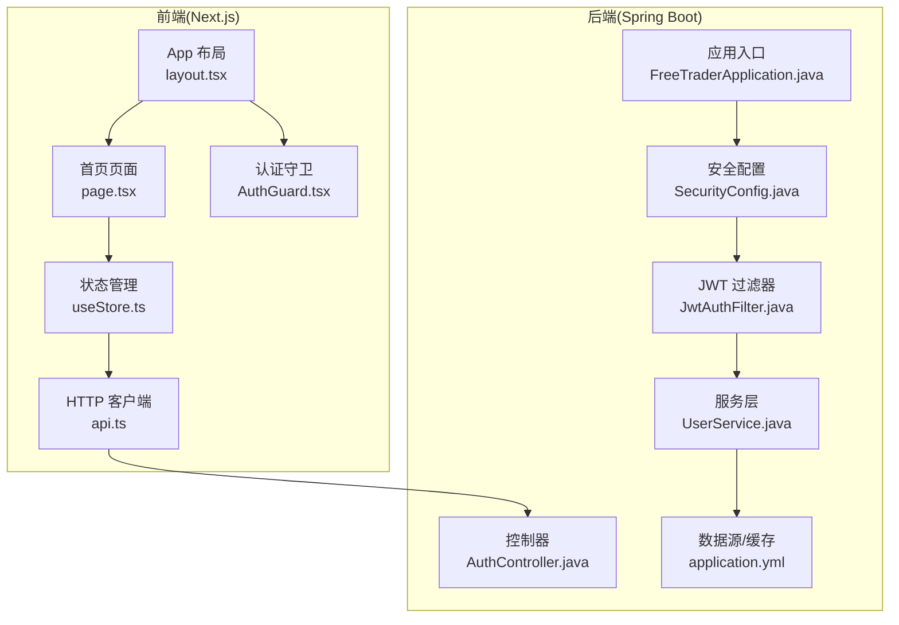
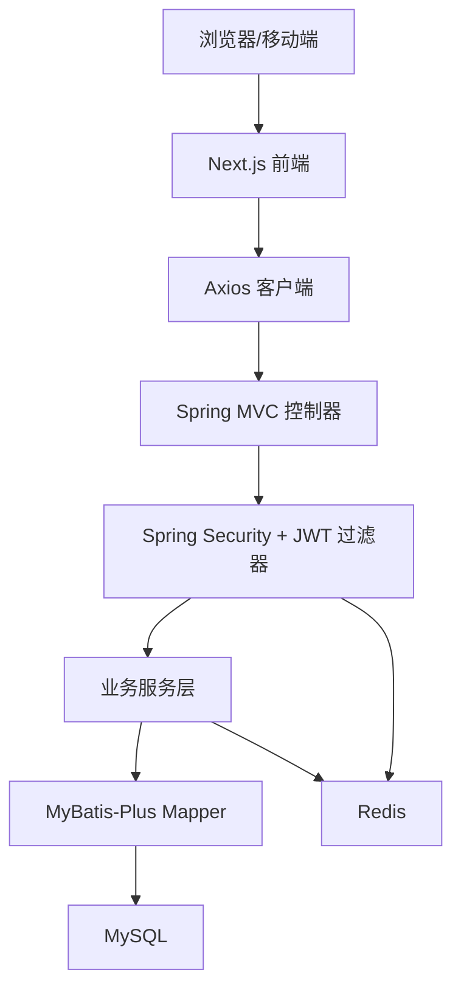
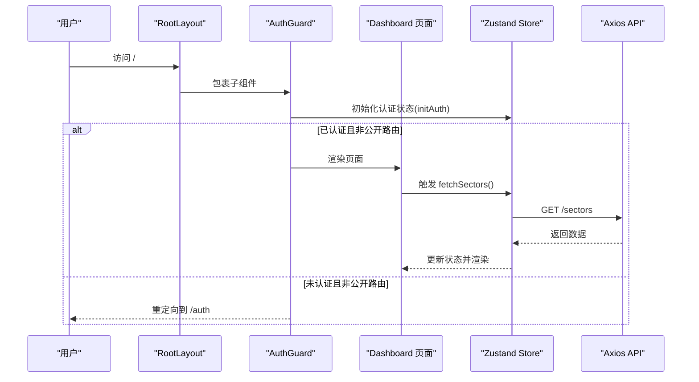
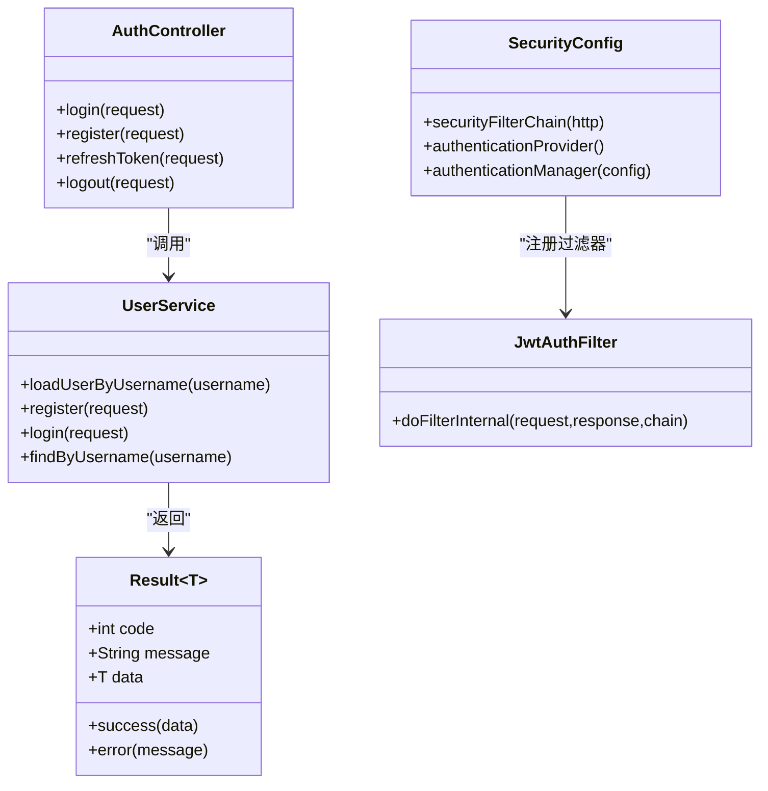
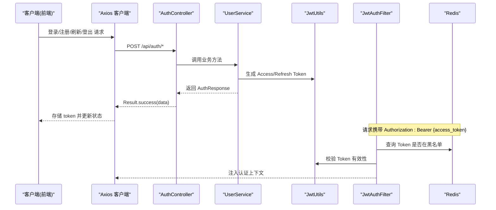
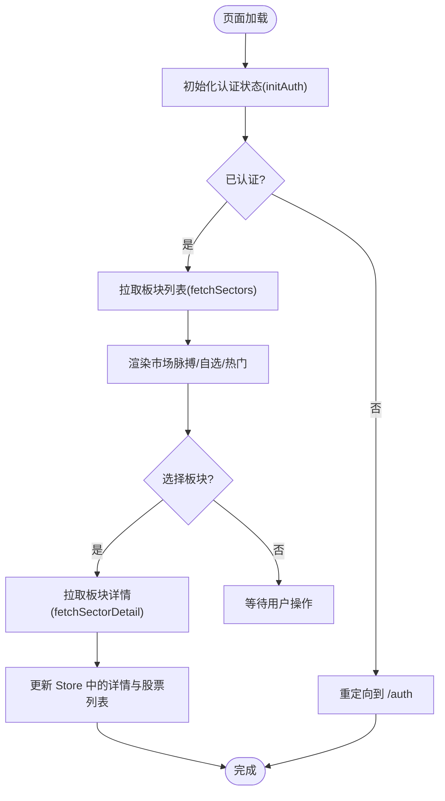
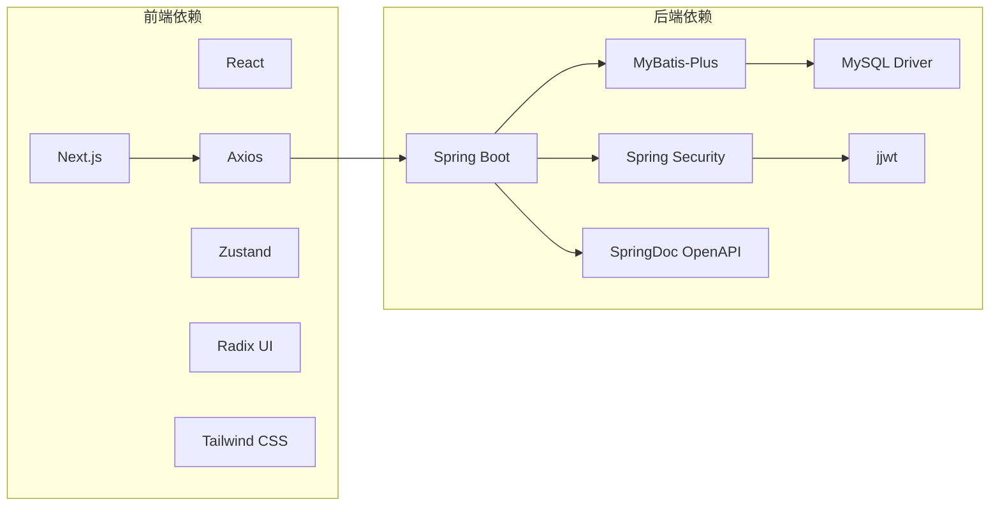

# 架构概览

<cite>
**本文引用的文件**
- [README.md](file://README.md)
- [FreeTraderApplication.java](file://backend/src/main/java/com/freetrader/FreeTraderApplication.java)
- [application.yml](file://backend/src/main/resources/application.yml)
- [pom.xml](file://backend/pom.xml)
- [package.json](file://frontend/package.json)
- [layout.tsx](file://frontend/src/app/layout.tsx)
- [page.tsx](file://frontend/src/app/page.tsx)
- [api.ts](file://frontend/src/lib/api.ts)
- [useStore.ts](file://frontend/src/store/useStore.ts)
- [AuthGuard.tsx](file://frontend/src/components/AuthGuard.tsx)
- [SecurityConfig.java](file://backend/src/main/java/com/freetrader/config/SecurityConfig.java)
- [JwtAuthFilter.java](file://backend/src/main/java/com/freetrader/security/JwtAuthFilter.java)
- [AuthController.java](file://backend/src/main/java/com/freetrader/controller/AuthController.java)
- [UserService.java](file://backend/src/main/java/com/freetrader/service/UserService.java)
- [Result.java](file://backend/src/main/java/com/freetrader/dto/Result.java)
</cite>

## 目录
1. [引言](#引言)
2. [项目结构](#项目结构)
3. [核心组件](#核心组件)
4. [架构总览](#架构总览)
5. [详细组件分析](#详细组件分析)
6. [依赖分析](#依赖分析)
7. [性能考量](#性能考量)
8. [故障排查指南](#故障排查指南)
9. [结论](#结论)
10. [附录](#附录)

## 引言
本项目采用前后端分离架构，前端基于 Next.js 16 + React 19 + TypeScript，后端基于 Spring Boot 3.2.1 + Java 17。系统提供 ETF 信息查询、用户管理与数据可视化能力，支持 JWT 双 Token 认证、Redis 缓存与 Token 黑名单、统一异常处理与 OpenAPI 文档生成。本文从架构视角梳理整体设计、组件关系、数据流与用户交互流程，并给出扩展性与性能优化建议。

## 项目结构
- 前端（Next.js）：采用 App Router，页面按路由组织，全局布局与守卫在根布局中注入；状态管理使用 Zustand；UI 组件来自 Radix UI/Tailwind。
- 后端（Spring Boot）：采用分层架构（控制器、服务、数据访问），MyBatis-Plus 提供 ORM 能力，Spring Security 集成 JWT 过滤链，Redis 用于缓存与 Token 黑名单。

**图示来源**
- [layout.tsx](file://frontend/src/app/layout.tsx#L16-L35)
- [page.tsx](file://frontend/src/app/page.tsx#L11-L20)
- [useStore.ts](file://frontend/src/store/useStore.ts#L62-L133)
- [api.ts](file://frontend/src/lib/api.ts#L1-L37)
- [AuthGuard.tsx](file://frontend/src/components/AuthGuard.tsx#L11-L38)
- [FreeTraderApplication.java](file://backend/src/main/java/com/freetrader/FreeTraderApplication.java#L9-L13)
- [SecurityConfig.java](file://backend/src/main/java/com/freetrader/config/SecurityConfig.java#L30-L46)
- [JwtAuthFilter.java](file://backend/src/main/java/com/freetrader/security/JwtAuthFilter.java#L31-L82)
- [AuthController.java](file://backend/src/main/java/com/freetrader/controller/AuthController.java#L20-L23)
- [UserService.java](file://backend/src/main/java/com/freetrader/service/UserService.java#L25-L39)
- [application.yml](file://backend/src/main/resources/application.yml#L1-L102)

**章节来源**
- [README.md](file://README.md#L28-L47)
- [package.json](file://frontend/package.json#L11-L31)
- [pom.xml](file://backend/pom.xml#L43-L124)

## 核心组件
- 前端
  - 全局布局与守卫：根布局注入 Header、AuthGuard、全局客户端组件与通知；AuthGuard 基于本地存储与 Zustand 状态进行路由拦截。
  - 页面与状态：首页页面负责渲染市场脉搏、自选板块与热门板块，状态通过 Zustand 管理，包含认证、UI、图表选择与数据加载。
  - HTTP 客户端：Axios 实例封装基础 URL、请求头注入 Bearer Token、统一 401 处理跳转登录。
- 后端
  - 应用入口：扫描 Mapper 包，启动 Spring Boot。
  - 安全与过滤：基于 Spring Security 的无状态过滤链，JWT 过滤器校验 Token 并结合 Redis 黑名单。
  - 控制器与服务：认证控制器提供登录、注册、刷新、登出；UserService 实现用户认证与 Token 签发。
  - 配置：数据源、Redis、MyBatis-Plus、JWT、OpenAPI 等通过 application.yml 注入。

**章节来源**
- [layout.tsx](file://frontend/src/app/layout.tsx#L16-L35)
- [AuthGuard.tsx](file://frontend/src/components/AuthGuard.tsx#L11-L38)
- [page.tsx](file://frontend/src/app/page.tsx#L11-L20)
- [useStore.ts](file://frontend/src/store/useStore.ts#L62-L133)
- [api.ts](file://frontend/src/lib/api.ts#L1-L37)
- [FreeTraderApplication.java](file://backend/src/main/java/com/freetrader/FreeTraderApplication.java#L9-L13)
- [SecurityConfig.java](file://backend/src/main/java/com/freetrader/config/SecurityConfig.java#L30-L46)
- [JwtAuthFilter.java](file://backend/src/main/java/com/freetrader/security/JwtAuthFilter.java#L31-L82)
- [AuthController.java](file://backend/src/main/java/com/freetrader/controller/AuthController.java#L20-L71)
- [UserService.java](file://backend/src/main/java/com/freetrader/service/UserService.java#L25-L102)
- [application.yml](file://backend/src/main/resources/application.yml#L1-L102)

## 架构总览
系统采用前后端分离的单体应用架构，前端通过 Axios 调用后端 REST 接口，后端通过 Spring MVC 暴露 API，使用 Spring Security + JWT 实现无状态认证，MyBatis-Plus 访问 MySQL，Redis 提供缓存与 Token 黑名单。

**图示来源**
- [api.ts](file://frontend/src/lib/api.ts#L3-L11)
- [AuthController.java](file://backend/src/main/java/com/freetrader/controller/AuthController.java#L20-L23)
- [SecurityConfig.java](file://backend/src/main/java/com/freetrader/config/SecurityConfig.java#L30-L46)
- [JwtAuthFilter.java](file://backend/src/main/java/com/freetrader/security/JwtAuthFilter.java#L31-L82)
- [UserService.java](file://backend/src/main/java/com/freetrader/service/UserService.java#L25-L39)
- [application.yml](file://backend/src/main/resources/application.yml#L8-L58)

## 详细组件分析

### 前端：Next.js 应用组织与路由
- App Router 使用：根布局定义全局结构与守卫，页面组件通过 useStore 与 API 交互，页面挂载时触发数据拉取。
- 组件层次：layout.tsx 作为根容器，AuthGuard 对受保护路由进行鉴权；页面组件负责视图渲染与交互；状态管理集中于 Zustand store。
- 路由行为：AuthGuard 基于路径判断公开/私有路由，未认证访问受保护路由将重定向至登录页；已认证访问登录页将重定向至首页。

**图示来源**
- [layout.tsx](file://frontend/src/app/layout.tsx#L22-L31)
- [AuthGuard.tsx](file://frontend/src/components/AuthGuard.tsx#L22-L38)
- [page.tsx](file://frontend/src/app/page.tsx#L17-L20)
- [useStore.ts](file://frontend/src/store/useStore.ts#L171-L206)
- [api.ts](file://frontend/src/lib/api.ts#L52-L63)

**章节来源**
- [layout.tsx](file://frontend/src/app/layout.tsx#L16-L35)
- [AuthGuard.tsx](file://frontend/src/components/AuthGuard.tsx#L11-L59)
- [page.tsx](file://frontend/src/app/page.tsx#L11-L20)
- [useStore.ts](file://frontend/src/store/useStore.ts#L62-L133)
- [api.ts](file://frontend/src/lib/api.ts#L1-L37)

### 后端：Spring Boot 分层架构
- 控制器层：AuthController 提供 /api/auth/* 接口，使用注解声明 OpenAPI 文档，配合限流注解保护接口。
- 服务层：UserService 实现用户认证与注册，集成 Spring Security UserDetailsService，使用 PasswordEncoder 加密密码，通过 JwtUtils 生成双 Token。
- 安全层：SecurityConfig 配置无状态会话、CORS、放行公开接口、添加 JWT 过滤器；JwtAuthFilter 从请求头解析 Token，校验有效性与黑名单，注入认证上下文。
- 数据访问层：MyBatis-Plus Mapper 通过 XML 映射 SQL，application.yml 配置数据源、Redis、MyBatis-Plus 全局配置。
- 统一响应：Result<T> 封装统一返回结构，控制器通过 Result.success()/error() 输出。

**图示来源**
- [AuthController.java](file://backend/src/main/java/com/freetrader/controller/AuthController.java#L20-L71)
- [UserService.java](file://backend/src/main/java/com/freetrader/service/UserService.java#L25-L102)
- [SecurityConfig.java](file://backend/src/main/java/com/freetrader/config/SecurityConfig.java#L29-L60)
- [JwtAuthFilter.java](file://backend/src/main/java/com/freetrader/security/JwtAuthFilter.java#L25-L82)
- [Result.java](file://backend/src/main/java/com/freetrader/dto/Result.java#L10-L30)

**章节来源**
- [AuthController.java](file://backend/src/main/java/com/freetrader/controller/AuthController.java#L20-L71)
- [UserService.java](file://backend/src/main/java/com/freetrader/service/UserService.java#L25-L102)
- [SecurityConfig.java](file://backend/src/main/java/com/freetrader/config/SecurityConfig.java#L29-L60)
- [JwtAuthFilter.java](file://backend/src/main/java/com/freetrader/security/JwtAuthFilter.java#L31-L82)
- [Result.java](file://backend/src/main/java/com/freetrader/dto/Result.java#L10-L30)

### 认证与授权流程（登录/刷新/登出）

**图示来源**
- [api.ts](file://frontend/src/lib/api.ts#L40-L50)
- [AuthController.java](file://backend/src/main/java/com/freetrader/controller/AuthController.java#L34-L70)
- [UserService.java](file://backend/src/main/java/com/freetrader/service/UserService.java#L41-L96)
- [JwtAuthFilter.java](file://backend/src/main/java/com/freetrader/security/JwtAuthFilter.java#L49-L76)
- [application.yml](file://backend/src/main/resources/application.yml#L24-L44)

**章节来源**
- [api.ts](file://frontend/src/lib/api.ts#L1-L37)
- [AuthController.java](file://backend/src/main/java/com/freetrader/controller/AuthController.java#L28-L70)
- [UserService.java](file://backend/src/main/java/com/freetrader/service/UserService.java#L41-L96)
- [JwtAuthFilter.java](file://backend/src/main/java/com/freetrader/security/JwtAuthFilter.java#L49-L76)
- [application.yml](file://backend/src/main/resources/application.yml#L24-L44)

### 数据流向与用户交互
- 数据来源：前端通过 useStore 调用 sectorApi 获取板块列表与详情；收藏切换采用乐观更新，再异步同步后端。
- 用户交互：Dashboard 页面渲染市场脉搏、自选与热门板块，点击进入板块详情；收藏按钮支持一键切换。
- 错误处理：前端 Axios 统一拦截 401，清除本地 token 并跳转登录；Store 在网络异常时保留本地数据作为回退。

**图示来源**
- [AuthGuard.tsx](file://frontend/src/components/AuthGuard.tsx#L22-L38)
- [useStore.ts](file://frontend/src/store/useStore.ts#L171-L206)
- [useStore.ts](file://frontend/src/store/useStore.ts#L208-L253)
- [page.tsx](file://frontend/src/app/page.tsx#L17-L20)

**章节来源**
- [useStore.ts](file://frontend/src/store/useStore.ts#L171-L206)
- [useStore.ts](file://frontend/src/store/useStore.ts#L208-L253)
- [page.tsx](file://frontend/src/app/page.tsx#L17-L20)
- [AuthGuard.tsx](file://frontend/src/components/AuthGuard.tsx#L22-L38)

## 依赖分析
- 前端依赖：Next.js、React、Axios、Zustand、Radix UI、Tailwind CSS、Lightweight Charts 等。
- 后端依赖：Spring Boot Web/Security/Validation/Data-Redis、MyBatis-Plus、MySQL 驱动、jjwt、SpringDoc OpenAPI、Lombok。

**图示来源**
- [package.json](file://frontend/package.json#L11-L31)
- [pom.xml](file://backend/pom.xml#L43-L124)

**章节来源**
- [package.json](file://frontend/package.json#L11-L31)
- [pom.xml](file://backend/pom.xml#L43-L124)

## 性能考量
- 前端
  - 状态局部化：Zustand 将 UI 状态与业务状态分离，减少不必要重渲染。
  - 乐观更新：收藏切换先更新本地状态，再异步同步后端，提升交互流畅度。
  - 图表渲染：轻量级图表库，仅在需要时渲染，避免过度绘制。
- 后端
  - Redis 缓存：配置 Redis 作为缓存与 Token 黑名单存储，降低数据库压力。
  - 连接池：HikariCP 连接池参数可调，结合线程池大小控制并发。
  - SQL 优化：MyBatis-Plus 自动映射驼峰命名，建议对高频查询建立索引。
  - 日志级别：生产环境建议关闭 SQL 日志输出，降低 IO 压力。
- 安全与稳定性
  - 限流注解：对登录/注册接口进行 IP 级限流，防止暴力破解。
  - 无状态会话：JWT 无状态设计降低服务器内存占用。

**章节来源**
- [useStore.ts](file://frontend/src/store/useStore.ts#L278-L302)
- [application.yml](file://backend/src/main/resources/application.yml#L13-L18)
- [application.yml](file://backend/src/main/resources/application.yml#L24-L44)
- [application.yml](file://backend/src/main/resources/application.yml#L46-L58)
- [AuthController.java](file://backend/src/main/java/com/freetrader/controller/AuthController.java#L34-L47)

## 故障排查指南
- 前端
  - 401 未认证：Axios 响应拦截器检测 401，清除本地 token 并跳转登录页。
  - 认证守卫：AuthGuard 在加载期间显示加载态，若未认证访问受保护路由则重定向。
  - 网络异常：Store 在拉取失败时保留本地数据，保证基本可用。
- 后端
  - 统一异常：Result 封装统一返回，便于前端识别错误码与消息。
  - 安全过滤：JwtAuthFilter 校验 Token 类型与黑名单，日志记录验证失败原因。
  - 配置检查：确认 application.yml 中数据库、Redis、JWT 参数正确，OpenAPI 开关与端口配置符合预期。

**章节来源**
- [api.ts](file://frontend/src/lib/api.ts#L25-L37)
- [AuthGuard.tsx](file://frontend/src/components/AuthGuard.tsx#L40-L58)
- [Result.java](file://backend/src/main/java/com/freetrader/dto/Result.java#L10-L30)
- [JwtAuthFilter.java](file://backend/src/main/java/com/freetrader/security/JwtAuthFilter.java#L49-L76)
- [application.yml](file://backend/src/main/resources/application.yml#L1-L102)

## 结论
本项目以“前后端分离 + 单体应用”为核心设计，前端通过 Next.js 实现现代化交互体验，后端以 Spring Boot 提供稳定的服务能力。通过 JWT 无状态认证、Redis 缓存与 Token 黑名单、统一响应与 OpenAPI 文档，系统在安全性、可维护性与可观测性方面具备良好基础。后续可在微服务拆分、CDN 加速、数据库读写分离等方面进一步演进。

## 附录
- 快速启动与访问
  - 前端：开发端口 3000，安装依赖后运行 dev。
  - 后端：默认端口 8080，Swagger UI 地址见 README。
- 环境变量
  - 后端通过环境变量覆盖数据库、Redis、JWT、日志等配置，便于不同环境部署。

**章节来源**
- [README.md](file://README.md#L65-L119)
- [application.yml](file://backend/src/main/resources/application.yml#L1-L102)