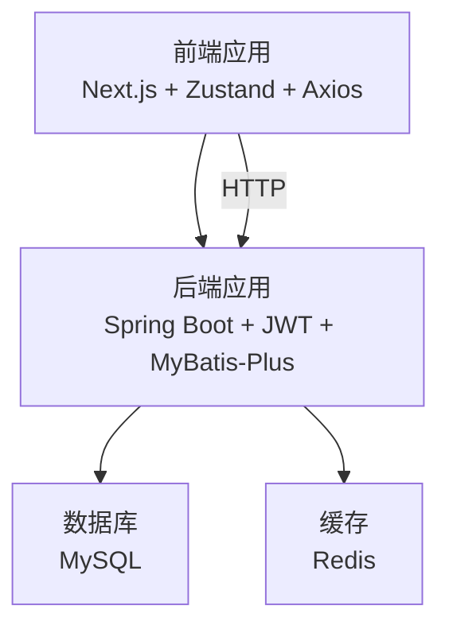
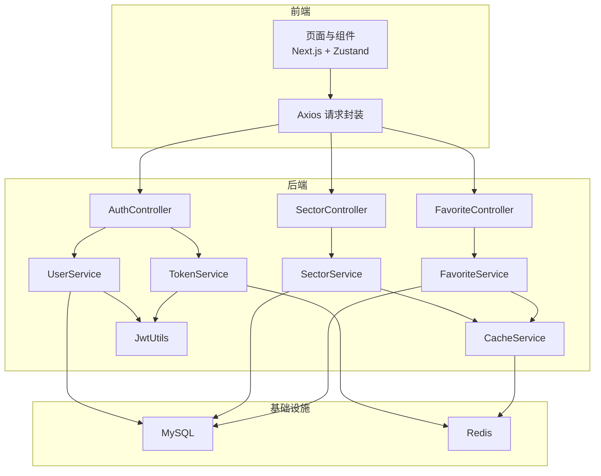
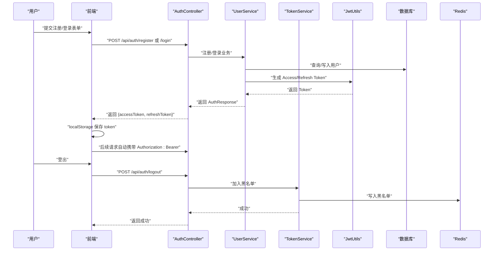
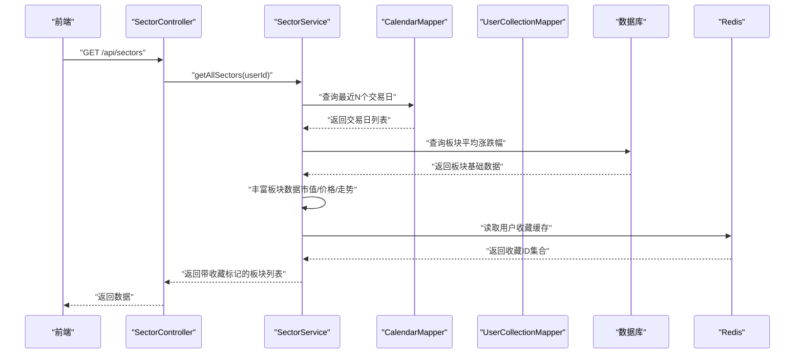
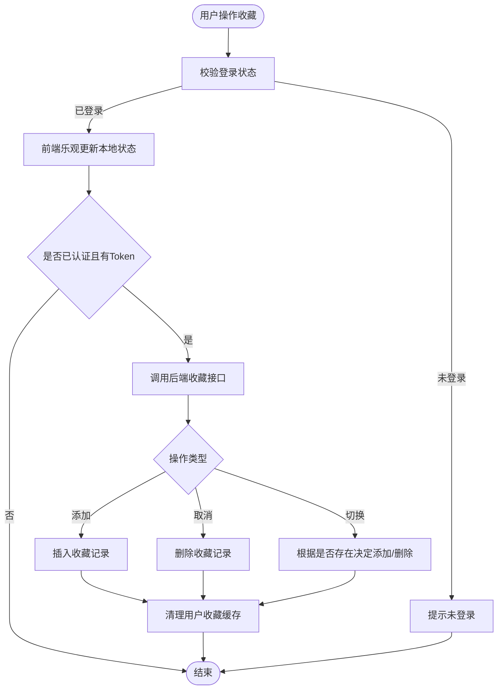
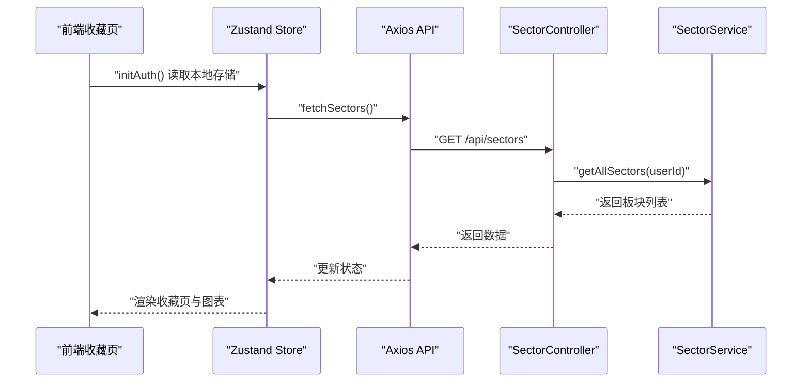
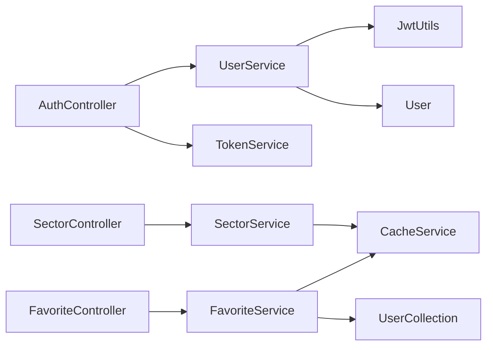

# 核心功能

<cite>
**本文引用的文件**
- [AuthController.java](file://backend/src/main/java/com/freetrader/controller/AuthController.java)
- [UserService.java](file://backend/src/main/java/com/freetrader/service/UserService.java)
- [JwtUtils.java](file://backend/src/main/java/com/freetrader/security/JwtUtils.java)
- [TokenService.java](file://backend/src/main/java/com/freetrader/service/TokenService.java)
- [FavoriteController.java](file://backend/src/main/java/com/freetrader/controller/FavoriteController.java)
- [FavoriteService.java](file://backend/src/main/java/com/freetrader/service/FavoriteService.java)
- [SectorController.java](file://backend/src/main/java/com/freetrader/controller/SectorController.java)
- [SectorService.java](file://backend/src/main/java/com/freetrader/service/SectorService.java)
- [CacheService.java](file://backend/src/main/java/com/freetrader/service/CacheService.java)
- [User.java](file://backend/src/main/java/com/freetrader/entity/User.java)
- [UserCollection.java](file://backend/src/main/java/com/freetrader/entity/UserCollection.java)
- [AuthResponse.java](file://backend/src/main/java/com/freetrader/dto/AuthResponse.java)
- [SectorDTO.java](file://backend/src/main/java/com/freetrader/dto/SectorDTO.java)
- [api.ts](file://frontend/src/lib/api.ts)
- [useStore.ts](file://frontend/src/store/useStore.ts)
- [page.tsx（收藏页）](file://frontend/src/app/favorites/page.tsx)
- [application.yml](file://backend/src/main/resources/application.yml)
- [README.md](file://README.md)
</cite>

## 目录
1. [简介](#简介)
2. [项目结构](#项目结构)
3. [核心组件](#核心组件)
4. [架构总览](#架构总览)
5. [详细组件分析](#详细组件分析)
6. [依赖关系分析](#依赖关系分析)
7. [性能考量](#性能考量)
8. [故障排查指南](#故障排查指南)
9. [结论](#结论)
10. [附录](#附录)

## 简介
本文件面向 FreeTrader 应用的核心功能，围绕“用户注册登录系统”“ETF 板块信息与浏览”“用户收藏管理”“数据可视化展示”四大模块进行深入说明。内容涵盖功能实现方式、用户体验流程、模块间关联与数据流转、技术实现亮点与创新点，并提供使用场景示例与排障建议，帮助用户快速上手、开发者理解架构。

## 项目结构
- 前端采用 Next.js 16 + TypeScript + Zustand 状态管理 + Lightweight Charts 可视化，通过 Axios 调用后端 API。
- 后端采用 Spring Boot 3 + Spring Security（JWT）+ MyBatis-Plus + MySQL + Redis，提供认证授权、板块数据查询、收藏管理与缓存能力。
- 配置集中于 application.yml，支持通过环境变量覆盖数据库、Redis、JWT、应用参数等。

**章节来源**
- [README.md](file://README.md#L28-L47)
- [application.yml](file://backend/src/main/resources/application.yml#L1-L102)

## 核心组件
- 用户认证与授权：基于 JWT 的登录、注册、Token 刷新与登出，配合 Redis 黑名单与限流保护。
- 板块浏览与数据聚合：按交易日窗口计算板块平均涨跌幅、估算市值、生成走势数据，支持收藏状态标记。
- 收藏管理：用户对板块的收藏/取消收藏/切换收藏，支持本地乐观更新与异步同步。
- 数据可视化：前端基于 Lightweight Charts 展示收藏板块的对比走势，支持时间维度切换。

**章节来源**
- [AuthController.java](file://backend/src/main/java/com/freetrader/controller/AuthController.java#L19-L72)
- [SectorController.java](file://backend/src/main/java/com/freetrader/controller/SectorController.java#L22-L63)
- [FavoriteController.java](file://backend/src/main/java/com/freetrader/controller/FavoriteController.java#L25-L90)
- [page.tsx（收藏页）](file://frontend/src/app/favorites/page.tsx#L1-L247)

## 架构总览
整体采用前后端分离架构，后端以控制器-服务-数据访问层分层设计，结合 Redis 缓存与 JWT 安全机制；前端通过状态管理与 API 封装完成数据拉取、收藏交互与图表渲染。

**图示来源**
- [AuthController.java](file://backend/src/main/java/com/freetrader/controller/AuthController.java#L20-L72)
- [SectorController.java](file://backend/src/main/java/com/freetrader/controller/SectorController.java#L23-L63)
- [FavoriteController.java](file://backend/src/main/java/com/freetrader/controller/FavoriteController.java#L27-L90)
- [UserService.java](file://backend/src/main/java/com/freetrader/service/UserService.java#L25-L103)
- [TokenService.java](file://backend/src/main/java/com/freetrader/service/TokenService.java)
- [SectorService.java](file://backend/src/main/java/com/freetrader/service/SectorService.java#L30-L253)
- [FavoriteService.java](file://backend/src/main/java/com/freetrader/service/FavoriteService.java#L25-L119)
- [CacheService.java](file://backend/src/main/java/com/freetrader/service/CacheService.java#L25-L206)
- [JwtUtils.java](file://backend/src/main/java/com/freetrader/security/JwtUtils.java#L23-L194)

## 详细组件分析

### 用户注册登录系统
- 功能要点
  - 注册：校验用户名/邮箱唯一性，BCrypt 加密密码，签发 Access/Refresh Token。
  - 登录：校验凭据，签发 Access/Refresh Token。
  - 刷新：使用 Refresh Token 获取新 Access Token。
  - 登出：将 Access Token 加入 Redis 黑名单，使其立即失效。
  - 限流：登录/注册接口按 IP 限流，防止暴力破解。
- 用户体验流程
  - 注册成功后自动登录，前端保存 token 并拉取板块数据。
  - 登录后进入首页，自动加载板块列表与收藏状态。
  - Token 过期或无效时，前端拦截器跳转至登录页。
- 技术实现亮点
  - JWT 声明中携带 Token 类型，便于严格区分 Access/Refresh Token。
  - Redis 黑名单机制保障登出即时生效。
  - 密码加密与统一异常处理提升安全性与可用性。

**图示来源**
- [AuthController.java](file://backend/src/main/java/com/freetrader/controller/AuthController.java#L28-L70)
- [UserService.java](file://backend/src/main/java/com/freetrader/service/UserService.java#L42-L96)
- [JwtUtils.java](file://backend/src/main/java/com/freetrader/security/JwtUtils.java#L100-L120)
- [TokenService.java](file://backend/src/main/java/com/freetrader/service/TokenService.java)
- [api.ts](file://frontend/src/lib/api.ts#L14-L37)

**章节来源**
- [AuthController.java](file://backend/src/main/java/com/freetrader/controller/AuthController.java#L28-L70)
- [UserService.java](file://backend/src/main/java/com/freetrader/service/UserService.java#L42-L96)
- [JwtUtils.java](file://backend/src/main/java/com/freetrader/security/JwtUtils.java#L100-L120)
- [api.ts](file://frontend/src/lib/api.ts#L14-L37)
- [application.yml](file://backend/src/main/resources/application.yml#L60-L66)

### ETF 板块信息查询与浏览
- 功能要点
  - 获取所有板块：按最近 N 个交易日计算平均涨跌幅，估算市值，生成走势数据，标记收藏状态。
  - 获取板块详情：返回板块描述、ETF 数量、是否收藏，以及表现最佳的 ETF 列表。
  - 缓存策略：板块基础数据与详情使用 Redis 缓存，收藏状态也做用户级缓存。
- 用户体验流程
  - 首次加载板块列表，显示平均涨跌幅、价格、收藏星标与简单走势。
  - 点击板块查看详情，展示前若干只 ETF 的图标、名称、收益等。
- 技术实现亮点
  - 交易日窗口动态计算，无交易日时回退到自然日。
  - 收藏状态与板块详情联动，支持收藏状态实时更新。
  - 前端对 ETF 展示数据进行二次加工（图标、背景色、占位字段）。

**图示来源**
- [SectorController.java](file://backend/src/main/java/com/freetrader/controller/SectorController.java#L41-L48)
- [SectorService.java](file://backend/src/main/java/com/freetrader/service/SectorService.java#L109-L141)
- [CacheService.java](file://backend/src/main/java/com/freetrader/service/CacheService.java#L108-L139)

**章节来源**
- [SectorController.java](file://backend/src/main/java/com/freetrader/controller/SectorController.java#L41-L61)
- [SectorService.java](file://backend/src/main/java/com/freetrader/service/SectorService.java#L109-L212)
- [SectorDTO.java](file://backend/src/main/java/com/freetrader/dto/SectorDTO.java#L12-L23)
- [CacheService.java](file://backend/src/main/java/com/freetrader/service/CacheService.java#L108-L139)

### 用户收藏管理
- 功能要点
  - 获取收藏：返回当前用户收藏的所有板块。
  - 添加收藏：若未收藏则添加，否则报错。
  - 取消收藏：若已收藏则删除，否则报错。
  - 切换收藏：已收藏则取消，未收藏则添加，返回最新状态。
  - 限制：前端限制最多收藏 10 个板块。
- 用户体验流程
  - 在板块列表点击星标收藏或取消。
  - 收藏页展示所有关注板块，并可进行批量对比分析。
- 技术实现亮点
  - 用户收藏缓存（5 分钟），新增/删除后主动清理缓存，保证一致性。
  - 前端乐观更新：先更新本地状态再异步同步后端，提升交互流畅度。
  - 后端幂等与异常控制：重复收藏/取消收藏时给出明确错误码。

**图示来源**
- [FavoriteController.java](file://backend/src/main/java/com/freetrader/controller/FavoriteController.java#L35-L88)
- [FavoriteService.java](file://backend/src/main/java/com/freetrader/service/FavoriteService.java#L46-L117)
- [CacheService.java](file://backend/src/main/java/com/freetrader/service/CacheService.java#L135-L139)
- [useStore.ts](file://frontend/src/store/useStore.ts#L261-L302)

**章节来源**
- [FavoriteController.java](file://backend/src/main/java/com/freetrader/controller/FavoriteController.java#L45-L88)
- [FavoriteService.java](file://backend/src/main/java/com/freetrader/service/FavoriteService.java#L34-L117)
- [UserCollection.java](file://backend/src/main/java/com/freetrader/entity/UserCollection.java#L12-L23)
- [useStore.ts](file://frontend/src/store/useStore.ts#L261-L302)

### 数据可视化展示
- 功能要点
  - 收藏页：展示关注板块的平均回报与列表卡片，支持时间维度切换。
  - 对比图表：基于 Lightweight Charts，为每个关注板块绘制随机游走模拟曲线，展示相对走势。
  - 响应式布局：图表随容器大小变化自适应。
- 用户体验流程
  - 登录后自动拉取板块数据并渲染收藏页。
  - 点击板块卡片或在右侧图表中添加/移除对比标的。
- 技术实现亮点
  - 前端使用 Zustand 管理全局状态与图表选择，减少重渲染。
  - 图表数据为模拟生成，便于演示与离线使用。

**图示来源**
- [page.tsx（收藏页）](file://frontend/src/app/favorites/page.tsx#L13-L94)
- [useStore.ts](file://frontend/src/store/useStore.ts#L115-L133)
- [useStore.ts](file://frontend/src/store/useStore.ts#L171-L206)
- [SectorController.java](file://backend/src/main/java/com/freetrader/controller/SectorController.java#L41-L48)

**章节来源**
- [page.tsx（收藏页）](file://frontend/src/app/favorites/page.tsx#L13-L247)
- [useStore.ts](file://frontend/src/store/useStore.ts#L115-L133)
- [useStore.ts](file://frontend/src/store/useStore.ts#L171-L206)

## 依赖关系分析
- 控制器层负责路由与鉴权上下文解析，服务层承担业务逻辑与缓存协调，数据访问层对接数据库。
- 前端通过统一 API 封装与拦截器处理认证与错误，状态管理集中维护用户、板块、收藏与图表选择状态。

**图示来源**
- [AuthController.java](file://backend/src/main/java/com/freetrader/controller/AuthController.java#L25-L26)
- [UserService.java](file://backend/src/main/java/com/freetrader/service/UserService.java#L27-L29)
- [SectorController.java](file://backend/src/main/java/com/freetrader/controller/SectorController.java#L28-L29)
- [FavoriteController.java](file://backend/src/main/java/com/freetrader/controller/FavoriteController.java#L32-L33)
- [User.java](file://backend/src/main/java/com/freetrader/entity/User.java#L12-L28)
- [UserCollection.java](file://backend/src/main/java/com/freetrader/entity/UserCollection.java#L12-L23)

**章节来源**
- [AuthController.java](file://backend/src/main/java/com/freetrader/controller/AuthController.java#L25-L26)
- [SectorController.java](file://backend/src/main/java/com/freetrader/controller/SectorController.java#L28-L29)
- [FavoriteController.java](file://backend/src/main/java/com/freetrader/controller/FavoriteController.java#L32-L33)
- [User.java](file://backend/src/main/java/com/freetrader/entity/User.java#L12-L28)
- [UserCollection.java](file://backend/src/main/java/com/freetrader/entity/UserCollection.java#L12-L23)

## 性能考量
- 缓存策略
  - 板块基础数据与详情使用 Redis 缓存，降低数据库压力。
  - 用户收藏缓存（5 分钟）与变更后主动清理，平衡一致性与性能。
- 数据计算
  - 交易日窗口动态计算，无交易日时回退，避免空结果。
  - 前端图表数据为模拟生成，减少后端压力。
- 网络与安全
  - Axios 请求拦截器自动注入 Bearer Token，响应拦截器统一处理 401。
  - 登出后 Token 即时失效，提升安全性。

**章节来源**
- [SectorService.java](file://backend/src/main/java/com/freetrader/service/SectorService.java#L124-L141)
- [CacheService.java](file://backend/src/main/java/com/freetrader/service/CacheService.java#L108-L139)
- [api.ts](file://frontend/src/lib/api.ts#L14-L37)
- [application.yml](file://backend/src/main/resources/application.yml#L40-L44)

## 故障排查指南
- 登录/注册失败
  - 检查用户名/邮箱是否已存在；确认密码加密与校验逻辑。
  - 关注业务异常码与日志输出。
- Token 相关问题
  - 登出后仍可访问：确认 Redis 黑名单写入与拦截器生效。
  - 刷新失败：确认 Refresh Token 有效且未过期。
- 收藏异常
  - 重复收藏/取消收藏：检查后端幂等判断与异常抛出。
  - 收藏状态不同步：前端乐观更新后端失败不会回滚，保持本地状态继续使用。
- 板块数据为空
  - 检查交易日窗口与数据库查询结果；确认缓存是否命中。
- 前端图表不显示
  - 检查容器尺寸与 resize 事件绑定；确认模拟数据生成逻辑。

**章节来源**
- [UserService.java](file://backend/src/main/java/com/freetrader/service/UserService.java#L42-L96)
- [JwtUtils.java](file://backend/src/main/java/com/freetrader/security/JwtUtils.java#L138-L154)
- [FavoriteService.java](file://backend/src/main/java/com/freetrader/service/FavoriteService.java#L46-L117)
- [SectorService.java](file://backend/src/main/java/com/freetrader/service/SectorService.java#L124-L141)
- [api.ts](file://frontend/src/lib/api.ts#L25-L37)
- [page.tsx（收藏页）](file://frontend/src/app/favorites/page.tsx#L82-L94)

## 结论
FreeTrader 通过清晰的前后端分层与缓存策略，实现了稳定高效的用户认证、板块浏览、收藏管理与可视化展示。JWT 与 Redis 黑名单确保了安全与即时生效；前端乐观更新与图表模拟提升了交互体验。整体架构具备良好的扩展性与可维护性，适合进一步引入更多 ETF 数据与高级分析功能。

## 附录
- 使用场景示例
  - 新用户注册后自动登录并查看板块列表，收藏感兴趣的板块。
  - 在收藏页对比多个板块的走势，辅助投资决策。
  - 登出后 Token 立即失效，保障账户安全。
- 技术实现亮点
  - JWT 声明中携带 Token 类型，严格区分 Access/Refresh Token。
  - 用户收藏缓存与变更后主动清理，兼顾性能与一致性。
  - 前端拦截器统一处理认证与错误，简化控制器负担。
  - 配置集中化，支持通过环境变量覆盖关键参数。

**章节来源**
- [README.md](file://README.md#L49-L58)
- [application.yml](file://backend/src/main/resources/application.yml#L60-L76)
- [AuthResponse.java](file://backend/src/main/java/com/freetrader/dto/AuthResponse.java#L12-L19)