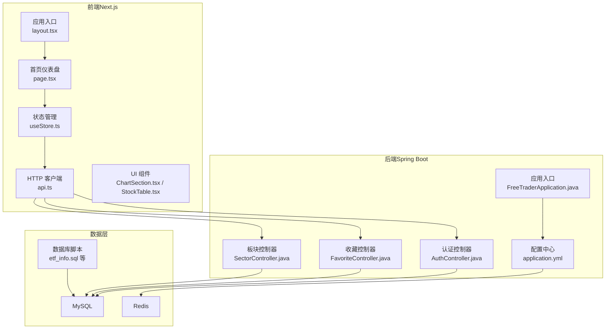
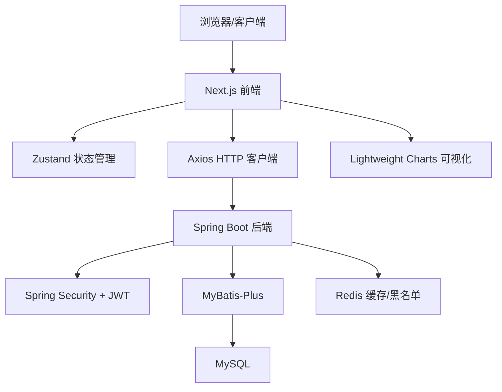
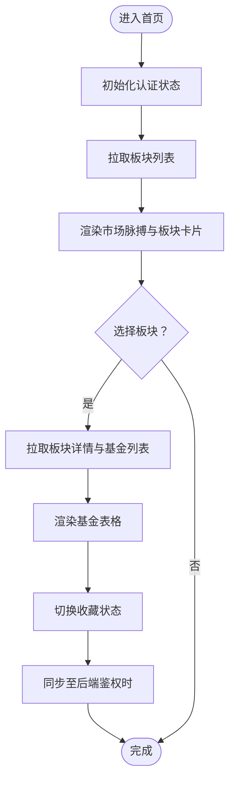
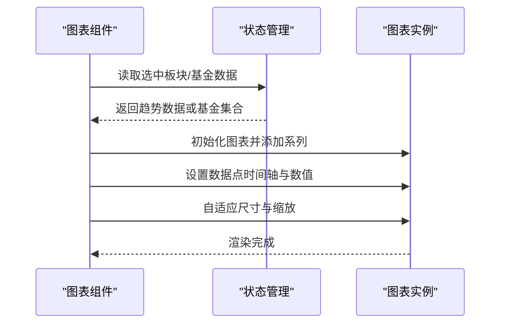
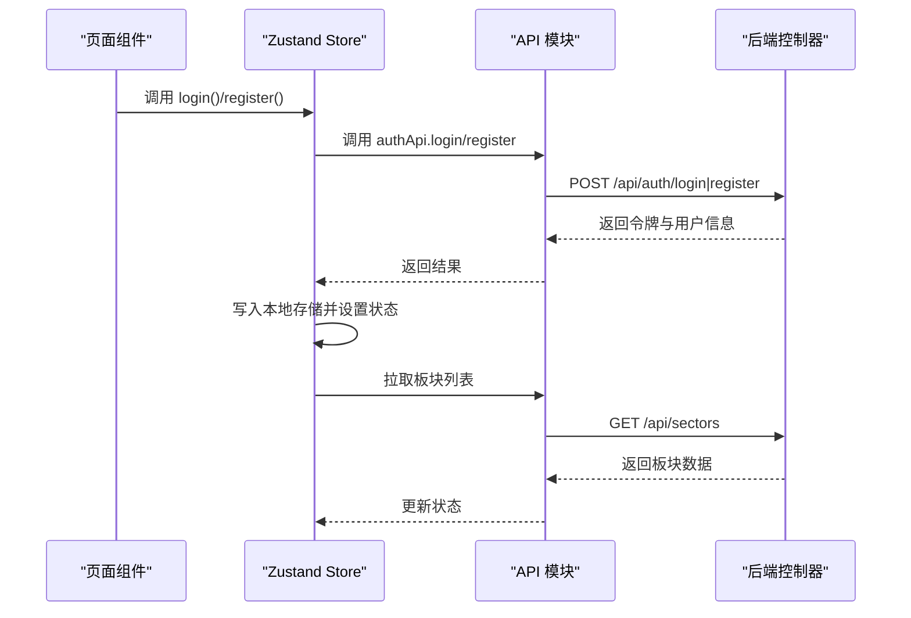
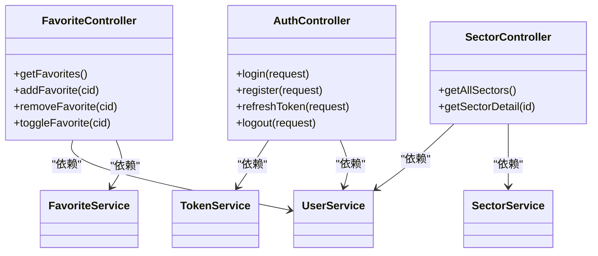
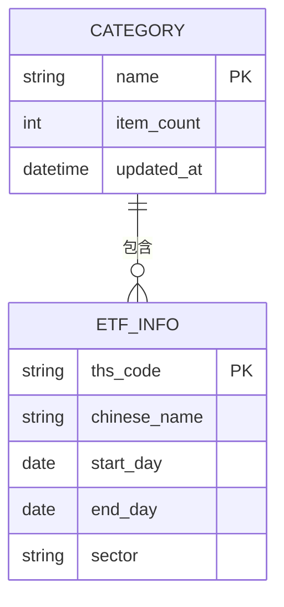
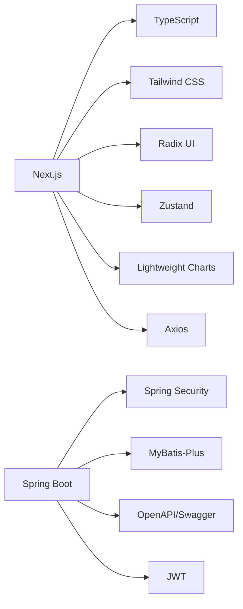

# 项目介绍

<cite>
**本文引用的文件**
- [README.md](file://README.md)
- [application.yml](file://backend/src/main/resources/application.yml)
- [FreeTraderApplication.java](file://backend/src/main/java/com/freetrader/FreTraderApplication.java)
- [AuthController.java](file://backend/src/main/java/com/freetrader/controller/AuthController.java)
- [FavoriteController.java](file://backend/src/main/java/com/freetrader/controller/FavoriteController.java)
- [SectorController.java](file://backend/src/main/java/com/freetrader/controller/SectorController.java)
- [api.ts](file://frontend/src/lib/api.ts)
- [layout.tsx](file://frontend/src/app/layout.tsx)
- [page.tsx](file://frontend/src/app/page.tsx)
- [ChartSection.tsx](file://frontend/src/components/ChartSection.tsx)
- [StockTable.tsx](file://frontend/src/components/StockTable.tsx)
- [useStore.ts](file://frontend/src/store/useStore.ts)
- [package.json](file://frontend/package.json)
- [etf_info.sql](file://sql/etf_info.sql)
</cite>

## 目录
1. [引言](#引言)
2. [项目结构](#项目结构)
3. [核心组件](#核心组件)
4. [架构总览](#架构总览)
5. [详细组件分析](#详细组件分析)
6. [依赖关系分析](#依赖关系分析)
7. [性能考虑](#性能考虑)
8. [故障排除指南](#故障排除指南)
9. [结论](#结论)
10. [附录](#附录)

## 引言
FreeTrader 是一款专注于 ETF 基金追踪与可视化的全栈应用，旨在为个人投资者与财经爱好者提供实时、直观、个性化的市场洞察。项目以 ETF 板块为核心切入点，结合板块概览、净值趋势、收藏管理与交互式图表，构建从宏观到微观的完整观察视角。

### 为什么选择 ETF 基金追踪作为切入点
- ETF 具备流动性强、透明度高、成本较低的特点，适合个人投资者进行广泛分散投资与跟踪。
- 通过板块维度聚合 ETF，能够快速把握市场热点与结构性机会，满足“先观大势”的决策需求。
- 结合净值与趋势数据，为用户提供“宏观板块 + 微观个股”的双重视角，提升投资决策效率。

### 目标用户与使用场景
- 个人投资者：关注市场脉动、筛选潜力板块、管理自选组合。
- 财经爱好者：观察板块轮动、研究市场情绪、对比不同ETF表现。
- 投资初学者：通过可视化图表与简洁界面，降低学习门槛，建立对市场的系统性认知。

### 创新点与竞争优势
- 实时数据可视化：基于轻量级图表库实现净值与板块趋势的动态展示，支持多种时间范围切换。
- 个性化收藏管理：支持用户收藏板块与基金，本地乐观更新与后端同步，兼顾体验与可靠性。
- 宏观与微观联动：板块概览 + 板块详情 + 基金明细 + 图表对比，形成完整的决策闭环。
- 开源与可扩展：前后端分离、清晰的模块划分与开放 API，便于社区贡献与二次开发。

### 开源性质与社区贡献价值
- 采用 MIT 许可证，鼓励社区参与与贡献。
- 提供完善的 API 文档与开发指南，降低协作门槛。
- 数据库初始化脚本与环境配置示例，便于快速搭建与部署。

### 发展历程与未来规划
- 已完成：前后端基础架构、认证与收藏功能、板块与净值数据接口、图表可视化组件。
- 近期计划：完善数据源接入与更新策略、增强搜索与筛选能力、优化移动端体验。
- 长期愿景：构建更丰富的指标体系（如波动率、夏普比率）、引入用户间分享与讨论功能，打造社区化投研平台。

## 项目结构
项目采用前后端分离架构，前端基于 Next.js 16 + TypeScript，后端基于 Spring Boot 3.2.1 + Java 17，配合 MySQL 与 Redis，提供稳定可靠的服务能力。

**图示来源**
- [layout.tsx](file://frontend/src/app/layout.tsx#L16-L35)
- [page.tsx](file://frontend/src/app/page.tsx#L11-L271)
- [useStore.ts](file://frontend/src/store/useStore.ts#L62-L304)
- [api.ts](file://frontend/src/lib/api.ts#L1-L89)
- [FreeTraderApplication.java](file://backend/src/main/java/com/freetrader/FreTraderApplication.java#L1-L15)
- [application.yml](file://backend/src/main/resources/application.yml#L1-L102)
- [AuthController.java](file://backend/src/main/java/com/freetrader/controller/AuthController.java#L1-L72)
- [FavoriteController.java](file://backend/src/main/java/com/freetrader/controller/FavoriteController.java#L1-L90)
- [SectorController.java](file://backend/src/main/java/com/freetrader/controller/SectorController.java#L1-L63)
- [etf_info.sql](file://sql/etf_info.sql#L1-L108)

**章节来源**
- [README.md](file://README.md#L28-L47)
- [package.json](file://frontend/package.json#L1-L44)

## 核心组件
- 前端应用：Next.js 应用，负责用户界面渲染、状态管理与 API 通信。
- 后端服务：Spring Boot 应用，提供认证、收藏与板块数据接口。
- 数据与缓存：MySQL 存储板块与净值数据，Redis 提供缓存与 Token 黑名单。
- 可视化：前端集成轻量级图表库，支持净值与板块趋势的交互式展示。

**章节来源**
- [README.md](file://README.md#L5-L27)
- [application.yml](file://backend/src/main/resources/application.yml#L1-L102)
- [package.json](file://frontend/package.json#L11-L31)

## 架构总览
系统采用前后端分离架构，前端通过 Axios 与后端 API 交互，后端通过 Spring MVC 提供 REST 接口，数据访问层基于 MyBatis-Plus，安全层采用 Spring Security + JWT。

**图示来源**
- [api.ts](file://frontend/src/lib/api.ts#L1-L89)
- [useStore.ts](file://frontend/src/store/useStore.ts#L1-L304)
- [AuthController.java](file://backend/src/main/java/com/freetrader/controller/AuthController.java#L1-L72)
- [application.yml](file://backend/src/main/resources/application.yml#L1-L102)

## 详细组件分析

### 前端应用与页面
- 应用布局：全局头部、权限守卫、通知提示与主题切换。
- 仪表盘页面：展示市场脉搏、自选板块、热门板块与趋势图表。
- 状态管理：集中管理认证状态、选中板块、图表选择与数据加载状态。
- 组件化：图表组件与表格组件独立封装，便于复用与维护。

**图示来源**
- [layout.tsx](file://frontend/src/app/layout.tsx#L16-L35)
- [page.tsx](file://frontend/src/app/page.tsx#L11-L271)
- [useStore.ts](file://frontend/src/store/useStore.ts#L62-L304)
- [StockTable.tsx](file://frontend/src/components/StockTable.tsx#L37-L112)

**章节来源**
- [layout.tsx](file://frontend/src/app/layout.tsx#L1-L36)
- [page.tsx](file://frontend/src/app/page.tsx#L1-L271)
- [useStore.ts](file://frontend/src/store/useStore.ts#L1-L304)
- [StockTable.tsx](file://frontend/src/components/StockTable.tsx#L1-L112)

### 前端图表组件
- 图表初始化：根据容器尺寸创建图表实例，配置网格、十字光标与边框。
- 数据生成：支持按时间范围生成板块整体趋势或多只基金的历史净值序列。
- 交互控制：时间范围切换、图例显示、响应式适配与清理销毁。

**图示来源**
- [ChartSection.tsx](file://frontend/src/components/ChartSection.tsx#L14-L174)

**章节来源**
- [ChartSection.tsx](file://frontend/src/components/ChartSection.tsx#L1-L246)

### 前端状态管理与 API 通信
- 认证流程：登录/注册成功后写入本地存储，初始化用户状态并拉取板块数据。
- 收藏同步：本地乐观更新 + 异步后端同步，失败不回滚，保证用户体验。
- 请求拦截：统一注入 Authorization 头；响应拦截处理 401 并跳转登录。

**图示来源**
- [useStore.ts](file://frontend/src/store/useStore.ts#L69-L103)
- [api.ts](file://frontend/src/lib/api.ts#L40-L50)
- [AuthController.java](file://backend/src/main/java/com/freetrader/controller/AuthController.java#L35-L50)

**章节来源**
- [useStore.ts](file://frontend/src/store/useStore.ts#L1-L304)
- [api.ts](file://frontend/src/lib/api.ts#L1-L89)
- [AuthController.java](file://backend/src/main/java/com/freetrader/controller/AuthController.java#L1-L72)

### 后端控制器与业务边界
- 认证控制器：提供登录、注册、刷新 Token 与登出接口，内置请求限流与安全校验。
- 收藏控制器：基于当前用户上下文管理收藏状态，支持添加、删除与切换。
- 板块控制器：提供板块列表与详情查询，支持带用户上下文的个性化展示。

**图示来源**
- [AuthController.java](file://backend/src/main/java/com/freetrader/controller/AuthController.java#L23-L71)
- [FavoriteController.java](file://backend/src/main/java/com/freetrader/controller/FavoriteController.java#L30-L89)
- [SectorController.java](file://backend/src/main/java/com/freetrader/controller/SectorController.java#L26-L62)

**章节来源**
- [AuthController.java](file://backend/src/main/java/com/freetrader/controller/AuthController.java#L1-L72)
- [FavoriteController.java](file://backend/src/main/java/com/freetrader/controller/FavoriteController.java#L1-L90)
- [SectorController.java](file://backend/src/main/java/com/freetrader/controller/SectorController.java#L1-L63)

### 数据模型与持久化
- 板块与 ETF 关联：通过数据库触发器维护分类计数，确保板块统计准确性。
- 数据库脚本：提供初始化 SQL，包含板块、净值、用户与收藏等表结构。

**图示来源**
- [etf_info.sql](file://sql/etf_info.sql#L24-L33)
- [etf_info.sql](file://sql/etf_info.sql#L40-L54)

**章节来源**
- [etf_info.sql](file://sql/etf_info.sql#L1-L108)

## 依赖关系分析
- 前端依赖：Next.js、React、TypeScript、Tailwind CSS、Radix UI、Zustand、Lightweight Charts、Axios。
- 后端依赖：Spring Boot、Spring Security、MyBatis-Plus、MySQL、Redis、JWT、OpenAPI/Swagger。

**图示来源**
- [package.json](file://frontend/package.json#L11-L31)
- [application.yml](file://backend/src/main/resources/application.yml#L17-L26)

**章节来源**
- [package.json](file://frontend/package.json#L1-L44)
- [application.yml](file://backend/src/main/resources/application.yml#L1-L102)

## 性能考虑
- 前端性能
  - 图表渲染：按需生成数据点，避免一次性渲染过多数据；响应式调整图表尺寸。
  - 状态管理：局部状态隔离，减少不必要的重渲染。
- 后端性能
  - Redis 缓存：配置默认 TTL 与类型，减轻数据库压力。
  - 数据库连接池：合理设置最大连接数与超时时间，平衡吞吐与资源占用。
  - 分页与分段：板块与净值数据建议分页或分段加载，降低单次请求负载。
- 安全与稳定性
  - JWT 过期与刷新：Access Token 短周期、Refresh Token 长周期，降低泄露风险。
  - Token 黑名单：登出后立即失效，提升会话安全性。
  - 统一异常处理：规范化错误响应，便于前端提示与日志追踪。

## 故障排除指南
- 登录/认证问题
  - 确认本地存储中是否存在 token 与用户信息；若 401，前端会自动清除并跳转登录。
  - 检查后端 JWT 密钥配置与环境变量是否正确。
- 数据加载失败
  - 前端在请求失败时会保留本地数据作为回退；检查网络代理与后端端口连通性。
  - 后端查看日志级别与路径配置，确认 SQL 日志输出与文件落盘权限。
- 图表空白
  - 确认选中板块或基金数据是否为空；检查时间范围与数据点数量。
- 收藏同步异常
  - 本地乐观更新不会因后端失败而回滚；可在重新登录后再次尝试同步。

**章节来源**
- [api.ts](file://frontend/src/lib/api.ts#L25-L37)
- [useStore.ts](file://frontend/src/store/useStore.ts#L293-L302)
- [application.yml](file://backend/src/main/resources/application.yml#L77-L91)
- [AuthController.java](file://backend/src/main/java/com/freetrader/controller/AuthController.java#L34-L35)

## 结论
FreeTrader 以 ETF 板块为核心，结合实时可视化与个性化收藏，为用户提供从宏观到微观的投资观察工具。项目采用现代化技术栈与清晰的模块划分，具备良好的可扩展性与社区协作空间。未来将持续完善数据接入、指标体系与交互体验，致力于成为个人投资者与财经爱好者的首选工具。

## 附录
- 快速开始与环境要求：参考项目根目录 README 的安装与启动说明。
- API 文档：启动后端服务后，通过 Swagger UI 或 OpenAPI JSON 查看接口定义。
- 许可证：MIT 许可证，欢迎社区贡献与二次开发。

**章节来源**
- [README.md](file://README.md#L65-L117)
- [README.md](file://README.md#L59-L64)
- [README.md](file://README.md#L144-L147)