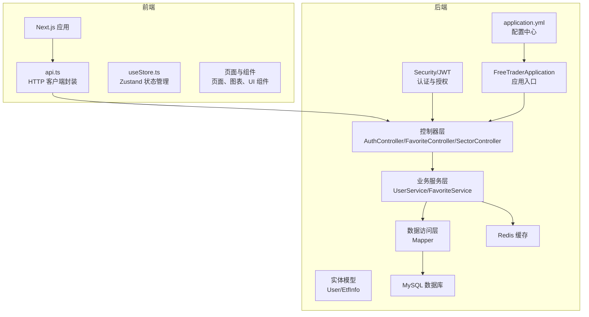
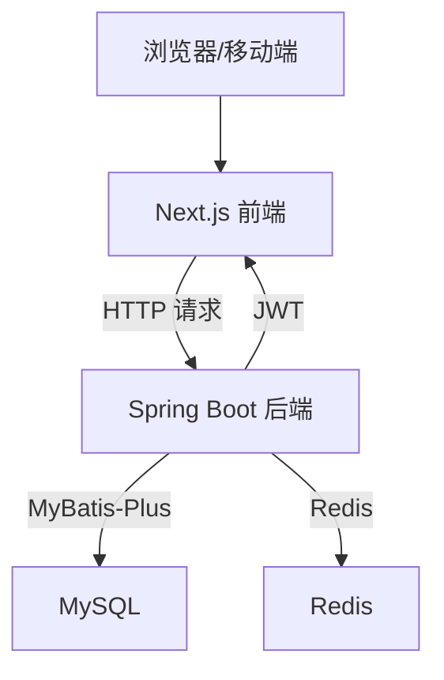
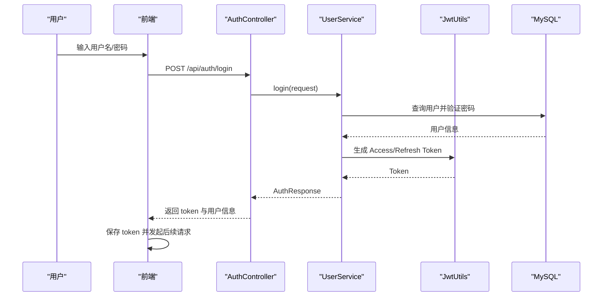
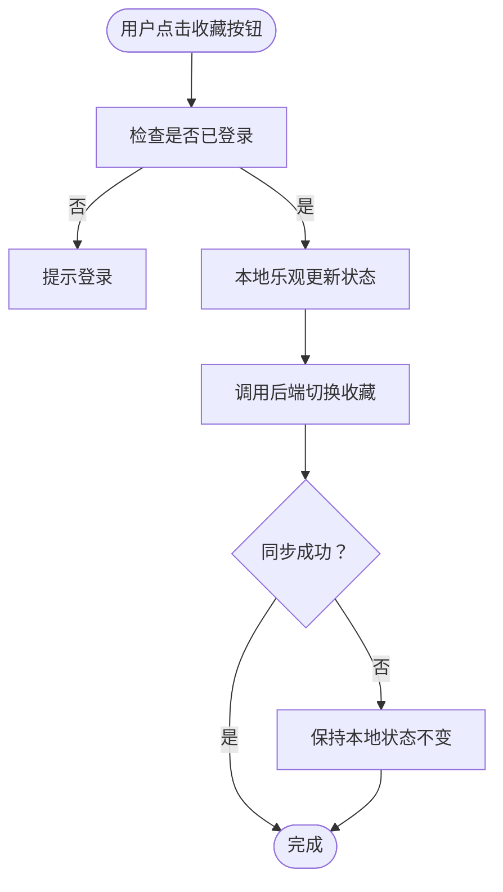
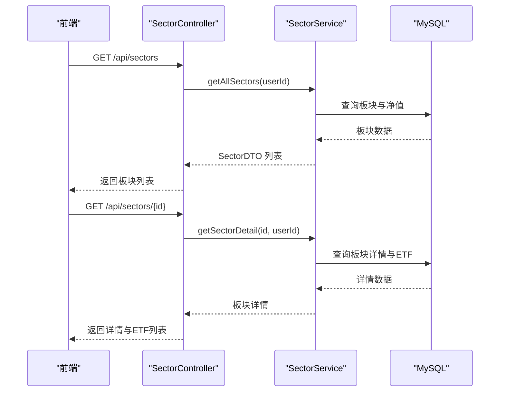
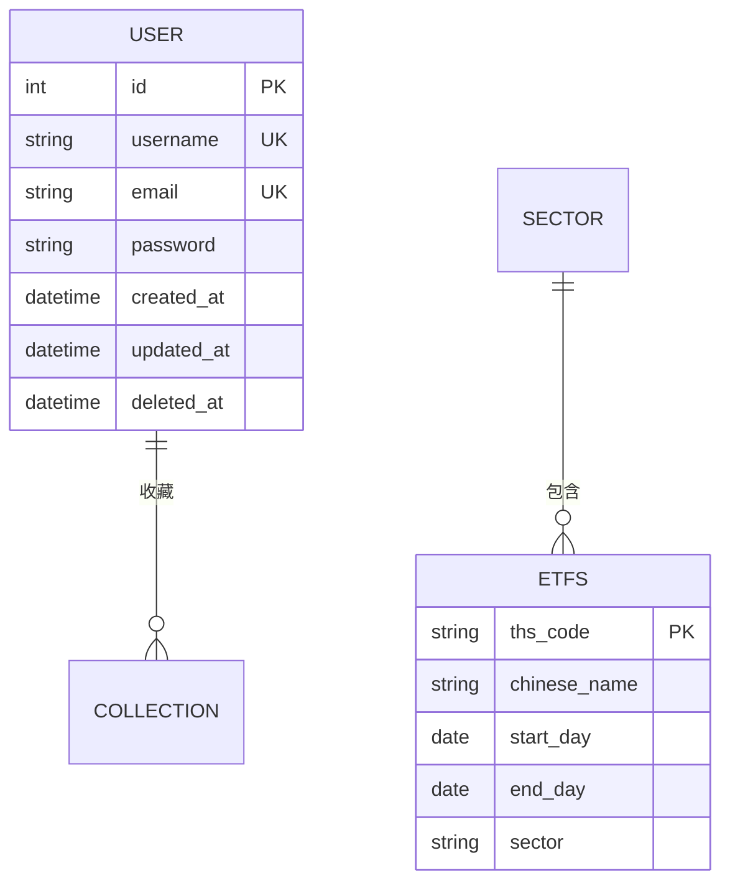
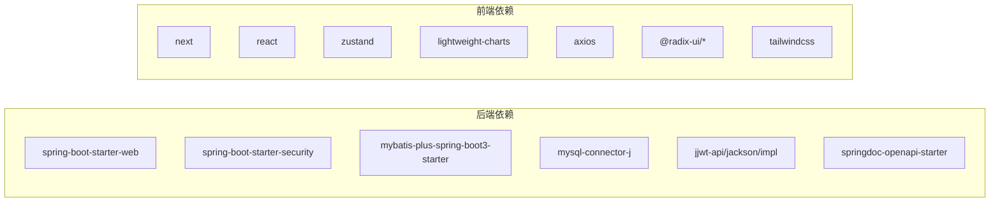

# 项目概述

<cite>
**本文档引用的文件**
- [README.md](file://README.md)
- [FreeTraderApplication.java](file://backend/src/main/java/com/freetrader/FreeTraderApplication.java)
- [AuthController.java](file://backend/src/main/java/com/freetrader/controller/AuthController.java)
- [FavoriteController.java](file://backend/src/main/java/com/freetrader/controller/FavoriteController.java)
- [SectorController.java](file://backend/src/main/java/com/freetrader/controller/SectorController.java)
- [UserService.java](file://backend/src/main/java/com/freetrader/service/UserService.java)
- [FavoriteService.java](file://backend/src/main/java/com/freetrader/service/FavoriteService.java)
- [User.java](file://backend/src/main/java/com/freetrader/entity/User.java)
- [EtfInfo.java](file://backend/src/main/java/com/freetrader/entity/EtfInfo.java)
- [application.yml](file://backend/src/main/resources/application.yml)
- [pom.xml](file://backend/pom.xml)
- [package.json](file://frontend/package.json)
- [api.ts](file://frontend/src/lib/api.ts)
- [useStore.ts](file://frontend/src/store/useStore.ts)
</cite>

## 目录
1. [引言](#引言)
2. [项目结构](#项目结构)
3. [核心组件](#核心组件)
4. [架构总览](#架构总览)
5. [详细组件分析](#详细组件分析)
6. [依赖关系分析](#依赖关系分析)
7. [性能考虑](#性能考虑)
8. [故障排除指南](#故障排除指南)
9. [结论](#结论)
10. [附录](#附录)

## 引言
FreeTrader 是一个专注于 ETF 信息查询与可视化的基金追踪应用。其核心目标是为用户提供：
- ETF 板块与净值数据的查询与浏览
- 用户注册、登录与基于 JWT 的认证体系
- 用户收藏管理（收藏/取消收藏 ETF 板块）
- 数据可视化（净值趋势图表）

项目采用前后端分离架构：后端基于 Spring Boot 提供 REST API，前端基于 Next.js 构建用户界面。通过统一的 API 接口，前后端解耦协作，提升开发效率与可维护性。

## 项目结构
项目采用典型的前后端分离布局：
- backend：Spring Boot 后端，包含配置、控制器、服务、数据访问层、安全与异常处理等模块
- frontend：Next.js 前端，包含页面、组件、状态管理、API 封装与类型定义
- sql：数据库初始化脚本，包含用户、板块、净值等基础数据

**图示来源**
- [FreeTraderApplication.java](file://backend/src/main/java/com/freetrader/FreeTraderApplication.java#L1-L15)
- [application.yml](file://backend/src/main/resources/application.yml#L1-L102)
- [AuthController.java](file://backend/src/main/java/com/freetrader/controller/AuthController.java#L1-L72)
- [FavoriteController.java](file://backend/src/main/java/com/freetrader/controller/FavoriteController.java#L1-L90)
- [SectorController.java](file://backend/src/main/java/com/freetrader/controller/SectorController.java#L1-L63)
- [UserService.java](file://backend/src/main/java/com/freetrader/service/UserService.java#L1-L103)
- [FavoriteService.java](file://backend/src/main/java/com/freetrader/service/FavoriteService.java#L1-L119)
- [User.java](file://backend/src/main/java/com/freetrader/entity/User.java#L1-L29)
- [EtfInfo.java](file://backend/src/main/java/com/freetrader/entity/EtfInfo.java#L1-L24)
- [api.ts](file://frontend/src/lib/api.ts#L1-L89)
- [useStore.ts](file://frontend/src/store/useStore.ts#L1-L304)

**章节来源**
- [README.md](file://README.md#L28-L47)
- [package.json](file://frontend/package.json#L1-L44)
- [pom.xml](file://backend/pom.xml#L1-L143)

## 核心组件
- 后端核心组件
  - 应用入口：Spring Boot 启动类，扫描 Mapper 包
  - 控制器：提供认证、收藏、板块查询等 REST 接口
  - 服务层：封装业务逻辑，如用户认证、收藏管理、板块数据聚合
  - 数据访问层：MyBatis-Plus Mapper，负责数据库 CRUD
  - 实体模型：User、EtfInfo 等领域模型
  - 配置中心：application.yml，集中管理数据库、Redis、JWT、日志等配置
- 前端核心组件
  - API 封装：基于 Axios 的请求拦截器与响应拦截器，统一处理鉴权与错误
  - 状态管理：Zustand 管理用户、板块、图表选择等状态
  - 页面与组件：Next.js 页面、Radix UI 组件、Lightweight Charts 图表

**章节来源**
- [FreeTraderApplication.java](file://backend/src/main/java/com/freetrader/FreeTraderApplication.java#L1-L15)
- [AuthController.java](file://backend/src/main/java/com/freetrader/controller/AuthController.java#L1-L72)
- [FavoriteController.java](file://backend/src/main/java/com/freetrader/controller/FavoriteController.java#L1-L90)
- [SectorController.java](file://backend/src/main/java/com/freetrader/controller/SectorController.java#L1-L63)
- [UserService.java](file://backend/src/main/java/com/freetrader/service/UserService.java#L1-L103)
- [FavoriteService.java](file://backend/src/main/java/com/freetrader/service/FavoriteService.java#L1-L119)
- [User.java](file://backend/src/main/java/com/freetrader/entity/User.java#L1-L29)
- [EtfInfo.java](file://backend/src/main/java/com/freetrader/entity/EtfInfo.java#L1-L24)
- [application.yml](file://backend/src/main/resources/application.yml#L1-L102)
- [api.ts](file://frontend/src/lib/api.ts#L1-L89)
- [useStore.ts](file://frontend/src/store/useStore.ts#L1-L304)

## 架构总览
前后端分离架构设计强调职责清晰与扩展性：
- 后端：REST API 提供统一数据与业务能力，支持 JWT 认证、Redis 缓存、统一异常处理与 OpenAPI 文档
- 前端：Next.js 提供页面路由与组件化 UI，Axios 负责 API 通信，Zustand 管理全局状态，Lightweight Charts 展示净值趋势

**图示来源**
- [api.ts](file://frontend/src/lib/api.ts#L1-L89)
- [application.yml](file://backend/src/main/resources/application.yml#L8-L44)
- [pom.xml](file://backend/pom.xml#L43-L124)

## 详细组件分析

### 认证与用户管理
- 功能要点
  - 用户注册与登录：校验用户名/邮箱唯一性，BCrypt 加密存储密码，返回 Access/Refresh Token
  - Token 刷新与登出：支持刷新 Access Token；登出时将 Token 加入黑名单
  - 安全过滤：JWT 过滤器在请求进入业务前进行鉴权
- 前端交互
  - 登录/注册成功后持久化 token 与用户信息，后续请求自动附加 Authorization 头
  - 401 时自动清理本地状态并跳转至登录页

**图示来源**
- [AuthController.java](file://backend/src/main/java/com/freetrader/controller/AuthController.java#L28-L39)
- [UserService.java](file://backend/src/main/java/com/freetrader/service/UserService.java#L73-L96)
- [api.ts](file://frontend/src/lib/api.ts#L40-L50)
- [useStore.ts](file://frontend/src/store/useStore.ts#L69-L103)

**章节来源**
- [AuthController.java](file://backend/src/main/java/com/freetrader/controller/AuthController.java#L1-L72)
- [UserService.java](file://backend/src/main/java/com/freetrader/service/UserService.java#L1-L103)
- [api.ts](file://frontend/src/lib/api.ts#L1-L89)
- [useStore.ts](file://frontend/src/store/useStore.ts#L1-L304)

### 收藏管理
- 功能要点
  - 获取收藏列表：根据当前用户 ID 查询其收藏的板块集合
  - 添加/移除收藏：幂等操作，避免重复收藏或不存在时报错
  - 切换收藏：一次调用完成“收藏/取消收藏”的状态翻转
  - 乐观更新：前端先更新本地状态，再异步同步后端，保证交互流畅
- 限制与提示
  - 单用户最多收藏 10 个板块，超出时给出提示

**图示来源**
- [FavoriteController.java](file://backend/src/main/java/com/freetrader/controller/FavoriteController.java#L80-L88)
- [FavoriteService.java](file://backend/src/main/java/com/freetrader/service/FavoriteService.java#L87-L117)
- [useStore.ts](file://frontend/src/store/useStore.ts#L261-L302)

**章节来源**
- [FavoriteController.java](file://backend/src/main/java/com/freetrader/controller/FavoriteController.java#L1-L90)
- [FavoriteService.java](file://backend/src/main/java/com/freetrader/service/FavoriteService.java#L1-L119)
- [useStore.ts](file://frontend/src/store/useStore.ts#L261-L302)

### 板块与净值查询
- 功能要点
  - 获取所有板块：返回板块列表，包含平均涨跌幅、市场总值、趋势等信息
  - 获取板块详情：返回板块内表现最佳的 ETF 列表，并标注是否已收藏
  - 前端图表：支持从板块详情中选择最多 5 只 ETF，绘制净值趋势图
- 数据来源
  - 板块与净值数据来自数据库，前端通过 API 获取并渲染

**图示来源**
- [SectorController.java](file://backend/src/main/java/com/freetrader/controller/SectorController.java#L41-L61)
- [useStore.ts](file://frontend/src/store/useStore.ts#L171-L253)

**章节来源**
- [SectorController.java](file://backend/src/main/java/com/freetrader/controller/SectorController.java#L1-L63)
- [useStore.ts](file://frontend/src/store/useStore.ts#L171-L253)

### 数据模型与持久层
- 实体模型
  - User：用户基本信息与时间戳
  - EtfInfo：ETF 基本信息（代码、名称、起止日期、所属板块）
- 数据访问
  - 使用 MyBatis-Plus Mapper 进行 CRUD 操作，结合逻辑删除字段 deletedAt

**图示来源**
- [User.java](file://backend/src/main/java/com/freetrader/entity/User.java#L1-L29)
- [EtfInfo.java](file://backend/src/main/java/com/freetrader/entity/EtfInfo.java#L1-L24)

**章节来源**
- [User.java](file://backend/src/main/java/com/freetrader/entity/User.java#L1-L29)
- [EtfInfo.java](file://backend/src/main/java/com/freetrader/entity/EtfInfo.java#L1-L24)

## 依赖关系分析
- 后端依赖
  - Spring Boot Web/Security/Validation/Redis
  - MyBatis-Plus 与 MySQL 驱动
  - jjwt 用于 JWT
  - SpringDoc OpenAPI 生成 API 文档
- 前端依赖
  - Next.js 16、React 19、TypeScript
  - Radix UI、Tailwind CSS、Zustand、Lightweight Charts、Axios

**图示来源**
- [pom.xml](file://backend/pom.xml#L43-L124)
- [package.json](file://frontend/package.json#L11-L31)

**章节来源**
- [pom.xml](file://backend/pom.xml#L1-L143)
- [package.json](file://frontend/package.json#L1-L44)

## 性能考虑
- 缓存策略
  - Redis 作为缓存与 Token 黑名单存储，提升读取性能与安全性
  - 默认缓存 TTL 为 5 分钟，可根据业务调整
- 数据库优化
  - MyBatis-Plus 配置驼峰映射与逻辑删除，减少空值与冗余数据
  - HikariCP 连接池参数可按并发场景调优
- 前端性能
  - Zustand 精简状态管理，避免不必要的重渲染
  - 图表组件按需加载，限制单次选择数量（最多 5 只 ETF）

**章节来源**
- [application.yml](file://backend/src/main/resources/application.yml#L24-L44)
- [pom.xml](file://backend/pom.xml#L66-L78)

## 故障排除指南
- 常见问题
  - 登录失败：检查用户名/密码是否正确，确认数据库中用户是否存在
  - 401 未授权：确认本地 token 是否有效，必要时重新登录
  - 收藏失败：确认是否超过收藏上限（10 个），或是否已收藏
  - API 文档不可访问：确认后端已启动并开放 Swagger 端点
- 排查步骤
  - 后端：查看日志级别与输出，定位异常堆栈
  - 前端：检查网络面板与控制台错误，确认请求头 Authorization 是否正确

**章节来源**
- [README.md](file://README.md#L59-L64)
- [api.ts](file://frontend/src/lib/api.ts#L25-L37)
- [useStore.ts](file://frontend/src/store/useStore.ts#L269-L276)

## 结论
FreeTrader 通过前后端分离架构实现了清晰的职责划分与良好的扩展性。后端提供稳定可靠的 REST API 与完善的认证、缓存与异常处理机制；前端以 Next.js 为基础，配合状态管理与图表组件，提供了流畅的用户体验。项目具备完善的开发与部署指引，适合初学者快速上手，也为有经验的开发者提供了深入定制的空间。

## 附录
- 许可证：MIT
- 贡献指南：欢迎提交 Issue 与 Pull Request，遵循项目现有代码风格与测试规范

**章节来源**
- [README.md](file://README.md#L144-L147)