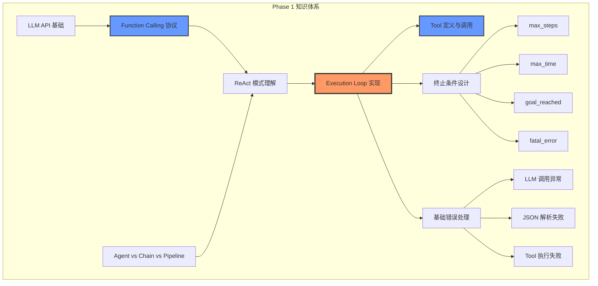
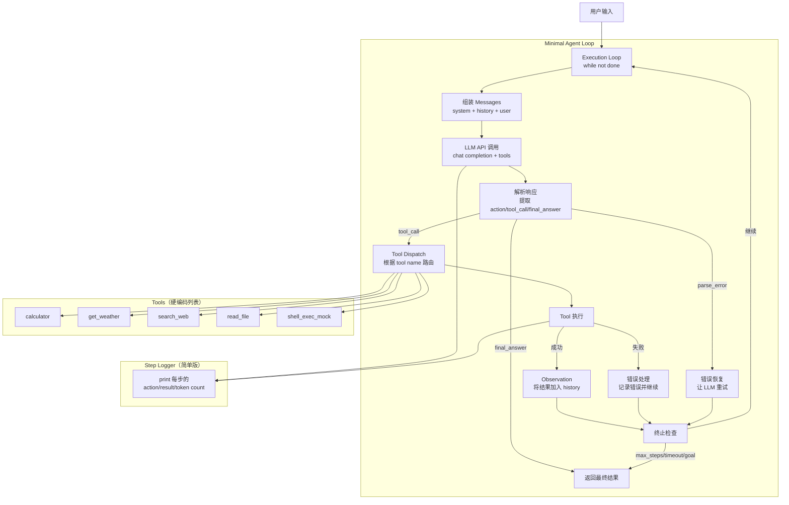

# Phase 1：Agent Harness Engineering — 入门

> **阶段**: 1 / 4 | **周期**: 3 周（每周 15~20 小时）| **定位**: 从零建立 Agent 执行循环的工程直觉  
> **前置要求**: Python 3.10+、HTTP/REST 基础、LLM API 基本概念  
> **核心关键词**: Execution Loop · Function Calling · ReAct · Tool Calling 协议 · Agent 控制流

---

## 1. 阶段定位

### 在学习路径中的位置

```
 ★ Phase 1: 入门          Phase 2: 进阶          Phase 3: 提升          Phase 4: 架构实战
   (Week 1-3)             (Week 4-6)             (Week 7-9)            (Week 10-12)

 ┌──────────────┐       ┌──────────────┐       ┌──────────────┐      ┌──────────────┐
 │ ★ 理解Agent  │       │ 构建完整的   │       │ 可靠性 +     │      │ 生产级Agent  │
 │   基本循环   │──────→│ Tool + Memory│──────→│ 可观测 +     │─────→│ 架构设计与   │
 │   与控制流   │       │ + Planning   │       │ 评估体系     │      │ 多Agent编排  │
 └──────────────┘       └──────────────┘       └──────────────┘      └──────────────┘
        │
    你在这里
```

### 核心目标与能力边界

**Phase 1 的核心目标**：建立对 Agent Harness 的工程直觉——你要亲手从零实现一个最小可运行的 agent execution loop，理解"Agent 为什么需要 harness"以及"harness 到底在控制什么"。

**能力边界**：
- ✅ 能做到：手写 ReAct 循环、使用 function calling API、实现基本终止条件（max_steps / timeout）、实现 3~5 个简单 tool
- ❌ 不涉及：tool 动态注册/路由、分层 memory、eval harness、sandbox、multi-agent（这些留给后续阶段）

### 与下一阶段的衔接

Phase 1 产出的 **Minimal Agent Loop** 是 Phase 2 的起点。在 Phase 2 中你将：
- 在这个 loop 上接入 **tool registry / routing** 替代硬编码的 tool 列表
- 加入 **memory 模块** 替代纯 conversation history
- 加入 **planning 模块** 让 agent 具备任务分解能力

因此，Phase 1 的代码必须保持**结构清晰、模块可拆分**，不能把所有逻辑写在一个文件里。

---

## 2. 阶段学习目标

### 知识目标

| # | 目标 | 验证方式 |
|---|------|---------|
| K1 | 理解 Agent 与 Chain/Pipeline 的本质区别 | 能用自己的话解释，画出对比图 |
| K2 | 理解 ReAct（Reasoning + Acting）循环模式 | 能手绘 think → act → observe 闭环 |
| K3 | 掌握 LLM Function Calling 协议（OpenAI / Anthropic） | 能脱离框架直接调用 API 完成 tool use |
| K4 | 理解 Execution Loop 的状态机模型 | 能画出完整状态转移图 |
| K5 | 理解 Agent Harness 各组件的职责分工 | 能画出 harness 组件关系图 |
| K6 | 理解 Agent 从 demo → production 的鸿沟 | 能列出至少 8 个生产化问题 |

### 工程目标

| # | 目标 | 验证方式 |
|---|------|---------|
| E1 | 能使用 Python 封装 LLM API 调用（chat completion + function calling + streaming） | 代码可运行 |
| E2 | 能手写 while-loop 驱动的 execution loop（含状态管理） | 代码可运行且能正确终止 |
| E3 | 能实现基本终止条件：max_steps、max_time、goal_reached | 分别触发并验证 |
| E4 | 能实现 LLM 输出解析（提取 tool name + args，处理 parse error） | 覆盖正常和异常 case |
| E5 | 能实现 3~5 个简单 tool 并与 loop 集成 | end-to-end 跑通 |

### 项目目标

| # | 目标 |
|---|------|
| P1 | 完成 **Minimal Agent Loop** 项目，agent 能自主完成至少 3 个 demo 任务 |
| P2 | 产出 execution loop 状态图（Mermaid） |
| P3 | 产出 harness 组件关系图（Mermaid） |

---

## 3. 核心知识体系

### 模块 A：LLM API 基础（Function Calling）

**为什么重要**：LLM API 是 agent 的"引擎接口"。不掌握 function calling 协议，你就无法让 LLM 决定"调用哪个 tool、传什么参数"——这是 agent 区别于普通 chatbot 的关键能力。

**需掌握的深度**：
- **必须掌握**：Chat Completion API 调用、function/tool 定义（JSON Schema）、function calling 请求与响应格式、parallel tool calls、streaming
- **了解即可**：token 计费细节、各模型 function calling 的兼容性差异

**推荐学习顺序**：

1. 用 `requests` 直接调用 OpenAI Chat Completion API（不用 SDK）
2. 学习 function calling 的请求格式（tools 参数 + tool_choice）
3. 解析 function calling 响应（tool_calls 字段）
4. 处理 parallel tool calls（一次返回多个 tool call）
5. 用 Anthropic API 做同样的事（tool_use block），对比差异
6. 实现 streaming 输出

**常见误区**：
- ❌ **只用 SDK 高级封装，不理解底层协议** → 出问题时无法调试。务必先用 raw HTTP 调一遍
- ❌ **以为 function calling 就是"让 LLM 调函数"** → 实际上 LLM 只是生成 JSON，由你的代码负责执行
- ❌ **忽略 parse error** → LLM 有时会生成不合法的 JSON，必须有兜底处理

**与 Agent Harness 的关系**：Function calling 是 execution loop 中 **LLM → 决策 → 行动** 链条的核心协议。Harness 负责把 tool schema 注册给 LLM、解析 LLM 的 tool call 决策、路由到正确的 tool 实现。

---

### 模块 B：ReAct 模式与 Agent 循环

**为什么重要**：ReAct（Reasoning + Acting）是当前最主流的 agent 执行范式。理解 ReAct 的 **think → act → observe → repeat** 循环，就理解了 agent 的核心控制流。

**需掌握的深度**：
- **必须掌握**：ReAct 的完整循环（Thought → Action → Observation → 回到 Thought）、每个阶段的输入输出、循环终止的判断逻辑
- **了解即可**：ReAct 论文中的理论分析、与 CoT（Chain-of-Thought）的对比实验

**推荐学习顺序**：
1. 阅读 Anthropic "Building effective agents" 文章，理解 workflows vs agents
2. 阅读 ReAct 论文的 Section 1-3（重点看图和 prompt 示例）
3. 手动模拟一次 ReAct 循环（用纸笔走一遍 think/act/observe）
4. 用 Python 实现最简版 ReAct loop（while + if/else）

**常见误区**：
- ❌ **以为 agent 就是多跑几轮 prompt** → Agent 的核心是"自主决策循环"——LLM 在每一步决定下一步做什么
- ❌ **将 ReAct 与 function calling 混淆** → ReAct 是控制流模式，function calling 是 tool 调用协议，两者正交
- ❌ **不理解 observe 的重要性** → observe（tool 执行结果反馈给 LLM）是闭环的关键，没有它就不是 agent

**与 Agent Harness 的关系**：ReAct 循环就是 execution loop 的逻辑骨架。Harness 在此基础上加入 **终止条件、错误处理、step tracing、guardrail hook** 等控制机制。

---

### 模块 C：Execution Loop 实现模式

**为什么重要**：Execution loop 是 harness 的"心脏"。Phase 1 用 while-loop 实现足够，但你必须理解它最终会演化为状态机或事件驱动架构（Phase 2-4）。

**需掌握的深度**：
- **必须掌握**：while-loop 实现、状态管理（当前 step、conversation history、终止标志）、终止条件（max_steps / max_time / goal_reached / fatal_error）、基本错误处理（LLM 调用失败、parse error、tool 执行失败）
- **了解即可**：状态机模式（FSM）、event-driven 模式（Phase 2 深入）

**推荐学习顺序**：
1. 先写最简版：`while not done: response = llm(messages); done = process(response)`
2. 加入 step 计数器 + max_steps 限制
3. 加入 timeout（总耗时限制）
4. 加入错误处理：LLM 调用异常 → retry；parse 失败 → 让 LLM 重试；tool 失败 → 记录并继续
5. 加入 step 日志打印（为 Phase 3 的 trace 做铺垫）
6. 阅读 OpenAI Agents SDK 的 agent_loop.py，对比自己的实现

**常见误区**：
- ❌ **把所有逻辑塞进一个 while 循环** → 即使是 Phase 1，也要拆分为 `llm_call()` / `parse_response()` / `execute_tool()` / `check_termination()` 等函数
- ❌ **没有终止条件** → 无限循环是最常见的 agent bug，Phase 1 就要养成习惯
- ❌ **try/except Exception 吞掉所有错误** → 区分可重试错误（网络超时）和不可重试错误（invalid API key）

**与 Agent Harness 的关系**：Execution loop 本身就是 harness 的核心。Phase 1 的 while-loop 是最原始的 harness；后续阶段会在此基础上叠加 tool orchestration、memory、reliability、observability 等层。

---

### 模块 D：Tool 定义与基础调用

**为什么重要**：Tool 是 agent "做事"的手段。Phase 1 不需要复杂的 tool 系统，但必须理解 tool 的定义、schema 验证、执行和结果返回的完整流程。

**需掌握的深度**：
- **必须掌握**：用 JSON Schema 定义 tool 输入、实现 tool 函数、将 tool schema 传给 LLM、解析 tool call 结果并执行、将执行结果回传给 LLM
- **了解即可**：tool routing 策略、MCP 协议（Phase 2 深入）

**推荐学习顺序**：
1. 定义 3 个简单 tool：`calculator`（数学计算）、`get_weather`（mock）、`search_web`（mock 或接真实 API）
2. 用 JSON Schema 写清楚每个 tool 的参数定义
3. 实现 tool dispatch：根据 LLM 返回的 tool name 路由到对应函数
4. 处理 tool 执行结果（成功 → 返回结果；失败 → 返回错误信息）
5. 加入 2 个稍复杂的 tool：`read_file`（读取本地文件）、`run_command`（mock，不真正执行）

**常见误区**：
- ❌ **Tool schema 写得过于模糊** → LLM 依赖 tool description 来决策，描述必须精确
- ❌ **不做参数校验** → LLM 生成的参数可能不符合 schema，执行前必须校验
- ❌ **直接执行 `run_command` 类 tool** → Phase 1 用 mock，真正执行需要 sandbox（Phase 3）

**与 Agent Harness 的关系**：Tool 是 harness 管理的"执行器"。Phase 1 用硬编码的 tool 列表；Phase 2 会升级为 tool registry + routing + MCP。

---

### 模块 E：Agent vs Chain vs Pipeline

**为什么重要**：很多人分不清 Agent、Chain、Pipeline 的区别，导致过度使用或误用 agent 模式。理解边界才能正确设计。

**需掌握的深度**：
- **必须掌握**：三者的核心差异（确定性 vs 非确定性决策、固定路径 vs 动态路径）
- **了解即可**：各种模式的性能/成本/可靠性 trade-off

**对比表**：

| 维度 | Pipeline | Chain | Agent |
|------|----------|-------|-------|
| 决策者 | 代码（人类预设） | 部分 LLM | **LLM 主导** |
| 路径确定性 | 完全确定 | 大部分确定 | **不确定** |
| 循环 | 无 | 可能有 | **必有（core loop）** |
| 典型场景 | ETL、数据处理 | RAG、翻译链 | **开放域问题解决** |
| Harness 需求 | 低 | 中 | **高** |

**推荐学习顺序**：
1. 实现一个简单 Pipeline（3 步固定流程）
2. 实现一个简单 Chain（LLM 调用 → 后处理 → LLM 调用）
3. 实现一个 Agent（ReAct loop，LLM 决定每一步）
4. 对比三者的代码结构差异

**与 Agent Harness 的关系**：Harness 主要为 Agent 服务——正因为 agent 的行为是非确定性的，才需要 harness 来"管住它"。

---

## 4. 阶段架构图

### 架构图 1：Phase 1 核心知识架构



### 架构图 2：Minimal Agent Loop 系统架构



---

## 5. 分周学习计划

### Week 1：Agent 基础 + LLM Function Calling

| 维度       | 内容                                                                                                                                                                                                                                                                                                                                                                                                                                                                                   |
| -------- | ------------------------------------------------------------------------------------------------------------------------------------------------------------------------------------------------------------------------------------------------------------------------------------------------------------------------------------------------------------------------------------------------------------------------------------------------------------------------------------ |
| **学习主题** | Agent 概念 + LLM API + Function Calling 协议                                                                                                                                                                                                                                                                                                                                                                                                                                             |
| **输入材料** | ① Anthropic ["Building effective agents"](https://www.anthropic.com/engineering/building-effective-agents)（精读）<br>② OpenAI [Function Calling 文档](https://platform.openai.com/docs/guides/function-calling)（精读）<br>③ Anthropic [Tool Use 文档](https://docs.anthropic.com/en/docs/build-with-claude/tool-use/overview)（精读）<br>④ ReAct 论文 Section 1-3（泛读）<br>⑤ BAIR ["The Shift from Models to Compound AI Systems"](https://bair.berkeley.edu/blog/2024/02/18/compound-ai-systems/)（泛读） |
| **实践任务** | ① 用 `requests` 直接调用 OpenAI Chat Completion（不用 SDK），实现一轮对话<br>② 用 function calling 让 LLM 调用一个 `calculator` tool，完成一次 tool use 流程<br>③ 实现 3 个 function calling demo：单 tool call、parallel tool calls、处理 LLM 不调用 tool 的情况<br>④ 用 Anthropic API 的 tool_use 重做上述 demo（至少 1 个），对比两种协议差异                                                                                                                                                                                                     |
| **检查点**  | □ 能不看文档写出 function calling 的请求/响应格式<br>□ 能解释 tool_choice: "auto" / "required" / "none" 的区别<br>□ 能处理 parallel tool calls 的响应解析                                                                                                                                                                                                                                                                                                                                                        |
| **预期产出** | ✅ `llm_client.py`：封装 LLM API 调用（支持 function calling）<br>✅ 3 个 function calling demo 脚本<br>✅ 笔记：Agent vs Chain vs Pipeline 区别（含自己画的图）                                                                                                                                                                                                                                                                                                                                                 |

---

### Week 2：手写 Execution Loop + Tool 集成

| 维度 | 内容 |
|------|------|
| **学习主题** | 从零实现 ReAct Execution Loop + 5 个 Tool + 终止条件 |
| **输入材料** | ① OpenAI Agents SDK 源码精读：`agent_loop.py` + `tool.py`（~2h）<br>② Pydantic AI 源码泛读：`agent.py` main loop（~1h）<br>③ 自己 Week 1 的 `llm_client.py` |
| **实践任务** | ① 实现 `agent_loop.py`：while 循环 + 状态管理（step_count, messages, done_flag）<br>② 实现 `parser.py`：从 LLM 响应中提取 tool_call / final_answer / error<br>③ 实现 `tools.py`：5 个 tool（calculator、get_weather_mock、search_web_mock、read_file、shell_exec_mock）<br>④ 实现终止条件：max_steps=20、max_time=300s、goal_reached（LLM 返回 final answer）<br>⑤ 实现基本错误处理：LLM 超时重试（最多 2 次）、parse 失败（让 LLM 重新生成）、tool 失败（记录错误继续）<br>⑥ 跑通 3 个 demo 任务：数学问题、天气查询、文件内容分析 |
| **检查点** | □ Agent 能在 max_steps 内完成任务<br>□ 触发 max_steps 后能优雅终止<br>□ 触发 max_time 后能优雅终止<br>□ LLM 返回不合法 JSON 时不会崩溃<br>□ Tool 执行失败时 agent 能继续运行 |
| **预期产出** | ✅ **Project 1 核心完成**：可运行的 Minimal Agent Loop<br>✅ 完整可跑的 demo：3 个任务 end-to-end 通过<br>✅ Execution loop 状态图（Mermaid） |

---

### Week 3：代码优化 + 源码精读 + 总结

| 维度       | 内容                                                                                                                                                                                                                                                                                                                                           |
| -------- | -------------------------------------------------------------------------------------------------------------------------------------------------------------------------------------------------------------------------------------------------------------------------------------------------------------------------------------------- |
| **学习主题** | 代码结构优化 + 源码对比学习 + 产出知识文档                                                                                                                                                                                                                                                                                                                     |
| **输入材料** | ① OpenAI Agents SDK 完整源码精读：guardrail.py + handoff.py + tracing/（~3h）<br>② Pydantic AI 源码精读：tools.py + result.py（~2h）<br>③ O'Reilly ["What is Context Engineering?"](https://www.oreilly.com/radar/what-is-context-engineering/)                                                                                                              |
| **实践任务** | ① 重构 Project 1 代码：拆分为清晰的模块结构（见下方目录结构）<br>② 加入配置化：用 YAML/dict 配置 max_steps、timeout、model 等参数<br>③ 加入 step 日志打印：每步输出 step_number、action_type、tool_name、耗时、token 数<br>④ 加入 streaming 输出支持<br>⑤ 写 README：项目说明 + 架构图 + 使用方法<br>⑥ 精读 OpenAI Agents SDK 的 guardrail 和 handoff 机制，写笔记（了解即可，Phase 2-3 实现）<br>⑦ 画 harness 组件关系图（在笔记中标注每个组件"Phase 几实现"） |
| **检查点**  | □ 代码模块化清晰，每个文件单一职责<br>□ 配置参数可修改而不改代码<br>□ 日志输出可读，能追踪每一步<br>□ 能解释 OpenAI Agents SDK 的 guardrail/handoff 设计思路（但不需要实现）                                                                                                                                                                                                                          |
| **预期产出** | ✅ **Project 1 完成**：模块化、可配置、有日志、有文档<br>✅ Harness 组件关系图（标注分阶段实现计划）<br>✅ 源码阅读笔记：OpenAI Agents SDK + Pydantic AI 关键模块<br>✅ Phase 1 学习总结笔记                                                                                                                                                                                                        |

---

## 6. 每周执行建议

### 建议投入时长

| 活动 | 时间分配 | 说明 |
|------|---------|------|
| 阅读资料/文档 | 25%（4~5h/周） | 精读优先，泛读辅助 |
| 阅读源码 | 20%（3~4h/周） | 带着问题读，不是逐行读 |
| 自己实现代码 | 40%（6~8h/周） | 核心时间，必须亲手写 |
| 画图/写笔记/总结 | 15%（2~3h/周） | 每周至少输出一份结构化笔记 |

### 学习节奏

**Week 1**：看资料 40% / 写代码 50% / 做总结 10%
- 重点是理解协议和概念，用代码验证理解

**Week 2**：看源码 25% / 写代码 60% / 做总结 15%
- 重点是动手实现，遇到不确定的再去看源码对比

**Week 3**：看源码 30% / 写代码 40% / 做总结 30%
- 重点是优化代码结构 + 精读源码 + 输出文档

### 如何避免"只看不练"

1. **每读完一段材料，立即写代码验证**。读完 function calling 文档 → 立即用 `requests` 调一遍
2. **先写再对比**。先自己实现 execution loop → 再看 OpenAI Agents SDK 怎么写 → 对比差异
3. **设定"完成标志"**。不是"我看完了"，而是"我的代码能跑通这 3 个 demo"
4. **每天结束前写 3 句话**：今天做了什么 / 卡在哪里 / 明天第一件事做什么
5. **不要在 Phase 1 追求完美**。代码能跑、结构清晰即可，优化留给后续阶段

---

## 7. 推荐参考项目与源码阅读路径

### 项目 1：OpenAI Agents SDK

| 维度         | 内容                                                                                                                                                                                                        |
| ---------- | --------------------------------------------------------------------------------------------------------------------------------------------------------------------------------------------------------- |
| **仓库**     | [openai/openai-agents-python](https://github.com/openai/openai-agents-python)                                                                                                                             |
| **推荐理由**   | Phase 1 最佳参考。官方实现了最小化的 agent loop + tool calling + guardrails + tracing，代码量小（~5k LOC），结构清晰                                                                                                                |
| **阅读重点模块** | ① `src/agents/agent_loop.py` — 核心 execution loop<br>② `src/agents/tool.py` — tool 抽象与调用<br>③ `src/agents/guardrail.py` — guardrail 钩子（Phase 1 了解即可）<br>④ `src/agents/tracing/` — tracing 实现（Phase 1 了解即可） |
| **阅读策略**   | Week 2 精读 agent_loop + tool；Week 3 精读 guardrail + tracing                                                                                                                                                 |
| **学完获得能力** | 理解工业级 minimal agent harness 的代码结构；能对比自己实现的差距                                                                                                                                                              |

### 项目 2：Pydantic AI

| 维度 | 内容 |
|------|------|
| **仓库** | [pydantic/pydantic-ai](https://github.com/pydantic/pydantic-ai) |
| **推荐理由** | 用 Pydantic 类型系统保证 tool input/output 正确性，展示了"类型安全的 agent harness"思路 |
| **阅读重点模块** | ① `pydantic_ai/agent.py` — agent 主循环<br>② `pydantic_ai/tools.py` — typed tool system<br>③ `pydantic_ai/result.py` — structured output validation |
| **阅读策略** | Week 2-3 泛读 agent.py loop 部分，精读 tools.py |
| **学完获得能力** | 理解类型安全如何提升 harness 可靠性；理解 structured output 的价值 |

### 项目 3：OpenAI Swarm（教育用途）

| 维度 | 内容 |
|------|------|
| **仓库** | [openai/swarm](https://github.com/openai/swarm) |
| **推荐理由** | 极简 agent 实现（单文件），适合 Phase 1 快速理解 agent loop 核心逻辑。注意：Swarm 定位为教育项目，不是生产级 |
| **阅读重点模块** | `swarm/core.py` — 整个 agent 实现就在一个文件里 |
| **阅读策略** | Week 1 快速通读（30 分钟即可） |
| **学完获得能力** | 用最短时间理解 agent loop 最简实现 |

### 必读文章

| # | 文章 | 阅读重点 |
|---|------|---------|
| 1 | [Building effective agents](https://www.anthropic.com/engineering/building-effective-agents)（Anthropic） | Agent 设计模式分类；workflows vs agents；何时该用 agent |
| 2 | [ReAct: Synergizing Reasoning and Acting](https://arxiv.org/abs/2210.03629) | ReAct 循环原理（读 Section 1-3 即可） |
| 3 | [What is Context Engineering?](https://www.oreilly.com/radar/what-is-context-engineering/) | Context engineering vs prompt engineering；与 harness 的关系 |
| 4 | [Compound AI Systems](https://bair.berkeley.edu/blog/2024/02/18/compound-ai-systems/) | Agent 是复合 AI 系统的一种形态 |

---

## 8. 阶段实践项目设计

### Project 1：Minimal Agent Loop（最小可运行 Agent）

#### 项目目标与适合理由

从零手写一个 ReAct 模式的 agent execution loop，**不依赖任何 agent 框架**（不用 LangChain / CrewAI / Agents SDK）。目标是建立对 agent 控制流的直觉——当你自己写完 execution loop，你就真正理解了"harness 在控制什么"。

#### 功能范围 + MVP 版本

**MVP（Week 2 完成）**：
- 一个 while-loop 驱动的 execution loop
- 支持 OpenAI function calling（或 Anthropic tool_use）
- 5 个简单 tool
- 3 种终止条件（max_steps / max_time / goal_reached）
- 基本错误处理

**完整版（Week 3 完成）**：
- 模块化代码结构
- YAML 配置
- Step 日志输出
- Streaming 支持
- README + 架构图

#### 推荐技术栈

```
Python 3.12+
├── httpx / requests  — HTTP 调用（直接调 LLM API）
├── openai（可选）   — 对比用，不作为核心依赖
├── pyyaml           — 配置文件
└── rich（可选）     — 美化终端输出
```

#### 模块拆分 + 实现步骤

**目录结构**：

```
minimal-agent/
├── config.yaml              # 配置：model, max_steps, timeout, tools
├── main.py                  # 入口：加载配置 → 创建 agent → 运行
├── agent/
│   ├── __init__.py
│   ├── loop.py              # ★ 核心：execution loop（while + state）
│   ├── state.py             # AgentState：step_count, messages, status
│   └── config.py            # 配置 dataclass
├── llm/
│   ├── __init__.py
│   ├── client.py            # LLM API 封装（chat completion + function calling）
│   └── parser.py            # 解析 LLM 响应（提取 tool_call / final_answer）
├── tools/
│   ├── __init__.py
│   ├── base.py              # Tool 基类（name, description, schema, execute）
│   ├── calculator.py        # 计算器 tool
│   ├── weather.py           # 天气查询 tool（mock）
│   ├── search.py            # 网络搜索 tool（mock 或接 API）
│   ├── file_reader.py       # 文件读取 tool
│   └── shell.py             # Shell 命令 tool（mock，Phase 1 不真正执行）
├── demos/
│   ├── demo_math.py         # Demo：解决数学问题
│   ├── demo_weather.py      # Demo：查询天气
│   └── demo_file.py         # Demo：分析文件内容
└── docs/
    ├── execution_loop.md    # Execution loop 状态图
    └── architecture.md      # 架构说明
```

**实现步骤**：

| 步骤 | 具体内容 | 预计耗时 |
|------|---------|---------|
| 1 | 实现 `llm/client.py`：封装 chat completion + function calling 调用 | 2h |
| 2 | 实现 `tools/base.py` + 5 个 tool（每个 tool 含 name/description/schema/execute） | 3h |
| 3 | 实现 `llm/parser.py`：从 LLM 响应中提取 action 类型（tool_call / final_answer / unknown） | 1.5h |
| 4 | 实现 `agent/state.py`：AgentState dataclass（step_count、messages、status、start_time） | 0.5h |
| 5 | 实现 `agent/loop.py`：while 循环主体 → call LLM → parse → dispatch tool → check termination | 3h |
| 6 | 实现终止条件：max_steps（计数器）、max_time（time.time 检查）、goal_reached（final answer 检测） | 1h |
| 7 | 实现基本错误处理：LLM 超时重试（2次）、JSON parse 失败处理、tool 执行失败记录 | 2h |
| 8 | 实现 `main.py` + `config.yaml`，跑通 3 个 demo | 2h |
| 9 | 代码重构 + 加入 step 日志 + streaming + README | 3h |

**核心代码骨架**（`agent/loop.py`）：

```python
import time
from agent.state import AgentState, AgentStatus
from llm.client import LLMClient
from llm.parser import parse_response, ActionType

class AgentLoop:
    def __init__(self, config, tools, llm_client: LLMClient):
        self.config = config
        self.tools = {t.name: t for t in tools}
        self.llm = llm_client

    def run(self, user_input: str) -> str:
        state = AgentState(
            messages=[
                {"role": "system", "content": self.config.system_prompt},
                {"role": "user", "content": user_input},
            ],
            max_steps=self.config.max_steps,
            max_time=self.config.max_time,
        )

        while state.status == AgentStatus.RUNNING:
            # 1. 终止条件检查
            if state.step_count >= state.max_steps:
                state.status = AgentStatus.MAX_STEPS
                break
            if time.time() - state.start_time > state.max_time:
                state.status = AgentStatus.TIMEOUT
                break

            # 2. 调用 LLM
            try:
                response = self.llm.chat(state.messages, tools=self.tools)
            except Exception as e:
                state.record_error(f"LLM call failed: {e}")
                if state.consecutive_errors >= 3:
                    state.status = AgentStatus.FAILED
                    break
                continue

            # 3. 解析响应
            action = parse_response(response)
            state.step_count += 1

            # 4. 根据 action 类型处理
            if action.type == ActionType.FINAL_ANSWER:
                state.status = AgentStatus.COMPLETED
                state.final_answer = action.content
                break

            elif action.type == ActionType.TOOL_CALL:
                result = self._execute_tool(action.tool_name, action.tool_args)
                state.messages.append({"role": "assistant", "content": None,
                                       "tool_calls": [action.raw_tool_call]})
                state.messages.append({"role": "tool", "content": result,
                                       "tool_call_id": action.tool_call_id})

            elif action.type == ActionType.PARSE_ERROR:
                state.messages.append({"role": "user",
                    "content": f"Your response was not valid. Error: {action.error}. Please try again."})

            # 5. 打印 step 日志
            self._log_step(state, action)

        return self._format_result(state)

    def _execute_tool(self, tool_name: str, tool_args: dict) -> str:
        tool = self.tools.get(tool_name)
        if not tool:
            return f"Error: Unknown tool '{tool_name}'"
        try:
            return tool.execute(**tool_args)
        except Exception as e:
            return f"Error executing {tool_name}: {e}"

    def _log_step(self, state, action):
        print(f"[Step {state.step_count}] {action.type.value}: "
              f"{action.tool_name or 'N/A'} | "
              f"elapsed: {time.time() - state.start_time:.1f}s")

    def _format_result(self, state):
        if state.status == AgentStatus.COMPLETED:
            return state.final_answer
        return f"Agent terminated: {state.status.value}"
```

#### 验收标准

| # | 标准 | 如何验证 |
|---|------|---------|
| 1 | Agent 能自主完成数学计算任务（需调用 calculator tool） | 运行 demo_math.py，输出正确结果 |
| 2 | Agent 能自主完成天气查询任务（需调用 weather tool） | 运行 demo_weather.py，输出 mock 数据 |
| 3 | Agent 能自主完成文件分析任务（需调用 read_file tool） | 运行 demo_file.py，输出文件内容分析 |
| 4 | max_steps 限制生效 | 设 max_steps=2，验证 agent 在 2 步后终止 |
| 5 | max_time 限制生效 | 设 max_time=5，验证 agent 在 5 秒后终止 |
| 6 | 错误恢复：LLM 返回不合法 JSON | mock 一个坏响应，验证 agent 不崩溃 |
| 7 | 错误恢复：tool 执行抛异常 | 让 tool 故意抛异常，验证 agent 继续运行 |

---

## 9. 项目架构图

### Minimal Agent Loop 数据控制流

```mermaid
sequenceDiagram
    participant User
    participant Main
    participant Loop as AgentLoop
    participant LLM as LLM Client
    participant Parser
    participant Tools as Tool Executor
    participant State as AgentState
    participant Logger as Step Logger

    User->>Main: 输入任务
    Main->>Loop: run(user_input)
    Loop->>State: 初始化 (messages, step=0, start_time)

    loop 每一步（直到终止条件）
        Loop->>State: 检查 max_steps / max_time
        alt 超限
            Loop->>State: status = TIMEOUT/MAX_STEPS
        else 继续
            Loop->>LLM: chat(messages, tools)
            LLM-->>Loop: response
            Loop->>Parser: parse_response(response)
            
            alt tool_call
                Parser-->>Loop: ActionType.TOOL_CALL
                Loop->>Tools: execute(tool_name, args)
                Tools-->>Loop: result / error
                Loop->>State: 追加 tool_call + tool_result 到 messages
            else final_answer
                Parser-->>Loop: ActionType.FINAL_ANSWER
                Loop->>State: status = COMPLETED
            else parse_error
                Parser-->>Loop: ActionType.PARSE_ERROR
                Loop->>State: 追加 error feedback 到 messages
            end
            
            Loop->>State: step_count += 1
            Loop->>Logger: log_step(step, action, time)
        end
    end
    
    Loop-->>Main: 返回结果
    Main-->>User: 输出答案
```

### 模块依赖关系

```
┌──────────┐     ┌──────────┐     ┌──────────┐
│  main.py │────→│  config  │     │  demos/  │
└────┬─────┘     └──────────┘     └──────────┘
     │
     ▼
┌──────────────────────────┐
│    agent/loop.py  ★核心   │
│                          │
│  while state.is_running: │
│    response = llm.chat() │
│    action = parse()      │
│    if tool_call:         │
│      result = tool.exec()│
│    check_termination()   │
│    log_step()            │
└────┬────┬────┬───────────┘
     │    │    │
     ▼    ▼    ▼
┌──────┐ ┌──────┐ ┌──────────┐
│ llm/ │ │tools/│ │  agent/  │
│      │ │      │ │  state   │
│client│ │base  │ │          │
│parser│ │calc  │ │ step_cnt │
│      │ │weath │ │ messages │
│      │ │search│ │ status   │
│      │ │file  │ │ time     │
│      │ │shell │ │          │
└──────┘ └──────┘ └──────────┘
```

---

## 10. 阶段输出物清单

| # | 输出物 | 类型 | 描述 |
|---|-------|------|------|
| 1 | **Minimal Agent Loop 项目代码** | 代码 | 完整可运行的项目，含 5 个 tool、3 个 demo、配置文件 |
| 2 | **Execution Loop 状态图** | Mermaid 图 | 展示完整的状态转移：INIT → RUNNING → COMPLETED/TIMEOUT/MAX_STEPS/FAILED |
| 3 | **Harness 组件关系图** | Mermaid 图 | 标注 harness 全部组件及其分阶段实现计划 |
| 4 | **Function Calling Demo 代码** | 代码 | 3 个独立的 function calling 示例（OpenAI + Anthropic） |
| 5 | **Agent vs Chain vs Pipeline 对比笔记** | 文档 | 含自己画的对比图和代码示例 |
| 6 | **源码阅读笔记：OpenAI Agents SDK** | 文档 | 精读 agent_loop / tool / guardrail / tracing 的笔记 |
| 7 | **源码阅读笔记：Pydantic AI** | 文档 | 精读 agent / tools / result 的笔记 |
| 8 | **Phase 1 学习总结** | 文档 | 3 周学到了什么 / 哪里卡住了 / Phase 2 需要什么 |
| 9 | **项目 README** | 文档 | 项目说明 + 架构图 + 使用方法 + 运行示例 |

---

## 11. 阶段验收标准

### 知识掌握（5 项）

| # | 标准 | 验证方式 |
|---|------|---------|
| 1 | 能不看资料画出 ReAct 循环图（think → act → observe） | 白板/纸笔画图 |
| 2 | 能不看文档写出 function calling 的请求/响应 JSON 格式 | 手写代码 |
| 3 | 能解释 Agent / Chain / Pipeline 的核心区别 | 口头/书面解释 |
| 4 | 能解释 execution loop 的 4 种终止条件及触发场景 | 口头/书面解释 |
| 5 | 能画出 Agent Harness 的组件关系图，说清每个组件的职责 | 画图 + 讲解 |

### 独立实现能力（3 项）

| # | 标准 | 验证方式 |
|---|------|---------|
| 1 | 不看源码，30 分钟内能写出可运行的 function calling 调用 | 限时编码 |
| 2 | 不看源码，2 小时内能从零写出 minimal agent loop（含 2 个 tool） | 限时编码 |
| 3 | 能为 agent loop 添加一个新 tool 并跑通（15 分钟内） | 限时编码 |

### 调试能力（3 项）

| # | 标准 | 验证方式 |
|---|------|---------|
| 1 | 能通过日志定位"agent 为什么没调用正确的 tool" | 制造问题场景 |
| 2 | 能通过日志定位"agent 为什么无限循环" | 制造问题场景 |
| 3 | 能处理 LLM 返回非法 JSON 的情况 | 制造问题场景 |

### 工程完整度（4 项）

| # | 标准 |
|---|------|
| 1 | 代码模块化：每个文件 < 200 行，单一职责 |
| 2 | 有配置文件，关键参数不硬编码 |
| 3 | 有 step 日志，可追踪每一步的 action 和结果 |
| 4 | 有 3 个可运行的 demo |

### 文档完整度（3 项）

| # | 标准 |
|---|------|
| 1 | README 含项目说明 + 架构图 + 运行方法 |
| 2 | 有 execution loop 状态图 |
| 3 | 有至少 2 份源码阅读笔记 |

---

## 12. 常见问题与避坑建议

### 坑 1：过早引入框架

**现象**：第一天就 `pip install langchain` 开始搭 agent  
**原因**：框架会屏蔽底层细节，你无法理解 execution loop 到底在做什么  
**规避**：Phase 1 **禁止使用任何 agent 框架**（LangChain / CrewAI / Agents SDK）。只用 `requests` 或 `openai` 库的基础 API  

### 坑 2：忽略终止条件

**现象**：Agent 陷入无限循环，不断调用 tool 或重复相同操作  
**原因**：没有设置 max_steps 和 max_time，或设置了但没有正确检查  
**规避**：Execution loop 的**第一行**就检查终止条件（while 条件里写清楚，或 loop body 开头检查）  

### 坑 3：错误处理"吞掉"所有异常

**现象**：`try: ... except: pass`，agent 表面上没报错但行为不对  
**原因**：过于宽泛的异常捕获掩盖了真正的问题  
**规避**：明确区分错误类型：
- 网络超时 → 重试
- API key 无效 → 立即终止
- JSON 解析失败 → 让 LLM 重试
- Tool 执行失败 → 记录错误，返回错误信息给 LLM

### 坑 4：Tool schema 描述模糊

**现象**：LLM 不调用你期望的 tool，或传了错误的参数  
**原因**：Tool 的 description 和 parameter 描述不够精确  
**规避**：每个 tool 的 description 要写清楚"什么时候应该用这个 tool"；每个 parameter 要写清楚"类型、格式、示例"  

### 坑 5：试图在 Phase 1 实现生产级功能

**现象**：Phase 1 就开始写 retry with exponential backoff、structured tracing、sandbox  
**原因**：过度规划，忽略了循序渐进  
**规避**：Phase 1 的目标是**最小可运行**。以下内容**了解即可，不要实现**：
- ❌ 完整的 retry 策略（简单重试 2 次就够）
- ❌ 结构化 trace（print 日志就够）
- ❌ Sandbox 执行（mock 就够）
- ❌ Memory 分层（conversation history 就够）
- ❌ Multi-agent（单 agent 就够）

### 坑 6：不读源码

**现象**：闷头自己写，写出来的结构和工业实现差距很大  
**原因**：没有参考优秀实现，不知道"好的 harness 代码长什么样"  
**规避**：Week 2-3 必须精读 OpenAI Agents SDK 和 Pydantic AI 的核心模块。读的时候带着问题："他这里为什么这样设计？和我的实现有什么不同？"

### 不要过深的内容

- ❌ LLM 模型细节（Transformer 架构、tokenizer 实现）——与 harness 无关
- ❌ Prompt engineering 高级技巧——Phase 1 只需基础 system prompt
- ❌ 向量数据库原理——Phase 2 才用到
- ❌ 分布式系统理论——Phase 4 才涉及

---

## 13. 进入下一阶段前的准备

### 必须补齐的内容

| # | 内容 | 状态检查 |
|---|------|---------|
| 1 | 完成 Project 1 并能端到端运行 | □ 3 个 demo 全部通过 |
| 2 | 理解 function calling 协议（至少一个 provider） | □ 能手写 API 调用代码 |
| 3 | 理解 execution loop 的控制流和终止条件 | □ 能画出状态图 |
| 4 | 阅读 OpenAI Agents SDK 核心源码 | □ 有读书笔记 |
| 5 | 了解 Phase 2 的核心概念：tool registry、memory 分层、MCP | □ 能说出这些概念的大致含义 |

### 保留作为下一阶段输入的产出

| 产出 | Phase 2 如何使用 |
|------|-----------------|
| `agent/loop.py` | 在此基础上扩展：添加 planning hook、memory hook |
| `llm/client.py` | 扩展为多 provider 支持 |
| `tools/base.py` | 升级为 tool registry 的基础 |
| `agent/state.py` | 扩展：添加 memory state、plan state |
| 3 个 demo | 作为 Phase 2 的回归测试用例 |
| Harness 组件关系图 | 在图上标记 Phase 2 要实现的组件 |

### Phase 2 预习建议

在正式进入 Phase 2 之前，建议花 1~2 小时浏览：
1. MCP 官方文档的 Introduction 页面（理解 MCP 要解决什么问题）
2. chromadb 或 lancedb 的 quickstart（体感向量数据库怎么用）
3. SWE-agent 仓库的 README（了解项目定位和结构）

---

> **下一阶段**：[Phase 2 — Agent Harness Engineering 进阶](Phase-2-Agent-Harness-Engineering-进阶.md)  
> 核心内容：Tool Orchestration + Memory + Planning + MCP + Observability 基础
