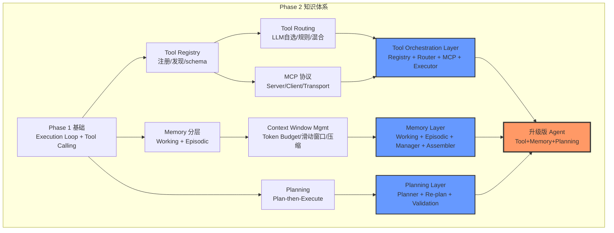
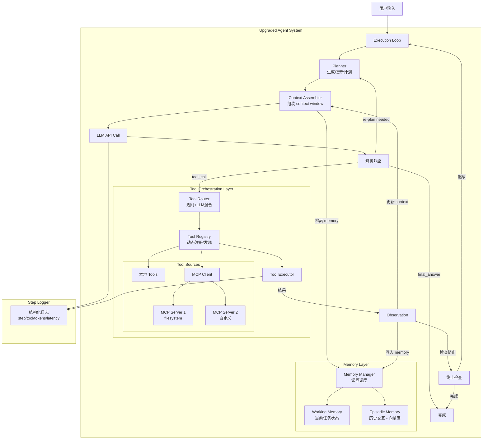

# Phase 2：Agent Harness Engineering — 进阶

> **阶段**: 2 / 4 | **周期**: 3 周（每周 15~20 小时）| **定位**: 为 Agent 装上完整的工具系统、记忆系统和规划能力  
> **前置要求**: 完成 Phase 1（已有可运行的 Minimal Agent Loop）  
> **核心关键词**: Tool Registry · Tool Routing · MCP · Memory 分层 · Context Window Management · Planning · Task Decomposition

---

## 1. 阶段定位

### 在学习路径中的位置

```
  Phase 1: 入门        ★ Phase 2: 进阶          Phase 3: 提升          Phase 4: 架构实战
  (Week 1-3)             (Week 4-6)             (Week 7-9)            (Week 10-12)

 ┌──────────────┐       ┌──────────────┐       ┌──────────────┐      ┌──────────────┐
 │ 理解Agent    │       │ ★ 构建完整的 │       │ 可靠性 +     │      │ 生产级Agent  │
 │ 基本循环     │──────→│  Tool+Memory │──────→│ 可观测 +     │─────→│ 架构设计与   │
 │ 与控制流     │       │  +Planning   │       │ 评估体系     │      │ 多Agent编排  │
 └──────────────┘       └──────────────┘       └──────────────┘      └──────────────┘
                               │
                           你在这里
```

### 核心目标与能力边界

**Phase 2 的核心目标**：将 Phase 1 的"能跑"升级为"能用"——让 agent 拥有动态工具管理、持久记忆和任务规划能力，使其能处理更复杂、多步骤的任务。

**能力边界**：
- ✅ 能做到：实现 tool registry + routing、接入 MCP 协议、构建分层 memory（working + episodic）、实现 context window 管理、实现 plan-then-execute 模式
- ❌ 不涉及：完整的 retry/fallback/circuit breaker（Phase 3）、eval harness（Phase 3）、sandbox 隔离（Phase 3）、multi-agent 协调（Phase 4）

### 与上下阶段的衔接关系

**承接 Phase 1**：
- Phase 1 的 `tools/base.py` → 升级为 `tool_registry.py`（动态注册/发现）
- Phase 1 的硬编码 tool 列表 → 由 tool router 动态选择
- Phase 1 的 conversation history → 升级为分层 memory 系统
- Phase 1 的 "LLM 每步自选" → 增加 planning 层，先规划再执行

**衔接 Phase 3**：
Phase 2 产出的 agent 已具备工具+记忆+规划能力，但缺乏：
- 可靠性机制（Phase 3 加入 retry/fallback/checkpoint）
- 可观测性（Phase 3 加入 structured trace，替代 Phase 2 的简单日志）
- 系统评估（Phase 3 加入 eval harness）
- 安全边界（Phase 3 加入 sandbox/guardrails）

---

## 2. 阶段学习目标

### 知识目标

| # | 目标 | 验证方式 |
|---|------|---------|
| K1 | 理解 Tool Registry 设计模式（注册、发现、schema 验证） | 能设计并实现一个 registry |
| K2 | 理解 Tool Routing 策略（LLM 自选 vs 规则路由 vs 混合） | 能解释三种策略的适用场景 |
| K3 | 理解 MCP 协议的核心概念（server/client、resource/tool/prompt、transport） | 能画出 MCP 架构图 |
| K4 | 理解 Memory 分层模型（Working / Episodic / Semantic / Procedural） | 能解释每层的职责和存储方式 |
| K5 | 理解 Context Window Management 的关键策略（滑动窗口、压缩摘要、重要性评分） | 能设计压缩策略 |
| K6 | 理解 Planning 模式（plan-then-execute / interleaved planning / re-planning） | 能对比三种模式优劣 |

### 工程目标

| # | 目标 | 验证方式 |
|---|------|---------|
| E1 | 实现 Tool Registry：支持动态注册/注销、schema 验证、tool 发现 | 代码可运行 |
| E2 | 实现 Tool Router：支持 LLM 默认选择 + 规则 override | 正确路由到目标 tool |
| E3 | 实现 MCP Client：能连接到至少一个 MCP Server 并调用 tool | 端到端跑通 |
| E4 | 实现 Memory 模块：working memory + episodic memory（基于向量库） | 写入/检索验证 |
| E5 | 实现 Context Manager：token budget 控制 + 滑动窗口 + 溢出处理 | 长对话不爆窗口 |
| E6 | 实现 Planner：plan-then-execute，支持 re-plan on failure | 能对复杂任务生成执行计划 |

### 项目目标

| # | 目标 |
|---|------|
| P1 | 完成 **Tool Orchestration + Memory Agent** 项目（在 Phase 1 代码基础上升级） |
| P2 | 实现一个可工作的 MCP Server（如 local filesystem） |
| P3 | 产出 tool orchestration 架构图 + memory 分层架构图 |

---

## 3. 核心知识体系

### 模块 A：Tool Registry 设计

**为什么重要**：Phase 1 的 tool 列表是硬编码的——5 个 tool 写死在代码里。当 tool 数量增长到 20+，或需要运行时动态添加 tool（例如用户连接新的 MCP Server），就必须有 registry 来管理。

**需掌握的深度**：
- **必须掌握**：注册/注销 API 设计、tool schema 验证（确保输入符合 JSON Schema）、tool 发现（按名称/类别/能力标签查询）、tool 元信息管理（name、description、schema、permission level）
- **了解即可**：tool 版本管理、tool dependency 声明

**推荐学习顺序**：
1. 设计 Tool 接口：`name` / `description` / `parameters_schema` / `execute()`
2. 实现 Registry：`register(tool)` / `unregister(name)` / `get(name)` / `list_all()` / `search(query)`
3. 加入 schema 验证：注册时检查 schema 合法性，调用前校验参数
4. 加入 tool 分类标签（如 `category: "file"`, `"web"`, `"code"`）

**常见误区**：
- ❌ **在 registry 里放太多逻辑**（如 retry、权限检查）→ Registry 只管注册/发现/schema，执行时的 retry/权限由其他层负责
- ❌ **tool description 不规范** → 统一格式："一句话功能描述 + 使用场景 + 输入输出说明"

**与 Agent Harness 的关系**：Tool registry 是 harness 的 **tool orchestration layer** 的核心数据结构。Execution loop → Tool Router → Tool Registry → Tool Executor 的链条在 Phase 2 建立。

---

### 模块 B：Tool Routing 策略

**为什么重要**：当 tool 数量多时，LLM 选择 tool 的准确率会下降。工具过多（>15-20）会显著降低 agent 性能。Tool routing 在 LLM 决策之前或之后提供"引导/过滤"。

**需掌握的深度**：
- **必须掌握**：三种路由策略（LLM 自选、规则路由、混合路由）的实现方式与适用场景
- **了解即可**：基于 embedding 的 tool 相似度匹配、动态 tool 子集选择

**三种路由策略对比**：

| 策略 | 实现 | 适用场景 | 问题 |
|------|------|---------|------|
| LLM 自选 | 把所有 tool schema 发给 LLM | Tool 少（<10） | Tool 多时准确率下降 |
| 规则路由 | if/else 按任务类型选 tool | 任务类型明确 | 不灵活，需维护规则 |
| 混合 | 先规则缩小范围 → LLM 在子集中选 | **推荐** | 需要设计好规则 |

**推荐学习顺序**：
1. 先实现 LLM 自选（Phase 1 已有，直接复用）
2. 加入规则路由：根据用户输入关键词预筛选 tool 子集
3. 实现混合路由：规则缩小范围 → LLM 在子集中决策
4. 加入 tool_choice 控制（强制使用某个 tool / 禁止某些 tool）

**与 Agent Harness 的关系**：Tool router 位于 execution loop 和 tool registry 之间，是 harness 控制 agent "用什么工具"的关键决策点。

---

### 模块 C：MCP 协议（Model Context Protocol）

**为什么重要**：MCP 是 Anthropic 推出的标准化协议，定义了 LLM/Agent 如何发现和使用外部工具（tools）、资源（resources）和提示（prompts）。掌握 MCP 意味着你的 agent 可以接入任何 MCP 兼容的服务，极大扩展能力。

**需掌握的深度**：
- **必须掌握**：MCP 架构（Host → Client → Server）、三种 capability（tools / resources / prompts）、transport 方式（stdio / SSE）、Client 实现
- **了解即可**：Server 高级特性（sampling、roots）、MCP 协议的 JSON-RPC 细节

**推荐学习顺序**：
1. 阅读 MCP 官方 Introduction + Architecture 页面
2. 用官方 MCP Inspector 连接一个 reference server（如 filesystem server），体验 MCP 工作流
3. 用 `mcp` Python SDK 实现一个 MCP Client，连接到 filesystem server
4. 自己实现一个简单的 MCP Server（如 local notes server）
5. 将 MCP Client 集成到你的 tool registry（MCP tools 自动注册）

**常见误区**：
- ❌ **以为 MCP 只是"另一种 REST API"** → MCP 是有状态的双向协议，支持 server 主动推送
- ❌ **只学 Client 不学 Server** → 自己写一个 Server 才能真正理解协议
- ❌ **忽略 resources** → resources 是 MCP 向 agent 提供上下文的关键机制，不只是 tools

**与 Agent Harness 的关系**：MCP 是 harness 的 tool/context 扩展标准。通过 MCP，harness 可以动态发现和接入新的工具和数据源，无需修改 agent 代码。

---

### 模块 D：Memory 分层设计

**为什么重要**：Phase 1 的 agent 只有 conversation history（messages 列表）作为"记忆"。这在长对话中会：①爆 context window、②丢失早期关键信息、③无法跨 session 保留知识。分层 memory 解决这些问题。

**需掌握的深度**：
- **必须掌握**：
  - Working Memory：当前任务状态、变量、中间结果（短期，在 context window 内）
  - Episodic Memory：历史交互记录，按时间和相关性可检索（中期，向量数据库）
  - Context Window Management：组装 context 时的 token budget 分配
- **了解即可**：Semantic Memory（知识库/长期知识）、Procedural Memory（技能/流程记忆）——Phase 3-4 深入

**推荐学习顺序**：
1. 理解 Memory 分层模型（画一张 4 层架构图）
2. 实现 Working Memory：用 Python dict/dataclass 存储当前任务状态
3. 实现 Episodic Memory：用 chromadb（或 lancedb）存储历史交互，支持语义检索
4. 实现 Memory Manager：统一读写接口，按策略决定存储/检索时机
5. 实现 Context Assembler：将 system prompt + working memory + retrieved episodic + recent history 组装成不超过 token budget 的 message list

**常见误区**：
- ❌ **把所有 messages 都扔进向量库** → 需要选择性存储（只存关键决策和结果）
- ❌ **只用 recency 检索** → 需要结合 recency + relevance（语义相似度）双维度
- ❌ **忽略 token budget** → 组装 context 前必须计算 token 数，超出时按优先级截断

**与 Agent Harness 的关系**：Memory 是 harness 的"记忆管理"子系统。Harness 负责决定"什么时候写 memory、从哪里检索 memory、context window 怎么组装"。

---

### 模块 E：Context Window Management

**为什么重要**：LLM 的 context window 是有限的（4K~200K tokens）。Agent 的 messages 会随着交互步数增长而膨胀。如果不管理，要么爆窗口（API 报错），要么早期关键信息被挤出窗口（agent 行为退化）。

**需掌握的深度**：
- **必须掌握**：Token 计数方法（tiktoken）、滑动窗口策略、摘要压缩策略、Priority-based 截断
- **了解即可**：重要性评分（Phase 3 深入）、自适应压缩

**推荐学习顺序**：
1. 用 `tiktoken` 计算 messages 的 token 数
2. 实现滑动窗口：保留最近 N 条 messages + system prompt
3. 实现摘要压缩：当 messages 超过阈值时，用 LLM 对早期 messages 做摘要
4. 实现 Priority-based 截断：system prompt（最高） > working memory > recent tool results > older history
5. 在 execution loop 中接入 context manager：每步 LLM 调用前先组装 context

**常见误区**：
- ❌ **简单截断前 N 条** → 丢失关键信息（用户最初的需求可能在第一条 message 里）
- ❌ **每步都做摘要** → 摘要本身消耗 token 和时间，只在接近阈值时触发
- ❌ **不留 buffer** → token budget 要预留 20~30% 给 LLM 的输出

**与 Agent Harness 的关系**：Context window management 是 harness 保证 agent "不丢失关键信息"的核心机制，直接影响 agent 任务完成质量。

---

### 模块 F：Planning 与 Task Decomposition

**为什么重要**：Phase 1 的 agent 是"每步走一步看一步"——LLM 每次只决定下一步做什么。对于复杂任务（需要多步协作、有依赖关系），没有规划的 agent 容易：①在低层循环浪费 token、②遗漏关键步骤、③无法处理步骤间依赖。

**需掌握的深度**：
- **必须掌握**：Plan-then-execute 模式（先生成完整计划 → 逐步执行）、Re-planning（执行中遇到问题时更新计划）
- **了解即可**：Interleaved planning（边执行边规划）、Hierarchical planning（Phase 4 深入）

**推荐学习顺序**：
1. 设计 Plan 数据结构：`Plan = list[Step(id, description, tool_hint, status, dependencies)]`
2. 实现 plan 生成：用 LLM 将用户请求分解为多步计划
3. 实现 plan-then-execute：按顺序执行每个 step，用 execution loop 驱动
4. 实现 re-planning：当某步失败或产生意外信息时，重新生成后续计划
5. 加入 plan validation：检查计划是否有循环依赖、是否有遗漏步骤

**常见误区**：
- ❌ **让 LLM 一次性生成非常详细的长计划** → 长计划质量差，保持每步描述简洁
- ❌ **把计划当成不可变的** → 实际执行中一定会偏离，必须支持 re-planning
- ❌ **所有任务都用 planning** → 简单任务（如"今天天气如何"）不需要 planning，浪费 token

**与 Agent Harness 的关系**：Planning 是 harness 的"战略层"。Execution loop 负责逐步执行，planner 负责宏观决策。Harness 控制何时触发 planning、何时 re-plan、plan 如何影响 tool 选择。

---

## 4. 阶段架构图

### 架构图 1：Phase 2 知识架构



### 架构图 2：Tool Orchestration + Memory Agent 系统架构



---

## 5. 分周学习计划

### Week 4：Tool Registry + Routing + MCP

| 维度       | 内容                                                                                                                                                                                                                                                                                                                                                     |
| -------- | ------------------------------------------------------------------------------------------------------------------------------------------------------------------------------------------------------------------------------------------------------------------------------------------------------------------------------------------------------ |
| **学习主题** | Tool Registry 设计 + Tool Routing 策略 + MCP 协议入门                                                                                                                                                                                                                                                                                                          |
| **输入材料** | ① MCP 官方文档：[Introduction](https://modelcontextprotocol.io/introduction) + [Architecture](https://modelcontextprotocol.io/docs/concepts/architecture)（精读）<br>② MCP Python SDK 文档（精读）<br>③ SWE-agent 源码：`sweagent/tools/`（泛读，观察 tool 定义方式）<br>④ [modelcontextprotocol/servers](https://github.com/modelcontextprotocol/servers) 官方 reference servers（浏览） |
| **实践任务** | ① 在 Phase 1 的 `tools/base.py` 基础上设计 Tool 接口（加入 schema 验证、category 标签）<br>② 实现 `tool_registry.py`：register / unregister / get / list / search<br>③ 实现 `tool_router.py`：混合路由（规则预筛选 + LLM 在子集中选）<br>④ 用 MCP Python SDK 实现 `mcp_client.py`，连接到 filesystem MCP server<br>⑤ 将 MCP server 的 tools 自动注册到 tool registry                                         |
| **检查点**  | □ Tool registry 可动态添加/删除 tool<br>□ 注册时进行 schema 验证，非法 schema 被拒绝<br>□ Tool router 在 15+ tools 时仍能准确路由<br>□ MCP client 能列出 server 的 tools 并成功调用                                                                                                                                                                                                         |
| **预期产出** | ✅ `tool_registry.py` + `tool_router.py` + `mcp_client.py`<br>✅ Tool registry 接入 execution loop（替代硬编码 tool 列表）<br>✅ 笔记：MCP 协议核心概念 + 架构图                                                                                                                                                                                                                 |

---

### Week 5：Memory + Context Window Management

| 维度       | 内容                                                                                                                                                                                                                                                                                                                        |
| -------- | ------------------------------------------------------------------------------------------------------------------------------------------------------------------------------------------------------------------------------------------------------------------------------------------------------------------------- |
| **学习主题** | 分层 Memory 实现 + Context Window 管理策略                                                                                                                                                                                                                                                                                        |
| **输入材料** | ① chromadb quickstart（精读，30min）<br>② Voyager 论文 Section 3-4（泛读，理解 skill library = procedural memory）<br>③ SWE-agent 源码：`sweagent/agent/` 的 history/context 管理部分（精读）<br>④ tiktoken 库文档（精读，15min）                                                                                                                           |
| **实践任务** | ① 实现 `memory/working.py`：用 dataclass 存储当前任务状态（task、plan、variables、tool_results）<br>② 实现 `memory/episodic.py`：基于 chromadb 的历史交互存储，支持语义检索 + 时间排序<br>③ 实现 `memory/manager.py`：统一读写接口，决定存储/检索策略<br>④ 实现 `context_manager.py`：token 计数（tiktoken）+ 滑动窗口 + 摘要压缩<br>⑤ 集成到 execution loop：每步 LLM 调用前，由 context manager 组装 messages |
| **检查点**  | □ Working memory 正确存储当前任务状态，跨步骤可读<br>□ Episodic memory 写入后可通过语义检索找回<br>□ Context window 超过 80% 阈值时自动触发压缩<br>□ 压缩后 agent 不丢失关键信息（用 demo 任务验证）                                                                                                                                                                              |
| **预期产出** | ✅ `memory/` 模块完成（working + episodic + manager）<br>✅ `context_manager.py` 完成<br>✅ Context window usage 可视化（每步打印 token 使用情况）                                                                                                                                                                                                |

---

### Week 6：Planning + 整合 + 源码精读

| 维度 | 内容 |
|------|------|
| **学习主题** | Planning 模块实现 + 全部模块整合 + SWE-agent / LangGraph 源码精读 |
| **输入材料** | ① SWE-agent 源码精读：`sweagent/agent/` 完整模块（agent loop + planning + history）<br>② SWE-agent ACI 论文 Section 3-5（精读）<br>③ LangGraph 源码泛读：`langgraph/graph/` + `langgraph/checkpoint/`（理解状态图建模） |
| **实践任务** | ① 实现 `planner.py`：用 LLM 将用户请求分解为多步计划（Plan 数据结构）<br>② 实现 plan-then-execute 模式：Planner 生成计划 → Loop 按计划逐步执行<br>③ 实现 re-planning：当某步失败或发现新信息时，调用 Planner 更新后续步骤<br>④ **全部模块整合**：registry + router + MCP + memory + context + planner 全部接入 loop<br>⑤ 编写 3 个升级版 demo：<br>&nbsp;&nbsp;- 复杂计算（需多步 tool 调用 + planning）<br>&nbsp;&nbsp;- 文件搜索+分析（需 MCP filesystem + memory）<br>&nbsp;&nbsp;- 多步研究任务（需 planning + re-plan）<br>⑥ 实现一个自定义 MCP Server（如 local notes server：CRUD 操作）<br>⑦ 精读 SWE-agent 并写 harness 架构分析笔记<br>⑧ 写项目 README + 技术选型文档 |
| **检查点** | □ Planner 能为复杂任务生成合理计划（3-8 步）<br>□ 执行中发现异常时能 re-plan<br>□ 所有模块协同工作，3 个 demo 全部通过<br>□ 自定义 MCP Server 可通过 MCP Client 调用<br>□ 能解释 SWE-agent 的 ACI 设计哲学 |
| **预期产出** | ✅ **Project 2 完成**：带 tool orchestration + memory + planning 的 agent<br>✅ 自定义 MCP Server<br>✅ SWE-agent harness 架构分析笔记<br>✅ 技术选型文档（memory 方案对比、routing 策略对比）<br>✅ Phase 2 学习总结 |

---

## 6. 每周执行建议

### 建议投入时长

| 活动 | 时间分配 | 说明 |
|------|---------|------|
| 阅读资料/文档 | 20%（3~4h/周） | MCP 文档 + SWE-agent 论文 |
| 阅读源码 | 25%（4~5h/周） | SWE-agent + LangGraph 核心模块 |
| 自己实现代码 | 40%（6~8h/周） | 核心时间 |
| 画图/写笔记/总结 | 15%（2~3h/周） | 架构图 + 技术选型文档 |

### 学习节奏

**Week 4**：看文档 30% / 写代码 55% / 做总结 15%
- 重点是 MCP 协议理解 + tool 系统实现

**Week 5**：看源码 20% / 写代码 60% / 做总结 20%
- 重点是 memory + context 实现，这是 Phase 2 最有挑战的部分

**Week 6**：看源码 30% / 写代码 45% / 做总结 25%
- 重点是 planning 实现 + 全部整合 + 源码对比学习

### 如何避免"只看不练"

1. **MCP 协议不要只读文档**：立即用 MCP Inspector 连接一个 server 跑起来，再自己写 client
2. **Memory 不要只设计**：先用 chromadb 写一个"存入 3 条记录 → 检索最相关的 1 条"的 demo
3. **Planning 先做最简版**：用 LLM 把"帮我分析这个项目的代码质量" → 分解为 3 步计划 → 逐步执行
4. **每个模块先独立验证，再集成**：不要一开始就把所有模块一起写，分别跑通后再接入 loop
5. **读源码时手敲关键片段**：不要只看，把 SWE-agent loop 的核心逻辑抄一遍加自己的注释

---

## 7. 推荐参考项目与源码阅读路径

### 项目 1：SWE-agent

| 维度 | 内容 |
|------|------|
| **仓库** | [SWE-agent/SWE-agent](https://github.com/SWE-agent/SWE-agent) |
| **推荐理由** | Phase 2 最核心参考。项目名字叫 "agent"，但真正创新在 **harness**：ACI（Agent-Computer Interface）设计、sandbox 环境管理、tool 定义策略。展示了"工具设计如何影响 agent 性能" |
| **阅读重点模块** | ① `sweagent/agent/` — agent loop + planning + history 管理<br>② `sweagent/tools/` — tool 定义方式 + ACI 设计<br>③ `sweagent/environment/` — Docker sandbox 管理（Phase 2 了解，Phase 3 实现）<br>④ `config/` — harness 的配置化设计 |
| **阅读策略** | Week 6 精读 agent/ + tools/，泛读 environment/ |
| **学完获得能力** | 理解"好的 tool 设计如何提升 agent 性能"；掌握 ACI 思想；了解 Docker sandbox 架构 |

### 项目 2：LangGraph

| 维度 | 内容 |
|------|------|
| **仓库** | [langchain-ai/langgraph](https://github.com/langchain-ai/langgraph) |
| **推荐理由** | 用 State Graph 建模 agent 控制流。提供了 Phase 2 需要的 checkpoint/persistence 机制，展示了"如何用图/状态机表达 agent 行为" |
| **阅读重点模块** | ① `langgraph/graph/` — 状态图定义<br>② `langgraph/checkpoint/` — checkpoint/persistence（为 Phase 3 做铺垫）<br>③ `langgraph/prebuilt/` — 预制 agent 模式（react agent） |
| **阅读策略** | Week 6 泛读 graph/ + checkpoint/，理解设计思想即可 |
| **学完获得能力** | 理解状态图建模 agent 的思路；理解 checkpoint 机制的价值 |

### 项目 3：MCP Reference Servers

| 维度 | 内容 |
|------|------|
| **仓库** | [modelcontextprotocol/servers](https://github.com/modelcontextprotocol/servers) |
| **推荐理由** | MCP 官方 server 实现集合。通过阅读 filesystem、sqlite 等 server 实现，快速理解 MCP Server 怎么写 |
| **阅读重点模块** | ① `src/filesystem/` — 文件系统 MCP Server<br>② 任意一个简单 server 的完整代码 |
| **阅读策略** | Week 4 快速阅读 filesystem server（1-2h） |
| **学完获得能力** | 能自己写 MCP Server |

### 补充阅读

| # | 资源 | 阅读重点 |
|---|------|---------|
| 1 | [SWE-agent ACI 论文](https://arxiv.org/abs/2405.15793) | ACI 设计原则；tool/env 设计如何影响 agent 性能 |
| 2 | [MCP Specification](https://spec.modelcontextprotocol.io/) | 完整协议 spec（重点看 tool/resource 部分） |
| 3 | [Voyager 论文](https://arxiv.org/abs/2305.16291) | 自动 skill 库构建（与 procedural memory 相关） |
| 4 | [LangChain Academy - LangGraph Course](https://academy.langchain.com/courses/intro-to-langgraph) | 状态图编排 agent 视频教程 |

---

## 8. 阶段实践项目设计

### Project 2：Tool Orchestration + Memory Agent

#### 项目目标与适合理由

在 Phase 1 的 Minimal Agent Loop 基础上，升级为一个具备**动态工具管理、外部工具接入（MCP）、分层记忆、上下文管理、任务规划**能力的 agent。项目采用渐进式升级——不重新开始，而是在现有代码上逐步扩展，模拟真实工程中的迭代开发。

#### 功能范围 + MVP 版本

**MVP（Week 5 完成）**：
- Tool Registry + 动态注册/注销
- Tool Router（混合路由）
- MCP Client 接入一个 server
- Working memory + Episodic memory
- Context window 管理（Token 计数 + 滑动窗口）

**完整版（Week 6 完成）**：
- 自定义 MCP Server
- Plan-then-execute + re-plan
- 摘要压缩策略
- 3 个升级版 demo
- 技术选型文档 + 架构图

#### 推荐技术栈

```
Python 3.12+
├── Phase 1 全部依赖
├── mcp               — MCP Python SDK（Client + Server）
├── chromadb           — 向量数据库（episodic memory）
├── tiktoken           — Token 计数
├── pydantic           — 数据模型验证 + tool schema
└── jsonschema         — JSON Schema 验证（tool 参数）
```

#### 模块拆分 + 实现步骤

**目录结构**（在 Phase 1 基础上扩展）：

```
agent-harness/                      # 从 minimal-agent/ 重命名
├── config.yaml
├── main.py
├── agent/
│   ├── loop.py                     # ★ 升级：接入 planner + memory + tool orchestration
│   ├── state.py                    # ★ 升级：加入 plan_state, memory_state
│   ├── config.py
│   └── planner.py                  # 【新增】Plan-then-execute + re-plan
├── llm/
│   ├── client.py                   # ★ 升级：支持多 provider
│   └── parser.py
├── tools/
│   ├── base.py                     # ★ 升级：加入 schema 验证 + category + permission level
│   ├── registry.py                 # 【新增】Tool Registry
│   ├── router.py                   # 【新增】Tool Router（混合路由）
│   ├── executor.py                 # 【新增】Tool 执行封装（统一错误处理）
│   ├── calculator.py
│   ├── weather.py
│   ├── search.py
│   ├── file_reader.py
│   └── shell.py
├── mcp_integration/
│   ├── client.py                   # 【新增】MCP Client
│   └── servers/
│       └── notes_server.py         # 【新增】自定义 MCP Server（笔记 CRUD）
├── memory/
│   ├── working.py                  # 【新增】Working Memory
│   ├── episodic.py                 # 【新增】Episodic Memory（chromadb）
│   └── manager.py                  # 【新增】Memory Manager（统一接口）
├── context/
│   └── manager.py                  # 【新增】Context Window Manager
├── demos/
│   ├── demo_complex_calc.py        # 【新增】复杂计算（多步 tool + planning）
│   ├── demo_file_research.py       # 【新增】文件搜索+分析（MCP + memory）
│   ├── demo_multi_step.py          # 【新增】多步研究（planning + re-plan）
│   ├── demo_math.py                # Phase 1 保留（回归测试）
│   ├── demo_weather.py
│   └── demo_file.py
└── docs/
    ├── tool_orchestration.md       # 【新增】Tool orchestration 架构图
    ├── memory_architecture.md      # 【新增】Memory 分层架构图
    ├── tech_choices.md             # 【新增】技术选型文档
    └── architecture.md             # ★ 升级
```

**实现步骤**：

| 步骤 | 具体内容 | 所属周 | 预计耗时 |
|------|---------|--------|---------|
| 1 | 升级 `tools/base.py`：加入 schema 验证、category、permission level | Week 4 | 1.5h |
| 2 | 实现 `tools/registry.py`：register / unregister / get / list / search | Week 4 | 2h |
| 3 | 实现 `tools/router.py`：规则预筛选 + LLM 子集选择 | Week 4 | 2h |
| 4 | 实现 `tools/executor.py`：统一执行封装 + 基础错误处理 | Week 4 | 1h |
| 5 | 实现 `mcp_integration/client.py`：连接 MCP Server，自动发现并注册 tools | Week 4 | 3h |
| 6 | 实现 `memory/working.py`：dataclass 存储任务状态 | Week 5 | 1h |
| 7 | 实现 `memory/episodic.py`：chromadb 写入/检索（语义+时间） | Week 5 | 3h |
| 8 | 实现 `memory/manager.py`：统一读写接口 + 检索策略 | Week 5 | 2h |
| 9 | 实现 `context/manager.py`：token 计数 + 滑动窗口 + 摘要压缩 | Week 5 | 3h |
| 10 | 实现 `agent/planner.py`：Plan 数据结构 + LLM 生成计划 + re-plan | Week 6 | 3h |
| 11 | 升级 `agent/loop.py`：接入 registry → router → executor + memory + context + planner | Week 6 | 3h |
| 12 | 实现自定义 MCP Server（notes CRUD） | Week 6 | 2h |
| 13 | 编写 3 个升级版 demo + 测试 | Week 6 | 2h |
| 14 | 文档：README + 技术选型 + 架构图 | Week 6 | 2h |

#### 验收标准

| # | 标准 | 如何验证 |
|---|------|---------|
| 1 | Tool Registry 可动态添加 tool | 运行时调用 register()，新 tool 立即可用 |
| 2 | MCP Client 能连接 filesystem server | 列出 tools + 成功调用 read_file |
| 3 | 混合路由：15 个 tool 时仍正确路由 | 注册 15 个 tool，验证路由准确性 |
| 4 | Working memory 跨步骤保持 | 在 step 3 设置变量，step 5 能读到 |
| 5 | Episodic memory 语义检索 | 存入 10 条记录，检索"关于 XX 的交互"能找到 |
| 6 | Context window 不爆破 | 跑 30+ steps 的长任务，不出现 token limit error |
| 7 | Planning 能分解复杂任务 | 给定"分析项目代码质量"，生成 3-8 步计划 |
| 8 | Re-plan 能处理步骤失败 | mock 某步 tool 失败，agent 自动更新计划 |
| 9 | Phase 1 demo 仍然通过 | 运行 Phase 1 的 3 个 demo，验证不回归 |

---

## 9. 项目架构图

### Tool Orchestration + Memory Agent 数据控制流

```mermaid
sequenceDiagram
    participant User
    participant Loop as Execution Loop
    participant Planner
    participant CtxMgr as Context Manager
    participant MemMgr as Memory Manager
    participant WM as Working Memory
    participant EM as Episodic Memory
    participant LLM
    participant Router as Tool Router
    participant Reg as Tool Registry
    participant Exec as Tool Executor
    participant MCP as MCP Client

    User->>Loop: 输入任务
    Loop->>Planner: 生成执行计划
    Planner->>LLM: "分解这个任务为步骤"
    LLM-->>Planner: Plan[step1, step2, ...]
    Planner-->>Loop: Plan

    loop 每个计划步骤
        Loop->>CtxMgr: 组装 context
        CtxMgr->>MemMgr: 检索相关记忆
        MemMgr->>WM: 读取当前状态
        MemMgr->>EM: 语义检索历史
        MemMgr-->>CtxMgr: memory context
        CtxMgr->>CtxMgr: Token budget 检查 + 压缩
        CtxMgr-->>Loop: 组装好的 messages

        Loop->>LLM: chat(messages, tools)
        LLM-->>Loop: tool_call / final_answer

        alt tool_call
            Loop->>Router: route(tool_name, args)
            Router->>Reg: 查找 tool（含 MCP tools）
            Reg-->>Router: tool 实例
            Router->>Exec: execute(tool, args)
            
            alt 本地 tool
                Exec->>Exec: 直接执行
            else MCP tool
                Exec->>MCP: call_tool(name, args)
                MCP-->>Exec: result
            end
            
            Exec-->>Loop: tool result
            Loop->>MemMgr: 写入记忆
            MemMgr->>WM: 更新任务状态
            MemMgr->>EM: 存储交互记录
        else 步骤失败
            Loop->>Planner: re-plan(current_state, error)
            Planner-->>Loop: Updated Plan
        end
    end

    Loop-->>User: 最终结果
```

### 模块依赖关系（升级版）

```
┌──────────┐
│  main.py │
└────┬─────┘
     │
     ▼
┌────────────────────────────────────────────────────────────┐
│                  agent/loop.py  ★核心                       │
│                                                             │
│  plan = planner.plan(task)                                  │
│  for step in plan:                                          │
│    ctx = context_mgr.assemble(state, memory)                │
│    response = llm.chat(ctx, tools=registry.active_tools())  │
│    action = parse(response)                                 │
│    if tool_call:                                            │
│      tool = router.route(action.tool, state)                │
│      result = executor.execute(tool, action.args)           │
│      memory_mgr.write(result)                               │
│    if failure:                                              │
│      planner.replan(state, error)                           │
└────┬──────┬──────┬──────┬──────┬──────┬─────────────────────┘
     │      │      │      │      │      │
     ▼      ▼      ▼      ▼      ▼      ▼
┌───────┐┌──────┐┌──────┐┌──────┐┌──────┐┌──────────┐
│planner││ llm/ ││tools/││memory││contxt││mcp_integ/│
│       ││      ││      ││      ││mgr   ││          │
│plan() ││client││regist││workng││      ││client    │
│replan ││parser││router││episdc││assemb││servers/  │
│       ││      ││exectr││mangr ││token ││notes_srv │
└───────┘└──────┘└──────┘└──────┘└──────┘└──────────┘
                    │                         │
                    ▼                         ▼
              ┌──────────┐            ┌──────────────┐
              │ 5 local  │            │  MCP Servers  │
              │  tools   │            │ (filesystem,  │
              │(Phase 1) │            │  notes, ...)  │
              └──────────┘            └──────────────┘
```

---

## 10. 阶段输出物清单

| # | 输出物 | 类型 | 描述 |
|---|-------|------|------|
| 1 | **Tool Orchestration + Memory Agent 项目代码** | 代码 | 在 Phase 1 基础上升级，含 registry/router/MCP/memory/context/planner |
| 2 | **Tool Registry 模块** | 代码 | 支持动态注册/注销/发现/schema 验证 |
| 3 | **MCP Client + 自定义 MCP Server** | 代码 | Client 能连接 server，Server 实现 notes CRUD |
| 4 | **Memory 模块（Working + Episodic）** | 代码 | 分层存储/检索，集成 chromadb |
| 5 | **Context Window Manager** | 代码 | Token 计数 + 滑动窗口 + 摘要压缩 |
| 6 | **Planner 模块** | 代码 | Plan-then-execute + re-plan on failure |
| 7 | **3 个升级版 Demo** | 代码 | 复杂计算 / 文件研究 / 多步任务 |
| 8 | **Tool Orchestration 架构图** | Mermaid 图 | Registry → Router → Executor → MCP 完整链路 |
| 9 | **Memory 分层架构图** | Mermaid 图 | Working / Episodic + Context Assembler |
| 10 | **技术选型文档** | 文档 | Memory 方案对比、向量库选型、MCP vs REST 对比 |
| 11 | **SWE-agent Harness 架构分析笔记** | 文档 | 精读笔记：ACI 设计、tool 系统、agent loop |
| 12 | **Phase 2 学习总结** | 文档 | 本阶段学到了什么 / 哪里有困难 / Phase 3 需要什么 |
| 13 | **项目 README（升级版）** | 文档 | 完整项目说明 + 架构图 + 运行方法 |

---

## 11. 阶段验收标准

### 知识掌握（5 项）

| # | 标准 | 验证方式 |
|---|------|---------|
| 1 | 能画出 Tool Orchestration 全链路（Registry → Router → Executor → Result Handler） | 白板画图 |
| 2 | 能解释 MCP 协议的核心概念（Server/Client、Resource/Tool/Prompt、Transport） | 口头讲解 |
| 3 | 能解释 Memory 4 层模型的职责和差异 | 口头/书面 |
| 4 | 能解释 Context Window 管理的 3 种策略及适用场景 | 口头/书面 |
| 5 | 能对比 plan-then-execute vs interleaved planning 的优劣 | 书面 |

### 独立实现能力（3 项）

| # | 标准 | 验证方式 |
|---|------|---------|
| 1 | 能在 1 小时内为 agent 添加一个新的 MCP Server 接入 | 限时编码 |
| 2 | 能在 30 分钟内实现一个新的 tool 并注册到 registry | 限时编码 |
| 3 | 能在 2 小时内从零实现一个带 memory 的 agent（基于已有模块） | 限时编码 |

### 调试能力（3 项）

| # | 标准 | 验证方式 |
|---|------|---------|
| 1 | 能通过日志定位"tool routing 选错了 tool"的原因 | 制造问题场景 |
| 2 | 能通过日志定位"memory 检索没有返回相关结果" | 制造问题场景 |
| 3 | 能通过日志定位"context window 溢出导致信息丢失" | 制造问题场景 |

### 工程完整度（4 项）

| # | 标准 |
|---|------|
| 1 | 所有新模块有清晰的接口定义（输入/输出/异常） |
| 2 | Tool registry 支持动态操作（运行时添加/移除 tool） |
| 3 | Memory 数据持久化（重启后 episodic memory 保留） |
| 4 | Phase 1 的 3 个 demo 仍能正常运行（无回归） |

### 文档完整度（3 项）

| # | 标准 |
|---|------|
| 1 | 有 tool orchestration 架构图 + memory 架构图 |
| 2 | 有技术选型文档（对比 + 决策理由） |
| 3 | 有 SWE-agent 源码阅读笔记 |

---

## 12. 常见问题与避坑建议

### 坑 1：Tool 数量膨胀导致 LLM 决策退化

**现象**：注册了 20+ 个 tool 后，LLM 频繁选错 tool 或参数错误  
**原因**：LLM 的 tool 选择准确率随 tool 数量增加而下降  
**规避**：  
- 实现混合路由：规则先筛选出 5-8 个候选 tool → LLM 在子集中选  
- Tool description 保持精确简洁  
- 相似 tool 做合并（如 `read_file` 和 `read_directory` 合并为带参数的 `filesystem` tool）

### 坑 2：Memory 检索质量差

**现象**：Agent 说"我不记得之前讨论过这个"，但实际上讨论过  
**原因**：只用 embedding 相似度检索，recency 和 importance 被忽略  
**规避**：  
- 检索时结合 relevance（语义相似度）+ recency（时间衰减）两个维度  
- 存入 memory 时加上 metadata（timestamp、task_id、importance_score）  
- 关键决策和关键结果必须存入 memory，普通中间步骤可以不存

### 坑 3：Context Window 管理"一刀切"

**现象**：压缩 context 时把关键信息也删掉了  
**原因**：简单的"删除最早 N 条消息"策略  
**规避**：  
- 按优先级分配 token budget：system prompt > working memory > recent tool results > episodic > older history  
- 压缩时保留 system prompt 和最后 2-3 轮对话不压缩  
- 对中间历史做摘要而非直接删除

### 坑 4：Plan 过于详细或过于粗略

**现象**：Plan 要么有 20 步（过细，执行中不断偏离），要么只有 2 步（过粗，等于没有 plan）  
**原因**：没有控制 plan 的粒度  
**规避**：  
- Prompt 中明确指定"2-8 步"  
- 每步描述保持 1-2 句  
- 复杂任务用层级 plan（高层 3-5 步，每步可展开为子步骤）

### 坑 5：MCP 集成过度复杂化

**现象**：花大量时间在 MCP 协议细节上，忽略了其他模块  
**原因**：MCP spec 很长，试图完整实现所有功能  
**规避**：  
- Phase 2 只需实现：tool listing + tool calling（最核心的两个 capability）  
- Resource 和 Prompt 功能了解即可，不需要在 Phase 2 实现  
- 用官方 SDK 而不是从零实现协议

### 坑 6：Memory 写入过于频繁

**现象**：每一步的中间输出都写入 episodic memory，导致检索噪音大  
**原因**：没有设计写入策略  
**规避**：只在以下时机写入 episodic memory：  
- 任务完成时的最终结果  
- 重要的用户意图确认  
- 关键的 tool 调用结果（成功的搜索结果、重要的文件内容）  
- 不要存：中间计算步骤、失败的 tool 重试、planning 的中间版本

### 不要过深的内容

- ❌ MCP 协议的全部 spec（Phase 2 只需 tool listing + calling）
- ❌ 向量数据库的底层实现（HNSW 算法等）——用 chromadb 黑盒即可
- ❌ 复杂的 planning 算法（MCTS、beam search）——Plan-then-execute 足够
- ❌ 完整的 retry/fallback 机制——Phase 2 只需基础错误处理，Phase 3 做完整可靠性
- ❌ Structured tracing——Phase 2 用 print 日志，Phase 3 升级为 trace

---

## 13. 进入下一阶段前的准备

### 必须补齐的内容

| # | 内容 | 状态检查 |
|---|------|---------|
| 1 | Project 2 完成并端到端运行 | □ 3 个升级版 demo 通过 + Phase 1 demo 不回归 |
| 2 | Tool registry + MCP 集成可工作 | □ 能动态添加 tool + MCP tool 可用 |
| 3 | Memory 模块可正常读写 | □ Working + Episodic 均验证通过 |
| 4 | Context window 管理不爆破 | □ 30+ steps 长任务可完成 |
| 5 | Planner 可生成和调整计划 | □ Plan-then-execute + re-plan 均验证 |
| 6 | SWE-agent 源码阅读笔记 | □ 有结构化笔记 |

### 保留作为下一阶段输入的产出

| 产出 | Phase 3 如何使用 |
|------|-----------------|
| `tools/executor.py` | Phase 3 在此基础上加入 retry / fallback / circuit breaker |
| `agent/loop.py` | Phase 3 在每个 step 前后加入 trace span + guardrail hook |
| `memory/` 模块 | Phase 3 加入 checkpoint（状态持久化 + 恢复） |
| Step 日志（print） | Phase 3 升级为 structured trace（span-based） |
| 3 个 demo | Phase 3 作为回归测试用例 |
| Tool registry 注册信息 | Phase 3 加入 tool permission model |
| SWE-agent 笔记 | Phase 3 参考其 sandbox/eval 设计 |

### Phase 3 预习建议

在正式进入 Phase 3 之前，建议花 1~2 小时浏览：
1. Langfuse 官网（理解 agent trace 可视化长什么样）
2. Inspect AI 仓库的 README（理解 eval harness 的概念）
3. Docker SDK for Python 的 quickstart（感受容器 API）
4. OpenTelemetry 概念页面（trace、span、exporter 的基本含义）

---

> **上一阶段**：[Phase 1 — Agent Harness Engineering 入门](Phase-1-Agent-Harness-Engineering-入门.md)  
> **下一阶段**：[Phase 3 — Agent Harness Engineering 提升](Phase-3-Agent-Harness-Engineering-提升.md)  
> 核心内容：Eval Harness + Reliability Engineering + Observability + Sandbox + Guardrails
