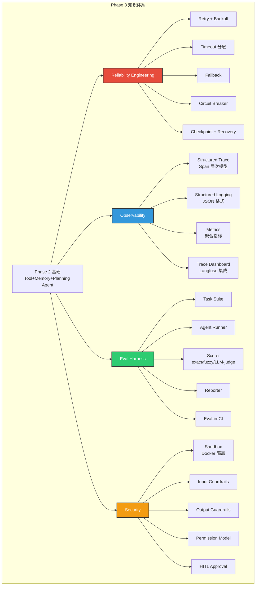
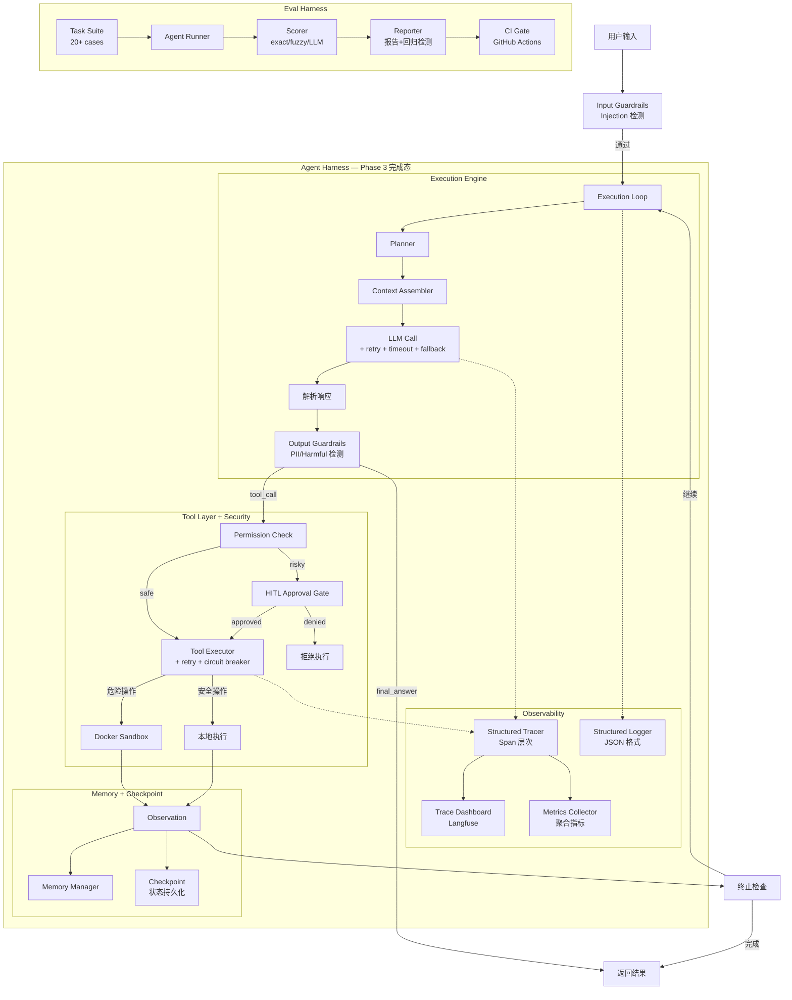

# Phase 3：Agent Harness Engineering — 提升

> **阶段**: 3 / 4 | **周期**: 3 周（每周 15~20 小时）| **定位**: 让 Agent 从"能用"升级为"可靠、可观测、可评估、安全"  
> **前置要求**: 完成 Phase 2（已有 Tool Orchestration + Memory + Planning Agent）  
> **核心关键词**: Reliability Engineering · Structured Trace · Eval Harness · Sandbox · Guardrails · HITL · Checkpoint

---

## 1. 阶段定位

### 在学习路径中的位置

```
  Phase 1: 入门        Phase 2: 进阶        ★ Phase 3: 提升          Phase 4: 架构实战
  (Week 1-3)           (Week 4-6)             (Week 7-9)            (Week 10-12)

 ┌──────────────┐     ┌──────────────┐     ┌──────────────┐       ┌──────────────┐
 │ 理解Agent    │     │ 构建完整的   │     │ ★ 可靠性 +   │       │ 生产级Agent  │
 │ 基本循环     │────→│ Tool+Memory  │────→│  可观测 +    │──────→│ 架构设计与   │
 │ 与控制流     │     │ +Planning    │     │  评估体系    │       │ 多Agent编排  │
 └──────────────┘     └──────────────┘     └──────────────┘       └──────────────┘
                                                  │
                                              你在这里
```

### 核心目标与能力边界

**Phase 3 是 Agent Harness Engineering 最核心的阶段**——从这里开始，你的 agent 才真正具备"生产级"特质。Phase 1-2 解决了"能跑"和"能用"，Phase 3 解决的是"可靠、可观测、可评估、安全"。

**能力边界**：
- ✅ 能做到：完整的 retry/fallback/checkpoint 可靠性机制、span-based structured trace、eval harness 搭建（task suite + scorer + reporter + CI gate）、Docker-based sandbox、input/output guardrails、human-in-the-loop gate
- ❌ 不涉及：multi-agent 协调（Phase 4）、Agent-as-a-Service 部署（Phase 4）、生产监控告警（Phase 4）、cost control 体系（Phase 4）

### 与上下阶段的衔接关系

**承接 Phase 2**：
- Phase 2 的 `tools/executor.py`（基础错误处理）→ Phase 3 加入 **retry / fallback / circuit breaker / timeout 分层**
- Phase 2 的 step 日志（print）→ Phase 3 升级为 **structured trace（span-based）**
- Phase 2 的 memory 模块 → Phase 3 加入 **checkpoint（状态持久化 + 断点恢复）**
- Phase 2 的 tool 执行（直接在本地）→ Phase 3 对危险操作加入 **sandbox 隔离 + permission check**
- Phase 2 的 demo 任务 → Phase 3 升级为 **eval task suite（系统化评估）**

**衔接 Phase 4**：
Phase 3 产出的 agent 已具备单 agent 的完整 harness 能力。Phase 4 将在此基础上：
- 扩展为 multi-agent 架构（supervisor + workers）
- 包装为 Agent-as-a-Service（API 部署）
- 加入生产级 CI/CD（eval-in-CI）和监控告警
- 实现 cost control 和 model routing

---

## 2. 阶段学习目标

### 知识目标

| # | 目标 | 验证方式 |
|---|------|---------|
| K1 | 理解 Agent 可靠性模式（retry、fallback、circuit breaker、timeout 分层、checkpoint） | 能画出可靠性机制全景图 |
| K2 | 理解 Agent Trace 模型（Agent Run → Step → LLM Call → Tool Call 的 span 层次） | 能设计 trace schema |
| K3 | 理解 Eval Harness 架构（Task Suite → Agent Runner → Scorer → Reporter） | 能画出 eval pipeline |
| K4 | 理解 Sandbox 隔离层次（Docker / microVM / gVisor / E2B）及适用场景 | 能选择合适的 sandbox 方案 |
| K5 | 理解 Guardrails 设计（input guard / output guard / permission model / approval gate） | 能设计分级 guardrail pipeline |
| K6 | 理解 Eval 方法论（scoring 策略、统计显著性、regression testing） | 能设计 eval task 并解读结果 |

### 工程目标

| # | 目标 | 验证方式 |
|---|------|---------|
| E1 | 实现完整的 retry / fallback / timeout / circuit breaker | 注入故障后 agent 能恢复 |
| E2 | 实现 checkpoint + 断点恢复 | kill agent → 重启 → 从断点继续 |
| E3 | 实现 span-based structured trace（集成 Langfuse 或自建） | Trace 可在 dashboard 查看 |
| E4 | 实现 eval harness：task suite（20+ cases）+ scorer + reporter | 一键运行 eval 并输出报告 |
| E5 | 实现 Docker-based sandbox | 代码执行在容器内，宿主机安全 |
| E6 | 实现 input/output guardrails + human-in-the-loop approval | Guardrail 拦截危险操作 |

### 项目目标

| # | 目标 |
|---|------|
| P1 | 完成 **Reliable + Observable Agent**（Project 3：可靠性 + 可观测性） |
| P2 | 完成 **Agent Eval Harness**（Project 4：评估体系） |
| P3 | 完成 **Sandboxed + Guardrailed Agent**（Project 5：安全体系） |

---

## 3. 核心知识体系

### 模块 A：Reliability Engineering

**为什么重要**：Phase 2 的 agent 在 happy path 上能工作，但面对网络超时、LLM 返回异常、tool 超时、外部 API 限流等常见故障时，会直接崩溃或行为异常。可靠性机制是 harness "管住 agent 不失控"的核心。

**需掌握的深度**：
- **必须掌握**：
  - Retry with exponential backoff + jitter（避免 thundering herd）
  - Timeout 分层：tool-level（5-30s）→ step-level（60-300s）→ total（5-30min）
  - Fallback 模式：备用 tool、降级模型、降级策略
  - Circuit Breaker：连续 N 次失败后短路，避免无效重试
  - Checkpoint + Recovery：在每步成功后保存状态，失败时从最近成功步恢复
  - Error classification：transient（可重试）↔ permanent（不可重试）↔ partial（部分成功）
- **了解即可**：Error budget 策略、Chaos engineering for agents

**推荐学习顺序**：
1. 实现 retry with exponential backoff + jitter（3 个场景：LLM 调用、tool 调用、MCP 调用）
2. 实现 timeout 分层（tool-level → step-level → total，用 `asyncio.timeout` 或 `signal`）
3. 实现 fallback（tool 失败 → 尝试备用 tool；LLM 失败 → 降级到更便宜模型）
4. 实现 circuit breaker（连续 3 次失败 → 短路 30s → 半开探测 → 恢复）
5. 实现 checkpoint（每步成功后将 `AgentState` 序列化到 SQLite/JSON）
6. 实现断点恢复（从 checkpoint 加载 state → 继续执行）

**常见误区**：
- ❌ **所有错误都重试** → 必须区分 transient（网络超时）和 permanent（404/invalid key）
- ❌ **重试不加 backoff** → 固定间隔重试会在高并发下造成 thundering herd
- ❌ **没有 total timeout** → step 级别重试可能导致总时间远超预期

**与 Agent Harness 的关系**：可靠性是 harness 的"韧性骨架"。没有可靠性机制的 harness 在真实环境中会频繁失败。

---

### 模块 B：Observability — Structured Trace

**为什么重要**：Phase 2 用 `print` 日志追踪 agent 行为——当 agent 步骤变多、嵌套变深时，print 日志变得不可读。Structured trace 提供层次化、可查询、可可视化的 agent 行为记录。

**需掌握的深度**：
- **必须掌握**：
  - Span 层次模型：Agent Run Span → Step Span → LLM Call Span → Tool Call Span
  - 每个 span 的标准属性：span_id、parent_id、start_time、end_time、status、metadata
  - Trace 与 LLM 调用关联：model、input_tokens、output_tokens、cost、latency
  - Trace 存储与查询：Langfuse 集成（或自建 JSON 存储）
  - Agent-specific metrics：steps_per_task、tool_success_rate、token_efficiency、task_completion_rate
- **了解即可**：OpenTelemetry 集成细节、分布式 trace（Phase 4 多 agent 时需要）

**推荐学习顺序**：
1. 设计 Span 数据模型（SpanType、SpanStatus、span attributes）
2. 实现 Tracer 类：`start_span(name, type)` → `end_span(status, metadata)` → `export()`
3. 在 execution loop 中插入 trace：每步开始/结束时创建/关闭 span
4. 在 LLM 调用中插入 trace：记录 model、tokens、latency、cost
5. 在 tool 调用中插入 trace：记录 tool_name、args、result_size、latency、retry_count
6. 集成 Langfuse Python SDK 作为 exporter（或自建 JSON 文件存储）
7. 实现 metrics collector：从 trace 数据中计算关键指标

**常见误区**：
- ❌ **只记录最终结果** → 必须记录每个中间步骤，否则无法定位问题
- ❌ **Trace 数据不结构化** → 用 JSON 结构化存储，不用纯文本
- ❌ **Trace 开销过大** → 生产环境可设置采样率（Phase 3 全量记录，Phase 4 再考虑采样）

**与 Agent Harness 的关系**：Trace 是 harness 的"眼睛"。没有 trace，harness 的其他能力（reliability、eval）都是盲操作。

---

### 模块 C：Eval Harness

**为什么重要**：Agent 是非确定性的——同样的输入可能产生不同的输出。传统的单元测试无法有效验证 agent 行为。Eval harness 提供系统化的评估框架：定义任务、运行 agent、打分、生成报告、检测回归。

**需掌握的深度**：
- **必须掌握**：
  - Eval 架构：Task Suite → Agent Runner → Scorer → Reporter
  - Task 设计：input（任务描述）、expected output、grading rubric、timeout、sandbox config
  - Scoring 方法：exact match、contains/fuzzy、LLM-as-judge、custom function
  - Regression testing：对比两次运行结果，检测性能下降
  - Eval-in-CI：在 CI pipeline 中自动运行 eval，regression 时 block merge
- **了解即可**：统计显著性（多次运行 + 置信区间）、benchmark 方法论（SWE-bench 设计）

**推荐学习顺序**：
1. 阅读 Inspect AI 的文档和核心源码（solver / scorer / log）
2. 设计 Task 数据模型：`Task(id, input, expected, rubric, timeout, tags)`
3. 实现 Task Suite：从 YAML/JSON 加载 task 定义，支持按 tag 过滤
4. 实现 Agent Runner：在隔离环境中运行 agent（超时控制、输出捕获）
5. 实现 Scorer：exact_match / contains / llm_judge / custom
6. 实现 Reporter：生成报告（pass rate、score distribution、failure list、对比表）
7. 实现 Regression Detector：对比当前结果与 baseline，检测下降
8. CI 集成：GitHub Actions workflow，eval 失败 → block merge

**常见误区**：
- ❌ **跑几个 case 看看就行** → Agent 是非确定性的，单次结果不可靠。至少跑 3 次取平均
- ❌ **只用 exact match** → Agent 输出格式不确定，需要 fuzzy matching 或 LLM-as-judge
- ❌ **Eval task 太简单** → 需要覆盖：正常任务、边界条件、错误恢复、长任务、多 tool 协作

**与 Agent Harness 的关系**：Eval harness 是 harness 的"质量保证"体系。任何 harness 改动（修改 retry 策略、调整 prompt、更换模型）都应通过 eval 验证效果。

---

### 模块 D：Sandbox 与环境隔离

**为什么重要**：Agent 执行代码、操作文件系统、访问网络——这些操作如果在宿主机上直接执行，会带来严重安全风险（删除文件、泄露数据、执行恶意代码）。Sandbox 提供隔离的执行环境。

**需掌握的深度**：
- **必须掌握**：Docker 容器作为 sandbox（创建/执行/销毁、资源限制、文件系统挂载）、Docker SDK for Python
- **了解即可**：gVisor、microVM、E2B 云端 sandbox、sandbox snapshot/restore（进阶用法）

**推荐学习顺序**：
1. Docker SDK for Python quickstart：创建容器 → 执行命令 → 获取输出 → 销毁容器
2. 实现 `SandboxManager`：`create(image, limits)` / `execute(cmd)` / `destroy()`
3. 加入资源限制：CPU（`nano_cpus`）、内存（`mem_limit`）、磁盘、网络
4. 将 agent 的 `shell_exec` tool 从 mock 改为真正在 Docker 中执行
5. 实现 sandbox lifecycle：agent 开始时创建 → 执行中复用 → 任务结束时销毁
6. 了解 snapshot/restore（在 Phase 4 中用于 checkpoint 恢复）

**常见误区**：
- ❌ **直接在宿主机执行代码** → 即使是"看起来安全的"代码，也可能 `rm -rf /` 或泄露 env vars
- ❌ **每个 tool call 新建容器** → 容器启动耗时 1-5s，应该复用容器实例
- ❌ **不设资源限制** → Agent 可能执行死循环或内存泄漏代码，限制 CPU/memory/timeout

**与 Agent Harness 的关系**：Sandbox 是 harness 的"安全执行环境"。Harness 管理 sandbox 的生命周期，将危险操作路由到 sandbox 中执行。

---

### 模块 E：Guardrails 与 Permission

**为什么重要**：即使有 sandbox，agent 仍可能：①执行超出授权范围的操作、②被 prompt injection 诱导做危险事、③输出敏感信息。Guardrails 在 agent 执行的每个环节加入安全检查。

**需掌握的深度**：
- **必须掌握**：
  - Input guardrails：prompt injection 检测（基础规则匹配 + LLM 判断）
  - Output guardrails：PII 检测/过滤、harmful content 检查
  - Tool permission model：allow-list（只允许指定 tool）、capability scoping（限制 tool 参数范围）
  - Human-in-the-loop approval gate：高风险操作前请求人工审批
- **了解即可**：Policy engine 设计（rule-based vs LLM-based hybrid）、audit logging

**推荐学习顺序**：
1. 实现 input guard：关键词 + 正则检测 prompt injection patterns
2. 实现 output guard：正则检测 PII（email、phone、SSN patterns）
3. 实现 tool permission：在 tool registry 中标记 permission level（safe / risky / dangerous）
4. 实现 approval gate：risky tool call → CLI 提示用户 approve/deny
5. 在 execution loop 中串联 guardrails：pre-step → input guard → (LLM call) → output guard → (tool call) → permission check → (optional HITL)
6. 实现 guardrail 日志（哪些检查被触发、哪些操作被拦截）

**常见误区**：
- ❌ **只在上线前做一次安全检查** → Guardrails 必须在运行时每步执行
- ❌ **LLM "不会"做坏事** → LLM 可被 prompt inject、可 hallucinate 危险操作
- ❌ **给 agent 全部权限** → 最小权限原则：agent 只拥有完成当前任务所需的最小权限集

**与 Agent Harness 的关系**：Guardrails 是 harness 的"安全阀"。Harness 在 execution loop 的 pre-step 和 post-step 挂载 guardrail hooks。

---

### 模块 F：Structured Logging 与 Metrics

**为什么重要**：Trace 记录每次 agent run 的详细步骤，Metrics 则是对所有 run 的聚合统计——帮助你发现"整体趋势"（如 tool 成功率下降、平均 token 消耗增加）。两者配合使用。

**需掌握的深度**：
- **必须掌握**：
  - Structured JSON logging：每条日志包含 timestamp、level、step_id、component、message、metadata
  - Agent-specific metrics：steps_per_task、tool_success_rate、token_per_task、latency_p50/p95、cost_per_task
  - 从 trace 数据计算 metrics
- **了解即可**：Prometheus / Grafana 集成（Phase 4）、anomaly detection

**与 Agent Harness 的关系**：Logging 和 Metrics 是 observability 层的基础。与 Trace 一起构成 harness 的"三支柱"（Traces + Logs + Metrics）。

---

## 4. 阶段架构图

### 架构图 1：Phase 3 知识架构



### 架构图 2：Phase 3 完成后的 Agent Harness 全景



---

## 5. 分周学习计划

### Week 7：Reliability + Checkpoint + Structured Trace

| 维度 | 内容 |
|------|------|
| **学习主题** | 可靠性机制全套实现 + Checkpoint 断点恢复 + Structured Trace 搭建 |
| **输入材料** | ① LangGraph 源码精读：`langgraph/checkpoint/`（checkpoint 设计，~2h）<br>② OpenTelemetry Python 文档：[Getting Started](https://opentelemetry.io/docs/languages/python/getting-started/)（概念理解，~1h）<br>③ Langfuse Python SDK [文档](https://langfuse.com/docs/sdk/python)（精读，~1h）<br>④ 微服务可靠性模式参考：Circuit Breaker / Retry / Timeout patterns |
| **实践任务** | ① 实现 `reliability/retry.py`：exponential backoff + jitter（可配置 max_retries, base_delay, max_delay）<br>② 实现 `reliability/timeout.py`：tool-level（默认 30s）+ step-level（默认 120s）+ total timeout（默认 600s）<br>③ 实现 `reliability/fallback.py`：tool fallback（备用 tool）+ model fallback（降级模型）<br>④ 实现 `reliability/circuit_breaker.py`：连续 N 次失败 → 短路 → 半开探测 → 恢复<br>⑤ 实现 `reliability/checkpoint.py`：每步成功后将 AgentState 序列化到 SQLite<br>⑥ 实现断点恢复：`agent.resume_from_checkpoint(checkpoint_id)`<br>⑦ 实现 `trace/tracer.py`：Span 模型 + start_span / end_span / export<br>⑧ 实现 `trace/exporter.py`：Langfuse exporter（或 JSON file exporter）<br>⑨ 在 execution loop 中接入 reliability + trace |
| **检查点** | □ 注入 LLM 超时 3 次 → retry 成功（第 4 次恢复）<br>□ tool 连续失败 → circuit breaker 触发短路 → 30 秒后半开恢复<br>□ kill agent 后重启 → 从最近 checkpoint 恢复执行<br>□ 在 Langfuse dashboard（或 JSON）能看到完整 trace（span 层次） |
| **预期产出** | ✅ `reliability/` 模块全套（retry + timeout + fallback + circuit_breaker + checkpoint）<br>✅ `trace/` 模块（tracer + exporter）<br>✅ Trace dashboard 可访问<br>✅ 故障注入 + 恢复演练报告 |

---

### Week 8：Eval Harness + CI 集成

| 维度 | 内容 |
|------|------|
| **学习主题** | 构建完整的 Eval Harness + CI 集成 |
| **输入材料** | ① Inspect AI 源码精读：`src/inspect_ai/solver/` + `scorer/` + `log/`（~3h）<br>② SWE-bench 源码泛读：`swebench/harness/`（~1h）<br>③ τ-bench 论文泛读（理解 tool-agent-user 交互 benchmark）<br>④ GitHub Actions 基础用法 |
| **实践任务** | ① 设计 Task 数据模型：`Task(id, input, expected, rubric, timeout, tags, sandbox_config)`<br>② 实现 `eval/task.py`：Task 定义 + 从 YAML 加载<br>③ 实现 `eval/suite.py`：Task Suite 管理（加载、按 tag 过滤、随机采样）<br>④ 编写 20+ eval tasks，覆盖以下类别：<br>&nbsp;&nbsp;- 简单 tool use（5 个）<br>&nbsp;&nbsp;- 多步 planning（5 个）<br>&nbsp;&nbsp;- 错误恢复（5 个）<br>&nbsp;&nbsp;- 长任务/context 管理（3 个）<br>&nbsp;&nbsp;- 边界条件（2+ 个）<br>⑤ 实现 `eval/runner.py`：在隔离环境运行 agent，捕获输出，超时控制<br>⑥ 实现 `eval/scorer.py`：exact_match + contains + llm_judge + custom_func<br>⑦ 实现 `eval/reporter.py`：生成评估报告（pass rate、score breakdown、failure list、对比表）<br>⑧ 实现 `eval/regression.py`：对比当前结果与 baseline<br>⑨ 编写 `.github/workflows/eval.yml`：CI 中运行 eval → regression 时 block merge |
| **检查点** | □ `python -m eval.run` 一键运行全部 eval tasks<br>□ 报告输出 pass rate + 分类 breakdown<br>□ 修改 agent 行为后能检测到 regression<br>□ CI pipeline 自动运行 eval |
| **预期产出** | ✅ **Eval Harness 完成**：20+ tasks + scorer + reporter + regression detection<br>✅ CI pipeline with eval gate<br>✅ Eval 方法论文档（scoring 策略选择 + eval task 设计原则）<br>✅ Inspect AI 源码阅读笔记 |

---

### Week 9：Sandbox + Guardrails + HITL + 总结

| 维度 | 内容 |
|------|------|
| **学习主题** | Docker Sandbox + Guardrails Pipeline + HITL + 全部整合 |
| **输入材料** | ① Docker SDK for Python [文档](https://docker-py.readthedocs.io/)（精读核心 API，~1h）<br>② OpenAI [Practices for Governing Agentic AI Systems](https://openai.com/index/practices-for-governing-agentic-ai-systems/)（精读）<br>③ OpenHands 源码泛读：`openhands/runtime/`（sandbox 抽象层，~2h）<br>④ Goose 仓库架构文档（MCP-native 设计，~1h） |
| **实践任务** | ① 实现 `sandbox/docker_sandbox.py`：create + execute + destroy + resource limits<br>② 将 `shell_exec` tool 从 mock 改为在 Docker sandbox 中真正执行<br>③ 实现 `guardrails/input_guard.py`：关键词 + 正则检测 prompt injection<br>④ 实现 `guardrails/output_guard.py`：正则检测 PII（email/phone/SSN）<br>⑤ 实现 `guardrails/permission.py`：tool permission model（safe/risky/dangerous 三级）<br>⑥ 实现 `guardrails/approval_gate.py`：risky 操作 → CLI 人工审批<br>⑦ 在 execution loop 中串联 guardrails pipeline<br>⑧ 全部整合：reliability + trace + eval + sandbox + guardrails<br>⑨ 写可靠性 checklist + 安全 threat model 文档<br>⑩ 运行完整 eval suite，确认所有 demo 和 eval cases 通过<br>⑪ Phase 3 学习总结 |
| **检查点** | □ Agent 的代码执行在 Docker 容器中<br>□ 输入含 injection 特征时被 input guard 拦截<br>□ 输出含 PII 时被 output guard 过滤<br>□ risky tool（如 shell_exec）触发 HITL 审批<br>□ 全部 eval tasks 通过率 ≥ 80%<br>□ Phase 1/2 的 demo 不回归 |
| **预期产出** | ✅ `sandbox/` 模块（Docker sandbox）<br>✅ `guardrails/` 模块（input + output + permission + approval）<br>✅ **所有 Phase 3 项目完成**<br>✅ 可靠性 checklist 文档<br>✅ 安全 threat model 文档<br>✅ Phase 3 学习总结 |

---

## 6. 每周执行建议

### 建议投入时长

| 活动 | 时间分配 | 说明 |
|------|---------|------|
| 阅读资料/文档 | 15%（2~3h/周） | 精读 Langfuse SDK、Docker SDK、Inspect AI 文档 |
| 阅读源码 | 25%（4~5h/周） | Inspect AI、LangGraph checkpoint、OpenHands runtime |
| 自己实现代码 | 45%（7~9h/周） | Phase 3 代码量最大，需要更多编码时间 |
| 测试/调试/运维 | 10%（1.5~2h/周） | 故障注入测试、eval 运行、trace 查看 |
| 画图/写笔记/总结 | 5%（1h/周） | Phase 3 文档产出集中在最后 |

### 学习节奏

**Week 7**：看文档 20% / 看源码 20% / 写代码 50% / 测试 10%
- 重点：可靠性机制 + trace，代码密度最高的一周

**Week 8**：看源码 30% / 写代码 45% / 测试 15% / 总结 10%
- 重点：Eval harness 搭建，需要精读 Inspect AI 理解设计

**Week 9**：看源码 15% / 写代码 40% / 测试 20% / 总结 25%
- 重点：Sandbox + Guardrails + 全部整合 + 文档输出

### 如何避免"只看不练"

1. **可靠性模块：边实现边测试**。每写完一个 reliability 组件（如 retry），立即制造故障场景验证
2. **Trace：先接入再美化**。先用 JSON file exporter 跑通链路 → 再接 Langfuse dashboard
3. **Eval：先写 5 个 case 跑通流程 → 再扩展到 20+**。不要等 task 写完再实现 runner
4. **Sandbox：先一键创建/销毁容器 → 再加资源限制 → 再集成到 agent**。循序渐进
5. **每天做一次"故障注入演练"**：随机 mock 一种失败场景，观察 agent 行为

---

## 7. 推荐参考项目与源码阅读路径

### 项目 1：Inspect AI

| 维度 | 内容 |
|------|------|
| **仓库** | [UKGovernmentBEIS/inspect_ai](https://github.com/UKGovernmentBEIS/inspect_ai) |
| **推荐理由** | Phase 3 最核心参考。业界最专业的 agent eval harness 开源实现，从 task 定义到 scorer 到 log viewer 全覆盖 |
| **阅读重点模块** | ① `src/inspect_ai/solver/` — agent 策略/solver 抽象<br>② `src/inspect_ai/scorer/` — 多种评分器实现<br>③ `src/inspect_ai/tool/` — tool + sandbox 抽象<br>④ `src/inspect_ai/log/` — structured trace log |
| **阅读策略** | Week 8 精读 solver/ + scorer/（~3h），泛读 tool/ + log/（~1h） |
| **学完获得能力** | 能从零搭建完整的 eval harness；理解 eval 方法论；掌握 task/solver/scorer 模式 |

### 项目 2：Langfuse（Python SDK）

| 维度 | 内容 |
|------|------|
| **仓库** | [langfuse/langfuse-python](https://github.com/langfuse/langfuse-python) |
| **推荐理由** | Agent trace 数据模型的标准参考。完整的 trace → generation → span → event 数据模型 |
| **阅读重点模块** | ① SDK 核心：trace 创建、span management、generation logging<br>② 数据模型：理解 trace / observation / generation 之间的关系 |
| **阅读策略** | Week 7 精读 SDK 核心 API（~1.5h） |
| **学完获得能力** | 理解 agent trace 数据模型；能集成 trace 到自己的 agent |

### 项目 3：SWE-bench

| 维度 | 内容 |
|------|------|
| **仓库** | [princeton-nlp/SWE-bench](https://github.com/princeton-nlp/SWE-bench) |
| **推荐理由** | 理解"如何设计 agent benchmark"的标准参考。配合 SWE-agent 理解 eval harness 完整链路 |
| **阅读重点模块** | ① `swebench/harness/` — 评测 harness 核心<br>② `swebench/collect/` — task 采集方式<br>③ `swebench/metrics/` — 评分方法 |
| **阅读策略** | Week 8 泛读 harness/ + metrics/（~1h） |
| **学完获得能力** | 理解 agent benchmark 设计方法论；能设计自己的 eval task suite |

### 项目 4：OpenHands（Runtime 部分）

| 维度 | 内容 |
|------|------|
| **仓库** | [All-Hands-AI/OpenHands](https://github.com/All-Hands-AI/OpenHands) |
| **推荐理由** | 业界最完整的开源 agent runtime/sandbox 抽象。`openhands/runtime/` 展示了生产级 sandbox 设计 |
| **阅读重点模块** | `openhands/runtime/` — sandbox runtime 抽象层（Docker/E2B 统一接口） |
| **阅读策略** | Week 9 泛读 runtime/ 模块（~2h），理解抽象层设计 |
| **学完获得能力** | 理解生产级 sandbox 抽象；为 Phase 4 的完整架构学习做铺垫 |

### 补充阅读

| # | 资源 | 阅读重点 |
|---|------|---------|
| 1 | [Practices for Governing Agentic AI Systems](https://openai.com/index/practices-for-governing-agentic-ai-systems/)（OpenAI） | Agent 治理框架：safety、oversight、auditability |
| 2 | [Agent-as-a-Judge](https://arxiv.org/abs/2410.10934) 论文 | 用 agent 评估 agent 的方法论 |
| 3 | [τ-bench 论文](https://arxiv.org/abs/2406.12045) | 多轮 tool-agent-user 交互的 benchmark 设计 |
| 4 | [SWE-bench 论文](https://arxiv.org/abs/2310.06770) | Agent benchmark 设计方法论 |

---

## 8. 阶段实践项目设计

Phase 3 包含三个项目，按顺序递进。每个项目在前一个基础上扩展。

### Project 3：Reliable + Observable Agent

#### 项目目标与适合理由

为 Phase 2 的 agent 加入完整的可靠性机制和 observability pipeline。这是 agent 从"prototype"到"semi-production"的关键一步——你将体验到"注入故障后 agent 还能恢复"和"通过 trace 追踪 agent 每一步行为"的工程满足感。

#### 功能范围 + MVP 版本

**MVP（Week 7 中期）**：
- Retry with exponential backoff（LLM + Tool）
- Step-level + total timeout
- 基础 trace（JSON file exporter）

**完整版（Week 7 结束）**：
- 全套 reliability（retry / timeout / fallback / circuit breaker / checkpoint）
- Langfuse 集成的 structured trace
- Metrics collection
- 故障注入演练报告

#### 推荐技术栈

```
Python 3.12+
├── Phase 2 全部依赖
├── langfuse           — Trace 平台（可选自建 JSON 存储）
├── opentelemetry-api  — OTel 概念（可选集成）
├── sqlite3            — Checkpoint 存储（Python 内置）
└── tenacity（可选）   — Retry 库参考（自己实现优先）
```

#### 模块拆分 + 实现步骤

**新增目录结构**：

```
agent-harness/
├── ...（Phase 2 全部保留）
├── reliability/
│   ├── __init__.py
│   ├── retry.py              # Exponential backoff + jitter
│   ├── timeout.py            # 分层 timeout（tool/step/total）
│   ├── fallback.py           # 备用 tool + 降级模型
│   ├── circuit_breaker.py    # 连续失败短路
│   └── checkpoint.py         # State 序列化 + 恢复
├── trace/
│   ├── __init__.py
│   ├── tracer.py             # Span 模型 + start/end span
│   ├── exporter.py           # Langfuse exporter + JSON file exporter
│   └── logger.py             # Structured JSON logger
├── metrics/
│   ├── __init__.py
│   └── collector.py          # steps_per_task, token_usage, tool_success_rate
└── docs/
    ├── reliability_checklist.md    # 可靠性检查清单
    └── fault_injection_report.md   # 故障注入演练报告
```

**核心实现示例**（`reliability/retry.py`）：

```python
import asyncio
import random
from dataclasses import dataclass
from typing import TypeVar, Callable, Awaitable

T = TypeVar("T")

@dataclass
class RetryConfig:
    max_retries: int = 3
    base_delay: float = 1.0
    max_delay: float = 30.0
    jitter: bool = True
    retryable_exceptions: tuple = (TimeoutError, ConnectionError)

async def retry_with_backoff(
    fn: Callable[..., Awaitable[T]],
    config: RetryConfig,
    *args, **kwargs
) -> T:
    last_exception = None
    for attempt in range(config.max_retries + 1):
        try:
            return await fn(*args, **kwargs)
        except config.retryable_exceptions as e:
            last_exception = e
            if attempt == config.max_retries:
                raise
            delay = min(config.base_delay * (2 ** attempt), config.max_delay)
            if config.jitter:
                delay *= (0.5 + random.random())  # jitter: 50%-150%
            await asyncio.sleep(delay)
    raise last_exception  # type: ignore
```

**核心实现示例**（`trace/tracer.py` 骨架）：

```python
import time
import uuid
from dataclasses import dataclass, field
from enum import Enum
from typing import Optional

class SpanType(Enum):
    AGENT_RUN = "agent_run"
    STEP = "step"
    LLM_CALL = "llm_call"
    TOOL_CALL = "tool_call"

@dataclass
class Span:
    span_id: str = field(default_factory=lambda: str(uuid.uuid4()))
    parent_id: Optional[str] = None
    name: str = ""
    span_type: SpanType = SpanType.STEP
    start_time: float = field(default_factory=time.time)
    end_time: Optional[float] = None
    status: str = "running"
    metadata: dict = field(default_factory=dict)

class Tracer:
    def __init__(self, exporter):
        self.spans: list[Span] = []
        self.span_stack: list[Span] = []
        self.exporter = exporter

    def start_span(self, name: str, span_type: SpanType, metadata: dict = None) -> Span:
        parent_id = self.span_stack[-1].span_id if self.span_stack else None
        span = Span(name=name, span_type=span_type, parent_id=parent_id,
                     metadata=metadata or {})
        self.spans.append(span)
        self.span_stack.append(span)
        return span

    def end_span(self, status: str = "completed", metadata: dict = None):
        if not self.span_stack:
            return
        span = self.span_stack.pop()
        span.end_time = time.time()
        span.status = status
        if metadata:
            span.metadata.update(metadata)
        self.exporter.export_span(span)

    def get_trace_summary(self) -> dict:
        # 计算聚合指标
        ...
```

#### 验收标准

| # | 标准 | 如何验证 |
|---|------|---------|
| 1 | LLM 超时 → retry 3 次 + backoff → 第 4 次成功 | Mock 前 3 次超时 |
| 2 | Tool 连续失败 5 次 → circuit breaker 短路 → 30s 后恢复 | Mock 连续失败 |
| 3 | kill agent → 重启 → 从 checkpoint 恢复 → 继续执行 | kill + resume |
| 4 | Trace dashboard 显示完整 span 层次 | 查看 Langfuse/JSON |
| 5 | 故障注入演练报告至少覆盖 5 种故障场景 | 文档检查 |

### Project 4：Agent Eval Harness

#### 项目目标与适合理由

构建一套独立的 eval harness，可以系统化地评估 agent 在不同任务上的表现，并集成到 CI pipeline 中。这是 harness engineering 中"质量保证"的核心基础设施。

#### 功能范围 + MVP 版本

**MVP（Week 8 中期）**：
- 10 个 eval tasks + exact_match scorer + 简单 reporter

**完整版（Week 8 结束）**：
- 20+ eval tasks（5 类覆盖）
- 4 种 scorer（exact_match / contains / llm_judge / custom）
- Reporter（含 regression detection）
- CI pipeline

#### 推荐技术栈

```
Python 3.12+
├── pyyaml           — Task 定义
├── pytest（可选）   — 测试框架集成
├── rich             — 报告美化输出
└── GitHub Actions   — CI
```

#### 模块拆分

```
eval/
├── __init__.py
├── task.py           # Task 数据模型
├── suite.py          # Task Suite 管理
├── runner.py         # Agent Runner（隔离运行）
├── scorer.py         # 多种 Scorer 实现
├── reporter.py       # 报告生成 + 对比
├── regression.py     # Regression 检测
├── tasks/            # Task 定义文件
│   ├── tool_use.yaml
│   ├── planning.yaml
│   ├── error_recovery.yaml
│   ├── long_tasks.yaml
│   └── edge_cases.yaml
├── baselines/        # 历史结果 baseline
│   └── baseline_v1.json
└── cli.py            # CLI 入口
```

#### 验收标准

| # | 标准 | 如何验证 |
|---|------|---------|
| 1 | `python -m eval.cli run` 一键运行全部 eval | 命令行运行 |
| 2 | 报告输出 pass rate + 分类 breakdown + 失败列表 | 查看报告 |
| 3 | 修改 agent 行为后检测到 regression | 改坏 agent → 运行 eval |
| 4 | CI pipeline 自动 eval → regression 时 fail | 查看 CI |

### Project 5：Sandboxed + Guardrailed Agent

#### 项目目标与适合理由

为 agent 加入最后两道防线——sandbox 隔离执行环境和 guardrails 安全管线。完成后，agent 达到"semi-production"级别：可靠、可观测、可评估、安全。

#### 功能范围 + MVP 版本

**MVP**：Docker sandbox + input guardrail（injection 检测）+ tool permission

**完整版**：Docker sandbox + input/output guardrails + permission model + HITL approval + threat model

#### 模块拆分

```
sandbox/
├── __init__.py
├── docker_sandbox.py   # Docker 容器管理
└── resource_limits.py  # CPU/memory/timeout 限制

guardrails/
├── __init__.py
├── input_guard.py      # Prompt injection 检测
├── output_guard.py     # PII 过滤
├── permission.py       # Tool permission model
└── approval_gate.py    # HITL 审批 gate
```

#### 验收标准

| # | 标准 | 如何验证 |
|---|------|---------|
| 1 | Agent 的代码执行在 Docker 容器中 | 执行 `whoami` 返回容器用户 |
| 2 | 容器有资源限制（CPU/Memory） | Docker inspect 验证 |
| 3 | Prompt injection 被 input guard 拦截 | 构造 injection payload 测试 |
| 4 | 输出中的 PII 被 output guard 过滤 | 让 LLM 输出含 email 的回复 |
| 5 | risky tool 触发 HITL 审批 | 调用 shell_exec → 弹出审批提示 |

---

## 9. 项目架构图

### Project 3+4+5 整合后的完整 Agent Harness

```mermaid
sequenceDiagram
    participant User
    participant InputGuard as Input Guard
    participant Loop as Execution Loop
    participant Checkpoint as Checkpoint Store
    participant Tracer as Tracer
    participant Planner
    participant CtxMgr as Context Manager
    participant MemMgr as Memory Manager
    participant LLM
    participant OutputGuard as Output Guard
    participant PermCheck as Permission Check
    participant HITL as HITL Gate
    participant Router as Tool Router
    participant CB as Circuit Breaker
    participant Retry as Retry Layer
    participant Sandbox as Docker Sandbox
    participant Eval as Eval Harness

    User->>InputGuard: 用户输入
    InputGuard->>InputGuard: Injection 检测
    
    alt Injection 检测到
        InputGuard-->>User: 拒绝（含原因）
    else 安全
        InputGuard->>Loop: 通过
    end
    
    Loop->>Tracer: start_span("agent_run")
    Loop->>Checkpoint: 检查是否有可恢复的 checkpoint

    loop 每一步
        Loop->>Tracer: start_span("step_N")
        Loop->>Planner: 获取/更新计划
        Loop->>CtxMgr: 组装 context
        CtxMgr->>MemMgr: 检索 memory
        
        Loop->>Tracer: start_span("llm_call")
        Loop->>Retry: LLM 调用（with retry + timeout）
        Retry->>LLM: chat()
        LLM-->>Retry: response
        Retry-->>Loop: response
        Loop->>Tracer: end_span(tokens, cost, latency)
        
        Loop->>OutputGuard: 检查 LLM 输出
        OutputGuard->>OutputGuard: PII/Harmful 检测
        
        alt tool_call
            Loop->>PermCheck: 检查 permission
            alt risky
                PermCheck->>HITL: 请求人工审批
                HITL-->>PermCheck: approve/deny
            end
            
            PermCheck->>CB: 检查 circuit breaker 状态
            alt 短路中
                CB-->>Loop: 返回 fallback 结果
            else 正常
                CB->>Router: 路由 tool
                Router->>Retry: 执行（with retry）
                
                alt 危险操作
                    Retry->>Sandbox: 在 Docker 中执行
                    Sandbox-->>Retry: result
                else 安全操作
                    Retry->>Retry: 本地执行
                end
                
                Retry-->>Loop: tool result
                Loop->>Tracer: end_span(tool, latency)
            end
        end
        
        Loop->>Checkpoint: 保存当前状态
        Loop->>MemMgr: 写入 memory
        Loop->>Tracer: end_span("step_N")
    end

    Loop->>Tracer: end_span("agent_run")
    Loop-->>User: 最终结果

    Note over Eval: 独立运行
    Eval->>Loop: 批量运行 eval tasks
    Loop-->>Eval: 结果
    Eval->>Eval: Score + Report + Regression Check
```

### Phase 3 完成后的模块依赖全景

```
┌───────────────────────────────────────────────────────────────────┐
│                       main.py                                     │
└───────────────────────────┬───────────────────────────────────────┘
                            │
┌───────────────────────────▼───────────────────────────────────────┐
│                    agent/loop.py  ★核心                            │
│                                                                    │
│  ┌─ pre-step hooks ──────────────────────────────────────────┐    │
│  │  input_guard.check() → budget_check() → timeout_check()  │    │
│  └───────────────────────────────────────────────────────────┘    │
│                                                                    │
│  ctx = context_mgr.assemble(state, memory)                         │
│  response = retry(llm.chat(ctx, tools), config=retry_config)      │
│  output_guard.check(response)                                      │
│                                                                    │
│  if tool_call:                                                     │
│    permission.check(tool) → [hitl.gate()] → circuit_breaker →     │
│    retry(executor.execute(tool, sandbox)) → memory.write(result)  │
│                                                                    │
│  checkpoint.save(state)                                            │
│  tracer.end_span()                                                 │
│                                                                    │
│  ┌─ post-step hooks ────────────────────────────────────────┐     │
│  │  metrics.record() → logger.log() → term_check()          │     │
│  └───────────────────────────────────────────────────────────┘     │
└────┬──────┬──────┬──────┬──────┬──────┬──────┬──────┬─────────────┘
     │      │      │      │      │      │      │      │
     ▼      ▼      ▼      ▼      ▼      ▼      ▼      ▼
┌──────┐┌──────┐┌──────┐┌──────┐┌──────┐┌──────┐┌──────┐┌────────┐
│reliab││trace ││eval/ ││sandbx││guard ││memory││contxt││tools/  │
│ility/││      ││      ││      ││rails/││      ││mgr   ││+mcp   │
│      ││tracer││task  ││docker││input ││workng││      ││       │
│retry ││export││suite ││res.  ││output││episdc││assemb││regist │
│timout││logger││runnr ││      ││perm. ││mangr ││token ││router │
│fallbk││      ││scorr ││      ││apprvl││      ││      ││exectr │
│c.brkr││      ││reprt ││      ││      ││      ││      ││       │
│chkpt ││      ││ci.yml││      ││      ││      ││      ││       │
└──────┘└──────┘└──────┘└──────┘└──────┘└──────┘└──────┘└────────┘
```

---

## 10. 阶段输出物清单

| # | 输出物 | 类型 | 描述 |
|---|-------|------|------|
| 1 | **Reliability 模块** | 代码 | retry + timeout + fallback + circuit_breaker + checkpoint |
| 2 | **Trace 模块** | 代码 | tracer + exporter（Langfuse/JSON）+ structured logger |
| 3 | **Metrics Collector** | 代码 | steps/task、token/task、tool_success_rate、latency |
| 4 | **Trace Dashboard** | 服务 | Langfuse 实例（或 JSON 查看器），可查看完整 trace |
| 5 | **Eval Harness** | 代码 | task + suite + runner + scorer + reporter + regression |
| 6 | **20+ Eval Tasks** | 数据 | 覆盖 tool use / planning / error recovery / long tasks / edge cases |
| 7 | **CI Pipeline（eval gate）** | CI 配置 | `.github/workflows/eval.yml`，regression 时 block merge |
| 8 | **Docker Sandbox 模块** | 代码 | docker_sandbox.py + resource_limits.py |
| 9 | **Guardrails 模块** | 代码 | input_guard + output_guard + permission + approval_gate |
| 10 | **可靠性 Checklist** | 文档 | 全部可靠性检查项（retry 配置 / timeout 值 / fallback 策略 / ...） |
| 11 | **安全 Threat Model** | 文档 | 威胁模型 + 对应防护措施 + 残余风险 |
| 12 | **故障注入演练报告** | 文档 | 5+ 种故障场景 × 注入方式 × agent 行为 × 恢复过程 |
| 13 | **Eval 方法论文档** | 文档 | Task 设计原则 + Scoring 策略选择 + 统计方法 |
| 14 | **Inspect AI 源码阅读笔记** | 文档 | solver + scorer + log 模块分析 |
| 15 | **Phase 3 学习总结** | 文档 | 本阶段学到了什么 / 难点 / Phase 4 需要什么 |

---

## 11. 阶段验收标准

### 知识掌握（5 项）

| # | 标准 | 验证方式 |
|---|------|---------|
| 1 | 能画出 Agent 可靠性机制全景图（retry → fallback → circuit breaker → checkpoint） | 白板画图 |
| 2 | 能设计 Agent Trace 的 span 层次（Agent Run → Step → LLM Call → Tool Call） | 设计文档 |
| 3 | 能解释 Eval Harness 四组件（Task Suite / Runner / Scorer / Reporter）的职责 | 口头讲解 |
| 4 | 能对比 Docker / microVM / E2B 三种 sandbox 方案的隔离级别和适用场景 | 书面 |
| 5 | 能设计一个 3 级 permission model（safe / risky / dangerous） | 书面 |

### 独立实现能力（3 项）

| # | 标准 | 验证方式 |
|---|------|---------|
| 1 | 能在 1 小时内为一个新 agent 接入 structured trace | 限时编码 |
| 2 | 能在 30 分钟内编写 5 个新的 eval tasks 并运行 | 限时编码 |
| 3 | 能在 2 小时内从零实现 retry + checkpoint（给定接口规范） | 限时编码 |

### 调试能力（4 项）

| # | 标准 | 验证方式 |
|---|------|---------|
| 1 | 能通过 trace 定位"agent 在第 N 步为什么选错了 tool" | 查看 trace |
| 2 | 能通过 checkpoint 恢复一个失败的 agent run | 操作验证 |
| 3 | 能通过 eval 报告定位"哪类任务性能最差" | 分析报告 |
| 4 | 能通过 trace 计算一次 agent run 的总 token cost | 从 trace 提取 |

### 工程完整度（5 项）

| # | 标准 |
|---|------|
| 1 | Reliability 模块全套实现且有配置化支持 |
| 2 | Trace 集成到 agent，可在 dashboard 查看 |
| 3 | Eval harness 有 20+ tasks + 4 种 scorer + CI 集成 |
| 4 | Sandbox 可用，资源隔离生效 |
| 5 | Guardrails pipeline 串联到 execution loop |

### 文档完整度（4 项）

| # | 标准 |
|---|------|
| 1 | 有可靠性 checklist（可直接用于下一个 agent 项目） |
| 2 | 有安全 threat model |
| 3 | 有 eval 方法论文档 |
| 4 | 有故障注入演练报告 |

---

## 12. 常见问题与避坑建议

### 坑 1：Retry 配置过于激进

**现象**：API 限流（429）→ 立即重试 → 继续被限流 → 更多重试 → 账号被封  
**原因**：Retry 间隔太短、没有 jitter、没有处理 429 的 Retry-After header  
**规避**：  
- exponential backoff：1s → 2s → 4s → 8s  
- 加 jitter 避免多个 agent 同时重试  
- 对 429 响应读取 `Retry-After` header  
- 对 4xx（非 429）不重试

### 坑 2：Trace 开销过大拖慢 agent

**现象**：加入 trace 后 agent 变慢了 30%+  
**原因**：每个 span 都同步发送到 Langfuse  
**规避**：  
- 使用异步 exporter（batch export）  
- 本地先缓存 spans → 批量发送  
- Phase 3 全量 trace，Phase 4 在生产环境设置采样率

### 坑 3：Eval tasks 设计"太理想"

**现象**：Eval 全部 pass，但 agent 在真实场景下仍然行为异常  
**原因**：Eval tasks 只覆盖 happy path  
**规避**：确保 eval tasks 覆盖：
- 正常任务（50%）
- 错误恢复场景（20%）：tool 失败、LLM 返回异常
- 边界条件（15%）：空输入、超长输入、无 tool 可用
- 长任务（15%）：需要 10+ 步、context 压缩场景

### 坑 4：Sandbox 启动太慢

**现象**：每次 tool 调用都启动新容器 → 每步增加 2-5s  
**原因**：没有复用容器实例  
**规避**：  
- Agent 开始时创建 sandbox → 整个 run 复用同一个容器 → 结束时销毁  
- 使用预热的 base image（已安装常用工具）  
- 只把危险操作路由到 sandbox，安全操作本地执行

### 坑 5：Guardrails 误报太多

**现象**：正常的用户输入被 input guard 误判为 prompt injection  
**原因**：规则太严格（如"ignore" 关键词可能出现在正常文本中）  
**规避**：  
- 分层检测：先规则匹配 → 可疑时再用 LLM 判断  
- 对误报设置"soft guard"（警告但不阻止）和"hard guard"（直接阻止）  
- 定期统计误报率，调整阈值

### 坑 6：Checkpoint 数据膨胀

**现象**：Checkpoint 文件越来越大，恢复变慢  
**原因**：每步都保存完整 AgentState（包含全部 messages）  
**规避**：  
- 只存差量（delta）而非全量  
- 或者：保留最近 3 个 checkpoint + 第一个 checkpoint，清理更早的  
- 大数据（如 embedding）引用存储，不内联

### 不要过深的内容

- ❌ 完整的 OpenTelemetry 生态（collector / Jaeger / Grafana）——Phase 3 用 Langfuse 就够
- ❌ 复杂的 sandbox 方案（gVisor / Firecracker）——Phase 3 Docker 就够
- ❌ 完整的 CI/CD pipeline（canary deploy / blue-green）——Phase 3 只做 eval-in-CI，Phase 4 扩展
- ❌ 统计学深度（假设检验 / 效应量）——Phase 3 用"多次运行取平均"就够
- ❌ Policy engine 架构（OPA / 自建 DSL）——Phase 3 用硬编码规则就够

---

## 13. 进入下一阶段前的准备

### 必须补齐的内容

| # | 内容 | 状态检查 |
|---|------|---------|
| 1 | Reliability 全套模块可工作 | □ 故障注入演练通过 5 种场景 |
| 2 | Trace 可在 dashboard 查看 | □ 打开 Langfuse 能看到完整 span |
| 3 | Eval harness 20+ tasks | □ 一键运行 + 报告输出 |
| 4 | CI eval gate 配置完成 | □ PR 中自动运行 eval |
| 5 | Sandbox + Guardrails 集成 | □ shell_exec 在 Docker 中执行 |
| 6 | 所有 Phase 1/2 demo 不回归 | □ 运行旧 demo 全部通过 |

### 保留作为下一阶段输入的产出

| 产出 | Phase 4 如何使用 |
|------|-----------------|
| `reliability/` 模块 | Phase 4 扩展：multi-agent 场景下的 agent 级别 retry/fallback |
| `trace/` 模块 | Phase 4 扩展：分布式 trace（multi-agent 跨 agent span） |
| `eval/` 模块 | Phase 4 扩展：multi-agent eval tasks + 生产级 eval-in-CI |
| `sandbox/` 模块 | Phase 4 扩展：sandbox snapshot/restore for multi-agent |
| `guardrails/` 模块 | Phase 4 扩展：agent-level permission（哪个 agent 能做什么） |
| 完整的单 agent harness | Phase 4 将此包装为 worker agent，在 supervisor 下运行 |
| Eval tasks（20+ cases） | Phase 4 扩展为 multi-agent eval suite |
| CI pipeline | Phase 4 扩展为完整 CI/CD（含 canary deploy） |

### Phase 4 预习建议

在正式进入 Phase 4 之前，建议花 1~2 小时浏览：
1. AutoGen v0.4 仓库的 README 和 architecture 文档（理解 multi-agent runtime）
2. Google A2A 协议文档（理解 agent-to-agent 通信标准）
3. OpenHands 架构文档（理解生产级 agent 平台长什么样）
4. FastAPI quickstart（Phase 4 会用它包装 agent-as-a-service）

---

> **上一阶段**：[Phase 2 — Agent Harness Engineering 进阶](Phase-2-Agent-Harness-Engineering-进阶.md)  
> **下一阶段**：[Phase 4 — Agent Harness Engineering 架构实战](Phase-4-Agent-Harness-Engineering-架构实战.md)  
> 核心内容：Multi-Agent Coordination · Production Architecture · Cost Control · CI/CD · Monitoring
