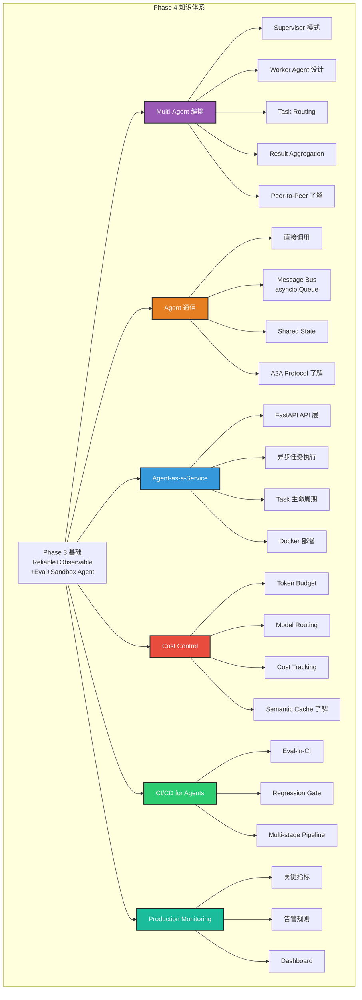
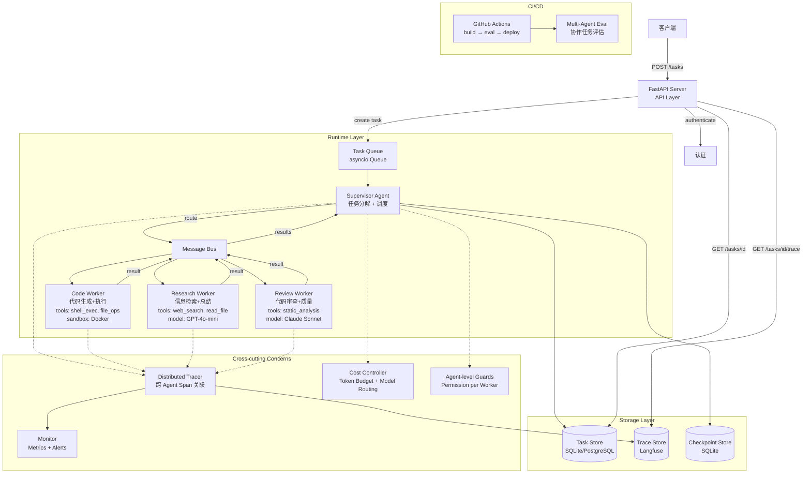
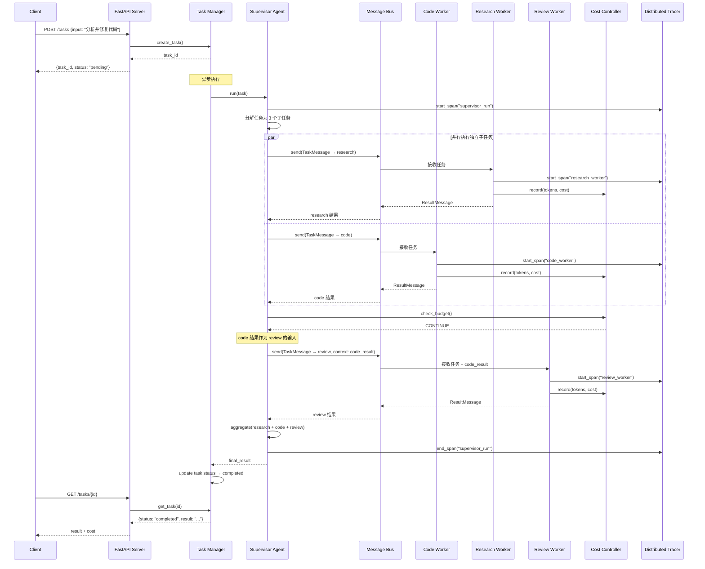

# Phase 4：Agent Harness Engineering — 架构实战

> **阶段**: 4 / 4 | **周期**: 3 周（每周 15~20 小时）| **定位**: 从单 Agent 到 Multi-Agent 生产级系统  
> **前置要求**: 完成 Phase 3（已有 Reliable + Observable + Eval + Sandboxed Agent）  
> **核心关键词**: Multi-Agent Coordination · Supervisor · Agent-as-a-Service · A2A Protocol · Cost Control · CI/CD · Production Architecture

---

## 1. 阶段定位

### 在学习路径中的位置

```
  Phase 1: 入门        Phase 2: 进阶        Phase 3: 提升         ★ Phase 4: 架构实战
  (Week 1-3)           (Week 4-6)           (Week 7-9)            (Week 10-12)

 ┌──────────────┐     ┌──────────────┐     ┌──────────────┐       ┌──────────────┐
 │ 理解Agent    │     │ 构建完整的   │     │ 可靠性 +     │       │★ 生产级Agent │
 │ 基本循环     │────→│ Tool+Memory  │────→│ 可观测 +     │──────→│  架构设计与  │
 │ 与控制流     │     │ +Planning    │     │ 评估体系     │       │  多Agent编排 │
 └──────────────┘     └──────────────┘     └──────────────┘       └──────────────┘
                                                                        │
                                                                    你在这里
```

### 核心目标与能力边界

**Phase 4 是整个学习路径的终点**——将 Phase 1-3 构建的单 agent harness 扩展为多 agent 协作系统，并包装为可部署的生产级服务。

**能力边界**：
- ✅ 能做到：Supervisor + Worker 多 agent 编排、Agent-to-Agent 通信（A2A 协议基础）、Agent-as-a-Service（FastAPI 包装）、分布式 Trace（跨 agent 追踪）、Multi-agent Eval、生产级 CI/CD（eval-in-CI + regression gate）、Cost Control（token budget + model routing + caching）、监控告警基础
- ❌ 不涉及：大规模集群部署（Kubernetes 生产运维）、完整的 MLOps 体系、自研 LLM 训练/微调

### 与前一阶段的衔接关系

**承接 Phase 3**：
- Phase 3 的单 agent harness（reliability + trace + eval + sandbox + guardrails）→ Phase 4 将其封装为 **Worker Agent**，在 Supervisor 协调下运行
- Phase 3 的 trace → Phase 4 扩展为 **分布式 trace**（跨 agent 关联 span）
- Phase 3 的 eval harness → Phase 4 扩展为 **multi-agent eval**（评估多 agent 协作效果）
- Phase 3 的 CI eval gate → Phase 4 扩展为 **完整 CI/CD**（build → eval → deploy → monitor）
- Phase 3 的 sandbox → Phase 4 扩展为 **per-agent sandbox**（每个 worker 独立容器）
- Phase 3 的 guardrails → Phase 4 扩展为 **agent-level permission**（Supervisor 控制每个 worker 的能力范围）

### Phase 4 完成后你能做什么

完成本阶段后，你具备以下完整能力：
1. **从零设计** Agent Harness 架构（单 agent 或 multi-agent）
2. **独立实现** 完整的 agent runtime（execution loop + tool + memory + planning + reliability + trace + eval + sandbox + guardrails）
3. **设计和实现** multi-agent 协作系统（supervisor / peer-to-peer / hierarchy）
4. **部署** Agent-as-a-Service（API 接口 + 容器化 + CI/CD）
5. **建立** 质量保障体系（eval harness + regression detection + CI gate）
6. **控制成本** 并为生产环境建立监控告警

---

## 2. 阶段学习目标

### 知识目标

| # | 目标 | 验证方式 |
|---|------|---------|
| K1 | 理解 Multi-Agent 三种编排模式（Supervisor / Peer-to-Peer / Hierarchy） | 能画图 + 对比分析 |
| K2 | 理解 Agent 通信机制（直接调用 / Message Bus / A2A Protocol） | 能设计通信协议 |
| K3 | 理解 Agent-as-a-Service 架构（API 层 / Runtime 层 / Storage 层） | 能画出部署架构 |
| K4 | 理解 Cost Control 策略（Token Budget / Model Routing / Semantic Cache） | 能设计成本控制方案 |
| K5 | 理解 Agent CI/CD（eval-in-CI / regression gate / canary deploy） | 能配置 CI/CD pipeline |
| K6 | 理解分布式 Trace / 监控告警基础 | 能设计监控方案 |

### 工程目标

| # | 目标 | 验证方式 |
|---|------|---------|
| E1 | 实现 Supervisor Agent + 3 个 Worker Agents | 多 agent 协作完成任务 |
| E2 | 实现 Agent 间通信（Message Bus） | Worker 间能传递结果 |
| E3 | 实现 Agent-as-a-Service（FastAPI） | HTTP API 可调用 |
| E4 | 实现 Cost Control（token budget + model routing） | 超预算时降级/停止 |
| E5 | 实现 Multi-agent Eval Harness | 评估协作效果 |
| E6 | 实现 docker-compose 一键部署 | 一行命令启动全部服务 |

### 项目目标

| # | 目标 |
|---|------|
| P1 | 完成 **Multi-Agent Orchestrated System**（Project 6：终极项目） |

---

## 3. 核心知识体系

### 模块 A：Multi-Agent 编排模式

**为什么重要**：单 agent 能力有限——一个 agent 处理所有任务既容易超出 context window 限制，也难以利用不同模型的各自优势。Multi-agent 系统通过分工协作来应对复杂任务。

**需掌握的深度**：
- **必须掌握**：
  - **Supervisor 模式**：一个 Supervisor agent 接收任务，分解为子任务，分配给 Worker agents，汇总结果。最常用，Phase 4 主力模式
  - **Worker Agent 设计**：每个 worker 聚焦一类能力（如 code_agent、research_agent、review_agent），拥有独立的 tool 集和 context
  - **Task 分配（routing）**：Supervisor 根据子任务类型 route 到对应 worker
  - **Result 汇总（aggregation）**：Supervisor 收集 worker 结果，合并为最终答案
  - **错误处理**：Worker 失败时的重试 / 替换 / 降级策略
- **了解即可**：
  - **Peer-to-Peer 模式**：agents 平级，通过 shared blackboard 或 message passing 协作
  - **Hierarchy 模式**：多层 supervisor 树（manager → team lead → worker）

**推荐学习顺序**：
1. 阅读 AutoGen v0.4 架构文档（Runtime + Agent + Team 概念）
2. 阅读 OpenHands 多 agent 协调代码（supervisor 如何 route 和 aggregate）
3. 设计自己的 Supervisor + 3 Workers 架构
4. 实现 Supervisor 的核心逻辑：decompose → route → execute → aggregate
5. 实现 Worker Agent：基于 Phase 3 的 agent 封装

**常见误区**：
- ❌ **每个子任务都用 agent** → 简单任务直接函数调用即可，只有需要推理/multi-step 的任务才值得用 agent
- ❌ **Worker 之间共享 context** → Worker 应该有独立 context，通过 Supervisor 传递必要信息
- ❌ **忽略 Supervisor 本身的 reliability** → Supervisor 也是 agent，也需要 retry/timeout/fallback

**与 Agent Harness 的关系**：Multi-agent 是 harness 在架构层的自然扩展。Phase 3 的 harness 管理单 agent，Phase 4 的 harness 管理"agent 组成的团队"。

---

### 模块 B：Agent 通信机制

**为什么重要**：Multi-agent 系统的核心挑战之一是 agent 之间如何高效传递信息。通信机制设计直接影响系统的可扩展性、可调试性和性能。

**需掌握的深度**：
- **必须掌握**：
  - **直接调用**：Supervisor 直接调用 Worker 的 `run()` 方法（最简单，适合单进程）
  - **Message Bus**：agents 通过中间件（内存队列 / Redis）传递消息（适合异步、可扩展）
  - **消息格式**：Task Message（input + metadata）→ Result Message（output + status + metrics）
  - **Shared State**：agents 通过共享存储（如 shared memory / shared database）协作
- **了解即可**：
  - **A2A Protocol**（Google）：标准化的 agent-to-agent 通信协议
  - **Agent Card**：描述 agent 能力的标准化元数据

**推荐学习顺序**：
1. 实现最简方案：直接函数调用（Supervisor 调用 Worker.run()）
2. 定义 Message 数据模型：`TaskMessage` / `ResultMessage` / `ErrorMessage`
3. 实现内存消息队列：`MessageBus` (asyncio.Queue based)
4. 将直接调用迁移为 Message Bus 通信
5. 实现 Shared State（supervisor 和 workers 共享一个 `SharedState` 对象）
6. 阅读 A2A Protocol spec（了解标准化趋势）

**常见误区**：
- ❌ **一开始就用复杂 MQ** → 单进程下用 asyncio.Queue 即可，不需要 Redis/Kafka
- ❌ **消息太大** → 不要在消息中传递完整 context，只传必要信息
- ❌ **没有超时** → 每条消息必须有 timeout，防止 worker 永不返回

**与 Agent Harness 的关系**：通信机制是 multi-agent harness 的"神经系统"。Message Bus 让 harness 能监控、记录、限流 agent 间的所有交互。

---

### 模块 C：Agent-as-a-Service 架构

**为什么重要**：Agent 不是命令行脚本——要在生产环境使用，必须包装为 HTTP 服务，支持多用户并发、异步执行、结果查询、认证授权。

**需掌握的深度**：
- **必须掌握**：
  - **API 设计**：`POST /tasks`（创建任务）→ `GET /tasks/{id}`（查询状态/结果）→ `POST /tasks/{id}/cancel`（取消）
  - **异步执行**：任务提交后立即返回 task_id → 后台异步执行 → 轮询或 webhook 获取结果
  - **三层架构**：API 层（FastAPI）→ Runtime 层（agent execution）→ Storage 层（task/result/trace 存储）
  - **容器化**：`Dockerfile` + `docker-compose.yml` 一键部署
- **了解即可**：
  - 认证授权（API key / OAuth）
  - Rate limiting / load balancing
  - 横向扩展（多 worker instance）
  - WebSocket 实时推送

**推荐学习顺序**：
1. FastAPI quickstart：写一个简单的 health check + CRUD API
2. 设计 Agent API：`POST /tasks` / `GET /tasks/{id}` / `GET /tasks/{id}/trace`
3. 实现异步任务执行：API 接收请求 → 放入 queue → worker 消费执行 → 写结果到 DB
4. 集成 agent harness 到 server：API → Supervisor → Workers → Result
5. 写 `Dockerfile` + `docker-compose.yml`
6. 加入 `/tasks/{id}/trace` 接口：查看 agent run 的 trace

**常见误区**：
- ❌ **同步执行 agent** → Agent 可能跑几分钟，必须异步执行
- ❌ **不存储任务状态** → task 必须有完整生命周期（pending → running → completed/failed）
- ❌ **一个进程一个 agent** → 用 asyncio / thread pool 支持并发

**与 Agent Harness 的关系**：Agent-as-a-Service 是 harness 的"对外接口"。API 层接收请求，harness（runtime）管理 agent 执行，storage 保存状态/trace/结果。

---

### 模块 D：Cost Control

**为什么重要**：Agent 的运行成本主要来自 LLM API 调用。一个不加控制的 multi-agent 系统在一次任务中可能消耗数十万 tokens（几美元到几十美元）。Cost control 是生产级 agent 的必备能力。

**需掌握的深度**：
- **必须掌握**：
  - **Token Budget**：为每次 agent run 设置 token 上限（超过则停止或降级）
  - **Model Routing**：简单任务用便宜模型（GPT-4o-mini / Claude Haiku），复杂任务用强模型（GPT-4o / Claude Sonnet）
  - **Cost Tracking**：记录每次 LLM 调用的 token 数和 cost，汇总到 trace
  - **Budget-aware Loop**：execution loop 在每步检查剩余 budget，超预算时降级或终止
- **了解即可**：
  - **Semantic Cache**：相似 query 命中缓存，避免重复 LLM 调用
  - **Prompt 优化**：减少 system prompt 长度、避免冗余 context
  - **批量推理**：batch API 降低成本

**推荐学习顺序**：
1. 实现 `CostTracker`：记录每次 LLM 调用的 input_tokens / output_tokens / model / cost
2. 在 execution loop 中集成 cost tracking：每步结束后更新累计 cost
3. 实现 `BudgetManager`：设置 token_budget → 每步检查 → 超预算时触发降级/终止
4. 实现 Model Router：根据任务复杂度选择模型（rule-based 即可）
5. （可选）实现 Semantic Cache：embedding + 相似度搜索，缓存 LLM 响应

**常见误区**：
- ❌ **不追踪 cost** → 等到账单来了才发现超支
- ❌ **一律用最贵模型** → 80% 的子任务用便宜模型就能完成，只有复杂推理用贵模型
- ❌ **超预算直接终止** → 应该先降级（换便宜模型），直到降无可降再终止

**与 Agent Harness 的关系**：Cost control 是 harness 的"财务管控"。Harness 中的 execution loop 在每步执行 budget check，对超预算的 agent 执行降级或终止。

---

### 模块 E：CI/CD for Agents

**为什么重要**：Agent 的每次修改（prompt、tool、model、config）都可能影响行为。传统测试无法覆盖非确定性行为，需要 eval-in-CI 来保障质量。

**需掌握的深度**：
- **必须掌握**：
  - **Eval-in-CI**：在 CI pipeline 中自动运行 eval，regression 时 block merge（Phase 3 已有基础）
  - **Regression Gate**：对比当前 eval 结果与 baseline，超过阈值（如 pass rate 下降 >5%）时 fail
  - **Pipeline 设计**：build → unit test → eval（lightweight subset）→ deploy（staging）→ eval（full suite）
- **了解即可**：
  - Canary deploy：新版本导 5% 流量 → 观察指标 → 逐步扩大
  - Blue-green deploy

**推荐学习顺序**：
1. 扩展 Phase 3 的 `.github/workflows/eval.yml`
2. 加入 multi-stage：fast eval（5 min）→ full eval（30 min）
3. 实现 regression report 和 GitHub PR comment
4. 设计 deploy workflow（build image → push → deploy staging → eval → promote）

**与 Agent Harness 的关系**：CI/CD 是 harness 的"质量门禁"。从代码变更到生产部署的全链路质量保障。

---

### 模块 F：Production Monitoring

**为什么重要**：Agent 在生产环境中面对的输入多样性远超测试环境。需要实时监控关键指标，在问题发生时快速发现和定位。

**需掌握的深度**：
- **必须掌握**：
  - **关键指标**：task_completion_rate、avg_steps、avg_latency、avg_cost、error_rate、tool_failure_rate
  - **告警规则**：error_rate > 10% → alert、avg_cost > 2x baseline → alert
  - **Dashboard 设计**：实时指标 + 趋势 + 告警历史
- **了解即可**：Prometheus + Grafana 集成、anomaly detection

**与 Agent Harness 的关系**：Monitoring 是 harness 的"生产运维能力"。Harness 将 trace 和 metrics 数据暴露给监控系统。

---

## 4. 阶段架构图

### 架构图 1：Phase 4 知识架构



### 架构图 2：Multi-Agent Orchestrated System 生产架构



---

## 5. 分周学习计划

### Week 10：Multi-Agent 编排 + 通信

| 维度 | 内容 |
|------|------|
| **学习主题** | Supervisor + Worker 多 agent 架构实现 + Agent 间通信 |
| **输入材料** | ① AutoGen v0.4 仓库架构文档（Runtime / Agent / Team 概念，~2h）<br>② OpenHands 多 agent 协调代码（supervisor / delegation，~1.5h）<br>③ Google A2A 协议 README（~30min，了解即可）<br>④ LangGraph multi-agent 示例 |
| **实践任务** | ① 设计 Multi-Agent 架构：Supervisor + 3 Workers（Code / Research / Review）<br>② 实现 `agents/supervisor.py`：任务分解 → worker routing → result aggregation<br>③ 实现 `agents/workers/code_agent.py`：基于 Phase 3 agent 封装，专注代码任务<br>④ 实现 `agents/workers/research_agent.py`：信息检索 + 总结<br>⑤ 实现 `agents/workers/review_agent.py`：代码审查 + 质量检查<br>⑥ 实现 `communication/message.py`：TaskMessage / ResultMessage / ErrorMessage<br>⑦ 实现 `communication/message_bus.py`：asyncio.Queue-based message bus<br>⑧ 实现 `communication/shared_state.py`：supervisor 和 workers 共享状态<br>⑨ 为 Supervisor 接入 Phase 3 的 reliability（retry/timeout for worker calls）<br>⑩ 实现第一个 multi-agent demo：Supervisor 将复杂任务分解给 3 个 Worker |
| **检查点** | □ Supervisor 能将"分析这段代码并修复 bug"拆为子任务<br>□ 3 个 Worker 各自执行子任务并返回结果<br>□ Supervisor 汇总 3 个结果为最终答案<br>□ Worker 失败时 Supervisor 能 retry 或 fallback |
| **预期产出** | ✅ `agents/supervisor.py` + 3 个 worker agents<br>✅ `communication/` 模块（message + bus + shared state）<br>✅ Multi-agent demo 可运行<br>✅ AutoGen 源码阅读笔记 |

---

### Week 11：Agent-as-a-Service + Cost Control + 分布式 Trace

| 维度 | 内容 |
|------|------|
| **学习主题** | FastAPI 包装 + 异步执行 + 成本控制 + 分布式 Trace |
| **输入材料** | ① FastAPI 官方教程：[First Steps](https://fastapi.tiangolo.com/tutorial/first-steps/)（~1h）<br>② FastAPI Background Tasks / asyncio patterns<br>③ OpenAI / Anthropic pricing pages（理解 token cost 计算） |
| **实践任务** | ① 实现 `server/app.py`：FastAPI 应用（`POST /tasks`、`GET /tasks/{id}`、`POST /tasks/{id}/cancel`、`GET /tasks/{id}/trace`）<br>② 实现 `server/task_manager.py`：异步任务管理（pending → running → completed/failed）<br>③ 实现 `cost/tracker.py`：记录每次 LLM 调用的 tokens + model + cost<br>④ 实现 `cost/budget.py`：BudgetManager（token budget → 超预算降级/终止）<br>⑤ 实现 `cost/router.py`：Model Router（简单任务 → mini 模型，复杂任务 → 强模型）<br>⑥ 在 execution loop 中集成 budget check（每步检查 → 超预算时降级模型 → 仍超则终止）<br>⑦ 扩展 Phase 3 的 tracer：支持跨 agent 的分布式 trace（parent trace → child agent trace 关联）<br>⑧ 在 Langfuse 中查看 multi-agent run 的完整 trace 树<br>⑨ 编写 `Dockerfile`（单容器，包含 API + agents）<br>⑩ 编写 `docker-compose.yml`（API service + sandbox containers） |
| **检查点** | □ `curl POST /tasks` 创建任务 → 返回 task_id<br>□ `curl GET /tasks/{id}` 查看状态 + 结果<br>□ Agent run 超过 token budget → 自动降级模型 → 最终终止<br>□ Langfuse trace 树显示 Supervisor → Worker 的完整 span 关联<br>□ `docker-compose up` 一键启动全部服务 |
| **预期产出** | ✅ `server/` 模块（FastAPI app + task manager）<br>✅ `cost/` 模块（tracker + budget + router）<br>✅ 分布式 trace 可在 Langfuse 查看<br>✅ `Dockerfile` + `docker-compose.yml` |

---

### Week 12：Multi-Agent Eval + CI/CD + 监控 + 总结

| 维度 | 内容 |
|------|------|
| **学习主题** | 多 agent 评估 + 完整 CI/CD + 监控告警 + 全课程总结 |
| **输入材料** | ① Phase 3 的 eval harness 代码（扩展为 multi-agent eval）<br>② GitHub Actions 进阶用法（matrix build、artifacts）<br>③ 回顾整个学习路径的源码和笔记 |
| **实践任务** | ① 扩展 eval harness：实现 multi-agent eval tasks（需要多 agent 协作的任务）<br>② 编写 10+ multi-agent eval tasks：多步协作任务、agent 间依赖任务、错误恢复任务<br>③ 扩展 CI pipeline：multi-stage（fast eval → full eval → deploy staging → smoke test）<br>④ 实现 `/metrics` endpoint：暴露关键指标（JSON 格式）<br>⑤ 定义告警规则：error_rate > 10% / avg_cost > 2x baseline / completion_rate < 80%<br>⑥ 实现简单告警：检测异常 → 输出到日志/控制台（生产环境可接 PagerDuty/Slack）<br>⑦ 运行完整 eval suite（单 agent + multi-agent），确认全部通过<br>⑧ 编写**架构决策文档** ADR（Architecture Decision Records）<br>⑨ 编写**全量学习总结**（12 周回顾 + 关键收获 + 未来方向）<br>⑩ 准备一次 30 分钟的架构演示（demo + slide） |
| **检查点** | □ Multi-agent eval 10+ tasks 通过率 ≥ 75%<br>□ CI pipeline 完整运行通过<br>□ `/metrics` 返回关键指标<br>□ 告警规则触发测试通过<br>□ Phase 1-3 的所有 demo 和 eval 不回归<br>□ 架构演示准备就绪 |
| **预期产出** | ✅ Multi-agent eval tasks + 报告<br>✅ 完整 CI/CD pipeline<br>✅ 监控 + 告警基础<br>✅ ADR 文档<br>✅ **12 周全量学习总结**<br>✅ 架构演示材料 |

---

## 6. 每周执行建议

### 建议投入时长

| 活动 | 时间分配 | 说明 |
|------|---------|------|
| 阅读资料/文档 | 15%（2~3h/周） | AutoGen 架构、FastAPI、A2A 协议 |
| 阅读源码 | 15%（2~3h/周） | 重点精读 AutoGen Runtime、OpenHands |
| 自己实现代码 | 45%（7~9h/周） | 编排、通信、API、部署 |
| 测试/调试/运维 | 15%（2~3h/周） | Eval、Docker、CI pipeline |
| 画图/写笔记/总结 | 10%（1.5~2h/周） | ADR、学习总结、演示 |

### 学习节奏

**Week 10**：看源码 25% / 写代码 50% / 测试 15% / 总结 10%
- 重点：multi-agent 架构实现，代码密度高

**Week 11**：看文档 15% / 写代码 50% / 测试 25% / 总结 10%
- 重点：API + Docker 部署 + Cost control，需要大量调试

**Week 12**：写代码 30% / 测试 20% / 总结 50%
- 重点：Eval + CI + 全量总结，文档产出集中在本周

### 如何避免"只看不练"

1. **Multi-agent：先跑一个 2-agent demo → 再扩展到 3 agent**。不要一开始就设计完美的 architecture
2. **API：先实现 `POST /tasks` + `GET /tasks/{id}` 两个接口** → 再加其他功能
3. **Docker：先能 build image → 再加 docker-compose → 再加 resource limits**
4. **Cost control：先统计 cost → 再加 budget → 再加 model routing**。有数据才能做决策
5. **每个功能做完立即跑 eval**。不要最后一天才集成

---

## 7. 推荐参考项目与源码阅读路径

### 项目 1：AutoGen v0.4

| 维度 | 内容 |
|------|------|
| **仓库** | [microsoft/autogen](https://github.com/microsoft/autogen) |
| **推荐理由** | Phase 4 最核心参考。业界最成熟的 multi-agent 框架，v0.4 重构后架构清晰（Runtime + Agent + Team） |
| **阅读重点模块** | ① `python/packages/autogen-core/` — 核心 Runtime<br>② `python/packages/autogen-agentchat/` — AgentChat 团队协作<br>③ 架构文档（README + design docs） |
| **阅读策略** | Week 10 精读 core Runtime 概念 + AgentChat（~2h），泛读 design docs（~1h） |
| **学完获得能力** | 理解 multi-agent runtime 设计；理解 agent 团队协作模式；为自己的 supervisor/worker 架构提供参考 |

### 项目 2：OpenHands（完整阅读）

| 维度 | 内容 |
|------|------|
| **仓库** | [All-Hands-AI/OpenHands](https://github.com/All-Hands-AI/OpenHands) |
| **推荐理由** | 业界最完整的开源 Agent 平台。涵盖 runtime、sandbox、multi-agent delegation、API server、eval |
| **阅读重点模块** | ① `openhands/server/` — API 层设计<br>② `openhands/controller/` — Supervisor/Delegation 逻辑<br>③ 之前读过的 `runtime/`（回顾 sandbox）<br>④ `evaluation/` — eval 集成 |
| **阅读策略** | Week 10-11 分散精读，每次 1-2 个模块（总 ~3h） |
| **学完获得能力** | 理解生产级 agent 平台全景；API 设计参考；明白"完整的 agent 产品"是什么样 |

### 项目 3：Google A2A Protocol

| 维度 | 内容 |
|------|------|
| **仓库** | [google-a2a/A2A](https://github.com/google/A2A) |
| **推荐理由** | Agent-to-Agent 通信的标准化趋势。了解行业方向 |
| **阅读策略** | Week 10 泛读 README + protocol spec（~30min） |
| **学完获得能力** | 了解 A2A 通信标准化方向；Agent Card 概念；为未来多平台 agent 互操作做知识储备 |

### 补充阅读

| # | 资源 | 阅读重点 |
|---|------|---------|
| 1 | [Goose](https://github.com/block/goose) 架构文档 | MCP-native agent，理解 MCP 在 production 中的使用 |
| 2 | [FastAPI 官方文档](https://fastapi.tiangolo.com/) | API 实现参考，重点看 background tasks 和 dependency injection |
| 3 | [Docker Compose 文档](https://docs.docker.com/compose/) | 多服务编排 |
| 4 | OpenAI / Anthropic Pricing Pages | 理解 token pricing，用于 cost control 实现 |

---

## 8. 阶段实践项目设计

### Project 6：Multi-Agent Orchestrated System（终极项目）

#### 项目目标与适合理由

将 Phase 1-3 的全部能力整合为一个 **完整的多 agent 协作系统**，包装为 **可部署的 API 服务**。这是整个 12 周学习的最终产物——展示你掌握了从 execution loop 到生产部署的 Agent Harness Engineering 全栈能力。

#### 功能范围 + MVP 版本

**MVP（Week 10 结束）**：
- Supervisor + 2 Workers（Code + Research）
- 直接调用通信
- CLI 可运行

**V2（Week 11 结束）**：
- Supervisor + 3 Workers
- Message Bus 通信
- FastAPI API
- Cost control
- Distributed trace
- Docker 部署

**Final（Week 12 结束）**：
- Multi-agent eval（10+ tasks）
- CI/CD pipeline
- 监控 + 告警基础
- 完整文档

#### 推荐技术栈

```
Python 3.12+
├── Phase 3 全部依赖
├── fastapi            — API Server
├── uvicorn            — ASGI Server
├── httpx              — HTTP Client（测试用）
├── docker             — Docker SDK
├── docker-compose     — 编排
└── rich               — CLI UI
```

#### 完整目录结构

```
agent-harness/
├── main.py                     # CLI 入口
├── server/
│   ├── __init__.py
│   ├── app.py                  # FastAPI 应用
│   ├── routes.py               # API 路由
│   └── task_manager.py         # 异步任务管理
├── agents/
│   ├── __init__.py
│   ├── supervisor.py           # ★ Supervisor Agent
│   └── workers/
│       ├── __init__.py
│       ├── code_agent.py       # Code Worker
│       ├── research_agent.py   # Research Worker
│       └── review_agent.py     # Review Worker
├── communication/
│   ├── __init__.py
│   ├── message.py              # Message 数据模型
│   ├── message_bus.py          # asyncio.Queue-based bus
│   └── shared_state.py         # Shared State
├── agent/
│   ├── __init__.py
│   ├── loop.py                 # ★ Execution Loop（Phase 1 起）
│   ├── state.py                # AgentState
│   └── config.py               # 配置管理
├── tools/
│   ├── __init__.py
│   ├── registry.py             # Tool Registry（Phase 2 起）
│   ├── router.py               # Tool Router（Phase 2 起）
│   ├── executor.py             # Tool Executor（Phase 2 起）
│   ├── mcp_client.py           # MCP Client（Phase 2 起）
│   └── definitions/            # 各种 tool 定义
├── memory/
│   ├── __init__.py
│   ├── working.py              # Working Memory（Phase 2 起）
│   ├── episodic.py             # Episodic Memory（Phase 2 起）
│   └── manager.py              # Memory Manager
├── context/
│   ├── __init__.py
│   ├── assembler.py            # Context Assembler（Phase 2 起）
│   └── token_counter.py        # Token Counter
├── planning/
│   ├── __init__.py
│   └── planner.py              # Planner（Phase 2 起）
├── reliability/
│   ├── __init__.py
│   ├── retry.py                # Retry（Phase 3 起）
│   ├── timeout.py              # Timeout（Phase 3 起）
│   ├── fallback.py             # Fallback（Phase 3 起）
│   ├── circuit_breaker.py      # Circuit Breaker（Phase 3 起）
│   └── checkpoint.py           # Checkpoint（Phase 3 起）
├── trace/
│   ├── __init__.py
│   ├── tracer.py               # Tracer（Phase 3 起, Phase 4 扩展分布式）
│   ├── exporter.py             # Exporter（Phase 3 起）
│   └── logger.py               # Structured Logger（Phase 3 起）
├── metrics/
│   ├── __init__.py
│   └── collector.py            # Metrics Collector（Phase 3 起）
├── eval/
│   ├── __init__.py
│   ├── task.py                 # Task 定义（Phase 3 起）
│   ├── suite.py                # Task Suite（Phase 3 起）
│   ├── runner.py               # Agent Runner（Phase 3 起, Phase 4 扩展 multi-agent）
│   ├── scorer.py               # Scorer（Phase 3 起）
│   ├── reporter.py             # Reporter（Phase 3 起）
│   ├── regression.py           # Regression Detector（Phase 3 起）
│   ├── tasks/
│   │   ├── single_agent/       # Phase 3 的 eval tasks
│   │   └── multi_agent/        # ★ Phase 4 新增
│   └── cli.py                  # CLI 入口
├── sandbox/
│   ├── __init__.py
│   ├── docker_sandbox.py       # Docker Sandbox（Phase 3 起）
│   └── resource_limits.py      # Resource Limits（Phase 3 起）
├── guardrails/
│   ├── __init__.py
│   ├── input_guard.py          # Input Guardrails（Phase 3 起）
│   ├── output_guard.py         # Output Guardrails（Phase 3 起）
│   ├── permission.py           # Permission Model（Phase 3 起, Phase 4 扩展 agent-level）
│   └── approval_gate.py        # HITL Approval（Phase 3 起）
├── cost/
│   ├── __init__.py
│   ├── tracker.py              # ★ Cost Tracker
│   ├── budget.py               # ★ Budget Manager
│   └── router.py               # ★ Model Router
├── monitor/
│   ├── __init__.py
│   ├── metrics_endpoint.py     # ★ /metrics API
│   └── alerts.py               # ★ 告警规则
├── docs/
│   ├── adr/                    # Architecture Decision Records
│   ├── reliability_checklist.md
│   ├── threat_model.md
│   ├── eval_methodology.md
│   └── learning_summary.md     # ★ 12 周全量总结
├── .github/
│   └── workflows/
│       ├── eval.yml            # CI Eval Pipeline
│       └── deploy.yml          # ★ Deploy Pipeline
├── Dockerfile                  # ★ 容器镜像
├── docker-compose.yml          # ★ 多服务编排
├── pyproject.toml
└── README.md
```

#### 核心实现示例

**Supervisor Agent 骨架**（`agents/supervisor.py`）：

```python
from dataclasses import dataclass
from typing import Optional
from communication.message import TaskMessage, ResultMessage
from communication.message_bus import MessageBus

@dataclass
class SubTask:
    id: str
    description: str
    worker_type: str   # "code" | "research" | "review"
    dependencies: list[str] = None  # 依赖的 subtask ids

class SupervisorAgent:
    def __init__(self, workers: dict, bus: MessageBus, cost_budget: float):
        self.workers = workers          # {"code": CodeAgent, "research": ResearchAgent, ...}
        self.bus = bus
        self.cost_budget = cost_budget
        self.cost_tracker = CostTracker()

    async def run(self, task: str) -> str:
        # 1. 分解任务
        subtasks = await self._decompose(task)
        
        # 2. 按依赖顺序执行
        results = {}
        for subtask in self._topological_sort(subtasks):
            # 检查 budget
            if self.cost_tracker.total_cost > self.cost_budget:
                return self._aggregate_partial(results, reason="budget_exceeded")
            
            # 3. 路由到 worker
            worker = self.workers[subtask.worker_type]
            dep_results = {d: results[d] for d in (subtask.dependencies or []) if d in results}
            
            # 4. 发送消息 + 等待结果（with retry）
            msg = TaskMessage(task_id=subtask.id, input=subtask.description, context=dep_results)
            result = await self._execute_with_retry(worker, msg)
            results[subtask.id] = result
        
        # 5. 汇总
        return await self._aggregate(task, results)

    async def _decompose(self, task: str) -> list[SubTask]:
        # 用 LLM 分解任务为子任务
        ...

    async def _execute_with_retry(self, worker, msg: TaskMessage, max_retries=2) -> ResultMessage:
        # retry + timeout + fallback
        ...

    async def _aggregate(self, original_task: str, results: dict) -> str:
        # 用 LLM 合并所有子任务结果
        ...
```

**FastAPI Server 骨架**（`server/app.py`）：

```python
from fastapi import FastAPI, BackgroundTasks
from pydantic import BaseModel
from server.task_manager import TaskManager

app = FastAPI(title="Agent Harness API")
task_manager = TaskManager()

class CreateTaskRequest(BaseModel):
    input: str
    config: dict = {}

class TaskResponse(BaseModel):
    task_id: str
    status: str
    result: str | None = None
    cost: float | None = None

@app.post("/tasks", response_model=TaskResponse)
async def create_task(req: CreateTaskRequest, bg: BackgroundTasks):
    task = task_manager.create(req.input, req.config)
    bg.add_task(task_manager.execute, task.id)
    return TaskResponse(task_id=task.id, status="pending")

@app.get("/tasks/{task_id}", response_model=TaskResponse)
async def get_task(task_id: str):
    task = task_manager.get(task_id)
    return TaskResponse(
        task_id=task.id, status=task.status,
        result=task.result, cost=task.cost,
    )

@app.get("/tasks/{task_id}/trace")
async def get_trace(task_id: str):
    return task_manager.get_trace(task_id)

@app.get("/metrics")
async def get_metrics():
    return task_manager.get_metrics()
```

**Cost Budget Manager 骨架**（`cost/budget.py`）：

```python
from dataclasses import dataclass
from enum import Enum

class BudgetAction(Enum):
    CONTINUE = "continue"
    DOWNGRADE = "downgrade"
    TERMINATE = "terminate"

@dataclass
class BudgetConfig:
    max_tokens: int = 100_000
    max_cost_usd: float = 1.0
    downgrade_threshold: float = 0.7   # 70% 时开始降级
    terminate_threshold: float = 0.95  # 95% 时终止

class BudgetManager:
    def __init__(self, config: BudgetConfig):
        self.config = config
        self.total_tokens = 0
        self.total_cost = 0.0

    def record(self, tokens: int, cost: float):
        self.total_tokens += tokens
        self.total_cost += cost

    def check(self) -> BudgetAction:
        ratio = max(
            self.total_tokens / self.config.max_tokens,
            self.total_cost / self.config.max_cost_usd,
        )
        if ratio >= self.config.terminate_threshold:
            return BudgetAction.TERMINATE
        elif ratio >= self.config.downgrade_threshold:
            return BudgetAction.DOWNGRADE
        return BudgetAction.CONTINUE

    def get_recommended_model(self, default_model: str) -> str:
        action = self.check()
        if action == BudgetAction.DOWNGRADE:
            return self._downgrade_model(default_model)
        return default_model

    def _downgrade_model(self, model: str) -> str:
        downgrades = {
            "gpt-4o": "gpt-4o-mini",
            "claude-sonnet-4-20250514": "claude-haiku-4-20250414",
        }
        return downgrades.get(model, model)
```

#### 验收标准

| # | 标准 | 如何验证 |
|---|------|---------|
| 1 | Supervisor 分解复杂任务 → 分配给 3 个 Worker → 汇总结果 | 运行 demo |
| 2 | Worker 间通过 Message Bus 通信 | 查看 message log |
| 3 | `POST /tasks` 创建任务 → `GET /tasks/{id}` 查看结果 | curl 测试 |
| 4 | Token budget 超过 70% → 自动降级模型 | 设置低 budget 测试 |
| 5 | 分布式 trace 在 Langfuse 中可见 | 打开 dashboard |
| 6 | Multi-agent eval 10+ tasks 通过率 ≥ 75% | 运行 eval |
| 7 | `docker-compose up` 一键启动 | 命令运行 |
| 8 | CI pipeline 完整通过 | 查看 GitHub Actions |
| 9 | Phase 1-3 全部 demo + eval 不回归 | 运行回归测试 |

---

## 9. 项目架构图

### Multi-Agent 交互时序



### Phase 4 完成后的 Complete Agent Harness 全景

```
┌─────────────────────────────────────────────────────────────────────┐
│                        Agent Harness — Final Architecture           │
│                                                                     │
│  ┌─ API Layer ──────────────────────────────────────────────────┐   │
│  │  FastAPI: POST /tasks · GET /tasks/{id} · GET /trace · ...  │   │
│  └──────────────────────────┬───────────────────────────────────┘   │
│                              │                                      │
│  ┌─ Orchestration Layer ────▼──────────────────────────────────┐   │
│  │                     Supervisor Agent                         │   │
│  │     decompose() → route() → execute() → aggregate()         │   │
│  │                         │                                    │   │
│  │     ┌──────────┬────────┼────────┬──────────┐               │   │
│  │     ▼          ▼        ▼        ▼          ▼               │   │
│  │  ┌──────┐ ┌──────┐ ┌──────┐ ┌──────┐  Message               │   │
│  │  │ Code │ │Resrch│ │Review│ │ ...  │  Bus                    │   │
│  │  │Worker│ │Worker│ │Worker│ │Worker│                         │   │
│  │  └──┬───┘ └──┬───┘ └──┬───┘ └──┬───┘                        │   │
│  └─────┼────────┼────────┼────────┼────────────────────────────┘   │
│        │        │        │        │                                 │
│  ┌─ Agent Runtime (per Worker) ───────────────────────────────┐    │
│  │                                                             │    │
│  │  ┌─────────────────────────────────────────────────────┐   │    │
│  │  │              Execution Loop                          │   │    │
│  │  │  input_guard → planner → ctx_assemble → LLM call    │   │    │
│  │  │  → output_guard → permission → tool_exec → memory   │   │    │
│  │  │  → checkpoint → trace → metrics → term_check        │   │    │
│  │  └─────────────────────────────────────────────────────┘   │    │
│  │                                                             │    │
│  │  ┌─────────┐ ┌────────┐ ┌────────┐ ┌────────┐ ┌────────┐ │    │
│  │  │  Tools  │ │ Memory │ │Planning│ │Context │ │Sandbox │ │    │
│  │  │Registry │ │Working │ │Planner │ │Assemblr│ │Docker  │ │    │
│  │  │Router   │ │Episodic│ │        │ │TokenCnt│ │ResLmt  │ │    │
│  │  │Executor │ │Manager │ │        │ │        │ │        │ │    │
│  │  │MCP      │ │        │ │        │ │        │ │        │ │    │
│  │  └─────────┘ └────────┘ └────────┘ └────────┘ └────────┘ │    │
│  │                                                             │    │
│  │  ┌──────────┐ ┌──────────┐ ┌──────────┐ ┌──────────────┐  │    │
│  │  │Reliability│ │  Trace   │ │Guardrails│ │ Cost Control │  │    │
│  │  │Retry     │ │Tracer    │ │Input     │ │Tracker       │  │    │
│  │  │Timeout   │ │Exporter  │ │Output    │ │Budget        │  │    │
│  │  │Fallback  │ │Logger    │ │Permissn  │ │ModelRouter   │  │    │
│  │  │CircBrkr  │ │          │ │Approval  │ │              │  │    │
│  │  │Checkpoint│ │          │ │          │ │              │  │    │
│  │  └──────────┘ └──────────┘ └──────────┘ └──────────────┘  │    │
│  └─────────────────────────────────────────────────────────────┘    │
│                                                                     │
│  ┌─ Quality & Operations ──────────────────────────────────────┐   │
│  │                                                              │   │
│  │  ┌────────────┐  ┌────────────┐  ┌────────────┐             │   │
│  │  │ Eval       │  │ CI/CD      │  │ Monitor    │             │   │
│  │  │ TaskSuite  │  │ eval.yml   │  │ /metrics   │             │   │
│  │  │ Runner     │  │ deploy.yml │  │ Alerts     │             │   │
│  │  │ Scorer     │  │ Regression │  │ Dashboard  │             │   │
│  │  │ Reporter   │  │ Gate       │  │            │             │   │
│  │  └────────────┘  └────────────┘  └────────────┘             │   │
│  └──────────────────────────────────────────────────────────────┘   │
│                                                                     │
│  ┌─ Storage Layer ─────────────────────────────────────────────┐   │
│  │  SQLite/PG: Tasks, Checkpoints  │  Langfuse: Traces       │   │
│  │  ChromaDB: Episodic Memory      │  JSON: Eval Results     │   │
│  └──────────────────────────────────────────────────────────────┘   │
│                                                                     │
│  ┌─ Deployment ────────────────────────────────────────────────┐   │
│  │  docker-compose.yml: API + Sandbox Containers               │   │
│  └──────────────────────────────────────────────────────────────┘   │
└─────────────────────────────────────────────────────────────────────┘
```

---

## 10. 阶段输出物清单

| # | 输出物 | 类型 | 描述 |
|---|-------|------|------|
| 1 | **Supervisor Agent** | 代码 | 任务分解 + worker routing + result aggregation |
| 2 | **3 Worker Agents** | 代码 | Code / Research / Review 三个专业 worker |
| 3 | **Communication 模块** | 代码 | Message 模型 + Message Bus + Shared State |
| 4 | **FastAPI Server** | 代码 | Agent-as-a-Service API |
| 5 | **Task Manager** | 代码 | 异步任务管理（生命周期、持久化） |
| 6 | **Cost Control 模块** | 代码 | Token tracker + Budget manager + Model router |
| 7 | **分布式 Trace** | 代码 | 跨 agent span 关联 |
| 8 | **Multi-agent Eval Tasks** | 数据 | 10+ multi-agent 协作任务 |
| 9 | **CI/CD Pipeline** | CI 配置 | eval.yml（multi-stage）+ deploy.yml |
| 10 | **Monitor + Alerts** | 代码 | /metrics endpoint + 告警规则 |
| 11 | **Dockerfile + docker-compose.yml** | 部署 | 一键容器化部署 |
| 12 | **ADR 文档** | 文档 | 架构决策记录（3~5 个关键决策） |
| 13 | **12 周全量学习总结** | 文档 | 学习路径回顾 + 关键收获 + 未来方向 |
| 14 | **架构演示材料** | 演示 | 30 分钟 demo + 架构讲解 |
| 15 | **完整的 agent-harness 代码仓库** | 仓库 | Phase 1-4 全部代码，可运行 |

---

## 11. 阶段验收标准

### 知识掌握（5 项）

| # | 标准 | 验证方式 |
|---|------|---------|
| 1 | 能画出 Supervisor + Worker multi-agent 架构图并解释数据流 | 白板画图 |
| 2 | 能对比三种 agent 通信方式（直接调用 / Message Bus / A2A）的优劣 | 口头 |
| 3 | 能设计 Agent-as-a-Service 的 API 和三层架构 | 设计文档 |
| 4 | 能设计 cost control 方案（budget → downgrade → terminate） | 设计文档 |
| 5 | 能解释 agent CI/CD pipeline 的每个阶段及其作用 | 口头 |

### 独立实现能力（3 项）

| # | 标准 | 验证方式 |
|---|------|---------|
| 1 | 能在 3 小时内为一个新任务设计 Supervisor + Worker 架构并实现核心逻辑 | 限时编码 |
| 2 | 能在 2 小时内用 FastAPI 包装一个 agent 为 API 服务 | 限时编码 |
| 3 | 能在 1 小时内为 multi-agent 系统实现 cost budget + model routing | 限时编码 |

### 系统级验证（5 项）

| # | 标准 | 如何验证 |
|---|------|---------|
| 1 | Multi-agent 端到端 demo：给定复杂任务 → Supervisor 分解 → Workers 执行 → 结果返回 | 运行 demo |
| 2 | API 可用：`curl POST /tasks` → `GET /tasks/{id}` 查看结果 | HTTP 测试 |
| 3 | Cost 可控：设置低 budget → agent 自动降级 → 最终在 budget 内完成或优雅终止 | 设置低 budget |
| 4 | Eval 全部通过：单 agent 20+ tasks + multi-agent 10+ tasks 通过率 ≥ 75% | 运行 eval |
| 5 | 一键部署：`docker-compose up` → 全部服务启动 → API 可访问 | 命令执行 |

### 文档完整度（3 项）

| # | 标准 |
|---|------|
| 1 | ADR 文档（3-5 个关键架构决策及其 rationale） |
| 2 | 12 周全量学习总结 |
| 3 | 完整的 README（安装、运行、API 文档、架构图） |

---

## 12. 常见问题与避坑建议

### 坑 1：Supervisor 成为瓶颈

**现象**：Supervisor 处理所有 routing 和 aggregation，成为性能瓶颈  
**原因**：所有子任务串行通过 Supervisor  
**规避**：  
- 独立子任务并行执行（用 `asyncio.gather`）  
- 只有有依赖关系的子任务才串行  
- Supervisor 的 LLM 调用用便宜模型，只做 routing 不做复杂推理

### 坑 2：Worker 间信息传递不足

**现象**：Review Worker 不知道 Code Worker 产出了什么  
**原因**：Message 中没有携带前置 worker 的结果  
**规避**：  
- Supervisor 在发送 TaskMessage 时，将依赖的 subtask 结果放入 `context` 字段  
- 或通过 Shared State 让 Worker 自己查询

### 坑 3：Docker 环境配置复杂

**现象**：`docker-compose up` 启动失败、端口冲突、volume 权限问题  
**原因**：Docker 配置没有经过充分测试  
**规避**：  
- 先确保单个 `Dockerfile` 能 build 和 run  
- 再逐步加入 docker-compose  
- 使用固定端口、相对路径 volume  
- 提供 `.env.example` 文件

### 坑 4：Cost 计算不准确

**现象**：实际花费远超 budget 预估  
**原因**：① 没计算 system prompt 的 tokens ② 忘了计算 tool definitions 的 tokens ③ retry 的 tokens 没计入  
**规避**：  
- Cost tracking 要包含**所有** LLM 调用（包括 retry）  
- 记得 tool definitions 也算 input tokens
- 使用 response 中的 `usage` 字段而非自己估算

### 坑 5：Multi-agent Eval 设计太简单

**现象**：Multi-agent eval 全部 pass，但真实场景下协作不佳  
**原因**：Eval tasks 没有测试"协作质量"  
**规避**：设计这几类 multi-agent eval tasks：  
- **协作必要型**：任务必须由多个 worker 配合完成  
- **依赖传递型**：worker B 依赖 worker A 的输出  
- **冲突解决型**：两个 worker 的建议矛盾，Supervisor 需要决断  
- **部分失败型**：一个 worker 失败，Supervisor 需要 fallback

### 坑 6：忘记回归测试

**现象**：Phase 4 新功能开发后，Phase 1-3 的 demo 和 eval 开始失败  
**原因**：代码修改影响了底层模块  
**规避**：  
- 每完成一个功能，立即运行全量 eval（单 agent + multi-agent）  
- CI pipeline 包含 Phase 1-3 的 regression test  
- 保留 Phase 1-3 的 baseline eval results

### 不要过深的内容

- ❌ Kubernetes 集群部署（docker-compose 足以演示）
- ❌ 完整的 MLOps 体系（超出 agent harness 范围）
- ❌ 自研 A2A Protocol 实现（了解概念即可）
- ❌ 复杂的 load balancing / auto-scaling（Phase 4 不涉及）
- ❌ 完整的认证授权体系（API key 足矣）

---

## 13. 进入下一阶段前的准备

Phase 4 是本学习路径的最后一个阶段。完成后没有"下一阶段"，但有**持续精进的方向**。

### 必须补齐的内容

| # | 内容 | 状态检查 |
|---|------|---------|
| 1 | Multi-agent 端到端 demo 可运行 | □ 演示通过 |
| 2 | API 可用 + Docker 可部署 | □ `curl` + `docker-compose up` 成功 |
| 3 | Cost control 生效 | □ 超 budget 测试通过 |
| 4 | 全量 eval 通过 | □ 单 agent + multi-agent pass rate ≥ 75% |
| 5 | CI pipeline 完整 | □ GitHub Actions pass |
| 6 | Phase 1-3 不回归 | □ 所有旧 demo + eval 通过 |
| 7 | 12 周学习总结完成 | □ 文档完成 |

### 完成后的持续精进方向

| 方向 | 描述 | 推荐时机 |
|------|------|---------|
| **深入 Eval** | 构建更大规模的 eval suite（100+ tasks），学习统计方法（置信区间、显著性检验） | 完成后 1-2 月 |
| **Agent 安全** | 深入 prompt injection 防御、红队测试、adversarial eval | 完成后 1-2 月 |
| **生产部署** | Kubernetes 部署、横向扩展、canary deploy、完整监控 | 有生产需求时 |
| **Multi-agent 高级** | Peer-to-peer 协作、hierarchical structures、自适应 routing | 有复杂场景需求时 |
| **Agent 研究前沿** | Agent reasoning、self-reflection、meta-learning | 对研究感兴趣时 |
| **特定领域** | SWE-agent（代码）、research agent（学术）、data agent（分析）等垂直领域 | 有领域需求时 |

### 最终 Checklist

完成以下所有项目，标志着 Agent Harness Engineering 学习路径完成：

- [ ] **Phase 1**: Execution Loop + ReAct + 基础 Tool 调用 → Minimal Agent
- [ ] **Phase 2**: Tool Orchestration + Memory + Planning + MCP → Tool+Memory Agent
- [ ] **Phase 3**: Reliability + Trace + Eval + Sandbox + Guardrails → Reliable Agent
- [ ] **Phase 4**: Multi-Agent + API + Cost Control + CI/CD → Production Multi-Agent System
- [ ] **文档**: 可靠性 Checklist + Threat Model + Eval 方法论 + ADR + 学习总结
- [ ] **Eval**: 30+ eval tasks（单 agent + multi-agent），通过率 ≥ 75%
- [ ] **部署**: `docker-compose up` 一键启动全部服务
- [ ] **演示**: 30 分钟架构演示（从 execution loop 到 production architecture）

---

> **上一阶段**：[Phase 3 — Agent Harness Engineering 提升](Phase-3-Agent-Harness-Engineering-提升.md)  
> **完整学习方案**：[Agent Harness Engineering 学习方案](Agent-Harness-Engineering-学习方案.md)  
> 恭喜完成全部 4 个阶段的学习！
